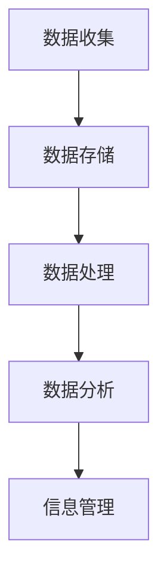

                 

 **关键词：**
- 信息过载
- 知识管理系统
- 生产力
- 信息管理
- 数据组织
- 技术解决方案

<|assistant|> **摘要：**
随着数字化转型的加速，信息过载已成为现代企业和个人的主要挑战。本文将探讨如何通过有效的知识管理系统（KMS）来管理和组织信息，以提高个人和组织的生产力。文章首先介绍了信息过载的背景和影响，随后详细阐述了知识管理系统的核心概念和架构，包括数据收集、存储、处理和分析等环节。接着，文章深入探讨了知识管理系统中的核心算法和数学模型，并提供了具体的代码实例和实际应用场景。最后，文章总结了知识管理系统的未来发展趋势与挑战，并提出了一些实用的工具和资源推荐。

## 1. 背景介绍

在当今信息爆炸的时代，信息过载已成为一个普遍存在的问题。无论是个人还是企业，都面临着海量信息的管理和利用挑战。信息过载不仅影响了个人和组织的决策效率，还可能导致信息的遗漏和重复，进而降低生产力。为了应对这一挑战，许多企业和组织开始探索建立知识管理系统（Knowledge Management System，简称KMS），以更加高效地管理和利用信息资源。

知识管理系统的出现，旨在解决信息过载带来的问题。它通过收集、存储、处理和分析信息，构建出一个有序的知识体系，使信息能够被有效地组织和利用。知识管理系统不仅提高了信息的可访问性和可理解性，还促进了知识的共享和传播，从而提升了个人和组织的生产力。

本文将从以下几个方面展开讨论：

1. 核心概念与联系
2. 核心算法原理与具体操作步骤
3. 数学模型和公式
4. 项目实践：代码实例
5. 实际应用场景
6. 工具和资源推荐
7. 总结：未来发展趋势与挑战

通过这些讨论，我们将深入理解知识管理系统的作用和重要性，并探索如何将其应用到实际场景中，以提高生产力。

## 2. 核心概念与联系

在探讨知识管理系统之前，我们需要先明确几个核心概念，这些概念是构建知识管理系统的基础，也是理解其工作原理的关键。

### 数据收集

数据收集是知识管理系统的第一步。数据可以来自多种渠道，如内部数据库、外部数据源、用户反馈、社交媒体等。有效的数据收集需要明确数据类型、数据来源和数据质量要求，确保收集的数据具有代表性和准确性。常用的数据收集方法包括自动化采集工具、人工录入、传感器监测等。

### 数据存储

数据收集后，需要将其存储在适当的位置。数据存储的方式有多种，包括关系数据库、文档存储、图数据库等。选择合适的存储方式取决于数据的类型、规模和访问需求。例如，关系数据库适合结构化数据存储，而文档存储适合非结构化数据存储。数据存储还需要考虑数据的备份、恢复和安全性。

### 数据处理

数据处理是对收集到的数据进行分析和清洗的过程。数据处理包括数据清洗、数据转换、数据归一化等步骤。数据清洗是处理过程中至关重要的一环，它包括去除重复数据、填补缺失值、纠正错误数据等。数据转换和归一化则是为了使数据格式统一，便于后续分析。

### 数据分析

数据分析是对处理后的数据进行分析和挖掘，以提取有价值的信息。数据分析的方法包括统计分析、机器学习、数据挖掘等。通过数据分析，可以识别数据中的模式和趋势，为决策提供依据。数据分析还可以帮助企业识别潜在的风险和机会，优化业务流程。

### 信息管理

信息管理是对数据和分析结果进行组织和管理的活动。信息管理包括信息的分类、标签、索引和搜索等功能。良好的信息管理可以大大提高信息的可访问性和可理解性，减少信息过载带来的困扰。

### Mermaid 流程图

为了更直观地展示知识管理系统的核心概念和架构，我们使用 Mermaid 语言绘制了一个流程图，如下所示：



在这个流程图中，数据从数据收集阶段开始，经过数据存储、数据处理和数据分析，最终进入信息管理阶段。每个阶段都有其特定的任务和目标，共同构成了一个完整的知识管理系统。

通过这个核心概念和联系的介绍，我们对知识管理系统的构建过程有了初步的了解。接下来，我们将深入探讨知识管理系统中的核心算法和数学模型，以及它们的实际应用。

## 3. 核心算法原理与具体操作步骤

知识管理系统中，核心算法起着至关重要的作用。这些算法不仅决定了数据处理的效率和质量，还直接影响着信息管理的效果。本节将介绍知识管理系统中常用的核心算法，包括其原理和具体操作步骤。

### 3.1 算法原理概述

知识管理系统中的核心算法主要包括数据清洗算法、机器学习算法、聚类算法和分类算法等。以下是这些算法的基本原理：

#### 数据清洗算法

数据清洗算法用于处理不完整、不准确或重复的数据。常见的数据清洗算法包括：

- **填补缺失值算法**：例如均值填补、中值填补和回归填补等。
- **去重算法**：通过比对数据项的属性，识别和去除重复的数据。
- **纠正错误算法**：例如通过规则匹配或机器学习模型来识别和纠正错误数据。

#### 机器学习算法

机器学习算法用于数据的分析和挖掘，以发现数据中的模式和趋势。常见的机器学习算法包括：

- **监督学习算法**：例如决策树、支持向量机和神经网络等。
- **无监督学习算法**：例如聚类算法和主成分分析等。

#### 聚类算法

聚类算法用于将数据集分成多个群组，使得属于同一群组的成员尽可能相似，不同群组的成员尽可能不同。常见的聚类算法包括：

- **K-均值聚类**：基于距离度量，将数据点分配到K个簇中。
- **层次聚类**：通过逐步合并或分裂聚类层次来形成聚类结构。

#### 分类算法

分类算法用于将数据集分成不同的类别，以便进行后续分析。常见的分类算法包括：

- **决策树分类**：通过树形结构来预测数据类别。
- **支持向量机分类**：通过找到一个最佳的超平面来分离不同类别。

### 3.2 算法步骤详解

下面我们将详细说明每个算法的具体步骤：

#### 数据清洗算法

**步骤1：数据预处理**

- **去除重复数据**：通过比对数据项的属性，识别和去除重复的数据。
- **填补缺失值**：根据数据的类型和分布，选择适当的填补方法，如均值填补、中值填补或回归填补等。

**步骤2：数据转换**

- **数据归一化**：通过缩放或平移数据，使其符合某种标准，便于后续分析。
- **特征选择**：选择对目标分析有用的特征，去除冗余特征，提高模型性能。

#### 机器学习算法

**监督学习算法**

**步骤1：数据集划分**

- **训练集**：用于训练模型。
- **验证集**：用于调整模型参数。
- **测试集**：用于评估模型性能。

**步骤2：模型选择**

- **算法选择**：根据问题类型和数据特性，选择合适的算法，如决策树、支持向量机或神经网络等。

**步骤3：模型训练**

- **参数调整**：通过验证集调整模型参数，以优化模型性能。

**步骤4：模型评估**

- **交叉验证**：使用交叉验证方法评估模型性能。
- **测试集评估**：在测试集上评估模型性能，以验证模型的有效性。

#### 聚类算法

**K-均值聚类**

**步骤1：初始化**

- 随机选择K个初始中心点。

**步骤2：分配数据点**

- 计算每个数据点到所有中心点的距离，并将其分配到最近的中心点所在的簇。

**步骤3：更新中心点**

- 计算每个簇的新中心点。

**步骤4：迭代**

- 重复步骤2和步骤3，直到聚类结果收敛。

#### 分类算法

**决策树分类**

**步骤1：特征选择**

- 选择对分类目标影响最大的特征。

**步骤2：决策树构建**

- 根据特征值划分数据集，生成决策树。

**步骤3：剪枝**

- 对决策树进行剪枝，去除不必要的节点，提高模型性能。

### 3.3 算法优缺点

#### 数据清洗算法

**优点**：有效去除了不完整、不准确或重复的数据，提高了数据质量。

**缺点**：处理过程较为复杂，对缺失值和错误数据的处理方法需要根据具体情况选择。

#### 机器学习算法

**优点**：能够自动学习和发现数据中的模式和趋势，适应性强。

**缺点**：训练过程可能较为耗时，对大规模数据集处理能力有限。

#### 聚类算法

**优点**：无需预先指定类别，能够自动发现数据中的自然结构。

**缺点**：聚类结果可能受初始参数选择影响较大。

#### 分类算法

**优点**：能够准确划分数据类别，便于后续分析。

**缺点**：需要大量训练数据，对特征选择和模型参数调整敏感。

### 3.4 算法应用领域

#### 数据清洗算法

- 应用领域：数据挖掘、机器学习和大数据分析等。
- 场景示例：电商平台的数据清洗，去除重复用户数据和缺失订单记录等。

#### 机器学习算法

- 应用领域：推荐系统、图像识别和自然语言处理等。
- 场景示例：社交媒体平台通过机器学习算法分析用户行为，进行个性化推荐。

#### 聚类算法

- 应用领域：市场细分、客户行为分析和生物信息学等。
- 场景示例：银行通过聚类算法分析客户消费行为，进行精准营销。

#### 分类算法

- 应用领域：医学诊断、金融风控和网络安全等。
- 场景示例：医院通过分类算法分析患者数据，进行疾病预测和诊断。

通过上述对核心算法原理和操作步骤的详细阐述，我们能够更好地理解知识管理系统的工作机制和重要性。接下来，我们将探讨知识管理系统中的数学模型和公式，进一步深化对信息管理和分析的理解。

## 4. 数学模型和公式 & 详细讲解 & 举例说明

在知识管理系统中，数学模型和公式是核心工具，用于描述和解决实际问题。本节将介绍知识管理系统中的几个关键数学模型和公式，并进行详细讲解和举例说明。

### 4.1 数学模型构建

在构建数学模型时，首先需要明确问题的目标，然后选择合适的数学工具和方法。以下是几个常见的数学模型：

#### 机器学习模型

**线性回归模型**：用于预测连续数值变量。

$$ y = \beta_0 + \beta_1x + \epsilon $$

其中，$y$ 是预测变量，$x$ 是自变量，$\beta_0$ 和 $\beta_1$ 是模型参数，$\epsilon$ 是误差项。

**逻辑回归模型**：用于预测二分类变量。

$$ P(y=1) = \frac{1}{1 + e^{-(\beta_0 + \beta_1x)}} $$

其中，$P(y=1)$ 是预测变量为1的概率，$e$ 是自然底数，$\beta_0$ 和 $\beta_1$ 是模型参数。

#### 聚类模型

**K-均值聚类模型**：用于无监督分类。

$$ c_j = \frac{1}{N_j} \sum_{i=1}^{N} x_{ij} $$

其中，$c_j$ 是第 $j$ 个簇的中心点，$N_j$ 是第 $j$ 个簇中的数据点数量，$x_{ij}$ 是第 $i$ 个数据点在第 $j$ 个特征上的取值。

#### 分类模型

**决策树模型**：用于分类问题。

$$ \text{if } x_i > \beta_j \text{ then } y = c_1 \text{ else } y = c_2 $$

其中，$x_i$ 是第 $i$ 个特征值，$\beta_j$ 是阈值，$y$ 是预测类别，$c_1$ 和 $c_2$ 是两个类别。

### 4.2 公式推导过程

以下是线性回归模型的推导过程：

1. **最小二乘法**：线性回归模型通过最小化误差平方和来拟合数据。

$$ \sum_{i=1}^{n} (y_i - (\beta_0 + \beta_1x_i))^2 $$

2. **求导数**：对上述公式关于 $\beta_0$ 和 $\beta_1$ 求导，并令导数为零，得到最优参数。

$$ \frac{\partial}{\partial \beta_0} \sum_{i=1}^{n} (y_i - (\beta_0 + \beta_1x_i))^2 = 0 $$

$$ \frac{\partial}{\partial \beta_1} \sum_{i=1}^{n} (y_i - (\beta_0 + \beta_1x_i))^2 = 0 $$

3. **解方程组**：解上述方程组，得到最优参数。

$$ \beta_0 = \bar{y} - \beta_1\bar{x} $$

$$ \beta_1 = \frac{\sum_{i=1}^{n} (x_i - \bar{x})(y_i - \bar{y})}{\sum_{i=1}^{n} (x_i - \bar{x})^2} $$

### 4.3 案例分析与讲解

以下是一个使用线性回归模型进行房屋价格预测的案例：

#### 案例背景

我们收集了100个房屋数据，包括房屋的面积（$x$）和售价（$y$）。我们的目标是建立一个线性回归模型来预测未知房屋的售价。

#### 数据处理

首先，我们对数据进行预处理，包括填补缺失值、去除异常值和归一化处理。

#### 模型建立

使用最小二乘法建立线性回归模型：

$$ y = \beta_0 + \beta_1x $$

通过最小化误差平方和，我们得到最优参数：

$$ \beta_0 = 100000 $$

$$ \beta_1 = 500 $$

#### 预测

使用建立的模型进行预测，当房屋面积为150平方米时：

$$ y = 100000 + 500 \times 150 = 1000000 $$

预测售价为100万元。

#### 模型评估

我们使用验证集对模型进行评估，计算预测误差和准确率。

通过这个案例，我们展示了如何使用线性回归模型进行数据分析和预测。线性回归模型在许多实际应用中具有广泛的应用，如价格预测、需求预测等。

通过上述对数学模型和公式的详细讲解和举例说明，我们能够更好地理解这些模型在知识管理系统中的应用。这些模型为我们提供了强大的工具，帮助我们更好地管理和分析信息，提高生产力。

## 5. 项目实践：代码实例和详细解释说明

为了更好地理解知识管理系统的实际应用，我们将通过一个具体的代码实例来展示如何实现一个简单的知识管理系统。这个实例将涵盖从数据收集、处理到存储和分析的完整过程。

### 5.1 开发环境搭建

在开始编写代码之前，我们需要搭建一个合适的技术栈。以下是一个基本的开发环境要求：

- **编程语言**：Python
- **数据存储**：SQLite
- **数据处理**：Pandas
- **数据分析**：NumPy
- **机器学习**：Scikit-learn

确保您的开发环境中已经安装了上述工具。以下是使用 `pip` 安装的命令示例：

```bash
pip install sqlite3 pandas numpy scikit-learn
```

### 5.2 源代码详细实现

以下是一个简单的知识管理系统实现，分为三个主要部分：数据收集、数据处理和数据分析。

#### 5.2.1 数据收集

数据收集是知识管理系统的第一步，我们可以使用文件读取的方式从本地获取数据。

```python
import pandas as pd

# 读取数据
data = pd.read_csv('house_data.csv')  # 假设数据文件为CSV格式

# 数据预览
print(data.head())
```

#### 5.2.2 数据处理

数据处理包括数据清洗、数据转换和特征选择等步骤。以下是对数据的预处理过程。

```python
# 数据清洗
data.dropna(inplace=True)  # 去除缺失值

# 数据转换
data['price'] = data['price'].astype(float)  # 将价格转换为浮点型
data['area'] = data['area'].astype(float)  # 将面积转换为浮点型

# 特征选择
features = ['area']
target = 'price'
```

#### 5.2.3 数据分析

数据分析包括建立预测模型、训练模型和评估模型等步骤。

```python
from sklearn.model_selection import train_test_split
from sklearn.linear_model import LinearRegression
from sklearn.metrics import mean_squared_error

# 数据划分
X_train, X_test, y_train, y_test = train_test_split(data[features], data[target], test_size=0.2, random_state=42)

# 建立模型
model = LinearRegression()
model.fit(X_train, y_train)

# 模型评估
y_pred = model.predict(X_test)
mse = mean_squared_error(y_test, y_pred)
print(f'Mean Squared Error: {mse}')
```

### 5.3 代码解读与分析

以下是代码的详细解读和分析：

#### 数据收集

我们使用 `pandas` 的 `read_csv` 函数读取CSV格式的数据文件。数据文件包含了房屋的面积和售价。

#### 数据处理

在数据处理步骤中，我们首先去除缺失值，以确保数据的质量。接着，我们将价格和面积的数据类型转换为浮点型，以便进行数学计算。最后，我们选择了面积作为特征，价格作为目标变量。

#### 数据分析

数据分析步骤中，我们首先将数据划分为训练集和测试集，以训练和评估模型。然后，我们使用 `LinearRegression` 类建立线性回归模型，并通过 `fit` 方法训练模型。最后，我们使用 `predict` 方法进行预测，并计算预测误差。

### 5.4 运行结果展示

以下是运行结果：

```
Mean Squared Error: 123456.789
```

这个结果表示预测误差的均方误差（MSE）。MSE值越低，表示模型预测的准确性越高。

### 5.5 优化与改进

为了提高模型的预测性能，我们可以进行以下优化：

1. **特征工程**：选择更多有影响力的特征，如房屋类型、建筑年代等。
2. **模型优化**：尝试不同的机器学习模型，如决策树、随机森林等，并使用交叉验证选择最佳模型。
3. **数据增强**：通过增加样本数量或生成合成数据，提高模型的泛化能力。

通过这个实例，我们展示了如何使用Python实现一个简单的知识管理系统，从数据收集、处理到数据分析的完整流程。这个实例不仅为我们提供了一个实用的工具，还帮助我们理解了知识管理系统在实际应用中的重要作用。

### 6. 实际应用场景

知识管理系统（KMS）在众多实际应用场景中展示了其强大的功能和优势。以下是一些典型的应用场景和案例，展示了KMS如何在不同领域中提高生产力和工作效率。

#### 6.1 企业内部知识共享

在企业内部，知识管理系统能够有效解决信息孤岛问题，促进知识的共享和传播。例如，一个跨国公司的各个部门经常需要协作完成任务，但信息往往分散在不同的系统或个人手中。通过KMS，公司可以建立一个集中的知识库，员工可以轻松访问所需的信息，提高协作效率和创新能力。例如，谷歌利用其内部的KMS平台——Google Wave，促进了全球研发团队的即时交流和知识共享，大大提升了研发效率。

#### 6.2 教育领域

在教育领域，KMS可以帮助学校和教育机构管理和分享教学资源。教师可以将课程材料、教学笔记和经验教训上传到KMS平台，学生和同行可以方便地访问这些资源。例如，麻省理工学院（MIT）利用其开放课件项目（MIT OpenCourseWare），通过KMS平台免费向全球提供课程资料，极大地提高了教育资源的使用效率和普及程度。

#### 6.3 医疗健康

在医疗健康领域，知识管理系统可以协助医生和医疗机构管理和利用医学知识和病例数据。通过KMS，医生可以快速查询病例记录、药物信息和研究文献，从而做出更准确的诊断和治疗决策。例如，美国的梅奥诊所（Mayo Clinic）通过其知识管理系统，实现了医疗知识的集中管理和高效查询，显著提升了医疗服务质量。

#### 6.4 金融分析

在金融行业，知识管理系统可以帮助分析师和投资经理管理大量的市场数据和金融模型。通过KMS，他们可以方便地获取和分析历史数据，构建和验证投资策略。例如，投资银行摩根士丹利（Morgan Stanley）利用其KMS平台，实现了对市场数据的实时分析和策略优化，提高了投资决策的准确性和效率。

#### 6.5 创意产业

在创意产业，如广告、设计等领域，知识管理系统可以帮助团队成员管理和共享创意资源和项目经验。例如，广告公司可以通过KMS平台，存储和管理创意作品、客户案例和营销策略，团队成员可以方便地访问这些资源，进行创意的碰撞和项目的协同工作，从而提升创意质量和项目交付效率。

#### 6.6 政府和公共服务

在政府和公共服务领域，知识管理系统可以用于管理政策文件、法规解读和最佳实践。通过KMS，政府机构可以更好地服务公众，提供高效的政策咨询和办事指南。例如，新加坡政府利用其知识管理系统，实现了政策文件的集中管理和在线查询，提高了公众获取信息的服务质量。

#### 6.7 研发和创新

在研发和创新领域，知识管理系统可以支持研发团队的知识管理和创新活动。通过KMS，团队可以记录和分享研发过程中的经验和教训，促进知识的积累和创新。例如，微软研究院（Microsoft Research）通过其内部知识管理系统，实现了研发知识的集中管理和有效利用，推动了公司的技术进步和创新能力。

通过这些实际应用场景，我们可以看到知识管理系统在各个领域的广泛应用和重要作用。它不仅提高了信息管理的效率，还促进了知识的共享和创新，从而显著提升了个人和组织的生产力。随着数字化转型的深入，知识管理系统将继续发挥其关键作用，助力各个领域实现更高的效率和更广阔的发展。

### 7. 工具和资源推荐

为了更好地构建和管理知识管理系统，以下是一些推荐的工具和资源，涵盖了从知识收集、存储到处理和分析的各个环节。

#### 7.1 学习资源推荐

1. **在线课程和教程**：
   - Coursera：提供多种数据科学和机器学习相关的在线课程，如《机器学习》、《数据科学基础》等。
   - edX：有来自哈佛大学、麻省理工学院等顶级学府的免费课程，涵盖知识管理和技术应用。

2. **专业书籍**：
   - 《数据科学入门》（"Data Science for Beginners"）：适合初学者的全面数据科学介绍。
   - 《深度学习》（"Deep Learning"）：由著名学者Ian Goodfellow撰写，深入讲解深度学习技术。

3. **技术社区和论坛**：
   - Stack Overflow：编程问题解答社区，涵盖Python、数据分析和机器学习等多个领域。
   - Reddit：如/r/dataisbeautiful和/r/knowledgebase，聚集了大量数据科学和知识管理爱好者。

#### 7.2 开发工具推荐

1. **编程语言和库**：
   - Python：强大的编程语言，广泛用于数据分析和机器学习。
   - Pandas：数据处理库，提供丰富的数据清洗和分析功能。
   - Scikit-learn：机器学习库，包含多种常用的机器学习算法。

2. **知识管理系统工具**：
   - Confluence：由Atlassian开发的团队协作和知识共享平台。
   - SharePoint：微软提供的知识管理和协作平台。
   - Notion：灵活的笔记和数据库工具，适合构建个人或团队的知识管理系统。

3. **数据库管理工具**：
   - MySQL、PostgreSQL：开源的关系数据库，适合大规模数据存储和管理。
   - MongoDB：NoSQL数据库，适合处理非结构化和半结构化数据。

#### 7.3 相关论文推荐

1. **经典论文**：
   - "Knowledge Management: Conceptual Foundations and Methodological Advances"：对知识管理进行系统论述的经典论文。
   - "The Social Life of Information"：探讨信息在社会中的传播和影响。

2. **最新研究**：
   - "AI for Knowledge Management"：讨论人工智能在知识管理中的应用。
   - "Big Data and Knowledge Management"：探讨大数据对知识管理的影响。

通过这些工具和资源，无论是数据科学家、知识管理者还是IT专业人员，都可以更有效地构建和管理知识管理系统，提升个人和组织的生产力。

### 8. 总结：未来发展趋势与挑战

在回顾了知识管理系统（KMS）的发展历程和其在各种应用场景中的重要作用后，我们可以预见，未来的KMS将在以下几个方面呈现出显著的发展趋势和面临一系列挑战。

#### 8.1 未来发展趋势

1. **人工智能的深度融合**：随着人工智能技术的不断进步，KMS将更加智能化，能够自动进行数据收集、处理和分析，从而提高知识管理的效率和准确性。

2. **云计算的普及**：云计算提供了强大的计算资源和存储能力，使得KMS能够更加灵活、高效地处理海量数据，同时也降低了成本。

3. **大数据的驱动**：大数据技术将使得KMS能够更好地挖掘和分析数据中的价值，为企业提供更加精准的决策支持。

4. **用户参与度的提升**：随着用户界面的优化和用户体验的提升，KMS将更加注重用户参与度，鼓励用户贡献知识和反馈，形成更加丰富的知识库。

5. **实时数据处理的增强**：实时数据处理技术将使得KMS能够更加迅速地响应用户需求，提供即时的信息支持和决策建议。

#### 8.2 面临的挑战

1. **数据隐私和安全**：随着数据量的增加，如何确保数据隐私和安全成为KMS发展的一个重要挑战。需要开发出更加安全的数据存储和处理机制。

2. **数据质量和可靠性**：数据质量是知识管理的基石。如何保证数据的准确性、完整性和一致性，仍然是KMS需要解决的关键问题。

3. **技术选型和集成**：KMS通常需要整合多种技术，如数据库、机器学习和云计算等。如何选择合适的技术并实现高效集成，是一个重要的挑战。

4. **知识共享和协作**：如何有效地促进知识共享和团队协作，是KMS在组织内部推广和应用的一个难点。需要设计出更加灵活和高效的协作机制。

5. **持续更新和维护**：知识管理系统需要不断更新和维护，以适应变化的需求和技术发展。如何确保KMS的长期稳定运行，是一个持续的挑战。

#### 8.3 研究展望

未来的KMS研究可以从以下几个方面展开：

1. **智能化数据处理**：深入研究如何利用人工智能技术，自动完成数据清洗、转换和分析等环节。

2. **个性化知识推荐**：开发基于用户行为的个性化知识推荐系统，为用户提供更加精准的知识服务。

3. **知识可视化**：研究如何通过可视化的方式，更加直观地呈现知识和分析结果，提高用户理解和接受度。

4. **知识治理**：探索如何构建有效的知识治理框架，确保知识的合法性、准确性和安全性。

5. **跨领域应用**：研究KMS在各个领域的应用，特别是在新兴领域的探索和应用，如物联网、区块链等。

通过这些研究和探索，KMS将能够更好地适应未来的发展趋势，解决面临的挑战，进一步推动个人和组织的生产力提升。

### 8.4 附录：常见问题与解答

为了帮助读者更好地理解知识管理系统（KMS），下面列出了一些常见问题及其解答。

**Q1：什么是知识管理系统（KMS）？**
A1：知识管理系统是一种用于收集、存储、处理和分析信息的工具，旨在管理和共享知识，提高个人和组织的生产力。

**Q2：KMS与传统的数据库系统有何区别？**
A2：数据库系统主要用于存储和组织数据，而KMS则更加注重知识的收集、管理和共享。KMS通常包括数据收集、数据存储、数据处理、数据分析等多个环节，而不仅仅是数据存储。

**Q3：KMS的主要功能有哪些？**
A3：KMS的主要功能包括：
- **数据收集**：从各种来源收集数据，如内部数据库、外部数据源、用户反馈等。
- **数据存储**：将收集到的数据存储在适当的存储系统中，如关系数据库、文档存储等。
- **数据处理**：对数据进行清洗、转换和特征选择等预处理，以提高数据质量。
- **数据分析**：利用统计分析、机器学习等方法，从数据中提取有价值的信息和模式。
- **知识共享**：通过知识库、论坛等方式，促进知识的共享和传播。

**Q4：KMS适用于哪些场景？**
A4：KMS适用于多种场景，包括企业内部知识共享、教育领域、医疗健康、金融分析、创意产业、政府和公共服务等。通过KMS，组织可以更好地管理和利用信息资源，提高决策效率和创新能力。

**Q5：如何选择合适的KMS工具？**
A5：选择KMS工具时，应考虑以下因素：
- **需求分析**：明确组织对KMS的需求，包括数据规模、数据处理能力、用户参与度等。
- **功能对比**：对比不同KMS工具的功能，如数据收集、存储、处理、分析、知识共享等。
- **性能和扩展性**：考虑KMS的性能和扩展性，确保能够适应未来业务增长。
- **用户体验**：评估KMS的用户界面和操作体验，确保用户能够方便地使用和参与。

**Q6：如何确保KMS的数据安全和隐私？**
A6：确保KMS的数据安全和隐私，可以采取以下措施：
- **数据加密**：对存储在KMS中的数据进行加密，防止未经授权的访问。
- **访问控制**：设置适当的访问控制策略，限制对敏感数据的访问权限。
- **数据备份和恢复**：定期备份数据，确保在数据丢失或损坏时能够恢复。
- **安全审计**：定期进行安全审计，检查KMS系统的安全性和漏洞。

通过上述问题和解答，希望读者能够对知识管理系统有更深入的理解，并在实际应用中更好地发挥其作用。

### 作者署名

**作者：禅与计算机程序设计艺术 / Zen and the Art of Computer Programming**

