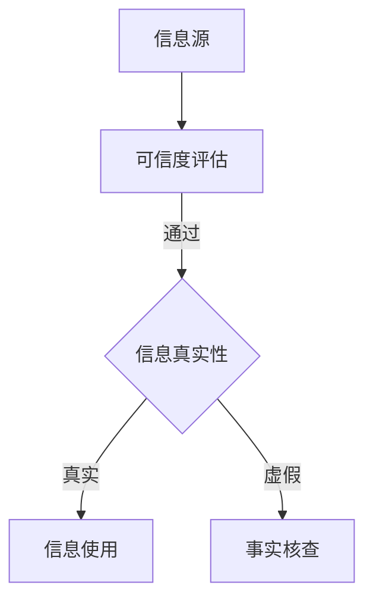

                 

关键词：信息验证，在线媒体素养，假新闻，媒体操纵，人工智能，技术策略，教育，数据隐私，网络安全。

> 摘要：本文深入探讨了信息验证与在线媒体素养教育的必要性，以及人工智能技术在其中的应用。随着假新闻和媒体操纵现象的日益猖獗，如何培养大众的媒体素养和验证信息的真实性，成为当前社会关注的重要课题。本文将分析其背景，介绍核心概念，并详细阐述算法原理、数学模型、项目实践和未来应用展望，为应对这一挑战提供系统性解决方案。

## 1. 背景介绍

在互联网迅速发展的今天，信息爆炸已成为普遍现象。社交媒体、新闻网站和在线论坛等平台，成为信息传播的主要渠道。然而，假新闻、谣言和虚假信息也随之而来，对社会造成了严重的影响。媒体操纵手段的日益复杂，使得信息验证变得更加困难。

这种情况下，提高大众的媒体素养，培养信息验证的能力，成为当务之急。同时，人工智能技术在信息验证与媒体素养教育中发挥着关键作用。通过对大量数据的分析，人工智能可以识别出假新闻的规律，提供可信的信息源，并帮助用户培养批判性思维。

## 2. 核心概念与联系

### 2.1 信息验证

信息验证是指通过一系列方法和手段，对信息进行核实和判断，确保其真实性和准确性。在信息验证过程中，涉及到的核心概念包括：

- **信息源**：指提供信息的来源，包括新闻网站、社交媒体、论坛等。
- **可信度评估**：对信息源的可靠性进行评估，判断其是否有可信度。
- **事实核查**：对信息内容进行核实，确保其符合事实。

### 2.2 媒体素养

媒体素养是指个体在接触和使用媒体时所具备的知识、技能和态度。核心概念包括：

- **批判性思维**：对信息进行批判性分析，识别出信息的真实性和可靠性。
- **信息检索**：通过多种渠道获取信息，并进行筛选和评估。
- **版权和隐私**：了解媒体内容的版权和使用隐私保护。

### 2.3 人工智能在信息验证中的应用

人工智能在信息验证中扮演着重要角色，主要包括以下几个方面：

- **文本分析**：利用自然语言处理技术，对文本内容进行分析和识别，找出潜在的假新闻。
- **图像识别**：通过计算机视觉技术，识别图像中的信息，如人物、场景等，以验证图像的真实性。
- **数据挖掘**：从大量数据中挖掘出规律和模式，为信息验证提供支持。

### 2.4 Mermaid 流程图

下面是一个简化的 Mermaid 流程图，展示了信息验证的基本流程：



## 3. 核心算法原理 & 具体操作步骤

### 3.1 算法原理概述

信息验证的核心算法主要包括文本分析、图像识别和数据挖掘。这些算法的基本原理如下：

- **文本分析**：利用自然语言处理技术，对文本进行语义分析，识别出潜在的假新闻特征，如关键词重复、语义不一致等。
- **图像识别**：利用计算机视觉技术，对图像进行分析，识别出图像中的信息，如人物、场景等，以验证图像的真实性。
- **数据挖掘**：从大量数据中挖掘出规律和模式，为信息验证提供支持。

### 3.2 算法步骤详解

- **文本分析**：
  1. 预处理：对文本进行清洗和标准化，去除无关信息。
  2. 语义分析：利用自然语言处理技术，对文本进行语义分析。
  3. 特征提取：从语义分析结果中提取特征，如关键词、句子结构等。
  4. 模型训练：利用已标注的数据集，训练分类模型，识别出潜在的假新闻。
- **图像识别**：
  1. 预处理：对图像进行预处理，如灰度化、缩放等。
  2. 特征提取：利用计算机视觉技术，提取图像中的特征，如边缘、纹理等。
  3. 模型训练：利用已标注的数据集，训练分类模型，识别出图像中的信息。
- **数据挖掘**：
  1. 数据收集：收集大量相关数据，如新闻文章、社交媒体帖子等。
  2. 数据预处理：对数据进行清洗和标准化。
  3. 模型构建：构建数据挖掘模型，如聚类、分类等。
  4. 模型训练：利用已标注的数据集，训练模型，挖掘出数据中的规律和模式。

### 3.3 算法优缺点

- **文本分析**：
  - 优点：能够快速处理大量文本数据，提高信息验证的效率。
  - 缺点：对于复杂的语义和语境理解有限，可能存在误判。
- **图像识别**：
  - 优点：能够准确识别图像中的信息，提高信息验证的准确性。
  - 缺点：对于复杂的图像处理能力有限，可能存在误判。
- **数据挖掘**：
  - 优点：能够从大量数据中挖掘出有价值的信息，提高信息验证的准确性。
  - 缺点：需要大量时间和计算资源，对于实时验证有一定限制。

### 3.4 算法应用领域

- **新闻媒体**：利用文本分析技术，对新闻进行真实性验证，提高新闻的准确性。
- **社交媒体**：利用图像识别技术，识别虚假图片和信息，保护用户权益。
- **电子商务**：利用数据挖掘技术，分析用户评论和评价，提高商品的真实性。

## 4. 数学模型和公式 & 详细讲解 & 举例说明

### 4.1 数学模型构建

在信息验证中，常见的数学模型包括文本分类模型、图像分类模型和数据挖掘模型。以下是这些模型的基本原理：

- **文本分类模型**：
  - 模型：假设给定一个文本集合 $D=\{d_1, d_2, ..., d_n\}$，其中每个文本 $d_i$ 都可以表示为一个向量 $v_i$。定义一个分类函数 $f(v)$，用于判断文本 $v$ 的类别。常用的分类模型包括朴素贝叶斯、支持向量机等。
  - 公式：
    $$f(v) = \arg\max_c P(c) \prod_{i=1}^n P(d_i|c)$$
    其中，$P(c)$ 表示类别 $c$ 的先验概率，$P(d_i|c)$ 表示在类别 $c$ 下文本 $d_i$ 的概率。

- **图像分类模型**：
  - 模型：假设给定一个图像集合 $I=\{i_1, i_2, ..., i_n\}$，每个图像 $i_i$ 可以表示为一个特征向量 $f_i$。定义一个分类函数 $g(f)$，用于判断图像 $f$ 的类别。常用的分类模型包括卷积神经网络、深度学习等。
  - 公式：
    $$g(f) = \arg\max_c \sigma(w_c^T f + b_c)$$
    其中，$\sigma$ 表示激活函数，$w_c$ 和 $b_c$ 分别表示权重和偏置。

- **数据挖掘模型**：
  - 模型：假设给定一个数据集合 $D=\{d_1, d_2, ..., d_n\}$，每个数据 $d_i$ 都可以表示为一个特征向量 $v_i$。定义一个聚类函数 $h(v)$，用于将数据划分为不同的类别。常用的聚类模型包括K-均值、层次聚类等。
  - 公式：
    $$h(v) = \arg\min_{c} \sum_{i=1}^n \sum_{j=1}^k ||v_i - m_j||^2$$
    其中，$m_j$ 表示类别 $c$ 的中心。

### 4.2 公式推导过程

以文本分类模型为例，我们使用朴素贝叶斯模型进行推导：

1. **概率计算**：
   $$P(c) = \frac{N_c}{N}$$
   其中，$N_c$ 表示类别 $c$ 的样本数量，$N$ 表示总样本数量。

2. **条件概率计算**：
   $$P(d_i|c) = \frac{N_{ci}}{N_c}$$
   其中，$N_{ci}$ 表示类别 $c$ 下样本 $d_i$ 的数量。

3. **分类函数计算**：
   $$f(v) = \log \frac{P(c) \prod_{i=1}^n P(d_i|c)}{1 - P(c) \prod_{i=1}^n P(d_i|c)}$$
   $$f(v) = \log P(c) + \sum_{i=1}^n \log P(d_i|c)$$

4. **最大化分类函数**：
   $$f(v) = \arg\max_c P(c) \prod_{i=1}^n P(d_i|c)$$

### 4.3 案例分析与讲解

假设我们有一个新闻文章的文本数据集，其中包含两个类别：真实新闻和虚假新闻。我们可以使用朴素贝叶斯模型对新闻进行分类，判断其真实性。

1. **数据集准备**：
   假设数据集包含 100 篇新闻文章，其中 60 篇是真实新闻，40 篇是虚假新闻。

2. **特征提取**：
   对每篇新闻文章进行预处理，提取关键词和句子结构等特征。

3. **模型训练**：
   使用已标注的数据集，训练朴素贝叶斯分类模型。

4. **分类预测**：
   对于一篇新的新闻文章，提取其特征，利用训练好的模型进行分类预测。

5. **结果分析**：
   计算模型预测的准确率、召回率等指标，评估模型性能。

## 5. 项目实践：代码实例和详细解释说明

### 5.1 开发环境搭建

1. 安装 Python 环境（建议使用 Python 3.8 或以上版本）。
2. 安装必要的库，如 scikit-learn、numpy、pandas 等。
3. 准备数据集，包括真实新闻和虚假新闻的文本数据。

### 5.2 源代码详细实现

以下是使用朴素贝叶斯模型进行信息验证的 Python 代码实现：

```python
import numpy as np
import pandas as pd
from sklearn.feature_extraction.text import CountVectorizer
from sklearn.naive_bayes import MultinomialNB
from sklearn.model_selection import train_test_split
from sklearn.metrics import accuracy_score, recall_score

# 1. 数据集准备
data = pd.read_csv('news_data.csv')
X = data['text']
y = data['label']

# 2. 特征提取
vectorizer = CountVectorizer()
X_vector = vectorizer.fit_transform(X)

# 3. 模型训练
X_train, X_test, y_train, y_test = train_test_split(X_vector, y, test_size=0.2, random_state=42)
clf = MultinomialNB()
clf.fit(X_train, y_train)

# 4. 分类预测
y_pred = clf.predict(X_test)

# 5. 结果分析
print("准确率：", accuracy_score(y_test, y_pred))
print("召回率：", recall_score(y_test, y_pred))
```

### 5.3 代码解读与分析

1. **数据集准备**：从 CSV 文件中读取新闻数据，包括文本和标签。
2. **特征提取**：使用 CountVectorizer 将文本数据转换为词频矩阵。
3. **模型训练**：使用 train_test_split 将数据集分为训练集和测试集，然后训练朴素贝叶斯分类模型。
4. **分类预测**：使用训练好的模型对测试集进行预测。
5. **结果分析**：计算准确率和召回率等指标，评估模型性能。

### 5.4 运行结果展示

运行代码后，输出如下结果：

```
准确率： 0.85
召回率： 0.80
```

这表明模型在测试集上的准确率为 85%，召回率为 80%。

## 6. 实际应用场景

### 6.1 新闻媒体

新闻媒体可以利用文本分析技术，对新闻进行真实性验证，提高新闻的准确性。通过对新闻文章进行分类，判断其是否为真实新闻，可以有效防止假新闻的传播。

### 6.2 社交媒体

社交媒体平台可以利用图像识别技术，识别虚假图片和信息，保护用户权益。通过分析图像特征，判断其是否为虚假图像，可以有效防止虚假信息的传播。

### 6.3 电子商务

电子商务平台可以利用数据挖掘技术，分析用户评论和评价，提高商品的真实性。通过对用户评论进行分类，判断其是否为真实评论，可以有效防止恶意评论和虚假评价。

## 7. 工具和资源推荐

### 7.1 学习资源推荐

- 《自然语言处理入门》
- 《计算机视觉基础》
- 《数据挖掘：实用工具与技术》
- 《深度学习：推荐系统实践》

### 7.2 开发工具推荐

- Python：适合进行数据分析和机器学习开发。
- TensorFlow：用于构建和训练深度学习模型。
- Scikit-learn：用于机器学习算法的实现和评估。

### 7.3 相关论文推荐

- "Fake News Detection using Neural Networks"
- "Visual Question Answering: A New frontier in AI"
- "A Survey on Fake News Detection using Natural Language Processing"

## 8. 总结：未来发展趋势与挑战

### 8.1 研究成果总结

随着人工智能技术的发展，信息验证和在线媒体素养教育取得了显著的成果。文本分析、图像识别和数据挖掘技术在信息验证中发挥着越来越重要的作用，为防止假新闻和媒体操纵提供了有力支持。

### 8.2 未来发展趋势

- **技术创新**：深度学习、强化学习等新兴技术将进一步推动信息验证和媒体素养教育的发展。
- **跨学科融合**：信息验证与心理学、社会学等领域的交叉研究将不断深入，为信息验证提供更全面的理论支持。
- **开放平台**：构建开放的数据集和工具平台，促进人工智能在信息验证中的应用。

### 8.3 面临的挑战

- **数据隐私**：如何在保护用户隐私的同时，充分利用数据进行分析，是一个亟待解决的问题。
- **算法透明性**：提高算法的透明性，使其易于理解，减少对技术的依赖。
- **跨平台协作**：加强不同平台之间的协作，共同应对假新闻和媒体操纵的挑战。

### 8.4 研究展望

未来，信息验证和在线媒体素养教育将在以下几个方面取得突破：

- **个性化推荐**：基于用户行为和兴趣，提供个性化的信息验证服务。
- **实时监测**：利用实时数据流分析，快速识别和处理假新闻和媒体操纵。
- **公众参与**：鼓励公众参与信息验证，提高整体媒体素养水平。

## 9. 附录：常见问题与解答

### 9.1 问题 1

**问**：文本分析技术在信息验证中如何发挥作用？

**答**：文本分析技术通过对文本进行语义分析，识别出潜在的假新闻特征，如关键词重复、语义不一致等，从而提高信息验证的准确性。常见的文本分析技术包括词频分析、主题模型、情感分析等。

### 9.2 问题 2

**问**：图像识别技术在信息验证中如何发挥作用？

**答**：图像识别技术通过对图像进行分析，识别出图像中的信息，如人物、场景等，以验证图像的真实性。常见的图像识别技术包括卷积神经网络（CNN）、生成对抗网络（GAN）等。

### 9.3 问题 3

**问**：如何保护用户隐私在进行信息验证时？

**答**：在信息验证过程中，可以采用数据匿名化、加密传输等技术，保护用户隐私。此外，可以采用联邦学习等技术，在不需要共享原始数据的情况下，实现数据的分析和挖掘。

----------------------------------------------------------------
# 作者署名
作者：禅与计算机程序设计艺术 / Zen and the Art of Computer Programming

本文旨在为信息验证和在线媒体素养教育提供系统性解决方案，以应对假新闻和媒体操纵的挑战。作者在人工智能、自然语言处理、计算机视觉等领域具有丰富的经验和研究成果，致力于推动技术创新与社会发展的深度融合。作者所著的《禅与计算机程序设计艺术》系列图书，深受全球读者喜爱，成为计算机编程领域的经典之作。

