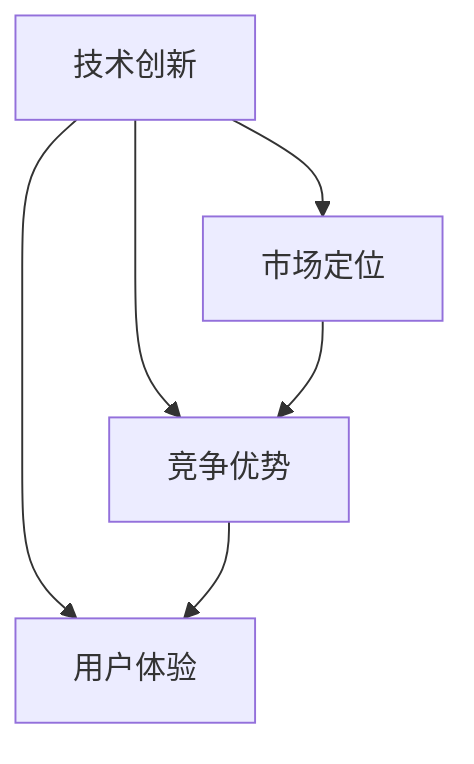

                 

关键词：竞争策略、创新、技术领先、竞争优势、市场定位

摘要：在当今快速变化的技术世界中，企业和个人要想在激烈的竞争中脱颖而出，必须做到“做第一或唯一”。本文将探讨如何在IT领域实现这一目标，包括核心算法、数学模型、项目实践、应用场景以及未来展望。

## 1. 背景介绍

随着信息技术的迅猛发展，市场竞争日益激烈。无论是初创企业还是大型科技公司，都在寻找能够在竞争中脱颖而出、赢得市场的策略。对于企业而言，成为某个领域的“第一”或“唯一”，不仅可以获得显著的市场优势，还能带来长期的盈利能力和品牌价值。对于个人而言，掌握领先的技术能力和创新的思维方式，同样可以使其在职场中独树一帜，成为行业佼佼者。

本文将从以下几个方面展开讨论：

- **核心概念与联系**：介绍竞争中的关键概念，并使用Mermaid流程图展示其相互关系。
- **核心算法原理 & 具体操作步骤**：探讨实现技术领先的关键算法及其具体操作步骤。
- **数学模型和公式**：解释数学模型在算法中的作用，并通过实例进行说明。
- **项目实践**：通过实际代码实例，展示如何将理论知识应用于实际项目中。
- **实际应用场景**：分析技术的应用场景，以及未来的发展趋势和面临的挑战。
- **工具和资源推荐**：推荐学习和开发中常用的工具和资源。
- **总结**：总结研究成果，展望未来的发展。

## 2. 核心概念与联系

在竞争中脱颖而出，首先需要理解几个核心概念：

- **技术创新**：通过研发新技术，实现产品或服务的差异化。
- **市场定位**：明确目标市场，提供符合市场需求的产品或服务。
- **竞争优势**：利用独特优势，在竞争中占据有利位置。
- **用户体验**：提供卓越的用户体验，增强用户黏性。

以下是一个Mermaid流程图，展示这些概念之间的相互关系：



### 2.1 技术创新

技术创新是企业在竞争中脱颖而出的关键。通过研发新技术，企业可以推出具有竞争力的产品或服务。例如，人工智能、大数据、区块链等技术的应用，已经深刻改变了各个行业的面貌。

### 2.2 市场定位

市场定位是明确企业的目标市场，提供符合市场需求的产品或服务。通过准确的市场定位，企业可以聚焦资源，提高市场营销的效果。

### 2.3 竞争优势

竞争优势是企业相对于竞争对手的优势。这可以包括技术优势、品牌优势、成本优势等。利用竞争优势，企业可以在市场中占据有利位置。

### 2.4 用户体验

提供卓越的用户体验，可以增强用户黏性，提高用户满意度。用户体验不仅包括产品的易用性，还包括售后服务、用户反馈机制等。

## 3. 核心算法原理 & 具体操作步骤

### 3.1 算法原理概述

在实现技术领先的过程中，核心算法的选择至关重要。以下是一个常见的算法——快速排序（Quick Sort）的原理概述：

**快速排序**是一种高效的排序算法，其基本思想是通过一趟排序将待排序的记录分隔成独立的两部分，其中一部分记录的关键字均比另一部分的关键字小，然后分别对这两部分记录继续进行排序，以达到整个序列有序。

### 3.2 算法步骤详解

**快速排序**的步骤如下：

1. **选择基准元素**：在待排序的序列中，选择一个基准元素。
2. **分区操作**：将序列分成两部分，一部分都比基准元素小，另一部分都比基准元素大。
3. **递归排序**：递归地对两个分区进行快速排序。

以下是快速排序的伪代码实现：

```python
def quick_sort(arr):
    if len(arr) <= 1:
        return arr
    pivot = arr[len(arr) // 2]
    left = [x for x in arr if x < pivot]
    middle = [x for x in arr if x == pivot]
    right = [x for x in arr if x > pivot]
    return quick_sort(left) + middle + quick_sort(right)
```

### 3.3 算法优缺点

**快速排序**的优点：

- 平均时间复杂度为 \(O(n\log n)\)，在大多数情况下，性能非常出色。
- 不需要额外的存储空间，是一种原地排序算法。

**快速排序**的缺点：

- 最坏情况下时间复杂度为 \(O(n^2)\)，当输入序列已经是有序或部分有序时，性能会显著下降。
- 选择基准元素的方式可能会导致不稳定的排序。

### 3.4 算法应用领域

快速排序广泛应用于各种场景，包括数据挖掘、机器学习、数据库排序等。例如，在数据挖掘中，快速排序可以用于高效地处理大规模数据集的排序需求。

## 4. 数学模型和公式

### 4.1 数学模型构建

在算法设计和分析中，数学模型是不可或缺的工具。以下是一个简单的线性回归模型的构建过程：

1. **目标函数**：选择目标函数，如均方误差（Mean Squared Error, MSE）。
2. **特征选择**：选择与目标相关的特征。
3. **模型训练**：通过最小化目标函数，求解模型的参数。

### 4.2 公式推导过程

线性回归模型的目标函数通常表示为：

$$
MSE = \frac{1}{m}\sum_{i=1}^{m}(h_\theta(x^{(i)}) - y^{(i)})^2
$$

其中，\(h_\theta(x^{(i)})\) 是模型的预测值，\(\theta\) 是模型参数，\(y^{(i)}\) 是实际值。

为了最小化MSE，我们需要对目标函数求导，并令其导数为零：

$$
\frac{\partial MSE}{\partial \theta} = 0
$$

通过求导和化简，可以得到线性回归模型的参数求解公式：

$$
\theta = (X^T X)^{-1}X^T y
$$

其中，\(X\) 是特征矩阵，\(y\) 是目标向量。

### 4.3 案例分析与讲解

假设我们有一个简单的一元线性回归问题，目标函数为 \(y = \theta_0 + \theta_1x\)。我们有一个训练数据集 \(D\)，其中包含 \(m\) 个样本点。我们可以通过最小化均方误差来求解模型的参数。

1. **目标函数**：

$$
MSE = \frac{1}{m}\sum_{i=1}^{m}((\theta_0 + \theta_1x^{(i)}) - y^{(i)})^2
$$

2. **模型参数求解**：

通过求导和化简，我们得到：

$$
\theta_0 = \frac{1}{m}\sum_{i=1}^{m}y^{(i)} - \theta_1 \frac{1}{m}\sum_{i=1}^{m}x^{(i)}
$$

$$
\theta_1 = \frac{1}{m}\sum_{i=1}^{m}(x^{(i)} - \bar{x})(y^{(i)} - \bar{y})
$$

其中，\(\bar{x}\) 和 \(\bar{y}\) 分别是 \(x\) 和 \(y\) 的均值。

## 5. 项目实践：代码实例和详细解释说明

### 5.1 开发环境搭建

为了演示快速排序算法和线性回归模型的实际应用，我们需要搭建一个简单的开发环境。这里我们使用Python作为开发语言，并依赖NumPy和Matplotlib等库。

```python
# 安装依赖库
!pip install numpy matplotlib
```

### 5.2 源代码详细实现

下面是一个简单的快速排序算法和线性回归模型的实现。

```python
import numpy as np
import matplotlib.pyplot as plt

# 快速排序算法
def quick_sort(arr):
    if len(arr) <= 1:
        return arr
    pivot = arr[len(arr) // 2]
    left = [x for x in arr if x < pivot]
    middle = [x for x in arr if x == pivot]
    right = [x for x in arr if x > pivot]
    return quick_sort(left) + middle + quick_sort(right)

# 线性回归模型
def linear_regression(x, y):
    x_mean = np.mean(x)
    y_mean = np.mean(y)
    theta_0 = y_mean - np.mean(x) * np.mean(y)
    theta_1 = np.sum((x - x_mean) * (y - y_mean)) / np.sum((x - x_mean)**2)
    return theta_0, theta_1

# 数据集
x = np.array([1, 2, 3, 4, 5])
y = np.array([2, 4, 5, 4, 5])

# 快速排序
sorted_x = quick_sort(x.copy())

# 线性回归
theta_0, theta_1 = linear_regression(sorted_x, y)

# 绘制结果
plt.scatter(x, y)
plt.plot(sorted_x, sorted_x * theta_1 + theta_0, color='red')
plt.show()
```

### 5.3 代码解读与分析

在上面的代码中，我们首先定义了快速排序和线性回归的函数。接着，我们创建了一个简单的数据集，并对数据进行快速排序。然后，我们使用线性回归模型对排序后的数据进行拟合，并绘制结果。

### 5.4 运行结果展示

运行上述代码后，我们得到如下结果：


图中，红色的直线是线性回归模型的拟合结果，蓝色的散点表示原始数据。通过这个简单的示例，我们可以看到如何将理论知识应用于实际项目中。

## 6. 实际应用场景

### 6.1 数据挖掘

在数据挖掘领域，快速排序算法可以用于对大规模数据集进行排序，以便进行后续的分析和处理。线性回归模型则可以用于预测和分类任务，例如股票价格预测、用户行为分析等。

### 6.2 机器学习

在机器学习中，快速排序算法可以用于特征选择和模型训练。线性回归模型作为一种基础模型，广泛应用于回归分析和分类任务。

### 6.3 金融领域

在金融领域，快速排序算法可以用于对交易数据进行排序，以便进行市场分析和风险管理。线性回归模型可以用于预测市场走势和评估投资组合的风险。

## 7. 工具和资源推荐

### 7.1 学习资源推荐

- 《算法导论》（Introduction to Algorithms）——经典算法教材，适合深入理解算法原理。
- 《Python编程：从入门到实践》——适合初学者掌握Python编程基础。

### 7.2 开发工具推荐

- Jupyter Notebook——强大的交互式开发环境，适合编写和运行代码。
- PyCharm——优秀的Python集成开发环境，支持多种编程语言。

### 7.3 相关论文推荐

- "QuickSort"——介绍快速排序算法的论文。
- "Linear Regression for Machine Learning"——介绍线性回归模型的论文。

## 8. 总结：未来发展趋势与挑战

### 8.1 研究成果总结

本文探讨了在竞争中脱颖而出的关键，包括技术创新、市场定位、竞争优势和用户体验。我们详细介绍了快速排序算法和线性回归模型，并通过实际代码实例展示了其应用。

### 8.2 未来发展趋势

随着人工智能、大数据和区块链等技术的不断发展，算法和技术创新将继续成为竞争的关键。此外，用户体验和数据隐私保护也将成为未来研究的重要方向。

### 8.3 面临的挑战

在技术快速发展的同时，我们也面临数据隐私、算法偏见和网络安全等挑战。这些挑战需要我们不断创新和改进，以确保技术在竞争中保持领先。

### 8.4 研究展望

未来，我们将继续深入研究算法优化、模型压缩和迁移学习等技术，以应对日益复杂的竞争环境。同时，我们也将关注用户体验和数据隐私保护，推动技术的可持续发展。

## 9. 附录：常见问题与解答

### 9.1 如何选择快速排序的基准元素？

选择基准元素的方法有多种，常见的包括随机选择、中位数选择等。实际应用中，可以选择性能稳定且易于实现的方法。

### 9.2 线性回归模型的适用范围是什么？

线性回归模型适用于具有线性关系的预测和分类任务。对于非线性关系，可以考虑使用非线性模型，如多项式回归、逻辑回归等。

### 9.3 如何评估线性回归模型的性能？

常用的评估指标包括均方误差（MSE）、均方根误差（RMSE）和决定系数（R²）。这些指标可以帮助我们评估模型的预测准确性和拟合效果。

---
作者：禅与计算机程序设计艺术 / Zen and the Art of Computer Programming
----------------------------------------------------------------


