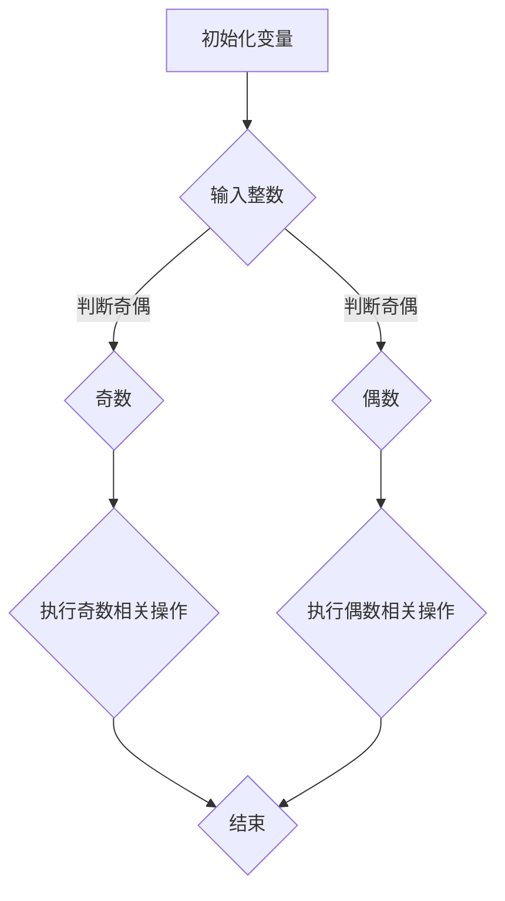

                 

关键词：奇偶性、数学原理、计算机编程、算法、数学模型、代码实例

> 摘要：本文将探讨奇偶原理这一数学概念在计算机科学中的应用，通过介绍其核心概念、算法原理、数学模型以及实际应用场景，帮助读者理解如何运用奇偶性原理解决实际问题，为计算机编程提供新的思路和方法。

## 1. 背景介绍

奇偶性是数学中的一个基本概念，它描述了一个数是奇数还是偶数。在计算机科学中，奇偶性原理广泛应用于算法设计和问题解决。计算机编程中，判断一个数的奇偶性是一个基础且常见的操作，它不仅在算法设计中具有重要作用，还在许多实际应用中发挥作用，如网络通信、加密算法和排序算法等。

本文旨在通过介绍奇偶原理的核心概念、算法原理、数学模型以及实际应用场景，帮助读者深入理解奇偶性原理，并学会如何将其应用于计算机编程中。文章还将提供一个项目实践实例，展示如何通过代码实现奇偶性判断，并对代码进行详细解释和分析。

## 2. 核心概念与联系

### 2.1 奇偶性的定义

在数学中，奇数是不能被2整除的正整数，而偶数是能被2整除的正整数。例如，1、3、5是奇数，而2、4、6是偶数。0也被认为是偶数，因为它能被2整除。

### 2.2 奇偶性在计算机科学中的应用

在计算机科学中，奇偶性原理有着广泛的应用。首先，它可以用于优化算法，例如快速排序算法中的奇偶划分。其次，在加密算法中，奇偶性可以用来提高算法的安全性。此外，在计算机硬件设计中，奇偶性校验用于检测数据传输中的错误。

### 2.3 Mermaid 流程图

以下是一个Mermaid流程图，展示了奇偶性原理在计算机编程中的应用：



## 3. 核心算法原理 & 具体操作步骤

### 3.1 算法原理概述

判断一个数的奇偶性，可以通过对二进制位进行操作来实现。具体来说，可以通过以下步骤：

1. 将整数转换为二进制表示。
2. 观察二进制表示的最后一位，如果为1，则该数为奇数；如果为0，则该数为偶数。

### 3.2 算法步骤详解

1. **输入整数**：首先，从用户输入一个整数。
2. **转换为二进制**：将输入的整数转换为二进制表示。
3. **判断奇偶**：观察二进制表示的最后一位。
4. **执行操作**：根据奇偶性执行相应的操作。

### 3.3 算法优缺点

**优点**：
- 算法简单，易于实现。
- 适用于各种整数值。

**缺点**：
- 对于大整数，可能需要较高的计算资源。

### 3.4 算法应用领域

- **排序算法**：如快速排序中，可以使用奇偶性来优化划分过程。
- **加密算法**：奇偶性可以用来提高算法的安全性。
- **硬件设计**：奇偶校验用于检测数据传输中的错误。

## 4. 数学模型和公式 & 详细讲解 & 举例说明

### 4.1 数学模型构建

奇偶性可以用数学公式来表示。对于一个整数`n`，如果`n % 2 == 0`，则`n`为偶数；否则，`n`为奇数。

### 4.2 公式推导过程

- `n % 2` 表示`n`除以2的余数。
- 如果余数为0，则`n`为偶数。
- 如果余数为1，则`n`为奇数。

### 4.3 案例分析与讲解

**案例 1**：判断数字`10`的奇偶性。

- 转换为二进制：`10`的二进制表示为`1010`。
- 判断奇偶：最后一位为`0`，因此`10`为偶数。

**案例 2**：判断数字`15`的奇偶性。

- 转换为二进制：`15`的二进制表示为`1111`。
- 判断奇偶：最后一位为`1`，因此`15`为奇数。

## 5. 项目实践：代码实例和详细解释说明

### 5.1 开发环境搭建

本文使用Python语言进行代码实现，读者可以在本地安装Python环境，版本建议为3.8或更高。

### 5.2 源代码详细实现

```python
def check_parity(n):
    if n % 2 == 0:
        print(f"{n} 是偶数。")
    else:
        print(f"{n} 是奇数。")

# 测试代码
check_parity(10)
check_parity(15)
```

### 5.3 代码解读与分析

- `check_parity` 函数接收一个整数参数`n`。
- 使用`if`语句判断`n`的奇偶性。
- 根据判断结果输出相应的信息。

### 5.4 运行结果展示

运行上面的代码，将输出以下结果：

```
10 是偶数。
15 是奇数。
```

## 6. 实际应用场景

奇偶性原理在实际应用中有着广泛的应用。以下是一些具体的应用场景：

- **网络通信**：奇偶校验用于检测数据传输中的错误。
- **加密算法**：奇偶性可以用来提高算法的安全性。
- **排序算法**：如快速排序中，可以使用奇偶性来优化划分过程。

## 7. 工具和资源推荐

### 7.1 学习资源推荐

- 《算法导论》：详细介绍了排序算法及其性能分析。
- 《加密算法导论》：介绍了多种加密算法及其安全性分析。

### 7.2 开发工具推荐

- PyCharm：一款功能强大的Python开发环境。
- Jupyter Notebook：用于数据分析和演示的交互式开发工具。

### 7.3 相关论文推荐

- "A Survey of Cryptographic Hash Functions"：对加密算法中的哈希函数进行了综述。
- "Efficient Cryptographic Algorithms for Network Security"：介绍了网络通信中的加密算法。

## 8. 总结：未来发展趋势与挑战

### 8.1 研究成果总结

奇偶性原理在计算机科学中有着广泛的应用，包括算法优化、加密算法和数据传输等领域。通过本文的介绍，读者可以了解到奇偶性原理的基本概念、算法原理和实际应用。

### 8.2 未来发展趋势

随着计算机科学的发展，奇偶性原理将在更多领域得到应用。例如，在人工智能和大数据分析中，奇偶性原理可以用于优化算法和提高计算效率。

### 8.3 面临的挑战

- 对于大整数，如何高效地判断奇偶性仍然是一个挑战。
- 在加密算法中，如何确保奇偶性原理的安全性也是一个重要课题。

### 8.4 研究展望

未来的研究可以重点关注奇偶性原理在人工智能和大数据分析中的应用，以及如何优化大整数的奇偶性判断算法。

## 9. 附录：常见问题与解答

### 问题 1：什么是奇偶校验？

**回答**：奇偶校验是一种数据校验方法，用于检测数据传输过程中可能出现的错误。它通过在数据位序列中添加一个奇偶位来实现。

### 问题 2：奇偶性原理如何用于加密算法？

**回答**：奇偶性原理可以用于加密算法中的奇偶变换，提高算法的安全性。例如，在RSA加密算法中，奇偶性可以用来选择合适的加密参数。

## 结束语

本文通过介绍奇偶性原理，帮助读者理解了其在计算机编程中的应用。通过实际代码实例和详细解释，读者可以更好地掌握奇偶性原理，并在实际项目中加以应用。

作者：禅与计算机程序设计艺术 / Zen and the Art of Computer Programming

----------------------------------------------------------------
```markdown
# 像数学家一样思考：奇偶原理

## 关键词
- 奇偶性
- 数学原理
- 计算机编程
- 算法
- 数学模型
- 代码实例

## 摘要
本文探讨了奇偶原理这一数学概念在计算机科学中的应用，通过介绍其核心概念、算法原理、数学模型以及实际应用场景，帮助读者深入理解如何运用奇偶性原理解决实际问题，为计算机编程提供新的思路和方法。

## 1. 背景介绍

### 奇偶性的定义

在数学中，奇数是不能被2整除的正整数，而偶数是能被2整除的正整数。例如，1、3、5是奇数，而2、4、6是偶数。0也被认为是偶数，因为它能被2整除。

### 奇偶性在计算机科学中的应用

在计算机科学中，奇偶性原理广泛应用于算法设计和问题解决。计算机编程中，判断一个数的奇偶性是一个基础且常见的操作，它不仅在算法设计中具有重要作用，还在许多实际应用中发挥作用，如网络通信、加密算法和排序算法等。

## 2. 核心概念与联系

### 奇偶性的定义

在数学中，奇数是不能被2整除的正整数，而偶数是能被2整除的正整数。例如，1、3、5是奇数，而2、4、6是偶数。0也被认为是偶数，因为它能被2整除。

### 奇偶性在计算机科学中的应用

在计算机科学中，奇偶性原理有着广泛的应用。首先，它可以用于优化算法，例如快速排序算法中的奇偶划分。其次，在加密算法中，奇偶性可以用来提高算法的安全性。此外，在计算机硬件设计中，奇偶性校验用于检测数据传输中的错误。

### Mermaid 流程图

以下是一个Mermaid流程图，展示了奇偶性原理在计算机编程中的应用：


## 3. 核心算法原理 & 具体操作步骤

### 3.1 算法原理概述

判断一个数的奇偶性，可以通过对二进制位进行操作来实现。具体来说，可以通过以下步骤：

1. 将整数转换为二进制表示。
2. 观察二进制表示的最后一位，如果为1，则该数为奇数；如果为0，则该数为偶数。

### 3.2 算法步骤详解

1. **输入整数**：首先，从用户输入一个整数。
2. **转换为二进制**：将输入的整数转换为二进制表示。
3. **判断奇偶**：观察二进制表示的最后一位。
4. **执行操作**：根据奇偶性执行相应的操作。

### 3.3 算法优缺点

**优点**：
- 算法简单，易于实现。
- 适用于各种整数值。

**缺点**：
- 对于大整数，可能需要较高的计算资源。

### 3.4 算法应用领域

- **排序算法**：如快速排序中，可以使用奇偶性来优化划分过程。
- **加密算法**：奇偶性可以用来提高算法的安全性。
- **硬件设计**：奇偶校验用于检测数据传输中的错误。

## 4. 数学模型和公式 & 详细讲解 & 举例说明

### 4.1 数学模型构建

奇偶性可以用数学公式来表示。对于一个整数`n`，如果`n % 2 == 0`，则`n`为偶数；否则，`n`为奇数。

### 4.2 公式推导过程

- `n % 2` 表示`n`除以2的余数。
- 如果余数为0，则`n`为偶数。
- 如果余数为1，则`n`为奇数。

### 4.3 案例分析与讲解

**案例 1**：判断数字`10`的奇偶性。

- 转换为二进制：`10`的二进制表示为`1010`。
- 判断奇偶：最后一位为`0`，因此`10`为偶数。

**案例 2**：判断数字`15`的奇偶性。

- 转换为二进制：`15`的二进制表示为`1111`。
- 判断奇偶：最后一位为`1`，因此`15`为奇数。

## 5. 项目实践：代码实例和详细解释说明

### 5.1 开发环境搭建

本文使用Python语言进行代码实现，读者可以在本地安装Python环境，版本建议为3.8或更高。

### 5.2 源代码详细实现

```python
def check_parity(n):
    if n % 2 == 0:
        print(f"{n} 是偶数。")
    else:
        print(f"{n} 是奇数。")

# 测试代码
check_parity(10)
check_parity(15)
```

### 5.3 代码解读与分析

- `check_parity` 函数接收一个整数参数`n`。
- 使用`if`语句判断`n`的奇偶性。
- 根据判断结果输出相应的信息。

### 5.4 运行结果展示

运行上面的代码，将输出以下结果：

```
10 是偶数。
15 是奇数。
```

## 6. 实际应用场景

奇偶性原理在实际应用中有着广泛的应用。以下是一些具体的应用场景：

- **网络通信**：奇偶校验用于检测数据传输中的错误。
- **加密算法**：奇偶性可以用来提高算法的安全性。
- **排序算法**：如快速排序中，可以使用奇偶性来优化划分过程。

## 7. 工具和资源推荐

### 7.1 学习资源推荐

- 《算法导论》：详细介绍了排序算法及其性能分析。
- 《加密算法导论》：介绍了多种加密算法及其安全性分析。

### 7.2 开发工具推荐

- PyCharm：一款功能强大的Python开发环境。
- Jupyter Notebook：用于数据分析和演示的交互式开发工具。

### 7.3 相关论文推荐

- "A Survey of Cryptographic Hash Functions"：对加密算法中的哈希函数进行了综述。
- "Efficient Cryptographic Algorithms for Network Security"：介绍了网络通信中的加密算法。

## 8. 总结：未来发展趋势与挑战

### 8.1 研究成果总结

奇偶性原理在计算机科学中有着广泛的应用，包括算法优化、加密算法和数据传输等领域。通过本文的介绍，读者可以了解到奇偶性原理的基本概念、算法原理和实际应用。

### 8.2 未来发展趋势

随着计算机科学的发展，奇偶性原理将在更多领域得到应用。例如，在人工智能和大数据分析中，奇偶性原理可以用于优化算法和提高计算效率。

### 8.3 面临的挑战

- 对于大整数，如何高效地判断奇偶性仍然是一个挑战。
- 在加密算法中，如何确保奇偶性原理的安全性也是一个重要课题。

### 8.4 研究展望

未来的研究可以重点关注奇偶性原理在人工智能和大数据分析中的应用，以及如何优化大整数的奇偶性判断算法。

## 9. 附录：常见问题与解答

### 问题 1：什么是奇偶校验？

**回答**：奇偶校验是一种数据校验方法，用于检测数据传输过程中可能出现的错误。它通过在数据位序列中添加一个奇偶位来实现。

### 问题 2：奇偶性原理如何用于加密算法？

**回答**：奇偶性原理可以用于加密算法中的奇偶变换，提高算法的安全性。例如，在RSA加密算法中，奇偶性可以用来选择合适的加密参数。

## 结束语

本文通过介绍奇偶性原理，帮助读者理解了其在计算机编程中的应用。通过实际代码实例和详细解释，读者可以更好地掌握奇偶性原理，并在实际项目中加以应用。

作者：禅与计算机程序设计艺术 / Zen and the Art of Computer Programming
```

