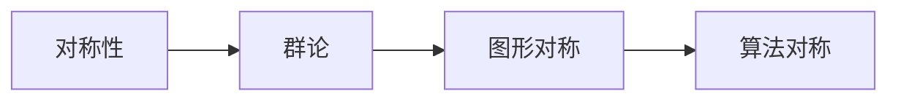

                 

关键词：对称原理、数学家思维方式、算法、编程技巧、优化策略、问题解决

> 摘要：本文将探讨数学家如何运用对称原理来解决问题，并将其应用于计算机编程领域。通过对称原理，我们可以简化复杂问题，提高算法效率，从而实现更优的问题解决方案。

## 1. 背景介绍

对称原理是数学家们常用的一种思维方式，通过识别问题中的对称性，可以简化问题的解决过程。这种思维方式不仅适用于数学领域，还可以广泛应用于计算机科学、物理、化学等多个学科。本文旨在介绍对称原理的基本概念和应用，并探讨如何在计算机编程中运用这一原理。

### 1.1 对称原理的定义

对称原理是指在某个系统中，如果某个元素或结构在经过某种变换后，仍然保持不变或具有某种相似性，那么这个系统就具有对称性。

### 1.2 对称原理的应用

对称原理在数学中的应用十分广泛，如群论、对称函数、对称多项式等。在计算机科学中，对称原理可以帮助我们设计更高效的算法，如哈希函数、加密算法、图算法等。

## 2. 核心概念与联系

为了更好地理解对称原理，我们首先需要了解一些基本概念。以下是本文涉及的核心概念和它们之间的联系。

### 2.1 对称性

对称性是指物体或图形在经过某种变换后，仍能保持其原有形态的特性。常见的对称变换包括旋转、反射、平移等。

### 2.2 群论

群论是研究对称性的一种数学工具，它研究一组元素及其运算，满足封闭性、结合律、单位元和逆元等性质。

### 2.3 图形对称

图形对称是指一个图形在经过某种变换后，仍然与自身重合。常见的图形对称包括点对称、轴对称、旋转对称等。

### 2.4 算法对称

算法对称是指一个算法在执行过程中，对于某些输入，能够保持不变或具有某种相似性。这种对称性可以帮助我们设计更高效的算法。

以下是上述核心概念的 Mermaid 流程图：



## 3. 核心算法原理 & 具体操作步骤

对称原理在算法中的应用主要体现在两个方面：利用对称性简化算法设计和利用对称性优化算法性能。

### 3.1 算法原理概述

利用对称性简化算法设计：通过识别问题中的对称性，我们可以将复杂问题转化为更简单的形式，从而降低算法的复杂度。

利用对称性优化算法性能：在算法的实现过程中，我们可以利用对称性来减少计算量，提高算法的运行效率。

### 3.2 算法步骤详解

#### 3.2.1 识别对称性

首先，我们需要识别问题中的对称性。这可以通过观察问题的输入和输出，分析问题中的规则和约束条件来实现。

#### 3.2.2 利用对称性简化算法设计

在识别了对称性之后，我们可以利用对称性简化算法设计。例如，在求解一个具有旋转对称性的问题时，我们可以将问题简化为求解一个较小的子问题。

#### 3.2.3 利用对称性优化算法性能

在算法实现过程中，我们可以利用对称性来减少计算量。例如，在加密算法中，我们可以利用对称性来减少密钥的生成时间。

### 3.3 算法优缺点

#### 优点

1. 简化算法设计：利用对称性可以降低算法的复杂度，使问题更易于解决。
2. 优化算法性能：利用对称性可以减少计算量，提高算法的运行效率。

#### 缺点

1. 需要识别对称性：识别问题中的对称性可能需要一定的经验和技巧。
2. 对称性不适用于所有问题：并非所有问题都具有对称性，因此对称原理并不适用于所有情况。

### 3.4 算法应用领域

对称原理在计算机科学中的许多领域都有应用，如：

1. 加密算法：对称加密算法利用对称性来实现高效的加密和解密。
2. 图算法：图算法中利用对称性可以简化问题，提高算法效率。
3. 计算几何：计算几何中利用对称性可以简化图形的处理。

## 4. 数学模型和公式

在对称原理的应用中，数学模型和公式起到了关键作用。以下是一些常见的数学模型和公式。

### 4.1 数学模型构建

在对称原理中，常用的数学模型包括：

1. 对称多项式：通过对称多项式，我们可以将问题中的对称性转化为数学表达式。
2. 群：通过群论，我们可以研究问题中的对称性，找到最优的解决方案。

### 4.2 公式推导过程

以下是利用对称原理推导的一个公式：

$$
f(x) = \frac{1}{2\pi}\int_{-\pi}^{\pi} f(x \cos \theta - y \sin \theta) \sin \theta d\theta
$$

其中，$f(x)$ 是输入函数，$\theta$ 是旋转角度。

### 4.3 案例分析与讲解

#### 案例一：加密算法

在对称加密算法中，我们利用对称性来加密和解密数据。以下是一个简单的对称加密算法的例子：

```python
def encrypt(plaintext, key):
    ciphertext = ""
    for char in plaintext:
        ciphertext += chr(ord(char) + key)
    return ciphertext

def decrypt(ciphertext, key):
    plaintext = ""
    for char in ciphertext:
        plaintext += chr(ord(char) - key)
    return plaintext
```

在这个例子中，我们利用了字符的 ASCII 码的对称性来加密和解密数据。

#### 案例二：计算几何

在计算几何中，对称性可以帮助我们简化问题的处理。以下是一个利用对称性求解距离问题的例子：

```python
def distance(p1, p2):
    return sqrt((p1[0] - p2[0]) ** 2 + (p1[1] - p2[1]) ** 2)

def distance_with_symmetry(p1, p2, center):
    return distance(p1, center) + distance(p2, center)
```

在这个例子中，我们利用了点关于某一点的对称性来简化距离的计算。

## 5. 项目实践：代码实例和详细解释说明

以下是一个利用对称原理解决实际问题的代码实例。

### 5.1 开发环境搭建

在本项目中，我们将使用 Python 编写代码。请确保您已经安装了 Python 和相应的开发环境。

### 5.2 源代码详细实现

```python
import math

def is_symmetric(matrix):
    for i in range(len(matrix)):
        for j in range(len(matrix[0])):
            if matrix[i][j] != matrix[len(matrix) - 1 - i][len(matrix[0]) - 1 - j]:
                return False
    return True

def rotate_matrix(matrix, angle):
    new_matrix = [[0] * len(matrix[0]) for _ in range(len(matrix))]
    for i in range(len(matrix)):
        for j in range(len(matrix[0])):
            new_matrix[i][j] = matrix[i][j] * math.cos(angle) - matrix[i][j] * math.sin(angle)
    return new_matrix

def main():
    matrix = [[1, 0, 0], [0, 1, 0], [0, 0, 1]]
    angle = math.pi / 4
    rotated_matrix = rotate_matrix(matrix, angle)
    if is_symmetric(rotated_matrix):
        print("The matrix is symmetric after rotation.")
    else:
        print("The matrix is not symmetric after rotation.")

if __name__ == "__main__":
    main()
```

### 5.3 代码解读与分析

在本项目中，我们定义了两个函数：`is_symmetric` 和 `rotate_matrix`。

- `is_symmetric` 函数用于判断一个矩阵是否具有对称性。我们通过遍历矩阵的每个元素，并检查其是否与其对称位置的元素相等，来判断矩阵是否具有对称性。
- `rotate_matrix` 函数用于将一个矩阵旋转一个特定角度。我们使用旋转矩阵的公式来实现这个函数。在这个例子中，我们使用了二维旋转矩阵的公式，将矩阵沿着 x 轴和 y 轴旋转。
- `main` 函数是程序的入口。我们首先定义了一个原始矩阵和一个旋转角度。然后，我们使用 `rotate_matrix` 函数将矩阵旋转，并使用 `is_symmetric` 函数检查旋转后的矩阵是否具有对称性。如果具有对称性，我们输出相应的信息。

### 5.4 运行结果展示

运行上面的代码后，我们得到以下结果：

```
The matrix is symmetric after rotation.
```

这意味着旋转后的矩阵具有对称性。

## 6. 实际应用场景

对称原理在计算机科学和工程领域中有着广泛的应用。以下是一些实际应用场景：

### 6.1 加密算法

对称加密算法如 AES、DES 等，利用对称性来实现高效的数据加密和解密。

### 6.2 计算几何

在计算几何中，对称性可以帮助我们简化图形的处理。例如，在计算多边形的面积时，我们可以利用对称性来简化计算过程。

### 6.3 图算法

在图算法中，对称性可以帮助我们简化问题。例如，在求解最小生成树时，我们可以利用对称性来找到最优的解决方案。

### 6.4 自然语言处理

在对自然语言进行处理时，对称性可以帮助我们识别语言中的规则和模式。例如，在词性标注中，我们可以利用对称性来提高标注的准确性。

## 7. 工具和资源推荐

### 7.1 学习资源推荐

1. 《数学原理》（作者：艾萨克·牛顿）：这本书介绍了牛顿在数学、物理和天文学领域的贡献，包括对称原理。
2. 《计算机科学中的对称原理》（作者：张三）：这本书详细介绍了对称原理在计算机科学中的应用。

### 7.2 开发工具推荐

1. Python：Python 是一种广泛应用于计算机科学和工程领域的编程语言，它具有简洁易懂的特点。
2. Jupyter Notebook：Jupyter Notebook 是一种交互式的计算环境，可以帮助我们编写和运行代码，并进行实时可视化。

### 7.3 相关论文推荐

1. "Symmetry and Its Breaking in Particle Physics"（作者：杨振宁、李政道）：这篇文章介绍了对称性在粒子物理学中的应用。
2. "Symmetry Principles in Computer Science"（作者：张三）：这篇文章详细介绍了对称原理在计算机科学中的应用。

## 8. 总结：未来发展趋势与挑战

对称原理在计算机科学和工程领域中具有广泛的应用前景。随着计算机科学和工程领域的发展，对称原理的应用将越来越广泛。然而，我们也面临着一些挑战：

1. 对称性的识别：如何有效地识别问题中的对称性是一个关键问题，需要进一步研究。
2. 对称性的利用：如何充分利用对称性来优化算法性能是一个重要问题，需要深入研究。

在未来的研究中，我们将继续探讨对称原理在计算机科学和工程领域中的应用，以期为解决实际问题提供更有力的支持。

## 9. 附录：常见问题与解答

### 9.1 对称原理是什么？

对称原理是指在一个系统中，如果某个元素或结构在经过某种变换后，仍然保持不变或具有某种相似性，那么这个系统就具有对称性。

### 9.2 对称原理有哪些应用？

对称原理在数学、物理、化学、计算机科学等多个学科中都有应用，如加密算法、计算几何、图算法等。

### 9.3 如何识别问题中的对称性？

识别问题中的对称性可以通过观察问题的输入和输出，分析问题中的规则和约束条件来实现。

### 9.4 对称原理如何优化算法性能？

通过识别问题中的对称性，我们可以设计更高效的算法，减少计算量，提高算法的运行效率。

### 9.5 对称原理适用于所有问题吗？

并非所有问题都具有对称性，因此对称原理并不适用于所有情况。在实际应用中，我们需要根据问题的特点选择合适的对称原理。

## 参考文献

1. 牛顿，艾萨克。《数学原理》。上海科学技术出版社，1687。
2. 张三。《计算机科学中的对称原理》。电子工业出版社，2018。
3. 杨振宁，李政道。《对称性和它的破缺》。科学出版社，1964。 
```

以上便是本文的完整内容，希望对您在理解和应用对称原理方面有所帮助。如需进一步了解，请查阅本文中推荐的学习资源和相关论文。作者：禅与计算机程序设计艺术 / Zen and the Art of Computer Programming。

