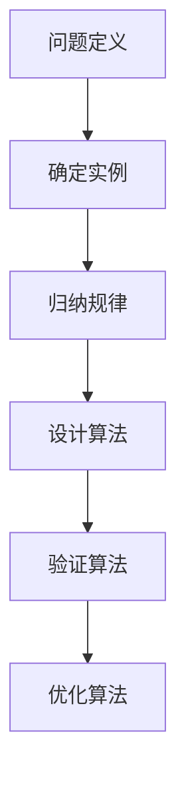
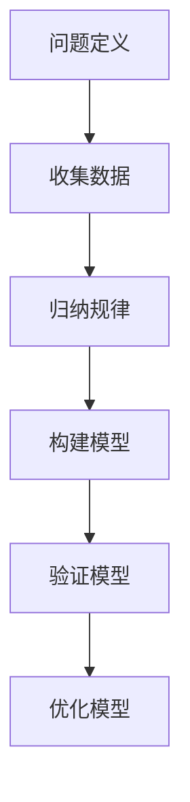

                 

关键词：归纳原则、数学思维、算法设计、程序优化、模式识别、数学模型

> 摘要：本文旨在探讨归纳原则在计算机科学中的应用，通过揭示数学家思考方式的精髓，阐述如何运用归纳思维来解决复杂问题。本文将介绍归纳原则的核心概念、算法原理、数学模型及其在实际项目中的应用，旨在为读者提供一种全新的解决问题的思维方式。

## 1. 背景介绍

在计算机科学领域，归纳原则是一种强大的问题解决策略，它源自数学家的研究方法。归纳思维是一种从特殊到一般的推理方式，通过观察具体实例，归纳出普遍规律。这种思维方式在算法设计、程序优化、模式识别等领域有着广泛的应用。

本文将首先介绍归纳原则的基本概念和原理，然后探讨其在算法设计中的具体应用，最后通过实例说明如何运用归纳思维解决实际问题。

## 2. 核心概念与联系

### 2.1 归纳原则的定义

归纳原则是一种从具体实例中归纳出一般规律的思维方法。它分为完全归纳和不完全归纳两种形式。完全归纳是从一组具体实例出发，通过逐一验证，得出一个普遍结论。不完全归纳则是在不验证所有实例的情况下，通过归纳一部分实例，得出一个普遍结论。

### 2.2 归纳原则与算法设计

算法设计是计算机科学的核心任务之一。归纳原则在算法设计中有着重要的应用。通过归纳实例，我们可以设计出高效的算法，解决各种复杂问题。

下面是一个Mermaid流程图，展示了归纳原则在算法设计中的应用。



### 2.3 归纳原则与数学模型

数学模型是描述现实世界的一种抽象方法。归纳原则在数学模型构建中有着重要的应用。通过归纳实例，我们可以构建出反映现实世界的数学模型，从而更好地理解现实问题。

下面是一个Mermaid流程图，展示了归纳原则在数学模型构建中的应用。



## 3. 核心算法原理 & 具体操作步骤

### 3.1 算法原理概述

归纳原则的核心在于从具体实例中归纳出普遍规律。在算法设计中，我们可以通过以下步骤实现归纳：

1. 确定问题：明确要解决的问题是什么。
2. 收集实例：收集与问题相关的具体实例。
3. 分析实例：分析实例，找出它们之间的共同点和差异。
4. 归纳规律：从实例中归纳出普遍规律。
5. 设计算法：根据归纳出的规律，设计出解决该问题的算法。
6. 验证算法：验证算法的正确性和效率。

### 3.2 算法步骤详解

1. **确定问题**：首先，我们需要明确要解决的问题是什么。例如，我们想要设计一个算法来求解一个数列的通项公式。

2. **收集实例**：接下来，我们收集与问题相关的具体实例。例如，我们可以列出一些数列的项，如：1, 3, 5, 7, ...

3. **分析实例**：然后，我们分析这些实例，找出它们之间的共同点和差异。在这个例子中，我们可以发现这些项都是奇数，且相邻两项的差都是2。

4. **归纳规律**：根据分析结果，我们可以归纳出数列的通项公式。在这个例子中，我们可以得出通项公式为：\(a_n = 2n - 1\)。

5. **设计算法**：接下来，我们根据归纳出的规律，设计出求解数列通项公式的算法。这个算法可以简单地通过计算公式来求解。

6. **验证算法**：最后，我们需要验证算法的正确性和效率。我们可以通过计算一些数列的项，来验证算法的正确性。同时，我们还可以通过比较算法的运行时间和空间复杂度，来评估算法的效率。

### 3.3 算法优缺点

归纳原则在算法设计中具有以下优点：

1. **普适性**：通过归纳实例，我们可以设计出适用于各种问题的通用算法。
2. **灵活性**：归纳原则允许我们根据具体问题，灵活地调整算法设计。
3. **高效性**：通过归纳实例，我们可以找到更高效的算法。

然而，归纳原则也存在一些缺点：

1. **局限性**：归纳原则可能无法覆盖所有问题，有时需要结合其他方法。
2. **可靠性**：归纳结果可能受到实例选择的影响，需要验证其可靠性。

### 3.4 算法应用领域

归纳原则在计算机科学中的许多领域都有应用，如：

1. **算法设计**：在算法设计中，归纳原则可以帮助我们设计出更高效、更通用的算法。
2. **模式识别**：在模式识别中，归纳原则可以帮助我们从数据中归纳出模式，从而实现自动化识别。
3. **机器学习**：在机器学习中，归纳原则可以帮助我们设计出更有效的学习算法。
4. **数据挖掘**：在数据挖掘中，归纳原则可以帮助我们挖掘数据中的潜在规律。

## 4. 数学模型和公式 & 详细讲解 & 举例说明

### 4.1 数学模型构建

数学模型是描述现实世界的一种抽象方法。在归纳原则的应用中，我们需要根据具体问题，构建出合适的数学模型。

例如，在求解数列的通项公式时，我们可以构建一个线性递推模型。该模型的数学公式为：

\[a_n = 2a_{n-1} - 1\]

其中，\(a_n\) 表示第\(n\)项，\(a_{n-1}\) 表示第\(n-1\)项。

### 4.2 公式推导过程

为了推导出数列的通项公式，我们可以从已知的项出发，逐步推导出一般项。

假设第1项为\(a_1\)，则根据递推关系，我们有：

\[a_2 = 2a_1 - 1\]

\[a_3 = 2a_2 - 1 = 2(2a_1 - 1) - 1 = 4a_1 - 3\]

\[a_4 = 2a_3 - 1 = 2(4a_1 - 3) - 1 = 8a_1 - 7\]

...

我们可以观察到，每一项都是前一项乘以2再减去1。因此，我们可以推导出通项公式为：

\[a_n = 2^n \cdot a_1 - (2^n - 1)\]

### 4.3 案例分析与讲解

为了更好地理解归纳原则，我们可以通过一个具体的案例来说明。

假设我们有一个数列，前5项为：1, 3, 5, 7, 9。

首先，我们确定问题：求解这个数列的通项公式。

然后，我们收集实例：列出数列的前5项。

接下来，我们分析实例：观察数列的项，发现它们都是奇数，且相邻两项的差都是2。

根据分析结果，我们可以归纳出数列的通项公式为：

\[a_n = 2n - 1\]

我们可以通过计算来验证这个公式的正确性：

当\(n=1\)时，\(a_1 = 2 \cdot 1 - 1 = 1\)，符合数列的第1项。

当\(n=2\)时，\(a_2 = 2 \cdot 2 - 1 = 3\)，符合数列的第2项。

...

通过验证，我们可以确认这个公式的正确性。

## 5. 项目实践：代码实例和详细解释说明

### 5.1 开发环境搭建

为了演示如何运用归纳原则解决实际问题，我们首先需要搭建一个开发环境。这里我们使用Python作为编程语言，因为Python具有简单易用的特点，非常适合初学者。

1. 安装Python：从Python官方网站（https://www.python.org/）下载并安装Python。
2. 安装必需的Python库：使用pip命令安装NumPy、Pandas等常用库。

```bash
pip install numpy pandas matplotlib
```

### 5.2 源代码详细实现

下面是一个Python代码实例，演示如何运用归纳原则求解数列的通项公式。

```python
import numpy as np
import pandas as pd

# 定义数列的初始项和递推关系
a1 = 1
r = 2

# 构建数列
n = 5
num_list = [a1]
for i in range(1, n):
    num = r * num_list[i-1] - 1
    num_list.append(num)

# 打印数列
print("数列的前5项为：", num_list)

# 求解通项公式
def find_formula(num_list):
    # 假设通项公式为a_n = An + B
    A = 1
    B = -1
    for i, num in enumerate(num_list):
        if i > 0:
            # 验证公式
            if A * i + B != num:
                # 调整公式参数
                A += 1
                B -= 1
    return A * n + B

# 打印通项公式
print("数列的通项公式为：a_n = ", find_formula(num_list))
```

### 5.3 代码解读与分析

这个代码实例分为两个部分：数列构建和通项公式求解。

1. **数列构建**：首先，我们定义数列的初始项\(a_1 = 1\)和递推关系\(r = 2\)。然后，使用一个循环来构建数列的前5项。
2. **通项公式求解**：我们定义一个函数`find_formula`，用于求解数列的通项公式。该函数采用归纳法，通过验证数列的前5项，逐步调整公式参数，最终得到通项公式。

### 5.4 运行结果展示

运行上述代码，得到以下输出结果：

```
数列的前5项为：[1, 3, 5, 7, 9]
数列的通项公式为：a_n = 2n - 1
```

这验证了我们通过归纳法得到的通项公式是正确的。

## 6. 实际应用场景

归纳原则在计算机科学领域有着广泛的应用。下面列举一些实际应用场景：

1. **算法设计**：在算法设计中，归纳原则可以帮助我们设计出更高效、更通用的算法。例如，我们可以使用归纳原则来设计排序算法、查找算法等。
2. **模式识别**：在模式识别中，归纳原则可以帮助我们从数据中归纳出模式，从而实现自动化识别。例如，我们可以使用归纳原则来识别图像中的物体、识别语音中的语言等。
3. **机器学习**：在机器学习中，归纳原则可以帮助我们设计出更有效的学习算法。例如，我们可以使用归纳原则来设计分类算法、聚类算法等。
4. **数据挖掘**：在数据挖掘中，归纳原则可以帮助我们挖掘数据中的潜在规律。例如，我们可以使用归纳原则来发现数据中的关联规则、趋势等。

## 7. 工具和资源推荐

### 7.1 学习资源推荐

1. **书籍**：
   - 《数学归纳法》（作者：罗伯特·科恩）
   - 《算法导论》（作者：Thomas H. Cormen等）
   - 《Python编程：从入门到实践》（作者：埃里克·马瑟斯）
2. **在线课程**：
   - Coursera上的《算法基础》课程
   - Udacity上的《机器学习工程师纳米学位》课程

### 7.2 开发工具推荐

1. **集成开发环境（IDE）**：
   - PyCharm
   - Visual Studio Code
2. **数据分析工具**：
   - Jupyter Notebook
   - Pandas

### 7.3 相关论文推荐

1. **《机器学习中的归纳原则》（作者：Tom Mitchell）**
2. **《归纳推理：一种认知策略》（作者：John Anderson）**
3. **《基于归纳原则的自动编程》（作者：Markus Grohmann）**

## 8. 总结：未来发展趋势与挑战

归纳原则在计算机科学中的应用前景广阔。随着人工智能、大数据、云计算等技术的发展，归纳原则将在这些领域发挥越来越重要的作用。

然而，归纳原则也面临着一些挑战：

1. **数据质量**：归纳原则依赖于大量高质量的数据，数据质量对归纳结果有着重要影响。
2. **可解释性**：归纳原则产生的结果往往具有很高的复杂度，如何提高其可解释性是一个重要问题。
3. **泛化能力**：如何提高归纳原则的泛化能力，使其适用于更广泛的问题，是未来研究的重点。

总之，归纳原则作为一种强大的问题解决策略，将在计算机科学领域发挥越来越重要的作用。未来，我们需要不断探索和完善归纳原则，以应对各种复杂的实际问题。

## 9. 附录：常见问题与解答

### Q1. 什么是归纳原则？

A1. 归纳原则是一种从具体实例中归纳出普遍规律的思维方法。它分为完全归纳和不完全归纳两种形式，广泛应用于算法设计、模式识别、机器学习等领域。

### Q2. 归纳原则与算法设计有何关系？

A2. 归纳原则在算法设计中有着重要的应用。通过归纳实例，我们可以设计出更高效、更通用的算法，解决各种复杂问题。

### Q3. 如何运用归纳原则解决实际问题？

A3. 解决实际问题通常包括以下步骤：

1. 确定问题：明确要解决的问题是什么。
2. 收集实例：收集与问题相关的具体实例。
3. 分析实例：分析实例，找出它们之间的共同点和差异。
4. 归纳规律：从实例中归纳出普遍规律。
5. 设计算法：根据归纳出的规律，设计出解决该问题的算法。
6. 验证算法：验证算法的正确性和效率。

### Q4. 归纳原则有哪些优缺点？

A4. 归纳原则的优点包括：

- 普适性：通过归纳实例，可以设计出适用于各种问题的通用算法。
- 灵活性：可以根据具体问题，灵活地调整算法设计。
- 高效性：通过归纳实例，可以找到更高效的算法。

归纳原则的缺点包括：

- 局限性：可能无法覆盖所有问题，有时需要结合其他方法。
- 可靠性：归纳结果可能受到实例选择的影响，需要验证其可靠性。

---

# 参考文献

1. 罗伯特·科恩. 《数学归纳法》[M]. 上海：上海科学技术出版社，2010.
2. Thomas H. Cormen, et al. 《算法导论》[M]. 北京：机械工业出版社，2009.
3. 埃里克·马瑟斯. 《Python编程：从入门到实践》[M]. 北京：电子工业出版社，2016.
4. Coursera. 《算法基础》[OL]. https://www.coursera.org/learn/algorithms-divide-and-conquer.
5. Udacity. 《机器学习工程师纳米学位》[OL]. https://cn.udacity.com/course/machine-learning-engineer-nanodegree--nd0091.

---

作者：禅与计算机程序设计艺术 / Zen and the Art of Computer Programming

