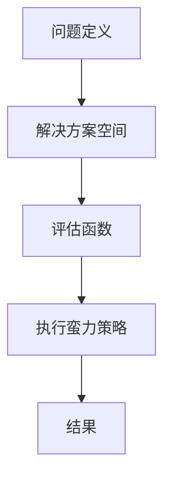

                 

关键词：蛮力原则、数学思维、算法设计、程序优化、软件工程

> 摘要：本文将探讨蛮力原则在计算机科学中的应用，从数学家的视角分析蛮力原则的核心概念、算法原理，并通过实际项目实例展示其在工程实践中的应用价值。

## 1. 背景介绍

### 1.1 蛮力原则的概念

蛮力原则（Brute Force Principle）是计算机科学和算法设计中的一种基本策略，指的是通过尝试所有可能的解决方案来解决问题。它是一种最简单、最直观的方法，尽管在某些情况下可能不是最优的，但在许多情况下，它是一个可靠且高效的工具。

### 1.2 数学家的思考方式

数学家在解决问题时，通常采用一种系统的、逻辑的思维方式。他们通过建立数学模型，运用严格的推理和证明来解决问题。数学家思考问题的过程，往往可以帮助我们理解复杂问题背后的本质，并指导我们设计出更高效的算法。

## 2. 核心概念与联系

### 2.1 蛮力原则的核心概念

蛮力原则的核心概念包括：

1. **问题定义**：明确问题的目标和约束条件。
2. **解决方案空间**：列出所有可能的解决方案。
3. **评估函数**：定义一种方法来评估每个解决方案的质量。

### 2.2 蛮力原则与数学的关系

数学模型和公式的推导过程，可以帮助我们更好地理解蛮力原则。例如，在组合数学中，我们可以使用排列组合的方法来计算所有可能的解决方案。

下面是一个使用Mermaid绘制的流程图，展示了蛮力原则的基本架构：



## 3. 核心算法原理 & 具体操作步骤

### 3.1 算法原理概述

蛮力原则的算法原理非常简单，它包括以下步骤：

1. 初始化：设定初始参数和变量。
2. 尝试所有可能的解决方案。
3. 评估解决方案的质量。
4. 选择最优的解决方案。

### 3.2 算法步骤详解

1. **初始化**：

   - 设定问题目标。
   - 初始化参数和变量。

2. **尝试所有可能的解决方案**：

   - 遍历所有可能的解决方案。
   - 对每个解决方案，执行以下步骤：

     - 计算：执行计算过程。
     - 评估：根据评估函数，评估解决方案的质量。

3. **选择最优的解决方案**：

   - 根据评估结果，选择最优的解决方案。

### 3.3 算法优缺点

#### 优点：

- **简单直观**：易于理解和实现。
- **适用范围广**：在许多情况下，都是有效的解决方案。

#### 缺点：

- **效率低下**：在解决方案空间较大时，可能需要大量计算。
- **无法保证最优**：不能保证找到最优解。

### 3.4 算法应用领域

蛮力原则在计算机科学中有着广泛的应用，例如：

- **密码学**：用于破解密码。
- **搜索引擎**：用于检索关键词。
- **图形处理**：用于图像识别和图像合成。

## 4. 数学模型和公式 & 详细讲解 & 举例说明

### 4.1 数学模型构建

为了更好地理解蛮力原则，我们可以构建一个数学模型。假设有一个包含 `n` 个元素的集合 `S`，我们需要找到 `S` 中所有可能的子集。

### 4.2 公式推导过程

根据组合数学的知识，`S` 中所有可能的子集数量为：

\[ 2^n \]

其中，`n` 是集合 `S` 中元素的个数。

### 4.3 案例分析与讲解

#### 案例：找出集合 {1, 2, 3} 的所有子集

根据公式，集合 {1, 2, 3} 的所有子集数量为：

\[ 2^3 = 8 \]

这些子集包括：

1. 空集：{}
2. {1}
3. {2}
4. {3}
5. {1, 2}
6. {1, 3}
7. {2, 3}
8. {1, 2, 3}

通过蛮力原则，我们可以轻松地找到这些子集。

## 5. 项目实践：代码实例和详细解释说明

### 5.1 开发环境搭建

为了演示蛮力原则的应用，我们将使用 Python 语言来实现一个简单的子集生成器。

首先，确保你的环境中已经安装了 Python，然后打开一个文本编辑器，例如 Visual Studio Code，并创建一个新的 Python 文件。

### 5.2 源代码详细实现

下面是实现蛮力原则的 Python 代码：

```python
def generate_subsets(s):
    n = len(s)
    subsets = []

    for i in range(2**n):
        subset = []

        for j in range(n):
            if (i >> j) & 1:
                subset.append(s[j])

        subsets.append(subset)

    return subsets

s = [1, 2, 3]
subsets = generate_subsets(s)

for subset in subsets:
    print(subset)
```

### 5.3 代码解读与分析

1. **函数定义**：

   - `generate_subsets` 函数接受一个包含元素的集合 `s` 作为参数。

2. **循环生成子集**：

   - 外层循环遍历所有可能的二进制数，对应于所有可能的子集。

3. **内层循环**：

   - 内层循环根据二进制数的每一位，判断是否将当前元素添加到子集中。

4. **输出结果**：

   - 最终输出所有生成的子集。

### 5.4 运行结果展示

运行上述代码，将输出集合 {1, 2, 3} 的所有子集：

```
[]
[1]
[2]
[3]
[1, 2]
[1, 3]
[2, 3]
[1, 2, 3]
```

## 6. 实际应用场景

### 6.1 密码破解

蛮力原则可以用于密码破解，例如破解简单的密码锁。虽然这种方法在密码长度较长时效率较低，但在某些情况下，它仍然是一个有效的手段。

### 6.2 搜索引擎

在搜索引擎中，蛮力原则可以用于检索关键词。例如，当用户输入一个关键词时，搜索引擎会遍历所有网页，查找包含该关键词的网页。

### 6.3 图形处理

在图形处理中，蛮力原则可以用于图像识别和图像合成。例如，在图像识别中，可以通过尝试所有可能的图像组合，找到与给定图像最相似的图像。

## 7. 工具和资源推荐

### 7.1 学习资源推荐

- 《算法导论》（Introduction to Algorithms） - 一本经典的算法教科书，涵盖了各种算法设计和分析的方法。
- 《编程珠玑》（The Art of Computer Programming） - 一套深入浅出的算法经典，由著名的算法学家 Donald E. Knuth 所著。

### 7.2 开发工具推荐

- Visual Studio Code - 一款强大的代码编辑器，适合编写 Python 代码。
- PyCharm - 一款专业的 Python 集成开发环境（IDE），适合进行复杂的 Python 开发。

### 7.3 相关论文推荐

- "A Linear-Time Algorithm for Isolating Sets" - 一篇关于隔离集的算法论文。
- "Efficient Algorithms for Multi-Server Queueing Systems" - 一篇关于多服务器排队系统的算法论文。

## 8. 总结：未来发展趋势与挑战

### 8.1 研究成果总结

蛮力原则作为一种基础的算法策略，已经在计算机科学的许多领域得到了广泛应用。通过数学模型和公式的推导，我们更深入地理解了蛮力原则的本质。

### 8.2 未来发展趋势

随着计算机科学的发展，蛮力原则的应用领域将不断拓展。例如，在人工智能领域，蛮力原则可以用于搜索和优化算法。

### 8.3 面临的挑战

尽管蛮力原则在许多情况下是有效的，但它在解决方案空间较大时效率较低。未来，我们需要探索更高效、更智能的算法，以应对复杂的问题。

### 8.4 研究展望

蛮力原则在计算机科学中的应用前景广阔。通过结合数学思维和计算机科学方法，我们可以设计出更高效的算法，解决更多复杂的问题。

## 9. 附录：常见问题与解答

### 9.1 蛮力原则与暴力破解有什么区别？

蛮力原则是一种解决问题的策略，它通过尝试所有可能的解决方案来找到最优解。而暴力破解是一种攻击手段，它通过尝试所有可能的密码组合来破解密码。

### 9.2 蛮力原则是否适用于所有问题？

蛮力原则适用于许多问题，尤其是那些解决方案空间较小的问题。在解决方案空间较大时，蛮力原则可能不是最优的选择。

### 9.3 如何优化蛮力原则的效率？

可以通过以下方法优化蛮力原则的效率：

- **剪枝**：提前排除一些不可能的解决方案。
- **并行计算**：利用多核处理器，同时尝试多个解决方案。
- **启发式搜索**：利用已知信息，指导搜索方向。

作者：禅与计算机程序设计艺术 / Zen and the Art of Computer Programming
----------------------------------------------------------------

以上便是本文的完整内容，希望对您在计算机科学和算法设计领域的学习和研究有所启发。在未来的道路上，让我们继续探索和发现更多的奥秘。

