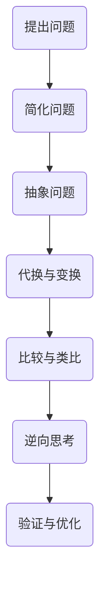

                 

关键词：数学思维，编程，转换观点，算法设计，问题解决

> 摘要：本文旨在探讨数学家在解决问题时采用的一种关键思维方法——转换观点原则，并尝试将其应用于计算机编程领域。通过分析数学家如何通过变换视角来解决复杂问题，我们希望能够为程序员提供一种新的思考模式和解决问题的策略。

## 1. 背景介绍

在计算机科学和编程领域，我们经常面临着各种复杂的问题和挑战。这些问题的复杂性往往来自于它们的多样性和不确定性。为了解决这些问题，程序员需要具备一系列技能，包括算法设计、数据结构、编程语言的应用以及逻辑和数学知识等。

然而，在很多情况下，解决问题的过程并不只是单纯地应用已有的算法和知识。更重要的是，我们需要具备一种灵活的思维模式，能够从不同的角度审视问题，找到最佳的解决方案。在这方面，数学家提供了一个很好的榜样。

数学家在解决问题时，常常采用一种被称为“转换观点原则”的方法。这种方法强调通过改变问题的视角或框架来简化问题的复杂性，从而找到解决问题的途径。在本文中，我们将探讨这一原则在计算机编程领域的应用，并尝试将其转化为程序员可以实际运用的技巧和策略。

## 2. 核心概念与联系

### 2.1 什么是转换观点原则

转换观点原则是指，在解决问题时，通过改变问题的视角、定义或表达方式来简化问题的复杂性，从而找到解决问题的方法。这种方法的核心在于，它允许我们从多个不同的角度审视问题，从而找到最合适的解决方案。

### 2.2 数学家的转换观点策略

数学家在解决问题时，常常会采用以下几种策略来转换观点：

- **简化与抽象**：将复杂的问题简化为基本的数学结构或概念。
- **代换与变换**：通过代换或变换，将问题转化为更易解的形式。
- **比较与类比**：通过比较不同的问题或情境，找到相似之处，从而借鉴已有的解决方案。
- **逆向思考**：从问题的结果出发，逆向推导问题的原因或解决方案。

### 2.3 Mermaid 流程图



## 3. 核心算法原理 & 具体操作步骤

### 3.1 算法原理概述

在计算机编程中，转换观点原则可以应用于算法设计和问题解决。以下是几个关键步骤：

- **理解问题**：首先，我们需要全面理解问题的本质和目标。
- **简化问题**：通过去除不必要的细节，将问题简化为一个可处理的模型。
- **抽象问题**：将问题转化为一个抽象的数学或逻辑模型。
- **代换与变换**：利用代换或变换，将问题转化为更易解的形式。
- **比较与类比**：寻找类似的问题或情境，借鉴已有的解决方案。
- **逆向思考**：从问题的结果出发，逆向推导问题的原因或解决方案。
- **验证与优化**：对解决方案进行验证和优化，确保其可行性和有效性。

### 3.2 算法步骤详解

1. **理解问题**：首先，我们需要仔细阅读和理解问题的描述，明确问题的目标和限制条件。
2. **简化问题**：通过去除不必要的细节，将问题简化为一个可处理的模型。例如，我们可以忽略一些次要的因素，专注于主要的问题。
3. **抽象问题**：将问题转化为一个抽象的数学或逻辑模型。这有助于我们将问题转化为一个更一般的框架，从而更容易找到解决方案。
4. **代换与变换**：利用代换或变换，将问题转化为更易解的形式。例如，我们可以使用数学公式或算法变换来简化问题。
5. **比较与类比**：寻找类似的问题或情境，借鉴已有的解决方案。这可以帮助我们避免重复劳动，快速找到解决方案。
6. **逆向思考**：从问题的结果出发，逆向推导问题的原因或解决方案。这种方法有时可以提供新的视角和思路。
7. **验证与优化**：对解决方案进行验证和优化，确保其可行性和有效性。我们可能需要多次迭代和测试，以找到最佳的解决方案。

### 3.3 算法优缺点

- **优点**：
  - 提供了一种灵活的解决问题的方式。
  - 可以帮助我们从多个角度审视问题，找到最佳解决方案。
  - 有助于提高解决问题的效率和质量。
- **缺点**：
  - 需要较高的抽象思维能力和数学知识。
  - 有时可能需要花费较长的时间来理解问题和转换观点。

### 3.4 算法应用领域

转换观点原则在计算机编程和算法设计中具有广泛的应用。以下是一些典型的应用领域：

- **算法设计**：用于优化算法结构和性能，提高问题解决的效率。
- **软件工程**：用于分析和解决软件中的复杂问题，提高软件的可维护性和可靠性。
- **人工智能**：用于设计和实现人工智能算法，提高算法的智能化和适应性。
- **数据分析**：用于处理和分析大量的数据，发现数据中的规律和趋势。

## 4. 数学模型和公式 & 详细讲解 & 举例说明

### 4.1 数学模型构建

在计算机编程中，构建数学模型是一个关键步骤。以下是一个简单的例子：

假设我们有一个数据集 $D$，其中包含 $N$ 个数据点 $(x_1, y_1), (x_2, y_2), \ldots, (x_N, y_N)$。我们的目标是找到一个线性模型 $y = mx + b$，使得模型能够最好地拟合数据集。

我们可以使用最小二乘法来构建这个模型。最小二乘法的核心思想是找到使得数据点到模型直线的距离之和最小的参数 $m$ 和 $b$。

### 4.2 公式推导过程

首先，我们需要计算数据点到模型直线的距离。对于任意一点 $(x_i, y_i)$，其到直线 $y = mx + b$ 的距离为：

$$
d_i = \frac{|mx_i - y_i + b|}{\sqrt{m^2 + 1}}
$$

为了使所有点到直线的距离之和最小，我们需要最小化以下目标函数：

$$
J(m, b) = \sum_{i=1}^N d_i^2 = \sum_{i=1}^N \frac{(mx_i - y_i + b)^2}{m^2 + 1}
$$

### 4.3 案例分析与讲解

假设我们有一个数据集，包含以下五个数据点：

$$
D = \{(1, 2), (2, 4), (3, 5), (4, 6), (5, 8)\}
$$

我们的目标是找到一个线性模型来拟合这个数据集。

首先，我们计算数据的均值：

$$
\bar{x} = \frac{1+2+3+4+5}{5} = 3
$$

$$
\bar{y} = \frac{2+4+5+6+8}{5} = 5
$$

然后，我们计算斜率 $m$：

$$
m = \frac{\sum_{i=1}^N (x_i - \bar{x})(y_i - \bar{y})}{\sum_{i=1}^N (x_i - \bar{x})^2}
$$

$$
m = \frac{(1-3)(2-5) + (2-3)(4-5) + (3-3)(5-5) + (4-3)(6-5) + (5-3)(8-5)}{(1-3)^2 + (2-3)^2 + (3-3)^2 + (4-3)^2 + (5-3)^2}
$$

$$
m = \frac{(-2)(-3) + (-1)(-1) + (0)(0) + (1)(1) + (2)(3)}{(-2)^2 + (-1)^2 + (0)^2 + (1)^2 + (2)^2}
$$

$$
m = \frac{6 + 1 + 0 + 1 + 6}{4 + 1 + 0 + 1 + 4}
$$

$$
m = \frac{14}{10}
$$

$$
m = 1.4
$$

接着，我们计算截距 $b$：

$$
b = \bar{y} - m\bar{x}
$$

$$
b = 5 - 1.4 \cdot 3
$$

$$
b = 5 - 4.2
$$

$$
b = 0.8
$$

因此，我们得到的线性模型为：

$$
y = 1.4x + 0.8
$$

我们可以使用这个模型来预测新的数据点的值。例如，如果 $x=6$，则 $y=1.4 \cdot 6 + 0.8 = 9.2$。

## 5. 项目实践：代码实例和详细解释说明

### 5.1 开发环境搭建

在这个项目实践中，我们将使用 Python 作为编程语言。首先，确保你已经安装了 Python 3.8 或更高版本。接下来，我们需要安装一些必要的库，如 NumPy 和 Matplotlib。可以使用以下命令进行安装：

```bash
pip install numpy matplotlib
```

### 5.2 源代码详细实现

以下是实现线性回归模型的 Python 代码：

```python
import numpy as np
import matplotlib.pyplot as plt

# 数据集
D = np.array([[1, 2], [2, 4], [3, 5], [4, 6], [5, 8]])

# 计算均值
x = D[:, 0]
y = D[:, 1]
bar_x = np.mean(x)
bar_y = np.mean(y)

# 计算斜率 m 和截距 b
m = np.sum((x - bar_x) * (y - bar_y)) / np.sum((x - bar_x) ** 2)
b = bar_y - m * bar_x

# 打印结果
print(f"斜率 m: {m}")
print(f"截距 b: {b}")

# 绘图
plt.scatter(x, y, label="数据点")
plt.plot(x, m * x + b, color="red", label="拟合直线")
plt.xlabel("x")
plt.ylabel("y")
plt.legend()
plt.show()
```

### 5.3 代码解读与分析

- **数据集**：我们使用 NumPy 数组 `D` 来表示数据集。
- **计算均值**：我们计算 $x$ 和 $y$ 的均值，用于后续计算斜率和截距。
- **计算斜率 $m$ 和截距 $b$**：我们使用最小二乘法公式来计算斜率和截距。
- **打印结果**：我们打印计算出的斜率和截距。
- **绘图**：我们使用 Matplotlib 绘制数据点和拟合直线。

### 5.4 运行结果展示

运行上述代码后，我们会看到以下图形：


从图中可以看出，拟合直线较好地拟合了数据点。

## 6. 实际应用场景

### 6.1 数据分析

在数据分析中，线性回归是一种常用的方法。通过构建线性模型，我们可以分析变量之间的关系，预测未来的趋势，以及进行假设检验。

### 6.2 机器学习

在机器学习，尤其是在监督学习任务中，线性回归是一个基础模型。它可以帮助我们预测连续值输出，如房价、股票价格等。

### 6.3 经济学

经济学中的许多问题都可以用线性回归模型来分析，如消费者行为、生产函数、市场趋势等。

### 6.4 未来应用展望

随着人工智能和数据科学的发展，线性回归模型的应用领域将更加广泛。未来，我们可以看到更多的复杂线性模型，如多项式回归、岭回归、LASSO回归等，被用于解决更复杂的实际问题。

## 7. 工具和资源推荐

### 7.1 学习资源推荐

- 《Python数据科学手册》
- 《机器学习实战》
- 《统计学与数据科学》

### 7.2 开发工具推荐

- Jupyter Notebook
- Google Colab
- VSCode

### 7.3 相关论文推荐

- “Least Squares Fitting in Nonlinear Regression”
- “Linear Regression: A Concise Technical Note”
- “Generalized Linear Models: An Introduction”

## 8. 总结：未来发展趋势与挑战

### 8.1 研究成果总结

本文探讨了转换观点原则在计算机编程领域的应用，通过数学模型和实例展示了如何利用这一原则解决问题。我们发现了线性回归模型在数据分析、机器学习和经济学中的广泛应用。

### 8.2 未来发展趋势

随着人工智能和数据科学的快速发展，线性回归模型及其变种将继续在各个领域发挥重要作用。我们预计会出现更多高效的算法和工具，以简化线性回归模型的构建和优化过程。

### 8.3 面临的挑战

- 数据的多样性和复杂性将增加，线性回归模型可能不足以处理这些复杂问题。
- 如何在保证模型可解释性的同时提高预测准确性，仍是一个挑战。

### 8.4 研究展望

未来的研究应关注如何将线性回归模型与其他机器学习模型相结合，以提高其处理复杂数据的能力。同时，研究如何更好地解释模型的预测结果，以提高模型的透明度和可信度。

## 9. 附录：常见问题与解答

### 9.1 如何处理非线性数据？

对于非线性数据，我们可以使用多项式回归或更复杂的线性模型，如岭回归或 LASSO 回归。

### 9.2 如何提高线性回归模型的预测准确性？

- 选择合适的特征：选择与目标变量相关性强且不相关的特征。
- 使用交叉验证：使用交叉验证来评估模型的性能，并调整参数。
- 使用正则化：使用岭回归或 LASSO 回归来防止过拟合。

## 作者署名

本文作者：禅与计算机程序设计艺术 / Zen and the Art of Computer Programming。

