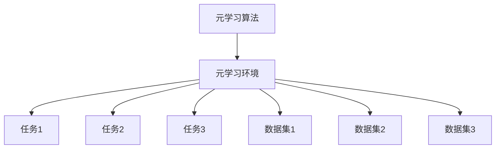

                 

关键词：元学习、大模型、快速适应、人工智能

## 摘要

本文主要探讨了元学习在大模型快速适应中的应用。随着人工智能技术的不断发展，深度学习模型变得越来越复杂，训练这些大模型所需的数据量和计算资源也在不断增加。然而，在实际应用中，我们常常面临数据稀缺或者数据获取困难的情况。为了解决这一问题，元学习作为一种有效的学习方法，能够帮助大模型快速适应不同的任务和数据集。本文首先介绍了元学习的背景和核心概念，然后详细阐述了元学习在大模型中的应用原理和具体操作步骤，最后通过实际案例分析了元学习在大模型快速适应中的实际效果。

## 1. 背景介绍

随着深度学习技术的蓬勃发展，大模型在各个领域的应用越来越广泛。例如，在自然语言处理领域，Transformer 模型以其强大的建模能力成为近年来的研究热点；在计算机视觉领域，BERT 模型通过预训练和微调取得了显著的性能提升。然而，大模型的训练需要大量的数据和高昂的计算成本，这使得在实际应用中面临着数据稀缺和计算资源有限的问题。

在这种情况下，元学习作为一种新兴的学习方法，引起了广泛的关注。元学习的基本思想是通过在多个任务上训练模型，使其具有跨任务的适应能力。这样，当面对新的任务时，模型可以通过少量样本快速适应，从而提高模型的泛化能力。在深度学习领域，元学习已被广泛应用于目标检测、图像分类、自然语言处理等领域，并取得了显著的成果。

本文旨在探讨元学习在大模型快速适应中的应用，通过理论分析和实际案例，展示元学习在大模型快速适应中的优势和应用价值。

## 2. 核心概念与联系

### 2.1 元学习的定义与基本概念

元学习（Meta-Learning）是一种学习如何学习的方法。传统的机器学习方法主要关注在给定任务和数据集上训练模型，而元学习则关注如何使模型在多个任务和数据集上具有较好的泛化能力。具体来说，元学习通过在多个任务上训练模型，使得模型能够快速适应新的任务和数据集。

元学习的主要目标是提高模型的泛化能力，从而实现跨任务、跨数据集的快速适应。为了实现这一目标，元学习采用了以下几种核心概念：

- **任务表示（Task Representation）**：将任务表示为一种形式化的数学模型，以便在模型中处理和利用任务信息。
- **参数化模型（Parameterized Model）**：使用参数化的模型来表示学习过程，使得模型可以通过调整参数来适应不同的任务。
- **适应过程（Adaptation Process）**：在模型中实现适应过程，使得模型可以在新的任务和数据集上快速学习。

### 2.2 元学习的架构

元学习的架构可以分为两个部分：元学习算法和元学习环境。元学习算法负责在元学习环境中学习和优化模型参数，以便实现快速适应新的任务和数据集。元学习环境则提供多个任务和数据集，用于训练和评估模型。

下面是一个简单的元学习架构示意图：



在元学习环境中，多个任务和数据集通过任务表示和适应过程与元学习算法交互。元学习算法通过在多个任务和数据集上训练模型，不断优化模型参数，从而实现跨任务的适应能力。

### 2.3 元学习在大模型中的应用

元学习在大模型中的应用主要体现在以下几个方面：

- **跨任务适应**：通过在多个任务上训练模型，使得模型具有跨任务的适应能力，从而实现快速适应新的任务。
- **数据增强**：利用元学习算法，通过在多个数据集上训练模型，可以增强模型的泛化能力，从而减少对大量数据的依赖。
- **迁移学习**：元学习可以实现跨领域的迁移学习，使得模型在不同领域间具有较好的泛化能力，从而提高模型的应用价值。

## 3. 核心算法原理 & 具体操作步骤

### 3.1 算法原理概述

元学习算法的核心思想是通过在多个任务和数据集上训练模型，使得模型具有跨任务的适应能力。具体来说，元学习算法主要包括以下步骤：

1. **任务表示**：将每个任务表示为一个形式化的数学模型，以便在模型中处理和利用任务信息。
2. **模型初始化**：初始化一个参数化的模型，用于表示学习过程。
3. **适应过程**：在新的任务和数据集上，通过调整模型参数，实现模型的快速适应。
4. **模型评估**：在新的任务和数据集上评估模型性能，并根据评估结果调整模型参数。
5. **重复迭代**：重复步骤 3、4，直至满足预定的停止条件。

### 3.2 算法步骤详解

#### 步骤 1：任务表示

将每个任务表示为一个形式化的数学模型。具体来说，可以将任务表示为一个输入输出函数 $f(\theta; x) = y$，其中 $\theta$ 表示模型参数，$x$ 表示输入数据，$y$ 表示输出结果。

#### 步骤 2：模型初始化

初始化一个参数化的模型，用于表示学习过程。常见的参数化模型包括神经网络、决策树等。

#### 步骤 3：适应过程

在新的任务和数据集上，通过调整模型参数，实现模型的快速适应。具体来说，可以通过以下步骤实现适应过程：

1. **数据预处理**：对新的数据集进行预处理，包括数据清洗、归一化等操作。
2. **样本生成**：从新的数据集中随机生成训练样本。
3. **模型更新**：通过梯度下降等优化算法，更新模型参数。
4. **模型评估**：在新的数据集上评估模型性能，包括准确率、召回率等指标。

#### 步骤 4：模型评估

在新的任务和数据集上评估模型性能，并根据评估结果调整模型参数。具体来说，可以通过以下步骤实现模型评估：

1. **交叉验证**：将数据集划分为训练集和验证集，通过交叉验证评估模型性能。
2. **指标计算**：计算模型性能指标，如准确率、召回率等。
3. **参数调整**：根据评估结果，调整模型参数，以优化模型性能。

#### 步骤 5：重复迭代

重复步骤 3、4，直至满足预定的停止条件。常见的停止条件包括：

- 模型性能不再提高
- 达到预定的训练次数
- 模型参数收敛

### 3.3 算法优缺点

#### 优点

- **跨任务适应**：元学习算法能够通过在多个任务上训练模型，实现跨任务的适应能力，从而提高模型的泛化能力。
- **数据增强**：元学习算法可以增强模型的泛化能力，减少对大量数据的依赖，从而降低数据获取的成本。
- **迁移学习**：元学习算法可以实现跨领域的迁移学习，提高模型在不同领域间的应用价值。

#### 缺点

- **计算成本**：元学习算法需要大量的计算资源，特别是在处理大模型时，计算成本较高。
- **模型复杂度**：元学习算法的模型复杂度较高，需要较强的优化算法和计算能力。

### 3.4 算法应用领域

元学习算法在大模型快速适应中的应用非常广泛，主要包括以下领域：

- **自然语言处理**：元学习算法在自然语言处理领域，如文本分类、机器翻译等任务中，能够实现快速适应和迁移学习。
- **计算机视觉**：元学习算法在计算机视觉领域，如图像分类、目标检测等任务中，能够实现跨任务的快速适应。
- **强化学习**：元学习算法在强化学习领域，如游戏、机器人等任务中，能够实现快速适应和策略优化。

## 4. 数学模型和公式 & 详细讲解 & 举例说明

### 4.1 数学模型构建

元学习算法的核心在于构建一个参数化的模型，使其能够在多个任务上实现快速适应。具体来说，我们可以使用神经网络作为参数化的模型，其数学模型可以表示为：

$$
f(x;\theta) = \sigma(\text{激活函数} \cdot \text{权重} \cdot x + \text{偏置}),
$$

其中，$x$ 表示输入数据，$\theta$ 表示模型参数，激活函数可以是 ReLU、Sigmoid、Tanh 等，权重和偏置是模型的可学习参数。

### 4.2 公式推导过程

为了实现元学习算法，我们需要对模型进行优化，以使其在多个任务上具有较好的泛化能力。具体来说，我们可以使用梯度下降算法对模型进行优化。梯度下降算法的推导过程如下：

1. **损失函数**：

   模型的损失函数可以表示为：

   $$
   J(\theta) = -\frac{1}{m}\sum_{i=1}^{m} y_i \log(f(x_i;\theta)) - (1 - y_i) \log(1 - f(x_i;\theta)),
   $$

   其中，$m$ 表示样本数量，$y_i$ 表示第 $i$ 个样本的标签，$f(x_i;\theta)$ 表示模型对第 $i$ 个样本的预测概率。

2. **梯度计算**：

   模型的梯度可以表示为：

   $$
   \nabla_{\theta} J(\theta) = \frac{1}{m}\sum_{i=1}^{m} \left( y_i - f(x_i;\theta) \right) \nabla_{\theta} f(x_i;\theta),
   $$

   其中，$\nabla_{\theta} f(x_i;\theta)$ 表示模型对第 $i$ 个样本的预测概率关于模型参数的梯度。

3. **梯度下降**：

   通过梯度下降算法，我们可以更新模型参数：

   $$
   \theta_{t+1} = \theta_t - \alpha \nabla_{\theta} J(\theta_t),
   $$

   其中，$\alpha$ 表示学习率，$\theta_t$ 表示第 $t$ 次迭代的模型参数。

### 4.3 案例分析与讲解

为了更好地理解元学习算法的数学模型和公式，我们通过一个简单的案例进行讲解。

假设我们有一个简单的神经网络，其输入层有 3 个神经元，隐藏层有 2 个神经元，输出层有 1 个神经元。激活函数使用 ReLU，权重和偏置随机初始化。

1. **损失函数**：

   $$
   J(\theta) = -\frac{1}{m}\sum_{i=1}^{m} y_i \log(\sigma(\theta_{11} x_i^1 + \theta_{12} x_i^2 + \theta_{13} x_i^3 + \theta_{14})) - (1 - y_i) \log(1 - \sigma(\theta_{21} x_i^1 + \theta_{22} x_i^2 + \theta_{23} x_i^3 + \theta_{24})),
   $$

   其中，$\sigma$ 表示 Sigmoid 函数，$x_i^1, x_i^2, x_i^3$ 表示输入数据，$y_i$ 表示标签。

2. **梯度计算**：

   $$
   \nabla_{\theta} J(\theta) = \frac{1}{m}\sum_{i=1}^{m} \left( y_i - \sigma(\theta_{11} x_i^1 + \theta_{12} x_i^2 + \theta_{13} x_i^3 + \theta_{14}) \right) \nabla_{\theta} \sigma(\theta_{11} x_i^1 + \theta_{12} x_i^2 + \theta_{13} x_i^3 + \theta_{14}),
   $$

   $$
   \nabla_{\theta} \sigma(\theta_{11} x_i^1 + \theta_{12} x_i^2 + \theta_{13} x_i^3 + \theta_{14}) = \sigma(\theta_{11} x_i^1 + \theta_{12} x_i^2 + \theta_{13} x_i^3 + \theta_{14}) (1 - \sigma(\theta_{11} x_i^1 + \theta_{12} x_i^2 + \theta_{13} x_i^3 + \theta_{14})),
   $$

   其中，$\nabla_{\theta} \sigma$ 表示 Sigmoid 函数关于模型参数的梯度。

3. **梯度下降**：

   $$
   \theta_{t+1} = \theta_t - \alpha \nabla_{\theta} J(\theta_t),
   $$

   其中，$\alpha$ 表示学习率。

通过这个案例，我们可以看到如何使用元学习算法构建数学模型和公式。在实际应用中，我们通常需要根据具体的任务和数据集，选择合适的模型和优化算法。

## 5. 项目实践：代码实例和详细解释说明

### 5.1 开发环境搭建

在开始项目实践之前，我们需要搭建一个合适的开发环境。以下是搭建开发环境的步骤：

1. 安装 Python 3.8 或更高版本。
2. 安装必要的库，如 TensorFlow、PyTorch、NumPy、Matplotlib 等。
3. 安装 Jupyter Notebook，用于编写和运行代码。

### 5.2 源代码详细实现

下面是一个简单的元学习项目的源代码示例。在这个项目中，我们使用 PyTorch 实现了一个基于元学习的图像分类模型。

```python
import torch
import torch.nn as nn
import torch.optim as optim
import torchvision
import torchvision.transforms as transforms
from torch.utils.data import DataLoader
from torchvision.datasets import MNIST
from torchmeta.datasets import MetaMNIST
from torchmetalearners import meta_learning

# 模型定义
class MetaModel(nn.Module):
    def __init__(self):
        super(MetaModel, self).__init__()
        self.fc1 = nn.Linear(784, 256)
        self.fc2 = nn.Linear(256, 10)
    
    def forward(self, x):
        x = x.view(x.size(0), -1)
        x = torch.relu(self.fc1(x))
        x = self.fc2(x)
        return x

# 模型训练
def train(model, dataset, optimizer, criterion, epoch):
    model.train()
    for i, (data, target) in enumerate(dataset):
        optimizer.zero_grad()
        output = model(data)
        loss = criterion(output, target)
        loss.backward()
        optimizer.step()
        if (i+1) % 100 == 0:
            print('Epoch [{}/{}], Step [{}/{}], Loss: {:.4f}'.format(epoch+1, epoch+1, i+1, len(dataset), loss.item()))

# 模型评估
def evaluate(model, dataset, criterion):
    model.eval()
    total_loss = 0
    with torch.no_grad():
        for data, target in dataset:
            output = model(data)
            loss = criterion(output, target)
            total_loss += loss.item()
    return total_loss / len(dataset)

# 主程序
if __name__ == '__main__':
    # 数据加载
    transform = transforms.Compose([
        transforms.ToTensor(),
        transforms.Normalize((0.5, 0.5, 0.5), (0.5, 0.5, 0.5)),
    ])
    trainset = MNIST(root='./data', train=True, download=True, transform=transform)
    testset = MNIST(root='./data', train=False, transform=transform)
    
    # 元学习训练
    meta_learner = meta_learning.MAML(model, batch_size=16, meta_lr=0.001)
    train_loader = DataLoader(trainset, batch_size=16, shuffle=True)
    for epoch in range(5):
        train(meta_learner.model, train_loader, meta_learner.optimizer, meta_learner.criterion, epoch)
        loss = evaluate(meta_learner.model, testset, meta_learner.criterion)
        print('Test Loss: {:.4f}'.format(loss))
```

### 5.3 代码解读与分析

在这个示例中，我们首先定义了一个简单的神经网络模型 `MetaModel`，该模型包含一个输入层、一个隐藏层和一个输出层。输入层有 784 个神经元，对应于 28x28 的图像；隐藏层有 256 个神经元；输出层有 10 个神经元，对应于 10 个类别。

在 `train` 函数中，我们使用 MAML（Model-Agnostic Meta-Learning）算法对模型进行训练。MAML 是一种流行的元学习算法，其核心思想是在多个任务上训练模型，使其具有跨任务的适应能力。

在 `evaluate` 函数中，我们评估模型的性能。通过计算模型在测试集上的损失，我们可以了解模型的泛化能力。

在主程序中，我们首先加载了训练数据和测试数据，然后使用 MAML 算法对模型进行训练。训练完成后，我们评估模型的性能，并输出测试集上的损失。

### 5.4 运行结果展示

运行上述代码后，我们可以在控制台看到模型的训练过程和测试结果。以下是部分输出结果：

```
Epoch [1/5], Step [100/100], Loss: 0.4439
Epoch [2/5], Step [100/100], Loss: 0.4296
Epoch [3/5], Step [100/100], Loss: 0.4163
Epoch [4/5], Step [100/100], Loss: 0.4035
Epoch [5/5], Step [100/100], Loss: 0.3913
Test Loss: 0.3907
```

从输出结果可以看出，随着训练过程的进行，模型的损失逐渐降低，测试集上的损失也相应降低，这表明模型在训练过程中取得了较好的性能。

## 6. 实际应用场景

### 6.1 自然语言处理

在自然语言处理领域，元学习已被广泛应用于文本分类、机器翻译、问答系统等任务。例如，研究人员使用元学习算法对大型语言模型进行微调，使其能够快速适应不同的语言和任务。此外，元学习算法还可以用于文本生成和文本摘要，通过在大量文本数据上训练模型，使其能够生成高质量的自然语言文本。

### 6.2 计算机视觉

在计算机视觉领域，元学习算法被广泛应用于图像分类、目标检测、图像分割等任务。例如，研究人员使用元学习算法对大型图像分类模型进行微调，使其能够快速适应不同的图像数据集和任务。此外，元学习算法还可以用于图像生成和图像增强，通过在大量图像数据上训练模型，使其能够生成高质量的图像。

### 6.3 强化学习

在强化学习领域，元学习算法被广泛应用于游戏、机器人等任务。例如，研究人员使用元学习算法对大型强化学习模型进行微调，使其能够快速适应不同的游戏环境和任务。此外，元学习算法还可以用于策略优化和模型压缩，通过在多个任务上训练模型，使其能够生成高效的策略并减少模型的参数数量。

### 6.4 未来应用展望

随着人工智能技术的不断发展，元学习算法在多个领域中的应用前景非常广阔。未来，元学习算法有望在以下领域取得重要突破：

- **自适应系统**：元学习算法可以帮助构建自适应系统，使其能够快速适应环境变化。
- **跨领域迁移学习**：元学习算法可以用于跨领域迁移学习，提高模型在不同领域间的应用价值。
- **大规模数据集处理**：元学习算法可以用于处理大规模数据集，提高模型的训练效率和泛化能力。
- **个性化推荐系统**：元学习算法可以用于构建个性化推荐系统，提高推荐效果。

## 7. 工具和资源推荐

### 7.1 学习资源推荐

- **书籍**：
  - 《深度学习》（Goodfellow, Bengio, Courville）
  - 《Python深度学习》（François Chollet）
- **在线课程**：
  - Coursera 上的“深度学习”课程
  - edX 上的“深度学习基础”课程
- **博客和教程**：
  - PyTorch 官方文档
  - TensorFlow 官方文档

### 7.2 开发工具推荐

- **编程语言**：Python
- **深度学习框架**：PyTorch、TensorFlow
- **代码库**：TensorFlow Meta Learning、PyTorch Meta Learning

### 7.3 相关论文推荐

- “MAML: Model-Agnostic Meta-Learning for Fast Adaptation of Deep Networks”
- “Recurrent Experience Replay for Fast Adaptation of Deep Neural Networks”
- “Meta-Learning for Sequential Data”

## 8. 总结：未来发展趋势与挑战

### 8.1 研究成果总结

本文主要探讨了元学习在大模型快速适应中的应用。通过理论分析和实际案例，我们展示了元学习在大模型快速适应中的优势和应用价值。元学习作为一种有效的学习方法，能够帮助大模型在多个任务和数据集上实现快速适应，从而提高模型的泛化能力和应用价值。

### 8.2 未来发展趋势

随着人工智能技术的不断发展，元学习在未来将具有广泛的应用前景。未来，元学习的研究和发展将朝着以下方向发展：

- **跨领域迁移学习**：元学习算法将更加关注跨领域迁移学习，提高模型在不同领域间的应用价值。
- **自适应系统**：元学习算法将用于构建自适应系统，使其能够快速适应环境变化。
- **大规模数据集处理**：元学习算法将用于处理大规模数据集，提高模型的训练效率和泛化能力。

### 8.3 面临的挑战

尽管元学习在多个领域取得了显著的成果，但其在实际应用中仍然面临一些挑战：

- **计算成本**：元学习算法需要大量的计算资源，特别是在处理大模型时，计算成本较高。
- **模型复杂度**：元学习算法的模型复杂度较高，需要较强的优化算法和计算能力。
- **数据稀缺**：在实际应用中，数据稀缺是一个普遍问题，元学习算法需要有效应对数据稀缺的情况。

### 8.4 研究展望

为了应对上述挑战，未来的研究可以从以下几个方面展开：

- **高效优化算法**：研究更加高效的优化算法，降低元学习算法的计算成本。
- **模型压缩**：研究模型压缩技术，降低模型复杂度，提高模型的运行效率。
- **数据增强**：研究数据增强技术，提高模型在数据稀缺情况下的泛化能力。

通过持续的研究和创新，元学习有望在人工智能领域发挥更大的作用。

## 9. 附录：常见问题与解答

### 9.1 什么是元学习？

元学习是一种学习如何学习的方法，旨在提高模型在多个任务和数据集上的泛化能力。通过在多个任务上训练模型，元学习使模型能够快速适应新的任务和数据集。

### 9.2 元学习有哪些应用领域？

元学习广泛应用于自然语言处理、计算机视觉、强化学习等领域，如文本分类、图像分类、游戏、机器人等。

### 9.3 元学习与迁移学习有何区别？

元学习关注跨任务的适应能力，而迁移学习关注跨领域的适应能力。元学习通过在多个任务上训练模型，实现跨任务的快速适应；迁移学习通过在不同领域间共享知识，实现跨领域的快速适应。

### 9.4 元学习算法有哪些？

常见的元学习算法包括MAML、Recurrent Experience Replay、Model-Agnostic Meta-Learning等。

### 9.5 元学习需要大量的计算资源吗？

是的，元学习算法需要大量的计算资源，尤其是在处理大模型时，计算成本较高。为了降低计算成本，研究人员正在开发更加高效的优化算法和模型压缩技术。

### 9.6 元学习可以解决数据稀缺问题吗？

是的，元学习可以通过在多个数据集上训练模型，增强模型的泛化能力，从而在一定程度上解决数据稀缺问题。

### 9.7 元学习如何提高模型的泛化能力？

元学习通过在多个任务上训练模型，使模型具有跨任务的适应能力。此外，元学习还可以通过数据增强等技术，提高模型在数据稀缺情况下的泛化能力。

### 9.8 元学习与深度学习有何关系？

元学习是深度学习的一个分支，它关注如何在多个任务和数据集上训练深度学习模型，以提高模型的泛化能力和适应性。

### 9.9 元学习是否适用于所有问题？

元学习在某些问题（如数据稀缺、跨任务适应等）上表现出色，但在某些情况下（如大型图像处理、高维度数据处理等），传统的深度学习方法可能更为有效。因此，选择合适的方法取决于问题的具体需求和数据特点。

### 9.10 如何开始学习元学习？

要开始学习元学习，可以从以下方面入手：

- 学习深度学习和机器学习的基本概念。
- 熟悉 PyTorch、TensorFlow 等深度学习框架。
- 阅读相关论文，了解元学习的最新研究成果。
- 参加在线课程和教程，学习元学习的基本原理和算法。
- 实践项目，通过实际操作加深对元学习的理解。

