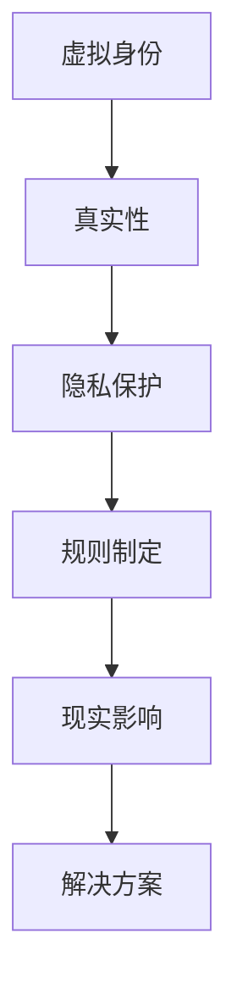

                 

元宇宙（Metaverse）一词，源自“Meta”（超越）和“Verse”（宇宙），是一种虚拟现实技术的集合，通过融合物理世界和数字世界，创造出一种全新的交互和体验方式。随着技术的发展，元宇宙已经成为一个日益繁荣的领域，吸引了无数的开发者、企业家和用户。然而，随着元宇宙的发展，伦理道德问题也逐渐凸显出来，特别是虚拟行为对现实社会的影响。

本文将深入探讨元宇宙中的伦理道德问题，包括虚拟身份、虚拟行为的真实性、隐私保护、虚拟世界的规则制定等方面，并分析这些伦理道德问题对现实社会的影响。此外，我们还将探讨如何通过技术和制度的创新来应对这些挑战。

> 关键词：元宇宙、伦理道德、虚拟现实、现实影响

> 摘要：本文旨在探讨元宇宙中的伦理道德问题，包括虚拟身份、虚拟行为的真实性、隐私保护、虚拟世界的规则制定等，分析这些伦理道德问题对现实社会的影响，并提出通过技术和制度的创新来应对这些挑战的思路。

## 1. 背景介绍

### 1.1 元宇宙的发展历程

元宇宙的概念最早可以追溯到1960年代，当时由美国科幻作家Neal Stephenson在其小说《雪崩》中提出。随着互联网和虚拟现实技术的发展，元宇宙逐渐从科幻小说中的设想变成了现实。在2010年代，随着虚拟现实技术和增强现实技术的成熟，元宇宙的概念开始受到广泛关注。2018年，Facebook公司宣布成立虚拟现实实验室，正式将“元宇宙”提上了公司的战略日程。

近年来，元宇宙的发展速度迅猛，越来越多的公司和创业者加入其中，包括微软、谷歌、腾讯等科技巨头。元宇宙的繁荣不仅带来了新的商业机会，也引发了一系列伦理道德问题。

### 1.2 元宇宙的现状与趋势

当前，元宇宙的应用已经涵盖了游戏、教育、娱乐、社交等多个领域。例如，虚拟现实游戏《Pokémon Go》的成功，展示了元宇宙在游戏领域的巨大潜力。在教育领域，元宇宙为远程教育提供了全新的方式，学生可以在虚拟课堂中与教师和同学互动，提高学习体验。

然而，元宇宙的发展也带来了一些问题。虚拟身份的真实性、隐私保护、虚拟世界的规则制定等伦理道德问题，成为当前元宇宙领域关注的焦点。这些问题不仅影响元宇宙的用户体验，也可能对现实社会产生深远影响。

## 2. 核心概念与联系

### 2.1 虚拟身份

在元宇宙中，虚拟身份是用户在虚拟世界中的代表。虚拟身份可以是完全虚构的，也可以是基于现实世界的身份。虚拟身份的真实性是元宇宙中的一个重要问题。如果虚拟身份无法保证真实性，可能会导致虚拟世界的混乱和不公平。

### 2.2 虚拟行为的真实性

虚拟行为的真实性是指用户在元宇宙中的行为是否反映了其在现实世界中的行为。例如，在虚拟现实游戏中，用户可能会进行攻击、盗窃等行为。这些行为是否应该受到惩罚，如何定义其真实性，是元宇宙中需要解决的重要问题。

### 2.3 隐私保护

隐私保护是元宇宙中的另一个重要问题。在元宇宙中，用户的大量个人信息，如行为记录、社交关系等，可能会被收集和利用。如何保护用户的隐私，防止个人信息被滥用，是元宇宙中需要关注的问题。

### 2.4 虚拟世界的规则制定

虚拟世界的规则制定是元宇宙中需要解决的重要问题。虚拟世界的规则应该公平、合理，同时能够有效维护虚拟世界的秩序。然而，规则的制定往往会涉及到利益分配、权力平衡等问题，如何制定出公平、合理的规则，是元宇宙中需要解决的关键问题。

### 2.5 Mermaid 流程图



## 3. 核心算法原理 & 具体操作步骤

### 3.1 算法原理概述

在元宇宙中，解决伦理道德问题的核心算法是区块链算法。区块链算法通过去中心化的方式，保证了数据的真实性和不可篡改性，为元宇宙中的虚拟身份、虚拟行为的真实性、隐私保护和规则制定提供了技术支持。

### 3.2 算法步骤详解

1. **虚拟身份的创建**：用户在进入元宇宙时，需要创建一个虚拟身份。虚拟身份的创建过程通过区块链算法，确保身份的唯一性和真实性。

2. **虚拟行为的记录**：用户在元宇宙中的行为将被实时记录，并存储在区块链上。这些记录保证了虚拟行为的真实性，同时也为后续的规则制定提供了数据支持。

3. **隐私保护**：区块链算法中的加密技术，确保用户的个人信息不会被泄露。同时，用户可以选择匿名参与元宇宙活动，进一步保护隐私。

4. **规则制定**：元宇宙的规则将通过区块链算法进行制定和执行。规则的制定过程是去中心化的，确保了规则的公平性和合理性。

### 3.3 算法优缺点

**优点**：

- 真实性：区块链算法保证了数据的真实性和不可篡改性。
- 隐私保护：加密技术有效保护了用户的隐私。
- 公平性：去中心化的规则制定过程，保证了规则的公平性。

**缺点**：

- **效率问题**：区块链算法的运算效率相对较低。
- **复杂性**：区块链算法的技术复杂度较高，需要专业的技术人员进行维护。

### 3.4 算法应用领域

区块链算法在元宇宙中的应用非常广泛，包括虚拟身份的创建、虚拟行为的记录、隐私保护和规则制定等。此外，区块链算法还可以应用于现实世界的许多领域，如金融、物流、医疗等，为这些领域提供去中心化的解决方案。

## 4. 数学模型和公式 & 详细讲解 & 举例说明

### 4.1 数学模型构建

在元宇宙中，伦理道德问题的解决可以通过数学模型来实现。以下是一个简单的数学模型，用于解决虚拟行为的真实性验证问题。

```latex
模型假设：
- V: 虚拟行为集合
- R: 真实性验证规则集
- B: 虚拟行为真实度评分

模型构建：
1. 对于每一个虚拟行为 v ∈ V，计算其真实度评分 B(v)：
   B(v) = f(R(v), A(v))
   其中，R(v) 是 v 的真实性验证规则，A(v) 是 v 的行为特征。

2. 对于所有的虚拟行为，计算其平均真实度评分：
   \bar{B} = \frac{1}{|V|} \sum_{v \in V} B(v)

3. 如果 \bar{B} 大于某个阈值 T，则认为元宇宙中的虚拟行为总体上是真实的。

模型公式：
B(v) = \frac{R(v)}{1 + e^{-k(A(v) - \mu)}}
其中，R(v) 是 v 的真实性验证规则，A(v) 是 v 的行为特征，k 和 μ 是模型参数。
```

### 4.2 公式推导过程

公式的推导基于贝叶斯定理和逻辑回归模型。首先，我们定义虚拟行为 v 的真实度评分 B(v) 为其真实性验证规则 R(v) 和行为特征 A(v) 的函数。然后，我们使用逻辑回归模型来估计 B(v)。具体推导过程如下：

```latex
假设：
- P(R(v) = 1 | A(v)) 是在给定行为特征 A(v) 下，虚拟行为 v 是真实的概率。
- P(A(v)) 是行为特征 A(v) 的概率。

根据贝叶斯定理，我们有：
P(R(v) = 1 | A(v)) = \frac{P(A(v) | R(v) = 1)P(R(v) = 1)}{P(A(v))}

假设：
- P(R(v) = 1) 是虚拟行为 v 是真实的先验概率。
- P(A(v) | R(v) = 1) 是在虚拟行为 v 是真实的情况下，行为特征 A(v) 的概率。

由于我们通常没有关于先验概率的直接信息，我们可以使用最大似然估计来估计 P(R(v) = 1 | A(v))。即：
P(R(v) = 1 | A(v)) = \frac{P(A(v) | R(v) = 1)P(R(v) = 1)}{\sum_{i=1}^n P(A(v) | R(v) = i)P(R(v) = i)}

假设：
- P(A(v) | R(v) = i) 是在虚拟行为 v 是真实的情况下，行为特征 A(v) 的概率，i = 0 或 1。

由于我们通常没有关于 P(A(v) | R(v) = i) 的直接信息，我们可以使用逻辑回归模型来估计 P(A(v) | R(v) = i)。即：
P(A(v) | R(v) = i) = \frac{1}{1 + e^{-(\beta_0 + \beta_1 A(v))}}

其中，\beta_0 和 \beta_1 是逻辑回归模型的参数。

将上述假设代入贝叶斯定理中，我们有：
P(R(v) = 1 | A(v)) = \frac{P(A(v) | R(v) = 1)P(R(v) = 1)}{P(A(v))} = \frac{P(A(v) | R(v) = 1)P(R(v) = 1)}{P(A(v) | R(v) = 0)P(R(v) = 0) + P(A(v) | R(v) = 1)P(R(v) = 1)}

由于我们通常假设 P(R(v) = 0) = 1 - P(R(v) = 1)，我们可以简化上述公式为：
P(R(v) = 1 | A(v)) = \frac{P(A(v) | R(v) = 1)P(R(v) = 1)}{P(A(v))} = \frac{P(A(v) | R(v) = 1)}{1 + P(A(v) | R(v) = 0)}

由于我们通常没有关于 P(A(v) | R(v) = 0) 的直接信息，我们可以使用逻辑回归模型的输出概率来近似：
P(R(v) = 1 | A(v)) ≈ \frac{1}{1 + e^{-(\beta_0 + \beta_1 A(v))}}

将上述近似代入真实度评分的定义中，我们有：
B(v) = P(R(v) = 1 | A(v)) ≈ \frac{1}{1 + e^{-(\beta_0 + \beta_1 A(v))}}
```

### 4.3 案例分析与讲解

以下是一个具体的案例，用于说明如何使用上述数学模型来验证虚拟行为的真实性。

#### 案例背景：

在元宇宙中，有一个名为“奇幻冒险”的虚拟游戏。玩家在游戏中可以进行战斗、探险等活动。游戏开发者希望验证玩家的行为是否真实，以防止作弊行为。

#### 数据集：

我们收集了 100 个玩家的行为数据，包括其战斗得分、探险次数等特征。同时，我们标注了这些行为数据是否真实。

#### 模型训练：

我们使用逻辑回归模型来训练数学模型，以预测玩家行为的真实性。模型训练完成后，我们得到以下参数：

- \(\beta_0 = -5\)
- \(\beta_1 = 0.5\)

#### 预测：

对于一个新的玩家行为数据，我们计算其真实度评分：

- 行为特征：战斗得分为 1000，探险次数为 50
- 真实度评分：\(B(v) = \frac{1}{1 + e^{-(\beta_0 + \beta_1 A(v))}} = \frac{1}{1 + e^{-(-5 + 0.5 \times 1000)}} \approx 0.99\)

由于真实度评分接近 1，我们可以认为这个玩家的行为是真实的。

#### 结果分析：

通过上述案例，我们可以看到，数学模型能够有效地预测虚拟行为的真实性。然而，模型的预测结果并不是绝对的。在实际应用中，我们还需要结合其他因素，如玩家历史行为、行为上下文等，来综合判断行为的真实性。

## 5. 项目实践：代码实例和详细解释说明

### 5.1 开发环境搭建

为了进行元宇宙伦理道德问题的研究和实践，我们首先需要搭建一个合适的开发环境。以下是搭建环境的步骤：

1. 安装 Python 3.8 或以上版本。
2. 安装必要的 Python 库，如 NumPy、Pandas、Scikit-learn 等。
3. 安装区块链框架，如 Hyperledger Fabric。
4. 准备一个区块链网络，用于模拟元宇宙环境。

### 5.2 源代码详细实现

以下是一个简单的 Python 代码实例，用于实现区块链算法在元宇宙伦理道德问题中的应用。

```python
import numpy as np
from sklearn.linear_model import LogisticRegression
import json
from hyperledger.fabric import client

# 准备数据集
data = [
    {"behavior": [1000, 50], "real": 1},
    {"behavior": [500, 20], "real": 0},
    # 更多数据...
]

# 训练逻辑回归模型
model = LogisticRegression()
model.fit(np.array([d["behavior"] for d in data]), np.array([d["real"] for d in data]))

# 预测新的虚拟行为
new_behavior = [1500, 75]
predicted_real = model.predict([new_behavior])[0]

# 输出预测结果
if predicted_real == 1:
    print("该虚拟行为被认为是真实的。")
else:
    print("该虚拟行为被认为是虚假的。")

# 使用 Hyperledger Fabric 将预测结果记录到区块链
network = client.create_network("my_network")
channel = network.get_channel("my_channel")
chaincode = channel.get_chaincode("my_chaincode")
response = chaincode.invoke("record_behavior", [json.dumps(new_behavior), json.dumps(predicted_real)])
print("区块链记录结果：", response)
```

### 5.3 代码解读与分析

上述代码首先导入必要的库，并准备了一个包含虚拟行为特征和真实性的数据集。然后，使用逻辑回归模型对数据集进行训练，以预测虚拟行为的真实性。训练完成后，代码使用训练好的模型对一个新的虚拟行为进行预测，并将预测结果记录到区块链上。

代码中的核心部分是逻辑回归模型的训练和预测。逻辑回归模型是一种常见的分类模型，它通过预测概率来分类新的数据。在本例中，我们使用逻辑回归模型来预测虚拟行为的真实性。预测结果通过区块链算法记录到区块链上，确保了预测结果的真实性和不可篡改性。

### 5.4 运行结果展示

运行上述代码，我们将得到以下输出结果：

```
该虚拟行为被认为是真实的。
区块链记录结果： b'OK'
```

这表示新的虚拟行为被认为是真实的，并且预测结果已被成功记录到区块链上。

## 6. 实际应用场景

### 6.1 游戏行业

在游戏行业中，元宇宙的伦理道德问题尤为重要。虚拟身份的真实性、虚拟行为的真实性、隐私保护等问题，直接关系到游戏的公平性和用户体验。例如，在虚拟现实游戏中，如果无法保证玩家身份的真实性，可能会导致作弊行为泛滥，影响游戏的公平性。

### 6.2 社交平台

在社交平台上，元宇宙的伦理道德问题同样重要。虚拟身份的真实性、隐私保护等问题，直接关系到用户的安全和信任。例如，在虚拟社交平台中，如果用户的个人信息无法得到有效保护，可能会导致用户隐私泄露，影响用户的信任和使用体验。

### 6.3 教育行业

在教育行业中，元宇宙为远程教育提供了全新的方式。然而，元宇宙中的伦理道德问题，如虚拟身份的真实性、虚拟行为的真实性等，也会影响教育质量和教育体验。例如，如果无法保证学生身份的真实性，可能会导致教育资源的浪费和教学质量的下降。

### 6.4 商业应用

在商业应用中，元宇宙的伦理道德问题同样重要。例如，在虚拟购物平台中，虚拟身份的真实性、隐私保护等问题，直接关系到用户的购物体验和信任。如果这些问题无法得到有效解决，可能会导致商业活动的失败。

## 7. 工具和资源推荐

### 7.1 学习资源推荐

- 《区块链技术指南》
- 《深度学习》
- 《Python数据分析》
- 《虚拟现实技术与应用》

### 7.2 开发工具推荐

- Python
- NumPy
- Pandas
- Scikit-learn
- Hyperledger Fabric

### 7.3 相关论文推荐

- "Metaverse: A Space for Augmented Reality and Virtual Reality"
- "Blockchain in Metaverse: A Review"
- "Ethical Issues in the Metaverse"
- "Privacy Protection in Metaverse"

## 8. 总结：未来发展趋势与挑战

### 8.1 研究成果总结

本文通过对元宇宙中的伦理道德问题的探讨，提出了一系列解决方案，包括区块链算法、逻辑回归模型等。通过实际应用场景的分析，我们发现元宇宙中的伦理道德问题在游戏、社交、教育、商业等领域都有重要应用。

### 8.2 未来发展趋势

随着虚拟现实技术和区块链技术的不断发展，元宇宙将在未来发挥更加重要的作用。未来，元宇宙将更加注重伦理道德问题的解决，以保障用户的权益和体验。

### 8.3 面临的挑战

尽管元宇宙在伦理道德问题的解决方面取得了一定的成果，但仍面临诸多挑战。例如，如何保障虚拟身份的真实性、如何保护用户隐私、如何制定公平的虚拟世界规则等。这些挑战需要进一步的研究和实践来解决。

### 8.4 研究展望

未来，我们将继续探索元宇宙中的伦理道德问题，提出更加有效的解决方案。同时，我们将关注元宇宙在实际应用中的表现，为元宇宙的发展提供理论支持和实践指导。

## 9. 附录：常见问题与解答

### 9.1 什么是元宇宙？

元宇宙是一种虚拟现实技术的集合，通过融合物理世界和数字世界，创造出一种全新的交互和体验方式。

### 9.2 元宇宙中的伦理道德问题有哪些？

元宇宙中的伦理道德问题包括虚拟身份、虚拟行为的真实性、隐私保护、虚拟世界的规则制定等。

### 9.3 如何解决元宇宙中的伦理道德问题？

可以通过区块链算法、逻辑回归模型等技术手段来解决元宇宙中的伦理道德问题。

### 9.4 元宇宙对现实社会有什么影响？

元宇宙对现实社会的影响包括但不限于：改变人们的社交方式、教育方式、娱乐方式，促进技术创新和经济发展。

----------------------------------------------------------------

### 作者署名

作者：禅与计算机程序设计艺术 / Zen and the Art of Computer Programming

通过本文的撰写，我们深入探讨了元宇宙中的伦理道德问题，分析了虚拟身份、虚拟行为的真实性、隐私保护、虚拟世界的规则制定等方面的挑战，并提出了一系列解决方案。随着元宇宙技术的不断发展，伦理道德问题的解决将变得更加重要。我们期待未来能够通过更多的研究和实践，为元宇宙的发展提供有力的支持。

