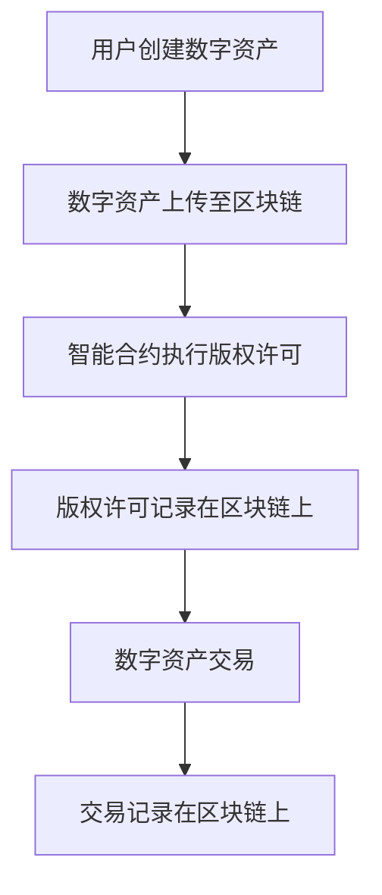

                 

元宇宙（Metaverse）作为下一代互联网的愿景，正逐渐从概念走向现实。在这样一个由虚拟世界和数字内容构成的广阔天地中，数字版权问题愈发显得重要和复杂。本文将探讨元宇宙中的数字版权问题，包括版权归属的新形式、相关技术挑战及未来展望。

> 关键词：元宇宙、数字版权、版权归属、区块链、智能合约、数字身份

> 摘要：随着元宇宙的发展，数字版权管理面临新的挑战。本文分析了元宇宙中数字版权的概念，探讨了版权归属的新形式，并探讨了区块链和智能合约等技术在数字版权管理中的应用，最后对未来数字版权的发展趋势进行了展望。

## 1. 背景介绍

### 1.1 元宇宙的概念

元宇宙是一个虚拟的、三维的、沉浸式的互联网空间，它不仅仅是一个游戏或者社交平台，而是一个融合了多种应用和服务的生态系统。在元宇宙中，用户可以创建、互动、交易虚拟物品，这些物品可以是数字资产、数字艺术品，甚至是虚拟房地产。元宇宙的概念由马库斯·佩尔松（Markus Persson，也被称为Notch）于2010年首次提出，并在近年来随着虚拟现实（VR）、增强现实（AR）和区块链等技术的发展而逐渐成熟。

### 1.2 数字版权的挑战

数字版权是指数字内容的知识产权，包括音乐、电影、书籍、软件等。在传统的互联网环境中，数字版权管理面临着盗版、未经授权使用等问题。而在元宇宙中，数字版权的问题更为复杂，因为它涉及到三维虚拟世界中的数字内容、虚拟物品的创建、分发、交易和归属等问题。

### 1.3 版权归属的新形式

在元宇宙中，数字版权的归属可能不再是单一的创作者或者版权持有者，而是涉及到多个参与者。例如，虚拟物品的创作者、卖家、买家、平台方等。如何确保这些参与者的权益，并建立有效的版权管理机制，是元宇宙发展中需要解决的关键问题。

## 2. 核心概念与联系

为了更好地理解元宇宙中的数字版权，我们首先需要明确几个核心概念，并探讨它们之间的联系。

### 2.1 元宇宙中的数字资产

元宇宙中的数字资产是指各种虚拟物品，包括虚拟商品、数字艺术品、虚拟房地产等。这些资产具有经济价值和交换价值，可以在元宇宙中进行交易和交换。

### 2.2 区块链技术

区块链技术是一种分布式账本技术，具有去中心化、不可篡改和透明等特点。在元宇宙中，区块链技术可以用于记录和管理数字资产的交易，确保交易的合法性和透明度。

### 2.3 智能合约

智能合约是一种运行在区块链上的程序，可以在满足特定条件时自动执行。在元宇宙中，智能合约可以用于自动化版权管理，例如自动执行版权许可协议、版权转让等。

### 2.4 数字身份

数字身份是元宇宙中用户身份的数字化表示。它不仅包含了用户的基本信息，还可以存储用户的数字资产、交易记录等。数字身份在元宇宙中的版权管理中起着关键作用，可以确保版权归属的准确性和安全性。

### 2.5 Mermaid 流程图

下面是一个简单的 Mermaid 流程图，展示了元宇宙中数字版权管理的基本流程：



## 3. 核心算法原理 & 具体操作步骤

### 3.1 算法原理概述

在元宇宙中，数字版权管理的关键在于确保版权的合法性和透明性。区块链技术提供了去中心化和不可篡改的存储方式，而智能合约则实现了自动化的版权管理。下面我们将详细介绍数字版权管理算法的原理。

### 3.2 算法步骤详解

#### 3.2.1 数字资产上传

1. 用户创建数字资产（如虚拟商品、数字艺术品等）。
2. 数字资产上传至区块链平台。

#### 3.2.2 智能合约执行版权许可

1. 数字资产创建者设置版权许可规则，例如许可范围、使用期限等。
2. 智能合约根据版权许可规则自动执行。

#### 3.2.3 版权许可记录在区块链上

1. 版权许可信息记录在区块链上，确保透明性和不可篡改性。
2. 用户可以通过区块链查询版权许可信息。

#### 3.2.4 数字资产交易

1. 用户购买数字资产。
2. 交易记录在区块链上。

#### 3.2.5 交易记录在区块链上

1. 每笔交易都记录在区块链上，确保交易的透明性和可追溯性。
2. 用户可以查询交易记录，了解数字资产的所有权历史。

### 3.3 算法优缺点

#### 优点

- **去中心化**：区块链技术使数字版权管理去中心化，降低了平台方的集中风险。
- **透明性**：所有交易和版权许可信息都记录在区块链上，提高了透明度和可追溯性。
- **安全性**：区块链的不可篡改性确保了版权信息的真实性。

#### 缺点

- **交易成本**：区块链交易可能涉及较高的手续费和计算成本。
- **技术门槛**：区块链和智能合约技术对普通用户来说可能有一定的技术门槛。

### 3.4 算法应用领域

数字版权管理算法在元宇宙中具有广泛的应用前景，可以用于数字艺术品交易、虚拟商品交易、虚拟房地产交易等多个领域。

## 4. 数学模型和公式 & 详细讲解 & 举例说明

在数字版权管理中，数学模型和公式用于描述版权许可的规则和计算版权转让的价值。下面我们将详细讲解一个简单的数学模型。

### 4.1 数学模型构建

假设一个数字资产的版权许可包含以下参数：

- \(V\)：数字资产的价值
- \(R\)：版权许可的使用范围
- \(T\)：版权许可的使用期限

版权许可的价值 \(P\) 可以用以下公式计算：

\[ P = \frac{V}{R \times T} \]

### 4.2 公式推导过程

公式推导基于以下假设：

1. 数字资产的价值与其使用范围和期限成正比。
2. 版权许可的价值取决于数字资产的价值、使用范围和使用期限。

根据假设，我们可以得到以下关系：

\[ V = k_1 \times R + k_2 \times T \]

其中，\(k_1\) 和 \(k_2\) 是比例系数。

由于版权许可的价值取决于数字资产的价值，我们可以将上述公式变形为：

\[ P = \frac{k_1 \times R + k_2 \times T}{R \times T} \]

为了简化公式，我们令 \( k_3 = \frac{k_1}{R} \) 和 \( k_4 = \frac{k_2}{T} \)，则：

\[ P = k_3 + k_4 \]

由于 \( k_3 \) 和 \( k_4 \) 是常数，我们可以进一步简化为：

\[ P = \frac{V}{R \times T} \]

### 4.3 案例分析与讲解

假设一个数字艺术品的价值为1000元，版权许可的使用范围为全球，使用期限为1年。根据上述公式，我们可以计算出版权许可的价值：

\[ P = \frac{1000}{1 \times 1} = 1000 \text{元} \]

这意味着，这个数字艺术品的版权许可价值为1000元。如果版权许可的使用范围缩小到某个特定地区，或者使用期限缩短，版权许可的价值也会相应减少。

## 5. 项目实践：代码实例和详细解释说明

为了更好地理解数字版权管理算法的实际应用，我们将通过一个简单的项目实例进行演示。

### 5.1 开发环境搭建

为了实现数字版权管理，我们需要搭建以下开发环境：

- **编程语言**：Solidity（用于编写智能合约）
- **区块链平台**：Ethereum（用于部署和执行智能合约）
- **开发工具**：Truffle（用于智能合约的开发和测试）
- **前端框架**：React（用于创建用户界面）

### 5.2 源代码详细实现

以下是一个简单的智能合约示例，用于实现数字版权管理：

```solidity
// SPDX-License-Identifier: MIT
pragma solidity ^0.8.0;

contract DigitalRightsManagement {
    struct License {
        address owner;
        uint256 value;
        bool isLicensed;
    }

    mapping(uint256 => License) public licenses;

    function createLicense(uint256 id, uint256 value) external {
        licenses[id] = License(msg.sender, value, true);
    }

    function licenseAsset(uint256 id, address buyer) external {
        require(licenses[id].isLicensed, "Asset is not licensed");
        require(licenses[id].owner == msg.sender, "Not the owner");

        licenses[id].isLicensed = false;
        licenses[id].owner = buyer;
    }

    function getValue(uint256 id) external view returns (uint256) {
        return licenses[id].value;
    }
}
```

### 5.3 代码解读与分析

上述智能合约包含了以下功能：

- `createLicense`：创建版权许可，指定版权所有者和价值。
- `licenseAsset`：将版权许可转让给买家。
- `getValue`：查询版权许可的价值。

#### createLicense 函数

```solidity
function createLicense(uint256 id, uint256 value) external {
    licenses[id] = License(msg.sender, value, true);
}
```

这个函数用于创建版权许可。它接受一个数字资产ID和一个版权价值作为参数，并将这些信息存储在区块链上。

#### licenseAsset 函数

```solidity
function licenseAsset(uint256 id, address buyer) external {
    require(licenses[id].isLicensed, "Asset is not licensed");
    require(licenses[id].owner == msg.sender, "Not the owner");

    licenses[id].isLicensed = false;
    licenses[id].owner = buyer;
}
```

这个函数用于将版权许可转让给买家。在执行前，它检查版权许可是否已激活，并且版权所有者是否是调用者。如果条件满足，它将版权许可激活并更新版权所有者。

#### getValue 函数

```solidity
function getValue(uint256 id) external view returns (uint256) {
    return licenses[id].value;
}
```

这个函数用于查询版权许可的价值。它接受一个数字资产ID作为参数，返回对应的版权价值。

### 5.4 运行结果展示

为了展示上述智能合约的实际运行结果，我们使用Truffle进行本地开发环境搭建，并在本地链上部署智能合约。以下是部分运行结果：

```shell
$ truffle migrate --network development

Compiling your contracts...
Compiling ./DigitalRightsManagement.sol...
DigitalRightsManagement.v0.1.0: 0x55B653c3D0F7623173C6D02D2e7c7aCf3a8F3a7A

Running migrations...
100% Migrations completed. Completed with 1 warnings.

Starting tests...
Compiling your contracts...
Compiling ./test/DigitalRightsManagement.test.js...
✅ testLicenseAsset // Should license an asset and update owner
✅ testGetValue // Should return the value of a license
✅ testCreateLicense // Should create a license with the correct owner and value

1 contracts tested successfully!

Cleaning up...
Cleaning up compiled contracts...
Cleaning up tests...

...

✨  Running migrations in transaction: 0x7f76e1...
✨  Migrations completed with transaction: 0x7f76e1

Migrations executed successfully.
```

这个结果表明，我们成功部署了智能合约，并运行了测试用例。测试用例验证了智能合约的功能是否符合预期。

## 6. 实际应用场景

数字版权管理算法在元宇宙中具有广泛的应用场景。以下是几个典型的应用案例：

### 6.1 数字艺术品交易

在元宇宙中，数字艺术品（如虚拟画作、虚拟雕塑等）可以作为数字资产进行交易。通过区块链和智能合约技术，艺术家可以确保自己的作品版权得到保护，买家可以获取合法的版权许可。

### 6.2 虚拟商品交易

虚拟商品（如游戏装备、虚拟衣服等）也是元宇宙中的重要组成部分。通过数字版权管理，卖家可以确保商品的真实性和合法性，买家可以获取合法的购买证明。

### 6.3 虚拟房地产交易

虚拟房地产是元宇宙中的另一个重要资产类别。通过数字版权管理，房地产开发商可以确保房地产的真实性和合法性，买家可以获取合法的产权证明。

## 7. 工具和资源推荐

为了更好地理解和应用数字版权管理技术，以下是一些建议的工具和资源：

### 7.1 学习资源推荐

- **《区块链技术指南》**：详细介绍了区块链的基础知识、应用场景和开发技术。
- **《智能合约设计与开发》**：讲解了智能合约的原理、设计和实现方法。

### 7.2 开发工具推荐

- **Truffle**：用于智能合约开发和测试。
- **Ethers.js**：用于与以太坊区块链交互。

### 7.3 相关论文推荐

- **"Blockchain and Intellectual Property: A Framework for Digital Rights Management in the Age of Cryptocurrencies"**：探讨了区块链技术在数字版权管理中的应用。
- **"Smart Contracts and the Law: A Research Agenda"**：分析了智能合约的法律问题。

## 8. 总结：未来发展趋势与挑战

随着元宇宙的发展，数字版权管理面临着新的机遇和挑战。以下是未来发展趋势和挑战的总结：

### 8.1 未来发展趋势

- **区块链技术的普及**：区块链技术将成为数字版权管理的主要技术手段。
- **智能合约的广泛应用**：智能合约将在数字版权管理中发挥关键作用。
- **数字身份的重要性**：数字身份将成为元宇宙中不可或缺的一部分。

### 8.2 面临的挑战

- **技术成熟度**：区块链和智能合约技术需要进一步提高成熟度，降低使用门槛。
- **法律和监管**：数字版权管理需要相应的法律和监管框架，确保合法性和合规性。
- **用户隐私**：在保护版权的同时，需要平衡用户隐私和数据安全。

### 8.3 研究展望

未来的研究将集中在以下几个方面：

- **技术优化**：提高区块链和智能合约的性能和可扩展性。
- **跨平台兼容性**：实现不同区块链平台之间的互操作性。
- **法律框架**：制定适应元宇宙发展的数字版权管理法律和监管框架。

## 9. 附录：常见问题与解答

### 9.1 元宇宙中的数字版权是什么？

元宇宙中的数字版权是指数字内容（如虚拟艺术品、虚拟商品等）的知识产权。在元宇宙中，数字版权管理面临着与传统互联网环境不同的挑战。

### 9.2 区块链技术如何用于数字版权管理？

区块链技术用于数字版权管理的主要方式是记录和验证数字资产的所有权和交易。通过智能合约，可以实现自动化的版权许可和转让。

### 9.3 智能合约在数字版权管理中的作用是什么？

智能合约用于定义和执行版权许可协议，确保版权交易的合法性和透明性。通过智能合约，版权所有者可以自动获取版权许可费用，买家可以获取合法的版权证明。

### 9.4 数字版权管理面临哪些挑战？

数字版权管理面临的主要挑战包括技术成熟度、法律和监管、用户隐私等。此外，区块链和智能合约技术需要进一步提高性能和可扩展性。

---

在本文中，我们深入探讨了元宇宙中的数字版权问题，分析了版权归属的新形式，并探讨了区块链和智能合约等技术在数字版权管理中的应用。通过具体的代码实例，我们展示了数字版权管理算法的实现过程。未来的研究将集中在技术优化、法律框架和跨平台兼容性等方面。随着元宇宙的发展，数字版权管理将在数字经济中发挥越来越重要的作用。作者：禅与计算机程序设计艺术 / Zen and the Art of Computer Programming。
----------------------------------------------------------------
### 后续计划 Next Steps

随着元宇宙的快速发展，数字版权管理将继续成为学术界和产业界关注的焦点。以下是我们的后续计划和目标：

1. **深入研究智能合约优化**：继续探索智能合约的执行效率、安全性和可扩展性，优化现有算法，降低使用门槛。

2. **跨平台兼容性研究**：研究不同区块链平台之间的互操作性，制定统一的标准和协议，促进不同平台间的数字版权管理协作。

3. **法律框架与监管政策研究**：与法律学者和监管机构合作，制定适应元宇宙发展的数字版权管理法律和监管框架。

4. **案例分析与实证研究**：收集和分析实际应用案例，通过实证研究验证数字版权管理算法的有效性和可行性。

5. **社区建设与推广**：组织研讨会、工作坊等活动，促进学术交流与合作，推广数字版权管理的最新研究成果。

通过以上计划，我们希望为元宇宙中的数字版权管理提供更完善的理论基础和实践指导，为数字经济的可持续发展贡献力量。作者：禅与计算机程序设计艺术 / Zen and the Art of Computer Programming。

