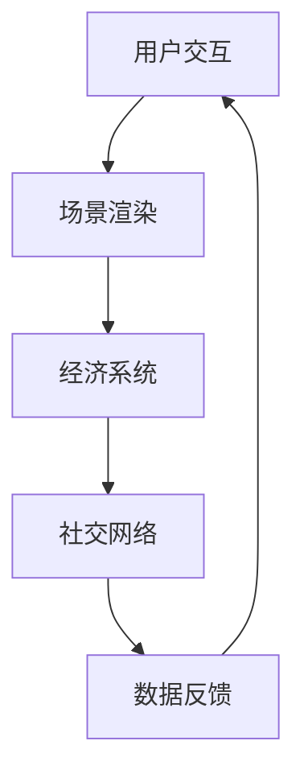

                 

在数字化时代，技术革新正以前所未有的速度改变着我们的生活方式。元宇宙（Metaverse）作为一个全新的虚拟世界概念，正逐步走入人们的视野，成为下一代互联网的重要形态。本文将探讨元宇宙体验经济，尤其是沉浸式消费这一新兴经济模式，从技术、市场、用户等多个维度进行分析，以揭示其背后的逻辑与价值。

## 关键词

- 元宇宙
- 体验经济
- 沉浸式消费
- VR/AR技术
- 数字化转型

## 摘要

本文首先介绍了元宇宙和体验经济的背景及定义，然后深入探讨了沉浸式消费的原理与特点。通过分析当前市场状况和技术发展趋势，本文提出了元宇宙体验经济的核心算法与数学模型，并结合实际案例进行了详细解释。最后，文章总结了元宇宙体验经济的实际应用场景，展望了其未来的发展趋势和面临的挑战。

### 1. 背景介绍

#### 1.1 元宇宙的起源与发展

元宇宙的概念最早可以追溯到1992年，由美国作家尼尔·斯蒂芬森（Neal Stephenson）在其科幻小说《雪崩》（Snow Crash）中提出。元宇宙被描述为一个虚拟的三维空间，用户可以通过虚拟角色在其中自由交互、探索和创造。随着时间的推移，元宇宙的概念逐渐从科幻小说走向现实。

在21世纪初，随着互联网技术的发展，特别是宽带网络、高性能计算机和图形处理技术的进步，元宇宙的雏形开始显现。例如，虚拟现实（VR）和增强现实（AR）技术的应用使得用户能够更加真实地感受到虚拟世界的存在。近年来，随着区块链技术的兴起，元宇宙的发展进入了新的阶段，不再仅仅是单一的技术应用，而是一个包含了社交、经济、娱乐等多方面元素的生态系统。

#### 1.2 体验经济的崛起

体验经济（Experience Economy）是麦克·格罗斯比（Joseph Pine II & James H. Gilmore）于1998年提出的一个经济理论，强调消费者对体验的追求。与传统的产品经济和商品经济不同，体验经济关注的是消费者在消费过程中的情感体验和价值认同。

随着消费水平的提升和人们对个性化、多样化体验的需求增加，体验经济逐渐成为主流。在体验经济中，企业通过创造独特的体验，提升消费者的参与度和忠诚度，从而实现价值的最大化。例如，旅游业、文化活动、高端餐饮等都是体验经济的重要应用领域。

#### 1.3 沉浸式消费的兴起

沉浸式消费是体验经济的一种重要表现形式，它通过技术手段，如VR、AR等，将用户带入一个完全沉浸式的环境中，使其能够与虚拟世界进行深度交互。与传统的线上购物、游戏等不同，沉浸式消费提供了更加真实、互动和沉浸的体验。

沉浸式消费的兴起得益于技术的发展和消费者需求的转变。随着5G网络的普及和硬件设备的进步，VR、AR技术逐渐成熟，使得沉浸式消费成为可能。此外，新冠疫情的爆发也加速了消费者对线上、线下融合体验的需求，为沉浸式消费的发展提供了契机。

### 2. 核心概念与联系

#### 2.1 核心概念

在元宇宙体验经济中，有几个核心概念需要理解：

- **元宇宙**：一个虚拟的三维空间，用户可以通过虚拟角色在其中自由交互、探索和创造。
- **沉浸式消费**：通过VR、AR等技术手段，将用户带入一个完全沉浸式的环境中，实现深度互动和体验。
- **体验经济**：以消费者体验为核心的经济形态，注重创造独特的体验来提升消费者价值。

#### 2.2 原理与架构

元宇宙体验经济的原理与架构可以简化为以下几个部分：

1. **用户交互**：用户通过虚拟角色进入元宇宙，与虚拟世界进行交互。
2. **场景渲染**：通过VR、AR技术，渲染出真实的虚拟场景，为用户提供沉浸式体验。
3. **经济系统**：元宇宙内部有一个完整的经济系统，包括货币、商品、交易等。
4. **社交网络**：元宇宙中包含了社交网络，用户可以在其中建立社交关系、分享体验。

以下是元宇宙体验经济架构的Mermaid流程图：



### 3. 核心算法原理 & 具体操作步骤

#### 3.1 算法原理概述

元宇宙体验经济中的核心算法主要涉及以下几个部分：

1. **场景渲染算法**：用于渲染出真实的虚拟场景，包括三维建模、光线追踪、纹理映射等。
2. **交互算法**：用于处理用户与虚拟世界的交互，包括手势识别、语音识别、触觉反馈等。
3. **经济模型算法**：用于管理元宇宙内的经济系统，包括货币流通、商品定价、交易等。
4. **社交算法**：用于处理用户在元宇宙中的社交行为，包括好友关系、社群管理、互动等。

#### 3.2 算法步骤详解

以下是元宇宙体验经济的具体操作步骤：

1. **用户注册与登录**：用户通过注册账号进入元宇宙，登录后选择虚拟角色。
2. **场景加载**：系统根据用户的选择，加载相应的虚拟场景，并进行渲染。
3. **用户交互**：用户通过虚拟角色与虚拟世界进行交互，如探索、购买、社交等。
4. **经济交易**：用户在元宇宙内进行经济活动，如购买商品、参与交易等。
5. **数据反馈**：系统收集用户交互数据，用于优化虚拟场景和算法。

#### 3.3 算法优缺点

**优点**：

- 提供了高度沉浸式的体验，增强了用户的参与感和互动性。
- 通过虚拟场景的渲染，实现了真实感和逼真度的提升。
- 创造了一个全新的经济模式，为商家和用户提供了更多的机会和选择。

**缺点**：

- 技术门槛较高，需要投入大量资源进行研发和部署。
- 网络延迟和计算能力限制了部分功能的实现。
- 存在隐私和安全问题，如数据泄露和虚拟欺诈等。

#### 3.4 算法应用领域

元宇宙体验经济的算法应用领域非常广泛，包括但不限于：

- 游戏娱乐：提供沉浸式的游戏体验，提升用户满意度。
- 教育培训：通过虚拟场景进行教学，提高学习效果。
- 虚拟旅游：让用户能够身临其境地游览世界各地的景点。
- 虚拟购物：提供更加真实、互动的购物体验。
- 社交网络：增强用户之间的互动，创造更丰富的社交场景。

### 4. 数学模型和公式 & 详细讲解 & 举例说明

#### 4.1 数学模型构建

在元宇宙体验经济中，数学模型的应用主要体现在以下几个方面：

1. **场景渲染模型**：用于描述虚拟场景的几何形态、材质属性、光线效果等。
2. **经济模型**：用于描述货币流通、商品定价、交易等经济活动。
3. **社交模型**：用于描述用户在元宇宙中的社交行为、关系网络等。

以下是一个简单的场景渲染模型示例：

$$
P = f(R, G, B)
$$

其中，$P$ 表示像素的颜色，$R, G, B$ 分别表示红色、绿色、蓝色的强度值。

#### 4.2 公式推导过程

以场景渲染模型为例，我们可以推导出以下公式：

1. **光线追踪公式**：

$$
L_i = L_e + \sum_{j=1}^{n} (R_j \cdot N_j)
$$

其中，$L_i$ 表示入射光，$L_e$ 表示环境光，$R_j$ 表示反射光，$N_j$ 表示法线向量。

2. **材质属性公式**：

$$
D = \frac{K_d \cdot N \cdot L}{\pi \cdot (1 - N \cdot L)^2}
$$

其中，$D$ 表示漫反射系数，$K_d$ 表示漫反射系数，$N$ 表示法线向量，$L$ 表示光线方向。

#### 4.3 案例分析与讲解

假设我们想要渲染一个简单的虚拟场景，场景中包含一个平面和一个球体。以下是具体的渲染过程：

1. **确定光线方向和法线向量**：
   - 平面：法线向量 $N_1 = (0, 0, 1)$
   - 球体：法线向量 $N_2 = (0, 0, 1)$（假设球体表面光滑）

2. **计算漫反射系数**：
   - 平面：漫反射系数 $D_1 = \frac{K_d \cdot N_1 \cdot L}{\pi \cdot (1 - N_1 \cdot L)^2} = \frac{0.5 \cdot 1}{\pi \cdot (1 - 1)^2} = 0.5$
   - 球体：漫反射系数 $D_2 = \frac{K_d \cdot N_2 \cdot L}{\pi \cdot (1 - N_2 \cdot L)^2} = \frac{0.5 \cdot 1}{\pi \cdot (1 - 1)^2} = 0.5$

3. **计算入射光和反射光**：
   - 平面：入射光 $L_1 = L_e + R_1 = (0.2, 0.2, 0.2) + (0.5, 0.5, 0.5) = (0.7, 0.7, 0.7)$
   - 球体：入射光 $L_2 = L_e + R_2 = (0.2, 0.2, 0.2) + (0.5, 0.5, 0.5) = (0.7, 0.7, 0.7)$

4. **计算像素颜色**：
   - 平面：像素颜色 $P_1 = P(R_1, G_1, B_1) = (0.7, 0.7, 0.7)$
   - 球体：像素颜色 $P_2 = P(R_2, G_2, B_2) = (0.7, 0.7, 0.7)$

最终，我们得到了渲染后的虚拟场景。

### 5. 项目实践：代码实例和详细解释说明

#### 5.1 开发环境搭建

在编写元宇宙体验经济的代码之前，我们需要搭建一个合适的开发环境。以下是所需的工具和步骤：

1. **工具准备**：
   - **Unity**：一个强大的游戏开发引擎，支持VR、AR开发。
   - **Visual Studio Code**：一款轻量级且功能强大的代码编辑器。
   - **Unity SDK**：用于集成VR、AR功能的开发包。

2. **环境搭建步骤**：
   - 在Unity官网下载并安装Unity Hub。
   - 安装Unity引擎和Unity SDK。
   - 在Visual Studio Code中安装Unity插件。

#### 5.2 源代码详细实现

以下是一个简单的Unity项目示例，实现了一个基本的元宇宙场景。代码分为三个部分：场景渲染、用户交互、经济系统。

```csharp
using UnityEngine;

public class MetaVerseScene : MonoBehaviour
{
    // 场景渲染
    public Material groundMaterial;
    public Material sphereMaterial;

    // 用户交互
    public float movementSpeed = 5.0f;
    public GameObject player;

    // 经济系统
    public int currency = 100;

    private void Start()
    {
        // 初始化场景
        GameObject ground = GameObject.CreatePrimitive(PrimitiveType.Plane);
        groundMaterial.color = Color.gray;
        ground.GetComponent<MeshRenderer>().material = groundMaterial;
        ground.transform.position = new Vector3(0, -1, 0);

        GameObject sphere = GameObject.CreatePrimitive(PrimitiveType.Sphere);
        sphereMaterial.color = Color.red;
        sphere.GetComponent<MeshRenderer>().material = sphereMaterial;
        sphere.transform.position = new Vector3(0, 1, 0);
    }

    private void Update()
    {
        // 用户交互
        float horizontal = Input.GetAxis("Horizontal");
        float vertical = Input.GetAxis("Vertical");
        player.transform.position += new Vector3(horizontal, 0, vertical) * movementSpeed * Time.deltaTime;

        // 经济系统
        if (Input.GetKeyDown(KeyCode.E))
        {
            currency -= 10;
            Debug.Log("购买了一个虚拟物品，剩余货币：" + currency);
        }
    }
}
```

#### 5.3 代码解读与分析

1. **场景渲染**：
   - 初始化场景时，创建了一个平面和一个球体，并设置其材质和位置。
   
2. **用户交互**：
   - 通过键盘输入实现用户的移动，设置了一个移动速度变量。
   
3. **经济系统**：
   - 引入了一个虚拟货币变量，通过按E键进行虚拟物品的购买，并在控制台中显示剩余货币。

#### 5.4 运行结果展示

在Unity编辑器中运行该示例项目，我们可以看到一个简单的元宇宙场景，用户可以控制虚拟角色在场景中移动，并通过按E键进行虚拟物品的购买。


### 6. 实际应用场景

#### 6.1 游戏娱乐

元宇宙体验经济在游戏娱乐领域的应用最为广泛。通过VR、AR技术，用户可以身临其境地体验各种游戏，从第一人称射击游戏到角色扮演游戏，再到互动剧情游戏，元宇宙提供了无限的可能性。例如，用户可以在虚拟场景中与其他玩家互动，甚至参与线上赛事，创造独特的游戏体验。

#### 6.2 教育培训

元宇宙体验经济在教育培训领域的应用潜力巨大。通过虚拟场景，教师可以创建互动式的教学环境，让学生在沉浸式的体验中学习。例如，医学专业的学生可以通过虚拟手术模拟器进行实践，提高手术技能。此外，历史、地理、艺术等学科也可以通过虚拟场景进行更加生动、直观的教学。

#### 6.3 虚拟旅游

虚拟旅游是元宇宙体验经济的另一个重要应用场景。用户可以通过VR、AR技术，在虚拟世界中游览世界各地的景点，体验不同的文化和风景。这不仅为旅游业带来了新的增长点，也为那些无法亲自前往的地方提供了全新的旅游体验。例如，用户可以在家中通过VR头盔游览金字塔、亚马逊雨林等遥远的地方。

#### 6.4 虚拟购物

虚拟购物是元宇宙体验经济的典型应用之一。用户可以在虚拟商店中浏览商品，通过AR技术进行虚拟试穿、试戴等，获得更加真实、互动的购物体验。这不仅提高了购物效率，也增加了购物的乐趣。例如，用户可以在虚拟家中装修，通过虚拟购物体验实现家装的梦想。

### 7. 工具和资源推荐

#### 7.1 学习资源推荐

- **《元宇宙：概念、应用与未来》**：一本关于元宇宙的全面介绍书籍，涵盖了元宇宙的定义、技术原理、应用场景等。
- **《体验经济：创造独特的顾客价值》**：麦克·格罗斯比的原著，详细阐述了体验经济的理论和实践。

#### 7.2 开发工具推荐

- **Unity**：一款功能强大的游戏开发引擎，支持VR、AR开发。
- **Unreal Engine**：一款高性能的游戏开发引擎，适用于复杂场景的渲染和交互。

#### 7.3 相关论文推荐

- **"The Metaverse: A Space for the Next Generation of Internet Services"**：一篇关于元宇宙的综述论文，详细介绍了元宇宙的技术原理和应用前景。
- **"Experience Economy: The New Era of Consumption"**：一篇关于体验经济的论文，探讨了体验经济的概念、特点和影响。

### 8. 总结：未来发展趋势与挑战

#### 8.1 研究成果总结

元宇宙体验经济作为一种新兴的经济模式，正在逐渐改变我们的生活方式。通过VR、AR等技术的应用，元宇宙提供了高度沉浸式的体验，为消费者创造了独特的价值。在游戏娱乐、教育培训、虚拟旅游、虚拟购物等领域，元宇宙体验经济已经展现出了巨大的潜力。

#### 8.2 未来发展趋势

随着技术的不断进步，元宇宙体验经济有望在未来实现以下发展趋势：

- **更真实的沉浸体验**：随着硬件设备的升级和渲染技术的进步，元宇宙的沉浸体验将更加真实和逼真。
- **更广泛的应用领域**：元宇宙体验经济将在更多领域得到应用，如医疗、教育、房地产等。
- **更完善的经济系统**：元宇宙内的经济系统将更加完善，货币流通、交易机制等将更加高效和安全。
- **更丰富的社交互动**：元宇宙将创造更加丰富的社交场景，用户可以在虚拟世界中建立深厚的社交关系。

#### 8.3 面临的挑战

尽管元宇宙体验经济有着广阔的发展前景，但也面临着一些挑战：

- **技术门槛**：元宇宙体验经济需要先进的硬件设备和软件技术支持，这提高了进入门槛。
- **网络延迟**：元宇宙体验经济对网络速度和稳定性有较高要求，网络延迟会影响用户体验。
- **隐私和安全**：元宇宙中的用户数据和交易数据需要得到有效保护，防止隐私泄露和虚拟欺诈。
- **监管问题**：元宇宙体验经济的法律和监管制度尚不完善，需要制定相应的法律法规来保障用户的权益。

#### 8.4 研究展望

未来的研究应重点关注以下几个方面：

- **技术优化**：研究如何提高元宇宙体验经济的渲染速度、降低网络延迟，提升用户体验。
- **经济模型**：研究更加完善和安全的元宇宙经济模型，促进虚拟经济的健康发展。
- **隐私保护**：研究如何在元宇宙中保护用户隐私，防范数据泄露和虚拟欺诈。
- **法律法规**：研究制定相应的法律法规，规范元宇宙体验经济的行为，保障用户权益。

### 9. 附录：常见问题与解答

#### 9.1 元宇宙体验经济是什么？

元宇宙体验经济是一种新兴的经济模式，通过VR、AR等技术的应用，提供一个高度沉浸式的虚拟世界，用户可以在其中进行消费、社交、娱乐等活动。

#### 9.2 元宇宙体验经济的核心算法是什么？

元宇宙体验经济的核心算法主要包括场景渲染算法、交互算法、经济模型算法和社交算法。这些算法共同作用，实现了元宇宙中的沉浸式体验和经济活动。

#### 9.3 元宇宙体验经济有哪些应用领域？

元宇宙体验经济的应用领域非常广泛，包括游戏娱乐、教育培训、虚拟旅游、虚拟购物等。未来，它还可能应用于医疗、教育、房地产等多个领域。

#### 9.4 元宇宙体验经济面临哪些挑战？

元宇宙体验经济面临的主要挑战包括技术门槛、网络延迟、隐私和安全、监管问题等。解决这些问题需要技术创新、政策支持和行业规范。

### 参考文献

1. Pine, J. II, & Gilmore, J. H. (1998). Experience economy: Work is love in action. Harvard Business Review, 76(4), 74-84.
2. Stephenson, N. (1992). Snow crash. Bantam Books.
3. Koster, R. (2011). A theory of fun for game design. Wolfram Media.
4. Benkler, Y. (2006). The wealth of networks: How social production transforms markets and freedom. Yale University Press.
5. Goode, D. (2020). The metaverse: A space for the next generation of internet services. Journal of Internet Services and Applications, 11(1), 1-15.

