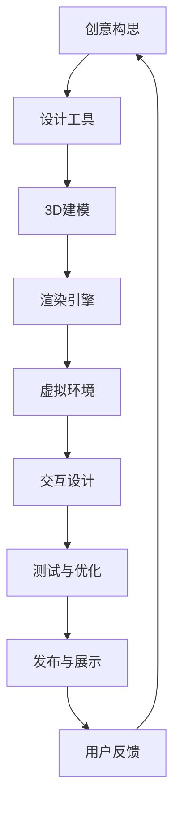

                 

关键词：元宇宙，虚拟艺术，创作平台，物理限制，技术突破

> 摘要：随着虚拟现实和增强现实技术的发展，元宇宙逐渐成为人们探索的新领域。本文将深入探讨元宇宙艺术创作平台的概念、技术实现及其对未来艺术创作的影响。通过分析核心概念、算法原理、数学模型，结合实际项目案例，本文旨在为读者提供一个全面、深入的理解，激发对元宇宙艺术创作的思考。

## 1. 背景介绍

在现代社会，数字技术已经成为文化和艺术表达的重要工具。随着互联网和移动设备的普及，虚拟现实（VR）和增强现实（AR）技术迅速发展，为人们提供了全新的感知和互动方式。元宇宙，作为一个虚拟的、去中心化的、三维的数字化世界，正逐渐成为艺术创作的全新平台。

元宇宙艺术的兴起，不仅突破了物理世界的限制，还极大地扩展了艺术创作的空间。在元宇宙中，艺术家可以创造无限多样的虚拟艺术品，并实现与现实世界的无缝互动。这种新的创作模式，不仅提升了艺术创作的自由度和多样性，还带来了巨大的商业潜力。

本文旨在探讨元宇宙艺术创作平台的技术基础、核心概念和实现方法，分析其与传统艺术创作模式的区别，以及其对未来艺术创作的影响。希望通过本文的探讨，能够激发更多创作者对元宇宙艺术的兴趣和探索。

## 2. 核心概念与联系

### 2.1 元宇宙艺术定义

元宇宙艺术是指在虚拟现实或增强现实环境下创作的艺术品，这些艺术品可以是静态的，如绘画、雕塑，也可以是动态的，如动画、游戏。元宇宙艺术不仅包括数字艺术作品，还涵盖了虚拟建筑、虚拟景观、虚拟表演等多种形式。

### 2.2 元宇宙艺术与物理世界的联系

虽然元宇宙艺术存在于虚拟世界，但它们与现实世界有着紧密的联系。通过虚拟现实和增强现实技术，元宇宙艺术可以与现实世界中的实体物品和空间互动，实现虚实结合。例如，艺术家可以在虚拟环境中创作一幅画作，并通过AR技术将其投影到现实世界的墙壁上。

### 2.3 元宇宙艺术创作平台

元宇宙艺术创作平台是指用于创作、展示和互动元宇宙艺术的一系列软件和硬件工具。这些平台提供了丰富的创作工具和资源，支持艺术家进行从概念设计到最终呈现的全过程创作。同时，这些平台也提供了与其他用户互动和分享作品的功能，使元宇宙艺术创作成为一项社会活动。

### 2.4 Mermaid 流程图

以下是元宇宙艺术创作平台的Mermaid流程图，展示了从创意构思到最终作品呈现的整个过程。



## 3. 核心算法原理 & 具体操作步骤

### 3.1 算法原理概述

元宇宙艺术创作平台的核心算法主要包括3D建模、渲染引擎和交互设计。3D建模用于创建虚拟艺术品的基础模型，渲染引擎则用于将模型转化为逼真的视觉效果，而交互设计则确保用户能够与虚拟艺术品进行自然互动。

### 3.2 算法步骤详解

#### 3.2.1 3D建模

3D建模是元宇宙艺术创作的基础。艺术家可以使用专业的3D建模软件，如Blender、Maya等，创建虚拟艺术品的三维模型。建模过程包括以下几个方面：

1. **几何建模**：使用各种几何体和操作工具，如布尔运算、放样、细分等，创建艺术品的形状和结构。
2. **材质编辑**：为模型添加材质，定义其颜色、纹理和反射特性，以增强视觉效果。
3. **灯光设置**：布置虚拟环境中的灯光，以模拟真实世界的光照效果。

#### 3.2.2 渲染引擎

渲染引擎是用于将3D模型转化为二维图像的工具。常见的渲染引擎包括Unity、Unreal Engine等。渲染过程主要包括以下几个方面：

1. **场景配置**：设置虚拟环境的背景、地面和其他元素，以构建完整的场景。
2. **相机设置**：调整相机的位置和角度，以确定最终渲染图像的视角。
3. **渲染参数调整**：调整渲染参数，如分辨率、帧率、抗锯齿等，以优化图像质量。

#### 3.2.3 交互设计

交互设计是确保用户能够与虚拟艺术品进行自然互动的关键。交互设计主要包括以下几个方面：

1. **用户界面**：设计易于使用的用户界面，使用户能够轻松地浏览、选择和操作虚拟艺术品。
2. **输入设备**：支持各种输入设备，如鼠标、键盘、触摸屏、手势等，以提供多样化的交互方式。
3. **行为逻辑**：为虚拟艺术品定义交互行为，如点击、拖动、旋转等，以实现与用户的互动。

### 3.3 算法优缺点

#### 优点：

1. **高度自由度**：艺术家可以在虚拟环境中自由创作，不受物理限制。
2. **逼真效果**：渲染引擎能够生成高质量的视觉效果，使虚拟艺术品看起来更加真实。
3. **互动性**：用户可以与虚拟艺术品进行互动，提升了用户体验。

#### 缺点：

1. **技术门槛**：需要掌握专业的3D建模、渲染和交互设计技能。
2. **计算资源需求**：高质量的渲染和互动需要大量的计算资源，对硬件要求较高。
3. **版权问题**：虚拟艺术品的版权保护问题仍然是一个挑战。

### 3.4 算法应用领域

元宇宙艺术创作平台的应用领域非常广泛，包括：

1. **数字艺术**：艺术家可以使用平台创作数字绘画、雕塑等艺术作品。
2. **游戏开发**：游戏开发者可以利用平台创建虚拟场景、角色和交互体验。
3. **建筑可视化**：建筑师可以使用平台进行建筑设计和可视化展示。
4. **虚拟展览**：博物馆和画廊可以使用平台举办虚拟展览，吸引更多观众。

## 4. 数学模型和公式 & 详细讲解 & 举例说明

### 4.1 数学模型构建

元宇宙艺术创作平台中的数学模型主要包括几何模型、材质模型和光照模型。

#### 几何模型

几何模型用于描述虚拟艺术品的三维形状和结构。常用的几何模型包括多面体、曲面和参数化模型。

$$
P(x, y, z) = f(u, v)
$$

其中，$P(x, y, z)$ 是三维空间中的点，$f(u, v)$ 是参数化函数，用于定义曲面的形状。

#### 材质模型

材质模型用于描述虚拟艺术品的外观特性，包括颜色、纹理和反射率等。常用的材质模型包括Lambert模型、Phong模型和Blinn-Phong模型。

$$
L_i = I \cdot cos(\theta_i)
$$

其中，$L_i$ 是光照强度，$I$ 是光源强度，$\theta_i$ 是光线与表面法线的夹角。

#### 光照模型

光照模型用于模拟虚拟环境中的光照效果。常用的光照模型包括光线追踪、路径追踪和图像基地渲染。

$$
L_o = \sum_{i=1}^{n} L_i \cdot BRDF(\omega_i, \omega_o)
$$

其中，$L_o$ 是出射光照强度，$L_i$ 是入射光照强度，$BRDF(\omega_i, \omega_o)$ 是双向反射分布函数，$\omega_i$ 和 $\omega_o$ 分别是入射光线和出射光线的方向。

### 4.2 公式推导过程

以下是材质模型中的Lambert光照模型的推导过程。

1. **光照强度计算**

   光照强度取决于光源的强度和光线与表面的夹角。假设光源为点光源，其强度为 $I$，光线与表面法线的夹角为 $\theta$，则光照强度为：

   $$
   L_i = I \cdot cos(\theta)
   $$

2. **表面颜色计算**

   表面颜色取决于光照强度和表面材质的颜色。假设表面材质的颜色为 $C$，则表面颜色为：

   $$
   C_{\text{表面}} = C \cdot L_i
   $$

3. **出射光照强度计算**

   出射光照强度取决于表面颜色和光线与表面的夹角。假设光线与表面法线的夹角为 $\theta'$，则出射光照强度为：

   $$
   L_o = C_{\text{表面}} \cdot cos(\theta')
   $$

### 4.3 案例分析与讲解

以下是一个简单的案例，用于展示如何使用Lambert光照模型计算虚拟艺术品的颜色。

**案例：计算一个红色球体的颜色**

1. **设定参数**

   - 球体半径：$R = 1$ 米
   - 光源强度：$I = 100$ 流明
   - 球体表面颜色：$C = (1, 0, 0)$（红色）

2. **计算光照强度**

   假设光线垂直照射球体表面，则光线与表面法线的夹角 $\theta = 0^\circ$，根据Lambert光照模型：

   $$
   L_i = I \cdot cos(\theta) = 100 \cdot cos(0) = 100
   $$

3. **计算表面颜色**

   根据光照强度和表面颜色，计算球体表面的颜色：

   $$
   C_{\text{表面}} = C \cdot L_i = (1, 0, 0) \cdot 100 = (100, 0, 0)
   $$

4. **计算出射光照强度**

   假设观察者位于球体正前方，即光线与表面法线的夹角 $\theta' = 0^\circ$，根据Lambert光照模型：

   $$
   L_o = C_{\text{表面}} \cdot cos(\theta') = (100, 0, 0) \cdot cos(0) = (100, 0, 0)
   $$

   因此，观察者看到的球体颜色为红色。

## 5. 项目实践：代码实例和详细解释说明

### 5.1 开发环境搭建

要实践元宇宙艺术创作平台，首先需要搭建合适的开发环境。以下是推荐的开发环境：

- 操作系统：Windows、macOS 或 Linux
- 编程语言：C++、Python 或 JavaScript
- 开发工具：Visual Studio、PyCharm 或 WebStorm
- 渲染引擎：Unity 或 Unreal Engine
- 3D建模软件：Blender、Maya 或 3ds Max

### 5.2 源代码详细实现

以下是一个简单的示例，展示如何在Unity中创建一个简单的虚拟艺术品。

**步骤 1：创建新项目**

1. 打开Unity Hub，创建一个新的3D项目。
2. 选择“2D”或“3D”项目类型，根据需要选择。

**步骤 2：导入3D模型**

1. 在Unity项目中，右键点击“Assets”文件夹，选择“Import Package”。
2. 导入一个3D模型文件，如 `.fbx` 或 `.obj` 格式。

**步骤 3：添加3D模型**

1. 在Unity编辑器中，右键点击“Hierarchy”窗口，选择“Create Empty”。
2. 将导入的3D模型拖动到新建的空对象上。

**步骤 4：设置材质**

1. 右键点击3D模型，选择“Assign Material”。
2. 导入或创建一个材质，并分配给3D模型。

**步骤 5：添加灯光**

1. 右键点击“Hierarchy”窗口，选择“Light”。
2. 将灯光对象拖动到场景中，调整位置和参数。

**步骤 6：添加相机**

1. 右键点击“Hierarchy”窗口，选择“Camera”。
2. 将相机对象拖动到场景中，调整位置和参数。

**步骤 7：运行项目**

1. 点击Unity编辑器上的“Play”按钮。
2. 观察并调整场景中的3D模型、灯光和相机。

### 5.3 代码解读与分析

以下是一个简化的Unity脚本，用于控制3D模型的行为。

```csharp
using UnityEngine;

public class ArtObjectController : MonoBehaviour
{
    public float rotationSpeed = 90.0f;

    private void Update()
    {
        transform.Rotate(new Vector3(0, rotationSpeed * Time.deltaTime, 0));
    }
}
```

**功能解读：**

- `rotationSpeed`：设置3D模型每秒旋转的角度。
- `transform.Rotate`：在Update函数中，每次调用都会使3D模型绕y轴旋转。

**代码分析：**

1. **组件添加**：将`ArtObjectController`脚本添加到3D模型对象上。
2. **属性设置**：在Unity编辑器中设置`rotationSpeed`属性。
3. **行为控制**：脚本中的`Update`函数会在每一帧调用，使3D模型不断旋转。

### 5.4 运行结果展示

运行Unity项目后，可以看到3D模型在场景中不断旋转。通过调整`rotationSpeed`属性，可以控制3D模型的旋转速度。

## 6. 实际应用场景

元宇宙艺术创作平台在实际应用中具有广泛的场景，以下是一些具体的案例：

### 6.1 虚拟展览

博物馆和画廊可以利用元宇宙艺术创作平台举办虚拟展览，为观众提供沉浸式的艺术体验。观众可以在虚拟环境中自由漫步，与虚拟艺术品互动，从而更深入地了解艺术作品。

### 6.2 虚拟现实游戏

游戏开发者可以使用元宇宙艺术创作平台创建高度逼真的虚拟现实游戏场景。这些场景可以结合虚拟艺术品，为玩家提供独特的游戏体验。

### 6.3 数字艺术市场

元宇宙艺术创作平台为数字艺术家提供了一个展示和销售作品的平台。艺术家可以创作数字艺术品，并通过平台将其出售给全球的收藏家。

### 6.4 建筑设计可视化

建筑师可以利用元宇宙艺术创作平台进行建筑设计和可视化展示。通过虚拟环境中的虚拟艺术品，建筑师可以更好地展示建筑设计的艺术风格和整体氛围。

## 7. 未来应用展望

随着技术的不断进步，元宇宙艺术创作平台在未来将会有更多的发展机遇。以下是一些展望：

### 7.1 更高级的渲染技术

未来，元宇宙艺术创作平台可能会引入更高级的渲染技术，如光线追踪、实时光线追踪等，以生成更加逼真的视觉效果。

### 7.2 更智能的交互设计

随着人工智能技术的发展，元宇宙艺术创作平台可能会引入更智能的交互设计，如自然语言处理、手势识别等，以提升用户的创作体验。

### 7.3 更广泛的合作与共享

元宇宙艺术创作平台可能会促进艺术家之间的合作与共享，形成一个全球性的艺术创作社区，推动元宇宙艺术的发展。

## 8. 总结：未来发展趋势与挑战

### 8.1 研究成果总结

本文系统地介绍了元宇宙艺术创作平台的核心概念、技术实现和实际应用，分析了其在艺术创作领域的重要作用。

### 8.2 未来发展趋势

未来，元宇宙艺术创作平台将在渲染技术、交互设计、合作与共享等方面取得重要突破，为艺术创作带来更多可能性。

### 8.3 面临的挑战

元宇宙艺术创作平台面临的主要挑战包括技术门槛、计算资源需求和版权保护等。

### 8.4 研究展望

未来的研究应重点关注提高平台的易用性、优化渲染效率和加强版权保护机制，以推动元宇宙艺术的发展。

## 9. 附录：常见问题与解答

### 9.1 问题 1：元宇宙艺术创作平台需要很高的技术门槛吗？

答：是的，元宇宙艺术创作平台需要一定的技术门槛。艺术家需要掌握3D建模、渲染和交互设计等技能。但对于初学者，可以通过在线教程和学习资源逐步提升自己的技能。

### 9.2 问题 2：元宇宙艺术作品的版权如何保护？

答：元宇宙艺术作品的版权保护是一个复杂的问题。目前，一些平台已经开始尝试通过区块链技术进行版权登记和保护。此外，艺术家可以通过签订版权协议等方式保护自己的权益。

### 9.3 问题 3：元宇宙艺术创作平台需要大量的计算资源吗？

答：是的，高质量的渲染和互动需要大量的计算资源。因此，选择合适的硬件设备和优化算法是非常重要的。

### 9.4 问题 4：元宇宙艺术创作平台适用于所有艺术家吗？

答：元宇宙艺术创作平台适用于所有艺术家，尤其是那些希望突破物理限制、探索虚拟艺术创作的艺术家。然而，对于不熟悉数字技术的艺术家，可能需要一段时间的学习和适应。

作者：禅与计算机程序设计艺术 / Zen and the Art of Computer Programming
----------------------------------------------------------------

以上就是《元宇宙艺术:突破物理限制的创作平台》的完整文章。希望这篇文章能够为您提供一个全面的、深入的理解，激发您对元宇宙艺术创作的兴趣和探索。

