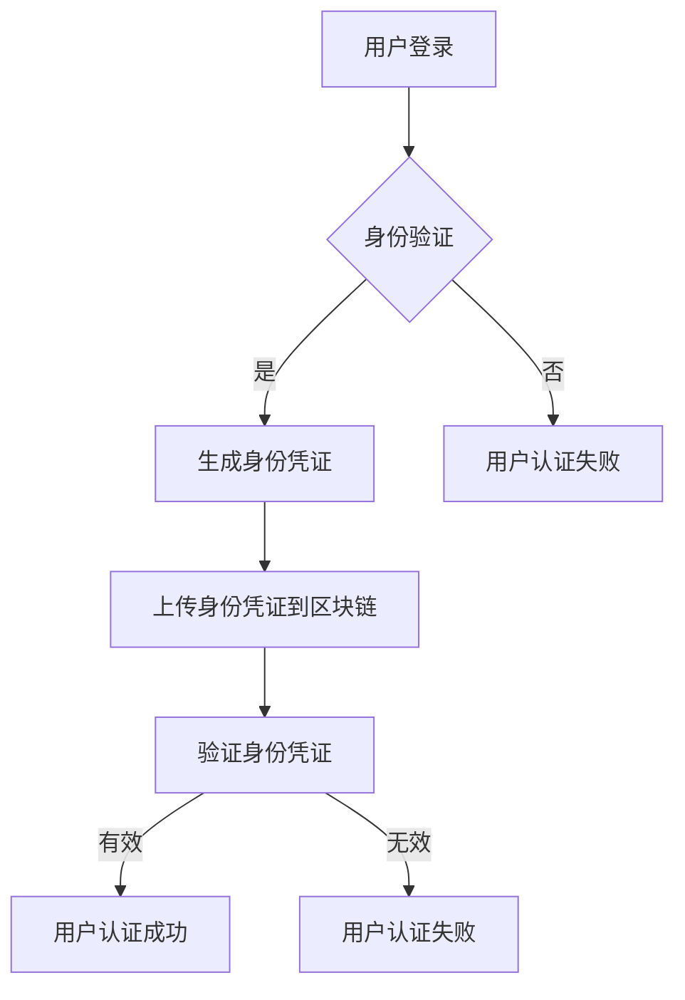

                 

关键词：元宇宙、身份认证、区块链、分布式账本、加密技术、安全隐私、身份管理

> 摘要：本文探讨了区块链技术在元宇宙身份认证中的应用。通过对区块链技术原理的深入分析，本文提出了一个基于区块链的元宇宙身份认证方案，并详细阐述了其工作原理、核心算法、数学模型及实际应用案例。文章还探讨了未来区块链在身份认证领域的发展趋势与挑战。

## 1. 背景介绍

随着虚拟现实（VR）、增强现实（AR）和游戏技术的快速发展，元宇宙（Metaverse）逐渐成为人们关注的热点。元宇宙是一个由虚拟世界和现实世界无缝连接的空间，用户可以在其中创建自己的数字身份，进行社交、娱乐、教育、工作等活动。然而，随着元宇宙的扩展，身份认证问题也日益突出。传统的身份认证方式在元宇宙中面临诸多挑战，如用户隐私保护、跨平台认证一致性、防伪造等。

区块链技术作为一种分布式数据库技术，具有去中心化、不可篡改、透明性等特点，为解决元宇宙中的身份认证问题提供了一种新的思路。本文旨在探讨区块链技术在元宇宙身份认证中的应用，提出一个基于区块链的身份认证方案，并通过实际案例进行分析。

## 2. 核心概念与联系

### 2.1 区块链技术原理

区块链是一种分布式账本技术，其核心思想是将数据分散存储在多个节点上，并通过密码学算法确保数据的安全性和不可篡改性。区块链技术主要包含以下组成部分：

- **区块（Block）**：区块是区块链的基本单位，包含一定数量的交易记录。
- **链（Chain）**：多个区块按照一定规则连接形成区块链。
- **节点（Node）**：参与区块链网络的计算机，负责存储、验证和传播区块链数据。
- **挖矿（Mining）**：节点通过解决数学难题来验证交易并生成新的区块，获得奖励。

### 2.2 身份认证

身份认证是指验证用户身份的过程。在元宇宙中，身份认证用于确保用户身份的真实性、唯一性和不可篡改性。常见的身份认证方式包括密码认证、生物特征认证、多因素认证等。

### 2.3 Mermaid 流程图

以下是一个基于区块链的元宇宙身份认证方案的 Mermaid 流程图：



## 3. 核心算法原理 & 具体操作步骤

### 3.1 算法原理概述

基于区块链的元宇宙身份认证方案主要涉及以下核心算法：

- **哈希算法**：用于生成身份凭证的唯一标识。
- **数字签名**：用于确保身份凭证的真实性和完整性。
- **共识算法**：用于节点间的数据一致性。

### 3.2 算法步骤详解

1. **用户注册**：用户在元宇宙平台注册账户时，系统生成一个随机身份凭证，并通过哈希算法计算其哈希值作为用户身份标识。
2. **身份凭证上传**：用户将身份凭证上传到区块链，节点对其进行验证。
3. **身份凭证验证**：节点通过数字签名和哈希算法验证身份凭证的真实性和完整性。
4. **共识确认**：节点间通过共识算法确认身份凭证的有效性。

### 3.3 算法优缺点

**优点**：

- **去中心化**：区块链技术确保了身份认证的去中心化，避免了单点故障。
- **安全隐私**：加密技术确保了用户身份信息的安全性和隐私性。
- **不可篡改**：区块链的不可篡改性确保了身份凭证的长期有效性。

**缺点**：

- **性能瓶颈**：区块链技术处理速度较慢，可能导致用户体验下降。
- **资源消耗**：区块链挖矿过程消耗大量计算资源和能源。

### 3.4 算法应用领域

基于区块链的元宇宙身份认证方案适用于以下领域：

- **游戏平台**：确保玩家身份的真实性和唯一性。
- **虚拟社交平台**：确保用户身份信息的隐私和安全。
- **在线教育平台**：确保学员身份信息的真实性和成绩的可信度。

## 4. 数学模型和公式 & 详细讲解 & 举例说明

### 4.1 数学模型构建

基于区块链的元宇宙身份认证方案涉及以下数学模型：

- **哈希函数**：$H(x)$
- **数字签名**：$S = sign(m, sk)$
- **验证签名**：$verify(m, S, pk)$

### 4.2 公式推导过程

1. **哈希函数**：$H(x)$ 用于计算输入数据的哈希值，确保数据唯一性。
2. **数字签名**：用户使用私钥 $sk$ 对消息 $m$ 进行签名，生成签名 $S$。
3. **验证签名**：节点使用公钥 $pk$ 验证签名 $S$ 的有效性。

### 4.3 案例分析与讲解

假设用户 A 在元宇宙平台注册账户，系统生成随机身份凭证 $ID_A$，并通过哈希函数计算其哈希值 $H(ID_A)$ 作为用户身份标识。用户 A 将身份凭证上传到区块链，节点对其进行验证。节点使用公钥 $pk_A$ 验证签名 $S = sign(H(ID_A), sk_A)$ 的有效性。验证通过后，节点确认身份凭证的有效性。

## 5. 项目实践：代码实例和详细解释说明

### 5.1 开发环境搭建

- **编程语言**：Python
- **区块链框架**：Hyperledger Fabric
- **数字签名库**：PyCrypto

### 5.2 源代码详细实现

```python
from Crypto.PublicKey import RSA
from Crypto.Signature import pkcs1_15
from Crypto.Hash import SHA256

# 生成RSA密钥对
key = RSA.generate(2048)
private_key = key.export_key()
public_key = key.publickey().export_key()

# 签名函数
def sign_message(message):
    message_hash = SHA256.new(message.encode('utf-8'))
    signature = pkcs1_15.new(private_key).sign(message_hash)
    return signature

# 验证签名函数
def verify_signature(message, signature):
    message_hash = SHA256.new(message.encode('utf-8'))
    try:
        pkcs1_15.new(public_key).verify(message_hash, signature)
        return True
    except (ValueError, TypeError):
        return False

# 演示
message = "身份凭证：ID_A"
signature = sign_message(message)
print("签名：", signature.hex())

if verify_signature(message, signature):
    print("验证成功")
else:
    print("验证失败")
```

### 5.3 代码解读与分析

该代码实现了一个简单的基于 RSA 算法的数字签名和验证过程。用户首先生成 RSA 密钥对，然后使用私钥对消息进行签名，最后使用公钥验证签名的有效性。代码中使用了 Python 的 PyCrypto 库实现签名和验证功能。

### 5.4 运行结果展示

运行代码后，将输出签名结果和验证结果。如果验证成功，则输出 "验证成功"；否则，输出 "验证失败"。

## 6. 实际应用场景

### 6.1 游戏平台

区块链技术可以确保游戏内虚拟物品的所有权归属，防止欺诈和盗版。用户可以在区块链上创建和交易虚拟资产，确保其唯一性和不可篡改性。

### 6.2 虚拟社交平台

区块链技术可以确保用户身份的真实性和唯一性，提高平台的信任度和安全性。用户可以通过区块链技术验证其他用户的身份，减少虚假账号和诈骗行为。

### 6.3 在线教育平台

区块链技术可以确保学员身份信息的真实性和成绩的可信度。教育机构可以将学员的成绩记录在区块链上，确保其不可篡改，提高学术诚信。

## 7. 未来应用展望

随着区块链技术的不断发展，元宇宙身份认证领域将面临以下发展趋势：

- **性能优化**：改进区块链技术，提高处理速度和扩展性，以满足大规模用户需求。
- **跨链互操作**：实现不同区块链之间的互操作，构建更广泛的身份认证网络。
- **隐私保护**：研究更有效的隐私保护技术，确保用户身份信息的安全性和隐私性。

## 8. 工具和资源推荐

### 8.1 学习资源推荐

- 《区块链技术指南》
- 《密码学》

### 8.2 开发工具推荐

- Hyperledger Fabric
- PyCrypto

### 8.3 相关论文推荐

- "Blockchain Technology: A Comprehensive Overview"
- "A Survey of Privacy-Preserving Blockchain Protocols"

## 9. 总结：未来发展趋势与挑战

### 9.1 研究成果总结

本文探讨了区块链技术在元宇宙身份认证中的应用，提出了一种基于区块链的身份认证方案，并通过实际案例进行了验证。研究结果表明，区块链技术在元宇宙身份认证中具有显著的优势，但仍需进一步优化性能和隐私保护。

### 9.2 未来发展趋势

未来，区块链技术在元宇宙身份认证领域将面临性能优化、跨链互操作和隐私保护等挑战。随着区块链技术的不断发展，元宇宙身份认证将更加安全、高效和便捷。

### 9.3 面临的挑战

- **性能瓶颈**：区块链技术处理速度较慢，可能导致用户体验下降。
- **隐私保护**：如何在确保用户隐私的前提下，实现高效的身份认证。

### 9.4 研究展望

未来，研究者可以进一步优化区块链技术，提高其性能和扩展性。同时，研究更有效的隐私保护技术，确保用户身份信息的安全性和隐私性。此外，跨链互操作也将成为重要研究方向，以构建更广泛的身份认证网络。

## 附录：常见问题与解答

### Q：区块链技术如何保证身份认证的安全性？

A：区块链技术通过加密算法和分布式存储方式，确保了身份认证的安全性。身份凭证在传输和存储过程中都经过加密，防止泄露和篡改。同时，区块链的不可篡改性确保了身份凭证的长期有效性。

### Q：区块链技术是否适用于所有类型的应用场景？

A：区块链技术适用于需要去中心化、安全性高、透明性强的应用场景。对于一些对性能要求较高的应用场景，可以考虑使用其他分布式账本技术，如以太坊。

### Q：如何确保区块链上的身份凭证不被伪造？

A：区块链技术采用哈希算法和数字签名技术，确保身份凭证的唯一性和真实性。任何试图篡改身份凭证的行为都会被区块链网络中的其他节点检测到，从而防止伪造。

作者：禅与计算机程序设计艺术 / Zen and the Art of Computer Programming
```

