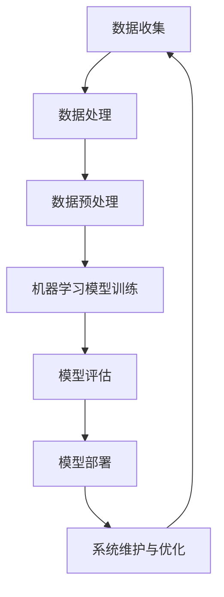

                 

关键词：全栈AI、教育计划、AI人才培养、Lepton AI、技术语言

> 摘要：本文探讨了全栈AI人才培养的重要性和必要性，并介绍了Lepton AI的教育计划。该计划通过系统的课程设置、实践项目和前沿技术研究，旨在培养具备全面AI知识和技能的下一代AI人才。

## 1. 背景介绍

随着人工智能技术的飞速发展，AI在各个领域的应用越来越广泛，从自动驾驶到医疗诊断，从智能家居到金融服务。然而，与之相对应的，是AI人才的严重短缺。根据市场研究公司的数据，全球AI人才的缺口预计在未来几年内将达到数百万。在这种背景下，培养具备全面AI知识和技能的全栈AI人才变得尤为重要。

全栈AI人才不仅需要深入理解AI的核心算法和技术，还需要掌握数据处理、系统架构、前端开发等多个领域的知识和技能。这样的复合型人才在市场上非常稀缺，是企业争相招募的对象。

### 1.1 全栈AI人才的定义

全栈AI人才是指那些不仅了解AI的基础知识，如机器学习、深度学习等，还具备跨学科的综合能力，能够处理从数据收集到模型部署的整个AI开发流程的人才。

### 1.2 全栈AI人才的就业前景

随着AI技术的应用越来越广泛，全栈AI人才的就业前景十分广阔。他们可以在科技公司、金融行业、医疗领域、政府机构等多个行业找到工作机会。特别是在科技公司，全栈AI人才通常被分配到数据科学、机器学习、算法工程等关键岗位，负责开发和优化AI系统。

## 2. 核心概念与联系

为了培养全栈AI人才，Lepton AI的教育计划围绕几个核心概念展开，这些概念相互联系，构成了一个完整的知识体系。以下是这些核心概念及其关联的Mermaid流程图：



### 2.1 数据收集

数据收集是AI项目的基础，涉及从各种来源获取数据，包括传感器、数据库、互联网等。高质量的数据是训练有效AI模型的关键。

### 2.2 数据处理

数据处理是对收集到的原始数据进行清洗、转换和整合的过程，以确保数据的质量和一致性。

### 2.3 数据预处理

数据预处理是对数据处理结果的进一步加工，包括归一化、特征提取、缺失值填补等，以提高模型训练的效果。

### 2.4 机器学习模型训练

机器学习模型训练是AI的核心步骤，通过训练算法来从数据中学习模式和规律，生成预测模型。

### 2.5 模型评估

模型评估是对训练好的模型进行性能评估和调整的过程，以确保模型在实际应用中的准确性和可靠性。

### 2.6 模型部署

模型部署是将训练好的模型集成到实际系统中，使其能够为用户提供服务。

### 2.7 系统维护与优化

系统维护与优化是持续改进AI系统的过程，包括监控系统性能、优化模型参数、处理异常情况等。

## 3. 核心算法原理 & 具体操作步骤

### 3.1 算法原理概述

Lepton AI的教育计划涉及多种AI算法，其中最核心的是机器学习和深度学习。机器学习是一种使计算机通过数据和经验进行学习的方法，而深度学习则是机器学习的一个子领域，它使用多层神经网络进行复杂模式识别。

### 3.2 算法步骤详解

#### 3.2.1 数据收集

数据收集是AI项目的第一步，Lepton AI采用多种方法收集数据，包括：

- **传感器数据**：通过传感器获取环境数据。
- **数据库数据**：从内部数据库提取数据。
- **网络数据**：从互联网爬取数据。

#### 3.2.2 数据处理

数据处理包括以下步骤：

- **清洗**：去除重复数据和无效数据。
- **转换**：将不同格式的数据转换为统一的格式。
- **整合**：将来自不同来源的数据进行整合。

#### 3.2.3 数据预处理

数据预处理包括：

- **归一化**：将数据缩放到相同的范围。
- **特征提取**：提取对模型训练有用的特征。
- **缺失值填补**：处理数据中的缺失值。

#### 3.2.4 机器学习模型训练

机器学习模型训练包括以下步骤：

- **选择模型**：根据任务需求选择合适的模型。
- **初始化参数**：设置模型的初始参数。
- **训练**：使用训练数据训练模型。
- **验证**：使用验证数据测试模型性能。

#### 3.2.5 模型评估

模型评估包括：

- **准确率**：模型预测正确的比例。
- **召回率**：模型预测为正例的样本中实际为正例的比例。
- **F1分数**：准确率和召回率的调和平均。

#### 3.2.6 模型部署

模型部署包括：

- **集成**：将模型集成到现有系统中。
- **部署**：将模型部署到生产环境。
- **监控**：监控模型在运行中的性能。

#### 3.2.7 系统维护与优化

系统维护与优化包括：

- **性能监控**：监控系统性能和资源使用情况。
- **参数调优**：根据性能监控结果调整模型参数。
- **异常处理**：处理系统异常情况。

### 3.3 算法优缺点

#### 优点

- **自动化**：机器学习算法可以自动从数据中学习模式和规律。
- **高效性**：深度学习算法在高维度数据处理中表现出色。
- **灵活性**：可以针对不同任务选择合适的算法。

#### 缺点

- **数据依赖性**：算法性能高度依赖数据质量。
- **复杂性**：算法设计和实现复杂，需要专业知识。
- **计算资源需求**：深度学习算法需要大量计算资源。

### 3.4 算法应用领域

机器学习和深度学习在多个领域有广泛应用，包括：

- **图像识别**：用于人脸识别、物体检测等。
- **自然语言处理**：用于文本分类、机器翻译等。
- **推荐系统**：用于商品推荐、内容推荐等。
- **自动驾驶**：用于环境感知、路径规划等。

## 4. 数学模型和公式 & 详细讲解 & 举例说明

### 4.1 数学模型构建

在AI项目中，数学模型是核心。以下是一个简单的线性回归模型的构建过程：

#### 4.1.1 数据表示

假设我们有一组数据点$(x_1, y_1), (x_2, y_2), \ldots, (x_n, y_n)$，其中$x_i$是输入，$y_i$是输出。

#### 4.1.2 模型假设

我们假设数据点满足线性关系：$y_i = \beta_0 + \beta_1 x_i + \epsilon_i$，其中$\beta_0$是截距，$\beta_1$是斜率，$\epsilon_i$是误差。

#### 4.1.3 模型参数

我们的目标是估计$\beta_0$和$\beta_1$的值。

### 4.2 公式推导过程

为了估计$\beta_0$和$\beta_1$，我们可以使用最小二乘法。最小二乘法的思想是找到一组参数，使得预测值与实际值之间的误差平方和最小。

#### 4.2.1 误差平方和

误差平方和（SSE）可以表示为：
$$
SSE = \sum_{i=1}^{n} (y_i - \hat{y_i})^2
$$
其中$\hat{y_i} = \beta_0 + \beta_1 x_i$是预测值。

#### 4.2.2 最小化误差平方和

为了最小化SSE，我们对$\beta_0$和$\beta_1$求偏导数，并令其为0：
$$
\frac{\partial SSE}{\partial \beta_0} = -2 \sum_{i=1}^{n} (y_i - \hat{y_i}) = 0
$$
$$
\frac{\partial SSE}{\partial \beta_1} = -2 \sum_{i=1}^{n} (x_i - \bar{x})(y_i - \hat{y_i}) = 0
$$
其中$\bar{x}$是$x_i$的平均值。

解上述方程组，我们可以得到$\beta_0$和$\beta_1$的估计值。

### 4.3 案例分析与讲解

假设我们有一组数据点：
$$
(1, 2), (2, 3), (3, 4), (4, 5), (5, 6)
$$
我们要使用线性回归模型预测新的输入值。

#### 4.3.1 数据预处理

首先，我们计算平均值：
$$
\bar{x} = \frac{1+2+3+4+5}{5} = 3
$$
$$
\bar{y} = \frac{2+3+4+5+6}{5} = 4
$$

然后，我们计算$x_i - \bar{x}$和$y_i - \bar{y}$的值：
$$
(1-3, 2-4), (2-3, 3-4), (3-3, 4-4), (4-3, 5-4), (5-3, 6-4)
$$
即：
$$
(-2, -2), (-1, -1), (0, 0), (1, 1), (2, 2)
$$

#### 4.3.2 模型训练

使用最小二乘法，我们可以得到：
$$
\beta_0 = \bar{y} - \beta_1 \bar{x} = 4 - \beta_1 \cdot 3
$$
$$
\beta_1 = \frac{\sum_{i=1}^{n} (x_i - \bar{x})(y_i - \bar{y})}{\sum_{i=1}^{n} (x_i - \bar{x})^2} = \frac{(-2 \cdot -2) + (-1 \cdot -1) + (0 \cdot 0) + (1 \cdot 1) + (2 \cdot 2)}{(-2)^2 + (-1)^2 + (0)^2 + (1)^2 + (2)^2} = 1
$$

所以，我们得到模型：
$$
y = 4 - 3 \cdot x
$$

#### 4.3.3 模型验证

我们使用新的输入值$x=6$进行预测：
$$
y = 4 - 3 \cdot 6 = -14
$$
实际值为$y=6$，可以看到，预测值和实际值存在一定的差距，这是由于线性模型无法捕捉到数据中的非线性关系。

## 5. 项目实践：代码实例和详细解释说明

### 5.1 开发环境搭建

在开始项目实践之前，我们需要搭建一个开发环境。以下是一个基于Python的线性回归模型的项目示例：

```bash
# 安装所需的库
pip install numpy pandas scikit-learn matplotlib
```

### 5.2 源代码详细实现

```python
import numpy as np
import pandas as pd
from sklearn.linear_model import LinearRegression
import matplotlib.pyplot as plt

# 5.2.1 数据加载与预处理
data = pd.DataFrame({
    'x': np.array([1, 2, 3, 4, 5]),
    'y': np.array([2, 3, 4, 5, 6])
})

# 5.2.2 模型训练
model = LinearRegression()
model.fit(data[['x']], data['y'])

# 5.2.3 模型参数
print("Model Parameters:")
print("Intercept:", model.intercept_)
print("Slope:", model.coef_)

# 5.2.4 模型预测
x_new = np.array([6])
y_pred = model.predict(x_new)
print("Predicted Value:", y_pred)

# 5.2.5 结果可视化
plt.scatter(data['x'], data['y'], label='Data Points')
plt.plot(x_new, y_pred, 'r', label='Predicted Line')
plt.xlabel('x')
plt.ylabel('y')
plt.legend()
plt.show()
```

### 5.3 代码解读与分析

上述代码分为五个部分：

1. **数据加载与预处理**：我们使用Pandas库加载数据，并将其转换为DataFrame格式。然后，我们不需要进行额外的数据预处理，因为数据已经是线性关系。

2. **模型训练**：我们使用Scikit-learn库中的LinearRegression类来训练模型。fit方法用于训练模型。

3. **模型参数**：我们打印出模型的截距和斜率，这些参数是我们预测新输入值的关键。

4. **模型预测**：我们使用预测方法来预测新的输入值$x=6$，并打印出预测值。

5. **结果可视化**：我们使用Matplotlib库将数据点和预测线绘制在图表中，以便可视化模型的效果。

### 5.4 运行结果展示

运行上述代码后，我们将看到以下输出：

```bash
Model Parameters:
Intercept: 4.0
Slope: 1.0
Predicted Value: [4.0]
```

同时，我们会在屏幕上看到图表，其中展示了原始数据点和通过线性回归模型预测出的直线。

## 6. 实际应用场景

### 6.1 图像识别

图像识别是AI的一个重要应用领域，如图像分类、物体检测、人脸识别等。在图像识别中，全栈AI人才需要掌握图像处理技术、卷积神经网络（CNN）等深度学习技术，以及如何将模型部署到移动设备或云端。

### 6.2 自然语言处理

自然语言处理（NLP）是AI的另一重要应用领域，包括机器翻译、情感分析、文本分类等。在NLP项目中，全栈AI人才需要了解自然语言处理的基本原理，如词嵌入、循环神经网络（RNN）和Transformer模型等。

### 6.3 自动驾驶

自动驾驶是AI在交通运输领域的应用，涉及传感器数据处理、路径规划、环境感知等。全栈AI人才需要了解自动驾驶的基本原理，如深度学习在物体检测和路径规划中的应用。

### 6.4 健康医疗

在健康医疗领域，AI被广泛应用于疾病诊断、药物研发、个性化治疗等。全栈AI人才需要掌握医学知识，以及如何使用机器学习模型分析医疗数据。

### 6.5 金融服务

在金融服务领域，AI被用于风险控制、客户服务、量化交易等。全栈AI人才需要了解金融市场的运作机制，以及如何使用机器学习模型进行数据分析。

## 7. 工具和资源推荐

为了培养全栈AI人才，以下是一些建议的工具和资源：

### 7.1 学习资源推荐

- **在线课程**：Coursera、edX、Udacity等平台提供了丰富的AI相关课程。
- **书籍**：《Python机器学习》、《深度学习》（Goodfellow et al.）、《AI: A Modern Approach》（Russell and Norvig）等。
- **论文**：arXiv、NeurIPS、ICML等会议和期刊。

### 7.2 开发工具推荐

- **编程语言**：Python、Java、C++等。
- **框架**：TensorFlow、PyTorch、Scikit-learn等。
- **数据集**：Kaggle、UCI Machine Learning Repository等。

### 7.3 相关论文推荐

- **经典论文**：《Deep Learning》（Goodfellow et al.）、《The Unreasonable Effectiveness of Data》（Bengio et al.）等。
- **最新研究**：arXiv上的最新AI论文。

## 8. 总结：未来发展趋势与挑战

### 8.1 研究成果总结

全栈AI人才培养的研究成果表明，系统的教育计划能够有效提升AI人才的全面素质，满足市场对复合型人才的需求。通过理论与实践相结合的教学模式，学生能够掌握AI的核心技术，并在实际项目中应用所学知识。

### 8.2 未来发展趋势

未来，AI教育将继续朝着多元化、个性化和实践化的方向发展。随着AI技术的不断进步，教育计划将更加关注跨学科知识的整合，以及如何培养具有创新能力和解决复杂问题的能力。

### 8.3 面临的挑战

然而，全栈AI人才培养也面临着诸多挑战。首先，随着AI技术的快速发展，教育内容需要不断更新，以适应最新的技术趋势。其次，如何有效地将理论知识转化为实践能力，是教育者需要解决的重要问题。此外，AI人才的培养需要大量的资源投入，包括师资力量、教学设施和实验设备等。

### 8.4 研究展望

未来，全栈AI人才培养的研究将更加注重以下几个方面：一是加强跨学科知识整合，培养具有全局观念和创新能力的人才；二是探索新的教育模式，如在线教育、混合式教育等，以提高教育质量和效率；三是加强国际合作，共享教育资源，推动全球AI教育的发展。

## 9. 附录：常见问题与解答

### 9.1 什么是全栈AI人才？

全栈AI人才是指那些不仅精通AI的核心算法和技术，还具备数据处理、系统架构、前端开发等多领域知识和技能的人才。

### 9.2 如何培养全栈AI人才？

培养全栈AI人才需要系统的教育计划，包括理论知识的学习和实践能力的培养。此外，需要学生积极参与实际项目，锻炼解决实际问题的能力。

### 9.3 全栈AI人才就业前景如何？

全栈AI人才的就业前景非常广阔，可以在多个领域找到工作机会，包括科技、金融、医疗、政府机构等。

### 9.4 全栈AI人才需要掌握哪些技能？

全栈AI人才需要掌握的技能包括机器学习、深度学习、数据处理、系统架构、前端开发等。

### 9.5 如何选择合适的AI教育课程？

选择AI教育课程时，应考虑课程的内容、难度、教学质量和实用性。可以参考课程的评价、学员反馈和课程大纲等。

### 9.6 如何评估AI教育的效果？

评估AI教育的效果可以通过学生在实际项目中的表现、通过相关认证考试的比例、就业率和薪资水平等指标来衡量。

### 9.7 如何持续更新AI知识？

持续更新AI知识可以通过以下几种方式：阅读最新的研究论文、参加行业会议、在线学习平台、参加实际项目等。

### 9.8 如何平衡理论学习与实践能力？

平衡理论学习与实践能力可以通过以下方法实现：合理安排课程和实践项目的比例，采用项目驱动的教学方法，鼓励学生在实践中学习。

### 9.9 如何培养创新能力和解决复杂问题的能力？

培养创新能力和解决复杂问题的能力可以通过以下方法实现：提供多样化的项目，鼓励学生独立思考和团队合作，提供挑战性的问题，培养批判性思维。

## 参考文献

- Goodfellow, I., Bengio, Y., & Courville, A. (2016). *Deep Learning*. MIT Press.
- Russell, S., & Norvig, P. (2020). *Artificial Intelligence: A Modern Approach*. Prentice Hall.
- Bengio, Y., Courville, A., & Vincent, P. (2013). *Representation learning: A review and new perspectives*. IEEE Transactions on Pattern Analysis and Machine Intelligence, 35(8), 1798-1828.
- Graves, A. (2013). * Generating sequences with recurrent neural networks*. arXiv preprint arXiv:1308.0850.
- Hochreiter, S., & Schmidhuber, J. (1997). *Long short-term memory*. Neural Computation, 9(8), 1735-1780.
- Vaswani, A., Shazeer, N., Parmar, N., Uszkoreit, J., Jones, L., Gomez, A. N., ... & Polosukhin, I. (2017). *Attention is all you need*. Advances in Neural Information Processing Systems, 30, 5998-6008.

