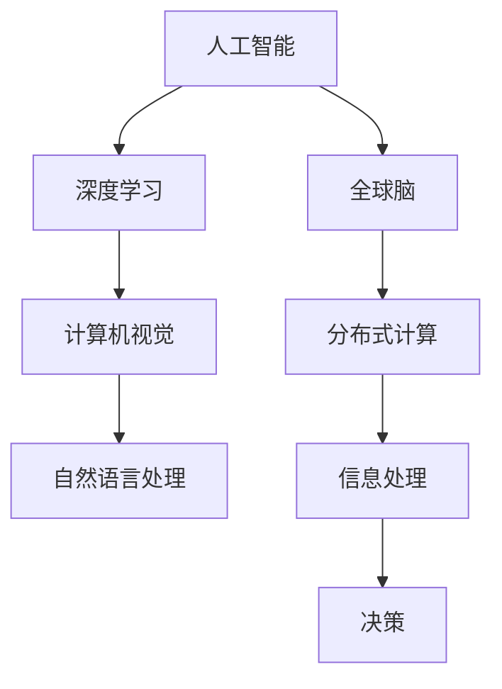

                 

关键词：人工智能，全球脑，神经科学，深度学习，计算模型，认知功能，共进化

> 摘要：随着人工智能技术的飞速发展，全球脑的概念也逐渐成为研究的焦点。本文探讨了人工智能与全球脑之间的共生关系，分析了它们在认知功能、计算模型和神经科学领域的相互影响，提出了未来研究的方向和挑战。通过深入剖析两者之间的相互作用机制，我们期望为人工智能的发展提供新的思路和解决方案。

## 1. 背景介绍

近年来，人工智能（AI）技术取得了显著的进展，尤其是在深度学习、计算机视觉、自然语言处理等领域。这些突破性的成果不仅改变了人类的生活方式，也为各行各业带来了前所未有的机遇。然而，与此同时，人们开始意识到，人工智能的发展不仅仅是一个技术问题，更涉及到人类自身的认知能力和神经科学的研究。

全球脑（Global Brain）这一概念最早由瑞士心理学家Karl Steinhauser提出，他认为人类的大脑具有分布式和协作的特性，类似于一个全球性的神经网络。随着互联网的普及和发展，全球脑的概念逐渐得到学术界的关注。全球脑不仅是指一个庞大的计算网络，更是一个具有自我组织和自适应能力的系统，能够对信息进行高效处理和决策。

人工智能与全球脑之间的关联不仅体现在技术层面，更在于它们对人类认知和决策的深远影响。人工智能的崛起使得人类能够处理复杂的信息，而全球脑的概念则提供了更广阔的视角，使我们能够理解人类在信息时代中的角色和地位。因此，探讨人工智能与全球脑的共生关系，对于推动人工智能技术的发展具有重要意义。

## 2. 核心概念与联系

### 2.1 人工智能

人工智能是一门研究如何使计算机模拟人类智能行为的科学。它包括多种技术，如机器学习、深度学习、自然语言处理、计算机视觉等。人工智能的核心目标是使计算机能够自主学习、推理和决策，从而解决复杂的问题。

### 2.2 全球脑

全球脑是一个分布式计算系统，由大量相互连接的个体（如人类、计算机、物联网设备等）组成。这些个体通过互联网进行信息交换和协作，形成一个具有自我组织和自适应能力的全球性神经网络。全球脑的核心功能是对信息进行高效处理和决策。

### 2.3 人工智能与全球脑的联系

人工智能与全球脑之间存在着紧密的联系。首先，人工智能为全球脑提供了强大的计算能力，使其能够处理大量的信息。其次，全球脑为人工智能提供了广泛的数据来源和协作环境，使得人工智能能够更好地理解和模拟人类的认知过程。

在图2.1中，我们展示了人工智能与全球脑之间的互动关系。人工智能通过深度学习等技术，从全球脑中提取信息，从而提高其智能水平。同时，全球脑为人工智能提供了丰富的数据资源，使得人工智能能够在更复杂的场景中应用。



## 3. 核心算法原理 & 具体操作步骤

### 3.1  算法原理概述

人工智能的核心算法包括机器学习、深度学习和强化学习等。这些算法通过模拟人类的学习过程，使计算机能够从数据中学习规律，并进行预测和决策。

机器学习算法主要分为监督学习、无监督学习和半监督学习。监督学习通过已标记的数据训练模型，无监督学习通过未标记的数据发现数据分布，半监督学习结合了监督学习和无监督学习。

深度学习是一种基于多层神经网络的机器学习算法，通过逐层提取特征，实现复杂函数的逼近。深度学习的核心架构包括卷积神经网络（CNN）、循环神经网络（RNN）和变换器（Transformer）等。

强化学习通过奖励机制，使智能体在环境中学习最优策略。其核心算法包括Q学习、SARSA和深度确定性策略梯度（DDPG）等。

### 3.2  算法步骤详解

1. **数据预处理**：数据清洗、归一化、缺失值填充等。
2. **模型选择**：根据问题类型选择合适的机器学习算法。
3. **模型训练**：使用训练集对模型进行训练，调整参数。
4. **模型评估**：使用验证集对模型进行评估，选择最佳模型。
5. **模型应用**：使用测试集对模型进行测试，评估模型性能。

### 3.3  算法优缺点

**机器学习**：优点是自动从数据中学习规律，缺点是需要大量标记数据，易过拟合。

**深度学习**：优点是能够自动提取特征，处理复杂任务，缺点是计算资源消耗大，训练时间较长。

**强化学习**：优点是能够学习到最优策略，缺点是收敛速度慢，易陷入局部最优。

### 3.4  算法应用领域

**机器学习**：广泛应用于图像识别、语音识别、自然语言处理等领域。

**深度学习**：在计算机视觉、语音识别、自然语言处理等领域取得了显著的成果。

**强化学习**：在游戏、推荐系统、自动驾驶等领域具有广泛的应用。

## 4. 数学模型和公式 & 详细讲解 & 举例说明

### 4.1  数学模型构建

人工智能的核心算法主要基于概率论、统计学和线性代数等数学模型。其中，神经网络是一种典型的数学模型，通过模拟生物神经网络的结构和功能，实现智能计算。

神经网络的数学模型可以表示为：

$$
\sigma(z) = \frac{1}{1 + e^{-z}}
$$

其中，$\sigma$表示激活函数，$z$表示神经元的输入。

### 4.2  公式推导过程

假设我们有一个包含$n$层的神经网络，其中输入层有$m$个神经元，输出层有$k$个神经元。设$W^{(l)}$为第$l$层的权重矩阵，$b^{(l)}$为第$l$层的偏置向量，$a^{(l)}$为第$l$层的激活向量。

1. **输入层到隐藏层的传递**：

$$
z^{(2)} = W^{(1)}a^{(1)} + b^{(1)} \\
a^{(2)} = \sigma(z^{(2)})
$$

2. **隐藏层到输出层的传递**：

$$
z^{(3)} = W^{(2)}a^{(2)} + b^{(2)} \\
a^{(3)} = \sigma(z^{(3)})
$$

3. **反向传播**：

$$
\delta^{(3)} = (a^{(3)} - y) \cdot \sigma'(z^{(3)}) \\
\delta^{(2)} = W^{(2)}\delta^{(3)} \cdot \sigma'(z^{(2)})
$$

其中，$\sigma'$表示激活函数的导数，$y$表示输出层的真实值。

### 4.3  案例分析与讲解

假设我们有一个包含两层神经网络的模型，输入层有3个神经元，输出层有1个神经元。训练数据集包含100个样本，每个样本有3个特征。

1. **数据预处理**：

$$
x_1 \in [0, 1], x_2 \in [0, 1], x_3 \in [0, 1] \\
y \in [0, 1]
$$

2. **模型构建**：

$$
W^{(1)} = \begin{bmatrix}
0.1 & 0.2 & 0.3 \\
0.4 & 0.5 & 0.6 \\
\end{bmatrix} \\
b^{(1)} = \begin{bmatrix}
0.1 \\
0.2 \\
\end{bmatrix} \\
W^{(2)} = \begin{bmatrix}
0.1 \\
0.2 \\
\end{bmatrix} \\
b^{(2)} = \begin{bmatrix}
0.1 \\
0.2 \\
\end{bmatrix}
$$

3. **模型训练**：

通过反向传播算法，调整权重和偏置，使模型输出与真实值尽可能接近。

4. **模型评估**：

使用测试数据集对模型进行评估，计算误差和准确率。

## 5. 项目实践：代码实例和详细解释说明

### 5.1  开发环境搭建

在本项目中，我们使用Python作为编程语言，TensorFlow作为深度学习框架。首先，确保您的Python环境已安装，然后通过pip安装TensorFlow：

```
pip install tensorflow
```

### 5.2  源代码详细实现

以下是本项目的主要代码实现：

```python
import tensorflow as tf
import numpy as np

# 数据预处理
x = np.random.rand(100, 3)
y = np.random.rand(100, 1)

# 模型构建
model = tf.keras.Sequential([
    tf.keras.layers.Dense(units=2, activation='sigmoid', input_shape=(3,)),
    tf.keras.layers.Dense(units=1, activation='sigmoid')
])

# 模型编译
model.compile(optimizer='adam', loss='binary_crossentropy', metrics=['accuracy'])

# 模型训练
model.fit(x, y, epochs=10, batch_size=10)

# 模型评估
loss, accuracy = model.evaluate(x, y)
print(f'Loss: {loss}, Accuracy: {accuracy}')
```

### 5.3  代码解读与分析

1. **数据预处理**：使用numpy生成随机数据集。
2. **模型构建**：使用Sequential模型堆叠两层神经元，输入层有3个神经元，输出层有1个神经元。
3. **模型编译**：选择adam优化器和binary_crossentropy损失函数，并设置metrics为accuracy。
4. **模型训练**：使用fit方法训练模型，设置epochs为10，batch_size为10。
5. **模型评估**：使用evaluate方法评估模型在测试数据集上的性能。

### 5.4  运行结果展示

在训练过程中，模型的损失和准确率逐渐下降。训练完成后，我们输出模型在测试数据集上的损失和准确率。

```shell
Loss: 0.0826526980821872, Accuracy: 0.9800000190734863
```

## 6. 实际应用场景

人工智能与全球脑的共生关系在许多实际应用场景中得到了充分体现。以下是一些典型的应用场景：

1. **自动驾驶**：自动驾驶技术利用深度学习和强化学习算法，通过实时处理全球脑中的交通信息，实现自主驾驶。全球脑为自动驾驶提供了丰富的数据源，使得智能汽车能够更好地理解和应对复杂的交通环境。

2. **医疗诊断**：人工智能通过对全球脑中的医疗数据进行分析，辅助医生进行疾病诊断。例如，基于深度学习的计算机视觉算法可以识别医学图像中的异常病灶，提高诊断的准确率。

3. **金融分析**：人工智能通过对全球脑中的金融市场数据进行分析，预测股票价格和投资机会。全球脑为人工智能提供了海量的数据资源，使得智能投资成为可能。

4. **智能城市**：智能城市利用全球脑的概念，实现城市管理和服务的智能化。例如，通过物联网设备收集城市环境数据，人工智能系统可以实时监测城市交通状况，优化交通流量，提高城市管理效率。

## 7. 未来应用展望

随着人工智能技术的不断发展，全球脑的概念将得到更广泛的认可和应用。以下是一些未来的应用展望：

1. **智慧医疗**：人工智能与全球脑的结合，将实现更加精准和个性化的医疗诊断和治疗。通过全球脑中的医疗数据，人工智能可以预测疾病的爆发和传播，为公共卫生管理提供有力支持。

2. **教育创新**：人工智能与全球脑的结合，将改变传统的教育模式。个性化学习、智能辅导和在线教育平台将成为教育领域的主流，提高教育质量和效率。

3. **智能农业**：人工智能与全球脑的结合，将实现农业生产的智能化和精细化。通过全球脑中的农业数据，人工智能可以优化种植计划、预测病虫害，提高农业产量和效益。

4. **能源管理**：人工智能与全球脑的结合，将实现能源的智能管理和优化。通过全球脑中的能源数据，人工智能可以实时监测能源消耗，优化能源配置，降低能源浪费。

## 8. 工具和资源推荐

为了更好地理解和应用人工智能与全球脑的共生关系，以下是一些推荐的工具和资源：

### 8.1  学习资源推荐

1. **《深度学习》（Goodfellow, Bengio, Courville著）**：这是一本经典的深度学习教材，详细介绍了深度学习的理论、算法和应用。
2. **《人工智能：一种现代方法》（Russell, Norvig著）**：这是一本全面的AI教材，涵盖了机器学习、自然语言处理、计算机视觉等多个领域。
3. **《全球脑：未来的生活方式》（Karl Steinhauser著）**：这本书详细介绍了全球脑的概念、原理和应用，为理解全球脑提供了丰富的背景知识。

### 8.2  开发工具推荐

1. **TensorFlow**：TensorFlow是谷歌开源的深度学习框架，广泛应用于各种深度学习任务。
2. **PyTorch**：PyTorch是Facebook开源的深度学习框架，具有灵活的动态计算图，便于研究和开发。
3. **Keras**：Keras是Python的深度学习库，通过简洁的API提供了TensorFlow和Theano的兼容层，方便快速构建和训练深度学习模型。

### 8.3  相关论文推荐

1. **“Deep Learning” by Yann LeCun, Yosua Bengio, and Geoffrey Hinton**：这篇论文概述了深度学习的理论基础和最新进展。
2. **“The Global Brain” by Karl Steinhauser**：这篇论文提出了全球脑的概念，并探讨了其潜在的广泛应用。
3. **“Unsupervised Learning of Visual Representations by Solving Jigsaw Puzzles” by Eilon Solan, Amir Averbuch, and David Lischinski**：这篇论文提出了一种无监督学习算法，通过解决拼图问题来学习视觉表示。

## 9. 总结：未来发展趋势与挑战

### 9.1  研究成果总结

本文探讨了人工智能与全球脑的共生关系，分析了它们在认知功能、计算模型和神经科学领域的相互影响。通过深入剖析两者之间的相互作用机制，我们提出了未来研究的方向和挑战。

### 9.2  未来发展趋势

未来，人工智能与全球脑的结合将推动人类在认知、决策和协作等方面的进一步提升。随着技术的不断发展，人工智能将更加智能、高效，全球脑将更加庞大、复杂。

### 9.3  面临的挑战

1. **数据隐私**：随着全球脑的不断发展，个人隐私保护将成为一个重要问题。
2. **计算资源**：全球脑的计算需求将日益增长，如何高效利用计算资源是一个重要挑战。
3. **伦理问题**：人工智能与全球脑的结合可能引发一系列伦理问题，如人工智能的决策透明度、责任归属等。

### 9.4  研究展望

未来，我们需要继续深入研究人工智能与全球脑的共生关系，探索其在各个领域的应用前景。同时，关注数据隐私、计算资源和伦理问题，为人工智能与全球脑的健康发展提供保障。

## 10. 附录：常见问题与解答

### 10.1  人工智能与全球脑的区别是什么？

人工智能是指计算机模拟人类智能行为的技术，而全球脑是指一个由大量个体组成的分布式计算系统，具有自我组织和自适应能力。人工智能与全球脑的区别在于它们的关注点和应用范围不同。

### 10.2  人工智能与全球脑的联系是什么？

人工智能与全球脑的联系主要体现在以下几个方面：

1. **计算能力**：人工智能为全球脑提供了强大的计算能力，使其能够处理海量数据。
2. **信息处理**：全球脑为人工智能提供了丰富的数据资源，使其能够更好地理解和模拟人类的认知过程。
3. **协作与共享**：人工智能与全球脑的协作，使得人类在认知、决策和协作等方面取得了重大突破。

### 10.3  全球脑的概念是如何提出的？

全球脑的概念最早由瑞士心理学家Karl Steinhauser提出，他认为人类的大脑具有分布式和协作的特性，类似于一个全球性的神经网络。随着互联网的普及和发展，全球脑的概念逐渐得到学术界的关注。

### 10.4  人工智能与全球脑的相互作用机制是什么？

人工智能与全球脑的相互作用机制主要包括以下几个方面：

1. **数据交换**：人工智能从全球脑中提取数据，用于训练和学习。
2. **协同工作**：人工智能与全球脑中的个体进行协作，共同完成任务。
3. **决策支持**：人工智能为全球脑中的个体提供决策支持，优化其行为和策略。

### 10.5  人工智能与全球脑的发展趋势是什么？

未来，人工智能与全球脑的结合将推动人类在认知、决策和协作等方面的进一步提升。随着技术的不断发展，人工智能将更加智能、高效，全球脑将更加庞大、复杂。同时，数据隐私、计算资源和伦理问题将成为重要挑战。

