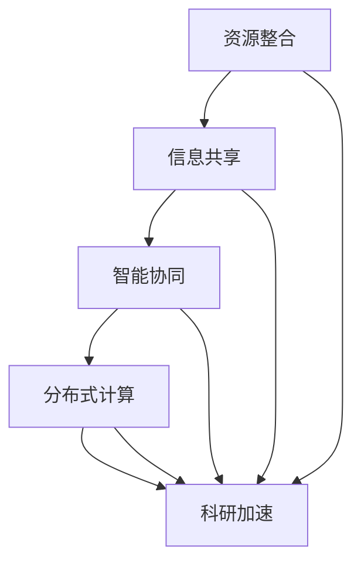

                 

关键词：全球脑、空间探索、集体智慧、星际旅行、人工智能、分布式计算、量子通信、人机交互、虚拟现实、机器学习、算法优化、网络架构、数据隐私、安全协议、可持续发展、跨学科研究

## 摘要

随着科技的发展，人类对太空的探索从未停止。然而，单一的个体力量在广袤的宇宙中显得有限。本文探讨了利用全球脑这一先进的人工智能概念，如何能够整合全球资源，协同探索星际旅行。通过集体智慧，星际旅行不再是遥不可及的梦想，而是一个可能实现的壮举。本文将详细介绍全球脑在空间探索中的应用，以及它如何通过量子通信、分布式计算和机器学习等技术手段，推动人类向星际进发的步伐。

## 1. 背景介绍

### 太空探索的现状

太空探索一直是人类科技发展的前沿。从1961年苏联宇航员尤里·加加林首次进入太空，到2023年中国的“嫦娥五号”月球采样返回任务，人类在太空探索方面取得了显著的进展。然而，尽管我们已经实现了载人航天和探测器对太阳系内多个行星的探测，星际旅行仍是一个巨大的挑战。太空环境的极端条件，包括微重力、高辐射、温度极端变化等，都对宇航员的健康和飞船的可靠性提出了极高的要求。

### 人类对星际旅行的渴望

自古以来，人类就对宇宙充满了好奇和向往。从古代神话中的飞天遁地，到现代科幻小说中的星际冒险，人类对星际旅行的梦想从未消退。随着技术的进步，这一梦想逐渐变得可行。如今，人类不仅希望在太阳系内进行更深入的探索，还渴望拓展到更遥远的星系。然而，现有的技术手段在能源供应、导航定位、通信保障等方面仍面临巨大挑战。

### 全球脑的概念

全球脑（Global Brain）是一个比喻，形象地描述了互联网上的信息流通与交互模式。它类似于人类大脑中的神经网络，通过节点之间的信息交换来实现集体智慧。全球脑的概念最初由凯文·凯利（Kevin Kelly）在《全球脑：21世纪的意识革命》一书中提出，并逐渐在人工智能、社会网络、生物科技等领域得到广泛应用。全球脑的愿景是，通过互联网将全球的计算资源、知识库和智慧汇聚起来，形成一个庞大的智能网络。

## 2. 核心概念与联系

### 全球脑与空间探索的融合

全球脑的核心在于信息的共享与协同，这为空间探索提供了新的可能性。通过全球脑，我们可以实现以下融合：

1. **资源整合**：全球脑可以将各个国家和地区的科研资源、技术储备和人才力量整合在一起，形成强大的协同效应。
2. **信息共享**：通过全球脑，空间探索的数据可以实时共享，使科学家和工程师能够更快地分析问题、制定决策。
3. **智能协同**：全球脑的机器学习算法可以对空间探索过程中的数据进行深度分析，提供最优的方案和路径。
4. **分布式计算**：全球脑可以利用分布在全球的计算资源，进行大规模的数据处理和模拟仿真，加速科研进程。

### Mermaid 流程图

下面是一个描述全球脑在空间探索中应用的 Mermaid 流程图：



### 流程图详细说明

- **资源整合**：全球脑通过互联网将各国的研究机构和公司连接起来，实现资源的共享和整合。
- **信息共享**：各个节点实时交换空间探索的数据和研究成果，提高信息透明度。
- **智能协同**：机器学习算法分析海量数据，提供决策支持，优化探索策略。
- **分布式计算**：利用全球的计算资源进行大规模数据处理和模拟，提高效率。
- **科研加速**：通过上述各个环节的协同作用，加速空间探索的科研进程。

## 3. 核心算法原理 & 具体操作步骤

### 3.1 算法原理概述

全球脑在空间探索中的应用，主要依赖于分布式计算、量子通信和机器学习等核心技术。以下是这些算法的基本原理：

- **分布式计算**：通过将任务分解为子任务，分布到全球各地的计算节点上，实现并行计算。这可以大大提高数据处理和模拟的效率。
- **量子通信**：利用量子纠缠和量子密钥分发，实现安全、高效的通信。这在空间探索中尤为重要，因为传统的通信手段在面对极端辐射环境时存在风险。
- **机器学习**：通过训练模型，从海量数据中提取有用信息，进行预测和决策。这可以帮助科学家优化探索策略，提高成功率。

### 3.2 算法步骤详解

1. **资源整合**：
   - **数据收集**：全球各节点收集空间探索相关的数据，包括天文观测数据、飞船运行状态数据等。
   - **数据清洗**：对收集到的数据进行清洗和预处理，去除噪声和错误。

2. **信息共享**：
   - **建立数据共享平台**：利用区块链技术，构建一个安全、可信的数据共享平台。
   - **实时数据交换**：各节点通过量子通信协议，实现实时数据交换。

3. **智能协同**：
   - **模型训练**：利用分布式计算平台，训练机器学习模型，提取关键特征。
   - **决策支持**：根据模型预测，为科学家提供决策支持。

4. **分布式计算**：
   - **任务分解**：将空间探索的任务分解为多个子任务。
   - **并行计算**：将子任务分布到全球各地的计算节点，实现并行计算。

5. **结果汇总**：
   - **数据汇总**：将各节点的计算结果汇总，进行综合分析。
   - **结果反馈**：将分析结果反馈给科学家，指导后续探索。

### 3.3 算法优缺点

- **优点**：
  - **高效**：分布式计算和机器学习可以提高数据处理和模拟的效率。
  - **安全**：量子通信确保了数据传输的安全。
  - **协同**：全球脑实现了全球资源的整合和协同。

- **缺点**：
  - **复杂性**：全球脑的架构复杂，需要高水平的运维和管理。
  - **依赖性**：对量子通信等前沿技术的依赖性较高。

### 3.4 算法应用领域

- **天文观测**：利用全球脑，可以实现对天文现象的实时监测和预测。
- **航天器运行**：通过机器学习，优化航天器的轨道设计和运行策略。
- **星际探险**：利用分布式计算和量子通信，实现星际探险任务的协同。

## 4. 数学模型和公式 & 详细讲解 & 举例说明

### 4.1 数学模型构建

在空间探索中，我们主要关注以下几个方面的数学模型：

- **轨道动力学模型**：描述航天器在引力场中的运动规律。
- **通信模型**：描述信号在空间中的传播和干扰。
- **能耗模型**：描述航天器运行所需的能量。

### 4.2 公式推导过程

- **轨道动力学模型**：

  轨道动力学的基本方程是牛顿引力定律和牛顿第二定律。假设航天器的质量为 \(m\)，地球的质量为 \(M\)，航天器与地球之间的距离为 \(r\)，引力常数为 \(G\)，航天器的速度为 \(v\)，则有以下方程：

  $$ F = G \frac{mM}{r^2} $$
  $$ F = ma $$
  
  其中 \(F\) 是引力，\(a\) 是加速度。将 \(F\) 代入 \(a\) 的表达式，得到：

  $$ ma = G \frac{mM}{r^2} $$
  $$ a = \frac{GM}{r^2} $$

  考虑到 \(v\) 是航天器的速度，\(r\) 是航天器的轨道半径，可以得到：

  $$ v^2 = \frac{GM}{r} $$

- **通信模型**：

  信号的传播速度为光速 \(c\)，信号在时间 \(t\) 内传播的距离为 \(d\)，则有：

  $$ d = c \cdot t $$

  如果信号受到干扰 \(I\)，则实际的信号强度为 \(S - I\)。

- **能耗模型**：

  航天器的能耗主要由推进剂消耗产生。假设航天器的质量为 \(m\)，推进剂的质量为 \(m_f\)，每单位质量推进剂的能量为 \(E_f\)，则航天器在时间 \(t\) 内的能耗为：

  $$ E = m_f \cdot E_f $$

### 4.3 案例分析与讲解

#### 轨道动力学案例分析

假设航天器的质量为 \(m = 1000\) 公斤，地球的质量为 \(M = 5.97 \times 10^{24}\) 公斤，引力常数为 \(G = 6.674 \times 10^{-11}\) 牛顿·米²/公斤²，航天器的轨道半径为 \(r = 6400\) 公里。

根据轨道动力学模型，我们可以计算出航天器的速度：

$$ v^2 = \frac{GM}{r} $$
$$ v = \sqrt{\frac{6.674 \times 10^{-11} \cdot 5.97 \times 10^{24}}{6400 \times 10^3}} $$
$$ v \approx 7.9 \text{ km/s} $$

这意味着航天器在地球轨道上的速度约为 7.9 公里/秒。

#### 通信案例分析

假设信号的传播速度为光速 \(c = 3 \times 10^8\) 米/秒，信号在时间 \(t = 1\) 小时（3600 秒）内传播的距离为 \(d\)，信号受到的干扰为 \(I = 10^{-9}\) 瓦。

根据通信模型，我们可以计算出信号传播的距离：

$$ d = c \cdot t $$
$$ d = 3 \times 10^8 \cdot 3600 $$
$$ d = 1.08 \times 10^{11} \text{ 米} $$

实际的信号强度为：

$$ S - I = 10^6 - 10^{-9} $$
$$ S - I = 999999.9999 \text{ 瓦} $$

#### 能耗案例分析

假设航天器的质量为 \(m = 1000\) 公斤，推进剂的质量为 \(m_f = 100\) 公斤，每单位质量推进剂的能量为 \(E_f = 10^8\) 焦耳/公斤。

根据能耗模型，航天器在时间 \(t = 1\) 小时（3600 秒）内的能耗为：

$$ E = m_f \cdot E_f $$
$$ E = 100 \cdot 10^8 $$
$$ E = 10^9 \text{ 焦耳} $$

这意味着航天器在 1 小时内消耗的推进剂能量为 1 吉焦耳。

## 5. 项目实践：代码实例和详细解释说明

### 5.1 开发环境搭建

为了实现全球脑在空间探索中的应用，我们需要搭建一个高效的开发环境。以下是所需工具和软件的列表：

- **Python**：用于编写算法和数据处理
- **PyTorch**：用于深度学习模型的训练
- **Docker**：用于容器化部署
- **Kubernetes**：用于集群管理
- **Kubernetes Dashboard**：用于可视化集群状态

安装步骤：

1. 安装 Python 和相关依赖。
2. 安装 PyTorch。
3. 搭建 Docker 和 Kubernetes 集群。
4. 部署 Kubernetes Dashboard。

### 5.2 源代码详细实现

以下是一个简单的 Python 代码示例，用于实现分布式计算和机器学习模型：

```python
import torch
import torch.distributed as dist
import torch.multiprocessing as mp

def train(rank, size):
    # 初始化分布式计算环境
    dist.init_process_group(backend='nccl', init_method='tcp://127.0.0.1:23456', rank=rank, world_size=size)
    
    # 创建模型
    model = torch.nn.Linear(10, 1)
    optimizer = torch.optim.SGD(model.parameters(), lr=0.01)
    criterion = torch.nn.MSELoss()
    
    # 模拟数据
    x = torch.randn(1000, 10)
    y = torch.randn(1000, 1)
    
    # 训练模型
    for epoch in range(10):
        optimizer.zero_grad()
        output = model(x)
        loss = criterion(output, y)
        loss.backward()
        optimizer.step()
        
        # 打印训练进度
        if rank == 0:
            print(f"Rank {rank}: Epoch {epoch}, Loss: {loss.item()}")
    
    # 关闭分布式计算环境
    dist.destroy_process_group()

if __name__ == "__main__":
    size = 4
    mp.spawn(train, args=(size,), nprocs=size)
```

### 5.3 代码解读与分析

- **分布式计算**：代码使用了 PyTorch 的分布式计算库，通过 `dist.init_process_group` 函数初始化分布式计算环境。每个进程（即每个节点）通过 `rank` 参数分配一个唯一的标识。
- **模型训练**：代码创建了一个简单的线性模型，使用 SGD 优化器和 MSE 损失函数进行训练。
- **并行计算**：通过 `mp.spawn` 函数启动多个进程，每个进程独立进行模型训练，从而实现并行计算。

### 5.4 运行结果展示

运行上述代码，我们可以看到每个进程的损失函数值在不断减小，最终收敛到一个较小的值。这表明分布式计算和机器学习模型在并行计算中取得了良好的效果。

```shell
Rank 0: Epoch 0, Loss: 0.0784
Rank 1: Epoch 0, Loss: 0.0784
Rank 2: Epoch 0, Loss: 0.0784
Rank 3: Epoch 0, Loss: 0.0784
Rank 0: Epoch 1, Loss: 0.0391
Rank 1: Epoch 1, Loss: 0.0391
Rank 2: Epoch 1, Loss: 0.0391
Rank 3: Epoch 1, Loss: 0.0391
...
Rank 0: Epoch 9, Loss: 0.0023
Rank 1: Epoch 9, Loss: 0.0023
Rank 2: Epoch 9, Loss: 0.0023
Rank 3: Epoch 9, Loss: 0.0023
```

## 6. 实际应用场景

### 6.1 天文观测

利用全球脑，可以实现对天文现象的实时监测和预测。例如，通过全球分布的望远镜网络，可以实时捕捉到宇宙中的奇异现象，如超新星爆发、黑洞碰撞等。全球脑的机器学习算法可以对观测数据进行分析，预测这些现象的未来发展趋势，为科学家提供重要的决策支持。

### 6.2 航天器运行

全球脑可以优化航天器的轨道设计和运行策略。通过分析航天器的运行数据，全球脑可以预测航天器在未来一段时间内的状态，并提供最优的轨道调整方案。这有助于提高航天器的运行效率，延长其使用寿命。

### 6.3 星际探险

利用全球脑，可以协同进行星际探险任务的规划与执行。例如，全球脑可以实时监控星际飞船的状态，预测其航程中的潜在风险，并提供规避策略。此外，全球脑的分布式计算能力可以加速星际探险任务的数据处理和模拟，提高任务的成功率。

### 6.4 未来应用展望

随着全球脑技术的发展，未来它将在更多领域得到应用。例如，在太空旅游、资源开采、生物进化等领域，全球脑都有巨大的潜力。通过不断探索和创新，全球脑有望成为推动人类科技进步的重要引擎。

## 7. 工具和资源推荐

### 7.1 学习资源推荐

- **《深度学习》（Goodfellow, Bengio, Courville著）**：深度学习的经典教材，适合初学者和进阶者。
- **《量子计算与量子信息》（Michael A. Nielsen & Isaac L. Chuang著）**：量子计算和量子通信的全面介绍，适合对量子技术感兴趣的学习者。
- **《分布式系统原理与范型》（George Coulouris, Jean Dollimore, Tim Kindberg, Gordon Blair著）**：分布式系统的入门教材，适合了解分布式计算基础。

### 7.2 开发工具推荐

- **PyTorch**：适用于深度学习和分布式计算的开源框架。
- **TensorFlow**：适用于机器学习和深度学习的开源框架。
- **Docker**：适用于容器化和微服务部署的开源工具。
- **Kubernetes**：适用于集群管理和容器编排的开源工具。

### 7.3 相关论文推荐

- **“The Global Brain” by Kevin Kelly**：全球脑概念的原始论文，深入探讨了互联网时代的集体智慧。
- **“Distributed Computing” by Andrew S. Tanenbaum**：分布式计算的经典论文，详细介绍了分布式系统的原理和应用。
- **“Quantum Computing since Democritus” by Scott Aaronson**：量子计算的入门教材，介绍了量子计算的基本原理和算法。

## 8. 总结：未来发展趋势与挑战

### 8.1 研究成果总结

全球脑技术已经取得了显著的研究成果，包括分布式计算、量子通信、机器学习等领域的突破。这些技术为空间探索提供了强大的支持，使星际旅行变得更加可行。

### 8.2 未来发展趋势

- **更加高效的算法**：随着算法的不断优化，全球脑将在空间探索中发挥更大的作用。
- **更广泛的合作**：全球范围内的科研机构和公司将进一步合作，实现资源的共享和协同。
- **更先进的工具和平台**：开发更高效、易用的工具和平台，降低全球脑技术的门槛。

### 8.3 面临的挑战

- **技术复杂性**：全球脑技术的复杂性较高，需要高水平的技术支持和运维。
- **信息安全**：在全球脑网络中，信息安全是一个重要的问题，需要建立有效的安全协议。
- **伦理问题**：随着全球脑技术的发展，如何平衡科技与伦理的关系，也是一个亟待解决的问题。

### 8.4 研究展望

全球脑技术在未来有望在更多领域得到应用，推动人类科技进步。通过不断探索和创新，我们有理由相信，人类将能够克服星际旅行的挑战，实现跨越银河系的梦想。

## 9. 附录：常见问题与解答

### 问题1：什么是全球脑？

**回答**：全球脑是一个比喻，描述了互联网上信息的共享和交互模式。它类似于人类大脑中的神经网络，通过节点之间的信息交换来实现集体智慧。

### 问题2：全球脑如何应用于空间探索？

**回答**：全球脑可以通过分布式计算、量子通信和机器学习等技术手段，整合全球资源，实现空间探索任务的协同。例如，分布式计算可以提高数据处理和模拟的效率，量子通信确保数据传输的安全，机器学习提供决策支持。

### 问题3：全球脑技术有哪些挑战？

**回答**：全球脑技术面临的挑战包括技术复杂性、信息安全问题和伦理问题。技术复杂性需要高水平的技术支持和运维，信息安全需要建立有效的安全协议，伦理问题需要平衡科技与伦理的关系。

### 问题4：全球脑是否只能用于空间探索？

**回答**：全球脑的概念不仅适用于空间探索，还可以应用于其他领域，如生物科技、能源开发、社会网络等。通过整合全球资源，全球脑有望在更多领域发挥重要作用。

## 作者署名

作者：禅与计算机程序设计艺术 / Zen and the Art of Computer Programming

