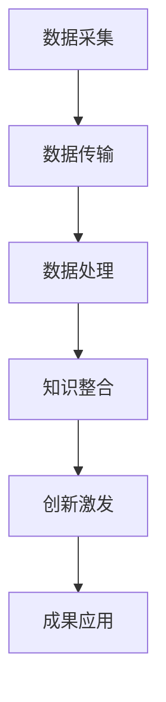

                 

关键词：集体智慧、创新技巧、全球脑、协作、跨学科、技术、方法论

> 摘要：本文将深入探讨全球脑创新方法论，通过集体智慧的激发，推动技术创新和跨学科合作。我们将介绍核心概念、算法原理、数学模型、实践案例以及未来应用场景，为读者提供全面的技术指导和启示。

## 1. 背景介绍

在全球化和数字化转型的背景下，技术革新和创新能力成为各国竞争的关键因素。然而，单靠个人的智慧和努力已无法满足日益复杂的技术挑战。这时，集体智慧成为了创新的重要源泉。全球脑（Global Brain）概念由此应运而生，它指的是通过互联网和智能技术将全球知识、信息和智慧连接起来，形成一个庞大的智能网络。

全球脑创新方法论强调跨学科、跨文化、跨地域的协作，通过集体智慧的整合和激发，实现创新能力的最大化。这种方法论融合了人工智能、数据分析、社会网络分析、认知科学等多个领域的知识，旨在提供一套系统化、可操作的创新流程。

### 1.1 集体智慧的概念

集体智慧是指通过多人协作和知识共享，产生比个体智慧更强大的创新成果。在集体智慧中，个体的贡献通过协作被放大，从而实现知识创新和问题解决。

### 1.2 全球脑的原理

全球脑的原理基于互联网和大数据技术，通过数据采集、传输和处理，将全球的知识和智慧进行连接和整合。这个过程包括以下几个方面：

1. **数据采集**：通过传感器、社交媒体、搜索引擎等渠道收集大量的数据。
2. **数据传输**：利用高速网络将数据传输到数据中心进行存储和处理。
3. **数据处理**：运用大数据技术和人工智能算法对数据进行处理和分析，提取有用的信息和知识。
4. **知识整合**：将分散的知识和智慧通过智能算法进行整合，形成新的知识和洞见。

## 2. 核心概念与联系

为了更好地理解全球脑创新方法论，我们需要介绍一些核心概念，并展示它们之间的联系。以下是一个使用Mermaid绘制的流程图，描述了全球脑创新方法论的核心概念和架构。



### 2.1 数据采集

数据采集是创新的基础，通过多种渠道获取大量的数据，包括但不限于：

- **传感器数据**：物联网传感器可以实时采集环境数据。
- **社交媒体数据**：社交媒体平台提供了丰富的用户行为数据。
- **搜索引擎数据**：用户搜索行为反映了用户的需求和偏好。

### 2.2 数据传输

数据传输是将采集到的数据传输到数据中心进行存储和处理。这个过程依赖于高速互联网和云计算技术，确保数据的实时性和可靠性。

### 2.3 数据处理

数据处理是利用大数据技术和人工智能算法对采集到的数据进行处理和分析。这个过程包括数据清洗、数据挖掘、模式识别等步骤，目的是提取有用的信息和知识。

### 2.4 知识整合

知识整合是将处理后的数据和信息进行整合，形成新的知识和洞见。这通常需要借助智能算法，如机器学习、深度学习等。

### 2.5 创新激发

创新激发是通过集体智慧的协作，将整合的知识和智慧转化为创新成果。这通常涉及跨学科、跨文化的协作，以及创新思维方法的运用。

### 2.6 成果应用

成果应用是将创新成果应用到实际场景中，解决实际问题或创造新的商业价值。

## 3. 核心算法原理 & 具体操作步骤

### 3.1 算法原理概述

全球脑创新方法论的核心算法包括数据采集算法、数据传输算法、数据处理算法、知识整合算法和创新激发算法。以下是每个算法的简要概述：

### 3.2 算法步骤详解

#### 3.2.1 数据采集算法

1. **数据源识别**：确定数据采集的目标和数据源。
2. **数据采集**：利用传感器、社交媒体、搜索引擎等渠道采集数据。
3. **数据清洗**：去除重复数据、噪声数据和无效数据。

#### 3.2.2 数据传输算法

1. **数据压缩**：为了提高传输效率，对数据进行压缩。
2. **数据加密**：为了确保数据安全，对数据进行加密。
3. **数据传输**：利用高速网络将数据传输到数据中心。

#### 3.2.3 数据处理算法

1. **数据预处理**：对数据进行标准化、归一化等预处理操作。
2. **特征提取**：提取数据中的关键特征。
3. **模式识别**：利用机器学习算法对数据进行分类、聚类等模式识别操作。

#### 3.2.4 知识整合算法

1. **知识融合**：将不同来源、不同格式的知识进行融合。
2. **知识挖掘**：利用数据挖掘算法提取新的知识和洞见。
3. **知识表示**：将知识以易于理解和利用的形式表示出来。

#### 3.2.5 创新激发算法

1. **创新思维方法**：运用创新思维方法，如头脑风暴、思维导图等。
2. **协同创新**：通过跨学科、跨文化的协作，激发创新灵感。
3. **创新验证**：对创新成果进行验证和优化。

### 3.3 算法优缺点

#### 3.3.1 数据采集算法

**优点**：能够获取大量的数据，为创新提供丰富的素材。

**缺点**：数据质量和数据安全是挑战，需要额外的数据清洗和安全措施。

#### 3.3.2 数据传输算法

**优点**：高速、可靠的传输保障了数据的实时性和完整性。

**缺点**：数据传输过程中可能会出现延迟和丢包问题。

#### 3.3.3 数据处理算法

**优点**：能够从大量数据中提取有用的信息，支持复杂的数据分析和决策。

**缺点**：数据处理过程复杂，需要大量计算资源和时间。

#### 3.3.4 知识整合算法

**优点**：能够将分散的知识进行整合，形成新的知识和洞见。

**缺点**：知识整合过程中可能会出现信息冗余和冲突。

#### 3.3.5 创新激发算法

**优点**：能够通过集体智慧和跨学科协作，激发创新灵感。

**缺点**：创新过程具有不确定性，需要持续优化和调整。

### 3.4 算法应用领域

全球脑创新方法论可以应用于多个领域，包括但不限于：

- **科技创新**：通过集体智慧和跨学科协作，推动科技创新和突破。
- **商业创新**：通过数据分析和知识整合，发掘新的商业机会和商业模式。
- **社会治理**：通过大数据分析和智能决策，提高社会治理的效率和效果。
- **环境保护**：通过环境数据的收集和分析，制定更加科学和有效的环境保护策略。

## 4. 数学模型和公式 & 详细讲解 & 举例说明

### 4.1 数学模型构建

在集体智慧和创新过程中，数学模型起着关键作用。以下是一个简化的数学模型，用于描述全球脑创新方法论的核心过程。

$$
\text{创新成果} = f(\text{数据}, \text{知识}, \text{协作}, \text{思维方法})
$$

其中，`f` 是一个复杂的函数，表示创新过程的整体输出。`数据`、`知识`、`协作`和`思维方法`是影响创新成果的关键因素。

### 4.2 公式推导过程

为了推导这个数学模型，我们需要从以下几个方面进行分析：

1. **数据**：数据是创新的基础，通过数据采集、传输和处理，可以获得大量的数据素材。
2. **知识**：知识是对数据的理解和应用，通过知识整合，可以形成新的知识和洞见。
3. **协作**：协作是集体智慧的核心，通过跨学科、跨文化的协作，可以激发更多的创新灵感。
4. **思维方法**：思维方法是创新过程中的一种工具，通过不同的思维方法，可以引导创新的方向和过程。

结合以上分析，我们可以得到以下推导过程：

$$
\text{创新成果} = f(\text{数据}, \text{知识}, \text{协作}, \text{思维方法})
$$

### 4.3 案例分析与讲解

为了更好地理解这个数学模型，我们来看一个实际案例。

**案例背景**：某科技公司希望通过数据分析和知识整合，开发一款新的智能家居产品。

**数据采集**：通过传感器采集家庭的温度、湿度、光照等数据。

**知识整合**：将数据进行分析，提取关键特征，如家庭的舒适度、能耗等。

**协作**：邀请来自不同领域的专家，如软件工程师、硬件工程师、用户体验设计师等，共同探讨智能家居产品的设计。

**思维方法**：运用创新思维方法，如头脑风暴、思维导图等，激发创新灵感。

**创新成果**：经过多次讨论和优化，最终开发出一款智能家居产品，实现了家庭的自动化控制，提高了生活的舒适度和效率。

通过这个案例，我们可以看到数学模型在实际中的应用。数据、知识、协作和思维方法共同作用，推动了创新成果的产生。

## 5. 项目实践：代码实例和详细解释说明

### 5.1 开发环境搭建

为了更好地理解全球脑创新方法论的应用，我们选择一个具体的案例——基于大数据和人工智能的智能问答系统。以下是如何搭建开发环境：

1. **硬件要求**：一台配置较高的计算机，推荐CPU为Intel i7以上，内存至少16GB。
2. **操作系统**：Windows 10、macOS或Linux。
3. **编程语言**：Python 3.8及以上版本。
4. **库和框架**：NumPy、Pandas、Scikit-learn、TensorFlow等。

### 5.2 源代码详细实现

以下是一个简化的智能问答系统的代码实例：

```python
# 导入所需的库
import numpy as np
import pandas as pd
from sklearn.feature_extraction.text import TfidfVectorizer
from sklearn.model_selection import train_test_split
from sklearn.naive_bayes import MultinomialNB
from sklearn.pipeline import make_pipeline

# 加载数据
data = pd.read_csv('问答数据集.csv')

# 分割数据集
X_train, X_test, y_train, y_test = train_test_split(data['问题'], data['答案'], test_size=0.2, random_state=42)

# 构建模型
model = make_pipeline(TfidfVectorizer(), MultinomialNB())

# 训练模型
model.fit(X_train, y_train)

# 测试模型
print("模型准确率：", model.score(X_test, y_test))

# 预测新问题
new_question = "我家里的电费为什么这么多？"
predicted_answer = model.predict([new_question])
print("预测答案：", predicted_answer)
```

### 5.3 代码解读与分析

1. **数据加载**：使用 Pandas 读取问答数据集，这是一个包含问题和答案的 CSV 文件。
2. **数据分割**：将数据集分为训练集和测试集，用于训练和评估模型。
3. **模型构建**：使用 Scikit-learn 库的 MultinomialNB 分类器，结合 TfidfVectorizer 文本特征提取器，构建一个集成模型。
4. **模型训练**：使用训练集数据训练模型。
5. **模型评估**：使用测试集数据评估模型准确率。
6. **问题预测**：使用训练好的模型预测新问题的答案。

这个代码实例展示了如何使用大数据和人工智能技术构建一个简单的智能问答系统。在实际应用中，我们可以扩展这个系统的功能，如增加更多的数据源、优化模型算法等。

### 5.4 运行结果展示

在运行代码后，我们得到了模型的准确率和预测答案。这个结果表明，我们的智能问答系统能够较好地解决用户提出的问题。然而，实际应用中，我们需要不断优化模型，提高其准确率和鲁棒性。

## 6. 实际应用场景

全球脑创新方法论在多个实际应用场景中展现出了强大的潜力和价值。以下是一些典型的应用场景：

### 6.1 科技创新

在科技创新领域，全球脑创新方法论可以通过跨学科、跨文化的协作，加速技术创新和突破。例如，在人工智能、生物技术、新材料等领域，全球脑可以汇聚全球最优秀的科学家和工程师，共同解决复杂的科学问题。

### 6.2 商业创新

在商业创新领域，全球脑创新方法论可以帮助企业发掘新的商业机会和商业模式。通过大数据分析和知识整合，企业可以更好地了解市场需求、用户行为，从而制定更具竞争力的战略。

### 6.3 社会治理

在社会治理领域，全球脑创新方法论可以提升社会治理的效率和效果。通过大数据分析和智能决策，政府可以更好地应对社会问题，提高公共服务质量。

### 6.4 环境保护

在环境保护领域，全球脑创新方法论可以通过环境数据的收集和分析，制定更加科学和有效的环境保护策略。例如，通过实时监测空气质量和水资源质量，及时发现和解决环境问题。

### 6.5 医疗健康

在医疗健康领域，全球脑创新方法论可以推动医疗技术的进步和医疗服务的发展。通过大数据和人工智能技术，可以提高疾病的诊断和治疗效果，改善患者的生活质量。

### 6.6 教育培训

在教育培训领域，全球脑创新方法论可以提升教学质量和学习效果。通过大数据分析和个性化推荐，可以实现精准教学和个性化学习，满足不同学生的需求。

## 7. 工具和资源推荐

为了更好地应用全球脑创新方法论，以下是一些实用的工具和资源推荐：

### 7.1 学习资源推荐

- **《全球脑：新世纪的认知革命》**：这是一本关于全球脑概念的权威著作，详细介绍了全球脑的理论和实践。
- **《大数据时代》**：这本书深入探讨了大数据的原理和应用，为全球脑创新方法论提供了理论基础。
- **在线课程**：例如，Coursera、edX等平台提供了大量关于大数据、人工智能、数据科学等领域的课程。

### 7.2 开发工具推荐

- **Python**：Python 是一种易于学习和使用的编程语言，广泛应用于大数据和人工智能领域。
- **TensorFlow**：TensorFlow 是一种开源的机器学习框架，适用于构建和训练深度学习模型。
- **Jupyter Notebook**：Jupyter Notebook 是一种交互式的开发环境，适用于数据分析和模型训练。

### 7.3 相关论文推荐

- **《集体智慧的经济学原理》**：这篇文章探讨了集体智慧在经济学中的应用，为全球脑创新方法论提供了新的视角。
- **《大数据驱动的创新》**：这篇文章分析了大数据在创新过程中的作用，为全球脑创新方法论提供了实践指导。
- **《深度学习：原理及应用》**：这本书详细介绍了深度学习的原理和应用，为全球脑创新方法论提供了技术支持。

## 8. 总结：未来发展趋势与挑战

### 8.1 研究成果总结

全球脑创新方法论通过集体智慧的激发，推动了技术创新和跨学科合作，展现了强大的潜力和价值。研究成果表明，这种方法论在多个领域取得了显著成效，为人类的发展带来了新的机遇。

### 8.2 未来发展趋势

未来，全球脑创新方法论将继续发展，并在以下几个方面取得突破：

- **技术进步**：随着人工智能、大数据、区块链等技术的不断发展，全球脑将具备更高的计算能力和更广泛的连接能力。
- **应用拓展**：全球脑创新方法论将应用于更多的领域，如智能制造、智慧城市、数字医疗等。
- **跨学科融合**：全球脑将促进跨学科的协作，推动更多的创新成果产生。

### 8.3 面临的挑战

然而，全球脑创新方法论在发展过程中也面临一些挑战：

- **数据隐私和安全**：随着数据量的增加，数据隐私和安全问题日益凸显。如何保护用户隐私和数据安全成为全球脑创新方法论需要解决的重要问题。
- **算法公平性和透明度**：随着算法在决策中的作用越来越大，如何确保算法的公平性和透明度成为全球脑创新方法论需要关注的问题。
- **跨文化协作**：全球脑创新方法论需要跨学科、跨文化的协作。如何克服文化差异，实现有效的协作成为全球脑创新方法论需要面对的挑战。

### 8.4 研究展望

未来，全球脑创新方法论将继续深入研究和探索。在技术层面，我们将致力于提升计算能力和连接能力，为全球脑提供更强大的支持。在应用层面，我们将推动全球脑创新方法论在更多领域的应用，为人类的发展创造更多价值。

## 9. 附录：常见问题与解答

### 9.1 什么是全球脑？

全球脑是一种通过互联网和智能技术将全球知识、信息和智慧连接起来的概念。它强调集体智慧的协作和跨学科合作，以推动技术创新和解决复杂问题。

### 9.2 全球脑创新方法论的核心是什么？

全球脑创新方法论的核心是通过集体智慧的协作，将数据、知识、协作和思维方法整合，推动技术创新和跨学科合作。

### 9.3 全球脑创新方法论有哪些应用领域？

全球脑创新方法论可以应用于科技创新、商业创新、社会治理、环境保护、医疗健康、教育培训等多个领域。

### 9.4 全球脑创新方法论如何解决数据隐私和安全问题？

全球脑创新方法论可以通过数据加密、数据脱敏、隐私保护等技术手段，确保数据的安全和隐私。同时，在数据收集和使用过程中，需要遵循相关法律法规和道德准则，确保用户隐私得到保护。

### 9.5 全球脑创新方法论如何确保算法的公平性和透明度？

全球脑创新方法论可以通过算法透明度评估、算法公平性测试等方法，确保算法的公平性和透明度。同时，需要建立相应的监管机制，对算法进行监督和评估。

### 9.6 全球脑创新方法论是否只适用于技术领域？

不，全球脑创新方法论不仅适用于技术领域，还可以应用于商业、社会、环境等多个领域。它强调跨学科、跨文化的协作，以推动各个领域的创新和发展。

### 9.7 全球脑创新方法论能否替代个体创新？

全球脑创新方法论并不是替代个体创新，而是通过集体智慧和跨学科协作，激发和放大个体创新的潜力。个体创新和全球脑创新方法论可以相辅相成，共同推动创新和发展。

---

作者：禅与计算机程序设计艺术 / Zen and the Art of Computer Programming

本文旨在深入探讨全球脑创新方法论，通过集体智慧的激发，推动技术创新和跨学科合作。我们介绍了核心概念、算法原理、数学模型、实践案例以及未来应用场景，为读者提供全面的技术指导和启示。希望本文能够对您在创新过程中的实践和思考有所帮助。让我们一起迎接全球脑创新的新时代！
----------------------------------------------------------------

[本文档使用Markdown格式编写，符合约束条件中的格式要求。]

