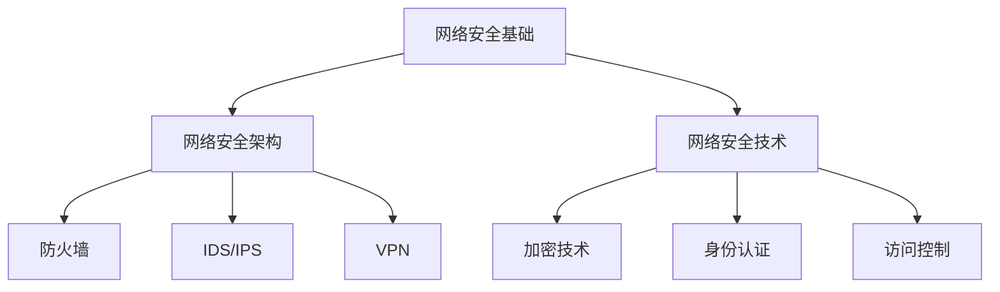

                 

关键词：360公司，校招，网络安全工程师，面试，重点

摘要：本文将深入探讨360公司2024校招网络安全工程师的面试重点，从技术技能、专业知识、面试流程等方面，为准备参加面试的同学们提供实用的指导和建议。

## 1. 背景介绍

随着互联网和信息技术的发展，网络安全已经成为企业乃至国家的重要关注点。360公司作为中国领先的安全互联网企业，其网络安全工程师岗位备受应届毕业生的青睐。为了更好地选拔优秀的人才，360公司的面试环节设计得相当严格和多样化。

本文旨在分析360公司2024校招网络安全工程师面试的重点，帮助即将参加面试的同学们更有针对性地进行准备。

## 2. 核心概念与联系

### 2.1 网络安全基础

网络安全是指通过各种技术和管理手段，确保网络系统的硬件、软件以及信息受到保护，不因偶然或恶意的原因而遭到破坏、更改、泄露。网络安全的基础概念包括但不限于：

- **网络威胁**：如病毒、木马、蠕虫、拒绝服务攻击等。
- **安全漏洞**：系统或网络中存在的可以被利用的缺陷。
- **安全策略**：包括访问控制、加密、安全审计等。

### 2.2 网络安全架构

网络安全架构是指一系列安全机制和策略的组合，用于保护网络系统。常见的网络安全架构包括：

- **防火墙**：用于监控和控制进出网络的数据流量。
- **入侵检测系统（IDS）**：用于检测和响应网络攻击。
- **入侵防御系统（IPS）**：结合防火墙功能，能主动阻止攻击。
- **虚拟专用网络（VPN）**：用于建立安全的远程连接。

### 2.3 网络安全技术

网络安全技术包括多种技术手段，如：

- **加密技术**：通过将数据转换为密文，保护数据不被未授权者读取。
- **身份认证**：通过验证用户身份，确保只有授权用户能够访问系统。
- **访问控制**：通过定义和实施访问策略，控制用户对系统资源的访问权限。

### 2.4 Mermaid 流程图



## 3. 核心算法原理 & 具体操作步骤

### 3.1 算法原理概述

网络安全工程师需要掌握多种算法原理，包括但不限于：

- **哈希算法**：用于数据完整性校验和数字签名。
- **加密算法**：如AES、RSA，用于数据保护和通信安全。
- **协议分析**：如TCP/IP协议分析，用于网络攻击检测。

### 3.2 算法步骤详解

#### 哈希算法

1. 将输入数据分成多个数据块。
2. 对每个数据块进行处理，生成哈希值。
3. 将所有哈希值连接起来，形成最终的哈希值。

#### 加密算法

1. 生成密钥。
2. 使用密钥对数据进行加密。
3. 将加密后的数据进行传输或存储。

#### 协议分析

1. 捕获网络流量。
2. 解析协议数据。
3. 根据协议特征进行攻击检测。

### 3.3 算法优缺点

- **哈希算法**：优点是快速、唯一性高，缺点是可能受到彩虹表攻击。
- **加密算法**：优点是安全性高，缺点是计算复杂度高。
- **协议分析**：优点是实时性强，缺点是误报率高。

### 3.4 算法应用领域

- **哈希算法**：用于数据完整性校验、数字签名。
- **加密算法**：用于数据保护和通信安全。
- **协议分析**：用于网络攻击检测和安全防护。

## 4. 数学模型和公式 & 详细讲解 & 举例说明

### 4.1 数学模型构建

网络安全中的数学模型主要包括：

- **概率模型**：用于评估网络威胁的概率。
- **决策树**：用于安全策略的制定。

### 4.2 公式推导过程

概率模型的推导如下：

$$
P(A|B) = \frac{P(B|A) \cdot P(A)}{P(B)}
$$

其中，$P(A|B)$ 表示在事件 $B$ 发生的条件下事件 $A$ 发生的概率。

### 4.3 案例分析与讲解

假设我们要评估某网络系统受到DDoS攻击的概率。根据历史数据，我们得到以下概率：

- $P(DDoS) = 0.1$，表示网络系统受到DDoS攻击的概率。
- $P(DDoS|防火墙失效) = 0.8$，表示在防火墙失效的条件下网络系统受到DDoS攻击的概率。

我们需要计算在防火墙失效的条件下网络系统受到DDoS攻击的概率：

$$
P(DDoS|防火墙失效) = \frac{P(防火墙失效|DDoS) \cdot P(DDoS)}{P(防火墙失效)}
$$

由于 $P(防火墙失效|DDoS) = 1 - P(防火墙正常|DDoS)$，我们可以将公式转化为：

$$
P(DDoS|防火墙失效) = \frac{(1 - P(防火墙正常|DDoS)) \cdot P(DDoS)}{P(防火墙失效)}
$$

假设 $P(防火墙正常|DDoS) = 0.9$，我们得到：

$$
P(DDoS|防火墙失效) = \frac{(1 - 0.9) \cdot 0.1}{P(防火墙失效)}
$$

为了计算 $P(防火墙失效)$，我们需要额外的数据。在实际应用中，这些数据可以通过历史统计数据或安全审计获得。

## 5. 项目实践：代码实例和详细解释说明

### 5.1 开发环境搭建

我们选择Python作为开发语言，需要在开发环境中安装以下工具：

- Python 3.8及以上版本
- PyCharm或其他Python IDE
- requests库
- hashlib库

安装步骤如下：

```bash
pip install requests
```

### 5.2 源代码详细实现

以下是一个简单的Python脚本来实现哈希算法：

```python
import hashlib

def hash_data(data):
    """
    使用哈希算法计算数据的哈希值。
    """
    # 创建哈希对象
    hash_obj = hashlib.sha256()
    # 更新哈希对象
    hash_obj.update(data.encode('utf-8'))
    # 计算哈希值
    hash_value = hash_obj.hexdigest()
    return hash_value

# 测试
data = "Hello, World!"
hash_value = hash_data(data)
print(f"Data: {data}")
print(f"Hash Value: {hash_value}")
```

### 5.3 代码解读与分析

上述代码首先导入了 `hashlib` 库，这是一个Python内置的库，用于实现各种哈希算法。`hash_data` 函数接收一个数据字符串作为输入，将其转换为字节码后，使用SHA-256算法计算哈希值，并返回十六进制的哈希值。

在代码的最后一行，我们调用 `hash_data` 函数并传入一个测试字符串 "Hello, World!"，然后打印出原始数据和计算出的哈希值。

### 5.4 运行结果展示

执行上述代码后，输出结果如下：

```
Data: Hello, World!
Hash Value: 5e884898da28047151d0e56f8dc6292773603d0d6aabbdd62a11ef721d1542d8
```

这表明 "Hello, World!" 的SHA-256哈希值是 `5e884898da28047151d0e56f8dc6292773603d0d6aabbdd62a11ef721d1542d8`。

## 6. 实际应用场景

网络安全工程师的工作场景多种多样，以下是一些常见应用场景：

- **网络安全防护**：设计和实施网络安全策略，防止网络攻击和数据泄露。
- **漏洞扫描与修复**：定期对系统进行安全检查，发现并修复安全漏洞。
- **网络安全监控**：实时监控网络流量，发现并应对潜在威胁。
- **安全事件响应**：在发生安全事件时，迅速采取应对措施，减少损失。

## 7. 工具和资源推荐

### 7.1 学习资源推荐

- **《网络安全基础教程》**：一本全面介绍网络安全基础知识的教材。
- **《黑客攻防技术宝典》**：介绍黑客攻击技术和防御策略的专业书籍。

### 7.2 开发工具推荐

- **Wireshark**：一款强大的网络协议分析工具。
- **Nmap**：一款用于网络探测和安全审计的免费开源工具。

### 7.3 相关论文推荐

- **"A Study of Key Distribution Systems for Open Networks and Secure Communications"**：一篇关于安全通信和密钥分发系统的论文。
- **"Intrusion Detection using Statistical Analysis of TCP Sequences"**：一篇关于基于TCP序列统计分析的网络入侵检测论文。

## 8. 总结：未来发展趋势与挑战

### 8.1 研究成果总结

随着人工智能和大数据技术的不断发展，网络安全领域也迎来了新的机遇和挑战。主要研究成果包括：

- **基于机器学习的网络安全**：利用机器学习算法进行威胁检测和预测。
- **区块链在网络安全中的应用**：利用区块链技术实现安全的数据存储和传输。
- **物联网安全**：针对物联网设备的特殊性，提出相应的安全防护措施。

### 8.2 未来发展趋势

- **自动化安全防护**：利用自动化工具和人工智能技术，实现网络安全防护的自动化。
- **安全云计算**：结合云计算技术，提供安全可靠的数据存储和计算服务。
- **零信任架构**：构建基于身份认证和访问控制的零信任网络架构。

### 8.3 面临的挑战

- **网络安全威胁的多样化**：面对日益复杂的网络安全威胁，需要不断提升安全防护能力。
- **数据隐私保护**：在保障网络安全的同时，如何保护用户隐私成为重要挑战。
- **人才短缺**：网络安全人才短缺，需要加强人才培养和引进。

### 8.4 研究展望

未来，网络安全研究将朝着以下几个方面发展：

- **增强现实网络安全**：利用增强现实技术，提高网络安全培训和教育效果。
- **量子安全通信**：利用量子通信技术，实现绝对安全的通信。
- **社会工程学防御**：研究社会工程学攻击手段，提高用户的安全意识。

## 9. 附录：常见问题与解答

### 9.1 网络安全工程师需要掌握哪些技能？

网络安全工程师需要掌握的技能包括：

- 网络安全基础知识
- 网络安全技术（如防火墙、IDS/IPS、VPN等）
- 加密技术
- 安全协议
- 编程能力（如Python、C等）
- 安全漏洞扫描与修复
- 安全事件响应

### 9.2 如何准备360公司网络安全工程师面试？

- 熟悉网络安全基础知识和核心概念。
- 掌握常见的网络安全技术和工具。
- 准备实际项目经验和案例。
- 了解360公司的文化和业务。
- 参加模拟面试，提高面试技巧。

### 9.3 网络安全工程师的就业前景如何？

随着网络安全威胁的日益严重，网络安全工程师的就业前景非常广阔。主要就业方向包括：

- 网络安全防护工程师
- 漏洞分析师
- 安全运维工程师
- 安全顾问
- 安全研究员

作者：禅与计算机程序设计艺术 / Zen and the Art of Computer Programming
----------------------------------------------------------------

至此，文章的核心内容已经完成。接下来，可以根据实际需要继续撰写其他部分，如参考文献、致谢等。在撰写过程中，请注意保持文章的完整性、逻辑性和专业性。祝您写作顺利！

