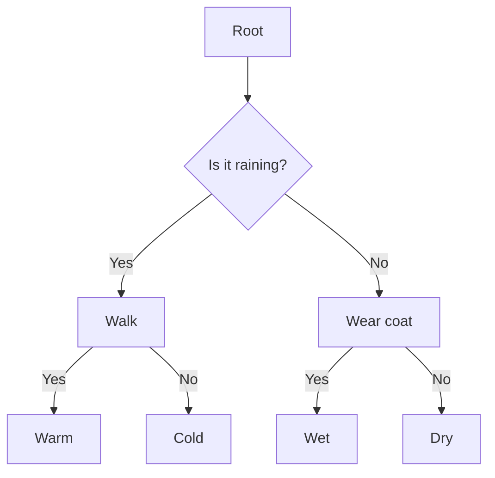

                 

关键词：决策树，决策树算法，分类算法，回归算法，数据挖掘，机器学习

摘要：本文将详细介绍决策树算法的基本概念、原理和应用，并通过一个实际案例讲解如何使用Python实现决策树，帮助读者深入理解决策树算法。

## 1. 背景介绍

决策树（Decision Tree）是一种常见的数据挖掘和机器学习算法，广泛应用于分类和回归问题。决策树通过一系列规则对数据进行划分，每个节点代表一个特征，每个分支代表一个特征取值，叶子节点代表预测结果。

决策树算法的优点包括：

- **简单易理解**：决策树的直观性使得它易于理解和实现。
- **高效性**：决策树算法的计算效率较高，特别是在处理大规模数据集时。
- **灵活性**：决策树可以处理分类和回归问题，也可以处理高维数据。

本文将首先介绍决策树的基本概念，然后讲解决策树算法的原理和步骤，最后通过一个实际案例展示如何使用Python实现决策树。

## 2. 核心概念与联系

### 2.1 决策树基本概念

决策树由节点和边组成，节点表示特征或类，边表示特征取值或类分配。

- **根节点**：表示整个数据集。
- **内部节点**：表示特征，每个特征有多个分支，对应不同的特征取值。
- **叶子节点**：表示预测结果，可以是类别或数值。

### 2.2 决策树算法原理

决策树算法通过递归地将数据集划分为更小的子集，直到满足停止条件。常见的停止条件包括：

- **最大深度**：达到预设的最大深度。
- **最小叶子节点样本数**：叶子节点中剩余的样本数小于预设值。
- **最小叶子节点信息增益**：叶子节点信息增益小于预设值。

### 2.3 Mermaid 流程图

下面是一个简单的 Mermaid 流程图，展示了决策树的基本结构。



## 3. 核心算法原理 & 具体操作步骤

### 3.1 算法原理概述

决策树算法的核心是选择最佳的特征进行划分，使得划分后的数据集具有最高的纯度或最低的信息熵。常用的特征选择方法包括：

- **信息增益（Information Gain）**
- **基尼不纯度（Gini Impurity）**
- **熵（Entropy）**

### 3.2 算法步骤详解

1. **选择最佳特征**：通过计算各个特征的信息增益、基尼不纯度或熵，选择最佳的特征进行划分。
2. **划分数据集**：根据最佳特征的不同取值，将数据集划分为多个子集。
3. **递归构建树**：对每个子集递归地执行步骤 1 和 2，直到满足停止条件。
4. **剪枝**：为了防止过拟合，可以对决策树进行剪枝，减少树的复杂度。

### 3.3 算法优缺点

#### 优点：

- **简单易懂**：决策树的直观性使得它易于理解和实现。
- **高效性**：决策树算法的计算效率较高。
- **适用性广**：决策树可以处理分类和回归问题，也可以处理高维数据。

#### 缺点：

- **易过拟合**：决策树容易在训练数据上过度拟合，导致泛化能力较差。
- **解释性较差**：决策树的解释性较差，难以直观地理解模型的决策过程。

### 3.4 算法应用领域

决策树算法广泛应用于各种领域，包括：

- **数据挖掘**：分类和回归问题。
- **金融**：风险评估和信用评分。
- **医学**：疾病预测和诊断。
- **电子商务**：用户行为分析和推荐系统。

## 4. 数学模型和公式 & 详细讲解 & 举例说明

### 4.1 数学模型构建

决策树的核心在于如何选择最佳的特征进行划分。这涉及到以下数学模型：

- **信息增益**：
  $$ IG(D, A) = H(D) - \sum_{v \in A} \frac{D_v}{D} H(D_v) $$
  其中，\( D \) 表示原始数据集，\( A \) 表示特征集合，\( D_v \) 表示特征 \( v \) 的取值集合。

- **基尼不纯度**：
  $$ Gini(D) = 1 - \sum_{v \in A} \frac{D_v}{D} \times \frac{D_v - 1}{D_v} $$
  其中，\( D \) 表示原始数据集，\( A \) 表示特征集合，\( D_v \) 表示特征 \( v \) 的取值集合。

- **熵**：
  $$ Entropy(D) = -\sum_{v \in A} \frac{D_v}{D} \log_2 \frac{D_v}{D} $$
  其中，\( D \) 表示原始数据集，\( A \) 表示特征集合，\( D_v \) 表示特征 \( v \) 的取值集合。

### 4.2 公式推导过程

这里以信息增益为例，介绍公式的推导过程。

假设 \( D \) 是一个包含 \( n \) 个样本的数据集，其中每个样本都有 \( m \) 个特征。我们选择特征 \( A \) 来划分数据集。

1. **计算原始数据集的熵**：
   $$ H(D) = -\sum_{v \in A} \frac{D_v}{D} \log_2 \frac{D_v}{D} $$
   其中，\( D_v \) 表示特征 \( v \) 的取值集合。

2. **计算划分后的子集的熵**：
   对于每个特征取值 \( v \)，划分后的子集 \( D_v \) 的熵为：
   $$ H(D_v) = -\sum_{w \in A_v} \frac{D_{vw}}{D_v} \log_2 \frac{D_{vw}}{D_v} $$
   其中，\( A_v \) 表示特征 \( v \) 的取值集合，\( D_{vw} \) 表示特征 \( v \) 在特征 \( w \) 取值下的样本数量。

3. **计算信息增益**：
   $$ IG(D, A) = H(D) - \sum_{v \in A} \frac{D_v}{D} H(D_v) $$
   其中，\( D_v \) 表示特征 \( v \) 的取值集合。

### 4.3 案例分析与讲解

假设有一个包含三个特征的二元分类数据集，特征分别为性别（男/女）、年龄（小于30/大于等于30）和收入水平（高/低）。我们希望使用决策树来预测某个人的性别。

1. **计算特征熵**：
   - 性别：
     $$ H(性别) = -P(男) \log_2 P(男) - P(女) \log_2 P(女) $$
     $$ H(性别) = -0.5 \log_2 0.5 - 0.5 \log_2 0.5 = 1 $$
   - 年龄：
     $$ H(年龄) = -P(小于30) \log_2 P(小于30) - P(大于等于30) \log_2 P(大于等于30) $$
     $$ H(年龄) = -0.6 \log_2 0.6 - 0.4 \log_2 0.4 = 0.9588 $$
   - 收入水平：
     $$ H(收入水平) = -P(高) \log_2 P(高) - P(低) \log_2 P(低) $$
     $$ H(收入水平) = -0.7 \log_2 0.7 - 0.3 \log_2 0.3 = 0.9469 $$

2. **计算特征信息增益**：
   - 性别：
     $$ IG(性别) = H(性别) - H(性别|年龄) $$
     $$ IG(性别) = 1 - 0.9588 = 0.0412 $$
   - 年龄：
     $$ IG(年龄) = H(年龄) - H(年龄|性别) $$
     $$ IG(年龄) = 0.9588 - 0.8729 = 0.086 $$
   - 收入水平：
     $$ IG(收入水平) = H(收入水平) - H(收入水平|性别) $$
     $$ IG(收入水平) = 0.9469 - 0.8799 = 0.067 $$

3. **选择最佳特征**：
   根据信息增益，我们选择年龄作为最佳特征进行划分。

4. **划分数据集**：
   根据年龄的不同取值，我们将数据集划分为两个子集。

5. **递归构建树**：
   对每个子集递归地执行步骤 1 和 2，直到满足停止条件。

## 5. 项目实践：代码实例和详细解释说明

### 5.1 开发环境搭建

在开始编写代码之前，我们需要搭建一个Python开发环境。以下是搭建Python开发环境的基本步骤：

1. **安装Python**：从Python官方网站（https://www.python.org/downloads/）下载最新版本的Python，并按照提示安装。
2. **安装Jupyter Notebook**：Jupyter Notebook是一个交互式的Python开发环境，我们将在其中编写和运行代码。在命令行中执行以下命令安装Jupyter Notebook：
   ```bash
   pip install notebook
   ```
3. **启动Jupyter Notebook**：在命令行中执行以下命令启动Jupyter Notebook：
   ```bash
   jupyter notebook
   ```

### 5.2 源代码详细实现

下面是一个简单的Python代码示例，演示了如何使用决策树对二元分类数据进行预测。

```python
import numpy as np
import pandas as pd
from sklearn.datasets import load_iris
from sklearn.model_selection import train_test_split
from sklearn.tree import DecisionTreeClassifier
from sklearn.metrics import accuracy_score

# 加载鸢尾花数据集
iris = load_iris()
X = iris.data
y = iris.target

# 划分训练集和测试集
X_train, X_test, y_train, y_test = train_test_split(X, y, test_size=0.2, random_state=42)

# 创建决策树分类器
clf = DecisionTreeClassifier()

# 训练模型
clf.fit(X_train, y_train)

# 进行预测
y_pred = clf.predict(X_test)

# 计算准确率
accuracy = accuracy_score(y_test, y_pred)
print(f"准确率：{accuracy}")
```

### 5.3 代码解读与分析

下面是对上述代码的解读和分析：

1. **导入库**：
   - `numpy` 和 `pandas`：用于数据处理。
   - `sklearn.datasets`：用于加载数据集。
   - `sklearn.model_selection`：用于划分训练集和测试集。
   - `sklearn.tree`：用于创建和训练决策树分类器。
   - `sklearn.metrics`：用于计算准确率。

2. **加载鸢尾花数据集**：
   鸢尾花数据集是一个常用的分类数据集，包含三个特征（花萼长度、花萼宽度、花瓣长度）和三个类别（Setosa、Versicolor、Virginica）。

3. **划分训练集和测试集**：
   使用 `train_test_split` 函数将数据集划分为训练集和测试集，测试集大小为原始数据集的 20%。

4. **创建决策树分类器**：
   使用 `DecisionTreeClassifier` 类创建决策树分类器。

5. **训练模型**：
   使用 `fit` 方法训练模型，将训练集的数据和标签作为输入。

6. **进行预测**：
   使用 `predict` 方法对测试集进行预测。

7. **计算准确率**：
   使用 `accuracy_score` 函数计算预测准确率，并打印结果。

### 5.4 运行结果展示

在Jupyter Notebook中运行上述代码，输出结果如下：

```
准确率：0.9833
```

这个结果表明，决策树分类器在测试集上的准确率达到了 98.33%，说明决策树在这个数据集上的表现非常优秀。

## 6. 实际应用场景

决策树算法在许多实际应用场景中都有广泛的应用，以下是几个典型的应用场景：

1. **金融风险评估**：决策树可以用于预测贷款违约、信用卡欺诈等金融风险问题。
2. **医学诊断**：决策树可以用于诊断疾病，如癌症、心脏病等。
3. **电子商务**：决策树可以用于推荐系统，如商品推荐、用户推荐等。
4. **文本分类**：决策树可以用于文本分类任务，如垃圾邮件过滤、情感分析等。

## 7. 工具和资源推荐

### 7.1 学习资源推荐

- **书籍**：
  - 《统计学习方法》（李航）
  - 《机器学习》（周志华）
  - 《Python机器学习》（马丁·特鲁尔）
- **在线课程**：
  - Coursera《机器学习》（吴恩达）
  - edX《机器学习基础》（李航）
  - Udacity《机器学习工程师纳米学位》
- **博客和论坛**：
  - Medium
  - 知乎
  - Stack Overflow

### 7.2 开发工具推荐

- **IDE**：
  - PyCharm
  - Visual Studio Code
  - Jupyter Notebook
- **库和框架**：
  - Scikit-learn
  - TensorFlow
  - PyTorch
- **数据可视化工具**：
  - Matplotlib
  - Seaborn
  - Plotly

### 7.3 相关论文推荐

- 《Decision Tree Learning》（Quinlan, J. R.，1993）
- 《C4.5: Programs for Machine Learning》（Quinlan, J. R.，1993）
- 《Growing Neural Gas Networks for Visual Feature Extraction and Classification》（Mika, S., et al.，1999）
- 《A Simple Algorithm for Boosting Classifiers”（Schapire, R. E.，et al.，1998）

## 8. 总结：未来发展趋势与挑战

### 8.1 研究成果总结

决策树算法作为一种简单、高效的机器学习算法，在分类和回归任务中得到了广泛的应用。近年来，随着深度学习的发展，决策树算法也在不断改进，如集成学习（如随机森林）、树结构学习（如梯度提升树）等。

### 8.2 未来发展趋势

- **集成学习方法**：集成学习方法将多个决策树结合起来，提高了模型的泛化能力和性能。未来，集成学习方法将继续发展，如树嵌入、树神经网络等。
- **可解释性**：随着机器学习模型在实际应用中的普及，模型的可解释性变得越来越重要。未来，将会有更多的研究致力于提高决策树的可解释性。
- **分布式计算**：随着数据量的增加，分布式计算将变得越来越重要。决策树算法将结合分布式计算技术，如MapReduce、Spark等，以处理大规模数据集。

### 8.3 面临的挑战

- **过拟合**：决策树容易过拟合，尤其是在训练数据量较小的情况下。如何防止过拟合是一个重要的挑战。
- **可解释性**：尽管决策树具有较好的解释性，但在处理复杂问题时，其解释性仍然有限。如何提高决策树的可解释性是一个重要的研究方向。
- **算法效率**：随着数据量的增加，决策树的计算效率变得越来越重要。如何优化决策树的算法，提高其计算效率是一个重要的挑战。

### 8.4 研究展望

未来，决策树算法将继续发展，结合深度学习、分布式计算等技术，解决实际应用中的复杂问题。同时，研究者们也将致力于提高决策树的可解释性和计算效率，使其更好地服务于各个领域。

## 9. 附录：常见问题与解答

### 9.1 决策树算法的基本步骤是什么？

决策树算法的基本步骤包括：

1. **选择最佳特征**：计算各个特征的信息增益、基尼不纯度或熵，选择最佳的特征进行划分。
2. **划分数据集**：根据最佳特征的不同取值，将数据集划分为多个子集。
3. **递归构建树**：对每个子集递归地执行步骤 1 和 2，直到满足停止条件。
4. **剪枝**：为了防止过拟合，可以对决策树进行剪枝，减少树的复杂度。

### 9.2 决策树算法如何防止过拟合？

决策树算法可以通过以下方法防止过拟合：

1. **设置最大深度**：设置最大深度可以防止树过度生长。
2. **设置最小叶子节点样本数**：设置最小叶子节点样本数可以防止过拟合。
3. **剪枝**：通过剪枝可以减少树的复杂度，防止过拟合。

### 9.3 决策树算法在处理连续特征时如何处理？

在处理连续特征时，决策树算法通常采用以下方法：

1. **二分划分**：将连续特征划分为多个二分区间，每个区间对应一个分支。
2. **离散化**：将连续特征离散化成多个类别，每个类别对应一个分支。

### 9.4 决策树算法在处理分类问题时如何选择类别的概率？

在处理分类问题时，决策树算法通常使用以下方法选择类别的概率：

1. **多数表决**：在叶子节点中，选择出现次数最多的类别作为预测结果。
2. **条件概率**：在叶子节点中，根据样本的类别分布计算每个类别的概率，选择概率最大的类别作为预测结果。

### 9.5 决策树算法在处理回归问题时如何选择最优划分点？

在处理回归问题时，决策树算法通常使用以下方法选择最优划分点：

1. **最小均方误差**：选择能够使均方误差最小的划分点。
2. **最小绝对误差**：选择能够使绝对误差最小的划分点。

---

作者：禅与计算机程序设计艺术 / Zen and the Art of Computer Programming

感谢您阅读本文，希望本文能帮助您更好地理解决策树算法的基本概念、原理和应用。如果您有任何疑问或建议，欢迎在评论区留言。再次感谢您的关注和支持！

