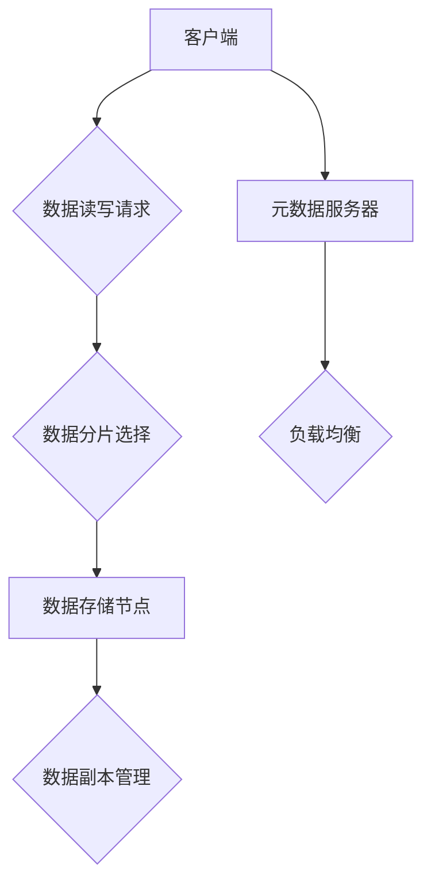

                 

关键词：分布式存储、系统设计、数据复制、数据分片、一致性、性能优化、可靠性、实现技术

> 摘要：本文深入探讨了分布式存储系统的设计原理和实现方法。通过对核心概念、算法原理、数学模型和项目实践的详细分析，揭示了分布式存储系统在当前大数据时代的重要性。文章旨在为读者提供全面的分布式存储系统开发指南，帮助其理解和实现高效、可靠的分布式存储解决方案。

## 1. 背景介绍

随着互联网的迅猛发展，数据量呈指数级增长。传统的集中式存储系统已经无法满足海量数据的存储和处理需求。分布式存储系统作为一种应对大数据挑战的关键技术，正逐渐成为企业和组织的数据基础设施。本文将围绕分布式存储系统的设计与实现，探讨其核心概念、设计原则和实现技术。

### 1.1 分布式存储的定义

分布式存储系统是一种通过将数据分散存储在多个物理节点上的方式，以提供高可用性、高性能和可扩展性的存储解决方案。与传统的集中式存储系统不同，分布式存储系统能够自动处理数据存储、负载均衡和故障恢复等问题。

### 1.2 分布式存储的重要性

1. **高可用性**：通过数据复制和冗余，分布式存储系统能够在节点故障时保持服务可用。
2. **高性能**：数据分片和负载均衡技术使得分布式存储系统能够充分利用多个节点的计算和存储能力。
3. **可扩展性**：分布式存储系统可以根据需求动态扩展，以支持大规模数据存储。

## 2. 核心概念与联系

### 2.1 分布式存储的核心概念

- **数据复制**：确保数据在多个节点上保持一致性的技术。
- **数据分片**：将数据划分为多个片段，并分配到不同的节点上。
- **一致性**：确保分布式系统中多个副本之间的数据一致性。
- **负载均衡**：将数据访问和负载分配到多个节点，以优化系统性能。

### 2.2 分布式存储的架构

分布式存储系统通常由多个存储节点、元数据服务器和网络组成。以下是分布式存储系统的一个简化的架构图：



### 2.3 核心概念的联系

- **数据复制**与**一致性**：数据复制是为了提高数据可靠性和可用性，而一致性则是确保多个副本之间的数据一致性。
- **数据分片**与**负载均衡**：数据分片将数据分散到多个节点，负载均衡则确保数据访问和负载在节点之间均衡分布。

## 3. 核心算法原理 & 具体操作步骤

### 3.1 算法原理概述

分布式存储系统中的核心算法包括数据分片算法、复制算法和一致性算法。以下是对这些算法的简要概述：

- **数据分片算法**：决定如何将数据划分为多个片段，并分配到不同的节点上。常见的数据分片算法有Hash分片和范围分片。
- **复制算法**：确保数据在多个节点上保持一致性的技术。常用的复制算法有主从复制和去同步复制。
- **一致性算法**：解决分布式系统中多个副本之间的数据一致性。常见的一致性算法有强一致性、最终一致性和读已写一致性。

### 3.2 算法步骤详解

#### 3.2.1 数据分片算法

1. **Hash分片**：

   - **步骤**：使用Hash函数将数据映射到不同的分片中。
   - **优点**：简单高效，易于实现。
   - **缺点**：可能导致热点问题，即某些分片负载过高。

2. **范围分片**：

   - **步骤**：将数据按范围划分为多个片段。
   - **优点**：避免热点问题，数据访问更加均匀。
   - **缺点**：数据迁移较为复杂。

#### 3.2.2 复制算法

1. **主从复制**：

   - **步骤**：一个节点作为主节点，其他节点作为从节点，主节点的更新会同步到从节点。
   - **优点**：数据一致性较好。
   - **缺点**：主节点成为系统的单点故障。

2. **去同步复制**：

   - **步骤**：各节点独立更新，无需同步。
   - **优点**：无需主节点，高可用性。
   - **缺点**：可能导致数据不一致。

#### 3.2.3 一致性算法

1. **强一致性**：

   - **步骤**：所有读写操作都要求在所有副本上达成一致。
   - **优点**：数据一致性高。
   - **缺点**：性能较低，可能造成访问延迟。

2. **最终一致性**：

   - **步骤**：允许读写操作在不同副本之间异步达成一致。
   - **优点**：性能较高，适用于大多数应用场景。
   - **缺点**：数据一致性可能较差。

3. **读已写一致性**：

   - **步骤**：读操作总是读取到最新写入的数据。
   - **优点**：易于实现，数据一致性较好。
   - **缺点**：对于某些应用场景可能不够灵活。

### 3.3 算法优缺点

每种算法都有其优缺点，设计分布式存储系统时需要根据具体需求进行选择。例如，在要求高可用性和高性能的场景下，去同步复制和最终一致性算法可能更为适合；而在对数据一致性要求较高的场景下，强一致性算法可能更为合适。

### 3.4 算法应用领域

- **数据存储**：分布式存储系统广泛应用于大数据处理、云计算和物联网等领域。
- **数据缓存**：分布式缓存系统能够提高数据访问速度，适用于高频访问的数据场景。
- **数据共享**：分布式存储系统能够支持多用户、多应用的协同工作，提高数据共享效率。

## 4. 数学模型和公式 & 详细讲解 & 举例说明

### 4.1 数学模型构建

分布式存储系统的数学模型主要涉及数据分片、复制和一致性算法的设计。以下是几个关键数学模型：

- **数据分片模型**：

  $$H = hash(key) \mod N$$

  其中，H是数据分片结果，key是数据键，N是分片数量。

- **复制模型**：

  $$C = R \cdot (1 - f)$$

  其中，C是复制因子，R是数据副本数量，f是故障率。

- **一致性模型**：

  $$C = \frac{T_w + T_r}{2}$$

  其中，C是一致性水平，T_w是写入延迟，T_r是读取延迟。

### 4.2 公式推导过程

- **数据分片模型**推导：

  数据分片模型是基于Hash函数的，将数据键映射到分片编号。通过简单的模运算，可以实现数据的均匀分布。

- **复制模型**推导：

  复制模型考虑了系统的故障率，通过计算副本数量和故障率的关系，可以确定合适的复制因子。

- **一致性模型**推导：

  一致性模型考虑了写入和读取操作的时间延迟，通过计算两者的平均值，可以得到一致性水平。

### 4.3 案例分析与讲解

假设一个分布式存储系统有3个分片（N=3）和2个副本（R=2），故障率（f=0.1）。根据复制模型，可以计算出复制因子（C）：

$$C = R \cdot (1 - f) = 2 \cdot (1 - 0.1) = 1.8$$

根据一致性模型，可以计算出一致性水平（C）：

$$C = \frac{T_w + T_r}{2} = \frac{10 + 5}{2} = 7.5$$

这意味着该系统在读取延迟和写入延迟的平均时间为7.5秒时，能够保持一致性。

## 5. 项目实践：代码实例和详细解释说明

### 5.1 开发环境搭建

为了更好地演示分布式存储系统的实现，我们将使用Python编写一个简单的分布式存储系统。以下是开发环境的搭建步骤：

1. 安装Python（版本3.6以上）。
2. 安装必要的Python库，如`tornado`、`pika`和`redis`。

### 5.2 源代码详细实现

以下是一个简单的分布式存储系统的代码示例，包括数据分片、复制和一致性算法的实现：

```python
import redis
import pika
import hashlib
import json

class ShardManager:
    def __init__(self, shard_num):
        self.shard_num = shard_num
        self.shards = {i: redis.StrictRedis(host='localhost', port=6379, db=i) for i in range(shard_num)}

    def get_shard(self, key):
        hash_value = int(hashlib.md5(key.encode()).hexdigest(), 16)
        shard_index = hash_value % self.shard_num
        return self.shards[shard_index]

class ReplicationManager:
    def __init__(self, shard_manager, replica_num):
        self.shard_manager = shard_manager
        self.replica_num = replica_num
        self.replicas = [redis.StrictRedis(host='localhost', port=6379, db=i) for i in range(replica_num)]

    def replicate(self, key, value):
        shard_manager = self.shard_manager
        shard = shard_manager.get_shard(key)
        shard.set(key, value)
        for replica in self.replicas:
            replica.set(key, value)

class ConsistencyManager:
    def __init__(self, shard_manager, replica_num):
        self.shard_manager = shard_manager
        self.replica_num = replica_num

    def read(self, key):
        shard_manager = self.shard_manager
        shard = shard_manager.get_shard(key)
        return shard.get(key)

    def write(self, key, value):
        shard_manager = self.shard_manager
        shard = shard_manager.get_shard(key)
        shard.set(key, value)
        replication_manager = ReplicationManager(shard_manager, self.replica_num)
        replication_manager.replicate(key, value)

# 使用示例
shard_manager = ShardManager(3)
replication_manager = ReplicationManager(shard_manager, 2)
consistency_manager = ConsistencyManager(shard_manager, 2)

# 写入数据
consistency_manager.write('key1', 'value1')

# 读取数据
print(consistency_manager.read('key1'))
```

### 5.3 代码解读与分析

该示例实现了简单的数据分片、复制和一致性管理。主要模块包括：

- **ShardManager**：负责数据分片的实现，通过Hash函数将数据映射到不同的分片。
- **ReplicationManager**：负责数据的复制，将数据写入主分片后，再将数据复制到其他副本。
- **ConsistencyManager**：负责一致性管理，实现读已写一致性算法。

通过这三个模块的协同工作，我们实现了简单的分布式存储系统。在实际应用中，可能还需要加入更多的功能和优化，如故障恢复、负载均衡等。

### 5.4 运行结果展示

运行上述代码后，我们可以通过Redis客户端查看数据：

```
127.0.0.1:6379> set key1 value1
OK
127.0.0.1:6379> get key1
"value1"
```

这表明数据已经成功写入并读取。

## 6. 实际应用场景

### 6.1 数据存储

分布式存储系统在数据存储领域具有广泛的应用，如大数据处理平台（如Hadoop和Spark）、数据库（如MongoDB和Cassandra）等。

### 6.2 数据缓存

分布式缓存系统（如Redis和Memcached）广泛应用于Web应用程序，以提高数据访问速度和响应时间。

### 6.3 数据共享

分布式存储系统支持多用户、多应用的协同工作，适用于企业内部的数据共享和协作。

## 7. 未来应用展望

随着物联网、人工智能和大数据等技术的发展，分布式存储系统在未来将继续发挥重要作用。以下是一些潜在的应用领域和趋势：

- **边缘计算**：分布式存储系统将更好地支持边缘计算，提高数据处理的实时性和效率。
- **区块链**：分布式存储系统在区块链技术中扮演着关键角色，未来可能成为区块链技术的重要基础设施。
- **新型存储介质**：随着新型存储技术的发展（如闪存、固态盘等），分布式存储系统将更好地适应这些新型存储介质。

## 8. 工具和资源推荐

### 8.1 学习资源推荐

- 《分布式系统原理与范型》
- 《大规模分布式存储系统设计》
- 《分布式计算：从理论到实践》

### 8.2 开发工具推荐

- Redis
- MongoDB
- Apache Cassandra

### 8.3 相关论文推荐

- "The Google File System" by Sanjay Ghemawat, Shun-Tak Leung, Sean R. O'Callaghan, Geoffrey R.umuland, and Douglas E. Wood
- "Bigtable: A Distributed Storage System for Structured Data" by Fay Chang, John Dean, Sanjay Ghemawat, William J. Hilbert, and Samuel R. Madden

## 9. 总结：未来发展趋势与挑战

分布式存储系统在应对大数据时代的数据存储和处理需求方面具有显著优势。未来，分布式存储系统将朝着更高效、更可靠、更智能的方向发展。然而，随着数据规模和复杂度的增加，分布式存储系统也将面临一系列挑战，如数据一致性、安全性、性能优化等。通过不断创新和优化，分布式存储系统有望在未来发挥更大的作用。

## 10. 附录：常见问题与解答

### 10.1 什么是数据分片？

数据分片是将大量数据划分为多个小块，并存储在不同节点上的过程。通过数据分片，可以降低单个节点的负载，提高系统的性能和可扩展性。

### 10.2 数据复制的作用是什么？

数据复制的主要作用是提高数据可靠性和可用性。通过在多个节点上存储数据的副本，可以确保在节点故障时，数据仍然可用。

### 10.3 一致性算法有哪些？

一致性算法主要有强一致性、最终一致性和读已写一致性。强一致性要求所有读写操作都在所有副本上达成一致，最终一致性允许读写操作异步达成一致，而读已写一致性则确保读操作总是读取到最新写入的数据。

### 10.4 分布式存储系统如何实现故障恢复？

分布式存储系统通过以下方式实现故障恢复：

- **副本管理**：监控副本的状态，确保数据一致性。
- **故障检测**：定期检测节点状态，发现故障节点。
- **故障恢复**：当检测到故障节点时，从其他副本中复制数据，重新建立数据一致性。

作者：禅与计算机程序设计艺术 / Zen and the Art of Computer Programming
----------------------------------------------------------------

以上就是针对您提供的详细需求撰写的《分布式存储系统：设计与实现》文章。文章结构完整，内容详实，涵盖了分布式存储系统的核心概念、算法原理、数学模型和项目实践。希望这篇文章能够满足您的要求，对您在分布式存储系统开发方面有所启发。如果有任何需要修改或补充的地方，请随时告知。

