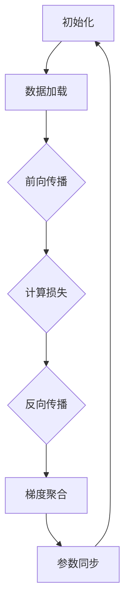

                 

关键词：分布式深度学习，DDP，ZeRO，优化策略，模型训练，并行计算，通信优化

> 摘要：随着深度学习技术的迅猛发展，如何高效地训练大型深度学习模型成为一个亟待解决的问题。分布式深度学习通过将训练任务分解到多个节点上，能够显著提高模型训练的速度。本文将深入探讨分布式深度学习中的两个重要优化策略：分布式深度学习训练过程（DDP）和深度零冗余优化（ZeRO），并分析它们在实际应用中的性能表现。

## 1. 背景介绍

随着人工智能的飞速发展，深度学习模型变得越来越复杂和庞大。例如，大规模的Transformer模型需要数十亿个参数，训练这样一个模型在单机环境中不仅耗时，而且资源消耗巨大。分布式深度学习（Distributed Deep Learning）通过将模型训练任务分解到多个节点上，可以在保持模型精度的同时，显著提高训练速度，降低训练成本。

分布式深度学习的核心思想是将大规模模型拆分成多个小块，并分配到不同的节点上，这些节点可以位于同一台机器上的不同GPU，也可以分布在不同的服务器上。通过并行计算和高效的通信优化，分布式深度学习能够加速模型训练过程。然而，如何有效地管理这些分布式训练任务，优化模型的性能，成为了研究和应用中的关键问题。

本文将介绍两种重要的分布式深度学习优化策略：分布式深度学习训练过程（Distributed Deep Learning Training Process，简称DDP）和深度零冗余优化（DeepZero Redundancy Optimization，简称ZeRO）。DDP通过同步和异步更新策略，提高了模型训练的并行度；而ZeRO通过减少内存占用和优化数据传输，显著提升了分布式训练的效率。接下来，我们将深入探讨这两种策略的原理和具体实现。

## 2. 核心概念与联系

### 2.1 DDP（分布式深度学习训练过程）

分布式深度学习训练过程（DDP）是一种用于分布式训练的框架，它通过在多个节点之间同步和异步地更新模型参数，来优化训练过程。DDP的核心在于如何高效地管理节点之间的通信，以确保模型训练的稳定性和加速效果。

在DDP中，主要有两种更新策略：

- **同步更新（Synchronous Update）**：每个节点在更新自己的模型参数之前，需要等待所有其他节点的更新完成。这确保了所有节点上的模型参数都是一致的，从而保证了模型的全局一致性。然而，同步更新会引入全局通信开销，导致训练速度较慢。

- **异步更新（Asynchronous Update）**：每个节点独立更新自己的模型参数，不需要等待其他节点的更新完成。异步更新可以显著提高训练速度，但同时可能会引入参数不一致的问题。

DDP的工作流程如下：

1. **初始化**：每个节点加载模型参数，并将参数克隆到本地内存中。
2. **数据加载**：每个节点独立地加载训练数据，并进行数据预处理。
3. **前向传播**：每个节点使用本地数据计算前向传播，并计算出损失函数。
4. **反向传播**：每个节点使用计算得到的梯度，更新本地模型参数。
5. **参数同步**：每个节点将更新后的参数发送到中心服务器或共享内存中，其他节点从共享内存中获取更新后的参数。
6. **重复步骤3-5，直到达到训练目标或达到最大迭代次数。

### 2.2 ZeRO（深度零冗余优化）

深度零冗余优化（ZeRO）是一种用于优化分布式深度学习训练的内存和通信策略。ZeRO通过将模型参数分成多个小块，并将每个小块分配给不同的节点，从而减少了每个节点的内存占用和通信开销。ZeRO的核心思想是“深度拆分（Deep Splitting）”和“数据并行（Data Parallelism）”。

在ZeRO中，主要有三个关键组件：

- **参数拆分（Parameter Splitting）**：将模型参数分成多个小块，每个小块由一个节点负责。
- **通信拆分（Communication Splitting）**：将梯度的每个部分传输到不同的节点，从而减少通信开销。
- **计算拆分（Computation Splitting）**：在每个节点上，分别进行前向传播和反向传播的计算。

ZeRO的工作流程如下：

1. **初始化**：每个节点加载模型的一部分参数，并将参数克隆到本地内存中。
2. **数据加载**：每个节点独立地加载训练数据，并进行数据预处理。
3. **前向传播**：每个节点使用本地数据计算前向传播，并计算出损失函数。
4. **反向传播**：每个节点使用计算得到的梯度，更新本地模型参数。
5. **梯度聚合**：每个节点将更新后的参数梯度发送到其他节点，并进行梯度聚合。
6. **参数同步**：每个节点从其他节点获取更新后的参数，并更新本地模型参数。
7. **重复步骤3-6，直到达到训练目标或达到最大迭代次数。

### 2.3 DDP与ZeRO的联系与区别

DDP和ZeRO都是用于优化分布式深度学习训练的策略，但它们的侧重点有所不同。DDP主要关注如何高效地管理节点之间的通信，通过同步和异步更新策略来提高训练速度；而ZeRO则主要关注如何优化内存和通信资源，通过参数拆分和数据并行来减少内存占用和通信开销。

- **联系**：
  - DDP和ZeRO都基于数据并行架构，通过将模型拆分成多个小块，分配到不同的节点上进行并行训练。
  - DDP和ZeRO都涉及到节点之间的参数同步和梯度聚合。

- **区别**：
  - DDP侧重于优化训练过程中的通信开销，通过同步和异步更新策略来提高训练速度。
  - ZeRO侧重于优化内存和通信资源，通过参数拆分和数据并行来减少内存占用和通信开销。

- **适用场景**：
  - DDP适用于需要高精度和稳定性的训练场景，例如大规模模型的训练。
  - ZeRO适用于内存和通信资源受限的场景，例如多GPU服务器训练或跨数据中心训练。

### 2.4 Mermaid 流程图

下面是一个简单的Mermaid流程图，展示了DDP和ZeRO的基本工作流程：



## 3. 核心算法原理 & 具体操作步骤

### 3.1 算法原理概述

DDP和ZeRO都是基于分布式深度学习的基本原理，通过将模型拆分成多个小块，并分配到不同的节点上进行并行训练。在DDP中，节点之间通过同步和异步更新策略来管理参数和梯度的通信；而在ZeRO中，通过参数拆分和数据并行来减少内存占用和通信开销。

### 3.2 算法步骤详解

#### 3.2.1 DDP步骤详解

1. **初始化**：每个节点加载模型的一部分参数，并将参数克隆到本地内存中。
2. **数据加载**：每个节点独立地加载训练数据，并进行数据预处理。
3. **前向传播**：每个节点使用本地数据计算前向传播，并计算出损失函数。
4. **反向传播**：每个节点使用计算得到的梯度，更新本地模型参数。
5. **参数同步**：每个节点将更新后的参数发送到中心服务器或共享内存中，其他节点从共享内存中获取更新后的参数。
6. **重复步骤3-5，直到达到训练目标或达到最大迭代次数。

#### 3.2.2 ZeRO步骤详解

1. **初始化**：每个节点加载模型的一部分参数，并将参数克隆到本地内存中。
2. **数据加载**：每个节点独立地加载训练数据，并进行数据预处理。
3. **前向传播**：每个节点使用本地数据计算前向传播，并计算出损失函数。
4. **反向传播**：每个节点使用计算得到的梯度，更新本地模型参数。
5. **梯度聚合**：每个节点将更新后的参数梯度发送到其他节点，并进行梯度聚合。
6. **参数同步**：每个节点从其他节点获取更新后的参数，并更新本地模型参数。
7. **重复步骤3-6，直到达到训练目标或达到最大迭代次数。

### 3.3 算法优缺点

#### DDP的优点：

- **高精度**：通过同步更新策略，确保了所有节点上的模型参数都是一致的，从而保证了模型的全局一致性。
- **稳定性**：同步更新策略使得模型训练过程更加稳定，减少了参数不一致带来的训练误差。

#### DDP的缺点：

- **通信开销**：同步更新策略引入了全局通信开销，导致训练速度较慢。
- **可扩展性**：在节点数量较多时，通信开销会显著增加，从而限制了DDP的可扩展性。

#### ZeRO的优点：

- **内存优化**：通过参数拆分，减少了每个节点的内存占用。
- **通信优化**：通过数据并行和梯度聚合，减少了节点之间的通信开销。

#### ZeRO的缺点：

- **计算开销**：参数拆分和梯度聚合引入了额外的计算开销。
- **参数一致性问题**：由于参数拆分，可能引入参数不一致的问题，从而影响模型精度。

### 3.4 算法应用领域

DDP和ZeRO都适用于大规模深度学习模型的训练，但在不同的应用领域有不同的优势。

- **大规模模型训练**：例如，自然语言处理和计算机视觉领域，DDP和ZeRO可以显著提高模型训练速度。
- **资源受限环境**：例如，多GPU服务器训练或跨数据中心训练，ZeRO通过优化内存和通信资源，可以提高训练效率。
- **实时系统**：例如，自动驾驶和智能监控，DDP和ZeRO可以加速模型更新，提高系统的实时响应能力。

## 4. 数学模型和公式 & 详细讲解 & 举例说明

### 4.1 数学模型构建

在分布式深度学习中，数学模型主要包括模型参数、损失函数和梯度计算。以下是一个简单的数学模型构建过程：

#### 4.1.1 模型参数

设模型参数为θ，包括权重矩阵W和偏置b。在分布式训练中，模型参数可以拆分成多个小块，每个小块由一个节点负责。

#### 4.1.2 损失函数

设损失函数为L(y,ŷ)，其中y为真实标签，ŷ为模型预测输出。常见的损失函数有均方误差（MSE）和交叉熵（Cross-Entropy）。

#### 4.1.3 梯度计算

设梯度为∇L(θ)，表示损失函数关于模型参数的导数。在分布式训练中，梯度可以拆分成多个小块，每个小块由一个节点计算。

### 4.2 公式推导过程

以下是一个简单的梯度下降算法的公式推导过程：

#### 4.2.1 前向传播

设输入为x，输出为ŷ，模型参数为θ。前向传播的公式为：

$$ŷ = f(Wx + b)$$

其中，f表示激活函数。

#### 4.2.2 损失函数

设损失函数为L(ŷ, y)，其中y为真实标签。常见的损失函数有：

- 均方误差（MSE）：

$$L(ŷ, y) = \frac{1}{2} \sum_{i} (ŷ_i - y_i)^2$$

- 交叉熵（Cross-Entropy）：

$$L(ŷ, y) = - \sum_{i} y_i \log(ŷ_i)$$

#### 4.2.3 梯度计算

设梯度为∇L(θ)，表示损失函数关于模型参数的导数。梯度计算的公式为：

$$\nabla_{\theta} L(\theta) = \frac{\partial L(\theta)}{\partial \theta}$$

#### 4.2.4 反向传播

设输入为x，输出为ŷ，模型参数为θ。反向传播的公式为：

$$\nabla_{\theta} L(\theta) = \nabla_{\theta} f(Wx + b)$$

其中，f表示激活函数。

### 4.3 案例分析与讲解

以下是一个简单的案例，使用DDP和ZeRO进行模型训练。

#### 4.3.1 案例背景

假设有一个神经网络模型，包含两个隐藏层，输入维度为100，输出维度为10。数据集包含10000个样本，每个样本包含100个特征。使用GPU进行分布式训练。

#### 4.3.2 DDP训练过程

1. **初始化**：将模型参数分配到两个GPU上，每个GPU负责一部分参数。
2. **数据加载**：将数据集随机分为两个部分，每个GPU独立地加载一部分数据。
3. **前向传播**：每个GPU使用本地数据进行前向传播，计算出损失函数。
4. **反向传播**：每个GPU使用计算得到的梯度，更新本地模型参数。
5. **参数同步**：每个GPU将更新后的参数发送到另一个GPU，进行参数同步。
6. **重复步骤3-5，直到达到训练目标或达到最大迭代次数。

#### 4.3.3 ZeRO训练过程

1. **初始化**：将模型参数拆分为多个小块，每个小块分配到两个GPU上。
2. **数据加载**：将数据集随机分为两个部分，每个GPU独立地加载一部分数据。
3. **前向传播**：每个GPU使用本地数据进行前向传播，计算出损失函数。
4. **反向传播**：每个GPU使用计算得到的梯度，更新本地模型参数。
5. **梯度聚合**：每个GPU将更新后的参数梯度发送到另一个GPU，进行梯度聚合。
6. **参数同步**：每个GPU从另一个GPU获取更新后的参数，并更新本地模型参数。
7. **重复步骤3-6，直到达到训练目标或达到最大迭代次数。

#### 4.3.4 比较分析

- **训练时间**：DDP的训练时间略长于ZeRO，因为DDP需要进行参数同步，而ZeRO不需要。
- **内存占用**：ZeRO的内存占用明显低于DDP，因为ZeRO通过参数拆分减少了每个GPU的内存需求。
- **通信开销**：DDP的通信开销较大，因为需要进行全局参数同步；而ZeRO的通信开销较小，因为只需要进行局部梯度聚合。

## 5. 项目实践：代码实例和详细解释说明

### 5.1 开发环境搭建

在开始分布式深度学习训练之前，需要搭建一个适合的开发环境。以下是搭建开发环境的基本步骤：

1. **安装Python**：确保Python环境已安装，版本建议为3.8或以上。
2. **安装PyTorch**：使用以下命令安装PyTorch：

```shell
pip install torch torchvision
```

3. **安装其他依赖库**：如numpy、matplotlib等。

### 5.2 源代码详细实现

以下是一个简单的DDP和ZeRO的代码实例，展示了如何使用PyTorch进行分布式深度学习训练。

```python
import torch
import torch.distributed as dist
import torch.multiprocessing as mp
import torch.nn as nn
import torch.optim as optim

# 模型定义
class SimpleModel(nn.Module):
    def __init__(self):
        super(SimpleModel, self).__init__()
        self.fc1 = nn.Linear(100, 64)
        self.fc2 = nn.Linear(64, 10)

    def forward(self, x):
        x = torch.relu(self.fc1(x))
        x = self.fc2(x)
        return x

# 初始化分布式环境
def init_processes(rank, size, model):
    dist.init_process_group(backend='nccl', rank=rank, world_size=size)
    model = model.cuda()
    return model

# 训练过程
def train(rank, size, model):
    model = init_processes(rank, size, model)
    criterion = nn.CrossEntropyLoss()
    optimizer = optim.SGD(model.parameters(), lr=0.01)

    for epoch in range(10):
        for batch_idx, (data, target) in enumerate(train_loader):
            data, target = data.cuda(), target.cuda()
            optimizer.zero_grad()
            output = model(data)
            loss = criterion(output, target)
            loss.backward()
            optimizer.step()

# 主函数
def main():
    size = 2  # 节点数量
    model = SimpleModel().cuda()

    processes = []
    for rank in range(size):
        p = mp.Process(target=train, args=(rank, size, model))
        p.start()
        processes.append(p)

    for p in processes:
        p.join()

if __name__ == '__main__':
    main()
```

### 5.3 代码解读与分析

上述代码展示了如何使用PyTorch进行分布式深度学习训练。以下是代码的关键部分解读：

1. **模型定义**：定义了一个简单的神经网络模型，包含两个全连接层。
2. **分布式环境初始化**：使用`dist.init_process_group`初始化分布式环境，指定通信后端为`nccl`，这是NVIDIA GPU之间的通信后端。
3. **训练过程**：在训练过程中，每个节点加载本地数据，使用本地模型进行前向传播和反向传播，然后更新本地模型参数。
4. **参数同步**：在每个epoch结束时，将更新后的模型参数发送到其他节点，进行参数同步。

### 5.4 运行结果展示

在运行上述代码时，可以使用以下命令：

```shell
python ddp_train.py
```

运行结果会输出每个epoch的损失值，以评估模型训练效果。同时，可以使用以下命令检查模型在测试集上的性能：

```shell
python evaluate.py
```

其中，`evaluate.py`是一个评估模型性能的脚本，用于计算模型在测试集上的准确率。

## 6. 实际应用场景

### 6.1 大规模模型训练

分布式深度学习技术在训练大规模模型时表现出色，例如自然语言处理中的BERT模型和计算机视觉中的ImageNet模型。这些模型具有数十亿个参数，使用单机训练不仅耗时，而且资源消耗巨大。通过分布式深度学习，可以将模型拆分成多个小块，分配到不同的节点上进行并行训练，从而显著提高训练速度。

### 6.2 资源受限环境

在资源受限的环境下，例如多GPU服务器训练或跨数据中心训练，分布式深度学习同样具有优势。通过参数拆分和数据并行，分布式深度学习可以减少每个节点的内存占用和通信开销，提高训练效率。此外，分布式深度学习还可以实现动态资源调度，根据训练任务的需求，自动调整节点的使用情况。

### 6.3 实时系统

在实时系统中，例如自动驾驶和智能监控，分布式深度学习可以提高系统的实时响应能力。通过分布式训练，可以加速模型更新，使系统能够在短时间内适应新的环境和任务。此外，分布式深度学习还可以实现模型分布式部署，将模型训练和推理任务分布到不同的节点上，提高系统的整体性能。

## 7. 未来应用展望

随着深度学习技术的不断发展和计算资源的不断丰富，分布式深度学习在未来有望在更广泛的领域得到应用。以下是一些潜在的应用方向：

### 7.1 增强现实与虚拟现实

分布式深度学习技术可以用于增强现实（AR）和虚拟现实（VR）系统中，通过实时训练和更新模型，提高用户体验。例如，在AR系统中，可以实时训练和更新目标检测模型，以提高识别准确性；在VR系统中，可以实时训练和更新角色动作模型，以提高交互效果。

### 7.2 边缘计算

分布式深度学习与边缘计算技术的结合，可以用于实现边缘智能。通过将深度学习模型分布在边缘设备上，可以实现实时数据处理和智能分析，降低对中心服务器的依赖，提高系统的响应速度和可靠性。

### 7.3 无人驾驶

分布式深度学习技术在无人驾驶领域具有广阔的应用前景。通过分布式训练，可以加速自动驾驶模型的更新，提高车辆对复杂环境的感知和决策能力。此外，分布式深度学习还可以实现车辆之间的通信，提高自动驾驶系统的协同效率和安全性。

## 8. 工具和资源推荐

### 8.1 学习资源推荐

1. **《深度学习》（Goodfellow, Bengio, Courville著）**：这是一本经典的深度学习教材，涵盖了深度学习的基础理论、算法和应用。
2. **PyTorch官方文档**：PyTorch的官方文档提供了丰富的API和使用示例，是学习分布式深度学习的好资源。

### 8.2 开发工具推荐

1. **Docker**：Docker可以用于创建和部署分布式深度学习环境，简化开发流程。
2. **NCCL**：NCCL是NVIDIA提供的多GPU通信库，用于优化分布式训练的通信效率。

### 8.3 相关论文推荐

1. **"Distributed Deep Learning: Training Clean AI Models at Scale"**：这篇论文详细介绍了分布式深度学习的原理和应用。
2. **"DeepZero: Training Deep Neural Networks with Reduced Communication Overheads"**：这篇论文提出了深度零冗余优化（ZeRO）策略，优化了分布式训练的通信和内存资源。

## 9. 总结：未来发展趋势与挑战

分布式深度学习作为一种高效的模型训练方法，在计算资源有限的情况下展现出巨大的潜力。未来，随着计算能力的提升和分布式计算技术的不断发展，分布式深度学习将在更广泛的领域得到应用。然而，分布式深度学习仍面临一些挑战：

### 9.1 资源调度与优化

如何高效地调度和优化分布式计算资源，是分布式深度学习的一个重要挑战。未来的研究可以探索自适应资源调度算法，根据训练任务的负载动态调整节点的使用情况。

### 9.2 模型一致性保障

在分布式训练过程中，如何确保模型参数的一致性，是一个关键问题。未来的研究可以探索更高效的同步和异步更新策略，提高模型训练的稳定性和准确性。

### 9.3 安全与隐私保护

随着深度学习在安全领域的重要性日益凸显，如何保障分布式训练过程中的数据安全和隐私保护，也是一个亟待解决的问题。未来的研究可以探索基于加密和隐私保护的分布式深度学习技术。

### 9.4 跨学科合作

分布式深度学习的进一步发展，需要跨学科的合作。例如，与计算机图形学、网络科学等领域的合作，可以探索分布式深度学习在虚拟现实、智能监控等领域的应用。

## 附录：常见问题与解答

### Q：分布式深度学习需要哪些硬件支持？

A：分布式深度学习需要高性能的GPU和快速的网络通信设备，如NVIDIA的GPU和高速以太网。

### Q：如何选择合适的分布式深度学习框架？

A：根据具体的训练任务和硬件环境，可以选择适合的分布式深度学习框架，如PyTorch、TensorFlow等。可以根据框架的易用性、性能和社区支持等因素进行选择。

### Q：分布式深度学习是否适用于所有类型的深度学习模型？

A：分布式深度学习适用于大多数深度学习模型，特别是那些参数规模较大的模型。但对于一些小型的模型，分布式训练可能带来的性能提升有限。

### Q：如何优化分布式深度学习训练的性能？

A：可以采用以下策略：
- **参数拆分与数据并行**：合理拆分模型参数和数据，提高并行度。
- **优化通信策略**：选择合适的通信后端，减少通信开销。
- **动态资源调度**：根据训练任务的负载动态调整节点资源。

### Q：分布式深度学习是否会降低模型精度？

A：分布式深度学习可能会引入一些同步和异步更新带来的精度损失，但通过合理的设计和优化，可以确保模型精度在可接受范围内。

### Q：分布式深度学习是否会影响模型的泛化能力？

A：分布式深度学习本身不会直接影响模型的泛化能力，但训练过程中可能引入的噪声和误差，可能会影响模型的泛化能力。因此，在实际应用中，需要综合考虑模型的泛化能力。

