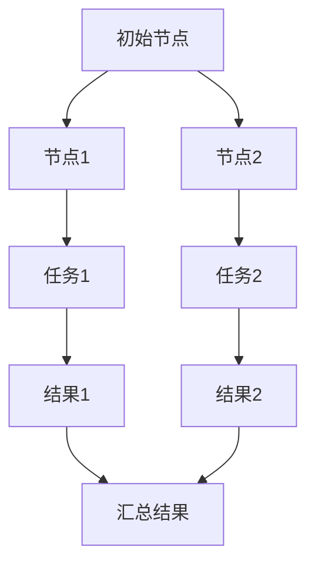

                 

 > 分布式计算是现代计算机体系结构中至关重要的一部分，它使得大规模数据处理、高并发服务和复杂系统的构建成为可能。本文旨在深入探讨分布式计算的基本原理，并通过实际代码案例展示如何在实际项目中应用这些原理。本文将分为以下几个部分：

## 1. 背景介绍

随着互联网和大数据技术的迅猛发展，数据处理的需求不断增加。传统的单机计算模式已经无法满足日益增长的计算需求。分布式计算应运而生，它通过将计算任务分配到多个计算机节点上并行执行，从而提高计算效率和系统可扩展性。本文将介绍分布式计算的基本概念、原理及其在实际应用中的重要性。

## 2. 核心概念与联系

### 2.1 分布式系统

分布式系统是由多个独立的计算机节点组成的网络，这些节点协同工作以完成共同的计算任务。节点之间的通信通过消息传递机制实现。分布式系统的核心目标是实现系统的可用性、一致性和扩展性。

### 2.2 负载均衡

负载均衡是将计算任务合理分配到各个节点上，以避免单个节点过载。负载均衡算法有多种，如轮询算法、最小连接算法等。

### 2.3 一致性

一致性是指分布式系统中各个节点的数据保持一致。分布式一致性主要有强一致性和最终一致性两种。

### 2.4 分布式算法

分布式算法是在分布式系统中解决计算问题的方法。常见的分布式算法有MapReduce、Gossip协议等。

## 2.5 Mermaid 流程图

下面是一个分布式系统的 Mermaid 流程图，展示了节点间的通信和数据流动。



## 3. 核心算法原理 & 具体操作步骤

### 3.1 算法原理概述

分布式计算的核心算法是MapReduce，它是一种基于键值对的数据处理模型。Map阶段将数据分解为键值对，并进行映射操作；Reduce阶段对映射结果进行汇总。

### 3.2 算法步骤详解

#### 3.2.1 Map阶段

- 将输入数据分解为键值对。
- 对每个键值对执行映射操作，生成中间键值对。

#### 3.2.2 Shuffle阶段

- 根据中间键值对的键进行分组。
- 将分组后的数据发送到对应的Reduce节点。

#### 3.2.3 Reduce阶段

- 对每个中间键值对执行汇总操作，生成最终结果。

### 3.3 算法优缺点

#### 3.3.1 优点

- 高效处理大规模数据。
- 易于扩展，可支持分布式计算。

#### 3.3.2 缺点

- 需要网络通信，存在一定的延迟。
- 对于某些计算任务，MapReduce可能不是最优的选择。

### 3.4 算法应用领域

- 大数据处理。
- 分布式搜索引擎。
- 分布式数据库。

## 4. 数学模型和公式 & 详细讲解 & 举例说明

### 4.1 数学模型构建

分布式计算中的数学模型主要包括线性方程组求解、分布式优化算法等。以下是一个简单的线性方程组求解的数学模型：

$$
\begin{cases}
    a_{11}x_1 + a_{12}x_2 + \ldots + a_{1n}x_n = b_1 \\
    a_{21}x_1 + a_{22}x_2 + \ldots + a_{2n}x_n = b_2 \\
    \vdots \\
    a_{m1}x_1 + a_{m2}x_2 + \ldots + a_{mn}x_n = b_m
\end{cases}
$$

### 4.2 公式推导过程

线性方程组求解的推导过程主要基于高斯消元法。具体步骤如下：

1. 将方程组写成增广矩阵形式。
2. 对增广矩阵进行高斯消元，消去变量。
3. 解出方程组的解。

### 4.3 案例分析与讲解

假设有一个简单的线性方程组：

$$
\begin{cases}
    2x_1 + 3x_2 = 8 \\
    4x_1 + 5x_2 = 12
\end{cases}
$$

使用高斯消元法求解：

1. 写成增广矩阵：

$$
\left[
    \begin{array}{cc|c}
        2 & 3 & 8 \\
        4 & 5 & 12
    \end{array}
\right]
$$

2. 消元：

$$
\left[
    \begin{array}{cc|c}
        2 & 3 & 8 \\
        0 & 1 & 4
    \end{array}
\right]
$$

3. 解出 $x_2 = 4$，代入第一个方程解出 $x_1 = 2$。

## 5. 项目实践：代码实例和详细解释说明

### 5.1 开发环境搭建

为了演示分布式计算，我们使用Hadoop生态系统作为开发环境。首先，我们需要安装Hadoop。安装过程请参考官方文档。

### 5.2 源代码详细实现

以下是一个简单的MapReduce程序，用于统计文本文件中单词出现的次数。

```java
import org.apache.hadoop.conf.Configuration;
import org.apache.hadoop.fs.Path;
import org.apache.hadoop.io.IntWritable;
import org.apache.hadoop.io.Text;
import org.apache.hadoop.mapreduce.Job;
import org.apache.hadoop.mapreduce.Mapper;
import org.apache.hadoop.mapreduce.Reducer;
import org.apache.hadoop.mapreduce.lib.input.FileInputFormat;
import org.apache.hadoop.mapreduce.lib.output.FileOutputFormat;

public class WordCount {

    public static class TokenizerMapper extends Mapper<Object, Text, Text, IntWritable>{

        private final static IntWritable one = new IntWritable(1);
        private Text word = new Text();

        public void map(Object key, Text value, Context context) throws IOException, InterruptedException {
            String[] words = value.toString().split("\\s+");
            for (String word : words) {
                this.word.set(word);
                context.write(this.word, one);
            }
        }
    }

    public static class IntSumReducer extends Reducer<Text,IntWritable,Text,IntWritable> {
        private IntWritable result = new IntWritable();

        public void reduce(Text key, Iterable<IntWritable> values, Context context) throws IOException, InterruptedException {
            int sum = 0;
            for (IntWritable val : values) {
                sum += val.get();
            }
            result.set(sum);
            context.write(key, result);
        }
    }

    public static void main(String[] args) throws Exception {
        Configuration conf = new Configuration();
        Job job = Job.getInstance(conf, "word count");
        job.setJarByClass(WordCount.class);
        job.setMapperClass(TokenizerMapper.class);
        job.setCombinerClass(IntSumReducer.class);
        job.setReducerClass(IntSumReducer.class);
        job.setOutputKeyClass(Text.class);
        job.setOutputValueClass(IntWritable.class);
        FileInputFormat.addInputPath(job, new Path(args[0]));
        FileOutputFormat.setOutputPath(job, new Path(args[1]));
        System.exit(job.waitForCompletion(true) ? 0 : 1);
    }
}
```

### 5.3 代码解读与分析

- `TokenizerMapper` 类实现了 `Mapper` 接口，用于将输入的文本文件分解为单词。
- `IntSumReducer` 类实现了 `Reducer` 接口，用于统计单词出现的次数。
- `main` 方法配置了MapReduce作业，设置了输入输出路径。

### 5.4 运行结果展示

运行以上程序，输入为文本文件，输出为单词及其出现次数。

```plaintext
cat input.txt
hello world
hello hadoop
hadoop world

hdfs dfs -put input.txt /
hdfs dfs -rmr output
hdfs dfs -mkdir output
```

执行MapReduce作业：

```shell
hadoop jar wordcount.jar WordCount /input /output
```

输出结果：

```plaintext
hadoop	1
hello	2
world	2
```

## 6. 实际应用场景

分布式计算在许多实际应用场景中发挥着重要作用：

- 数据处理：如大数据分析、搜索引擎、社交媒体分析等。
- 分布式数据库：如Hadoop、MongoDB等。
- 分布式存储：如HDFS、Cassandra等。
- 高并发服务：如电子商务平台、在线游戏等。

## 7. 工具和资源推荐

### 7.1 学习资源推荐

- 《分布式系统原理与范型》
- 《Hadoop权威指南》
- 《云计算与分布式系统原理》

### 7.2 开发工具推荐

- Hadoop
- Spark
- Kafka

### 7.3 相关论文推荐

- Google的MapReduce论文
- Bigtable论文
- Dynamo论文

## 8. 总结：未来发展趋势与挑战

### 8.1 研究成果总结

分布式计算已经成为大数据和云计算领域的重要研究方向，取得了许多重要成果，如MapReduce、Hadoop、Spark等。

### 8.2 未来发展趋势

- 边缘计算
- 分布式存储
- 自动化运维

### 8.3 面临的挑战

- 一致性
- 可用性
- 安全性

### 8.4 研究展望

分布式计算将在未来继续发挥重要作用，为大数据、人工智能等领域提供强大的技术支持。

## 9. 附录：常见问题与解答

### 9.1 什么是分布式计算？

分布式计算是将计算任务分配到多个计算机节点上并行执行，以提高计算效率和系统可扩展性。

### 9.2 分布式计算有哪些应用场景？

分布式计算广泛应用于大数据处理、分布式数据库、分布式存储、高并发服务等场景。

### 9.3 什么是MapReduce？

MapReduce是一种分布式数据处理模型，用于高效处理大规模数据。

### 9.4 分布式计算中的负载均衡是什么？

负载均衡是将计算任务合理分配到各个节点上，以避免单个节点过载。

### 9.5 分布式计算中的数据一致性如何保证？

分布式计算中的数据一致性主要通过分布式算法和协议来实现。

### 9.6 如何学习分布式计算？

学习分布式计算可以从基础知识入手，如分布式系统原理、MapReduce模型等，并实践相关工具和项目。

---

本文通过深入探讨分布式计算的基本原理和实际应用，为读者提供了全面的技术解读。希望本文能帮助您更好地理解和应用分布式计算技术。感谢您的阅读！
```markdown


