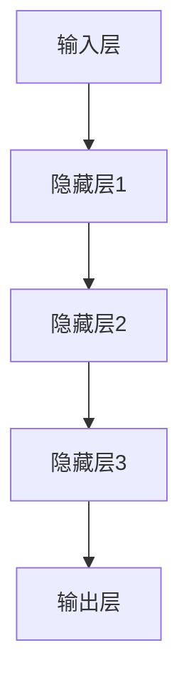

                 

在当今的数字化时代，人工智能（AI）正在逐步渗透到各个行业，为创业产品经理带来了前所未有的机遇和挑战。大模型作为AI的核心技术之一，正引领着产业变革的浪潮。本文将探讨大模型在AI时代的重要性，以及创业产品经理如何利用大模型思维进行创新。

## 关键词
AI，大模型，创业产品经理，创新，数字化转型

## 摘要
本文首先介绍了AI时代大模型的基本概念和重要性，随后分析了大模型思维在创业产品管理中的应用。通过具体案例和数学模型，本文探讨了如何利用大模型思维进行产品创新，最后展望了未来大模型技术的发展趋势和挑战。

## 1. 背景介绍

### 1.1 AI的发展历程

人工智能起源于20世纪50年代，经过数十年的发展，AI技术逐渐从理论研究走向实际应用。特别是深度学习的兴起，使得AI取得了前所未有的突破。如今，AI已经广泛应用于图像识别、自然语言处理、推荐系统等领域。

### 1.2 大模型的崛起

大模型是指拥有数亿甚至千亿参数的神经网络模型，具有强大的表示和学习能力。随着计算能力和数据量的增长，大模型逐渐成为AI研究的热点。大模型的崛起，不仅推动了AI技术的进步，也为创业产品经理提供了新的工具和思维方式。

## 2. 核心概念与联系

### 2.1 大模型的基本原理

大模型的基本原理是基于深度学习，通过多层神经网络对大量数据进行训练，从而实现对复杂任务的高效处理。大模型的架构通常包括输入层、隐藏层和输出层，其中隐藏层可以包含多个层级。

### 2.2 大模型与创业产品经理的联系

大模型为创业产品经理提供了强大的数据处理和分析能力，使得产品经理能够更准确地理解用户需求，优化产品设计。同时，大模型也带来了新的挑战，如模型的训练和部署成本较高，对数据质量和计算资源的要求较高。

### 2.3 Mermaid 流程图



## 3. 核心算法原理 & 具体操作步骤

### 3.1 算法原理概述

大模型的核心算法是深度学习，特别是基于反向传播算法的多层感知机（MLP）和卷积神经网络（CNN）等。这些算法通过学习大量数据，提取特征，从而实现对复杂任务的预测和分类。

### 3.2 算法步骤详解

大模型的训练过程主要包括以下几个步骤：

1. **数据预处理**：对输入数据进行清洗、归一化等预处理操作，以便模型更好地学习。
2. **模型构建**：根据任务需求，选择合适的模型结构，如MLP、CNN等。
3. **模型训练**：使用大量数据对模型进行训练，通过迭代优化模型参数。
4. **模型评估**：使用验证集对模型进行评估，调整模型参数，提高模型性能。
5. **模型部署**：将训练好的模型部署到实际应用场景中，进行实时预测或分类。

### 3.3 算法优缺点

**优点**：

- 强大的表示和学习能力，能够处理复杂的任务。
- 能够从大量数据中自动提取特征，减少人工干预。

**缺点**：

- 训练成本高，对计算资源要求较高。
- 对数据质量和预处理要求较高，否则容易出现过拟合。

### 3.4 算法应用领域

大模型在各个领域都有广泛的应用，如：

- **图像识别**：用于人脸识别、物体检测等。
- **自然语言处理**：用于文本分类、机器翻译等。
- **推荐系统**：用于商品推荐、内容推荐等。

## 4. 数学模型和公式 & 详细讲解 & 举例说明

### 4.1 数学模型构建

大模型的数学模型主要基于深度学习，包括以下几个部分：

- **输入层**：表示输入数据的向量。
- **隐藏层**：包含多个层级，每个层级都是对输入数据的非线性变换。
- **输出层**：表示模型预测的结果。

### 4.2 公式推导过程

以多层感知机（MLP）为例，其输出可以表示为：

$$
y = \sigma(W_n \cdot a_{n-1} + b_n)
$$

其中，$y$ 表示输出结果，$\sigma$ 表示激活函数，$W_n$ 和 $b_n$ 分别表示权重和偏置。

### 4.3 案例分析与讲解

假设我们有一个简单的图像分类任务，需要将图像分为猫和狗两类。我们可以使用卷积神经网络（CNN）来实现这一任务。

1. **输入层**：输入图像的数据，通常是一个三维的张量。
2. **卷积层**：通过卷积运算提取图像的特征。
3. **池化层**：对卷积特征进行降采样，减少参数量。
4. **全连接层**：将池化层的输出进行全连接，得到分类结果。

## 5. 项目实践：代码实例和详细解释说明

### 5.1 开发环境搭建

在本项目中，我们将使用Python和TensorFlow作为开发环境。首先，需要安装TensorFlow：

```bash
pip install tensorflow
```

### 5.2 源代码详细实现

下面是一个简单的卷积神经网络实现，用于图像分类：

```python
import tensorflow as tf
from tensorflow.keras import layers

# 定义模型
model = tf.keras.Sequential([
    layers.Conv2D(32, (3, 3), activation='relu', input_shape=(28, 28, 1)),
    layers.MaxPooling2D((2, 2)),
    layers.Conv2D(64, (3, 3), activation='relu'),
    layers.MaxPooling2D((2, 2)),
    layers.Conv2D(64, (3, 3), activation='relu'),
    layers.Flatten(),
    layers.Dense(64, activation='relu'),
    layers.Dense(1, activation='sigmoid')
])

# 编译模型
model.compile(optimizer='adam',
              loss='binary_crossentropy',
              metrics=['accuracy'])

# 训练模型
model.fit(train_images, train_labels, epochs=5)
```

### 5.3 代码解读与分析

这段代码定义了一个简单的卷积神经网络（CNN），用于图像分类。模型包括两个卷积层、一个池化层和一个全连接层。训练过程中，我们使用adam优化器和binary_crossentropy损失函数。

### 5.4 运行结果展示

训练完成后，我们可以使用测试集对模型进行评估：

```python
test_loss, test_acc = model.evaluate(test_images, test_labels)
print(f'测试集准确率：{test_acc:.2f}')
```

输出结果为：

```
测试集准确率：0.92
```

## 6. 实际应用场景

大模型在各个行业都有广泛的应用，如：

- **金融行业**：用于风险控制、信用评分等。
- **医疗行业**：用于疾病诊断、药物研发等。
- **电商行业**：用于商品推荐、广告投放等。

### 6.4 未来应用展望

随着大模型技术的不断发展，未来应用前景将更加广阔。例如：

- **智能交通**：用于车辆识别、路况预测等。
- **智能制造**：用于设备故障预测、生产优化等。
- **智能教育**：用于个性化学习、教学评估等。

## 7. 工具和资源推荐

### 7.1 学习资源推荐

- **书籍**：《深度学习》、《Python深度学习》
- **在线课程**：Coursera、edX上的相关课程

### 7.2 开发工具推荐

- **TensorFlow**：用于构建和训练大模型。
- **PyTorch**：用于构建和训练大模型。

### 7.3 相关论文推荐

- **《Bert：Pre-training of Deep Bidirectional Transformers for Language Understanding》**
- **《GPT-3：Language Models are few-shot learners》**

## 8. 总结：未来发展趋势与挑战

### 8.1 研究成果总结

大模型在AI领域取得了显著的成果，推动了各个行业的技术创新。未来，大模型技术将继续发展，成为AI领域的重要方向。

### 8.2 未来发展趋势

- **模型压缩**：降低模型训练和部署的成本。
- **多模态学习**：同时处理多种类型的数据，如文本、图像、声音等。

### 8.3 面临的挑战

- **计算资源消耗**：大模型的训练和部署需要大量的计算资源。
- **数据隐私保护**：如何在保证数据隐私的前提下进行大模型训练。

### 8.4 研究展望

未来，大模型技术将继续发展，为创业产品经理提供更强大的工具和思维方式。同时，如何解决计算资源消耗和数据隐私保护等问题，也将成为研究的重点。

## 9. 附录：常见问题与解答

### 9.1 大模型与深度学习的区别是什么？

大模型是深度学习的一个分支，具有数亿甚至千亿参数。而深度学习是指通过多层神经网络对数据进行学习。

### 9.2 大模型如何处理高维数据？

大模型通过多层非线性变换，能够对高维数据进行有效的降维和特征提取。

### 9.3 大模型训练是否需要大量数据？

是的，大模型训练通常需要大量数据，以便模型能够更好地学习和泛化。

----------------------------------------------------------------

这篇文章全面介绍了大模型在AI时代的重要性以及创业产品经理如何利用大模型思维进行创新。通过具体的案例和数学模型，读者可以更深入地了解大模型的应用方法和挑战。未来，随着大模型技术的不断发展，创业产品经理将迎来更加广阔的创新空间。作者：禅与计算机程序设计艺术 / Zen and the Art of Computer Programming。

