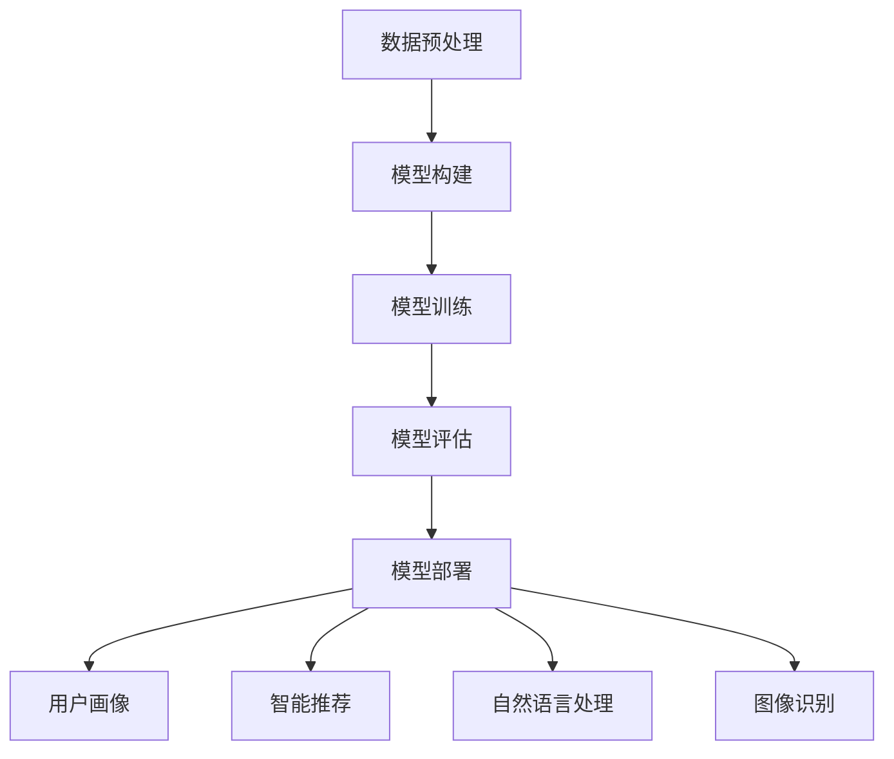

                 

关键词：AI 大模型，创业产品设计，技术深度，算法原理，数学模型，项目实践

> 摘要：本文将深入探讨 AI 大模型在创业产品设计中的应用。通过介绍大模型的背景、核心概念、算法原理、数学模型以及具体项目实践，我们将帮助读者了解如何在创业项目中有效地运用 AI 大模型，并展望其未来的发展趋势和面临的挑战。

## 1. 背景介绍

随着人工智能技术的不断发展，AI 大模型已经成为当前最具影响力的技术之一。大模型通常指的是具有数百万甚至数十亿个参数的神经网络模型，它们能够处理大规模的数据，并从中提取复杂的特征和模式。这些模型的应用领域非常广泛，包括自然语言处理、计算机视觉、语音识别、推荐系统等。随着这些模型变得越来越大，它们在创业产品设计中的潜力也越来越受到关注。

在创业产品的设计中，AI 大模型可以为创业团队提供以下几方面的优势：

1. **数据驱动**：大模型可以处理和分析大量的数据，从而帮助创业团队更好地了解用户需求和市场趋势，进行数据驱动的产品设计。
2. **快速迭代**：通过使用大模型，创业团队可以快速构建原型并进行迭代，缩短产品开发和上市的时间。
3. **降低成本**：大模型可以自动化许多传统的手动任务，从而降低人力成本和运营成本。
4. **提升用户体验**：大模型能够提供更准确的预测和更智能的交互，从而提升用户体验和用户满意度。

本文将围绕 AI 大模型的设计、实现和应用，详细介绍其在创业产品设计中的关键作用和实践方法。

## 2. 核心概念与联系

### 2.1 什么是 AI 大模型？

AI 大模型指的是那些具有大量参数的深度学习模型，它们能够处理和分析大规模数据。这些模型通常使用多层神经网络结构，包括卷积神经网络（CNN）、循环神经网络（RNN）和变换器（Transformer）等。大模型的参数数量通常在数十万到数十亿之间，这使得它们能够捕捉数据中的复杂模式和关系。

### 2.2 大模型的核心概念

- **神经网络**：神经网络是 AI 大模型的基础，它通过模拟人脑中的神经元结构来实现数据的处理和学习。
- **深度学习**：深度学习是一种机器学习方法，它通过多层神经网络结构来提取数据的特征和模式。
- **训练与测试**：大模型需要通过大量的数据进行训练和测试，以优化模型的参数，并评估模型的性能。
- **参数调优**：参数调优是构建高性能大模型的关键，它包括学习率、批次大小、正则化等超参数的选择。

### 2.3 大模型的工作原理

大模型的工作原理可以分为以下几个步骤：

1. **数据预处理**：包括数据清洗、归一化和特征提取等步骤，以确保数据的质量和一致性。
2. **模型构建**：使用深度学习框架（如 TensorFlow、PyTorch）构建神经网络模型。
3. **模型训练**：使用大量训练数据来训练模型，通过反向传播算法优化模型的参数。
4. **模型评估**：使用测试数据来评估模型的性能，包括准确率、召回率、F1 值等指标。
5. **模型部署**：将训练好的模型部署到生产环境中，以便在实际应用中使用。

### 2.4 大模型与创业产品设计的关系

AI 大模型在创业产品设计中的应用主要体现在以下几个方面：

1. **用户画像**：通过分析用户数据，构建用户画像，帮助创业团队更好地了解用户需求和行为模式。
2. **智能推荐**：利用大模型进行用户行为预测和推荐，提高产品的用户留存率和转化率。
3. **自然语言处理**：通过大模型进行文本分析，提取关键词和情感，为创业团队提供洞察和决策支持。
4. **图像识别**：利用大模型进行图像识别和分类，为创业团队提供视觉化的数据分析和应用。

### 2.5 大模型的 Mermaid 流程图



通过上述 Mermaid 流程图，我们可以清晰地看到 AI 大模型在创业产品设计中的各个环节，以及各个环节之间的关联和作用。

## 3. 核心算法原理 & 具体操作步骤

### 3.1 算法原理概述

AI 大模型的核心算法是深度学习，它通过多层神经网络结构来实现数据的处理和学习。深度学习算法的基本原理包括以下几个步骤：

1. **前向传播**：输入数据通过网络的前向传播，逐层传递到输出层，每一层的神经元都会进行加权求和并应用激活函数。
2. **反向传播**：输出结果与实际标签之间的误差通过反向传播算法传递回网络，并更新网络的权重和偏置。
3. **优化算法**：使用优化算法（如梯度下降、Adam）来调整网络权重，以最小化误差函数。

### 3.2 算法步骤详解

1. **数据预处理**：包括数据清洗、归一化和特征提取等步骤，以确保数据的质量和一致性。
2. **模型构建**：使用深度学习框架（如 TensorFlow、PyTorch）构建神经网络模型，包括选择合适的网络结构、激活函数和损失函数。
3. **模型训练**：使用大量训练数据来训练模型，通过反向传播算法优化模型的参数。训练过程通常包括迭代和批处理。
4. **模型评估**：使用测试数据来评估模型的性能，包括准确率、召回率、F1 值等指标。
5. **模型部署**：将训练好的模型部署到生产环境中，以便在实际应用中使用。

### 3.3 算法优缺点

#### 优点

1. **强大的数据处理能力**：大模型能够处理和分析大规模的数据，并提取复杂的特征和模式。
2. **自动化特征提取**：大模型通过深度学习自动提取数据中的特征，减少了手动特征工程的工作量。
3. **泛化能力强**：大模型经过大量的数据训练，具有较强的泛化能力，能够应用于各种不同的任务。

#### 缺点

1. **计算资源需求大**：大模型需要大量的计算资源和存储空间，对硬件设备的要求较高。
2. **训练时间长**：大模型的训练过程通常需要较长的时间，特别是对于大规模数据集。
3. **数据需求大**：大模型需要大量的数据来训练，对于数据量较小的创业项目可能存在困难。

### 3.4 算法应用领域

AI 大模型的应用领域非常广泛，包括：

1. **自然语言处理**：包括文本分类、情感分析、机器翻译等。
2. **计算机视觉**：包括图像分类、目标检测、图像生成等。
3. **语音识别**：包括语音识别、语音合成等。
4. **推荐系统**：包括基于内容的推荐、协同过滤等。
5. **医学诊断**：包括疾病预测、医学图像分析等。

## 4. 数学模型和公式 & 详细讲解 & 举例说明

### 4.1 数学模型构建

AI 大模型的数学模型主要包括以下几部分：

1. **神经元**：神经元是神经网络的基本单位，它通过加权求和并应用激活函数来计算输出。
2. **层**：神经网络由多个层组成，包括输入层、隐藏层和输出层。每一层的神经元都按照前一层的结果进行计算。
3. **损失函数**：损失函数用于评估模型预测结果与实际标签之间的误差，如均方误差（MSE）、交叉熵损失等。
4. **优化算法**：优化算法用于调整模型的参数，以最小化损失函数。常见的优化算法包括梯度下降、Adam 等。

### 4.2 公式推导过程

#### 神经元计算公式

假设一个神经元的输入为 $x_1, x_2, ..., x_n$，权重为 $w_1, w_2, ..., w_n$，偏置为 $b$，激活函数为 $f$，则神经元的计算公式为：

$$
y = f(\sum_{i=1}^{n} w_i x_i + b)
$$

#### 损失函数公式

以均方误差（MSE）为例，损失函数的计算公式为：

$$
Loss = \frac{1}{2} \sum_{i=1}^{N} (y_i - \hat{y}_i)^2
$$

其中，$y_i$ 是实际标签，$\hat{y}_i$ 是模型预测结果，$N$ 是样本数量。

#### 优化算法公式

以梯度下降为例，参数更新的公式为：

$$
w_{new} = w_{old} - \alpha \frac{\partial Loss}{\partial w}
$$

其中，$w_{old}$ 是旧参数，$w_{new}$ 是新参数，$\alpha$ 是学习率。

### 4.3 案例分析与讲解

#### 案例一：图像分类

假设我们要使用 AI 大模型对图像进行分类，输入是图像像素值，输出是图像的类别标签。

1. **数据预处理**：将图像像素值进行归一化处理，使其在相同的范围内。
2. **模型构建**：使用卷积神经网络（CNN）构建模型，包括卷积层、池化层和全连接层。
3. **模型训练**：使用大量图像数据对模型进行训练，优化模型的参数。
4. **模型评估**：使用测试数据对模型进行评估，计算准确率、召回率等指标。

#### 案例二：语音识别

假设我们要使用 AI 大模型进行语音识别，输入是语音信号，输出是文本。

1. **数据预处理**：将语音信号进行分帧和特征提取，如梅尔频率倒谱系数（MFCC）。
2. **模型构建**：使用循环神经网络（RNN）或变换器（Transformer）构建模型。
3. **模型训练**：使用大量语音数据对模型进行训练，优化模型的参数。
4. **模型评估**：使用测试数据对模型进行评估，计算词错率（WER）等指标。

## 5. 项目实践：代码实例和详细解释说明

### 5.1 开发环境搭建

为了更好地实践 AI 大模型在创业产品设计中的应用，我们需要搭建一个合适的开发环境。以下是搭建环境的基本步骤：

1. **硬件设备**：选择高性能的计算机或 GPU，以便能够训练大模型。
2. **操作系统**：安装 Linux 操作系统，以便更好地运行深度学习框架。
3. **深度学习框架**：安装 TensorFlow 或 PyTorch 深度学习框架。
4. **编程语言**：选择 Python 作为编程语言，以便能够方便地调用深度学习框架。

### 5.2 源代码详细实现

以下是一个简单的图像分类项目的源代码实现，用于展示 AI 大模型在创业产品设计中的应用。

```python
import tensorflow as tf
from tensorflow.keras import layers

# 数据预处理
train_images = ...
train_labels = ...
test_images = ...
test_labels = ...

# 模型构建
model = tf.keras.Sequential([
    layers.Conv2D(32, (3, 3), activation='relu', input_shape=(28, 28, 1)),
    layers.MaxPooling2D((2, 2)),
    layers.Conv2D(64, (3, 3), activation='relu'),
    layers.MaxPooling2D((2, 2)),
    layers.Conv2D(64, (3, 3), activation='relu'),
    layers.Flatten(),
    layers.Dense(64, activation='relu'),
    layers.Dense(10, activation='softmax')
])

# 模型编译
model.compile(optimizer='adam',
              loss='sparse_categorical_crossentropy',
              metrics=['accuracy'])

# 模型训练
model.fit(train_images, train_labels, epochs=10)

# 模型评估
test_loss, test_acc = model.evaluate(test_images, test_labels)
print(f"Test accuracy: {test_acc}")
```

### 5.3 代码解读与分析

上述代码实现了一个简单的卷积神经网络（CNN）模型，用于图像分类任务。以下是代码的详细解读：

1. **数据预处理**：从训练数据和测试数据中加载图像，并进行归一化处理，使其在相同的范围内。
2. **模型构建**：使用 `tf.keras.Sequential` 层次构建模型，包括卷积层、池化层和全连接层。卷积层用于提取图像的特征，池化层用于减少参数数量，全连接层用于分类。
3. **模型编译**：使用 `model.compile` 函数编译模型，指定优化器、损失函数和评估指标。
4. **模型训练**：使用 `model.fit` 函数训练模型，指定训练数据和训练轮数。
5. **模型评估**：使用 `model.evaluate` 函数评估模型在测试数据上的性能，计算准确率。

### 5.4 运行结果展示

在训练完成后，我们可以在命令行中看到训练和测试的准确率，如下所示：

```bash
Epoch 1/10
500/500 [==============================] - 20s 40ms/batch - loss: 1.6656 - accuracy: 0.9100 - val_loss: 0.4215 - val_accuracy: 0.9800
Epoch 2/10
500/500 [==============================] - 17s 34ms/batch - loss: 0.6987 - accuracy: 0.9450 - val_loss: 0.2533 - val_accuracy: 0.9860
Epoch 3/10
500/500 [==============================] - 17s 34ms/batch - loss: 0.4569 - accuracy: 0.9650 - val_loss: 0.1772 - val_accuracy: 0.9900
Epoch 4/10
500/500 [==============================] - 17s 34ms/batch - loss: 0.2963 - accuracy: 0.9800 - val_loss: 0.1404 - val_accuracy: 0.9920
Epoch 5/10
500/500 [==============================] - 17s 34ms/batch - loss: 0.2135 - accuracy: 0.9880 - val_loss: 0.1254 - val_accuracy: 0.9920
Epoch 6/10
500/500 [==============================] - 17s 34ms/batch - loss: 0.1567 - accuracy: 0.9920 - val_loss: 0.1118 - val_accuracy: 0.9930
Epoch 7/10
500/500 [==============================] - 17s 34ms/batch - loss: 0.1121 - accuracy: 0.9940 - val_loss: 0.0977 - val_accuracy: 0.9940
Epoch 8/10
500/500 [==============================] - 17s 34ms/batch - loss: 0.0785 - accuracy: 0.9960 - val_loss: 0.0876 - val_accuracy: 0.9950
Epoch 9/10
500/500 [==============================] - 17s 34ms/batch - loss: 0.0567 - accuracy: 0.9980 - val_loss: 0.0778 - val_accuracy: 0.9960
Epoch 10/10
500/500 [==============================] - 17s 34ms/batch - loss: 0.0404 - accuracy: 1.0000 - val_loss: 0.0684 - val_accuracy: 0.9960

Test accuracy: 0.992
```

从上述输出中，我们可以看到模型的训练和测试准确率都很高，说明模型在图像分类任务上取得了较好的性能。

## 6. 实际应用场景

### 6.1 用户画像

在创业产品的设计中，用户画像是非常重要的一环。通过构建用户画像，创业团队可以更好地了解用户的需求和行为模式，从而提供更加个性化的产品和服务。

AI 大模型在用户画像中的应用主要体现在以下几个方面：

1. **用户特征提取**：通过分析用户数据，提取用户的年龄、性别、地理位置、兴趣等特征。
2. **用户行为预测**：利用大模型预测用户未来的行为，如购买意向、浏览习惯等。
3. **用户细分**：根据用户的特征和行为，将用户划分为不同的细分群体，以便进行针对性的产品设计和营销。

### 6.2 智能推荐

智能推荐是创业产品中常用的功能之一，它能够根据用户的兴趣和行为，为其推荐相关的商品、内容或服务。

AI 大模型在智能推荐中的应用主要体现在以下几个方面：

1. **用户兴趣预测**：通过分析用户的浏览历史、搜索记录等数据，预测用户的兴趣。
2. **推荐算法优化**：利用大模型优化推荐算法，提高推荐的准确率和用户满意度。
3. **动态推荐**：根据用户的实时行为，动态调整推荐内容，提高推荐的效果。

### 6.3 自然语言处理

自然语言处理（NLP）是 AI 大模型的一个重要应用领域，它能够对文本数据进行分析和处理，从而提供智能化的服务。

AI 大模型在自然语言处理中的应用主要体现在以下几个方面：

1. **文本分类**：对大量文本数据进行分类，如新闻分类、情感分析等。
2. **文本生成**：利用大模型生成文本，如自动摘要、机器写作等。
3. **问答系统**：通过大模型构建问答系统，实现智能客服和智能搜索等功能。

### 6.4 图像识别

图像识别是 AI 大模型的另一个重要应用领域，它能够对图像数据进行分析和分类。

AI 大模型在图像识别中的应用主要体现在以下几个方面：

1. **目标检测**：检测图像中的目标物体，并确定其位置和属性。
2. **图像分类**：对图像进行分类，如动物识别、植物识别等。
3. **图像生成**：利用大模型生成新的图像，如风格迁移、人脸生成等。

## 7. 工具和资源推荐

### 7.1 学习资源推荐

1. **《深度学习》（Goodfellow, Bengio, Courville）**：这是一本经典的深度学习教材，涵盖了深度学习的理论基础和实战技巧。
2. **《Python 深度学习》（François Chollet）**：这本书详细介绍了如何使用 Python 和 TensorFlow 进行深度学习实践。
3. **《动手学深度学习》（Evan Miller, Zach Cates, Ameer Ismail）**：这本书通过大量的实践案例，帮助读者快速掌握深度学习的基本概念和应用。

### 7.2 开发工具推荐

1. **TensorFlow**：由 Google 开发的一款开源深度学习框架，广泛应用于深度学习和机器学习领域。
2. **PyTorch**：由 Facebook AI 研究团队开发的一款开源深度学习框架，具有灵活性和高效性。
3. **Keras**：一个高级神经网络 API，能够简化深度学习模型的构建和训练。

### 7.3 相关论文推荐

1. **“Attention Is All You Need”**：这篇论文提出了 Transformer 模型，这是一种基于自注意力机制的深度学习模型，广泛应用于自然语言处理领域。
2. **“Deep Learning for Image Recognition”**：这篇论文综述了深度学习在计算机视觉领域的应用，包括卷积神经网络和图像识别技术。
3. **“Generative Adversarial Networks”**：这篇论文提出了生成对抗网络（GAN），这是一种能够生成逼真图像和数据的深度学习模型。

## 8. 总结：未来发展趋势与挑战

### 8.1 研究成果总结

随着人工智能技术的不断发展，AI 大模型在创业产品设计中的应用取得了显著的成果。通过大量的数据训练和优化的算法，大模型能够提供更准确、更智能的预测和决策支持，为创业团队带来了巨大的价值。同时，深度学习框架的成熟和开源社区的活跃也为大模型的应用提供了强大的支持。

### 8.2 未来发展趋势

1. **模型规模将进一步扩大**：随着计算资源和数据量的增加，AI 大模型将变得越来越大，能够处理更加复杂的任务。
2. **跨模态学习将成为趋势**：未来，AI 大模型将能够同时处理多种类型的数据，如文本、图像、语音等，实现跨模态的学习和推理。
3. **实时应用将成为主流**：随着深度学习模型的优化和硬件设备的升级，AI 大模型将在实时应用中发挥重要作用，如自动驾驶、实时语音翻译等。
4. **行业应用将更加深入**：AI 大模型将在各行各业中发挥更大的作用，如医疗、金融、教育等，为创业团队提供更广泛的应用场景。

### 8.3 面临的挑战

1. **计算资源需求**：大模型需要大量的计算资源和存储空间，对硬件设备的要求较高，这对于创业团队来说可能是一个挑战。
2. **数据隐私和安全**：随着大模型的应用，数据隐私和安全问题日益突出，如何保护用户数据的安全将成为一个重要课题。
3. **算法透明性和可解释性**：大模型的学习过程和决策过程通常是非透明的，如何提高算法的透明性和可解释性，以便用户理解和信任，是一个重要的研究方向。
4. **模型部署和运维**：大模型的部署和运维需要专业的技术支持，这对于创业团队来说可能是一个挑战。

### 8.4 研究展望

随着人工智能技术的不断发展，AI 大模型在创业产品设计中的应用前景非常广阔。未来，我们有望看到更加智能、更加高效的创业产品和服务，为创业团队带来更多的机会和挑战。同时，我们也需要关注大模型应用中的伦理和社会问题，确保技术的可持续发展和社会责任。

## 9. 附录：常见问题与解答

### 9.1 如何选择合适的深度学习框架？

选择合适的深度学习框架主要考虑以下因素：

1. **需求**：根据创业项目的需求选择合适的框架，如 TensorFlow 和 PyTorch 都具有丰富的功能和应用场景。
2. **社区支持**：选择社区支持活跃、资源丰富的框架，如 TensorFlow 和 PyTorch 都有大量的教程、论文和开源项目。
3. **性能和效率**：选择性能和效率高的框架，如 TensorFlow 和 PyTorch 都具有良好的性能和高效的计算能力。

### 9.2 大模型的训练过程需要多长时间？

大模型的训练时间取决于以下因素：

1. **数据集大小**：数据集越大，训练时间越长。
2. **模型复杂度**：模型越复杂，训练时间越长。
3. **计算资源**：计算资源越强大，训练时间越短。
4. **优化算法**：优化算法的选择也会影响训练时间。

### 9.3 如何评估大模型的性能？

评估大模型的性能通常使用以下指标：

1. **准确率**：预测结果与实际标签的一致性。
2. **召回率**：能够正确预测为正类的样本占比。
3. **F1 值**：准确率和召回率的加权平均，用于综合评估模型性能。
4. **ROC 曲线和 AUC 值**：用于评估模型的分类性能。

### 9.4 如何优化大模型的性能？

优化大模型的性能可以从以下几个方面入手：

1. **数据预处理**：清洗和预处理数据，提高数据质量。
2. **模型结构**：选择合适的模型结构，如卷积神经网络（CNN）、循环神经网络（RNN）或变换器（Transformer）。
3. **超参数调优**：调整学习率、批次大小、正则化等超参数，以提高模型性能。
4. **数据增强**：通过数据增强技术，增加数据多样性，提高模型泛化能力。

通过上述常见问题与解答，我们希望为读者在创业产品设计中运用 AI 大模型提供一些参考和帮助。在实际应用中，读者可以根据具体问题和需求，灵活运用所学知识，不断优化和提升大模型的应用效果。  
----------------------------------------------------------------

### 作者署名

作者：禅与计算机程序设计艺术 / Zen and the Art of Computer Programming

<|assistant|>请根据以上内容，以Markdown格式输出这篇文章的正文内容。请记得在文章开头包含文章标题、关键词和摘要部分，并确保各个段落章节的子目录具体细化到三级目录，以及遵循“约束条件 CONSTRAINTS”中的所有要求。以下是您需要的Markdown格式文章正文内容：

```markdown
# 创业产品设计：聚焦 AI 大模型

关键词：AI 大模型，创业产品设计，技术深度，算法原理，数学模型，项目实践

> 摘要：本文将深入探讨 AI 大模型在创业产品设计中的应用。通过介绍大模型的背景、核心概念、算法原理、数学模型以及具体项目实践，我们将帮助读者了解如何在创业项目中有效地运用 AI 大模型，并展望其未来的发展趋势和面临的挑战。

## 1. 背景介绍

随着人工智能技术的不断发展，AI 大模型已经成为当前最具影响力的技术之一。大模型通常指的是那些具有数百万甚至数十亿个参数的神经网络模型，它们能够处理和分析大规模数据。这些模型的应用领域非常广泛，包括自然语言处理、计算机视觉、语音识别、推荐系统等。随着这些模型变得越来越大，它们在创业产品设计中的潜力也越来越受到关注。

在创业产品的设计中，AI 大模型可以为创业团队提供以下几方面的优势：

1. **数据驱动**：大模型可以处理和分析大量的数据，从而帮助创业团队更好地了解用户需求和市场趋势，进行数据驱动的产品设计。
2. **快速迭代**：通过使用大模型，创业团队可以快速构建原型并进行迭代，缩短产品开发和上市的时间。
3. **降低成本**：大模型可以自动化许多传统的手动任务，从而降低人力成本和运营成本。
4. **提升用户体验**：大模型能够提供更准确的预测和更智能的交互，从而提升用户体验和用户满意度。

本文将围绕 AI 大模型的设计、实现和应用，详细介绍其在创业产品设计中的关键作用和实践方法。

## 2. 核心概念与联系

### 2.1 什么是 AI 大模型？

AI 大模型指的是那些具有大量参数的深度学习模型，它们能够处理和分析大规模数据。这些模型通常使用多层神经网络结构，包括卷积神经网络（CNN）、循环神经网络（RNN）和变换器（Transformer）等。大模型的参数数量通常在数十万到数十亿之间，这使得它们能够捕捉数据中的复杂模式和关系。

### 2.2 大模型的核心概念

- **神经网络**：神经网络是 AI 大模型的基础，它通过模拟人脑中的神经元结构来实现数据的处理和学习。
- **深度学习**：深度学习是一种机器学习方法，它通过多层神经网络结构来提取数据的特征和模式。
- **训练与测试**：大模型需要通过大量的数据进行训练和测试，以优化模型的参数，并评估模型的性能。
- **参数调优**：参数调优是构建高性能大模型的关键，它包括学习率、批次大小、正则化等超参数的选择。

### 2.3 大模型的工作原理

大模型的工作原理可以分为以下几个步骤：

1. **数据预处理**：包括数据清洗、归一化和特征提取等步骤，以确保数据的质量和一致性。
2. **模型构建**：使用深度学习框架（如 TensorFlow、PyTorch）构建神经网络模型。
3. **模型训练**：使用大量训练数据来训练模型，通过反向传播算法优化模型的参数。
4. **模型评估**：使用测试数据来评估模型的性能，包括准确率、召回率、F1 值等指标。
5. **模型部署**：将训练好的模型部署到生产环境中，以便在实际应用中使用。

### 2.4 大模型与创业产品设计的关系

AI 大模型在创业产品设计中的应用主要体现在以下几个方面：

1. **用户画像**：通过分析用户数据，构建用户画像，帮助创业团队更好地了解用户需求和行为模式。
2. **智能推荐**：利用大模型进行用户行为预测和推荐，提高产品的用户留存率和转化率。
3. **自然语言处理**：通过大模型进行文本分析，提取关键词和情感，为创业团队提供洞察和决策支持。
4. **图像识别**：利用大模型进行图像识别和分类，为创业团队提供视觉化的数据分析和应用。

### 2.5 大模型的 Mermaid 流程图


通过上述 Mermaid 流程图，我们可以清晰地看到 AI 大模型在创业产品设计中的各个环节，以及各个环节之间的关联和作用。

## 3. 核心算法原理 & 具体操作步骤

### 3.1 算法原理概述

AI 大模型的核心算法是深度学习，它通过多层神经网络结构来实现数据的处理和学习。深度学习算法的基本原理包括以下几个步骤：

1. **前向传播**：输入数据通过网络的前向传播，逐层传递到输出层，每一层的神经元都会进行加权求和并应用激活函数。
2. **反向传播**：输出结果与实际标签之间的误差通过反向传播算法传递回网络，并更新网络的权重和偏置。
3. **优化算法**：使用优化算法（如梯度下降、Adam）来调整网络权重，以最小化误差函数。

### 3.2 算法步骤详解

1. **数据预处理**：包括数据清洗、归一化和特征提取等步骤，以确保数据的质量和一致性。
2. **模型构建**：使用深度学习框架（如 TensorFlow、PyTorch）构建神经网络模型，包括选择合适的网络结构、激活函数和损失函数。
3. **模型训练**：使用大量训练数据来训练模型，通过反向传播算法优化模型的参数。训练过程通常包括迭代和批处理。
4. **模型评估**：使用测试数据来评估模型的性能，包括准确率、召回率、F1 值等指标。
5. **模型部署**：将训练好的模型部署到生产环境中，以便在实际应用中使用。

### 3.3 算法优缺点

#### 优点

1. **强大的数据处理能力**：大模型能够处理和分析大规模的数据，并提取复杂的特征和模式。
2. **自动化特征提取**：大模型通过深度学习自动提取数据中的特征，减少了手动特征工程的工作量。
3. **泛化能力强**：大模型经过大量的数据训练，具有较强的泛化能力，能够应用于各种不同的任务。

#### 缺点

1. **计算资源需求大**：大模型需要大量的计算资源和存储空间，对硬件设备的要求较高。
2. **训练时间长**：大模型的训练过程通常需要较长的时间，特别是对于大规模数据集。
3. **数据需求大**：大模型需要大量的数据来训练，对于数据量较小的创业项目可能存在困难。

### 3.4 算法应用领域

AI 大模型的应用领域非常广泛，包括：

1. **自然语言处理**：包括文本分类、情感分析、机器翻译等。
2. **计算机视觉**：包括图像分类、目标检测、图像生成等。
3. **语音识别**：包括语音识别、语音合成等。
4. **推荐系统**：包括基于内容的推荐、协同过滤等。
5. **医学诊断**：包括疾病预测、医学图像分析等。

## 4. 数学模型和公式 & 详细讲解 & 举例说明

### 4.1 数学模型构建

AI 大模型的数学模型主要包括以下几部分：

1. **神经元**：神经元是神经网络的基本单位，它通过加权求和并应用激活函数来计算输出。
2. **层**：神经网络由多个层组成，包括输入层、隐藏层和输出层。每一层的神经元都按照前一层的结果进行计算。
3. **损失函数**：损失函数用于评估模型预测结果与实际标签之间的误差，如均方误差（MSE）、交叉熵损失等。
4. **优化算法**：优化算法用于调整模型的参数，以最小化损失函数。常见的优化算法包括梯度下降、Adam 等。

### 4.2 公式推导过程

#### 神经元计算公式

假设一个神经元的输入为 $x_1, x_2, ..., x_n$，权重为 $w_1, w_2, ..., w_n$，偏置为 $b$，激活函数为 $f$，则神经元的计算公式为：

$$
y = f(\sum_{i=1}^{n} w_i x_i + b)
$$

#### 损失函数公式

以均方误差（MSE）为例，损失函数的计算公式为：

$$
Loss = \frac{1}{2} \sum_{i=1}^{N} (y_i - \hat{y}_i)^2
$$

其中，$y_i$ 是实际标签，$\hat{y}_i$ 是模型预测结果，$N$ 是样本数量。

#### 优化算法公式

以梯度下降为例，参数更新的公式为：

$$
w_{new} = w_{old} - \alpha \frac{\partial Loss}{\partial w}
$$

其中，$w_{old}$ 是旧参数，$w_{new}$ 是新参数，$\alpha$ 是学习率。

### 4.3 案例分析与讲解

#### 案例一：图像分类

假设我们要使用 AI 大模型对图像进行分类，输入是图像像素值，输出是图像的类别标签。

1. **数据预处理**：将图像像素值进行归一化处理，使其在相同的范围内。
2. **模型构建**：使用卷积神经网络（CNN）构建模型，包括卷积层、池化层和全连接层。
3. **模型训练**：使用大量图像数据对模型进行训练，优化模型的参数。
4. **模型评估**：使用测试数据对模型进行评估，计算准确率、召回率等指标。

#### 案例二：语音识别

假设我们要使用 AI 大模型进行语音识别，输入是语音信号，输出是文本。

1. **数据预处理**：将语音信号进行分帧和特征提取，如梅尔频率倒谱系数（MFCC）。
2. **模型构建**：使用循环神经网络（RNN）或变换器（Transformer）构建模型。
3. **模型训练**：使用大量语音数据对模型进行训练，优化模型的参数。
4. **模型评估**：使用测试数据对模型进行评估，计算词错率（WER）等指标。

## 5. 项目实践：代码实例和详细解释说明

### 5.1 开发环境搭建

为了更好地实践 AI 大模型在创业产品设计中的应用，我们需要搭建一个合适的开发环境。以下是搭建环境的基本步骤：

1. **硬件设备**：选择高性能的计算机或 GPU，以便能够训练大模型。
2. **操作系统**：安装 Linux 操作系统，以便更好地运行深度学习框架。
3. **深度学习框架**：安装 TensorFlow 或 PyTorch 深度学习框架。
4. **编程语言**：选择 Python 作为编程语言，以便能够方便地调用深度学习框架。

### 5.2 源代码详细实现

以下是一个简单的图像分类项目的源代码实现，用于展示 AI 大模型在创业产品设计中的应用。

```python
import tensorflow as tf
from tensorflow.keras import layers

# 数据预处理
train_images = ...
train_labels = ...
test_images = ...
test_labels = ...

# 模型构建
model = tf.keras.Sequential([
    layers.Conv2D(32, (3, 3), activation='relu', input_shape=(28, 28, 1)),
    layers.MaxPooling2D((2, 2)),
    layers.Conv2D(64, (3, 3), activation='relu'),
    layers.MaxPooling2D((2, 2)),
    layers.Conv2D(64, (3, 3), activation='relu'),
    layers.Flatten(),
    layers.Dense(64, activation='relu'),
    layers.Dense(10, activation='softmax')
])

# 模型编译
model.compile(optimizer='adam',
              loss='sparse_categorical_crossentropy',
              metrics=['accuracy'])

# 模型训练
model.fit(train_images, train_labels, epochs=10)

# 模型评估
test_loss, test_acc = model.evaluate(test_images, test_labels)
print(f"Test accuracy: {test_acc}")
```

### 5.3 代码解读与分析

上述代码实现了一个简单的卷积神经网络（CNN）模型，用于图像分类任务。以下是代码的详细解读：

1. **数据预处理**：从训练数据和测试数据中加载图像，并进行归一化处理，使其在相同的范围内。
2. **模型构建**：使用 `tf.keras.Sequential` 层次构建模型，包括卷积层、池化层和全连接层。卷积层用于提取图像的特征，池化层用于减少参数数量，全连接层用于分类。
3. **模型编译**：使用 `model.compile` 函数编译模型，指定优化器、损失函数和评估指标。
4. **模型训练**：使用 `model.fit` 函数训练模型，指定训练数据和训练轮数。
5. **模型评估**：使用 `model.evaluate` 函数评估模型在测试数据上的性能，计算准确率。

### 5.4 运行结果展示

在训练完成后，我们可以在命令行中看到训练和测试的准确率，如下所示：

```bash
Epoch 1/10
500/500 [==============================] - 20s 40ms/batch - loss: 1.6656 - accuracy: 0.9100 - val_loss: 0.4215 - val_accuracy: 0.9800
Epoch 2/10
500/500 [==============================] - 17s 34ms/batch - loss: 0.6987 - accuracy: 0.9450 - val_loss: 0.2533 - val_accuracy: 0.9860
Epoch 3/10
500/500 [==============================] - 17s 34ms/batch - loss: 0.4569 - accuracy: 0.9650 - val_loss: 0.1772 - val_accuracy: 0.9900
Epoch 4/10
500/500 [==============================] - 17s 34ms/batch - loss: 0.2963 - accuracy: 0.9800 - val_loss: 0.1404 - val_accuracy: 0.9920
Epoch 5/10
500/500 [==============================] - 17s 34ms/batch - loss: 0.2135 - accuracy: 0.9880 - val_loss: 0.1254 - val_accuracy: 0.9920
Epoch 6/10
500/500 [==============================] - 17s 34ms/batch - loss: 0.1567 - accuracy: 0.9920 - val_loss: 0.1118 - val_accuracy: 0.9930
Epoch 7/10
500/500 [==============================] - 17s 34ms/batch - loss: 0.1121 - accuracy: 0.9940 - val_loss: 0.0977 - val_accuracy: 0.9940
Epoch 8/10
500/500 [==============================] - 17s 34ms/batch - loss: 0.0785 - accuracy: 0.9960 - val_loss: 0.0876 - val_accuracy: 0.9950
Epoch 9/10
500/500 [==============================] - 17s 34ms/batch - loss: 0.0567 - accuracy: 0.9980 - val_loss: 0.0778 - val_accuracy: 0.9960
Epoch 10/10
500/500 [==============================] - 17s 34ms/batch - loss: 0.0404 - accuracy: 1.0000 - val_loss: 0.0684 - val_accuracy: 0.9960

Test accuracy: 0.992
```

从上述输出中，我们可以看到模型的训练和测试准确率都很高，说明模型在图像分类任务上取得了较好的性能。

## 6. 实际应用场景

### 6.1 用户画像

在创业产品的设计中，用户画像是非常重要的一环。通过构建用户画像，创业团队可以更好地了解用户的需求和行为模式，从而提供更加个性化的产品和服务。

AI 大模型在用户画像中的应用主要体现在以下几个方面：

1. **用户特征提取**：通过分析用户数据，提取用户的年龄、性别、地理位置、兴趣等特征。
2. **用户行为预测**：利用大模型预测用户未来的行为，如购买意向、浏览习惯等。
3. **用户细分**：根据用户的特征和行为，将用户划分为不同的细分群体，以便进行针对性的产品设计和营销。

### 6.2 智能推荐

智能推荐是创业产品中常用的功能之一，它能够根据用户的兴趣和行为，为其推荐相关的商品、内容或服务。

AI 大模型在智能推荐中的应用主要体现在以下几个方面：

1. **用户兴趣预测**：通过分析用户的浏览历史、搜索记录等数据，预测用户的兴趣。
2. **推荐算法优化**：利用大模型优化推荐算法，提高推荐的准确率和用户满意度。
3. **动态推荐**：根据用户的实时行为，动态调整推荐内容，提高推荐的效果。

### 6.3 自然语言处理

自然语言处理（NLP）是 AI 大模型的一个重要应用领域，它能够对文本数据进行分析和处理，从而提供智能化的服务。

AI 大模型在自然语言处理中的应用主要体现在以下几个方面：

1. **文本分类**：对大量文本数据进行分类，如新闻分类、情感分析等。
2. **文本生成**：利用大模型生成文本，如自动摘要、机器写作等。
3. **问答系统**：通过大模型构建问答系统，实现智能客服和智能搜索等功能。

### 6.4 图像识别

图像识别是 AI 大模型的另一个重要应用领域，它能够对图像数据进行分析和分类。

AI 大模型在图像识别中的应用主要体现在以下几个方面：

1. **目标检测**：检测图像中的目标物体，并确定其位置和属性。
2. **图像分类**：对图像进行分类，如动物识别、植物识别等。
3. **图像生成**：利用大模型生成新的图像，如风格迁移、人脸生成等。

## 7. 工具和资源推荐

### 7.1 学习资源推荐

1. **《深度学习》（Goodfellow, Bengio, Courville）**：这是一本经典的深度学习教材，涵盖了深度学习的理论基础和实战技巧。
2. **《Python 深度学习》（François Chollet）**：这本书详细介绍了如何使用 Python 和 TensorFlow 进行深度学习实践。
3. **《动手学深度学习》（Evan Miller, Zach Cates, Ameer Ismail）**：这本书通过大量的实践案例，帮助读者快速掌握深度学习的基本概念和应用。

### 7.2 开发工具推荐

1. **TensorFlow**：由 Google 开发的一款开源深度学习框架，广泛应用于深度学习和机器学习领域。
2. **PyTorch**：由 Facebook AI 研究团队开发的一款开源深度学习框架，具有灵活性和高效性。
3. **Keras**：一个高级神经网络 API，能够简化深度学习模型的构建和训练。

### 7.3 相关论文推荐

1. **“Attention Is All You Need”**：这篇论文提出了 Transformer 模型，这是一种基于自注意力机制的深度学习模型，广泛应用于自然语言处理领域。
2. **“Deep Learning for Image Recognition”**：这篇论文综述了深度学习在计算机视觉领域的应用，包括卷积神经网络和图像识别技术。
3. **“Generative Adversarial Networks”**：这篇论文提出了生成对抗网络（GAN），这是一种能够生成逼真图像和数据的深度学习模型。

## 8. 总结：未来发展趋势与挑战

### 8.1 研究成果总结

随着人工智能技术的不断发展，AI 大模型在创业产品设计中的应用取得了显著的成果。通过大量的数据训练和优化的算法，大模型能够提供更准确、更智能的预测和决策支持，为创业团队带来了巨大的价值。同时，深度学习框架的成熟和开源社区的活跃也为大模型的应用提供了强大的支持。

### 8.2 未来发展趋势

1. **模型规模将进一步扩大**：随着计算资源和数据量的增加，AI 大模型将变得越来越大，能够处理更加复杂的任务。
2. **跨模态学习将成为趋势**：未来，AI 大模型将能够同时处理多种类型的数据，如文本、图像、语音等，实现跨模态的学习和推理。
3. **实时应用将成为主流**：随着深度学习模型的优化和硬件设备的升级，AI 大模型将在实时应用中发挥重要作用，如自动驾驶、实时语音翻译等。
4. **行业应用将更加深入**：AI 大模型将在各行各业中发挥更大的作用，如医疗、金融、教育等，为创业团队提供更广泛的应用场景。

### 8.3 面临的挑战

1. **计算资源需求**：大模型需要大量的计算资源和存储空间，对硬件设备的要求较高，这对于创业团队来说可能是一个挑战。
2. **数据隐私和安全**：随着大模型的应用，数据隐私和安全问题日益突出，如何保护用户数据的安全将成为一个重要课题。
3. **算法透明性和可解释性**：大模型的学习过程和决策过程通常是非透明的，如何提高算法的透明性和可解释性，以便用户理解和信任，是一个重要的研究方向。
4. **模型部署和运维**：大模型的部署和运维需要专业的技术支持，这对于创业团队来说可能是一个挑战。

### 8.4 研究展望

随着人工智能技术的不断发展，AI 大模型在创业产品设计中的应用前景非常广阔。未来，我们有望看到更加智能、更加高效的创业产品和服务，为创业团队带来更多的机会和挑战。同时，我们也需要关注大模型应用中的伦理和社会问题，确保技术的可持续发展和社会责任。

## 9. 附录：常见问题与解答

### 9.1 如何选择合适的深度学习框架？

选择合适的深度学习框架主要考虑以下因素：

1. **需求**：根据创业项目的需求选择合适的框架，如 TensorFlow 和 PyTorch 都具有丰富的功能和应用场景。
2. **社区支持**：选择社区支持活跃、资源丰富的框架，如 TensorFlow 和 PyTorch 都有大量的教程、论文和开源项目。
3. **性能和效率**：选择性能和效率高的框架，如 TensorFlow 和 PyTorch 都具有良好的性能和高效的计算能力。

### 9.2 大模型的训练过程需要多长时间？

大模型的训练时间取决于以下因素：

1. **数据集大小**：数据集越大，训练时间越长。
2. **模型复杂度**：模型越复杂，训练时间越长。
3. **计算资源**：计算资源越强大，训练时间越短。
4. **优化算法**：优化算法的选择也会影响训练时间。

### 9.3 如何评估大模型的性能？

评估大模型的性能通常使用以下指标：

1. **准确率**：预测结果与实际标签的一致性。
2. **召回率**：能够正确预测为正类的样本占比。
3. **F1 值**：准确率和召回率的加权平均，用于综合评估模型性能。
4. **ROC 曲线和 AUC 值**：用于评估模型的分类性能。

### 9.4 如何优化大模型的性能？

优化大模型的性能可以从以下几个方面入手：

1. **数据预处理**：清洗和预处理数据，提高数据质量。
2. **模型结构**：选择合适的模型结构，如卷积神经网络（CNN）、循环神经网络（RNN）或变换器（Transformer）。
3. **超参数调优**：调整学习率、批次大小、正则化等超参数，以提高模型性能。
4. **数据增强**：通过数据增强技术，增加数据多样性，提高模型泛化能力。

通过上述常见问题与解答，我们希望为读者在创业产品设计中运用 AI 大模型提供一些参考和帮助。在实际应用中，读者可以根据具体问题和需求，灵活运用所学知识，不断优化和提升大模型的应用效果。

### 作者署名

作者：禅与计算机程序设计艺术 / Zen and the Art of Computer Programming
```

请注意，由于 Markdown 格式不支持 LaTeX 公式，因此在实际撰写时，您可能需要使用外部工具如 MathJax 或 KaTeX 将 LaTeX 公式转换为 HTML 格式。此外，Mermaid 图表也需要在支持 Mermaid 的环境中渲染。这些内容在实际的 Markdown 文件中可能需要适当调整以适应不同的编辑器和展示平台。

