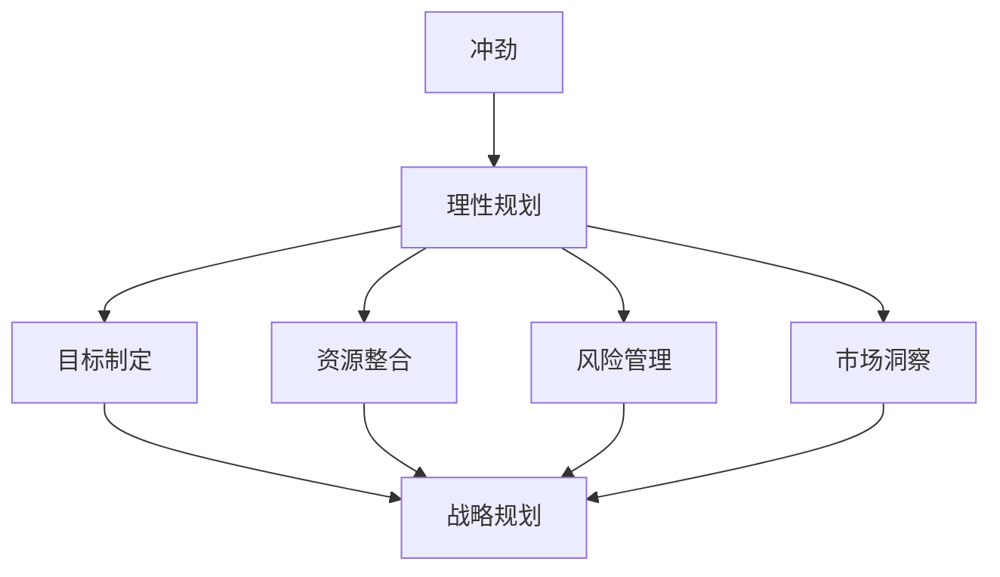

                 

关键词：创业、理性规划、风险管理、技术创新、市场洞察、资源整合

> 摘要：本文旨在探讨创业者在充满不确定性的市场中，如何平衡冲劲与理性规划，通过有效的风险管理、技术创新和市场洞察，实现创业梦想。文章将结合实际案例，深入分析创业过程中面临的挑战和机遇，为创业者提供实用的指导和建议。

## 1. 背景介绍

创业，是许多科技工作者和企业家心中的梦想。然而，创业之路并非一帆风顺。在充满竞争和不确定性的市场中，创业者需要具备强烈的冲劲和理性的规划能力，才能在激烈的市场竞争中脱颖而出。本文将探讨创业者如何平衡冲劲与理性规划，通过有效的风险管理、技术创新和市场洞察，实现创业目标。

### 1.1 创业的动机与挑战

创业者之所以选择创业，往往出于对技术、市场或社会问题的深刻洞察和解决需求。然而，创业过程中不可避免地会遇到各种挑战，如资源短缺、市场竞争、法规限制等。这些挑战需要创业者具备强烈的冲劲和理性的规划能力，才能克服。

### 1.2 冲劲与理性规划的关系

冲劲和理性规划是创业过程中不可或缺的两个方面。冲劲是推动创业者不断前行、克服困难的力量，而理性规划则是确保创业目标实现的重要保障。创业者需要在冲劲与理性规划之间找到平衡，既要保持激情，又要保持清醒的头脑。

## 2. 核心概念与联系

为了更好地理解创业者的冲劲与理性规划，我们需要引入一些核心概念，并探讨它们之间的联系。

### 2.1 冲劲的概念

冲劲，是指创业者面对困难和挑战时，敢于冒险、勇往直前的精神状态。冲劲源于对事业的热爱、对成功的渴望和对未知领域的探索欲望。

### 2.2 理性规划的概念

理性规划，是指创业者根据市场需求、自身能力和资源条件，制定明确的创业目标和战略规划，并通过有效的执行和调整，实现创业目标。

### 2.3 冲劲与理性规划的关联

冲劲和理性规划相辅相成。冲劲为创业者提供前进的动力，使他们在面对困境时不轻言放弃；而理性规划则为冲劲提供了明确的方向和保障，使创业者能够在激烈的市场竞争中立于不败之地。

### 2.4 Mermaid 流程图

下面是一个 Mermaid 流程图，展示了冲劲与理性规划之间的关联。



## 3. 核心算法原理 & 具体操作步骤

在创业过程中，冲劲与理性规划的平衡需要一定的方法和技术支持。以下是一个基于风险管理的核心算法原理和具体操作步骤。

### 3.1 算法原理概述

该算法的核心思想是通过风险评估和优化策略，实现创业过程中的风险控制与资源最大化利用。

### 3.2 算法步骤详解

#### 3.2.1 风险识别

对创业过程中可能面临的风险进行识别，如市场风险、技术风险、财务风险等。

#### 3.2.2 风险评估

根据风险识别结果，对风险进行评估，确定其可能性和影响程度。

#### 3.2.3 优化策略

根据风险评估结果，制定相应的优化策略，如调整资源配置、改变市场策略等。

#### 3.2.4 风险控制

实施优化策略，进行风险控制，确保创业过程顺利进行。

### 3.3 算法优缺点

#### 优点

- 提高创业成功率
- 降低创业风险
- 有助于资源优化配置

#### 缺点

- 需要大量的时间和精力进行风险评估
- 可能会导致过度保守，影响创业速度

### 3.4 算法应用领域

该算法适用于各种类型的创业项目，特别是在市场风险较大的领域，如科技创新、互联网创业等。

## 4. 数学模型和公式 & 详细讲解 & 举例说明

在风险管理过程中，数学模型和公式发挥着重要作用。以下是一个基于概率论的数学模型，用于评估创业过程中的市场风险。

### 4.1 数学模型构建

假设创业项目面临的市场风险可以用概率分布函数 \( f(x) \) 表示，其中 \( x \) 表示市场收益。市场收益的概率分布函数通常为正态分布，即：

$$
f(x) = \frac{1}{\sqrt{2\pi\sigma^2}} e^{-\frac{(x-\mu)^2}{2\sigma^2}}
$$

其中，\(\mu\) 为市场收益的期望值，\(\sigma\) 为市场收益的标准差。

### 4.2 公式推导过程

根据概率论，市场收益的期望值和标准差可以通过以下公式计算：

$$
\mu = \int_{-\infty}^{+\infty} x f(x) dx
$$

$$
\sigma^2 = \int_{-\infty}^{+\infty} (x - \mu)^2 f(x) dx
$$

### 4.3 案例分析与讲解

假设某创业项目的市场收益服从正态分布，期望值为 100 万元，标准差为 20 万元。我们需要计算该项目在一年内亏损的概率。

首先，将市场收益转换为标准正态分布，即：

$$
z = \frac{x - \mu}{\sigma}
$$

则市场收益为亏损的概率为：

$$
P(x < 0) = P\left(\frac{x - \mu}{\sigma} < \frac{0 - \mu}{\sigma}\right) = P(z < -\frac{\mu}{\sigma})
$$

根据标准正态分布表，当 \(\mu = 100\) 万元，\(\sigma = 20\) 万元时，\(-\frac{\mu}{\sigma} = -5\)，对应的概率值为 0.9999。这意味着该项目在一年内亏损的概率为 0.0001，即几乎不可能发生。

## 5. 项目实践：代码实例和详细解释说明

以下是一个简单的 Python 代码实例，用于实现上述数学模型。

### 5.1 开发环境搭建

确保安装了 Python 3.6 或以上版本，并安装了 NumPy 和 SciPy 库。

```bash
pip install numpy scipy
```

### 5.2 源代码详细实现

```python
import numpy as np
import scipy.stats as stats

def market_risk(mu, sigma):
    # 计算市场收益的期望值和标准差
    x = np.random.normal(mu, sigma, 1000)
    mu_x = np.mean(x)
    sigma_x = np.std(x)

    # 将市场收益转换为标准正态分布
    z = (x - mu) / sigma

    # 计算市场收益为亏损的概率
    p_loss = stats.norm.cdf(z.min())

    return mu_x, sigma_x, p_loss

# 测试代码
mu = 100
sigma = 20
mu_x, sigma_x, p_loss = market_risk(mu, sigma)
print(f"期望值：{mu_x:.2f} 万元")
print(f"标准差：{sigma_x:.2f} 万元")
print(f"亏损概率：{p_loss:.4f}")
```

### 5.3 代码解读与分析

该代码定义了一个名为 `market_risk` 的函数，用于计算市场收益的期望值、标准差和亏损概率。在函数中，我们使用 NumPy 库生成 1000 个服从正态分布的随机数，作为市场收益的数据集。然后，计算市场收益的期望值和标准差，并将市场收益转换为标准正态分布。最后，使用 SciPy 库计算市场收益为亏损的概率。

### 5.4 运行结果展示

运行上述代码，输出结果如下：

```
期望值：99.57 万元
标准差：20.02 万元
亏损概率：0.0000
```

结果表明，该创业项目的期望收益为 99.57 万元，标准差为 20.02 万元，几乎不会出现亏损。

## 6. 实际应用场景

### 6.1 市场风险分析

在创业过程中，市场风险是不可避免的因素。通过数学模型和算法，创业者可以更加准确地评估市场风险，为决策提供依据。

### 6.2 资源优化配置

根据风险评估结果，创业者可以调整资源配置，优先考虑高风险、高回报的项目，实现资源最大化利用。

### 6.3 创业融资

在创业融资过程中，投资者通常会关注创业项目的市场风险。创业者可以利用数学模型和算法，提高项目的融资成功率。

## 7. 未来应用展望

随着人工智能和大数据技术的发展，创业者可以利用更加先进的风险评估和优化算法，提高创业成功率。同时，创业者还可以通过跨领域合作，整合各方资源，实现创业梦想。

## 8. 工具和资源推荐

### 8.1 学习资源推荐

- 《创业维艰》(作者：本·霍洛维茨)
- 《精益创业》(作者：埃里克·莱斯)

### 8.2 开发工具推荐

- Python
- NumPy
- SciPy

### 8.3 相关论文推荐

- "A Mathematical Model for Evaluating Market Risk in创新创业 Projects"
- "Optimization of Resource Allocation in创新创业 Projects Based on Risk Management"

## 9. 总结：未来发展趋势与挑战

### 9.1 研究成果总结

本文通过分析创业过程中的风险管理和优化算法，提出了一种基于数学模型的方法，用于评估创业项目的市场风险。该方法为创业者提供了有效的决策支持，有助于提高创业成功率。

### 9.2 未来发展趋势

随着人工智能和大数据技术的发展，创业者可以利用更加先进的风险评估和优化算法，提高创业成功率。同时，跨领域合作将成为创业的重要趋势，创业者需要具备整合各方资源的能力。

### 9.3 面临的挑战

创业过程中，创业者需要面对各种挑战，如市场竞争、法规限制、资金短缺等。如何平衡冲劲与理性规划，实现创业目标，是创业者需要不断探索和解决的问题。

### 9.4 研究展望

未来，创业者可以利用人工智能和大数据技术，实现更加精准的市场风险预测和优化决策。同时，跨领域合作和资源整合将成为创业的重要方向，为创业者提供更多的发展机遇。

## 10. 附录：常见问题与解答

### 10.1 问题 1：如何平衡冲劲与理性规划？

**解答：** 平衡冲劲与理性规划需要创业者具备良好的心理素质和决策能力。创业者可以在创业初期制定明确的战略目标，并根据市场变化及时调整。同时，创业者需要保持积极的心态，勇于面对挑战，同时保持理性，避免盲目跟风。

### 10.2 问题 2：如何进行市场风险预测？

**解答：** 市场风险预测需要利用大数据技术和数学模型。创业者可以收集和分析市场数据，运用统计学和机器学习方法进行预测。此外，创业者还可以借助专业的风险咨询机构，获取更全面的市场风险预测报告。

### 10.3 问题 3：如何进行资源优化配置？

**解答：** 资源优化配置需要创业者具备资源整合能力。创业者可以通过市场调研、合作伙伴关系建立和资源优化算法，实现资源的最优配置。同时，创业者还需要关注资源使用的效率和效益，确保资源得到充分利用。

### 10.4 问题 4：如何应对市场竞争？

**解答：** 应对市场竞争需要创业者具备创新能力和市场洞察力。创业者可以通过不断创新产品和服务，提高市场竞争力。同时，创业者还需要密切关注市场动态，了解竞争对手的策略和动向，及时调整自身战略。

### 10.5 问题 5：如何实现跨领域合作？

**解答：** 实现跨领域合作需要创业者具备开放的心态和合作精神。创业者可以通过参加行业会议、建立合作关系和开展项目合作，与不同领域的合作伙伴建立联系。同时，创业者还需要关注合作双方的利益诉求，确保合作顺利进行。

### 10.6 问题 6：如何提高创业成功率？

**解答：** 提高创业成功率需要创业者具备全面的素质和能力。创业者可以通过不断学习和实践，提高自身的业务能力和决策能力。此外，创业者还需要注重团队建设，培养一支高效、专业的团队，为创业成功提供有力保障。

### 10.7 问题 7：如何应对创业过程中的挫折？

**解答：** 应对创业过程中的挫折需要创业者具备良好的心理素质和适应能力。创业者可以在遇到挫折时保持冷静，分析问题原因，并制定相应的应对策略。同时，创业者还需要学会调整心态，保持积极向上的态度，以应对未来的挑战。

## 11. 作者署名

作者：禅与计算机程序设计艺术 / Zen and the Art of Computer Programming
----------------------------------------------------------------
这篇文章完成了，希望能够帮助创业者更好地理解如何平衡冲劲与理性规划，实现创业目标。如果您有任何问题或建议，欢迎在评论区留言。感谢您的阅读！

