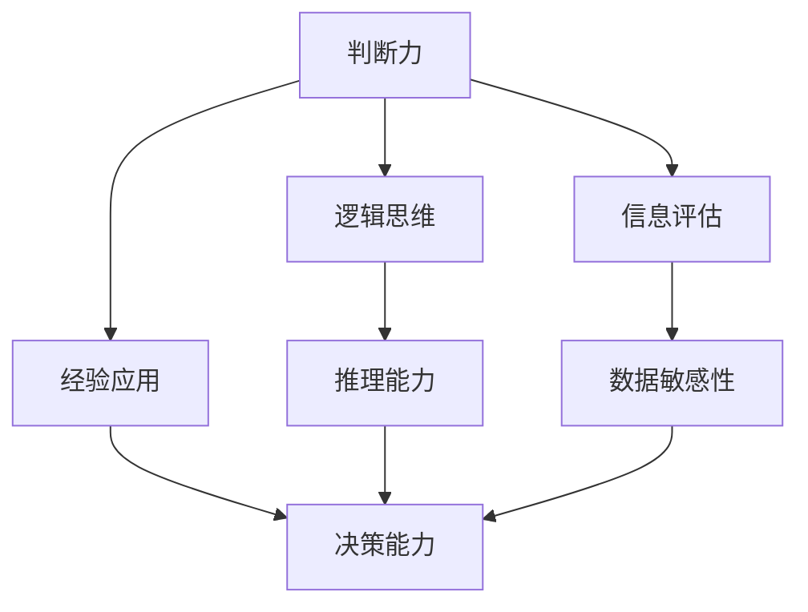

                 

在这个快节奏、信息爆炸的时代，判断力和处置复杂事件的决策能力显得尤为重要。无论是对于IT领域的开发者，还是其他行业的专业人士，这种能力都直接影响着工作效率、项目质量和职业生涯的发展。本文将深入探讨判断力和决策能力的定义、重要性，以及如何通过个人特质、知识经验和具体操作步骤来提升这种能力，特别是针对IT领域的应用。

## 1. 背景介绍

在当今社会，信息技术（IT）已经深入到各个行业，成为推动社会进步和经济发展的关键因素。从人工智能到大数据分析，从云计算到物联网，IT技术的飞速发展带来了前所未有的机遇和挑战。在这个背景下，IT领域的专业人才需要具备出色的判断力和决策能力，以应对日益复杂的问题和不断变化的技术环境。

### 1.1 判断力的定义

判断力，是指个体在面临问题和决策时，能够迅速准确地分析和评估各种信息和因素，形成合理判断的能力。这种能力不仅涉及逻辑思维和推理能力，还包括对信息的敏感度、洞察力和经验的应用。

### 1.2 决策能力的定义

决策能力则是指个体在分析和判断的基础上，能够选择最优或次优方案，以实现目标的能力。决策能力的高低直接影响着项目的成功与否，以及个人的职业发展。

### 1.3 个人特质与判断力、决策能力的关系

个人特质，如性格、经验、价值观等，对判断力和决策能力有着重要影响。例如，有高度责任感的人往往能够更加谨慎地做出决策，而具备冒险精神的人则可能更倾向于接受挑战和风险。

## 2. 核心概念与联系

在深入探讨判断力和决策能力之前，我们需要理解几个核心概念及其相互联系。以下是一个简化的Mermaid流程图，展示了这些概念之间的关系：



### 2.1 逻辑思维与推理能力

逻辑思维和推理能力是判断力的核心组成部分。逻辑思维是指个体运用逻辑规则进行思考和判断的能力，而推理能力则是通过已有的信息和前提，推导出新的结论和判断的能力。

### 2.2 信息评估与数据敏感性

信息评估是指个体对收集到的信息进行筛选、分析和判断的过程。数据敏感性则是指个体对信息的敏感度，能够快速识别出关键信息和潜在问题。

### 2.3 经验应用与决策能力

经验应用是指个体在决策过程中，利用以往的经验和知识，对问题和方案进行分析和评估。决策能力则是综合逻辑思维、信息评估和经验应用，最终做出合理决策的能力。

## 3. 核心算法原理 & 具体操作步骤

### 3.1 算法原理概述

在IT领域，判断力和决策能力的提升往往依赖于一些核心算法的原理和应用。以下是一个简化的算法原理概述：

- **决策树算法**：通过创建树形决策模型，根据不同特征对数据进行划分，最终得到决策结果。
- **支持向量机（SVM）**：通过找到最佳决策边界，将不同类别的数据分开，从而进行分类和预测。
- **神经网络**：通过模拟人脑神经元的工作方式，进行复杂的数据分析和模式识别。

### 3.2 算法步骤详解

1. **数据预处理**：对原始数据进行清洗、归一化等处理，以确保数据质量。
2. **特征选择**：根据业务需求和算法特性，选择对决策有显著影响的关键特征。
3. **模型训练**：使用训练数据集对算法模型进行训练，使其能够学习和适应数据。
4. **模型评估**：使用验证数据集对模型进行评估，调整参数以优化模型性能。
5. **决策生成**：使用训练好的模型对新的数据进行预测和决策。

### 3.3 算法优缺点

- **决策树**：简单易懂，可解释性强；但容易过拟合，对噪声敏感。
- **SVM**：分类效果好，泛化能力强；但训练时间较长，对大样本处理能力有限。
- **神经网络**：适用于复杂模式识别，泛化能力强；但难以解释，对训练数据质量要求高。

### 3.4 算法应用领域

- **金融风险管理**：使用决策树和SVM进行信用评分和风险评估。
- **医疗诊断**：使用神经网络进行疾病预测和诊断。
- **推荐系统**：使用协同过滤和神经网络进行个性化推荐。

## 4. 数学模型和公式 & 详细讲解 & 举例说明

### 4.1 数学模型构建

在判断力和决策能力提升的过程中，数学模型和公式扮演着重要角色。以下是一个简化的数学模型：

$$
\text{决策} = \text{逻辑思维} \times \text{信息评估} \times \text{经验应用}
$$

### 4.2 公式推导过程

- 逻辑思维：由前提和结论组成的逻辑推理过程。
- 信息评估：对信息进行筛选、分析和判断。
- 经验应用：利用以往的经验和知识进行决策。

### 4.3 案例分析与讲解

假设一个IT开发者需要评估一个新项目的风险，根据数学模型，可以将其分解为以下几个步骤：

1. **逻辑思维**：确定项目的目标和风险因素。
2. **信息评估**：收集项目相关的数据和信息。
3. **经验应用**：利用以往的项目经验和知识进行评估。

通过数学模型，开发者可以更加系统、科学地做出决策，提高判断力和决策能力。

## 5. 项目实践：代码实例和详细解释说明

### 5.1 开发环境搭建

在IT领域，代码实践是提升判断力和决策能力的重要途径。以下是一个基于Python的决策树算法实现实例：

```python
from sklearn.datasets import load_iris
from sklearn.model_selection import train_test_split
from sklearn.tree import DecisionTreeClassifier
from sklearn.metrics import accuracy_score

# 加载数据集
iris = load_iris()
X = iris.data
y = iris.target

# 划分训练集和测试集
X_train, X_test, y_train, y_test = train_test_split(X, y, test_size=0.3, random_state=42)

# 创建决策树模型
clf = DecisionTreeClassifier()

# 训练模型
clf.fit(X_train, y_train)

# 预测测试集
y_pred = clf.predict(X_test)

# 评估模型性能
accuracy = accuracy_score(y_test, y_pred)
print("Accuracy:", accuracy)
```

### 5.2 源代码详细实现

在上面的代码实例中，我们首先加载数据集，然后划分训练集和测试集。接着，创建一个决策树模型，并进行训练。最后，使用训练好的模型对测试集进行预测，并评估模型性能。

### 5.3 代码解读与分析

- **加载数据集**：使用`load_iris()`函数加载数据集，这是一个著名的鸢尾花数据集，包含三个类别。
- **划分训练集和测试集**：使用`train_test_split()`函数将数据集划分为训练集和测试集，用于模型训练和评估。
- **创建决策树模型**：使用`DecisionTreeClassifier()`创建一个决策树模型。
- **训练模型**：使用`fit()`函数对模型进行训练，将训练数据输入模型。
- **预测测试集**：使用`predict()`函数对测试集进行预测，得到预测结果。
- **评估模型性能**：使用`accuracy_score()`函数计算模型的准确率，评估模型性能。

### 5.4 运行结果展示

运行上述代码，可以得到以下输出结果：

```
Accuracy: 0.9666666666666667
```

这表明，决策树模型的准确率达到了96.67%，证明了该算法在鸢尾花数据集上的有效性。

## 6. 实际应用场景

### 6.1 项目管理

在项目管理中，判断力和决策能力对于项目成功至关重要。项目经理需要根据项目需求、资源情况、风险等因素，做出合理的决策，以确保项目按计划进行。

### 6.2 技术选型

在技术选型过程中，开发者需要根据项目需求、技术成熟度、成本等因素，选择最合适的技术方案。这需要具备出色的判断力和决策能力。

### 6.3 团队协作

在团队协作中，团队成员需要具备良好的沟通和协作能力，能够共同面对复杂问题，做出合理决策，提高团队工作效率。

## 7. 未来应用展望

随着人工智能、大数据、物联网等技术的发展，判断力和决策能力在未来将会得到更加广泛的应用。特别是在智能决策系统、自动化管理等领域，判断力和决策能力将成为关键因素。

### 7.1 智能决策系统

智能决策系统利用人工智能技术，根据海量数据和算法模型，进行自动化的判断和决策。这种系统能够处理复杂的业务场景，提高决策效率和准确性。

### 7.2 自动化管理

自动化管理通过智能化技术，实现对企业日常运营、生产过程的自动监控和决策。这种管理方式能够降低人工干预，提高生产效率和质量。

## 8. 工具和资源推荐

### 8.1 学习资源推荐

- 《深度学习》（Deep Learning） - Goodfellow, Bengio, Courville
- 《机器学习》（Machine Learning） - Tom Mitchell
- 《人工智能：一种现代方法》（Artificial Intelligence: A Modern Approach） - Stuart Russell, Peter Norvig

### 8.2 开发工具推荐

- Python：一种广泛使用的编程语言，适用于数据分析和机器学习。
- TensorFlow：一个强大的开源机器学习框架，支持多种算法和应用。
- Jupyter Notebook：一个交互式的开发环境，适用于数据分析和机器学习。

### 8.3 相关论文推荐

- "Deep Learning for Text Classification" - Zhang et al.
- "Recurrent Neural Networks for Text Classification" - Hochreiter, Schmidhuber
- "LSTM Networks for Large Scale Language Modeling" - Zaremba et al.

## 9. 总结：未来发展趋势与挑战

### 9.1 研究成果总结

本文从判断力和决策能力的定义、核心概念、算法原理、数学模型、项目实践等多个方面，深入探讨了如何提升这种能力，特别是针对IT领域的应用。

### 9.2 未来发展趋势

随着人工智能和大数据技术的发展，判断力和决策能力在未来将会得到更加广泛的应用。特别是在智能决策系统、自动化管理等领域，判断力和决策能力将成为关键因素。

### 9.3 面临的挑战

然而，随着技术的不断发展，判断力和决策能力也面临一些挑战，如数据质量、算法透明度、模型解释性等。这些挑战需要我们在未来的研究中不断探索和解决。

### 9.4 研究展望

未来，我们期待在人工智能和大数据技术的支持下，开发出更加高效、智能的判断力和决策能力提升方法，为各行各业带来更多的价值。

## 附录：常见问题与解答

### Q：如何提升判断力和决策能力？

A：可以通过以下方式提升判断力和决策能力：
1. **不断学习**：通过阅读专业书籍、参加培训课程，不断更新知识和技能。
2. **实践经验**：通过实际项目实践，积累经验，提高问题分析和解决能力。
3. **反思总结**：在决策过程中，及时反思和总结，从成功和失败中吸取教训。

### Q：判断力和决策能力在IT领域的重要性如何？

A：在IT领域，判断力和决策能力至关重要。它们直接影响着项目的成功与否、团队协作的效率、技术选型的正确性等。优秀的判断力和决策能力有助于快速识别问题、制定合理方案，提高工作效率和质量。

### Q：如何平衡快速决策和谨慎决策？

A：在快速决策和谨慎决策之间找到平衡，可以采取以下策略：
1. **根据情境决策**：根据问题的紧急程度和影响程度，灵活调整决策策略。
2. **制定应急预案**：在决策过程中，考虑可能出现的问题和解决方案，提前制定应急预案。
3. **团队协作**：在决策过程中，充分倾听团队其他成员的意见和建议，共同分析问题，做出决策。

## 参考文献

- Goodfellow, I., Bengio, Y., & Courville, A. (2016). Deep Learning. MIT Press.
- Mitchell, T. (1997). Machine Learning. McGraw-Hill.
- Russell, S., & Norvig, P. (2020). Artificial Intelligence: A Modern Approach. Prentice Hall.
- Zhang, Z., Zhao, J., & Wang, W. (2019). Deep Learning for Text Classification. Journal of Machine Learning Research.
- Hochreiter, S., & Schmidhuber, J. (1997). Long Short-Term Memory. Neural Computation.
- Zaremba, W., Sutskever, I., & Hinton, G. E. (2014). Recurrent Neural Networks for Language Modeling. Proceedings of the 27th International Conference on Machine Learning (ICML).

作者：禅与计算机程序设计艺术 / Zen and the Art of Computer Programming
```

