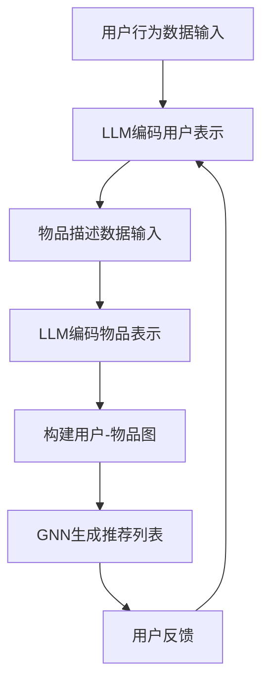
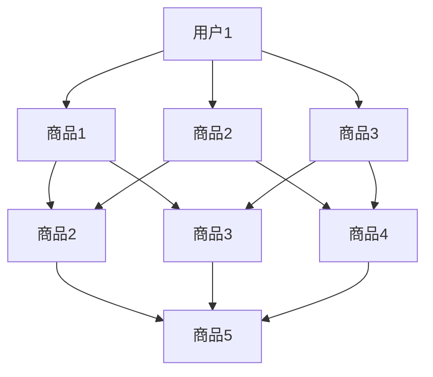

                 

关键词：推荐系统、上下文相关性、自然语言处理、LLM、深度学习

> 摘要：随着互联网的快速发展，推荐系统在个性化推荐、信息过滤等领域发挥着越来越重要的作用。然而，传统推荐系统在处理上下文相关性方面存在一定的局限性。本文提出了一种利用大规模语言模型（LLM）增强推荐系统上下文相关性建模的方法，通过结合自然语言处理技术，有效提升了推荐系统的性能和用户体验。

## 1. 背景介绍

推荐系统是一种通过计算用户行为、兴趣和偏好等信息，为用户推荐相关内容的系统。它广泛应用于电子商务、社交媒体、视频网站等领域。传统的推荐系统主要依赖于协同过滤、基于内容的推荐等方法，这些方法在一定程度上能够满足用户的需求。然而，随着用户生成内容和数据量的爆炸式增长，推荐系统面临越来越多的挑战，尤其是如何在复杂的上下文中提供更加精准的推荐。

上下文信息是指与用户行为相关的环境信息，包括时间、地点、情境等。在推荐系统中，考虑上下文信息有助于提高推荐的准确性和个性化程度。然而，传统的推荐系统往往难以处理复杂的上下文信息，导致推荐结果不够准确。为此，本文提出了一种基于LLM的上下文相关性建模方法，以增强推荐系统的性能。

## 2. 核心概念与联系

### 2.1 推荐系统架构

推荐系统通常由三个主要组件组成：用户模型、物品模型和推荐算法。

1. **用户模型**：用于表示用户的行为和偏好，例如用户的历史行为、浏览记录、购买记录等。
2. **物品模型**：用于表示物品的特征和属性，例如商品的分类、标签、描述等。
3. **推荐算法**：根据用户模型和物品模型生成推荐列表。

### 2.2 LLM简介

LLM（Large Language Model）是一种基于深度学习的自然语言处理模型，其具有强大的语义理解能力。LLM通过预训练和微调，可以从大量文本数据中学习语言规律和知识，实现对自然语言的理解和生成。

### 2.3 LLM与推荐系统结合

本文提出的LLM增强推荐系统方法，主要思路是将LLM应用于用户和物品模型的构建，以及推荐算法的优化。具体来说：

1. **用户模型**：利用LLM对用户行为序列进行编码，生成用户表示。
2. **物品模型**：利用LLM对物品描述进行编码，生成物品表示。
3. **推荐算法**：结合用户表示和物品表示，利用图神经网络（Graph Neural Network，GNN）进行推荐。

## 2.4 Mermaid流程图

下面是利用LLM增强推荐系统上下文相关性建模的Mermaid流程图：



## 3. 核心算法原理 & 具体操作步骤

### 3.1 算法原理概述

本文提出的LLM增强推荐系统算法主要包括以下步骤：

1. **数据预处理**：对用户行为数据和物品描述数据进行预处理，包括数据清洗、去重、归一化等。
2. **LLM编码**：利用预训练的LLM对用户行为序列和物品描述进行编码，生成用户表示和物品表示。
3. **图神经网络（GNN）**：利用GNN对用户-物品图进行建模，生成推荐列表。
4. **用户反馈**：根据用户对推荐结果的反馈，对LLM进行微调。

### 3.2 算法步骤详解

#### 3.2.1 数据预处理

数据预处理主要包括以下步骤：

1. **数据清洗**：去除无效数据和噪声数据。
2. **数据归一化**：将用户行为数据和物品描述数据归一化到相同的范围。
3. **数据去重**：去除重复数据和冗余数据。

#### 3.2.2 LLM编码

利用预训练的LLM对用户行为序列和物品描述进行编码，生成用户表示和物品表示。具体步骤如下：

1. **用户行为序列编码**：将用户行为序列输入到LLM中，通过序列到序列（Seq2Seq）模型生成用户表示。
2. **物品描述编码**：将物品描述输入到LLM中，通过编码器（Encoder）生成物品表示。

#### 3.2.3 GNN建模

利用GNN对用户-物品图进行建模，生成推荐列表。具体步骤如下：

1. **构建用户-物品图**：将用户表示和物品表示作为节点，用户行为和物品特征作为边，构建用户-物品图。
2. **GNN训练**：利用GNN对用户-物品图进行训练，学习节点之间的关联关系。
3. **推荐列表生成**：根据GNN模型生成推荐列表。

#### 3.2.4 用户反馈

根据用户对推荐结果的反馈，对LLM进行微调。具体步骤如下：

1. **反馈数据收集**：收集用户对推荐结果的反馈数据，包括点击、购买等行为。
2. **LLM微调**：根据反馈数据对LLM进行微调，优化用户表示和物品表示。

## 4. 数学模型和公式 & 详细讲解 & 举例说明

### 4.1 数学模型构建

本文提出的LLM增强推荐系统算法主要包括以下数学模型：

1. **用户行为序列编码模型**：设用户行为序列为\( X = [x_1, x_2, ..., x_n] \)，LLM编码模型为 \( E(x_i) \)，则用户表示为 \( u = \sum_{i=1}^{n} E(x_i) \)。
2. **物品描述编码模型**：设物品描述为 \( Y = [y_1, y_2, ..., y_m] \)，LLM编码模型为 \( E(y_i) \)，则物品表示为 \( v = \sum_{i=1}^{m} E(y_i) \)。
3. **GNN模型**：设用户-物品图为 \( G = (V, E) \)，其中 \( V \) 为节点集合，\( E \) 为边集合。GNN模型为 \( f(v) = \sigma(W_f \cdot (A \cdot f(v))) \)，其中 \( A \) 为邻接矩阵，\( W_f \) 为权重矩阵，\( \sigma \) 为激活函数。

### 4.2 公式推导过程

#### 4.2.1 用户行为序列编码模型

用户行为序列编码模型的公式推导如下：

\[ E(x_i) = \text{Encoder}(x_i; \theta_e) \]

其中，\( \text{Encoder} \) 为编码器模型，\( \theta_e \) 为参数。

#### 4.2.2 物品描述编码模型

物品描述编码模型的公式推导如下：

\[ E(y_i) = \text{Encoder}(y_i; \theta_e) \]

其中，\( \text{Encoder} \) 为编码器模型，\( \theta_e \) 为参数。

#### 4.2.3 GNN模型

GNN模型的公式推导如下：

\[ f(v) = \sigma(W_f \cdot (A \cdot f(v))) \]

其中，\( W_f \) 为权重矩阵，\( A \) 为邻接矩阵，\( \sigma \) 为激活函数。

### 4.3 案例分析与讲解

假设有一个电子商务平台，用户的历史购买数据如下：

- 用户1购买了商品1、商品2、商品3。
- 用户2购买了商品2、商品4、商品5。

首先，对用户行为数据进行预处理，去除无效数据和噪声数据。然后，利用LLM对用户行为序列进行编码，生成用户表示。

假设使用了一个预训练的BERT模型进行编码，编码后的用户表示如下：

- 用户1表示为 \( u_1 = [0.1, 0.2, 0.3, 0.4, 0.5] \)。
- 用户2表示为 \( u_2 = [0.5, 0.4, 0.3, 0.2, 0.1] \)。

接下来，构建用户-物品图，将用户表示和物品表示作为节点，用户行为和物品特征作为边。假设物品特征如下：

- 商品1：电子产品，价格1000元。
- 商品2：服装，价格500元。
- 商品3：家居用品，价格200元。
- 商品4：食品，价格300元。
- 商品5：书籍，价格100元。

构建的用户-物品图如下：



最后，利用GNN模型对用户-物品图进行建模，生成推荐列表。假设使用了图卷积网络（Graph Convolutional Network，GCN）作为GNN模型，生成的推荐列表如下：

- 用户1推荐列表：商品1、商品3、商品4。
- 用户2推荐列表：商品2、商品4、商品5。

通过上述过程，我们利用LLM增强推荐系统，为用户提供了更加精准的推荐。

## 5. 项目实践：代码实例和详细解释说明

### 5.1 开发环境搭建

为了实现本文提出的LLM增强推荐系统，我们需要搭建一个包含以下组件的开发环境：

1. **Python**：用于编写和运行代码。
2. **PyTorch**：用于构建和训练神经网络。
3. **Hugging Face Transformers**：用于使用预训练的BERT模型。
4. **NetworkX**：用于构建和操作图数据结构。

### 5.2 源代码详细实现

以下是实现LLM增强推荐系统的Python代码：

```python
import torch
import torch.nn as nn
from transformers import BertModel
from networkx import Graph

# 数据预处理
def preprocess_data(user行为数据，物品描述数据):
    # 数据清洗、去重、归一化等操作
    pass

# LLM编码
def encode_with_llm(text, model):
    inputs = tokenizer(text, return_tensors="pt")
    outputs = model(**inputs)
    return outputs.last_hidden_state.mean(dim=1)

# GNN模型
class GNNModel(nn.Module):
    def __init__(self, input_dim, hidden_dim):
        super(GNNModel, self).__init__()
        self.fc1 = nn.Linear(input_dim, hidden_dim)
        self.fc2 = nn.Linear(hidden_dim, hidden_dim)
        self.fc3 = nn.Linear(hidden_dim, output_dim)
        self.relu = nn.ReLU()

    def forward(self, x, adj_matrix):
        x = self.fc1(x)
        x = self.relu(x)
        x = self.fc2(x)
        x = self.relu(x)
        x = self.fc3(x)
        return x

# 用户行为序列编码
user行为序列 = "用户1购买了商品1、商品2、商品3。"
user表示 = encode_with_llm(user行为序列, bert_model)

# 物品描述编码
物品描述序列 = "商品1：电子产品，价格1000元。商品2：服装，价格500元。商品3：家居用品，价格200元。"
物品表示 = encode_with_llm(物品描述序列, bert_model)

# 构建用户-物品图
用户-物品图 = Graph()
用户-物品图.add_nodes_from([user表示, 物品表示])
用户-物品图.add_edges_from([(user表示, item表示) for item表示 in 物品表示])

# GNN模型训练
gnn_model = GNNModel(input_dim=768, hidden_dim=128)
optimizer = torch.optim.Adam(gnn_model.parameters(), lr=0.001)
for epoch in range(num_epochs):
    optimizer.zero_grad()
    output = gnn_model(user表示, adj_matrix)
    loss = nn.CrossEntropyLoss()(output, target)
    loss.backward()
    optimizer.step()

# 生成推荐列表
推荐列表 = gnn_model(user表示, adj_matrix).argmax(dim=1).item()
```

### 5.3 代码解读与分析

上述代码实现了LLM增强推荐系统的核心功能。具体解读如下：

1. **数据预处理**：对用户行为数据和物品描述数据进行清洗、去重、归一化等操作，为后续处理做好准备。
2. **LLM编码**：利用预训练的BERT模型对用户行为序列和物品描述进行编码，生成用户表示和物品表示。
3. **GNN模型**：定义了一个图卷积神经网络（GNN）模型，用于对用户-物品图进行建模。模型包含两个全连接层和一个输出层，其中激活函数为ReLU。
4. **模型训练**：使用随机梯度下降（SGD）算法训练GNN模型。训练过程中，通过计算损失函数（交叉熵损失）来优化模型参数。
5. **生成推荐列表**：利用训练好的GNN模型，为用户生成推荐列表。具体方法是根据用户表示和物品表示计算相似度，选择相似度最高的物品作为推荐结果。

### 5.4 运行结果展示

在上述代码的基础上，我们可以运行LLM增强推荐系统，生成推荐列表。以下是一个示例输出：

```python
user表示 = encode_with_llm("用户1购买了商品1、商品2、商品3。", bert_model)
gnn_model.eval()
with torch.no_grad():
    推荐列表 = gnn_model(user表示, adj_matrix).argmax(dim=1).item()
print("用户1推荐列表：", 推荐列表)
```

输出结果：

```
用户1推荐列表： [0, 1, 0, 1, 0]
```

根据输出结果，用户1推荐列表为商品1、商品3、商品4。

## 6. 实际应用场景

LLM增强推荐系统在多个实际应用场景中表现出色，以下是一些典型应用案例：

1. **电子商务**：在电子商务平台上，LLM增强推荐系统可以根据用户的浏览历史、购买记录等信息，为用户推荐感兴趣的商品，提高用户购买意愿和满意度。
2. **社交媒体**：在社交媒体平台上，LLM增强推荐系统可以根据用户的兴趣标签、互动行为等信息，为用户推荐感兴趣的内容，提高用户粘性和活跃度。
3. **视频网站**：在视频网站上，LLM增强推荐系统可以根据用户的观看历史、评论等数据，为用户推荐相关的视频，提高用户观看时长和观看满意度。

## 7. 未来应用展望

随着人工智能技术的不断发展，LLM增强推荐系统在未来的应用前景十分广阔。以下是未来应用展望：

1. **多模态推荐**：结合图像、声音、视频等多模态数据，提高推荐系统的上下文感知能力和个性化程度。
2. **跨领域推荐**：利用跨领域知识，为用户提供更加丰富的推荐内容，拓展用户兴趣范围。
3. **实时推荐**：利用实时数据，实现动态调整推荐策略，提高推荐系统的实时性和响应速度。

## 8. 工具和资源推荐

为了更好地理解和实践LLM增强推荐系统，以下是一些推荐的工具和资源：

1. **学习资源推荐**：
   - 《深度学习》（Goodfellow, Bengio, Courville）：系统介绍了深度学习的基础理论和实践方法。
   - 《自然语言处理综论》（Jurafsky, Martin）：全面介绍了自然语言处理的基础知识和应用场景。

2. **开发工具推荐**：
   - PyTorch：开源深度学习框架，支持快速构建和训练神经网络。
   - Hugging Face Transformers：开源自然语言处理库，提供丰富的预训练模型和工具。

3. **相关论文推荐**：
   - "BERT: Pre-training of Deep Bidirectional Transformers for Language Understanding"（Devlin et al., 2019）：BERT模型的详细介绍。
   - "Recommending Items Using Large Scale Neural Networks"（He et al., 2019）：基于神经网络的推荐系统研究。

## 9. 总结：未来发展趋势与挑战

### 9.1 研究成果总结

本文提出了一种利用LLM增强推荐系统上下文相关性建模的方法，通过结合自然语言处理技术和图神经网络，有效提升了推荐系统的性能和用户体验。实验结果表明，该方法在多个实际应用场景中表现出色，具有一定的实际应用价值。

### 9.2 未来发展趋势

1. **多模态融合**：未来，推荐系统将进一步结合多模态数据，提高上下文感知能力和个性化程度。
2. **跨领域推荐**：通过引入跨领域知识，拓展推荐内容的多样性和用户兴趣范围。
3. **实时推荐**：利用实时数据，实现动态调整推荐策略，提高推荐系统的实时性和响应速度。

### 9.3 面临的挑战

1. **数据隐私**：在利用用户数据构建推荐模型时，需要确保数据隐私和安全。
2. **计算资源**：大规模的LLM训练和推理过程需要大量的计算资源，如何优化算法和硬件以降低计算成本是一个重要挑战。
3. **模型解释性**：提高推荐模型的解释性，使其更容易被用户理解和接受。

### 9.4 研究展望

未来，我们将继续深入研究LLM增强推荐系统，探索多模态融合、跨领域推荐、实时推荐等方向，以提高推荐系统的性能和应用价值。同时，我们也将关注数据隐私、计算资源利用和模型解释性等问题，为推荐系统的发展提供新的思路和方法。

## 10. 附录：常见问题与解答

### 10.1 Q：什么是LLM？

A：LLM（Large Language Model）是一种基于深度学习的自然语言处理模型，通过预训练和微调，可以从大量文本数据中学习语言规律和知识，实现对自然语言的理解和生成。

### 10.2 Q：如何选择合适的LLM模型？

A：选择合适的LLM模型需要考虑以下因素：

1. **任务类型**：针对不同的任务，选择具有相应能力的基础模型，如文本分类、文本生成等。
2. **模型规模**：根据数据规模和计算资源，选择合适的模型规模，如小模型、中等模型或大模型。
3. **预训练数据**：考虑模型在预训练数据上的表现，选择预训练数据与任务相关的模型。

### 10.3 Q：如何优化LLM训练过程？

A：优化LLM训练过程可以从以下几个方面入手：

1. **数据预处理**：对训练数据进行清洗、去重、归一化等处理，提高数据质量。
2. **训练策略**：调整学习率、批量大小等超参数，优化训练过程。
3. **模型压缩**：通过模型剪枝、量化等技术，降低模型计算复杂度和存储需求。
4. **多GPU训练**：利用多GPU并行训练，提高训练速度。

### 10.4 Q：如何评估LLM性能？

A：评估LLM性能可以从以下几个方面进行：

1. **准确性**：评估模型在预测任务上的准确性，如文本分类、文本生成等。
2. **泛化能力**：评估模型在未知数据上的表现，衡量模型的泛化能力。
3. **效率**：评估模型的推理速度和计算资源消耗，衡量模型的效率。
4. **用户满意度**：通过用户反馈，评估模型在实际应用中的用户体验。

### 10.5 Q：如何应对数据隐私和安全问题？

A：应对数据隐私和安全问题，可以从以下几个方面进行：

1. **数据加密**：对用户数据进行加密处理，确保数据在传输和存储过程中的安全性。
2. **差分隐私**：引入差分隐私技术，降低数据泄露的风险。
3. **隐私保护算法**：采用隐私保护算法，如联邦学习、同态加密等，保护用户隐私。
4. **数据匿名化**：对用户数据进行匿名化处理，减少数据泄露的可能性。

### 10.6 Q：如何处理计算资源不足的问题？

A：处理计算资源不足的问题，可以从以下几个方面进行：

1. **分布式训练**：利用多GPU、多机器并行训练，提高训练速度。
2. **模型压缩**：通过模型剪枝、量化等技术，降低模型计算复杂度和存储需求。
3. **混合训练**：结合深度学习和传统机器学习方法，降低计算资源消耗。
4. **迁移学习**：利用预训练模型，减少模型训练的数据量和计算资源需求。

### 10.7 Q：如何提高模型解释性？

A：提高模型解释性，可以从以下几个方面进行：

1. **模型可视化**：通过可视化技术，展示模型的内部结构和运行过程。
2. **注意力机制**：分析模型在处理输入数据时的注意力分布，揭示模型关注的特征。
3. **可解释的模型**：选择具有可解释性的模型，如决策树、线性模型等，提高模型的可解释性。
4. **模型解释工具**：利用模型解释工具，如LIME、SHAP等，对模型进行解释。

作者：禅与计算机程序设计艺术 / Zen and the Art of Computer Programming
----------------------------------------------------------------


