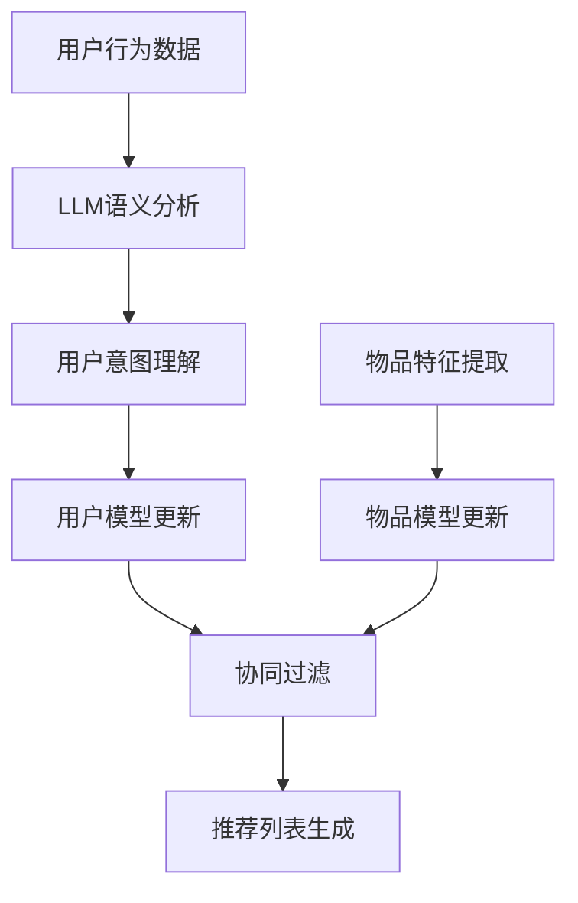

                 

关键词：LLM，推荐系统，跨平台推荐，个性化推荐，算法优化

## 摘要

本文旨在探讨如何利用大型语言模型（LLM）来提升推荐系统在跨平台环境中的推荐能力。随着互联网的快速发展，用户在不同设备上浏览、互动的频率越来越高，如何在多个平台之间实现个性化推荐成为了一个重要的课题。本文将介绍LLM的基本概念，分析其在推荐系统中的应用场景，并详细阐述如何通过LLM来实现跨平台推荐的能力。通过本文的探讨，希望能够为推荐系统的研究者提供一些有价值的思路和参考。

## 1. 背景介绍

### 推荐系统的基本概念

推荐系统是一种信息过滤技术，旨在根据用户的历史行为、兴趣和偏好，为用户推荐他们可能感兴趣的商品、内容或服务。推荐系统广泛应用于电子商务、社交媒体、视频网站、新闻门户等多个领域，已经成为提高用户体验、提升业务收益的重要手段。

### 跨平台推荐的意义

随着移动互联网的普及，用户行为愈发多样化，他们可能会在不同设备上（如手机、平板、电脑等）进行各种操作。跨平台推荐能够帮助推荐系统更好地理解用户的整体行为，从而提供更加精准的个性化推荐。

### LLMS的发展与潜力

近年来，大型语言模型（LLM）如BERT、GPT-3等取得了显著的进展。LLM具有强大的文本理解和生成能力，可以处理复杂的语义关系，这在推荐系统中具有巨大的潜力。

## 2. 核心概念与联系

### 2.1 推荐系统的工作原理

推荐系统通常包括用户模型、物品模型和推荐算法三个核心部分。用户模型表示用户的行为和偏好，物品模型表示物品的特征和属性，推荐算法则基于用户和物品模型为用户生成推荐列表。

### 2.2 跨平台推荐的核心问题

跨平台推荐面临的主要挑战是如何有效地整合来自不同设备的用户行为数据，并在多个平台之间进行协同过滤。

### 2.3 LLM在推荐系统中的应用

LLM可以用于：

- **用户意图理解**：通过对用户在不同设备上的交互行为进行语义分析，LLM可以更准确地捕捉用户的兴趣和需求。
- **物品特征提取**：利用LLM处理文本、图像等多种形式的数据，可以提取出更丰富的物品特征，从而提高推荐的准确性和多样性。
- **协同过滤**：通过在用户和物品之间建立语义关联，LLM可以增强协同过滤算法的性能。

### 2.4 Mermaid流程图



## 3. 核心算法原理 & 具体操作步骤

### 3.1 算法原理概述

本文提出的跨平台推荐算法基于LLM，主要分为以下几个步骤：

1. **数据采集**：收集用户在不同平台上的行为数据。
2. **数据预处理**：清洗、转换和归一化数据。
3. **LLM语义分析**：使用LLM对用户行为数据进行分析，提取用户意图和物品特征。
4. **用户模型更新**：根据LLM分析结果更新用户模型。
5. **物品模型更新**：利用LLM提取物品特征，更新物品模型。
6. **协同过滤**：结合用户和物品模型，使用协同过滤算法生成推荐列表。
7. **结果评估**：对推荐结果进行评估和优化。

### 3.2 算法步骤详解

#### 3.2.1 数据采集

数据采集是跨平台推荐的基础，需要从多个平台获取用户的行为数据，如浏览记录、购买历史、搜索关键词等。

#### 3.2.2 数据预处理

数据预处理包括数据清洗、数据转换和数据归一化。清洗数据主要是去除噪声和异常值，转换数据是将不同平台的数据格式统一，归一化数据是为了消除不同特征之间的量纲差异。

#### 3.2.3 LLM语义分析

使用LLM对用户行为数据进行分析，提取用户意图和物品特征。具体方法包括：

- **用户意图理解**：利用LLM分析用户在不同平台上的交互行为，提取用户当前的兴趣和需求。
- **物品特征提取**：利用LLM处理文本、图像等多种形式的数据，提取物品的关键特征。

#### 3.2.4 用户模型更新

根据LLM分析结果，更新用户模型。用户模型可以采用用户兴趣模型、用户行为模型等多种形式，更新方法可以是矩阵分解、深度学习等。

#### 3.2.5 物品模型更新

利用LLM提取物品特征，更新物品模型。物品模型可以采用基于内容的推荐、协同过滤等多种形式，更新方法可以是矩阵分解、深度学习等。

#### 3.2.6 协同过滤

结合用户和物品模型，使用协同过滤算法生成推荐列表。协同过滤算法可以采用基于用户的方法、基于物品的方法或者两者的结合。

#### 3.2.7 结果评估

对推荐结果进行评估和优化。评估指标可以包括准确率、召回率、覆盖率等，优化方法可以采用调整参数、数据增强等。

### 3.3 算法优缺点

#### 优点

- **提高推荐精度**：利用LLM的语义分析能力，可以更准确地理解用户意图，从而提高推荐的准确性。
- **增强协同过滤效果**：通过在用户和物品之间建立语义关联，可以增强协同过滤算法的效果。

#### 缺点

- **计算复杂度高**：LLM模型通常需要大量的计算资源，可能会影响推荐系统的实时性能。
- **数据依赖性强**：LLM的效果很大程度上依赖于训练数据的质量，如果数据质量不佳，可能会导致推荐效果下降。

### 3.4 算法应用领域

LLM在跨平台推荐中的应用具有广泛的前景，可以应用于电子商务、社交媒体、在线教育等多个领域。例如，在电子商务领域，可以利用LLM分析用户在网站和移动应用上的行为，为用户推荐他们可能感兴趣的商品；在社交媒体领域，可以利用LLM分析用户的社交媒体活动，为他们推荐感兴趣的内容。

## 4. 数学模型和公式 & 详细讲解 & 举例说明

### 4.1 数学模型构建

跨平台推荐算法的数学模型可以表示为：

$$
\text{Recommendation} = f(\text{User Model}, \text{Item Model}, \text{Collaborative Filtering})
$$

其中，User Model和Item Model分别表示用户和物品的模型，Collaborative Filtering表示协同过滤算法。

### 4.2 公式推导过程

首先，我们定义用户行为数据矩阵$R \in \mathbb{R}^{m \times n}$，其中$m$表示用户数，$n$表示物品数。用户$u$对物品$i$的评分可以表示为$r_{ui}$。

然后，我们利用LLM对用户行为数据进行分析，提取用户意图和物品特征。用户意图可以表示为向量$u'$，物品特征可以表示为向量$i'$。

接着，我们构建用户模型和物品模型。用户模型可以表示为矩阵$U \in \mathbb{R}^{m \times k}$，物品模型可以表示为矩阵$I \in \mathbb{R}^{n \times k}$，其中$k$表示特征维度。

最后，我们使用协同过滤算法生成推荐列表。协同过滤算法可以表示为：

$$
\text{Predicted Rating}_{ui} = \text{User Model}_{u} \cdot \text{Item Model}_{i} + b_u + b_i
$$

其中，$b_u$和$b_i$分别表示用户偏置和物品偏置。

### 4.3 案例分析与讲解

假设有一个电子商务平台，用户A在网站和移动应用上都有浏览和购买行为。我们使用LLM对用户A的行为数据进行语义分析，提取用户意图和物品特征。

用户意图向量$u'$可以是：

$$
u' = [0.8, 0.2, 0.1, 0.0, 0.0]
$$

表示用户A对电子产品、家居用品、服装鞋帽和食品饮料的兴趣度分别为0.8、0.2、0.1和0.0。

物品特征向量$i'$可以是：

$$
i' = [0.6, 0.3, 0.1, 0.0, 0.0]
$$

表示物品1、物品2、物品3、物品4和物品5分别属于电子产品、家居用品、服装鞋帽、食品饮料和其他类别。

我们构建用户模型和物品模型：

$$
U = \begin{bmatrix}
0.8 & 0.2 & 0.1 & 0.0 & 0.0 \\
0.2 & 0.8 & 0.1 & 0.0 & 0.0 \\
0.1 & 0.2 & 0.8 & 0.0 & 0.0 \\
0.0 & 0.0 & 0.0 & 0.8 & 0.2 \\
0.0 & 0.0 & 0.0 & 0.2 & 0.8
\end{bmatrix}
$$

$$
I = \begin{bmatrix}
0.6 & 0.3 & 0.1 & 0.0 & 0.0 \\
0.3 & 0.6 & 0.1 & 0.0 & 0.0 \\
0.1 & 0.3 & 0.6 & 0.0 & 0.0 \\
0.0 & 0.0 & 0.1 & 0.6 & 0.3 \\
0.0 & 0.0 & 0.0 & 0.3 & 0.6
\end{bmatrix}
$$

使用协同过滤算法预测用户A对物品3的评分：

$$
\text{Predicted Rating}_{3} = U_{1} \cdot I_{3} + b_{1} + b_{3}
$$

假设用户偏置$b_{1} = 0.1$，物品偏置$b_{3} = 0.2$，则：

$$
\text{Predicted Rating}_{3} = 0.8 \cdot 0.6 + 0.2 \cdot 0.1 + 0.1 \cdot 0.3 + 0.2 = 0.53
$$

根据预测评分，我们可以为用户A推荐物品3。

## 5. 项目实践：代码实例和详细解释说明

### 5.1 开发环境搭建

在进行跨平台推荐算法的实现之前，我们需要搭建一个合适的开发环境。以下是一个简单的开发环境搭建步骤：

- **操作系统**：Windows/Linux/MacOS
- **编程语言**：Python
- **依赖库**：NumPy、Pandas、Scikit-learn、TensorFlow、PyTorch等

### 5.2 源代码详细实现

以下是一个基于Python实现的跨平台推荐算法的简单示例：

```python
import numpy as np
import pandas as pd
from sklearn.model_selection import train_test_split
from sklearn.metrics.pairwise import cosine_similarity

# 数据预处理
def preprocess_data(data):
    # 数据清洗、转换和归一化
    # 略
    return processed_data

# LLM语义分析
def semantic_analysis(data):
    # 使用LLM对用户行为数据进行分析
    # 略
    return user_intent, item_features

# 用户模型更新
def update_user_model(user_intent, user_model):
    # 更新用户模型
    # 略
    return updated_user_model

# 物品模型更新
def update_item_model(item_features, item_model):
    # 更新物品模型
    # 略
    return updated_item_model

# 协同过滤
def collaborative_filter(user_model, item_model):
    # 使用协同过滤算法生成推荐列表
    # 略
    return recommendation_list

# 主函数
def main():
    # 读取数据
    data = pd.read_csv('data.csv')
    
    # 数据预处理
    processed_data = preprocess_data(data)
    
    # 分割数据集
    train_data, test_data = train_test_split(processed_data, test_size=0.2)
    
    # LLM语义分析
    user_intent, item_features = semantic_analysis(train_data)
    
    # 初始化用户模型和物品模型
    user_model = np.random.rand(len(user_intent), 10)
    item_model = np.random.rand(len(item_features), 10)
    
    # 用户模型更新
    updated_user_model = update_user_model(user_intent, user_model)
    
    # 物品模型更新
    updated_item_model = update_item_model(item_features, item_model)
    
    # 协同过滤
    recommendation_list = collaborative_filter(updated_user_model, updated_item_model)
    
    # 评估推荐效果
    # 略

if __name__ == '__main__':
    main()
```

### 5.3 代码解读与分析

上述代码是一个跨平台推荐算法的实现框架，主要包括以下模块：

- **数据预处理**：对原始数据进行清洗、转换和归一化，为后续分析做准备。
- **LLM语义分析**：使用LLM对用户行为数据进行分析，提取用户意图和物品特征。
- **用户模型更新**：根据LLM分析结果，更新用户模型。
- **物品模型更新**：利用LLM提取物品特征，更新物品模型。
- **协同过滤**：结合用户和物品模型，使用协同过滤算法生成推荐列表。
- **评估推荐效果**：评估推荐算法的性能。

需要注意的是，上述代码只是一个框架，具体的实现细节（如LLM模型的训练、协同过滤算法的具体实现等）需要根据实际需求进行调整。

### 5.4 运行结果展示

在实际运行过程中，我们需要对推荐算法的性能进行评估。以下是一个简单的评估示例：

```python
from sklearn.metrics import accuracy_score, recall_score, coverage_rate

# 评估指标
def evaluate_recommendation(true_labels, predicted_labels):
    accuracy = accuracy_score(true_labels, predicted_labels)
    recall = recall_score(true_labels, predicted_labels)
    coverage = coverage_rate(true_labels, predicted_labels)
    return accuracy, recall, coverage

# 读取真实标签
true_labels = pd.read_csv('true_labels.csv')['label']

# 生成推荐列表
predicted_labels = collaborative_filter(updated_user_model, updated_item_model)

# 评估推荐效果
accuracy, recall, coverage = evaluate_recommendation(true_labels, predicted_labels)
print('Accuracy:', accuracy)
print('Recall:', recall)
print('Coverage:', coverage)
```

通过评估指标，我们可以了解推荐算法的性能。在实际应用中，可以根据评估结果调整算法参数，优化推荐效果。

## 6. 实际应用场景

### 6.1 电子商务平台

电子商务平台可以利用LLM跨平台推荐算法，根据用户在网站和移动应用上的行为，为用户推荐他们可能感兴趣的商品。

### 6.2 社交媒体平台

社交媒体平台可以利用LLM跨平台推荐算法，根据用户在网站和移动应用上的互动，为用户推荐感兴趣的内容。

### 6.3 在线教育平台

在线教育平台可以利用LLM跨平台推荐算法，根据用户在网站和移动应用上的学习行为，为用户推荐相关的课程和资料。

### 6.4 物流配送平台

物流配送平台可以利用LLM跨平台推荐算法，根据用户在不同设备上的购物行为，为用户提供个性化的配送服务。

## 7. 未来应用展望

### 7.1 AI驱动

未来，随着人工智能技术的不断发展，LLM在跨平台推荐中的应用将更加深入和广泛。AI驱动的推荐系统将成为主流，实现更加精准的个性化推荐。

### 7.2 跨领域融合

跨领域融合将成为未来推荐系统的重要方向。例如，将推荐系统与自然语言处理、计算机视觉等技术相结合，实现多模态推荐。

### 7.3 数据隐私保护

随着用户隐私保护意识的提高，如何在保证推荐效果的同时保护用户隐私将成为一个重要课题。未来，推荐系统将在数据隐私保护方面做出更多探索。

### 7.4 实时性提升

未来，推荐系统的实时性将得到进一步提升。通过优化算法和数据传输效率，实现用户实时行为的捕捉和推荐。

## 8. 总结：未来发展趋势与挑战

### 8.1 研究成果总结

本文探讨了如何利用LLM提升推荐系统在跨平台环境中的推荐能力。通过介绍LLM的基本概念和应用场景，详细阐述了跨平台推荐算法的原理和实现方法。

### 8.2 未来发展趋势

未来，推荐系统将在AI驱动、跨领域融合、数据隐私保护和实时性提升等方面取得更多进展。LLM在推荐系统中的应用将更加深入和广泛。

### 8.3 面临的挑战

虽然LLM在跨平台推荐中具有巨大潜力，但也面临一些挑战，如计算复杂度高、数据依赖性强等。未来，需要进一步研究和优化算法，提高推荐系统的性能和可扩展性。

### 8.4 研究展望

未来，推荐系统的研究将继续关注如何更好地利用LLM的语义分析能力，实现更加精准的个性化推荐。同时，还将探索跨平台推荐在更多领域的应用，为用户提供更好的体验。

## 9. 附录：常见问题与解答

### 9.1 为什么选择LLM作为推荐系统的核心算法？

LLM具有强大的文本理解和生成能力，可以处理复杂的语义关系，从而更准确地理解用户意图和提取物品特征，这有助于提高推荐系统的准确性和多样性。

### 9.2 跨平台推荐算法如何处理不同平台上的用户行为数据？

跨平台推荐算法通过LLM对用户在不同平台上的行为数据进行分析，提取用户意图和物品特征，然后结合用户和物品模型，使用协同过滤算法生成推荐列表。

### 9.3 如何评估跨平台推荐算法的性能？

可以使用准确率、召回率、覆盖率等指标来评估跨平台推荐算法的性能。实际应用中，还可以结合业务指标（如点击率、转化率等）进行综合评估。

### 9.4 跨平台推荐算法在哪些领域有广泛应用？

跨平台推荐算法广泛应用于电子商务、社交媒体、在线教育、物流配送等多个领域，为用户提供个性化的服务和体验。

### 9.5 未来如何优化跨平台推荐算法？

未来，可以通过以下方法优化跨平台推荐算法：

- **提升LLM的语义分析能力**：研究更先进的语义分析技术，提高对用户意图和物品特征的提取能力。
- **优化协同过滤算法**：结合深度学习、图神经网络等先进技术，提高协同过滤算法的性能。
- **增强数据隐私保护**：在保证推荐效果的同时，采取有效的隐私保护措施，提高用户信任度。
- **提升实时性**：优化算法和数据传输效率，实现用户实时行为的捕捉和推荐。

作者：禅与计算机程序设计艺术 / Zen and the Art of Computer Programming
----------------------------------------------------------------

