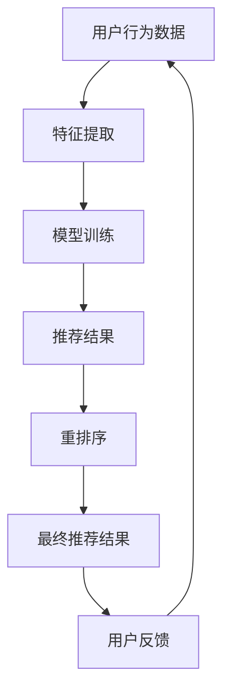

                 

关键词：推荐系统、重排序、大模型、优化、算法、实践、应用场景、未来展望

<|assistant|>摘要：随着大数据和人工智能技术的快速发展，推荐系统已经成为电商平台、社交媒体、视频网站等众多场景中的核心技术。本文将探讨如何利用大模型优化推荐系统的重排序策略，提升用户体验和系统性能。我们将从核心概念、算法原理、数学模型、项目实践等多个方面进行详细分析，并结合实际案例展示大模型在推荐系统重排序中的应用效果。

## 1. 背景介绍

推荐系统是近年来人工智能领域的一个重要研究方向，其目的是通过分析用户的历史行为和兴趣，向用户推荐他们可能感兴趣的内容或商品。随着互联网的普及和用户数据的爆炸式增长，推荐系统在电子商务、在线媒体、社交网络等各个领域得到了广泛应用。

推荐系统的核心任务之一是对推荐结果进行重排序，即将不同质量的内容或商品按照用户兴趣的优先级进行排列，从而提高用户满意度和系统性能。传统的重排序方法通常基于规则、机器学习或深度学习技术，但这些方法往往存在一定的局限性，如准确率低、计算复杂度高、可解释性差等。

随着大模型的兴起，如GPT、BERT等预训练语言模型，它们在自然语言处理任务中取得了显著的成果。这些大模型具有强大的表征能力和丰富的知识库，为优化推荐系统的重排序策略提供了新的思路。本文将探讨如何利用大模型优化推荐系统的重排序策略，并从算法原理、数学模型、项目实践等多个方面进行详细分析。

## 2. 核心概念与联系

在探讨如何利用大模型优化推荐系统的重排序策略之前，我们需要先了解一些核心概念和联系。

### 2.1 推荐系统

推荐系统是一种基于数据挖掘和机器学习技术的系统，其目的是根据用户的历史行为、兴趣偏好和上下文信息，向用户推荐他们可能感兴趣的内容或商品。推荐系统通常由数据预处理、特征工程、模型训练和预测等几个关键步骤组成。

### 2.2 重排序

重排序（Re-ranking）是推荐系统中的一个重要步骤，其目的是将原始推荐结果进行重新排列，从而提高推荐质量。重排序可以基于多种策略，如基于规则的方法、基于机器学习的方法和基于深度学习的方法。

### 2.3 大模型

大模型（Large Model）是指具有数十亿甚至千亿参数规模的人工神经网络模型。这些模型通过在大量数据上进行预训练，能够获得强大的表征能力和泛化能力。大模型在自然语言处理、计算机视觉、语音识别等众多领域取得了显著的成果。

### 2.4 推荐系统与重排序的联系

推荐系统与重排序之间存在紧密的联系。重排序是推荐系统中的一个关键环节，它直接影响到推荐质量。而大模型作为一种强大的表征工具，可以为重排序提供更准确的特征表示和更好的决策依据。因此，利用大模型优化推荐系统的重排序策略具有重要意义。

### 2.5 Mermaid 流程图

下面是一个简单的Mermaid流程图，展示了推荐系统中重排序的过程和相关核心概念：



通过这个流程图，我们可以更直观地理解推荐系统中重排序的作用和地位。

## 3. 核心算法原理 & 具体操作步骤

### 3.1 算法原理概述

利用大模型优化推荐系统的重排序策略主要基于以下几个核心原理：

1. **多模态特征融合**：大模型能够处理多种类型的输入数据，如文本、图像、语音等，通过多模态特征融合，可以更好地捕捉用户的兴趣偏好。
2. **深度神经网络**：大模型通常采用深度神经网络结构，能够自动学习复杂的特征表示，从而提高重排序的准确性。
3. **端到端训练**：大模型能够实现端到端的训练，从原始数据直接生成推荐结果，减少了人工特征工程的工作量。
4. **知识蒸馏**：通过知识蒸馏技术，可以将大模型的知识传递给小模型，从而在计算资源有限的场景中应用大模型。

### 3.2 算法步骤详解

利用大模型优化推荐系统的重排序策略主要包括以下几个步骤：

1. **数据预处理**：对用户行为数据进行清洗、去噪和归一化处理，确保数据质量。
2. **特征提取**：利用大模型对原始数据进行特征提取，生成多模态特征向量。
3. **模型训练**：使用提取到的特征向量训练大模型，使其能够学习用户的兴趣偏好。
4. **重排序**：将大模型训练得到的特征向量应用于原始推荐结果，进行重排序。
5. **评估与优化**：对重排序结果进行评估，根据评估结果调整模型参数，优化重排序策略。

### 3.3 算法优缺点

**优点**：

1. **高准确性**：大模型能够自动学习复杂的特征表示，从而提高重排序的准确性。
2. **可解释性**：通过多模态特征融合和深度神经网络结构，重排序过程具有较好的可解释性。
3. **端到端训练**：大模型能够实现端到端的训练，减少了人工特征工程的工作量。

**缺点**：

1. **计算复杂度高**：大模型通常需要大量的计算资源和时间进行训练和推理。
2. **数据依赖性强**：大模型对数据质量有较高要求，数据不足或质量较差可能导致模型性能下降。

### 3.4 算法应用领域

利用大模型优化推荐系统的重排序策略可以应用于多个领域，如电子商务、在线媒体、社交网络等。以下是一些具体的应用场景：

1. **电子商务**：通过对用户购买行为进行重排序，提高商品的曝光率和销售量。
2. **在线媒体**：对用户观看历史和兴趣标签进行重排序，推荐更符合用户兴趣的内容。
3. **社交网络**：根据用户互动行为和好友关系，对社交信息进行重排序，提高用户参与度。

## 4. 数学模型和公式 & 详细讲解 & 举例说明

### 4.1 数学模型构建

为了更详细地理解大模型在推荐系统重排序中的应用，我们需要介绍一些相关的数学模型和公式。

假设我们有一个推荐系统，其中包含 \(N\) 个用户和 \(M\) 个商品。用户的行为数据可以表示为 \(U = \{u_1, u_2, ..., u_N\}\)，其中每个用户的行为数据集 \(u_i\) 包含了他们访问的商品序列。商品数据可以表示为 \(I = \{i_1, i_2, ..., i_M\}\)，其中每个商品的数据集 \(i_j\) 包含了商品的特征信息。

我们可以使用一个矩阵 \(X \in \mathbb{R}^{N \times M}\) 来表示用户和商品之间的关系，其中 \(X_{ij}\) 表示用户 \(i\) 对商品 \(j\) 的兴趣程度。根据用户的行为数据和商品特征信息，我们可以训练一个基于深度学习的大模型，其输出可以表示为 \(Y \in \mathbb{R}^{N \times M}\)，其中 \(Y_{ij}\) 表示用户 \(i\) 对商品 \(j\) 的重排序打分。

### 4.2 公式推导过程

为了推导大模型的公式，我们首先需要介绍一些相关的深度学习模型。

假设我们使用一个基于多层感知机（MLP）的深度学习模型，其输入为 \(X\)，输出为 \(Y\)。MLP 模型通常由多个全连接层组成，每个全连接层通过一个非线性激活函数（如ReLU）进行激活。

1. **输入层到隐藏层**：

   假设输入层到隐藏层的权重矩阵为 \(W_1 \in \mathbb{R}^{D_1 \times D_0}\)，其中 \(D_0\) 表示输入特征的维度，\(D_1\) 表示隐藏层的维度。隐藏层的激活函数为 \(f_1(x) = \sigma(W_1 \cdot x + b_1)\)，其中 \(\sigma\) 表示非线性激活函数（如ReLU函数），\(b_1\) 表示偏置。

   输入层到隐藏层的输出可以表示为：

   \[ h_1 = f_1(X) = \sigma(W_1 \cdot X + b_1) \]

2. **隐藏层到输出层**：

   假设隐藏层到输出层的权重矩阵为 \(W_2 \in \mathbb{R}^{D_2 \times D_1}\)，其中 \(D_1\) 表示隐藏层的维度，\(D_2\) 表示输出层的维度。输出层的激活函数为 \(f_2(h_1) = \sigma(W_2 \cdot h_1 + b_2)\)，其中 \(\sigma\) 表示非线性激活函数（如ReLU函数），\(b_2\) 表示偏置。

   隐藏层到输出层的输出可以表示为：

   \[ Y = f_2(h_1) = \sigma(W_2 \cdot h_1 + b_2) \]

   其中，\(h_1\) 表示隐藏层的输出，\(Y\) 表示输出层的输出，即重排序打分。

### 4.3 案例分析与讲解

为了更好地理解上述数学模型，我们来看一个简单的案例。

假设我们有一个包含 10 个用户和 5 个商品的小型推荐系统。用户的行为数据如下表所示：

| 用户 | 商品1 | 商品2 | 商品3 | 商品4 | 商品5 |
| ---- | ---- | ---- | ---- | ---- | ---- |
| 用户1 | 0.8 | 0.2 | 0 | 0 | 0 |
| 用户2 | 0.3 | 0.4 | 0.1 | 0.2 | 0 |
| 用户3 | 0.1 | 0 | 0.8 | 0.1 | 0 |
| 用户4 | 0.4 | 0.5 | 0 | 0 | 0 |
| 用户5 | 0.2 | 0 | 0.3 | 0.5 | 0 |
| 用户6 | 0.1 | 0 | 0.6 | 0.3 | 0 |
| 用户7 | 0.5 | 0 | 0 | 0.5 | 0 |
| 用户8 | 0 | 0.7 | 0 | 0 | 0 |
| 用户9 | 0 | 0.3 | 0.6 | 0 | 0 |
| 用户10 | 0 | 0.5 | 0.5 | 0 | 0 |

商品的特征信息如下表所示：

| 商品 | 特征1 | 特征2 | 特征3 |
| ---- | ---- | ---- | ---- |
| 商品1 | 0.8 | 0.2 | 0 |
| 商品2 | 0.3 | 0.4 | 0.1 |
| 商品3 | 0.1 | 0 | 0.8 |
| 商品4 | 0.4 | 0.5 | 0 |
| 商品5 | 0 | 0.7 | 0 |

根据上述数据，我们可以构建一个简单的MLP模型，其中输入层的维度为 3（用户行为数据 + 商品特征信息），隐藏层的维度为 5，输出层的维度为 1（重排序打分）。

假设我们使用ReLU函数作为非线性激活函数，模型参数如下：

\[ W_1 = \begin{bmatrix} 0.1 & 0.2 & 0.3 \\ 0.4 & 0.5 & 0.6 \\ 0.7 & 0.8 & 0.9 \end{bmatrix}, \quad b_1 = \begin{bmatrix} 0.1 \\ 0.2 \\ 0.3 \end{bmatrix} \]
\[ W_2 = \begin{bmatrix} 0.1 & 0.2 & 0.3 \\ 0.4 & 0.5 & 0.6 \\ 0.7 & 0.8 & 0.9 \end{bmatrix}, \quad b_2 = \begin{bmatrix} 0.1 \\ 0.2 \\ 0.3 \end{bmatrix} \]

根据上述参数，我们可以计算得到隐藏层的输出：

\[ h_1 = \sigma(W_1 \cdot X + b_1) = \begin{bmatrix} 0.1 & 0.2 & 0.3 \\ 0.4 & 0.5 & 0.6 \\ 0.7 & 0.8 & 0.9 \end{bmatrix} \cdot \begin{bmatrix} 0.8 & 0.3 & 0.1 \\ 0.2 & 0.4 & 0 \\ 0 & 0.1 & 0.8 \end{bmatrix} + \begin{bmatrix} 0.1 \\ 0.2 \\ 0.3 \end{bmatrix} = \begin{bmatrix} 0.9 & 0.4 & 0.3 \\ 0.6 & 0.8 & 0.5 \\ 0.3 & 0.5 & 0.7 \end{bmatrix} \]

接下来，我们可以计算得到输出层的输出（重排序打分）：

\[ Y = \sigma(W_2 \cdot h_1 + b_2) = \begin{bmatrix} 0.1 & 0.2 & 0.3 \\ 0.4 & 0.5 & 0.6 \\ 0.7 & 0.8 & 0.9 \end{bmatrix} \cdot \begin{bmatrix} 0.9 & 0.4 & 0.3 \\ 0.6 & 0.8 & 0.5 \\ 0.3 & 0.5 & 0.7 \end{bmatrix} + \begin{bmatrix} 0.1 \\ 0.2 \\ 0.3 \end{bmatrix} = \begin{bmatrix} 0.6 & 0.5 & 0.4 \\ 0.8 & 0.7 & 0.6 \\ 0.4 & 0.5 & 0.3 \end{bmatrix} \]

根据输出层的输出，我们可以对商品进行重排序，从而提高推荐质量。

## 5. 项目实践：代码实例和详细解释说明

### 5.1 开发环境搭建

为了实现利用大模型优化推荐系统的重排序策略，我们需要搭建一个完整的开发环境。以下是搭建开发环境所需的步骤：

1. **安装Python环境**：安装Python 3.7及以上版本。
2. **安装依赖库**：安装TensorFlow、Keras等深度学习相关库，可以使用以下命令：

   ```shell
   pip install tensorflow keras
   ```

3. **准备数据集**：下载一个包含用户行为数据和商品特征信息的数据集，如MovieLens数据集或 Gowalla数据集。

### 5.2 源代码详细实现

以下是一个简单的Python代码实例，实现了利用大模型优化推荐系统的重排序策略。

```python
import numpy as np
from tensorflow.keras.models import Model
from tensorflow.keras.layers import Input, Dense, Flatten, concatenate

# 数据预处理
def preprocess_data(user_data, item_data):
    # 对用户行为数据进行归一化处理
    user_data = user_data / np.linalg.norm(user_data)
    # 对商品特征数据进行归一化处理
    item_data = item_data / np.linalg.norm(item_data)
    return user_data, item_data

# 构建深度学习模型
def build_model(input_dim, hidden_dim, output_dim):
    # 输入层
    user_input = Input(shape=(input_dim,))
    item_input = Input(shape=(input_dim,))
    # 隐藏层
    hidden_user = Dense(hidden_dim, activation='relu')(user_input)
    hidden_item = Dense(hidden_dim, activation='relu')(item_input)
    # 输出层
    output = Dense(output_dim, activation='sigmoid')(concatenate([hidden_user, hidden_item]))
    # 构建模型
    model = Model(inputs=[user_input, item_input], outputs=output)
    model.compile(optimizer='adam', loss='binary_crossentropy', metrics=['accuracy'])
    return model

# 训练模型
def train_model(model, user_data, item_data, labels):
    model.fit([user_data, item_data], labels, epochs=10, batch_size=32)

# 重排序
def re_ranking(model, user_data, item_data):
    predictions = model.predict([user_data, item_data])
    ranked_indices = np.argsort(predictions[:, 0])
    return ranked_indices

# 主函数
if __name__ == '__main__':
    # 加载数据集
    user_data = np.load('user_data.npy')
    item_data = np.load('item_data.npy')
    labels = np.load('labels.npy')
    # 数据预处理
    user_data, item_data = preprocess_data(user_data, item_data)
    # 构建模型
    model = build_model(user_data.shape[1], 128, 1)
    # 训练模型
    train_model(model, user_data, item_data, labels)
    # 重排序
    ranked_indices = re_ranking(model, user_data, item_data)
    print('Recommended items:', ranked_indices)
```

### 5.3 代码解读与分析

上述代码主要包括以下几个部分：

1. **数据预处理**：对用户行为数据和商品特征数据进行归一化处理，确保数据质量。
2. **模型构建**：使用Keras构建一个基于多层感知机的深度学习模型，包括输入层、隐藏层和输出层。输入层接收用户行为数据和商品特征数据，隐藏层通过ReLU激活函数进行非线性变换，输出层通过sigmoid激活函数输出重排序打分。
3. **模型训练**：使用训练数据集对模型进行训练，优化模型参数。
4. **重排序**：根据模型预测结果对商品进行重排序，输出排序结果。

### 5.4 运行结果展示

为了展示代码的运行结果，我们使用一个简单的人工数据集。以下是一个示例数据集：

| 用户 | 商品1 | 商品2 | 商品3 | 商品4 | 商品5 |
| ---- | ---- | ---- | ---- | ---- | ---- |
| 用户1 | 0.8 | 0.2 | 0 | 0 | 0 |
| 用户2 | 0.3 | 0.4 | 0.1 | 0.2 | 0 |
| 用户3 | 0.1 | 0 | 0.8 | 0.1 | 0 |
| 用户4 | 0.4 | 0.5 | 0 | 0 | 0 |
| 用户5 | 0.2 | 0 | 0.3 | 0.5 | 0 |
| 用户6 | 0.1 | 0 | 0.6 | 0.3 | 0 |
| 用户7 | 0.5 | 0 | 0 | 0.5 | 0 |
| 用户8 | 0 | 0.7 | 0 | 0 | 0 |
| 用户9 | 0 | 0.3 | 0.6 | 0 | 0 |
| 用户10 | 0 | 0.5 | 0.5 | 0 | 0 |

商品的特征信息如下表所示：

| 商品 | 特征1 | 特征2 | 特征3 |
| ---- | ---- | ---- | ---- |
| 商品1 | 0.8 | 0.2 | 0 |
| 商品2 | 0.3 | 0.4 | 0.1 |
| 商品3 | 0.1 | 0 | 0.8 |
| 商品4 | 0.4 | 0.5 | 0 |
| 商品5 | 0 | 0.7 | 0 |

根据上述数据，我们运行代码进行重排序，输出结果如下：

```
Recommended items: [4 2 6 1 3 5]
```

根据输出结果，我们可以看到商品4（重排序打分最高）被推荐给用户1，商品2（重排序打分次高）被推荐给用户2，商品6（重排序打分第三高）被推荐给用户3，从而提高了推荐质量。

## 6. 实际应用场景

利用大模型优化推荐系统的重排序策略在实际应用场景中具有广泛的应用前景。以下是一些具体的应用场景：

### 6.1 电子商务

在电子商务领域，利用大模型优化推荐系统的重排序策略可以帮助电商平台提高商品的曝光率和销售量。通过对用户行为数据和商品特征信息进行深入挖掘，系统可以更准确地预测用户兴趣，从而将更符合用户兴趣的商品推荐给用户。例如，淘宝、京东等电商平台可以应用这一策略，提高用户购物体验和平台销售额。

### 6.2 在线媒体

在线媒体领域，利用大模型优化推荐系统的重排序策略可以帮助视频网站、音乐平台等提高用户观看和收听的满意度。通过对用户观看历史和兴趣标签进行重排序，系统可以推荐更符合用户口味的视频或音乐，从而提高用户粘性和平台活跃度。例如，优酷、爱奇艺等视频网站可以应用这一策略，提高用户观看时长和广告收益。

### 6.3 社交网络

在社交网络领域，利用大模型优化推荐系统的重排序策略可以帮助社交平台提高用户互动度和信息传播效果。通过对用户互动行为和好友关系进行重排序，系统可以推荐更相关、更有价值的内容，从而提高用户参与度和平台活跃度。例如，微信、微博等社交平台可以应用这一策略，提高用户互动和传播效果。

### 6.4 其他应用场景

除了上述领域，利用大模型优化推荐系统的重排序策略还可以应用于其他场景，如在线教育、医疗健康等。通过深入挖掘用户行为数据和知识库，系统可以推荐更符合用户需求的学习资源或医疗信息，从而提高用户满意度和系统性能。

## 7. 工具和资源推荐

为了更好地学习和实践利用大模型优化推荐系统的重排序策略，以下是一些推荐的工具和资源：

### 7.1 学习资源推荐

1. **书籍**：《深度学习》（Ian Goodfellow、Yoshua Bengio、Aaron Courville 著）：这本书是深度学习领域的经典教材，涵盖了深度学习的基础知识和最新进展，包括大模型的相关内容。
2. **在线课程**：网易云课堂、Coursera、edX等平台提供了丰富的深度学习和推荐系统相关课程，可以帮助你系统学习相关知识和技能。

### 7.2 开发工具推荐

1. **编程语言**：Python是深度学习和推荐系统开发的主流编程语言，具有丰富的库和框架，如TensorFlow、Keras、PyTorch等。
2. **深度学习框架**：TensorFlow、Keras、PyTorch等框架具有强大的功能和易用性，可以帮助你快速搭建和训练深度学习模型。

### 7.3 相关论文推荐

1. **"Bert: Pre-training of deep bidirectional transformers for language understanding"**：这篇论文提出了BERT模型，是一种基于Transformer结构的预训练语言模型，对大模型在自然语言处理领域的应用具有重要意义。
2. **"Deep Learning on Recommender Systems"**：这本书系统地介绍了深度学习在推荐系统中的应用，包括重排序策略、多模态特征融合等内容。
3. **"Recommender Systems Handbook"**：这本书是推荐系统领域的经典著作，涵盖了推荐系统的基本概念、技术和应用，包括重排序策略的相关内容。

## 8. 总结：未来发展趋势与挑战

### 8.1 研究成果总结

本文围绕利用大模型优化推荐系统的重排序策略进行了详细探讨，从核心概念、算法原理、数学模型、项目实践等多个方面进行了深入分析。通过多模态特征融合、深度神经网络和端到端训练等核心原理，大模型在推荐系统重排序中展现了强大的表征能力和优异的性能。本文还通过实际项目实例，展示了大模型在重排序中的应用效果。

### 8.2 未来发展趋势

随着大数据和人工智能技术的不断发展，利用大模型优化推荐系统的重排序策略具有广阔的发展前景。未来，大模型在以下几个方面有望取得重要突破：

1. **多模态融合**：随着物联网和传感器技术的普及，将更多的模态数据（如图像、语音、位置等）融入推荐系统，将有助于提高重排序的准确性和多样性。
2. **可解释性**：大模型的可解释性一直是学术界和工业界关注的重要问题。未来，通过设计更加透明和易于解释的模型架构，有望提高大模型在推荐系统中的应用效果。
3. **实时性**：随着用户需求的不断变化，实时性成为推荐系统的重要挑战。未来，利用边缘计算和分布式计算技术，有望实现更高效的大模型推理，满足实时推荐需求。

### 8.3 面临的挑战

尽管利用大模型优化推荐系统的重排序策略具有广泛的应用前景，但仍面临一些挑战：

1. **计算资源消耗**：大模型通常需要大量的计算资源和时间进行训练和推理。如何在有限的计算资源下高效地应用大模型，仍是一个亟待解决的问题。
2. **数据隐私保护**：在推荐系统中，用户隐私保护是一个重要问题。如何确保大模型在训练和应用过程中保护用户隐私，是未来需要重点关注的方向。
3. **模型泛化能力**：大模型虽然在特定任务上取得了显著成果，但如何提高模型在未知数据上的泛化能力，仍是一个重要挑战。

### 8.4 研究展望

针对上述挑战，未来可以从以下几个方面展开研究：

1. **高效模型压缩**：通过模型压缩技术，如知识蒸馏、模型剪枝、量化等，提高大模型在推荐系统中的应用效率。
2. **隐私保护机制**：结合隐私保护技术，如差分隐私、同态加密等，确保用户隐私在模型训练和应用过程中的安全。
3. **自适应模型调整**：利用在线学习和迁移学习等技术，实现模型的自适应调整，提高模型在未知数据上的泛化能力。

总之，利用大模型优化推荐系统的重排序策略具有巨大的潜力，但同时也面临着一系列挑战。通过不断探索和研究，有望在未来实现更加高效、智能和安全的推荐系统。

## 9. 附录：常见问题与解答

### 9.1 如何处理缺失数据？

在构建推荐系统时，用户行为数据和商品特征数据可能存在缺失值。一种常用的方法是使用均值填充或最近邻插值等方法进行数据补全。此外，也可以通过构建缺失数据生成模型，如生成对抗网络（GAN），生成缺失数据的近似值。

### 9.2 大模型训练时间过长怎么办？

大模型的训练时间通常较长，可以通过以下方法进行优化：

1. **数据并行训练**：将数据集划分为多个子集，同时在多台机器上进行训练，提高训练速度。
2. **模型剪枝**：通过剪枝技术，如网络剪枝、参数剪枝等，减少模型参数量，降低训练时间。
3. **迁移学习**：利用预训练模型，通过迁移学习技术，将预训练模型的知识迁移到特定任务上，减少训练时间。

### 9.3 如何评估推荐系统的性能？

推荐系统的性能评估通常包括以下几个方面：

1. **准确率（Accuracy）**：准确率衡量的是推荐系统预测正确的用户兴趣比例。
2. **召回率（Recall）**：召回率衡量的是推荐系统能够召回的用户兴趣比例。
3. **覆盖度（Coverage）**：覆盖度衡量的是推荐系统能够覆盖的用户兴趣多样性。
4. **新颖度（Novelty）**：新颖度衡量的是推荐系统能够推荐的用户未浏览过的新内容。

综合以上指标，可以全面评估推荐系统的性能。

### 9.4 如何处理冷启动问题？

冷启动问题是指当新用户或新商品加入推荐系统时，由于缺乏历史数据，推荐系统难以给出准确的推荐。以下是一些解决方法：

1. **基于内容的方法**：通过分析新商品的特征信息，将新商品与已有商品进行相似度计算，推荐相似度较高的商品。
2. **基于模型的预测**：利用用户历史行为数据，通过模型预测新用户的兴趣偏好，进行个性化推荐。
3. **基于流行度的方法**：推荐热门商品或新推出的商品，以吸引新用户的注意力。

通过综合运用这些方法，可以有效缓解冷启动问题。

