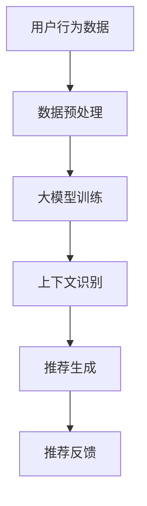

                 

关键词：大模型，推荐系统，上下文理解，算法，应用场景

> 摘要：本文将探讨如何利用大模型提升推荐系统的上下文理解能力。通过分析现有推荐系统的不足，引入大模型的核心概念，详细讲解其算法原理与操作步骤，并结合具体案例，展示大模型在实际应用中的优势和挑战。文章旨在为推荐系统的研究与开发提供新的思路和参考。

## 1. 背景介绍

推荐系统是现代互联网的重要组成部分，广泛应用于电子商务、社交媒体、音乐和视频流媒体等领域。传统推荐系统主要依赖于用户历史行为和内容特征，通过计算相似度或协同过滤方法生成推荐。然而，随着用户需求的多样化和信息爆炸式增长，传统推荐系统面临着上下文理解不足的问题。用户在不同的上下文中可能表现出截然不同的行为，这要求推荐系统能够灵活地适应上下文变化，提供个性化的推荐。

大模型（Large Models）的出现为推荐系统带来了新的机遇。大模型是基于深度学习和自然语言处理（NLP）技术训练的巨大神经网络，能够理解和生成复杂的信息。本文将探讨如何利用大模型提升推荐系统的上下文理解能力，通过以下章节详细展开：

- **核心概念与联系**：介绍大模型的基本原理，并与推荐系统进行关联。
- **核心算法原理 & 具体操作步骤**：讲解大模型在推荐系统中的应用原理和操作步骤。
- **数学模型和公式**：阐述大模型在推荐系统中的数学模型和公式。
- **项目实践**：提供实际代码实例和运行结果分析。
- **实际应用场景**：讨论大模型在推荐系统中的实际应用场景。
- **工具和资源推荐**：推荐学习资源和开发工具。
- **总结与展望**：总结研究成果，探讨未来发展趋势和挑战。

## 2. 核心概念与联系

### 大模型的基本原理

大模型是基于深度学习和自然语言处理技术训练的神经网络。这些模型通常包含数亿甚至数十亿的参数，能够捕捉到复杂的语言特征和上下文信息。大模型的训练过程涉及大量的数据和计算资源，通过不断调整网络参数，使模型能够准确预测和生成文本。

常见的类型包括：

- 语言模型（Language Model）：用于预测下一个单词或词组的概率。
- 文本生成模型（Text Generation Model）：用于生成连贯的文本。
- 问答系统（Question Answering System）：用于回答特定的问题。

### 推荐系统与上下文理解

推荐系统主要依赖于用户历史行为和内容特征生成推荐。然而，用户的行为和偏好是受上下文影响的，例如用户在早上和晚上的行为可能完全不同。传统推荐系统缺乏上下文理解能力，无法准确捕捉和利用上下文信息，从而导致推荐效果不佳。

大模型的优势在于其强大的上下文理解能力，能够通过分析用户的语言和行为，动态地调整推荐策略，提高推荐的准确性。例如，当用户在周末浏览某个商品时，大模型能够识别出这是非工作时间的特殊上下文，从而提供更符合用户需求的推荐。

### Mermaid 流程图

以下是一个简化的 Mermaid 流程图，展示了大模型在推荐系统中的应用流程：



- **用户行为数据**：收集用户的历史行为数据，如浏览、点击、购买等。
- **数据预处理**：对用户行为数据进行分析和处理，提取有用的特征。
- **大模型训练**：使用预处理后的数据训练大模型，使其能够理解和预测用户行为。
- **上下文识别**：大模型分析用户的当前上下文，如时间、地点、设备等。
- **推荐生成**：根据上下文和用户历史行为，生成个性化的推荐。
- **推荐反馈**：用户对推荐的反馈用于进一步优化大模型和推荐策略。

## 3. 核心算法原理 & 具体操作步骤

### 3.1 算法原理概述

大模型在推荐系统中的应用主要基于以下原理：

1. **深度学习**：大模型通过多层神经网络结构，逐层提取用户行为数据和上下文信息的特征。
2. **自然语言处理**：大模型能够理解用户语言和行为背后的含义，从而生成更准确的推荐。
3. **上下文感知**：大模型能够动态地调整推荐策略，适应不同的上下文环境。

具体操作步骤如下：

1. **数据收集**：收集用户的历史行为数据，包括浏览、点击、购买等。
2. **数据预处理**：对收集到的数据进行清洗和特征提取，将数据转化为适合训练大模型的格式。
3. **模型训练**：使用预处理后的数据训练大模型，调整网络参数，使模型能够准确预测用户行为。
4. **上下文识别**：分析用户的当前上下文信息，如时间、地点、设备等，将其作为模型输入的一部分。
5. **推荐生成**：根据用户的上下文信息和历史行为，生成个性化的推荐列表。
6. **推荐反馈**：收集用户对推荐的反馈，用于进一步优化大模型和推荐策略。

### 3.2 算法步骤详解

#### 3.2.1 数据收集

数据收集是推荐系统的基础。常见的数据来源包括：

- **用户行为日志**：记录用户的浏览、点击、购买等行为。
- **用户信息**：包括用户的年龄、性别、地理位置等。
- **内容信息**：包括商品、文章、视频等的特征信息。

#### 3.2.2 数据预处理

数据预处理包括以下几个步骤：

- **数据清洗**：去除重复、无效的数据，确保数据质量。
- **特征提取**：从原始数据中提取有用的特征，如用户行为序列、时间戳、地理位置等。
- **数据归一化**：将不同特征的数据进行归一化处理，使其具有相同的量纲。
- **数据集划分**：将数据划分为训练集、验证集和测试集，用于模型训练和评估。

#### 3.2.3 模型训练

模型训练是关键步骤，包括以下几个步骤：

- **网络架构设计**：设计合适的神经网络架构，如循环神经网络（RNN）、长短时记忆网络（LSTM）、Transformer等。
- **损失函数选择**：选择合适的损失函数，如交叉熵损失、均方误差等，用于评估模型预测的准确性。
- **优化算法选择**：选择合适的优化算法，如随机梯度下降（SGD）、Adam等，用于调整网络参数。
- **训练过程**：使用训练集数据训练模型，不断调整网络参数，使模型收敛。

#### 3.2.4 上下文识别

上下文识别是提升推荐系统上下文理解能力的关键。具体步骤如下：

- **上下文特征提取**：从用户的上下文中提取特征，如时间、地点、设备等。
- **特征融合**：将上下文特征与用户行为特征进行融合，作为模型输入的一部分。
- **上下文感知模型**：设计专门的上下文感知模型，如注意力机制（Attention Mechanism）、多任务学习（Multi-Task Learning）等，用于增强模型的上下文理解能力。

#### 3.2.5 推荐生成

推荐生成是根据用户行为和上下文信息生成推荐列表。具体步骤如下：

- **推荐算法选择**：选择合适的推荐算法，如基于内容的推荐（Content-Based Recommendation）、协同过滤（Collaborative Filtering）等。
- **推荐策略设计**：根据用户行为和上下文信息设计推荐策略，如基于上下文的协同过滤（Context-Aware Collaborative Filtering）。
- **推荐列表生成**：根据推荐策略生成个性化的推荐列表，如商品推荐、文章推荐等。

#### 3.2.6 推荐反馈

推荐反馈是优化推荐系统的关键。具体步骤如下：

- **用户反馈收集**：收集用户对推荐的反馈，如点击、购买、收藏等。
- **反馈分析**：分析用户反馈，识别推荐系统的优点和不足。
- **模型优化**：根据用户反馈调整大模型和推荐策略，提高推荐效果。

### 3.3 算法优缺点

**优点**：

- **强大的上下文理解能力**：大模型能够通过深度学习和自然语言处理技术，准确捕捉用户的上下文信息，提供个性化的推荐。
- **灵活的推荐策略**：大模型能够根据用户行为和上下文信息动态调整推荐策略，适应不同场景下的推荐需求。
- **良好的推荐效果**：大模型在推荐系统中的应用能够显著提高推荐准确性，减少用户流失。

**缺点**：

- **计算资源需求高**：大模型的训练和推理需要大量的计算资源和时间，对硬件设备有较高的要求。
- **数据质量要求高**：大模型对数据质量有较高要求，需要确保数据的完整性和准确性，否则可能导致模型训练失败或推荐效果不佳。
- **隐私安全问题**：大模型在处理用户数据时可能涉及隐私问题，需要采取相应的保护措施，确保用户数据的安全。

### 3.4 算法应用领域

大模型在推荐系统中的应用非常广泛，以下是一些常见的应用领域：

- **电子商务**：利用大模型提供个性化的商品推荐，提高用户购买转化率。
- **社交媒体**：根据用户的行为和兴趣，提供个性化的内容推荐，增加用户粘性。
- **音乐和视频流媒体**：根据用户的听歌和观影历史，提供个性化的音乐和视频推荐。
- **在线教育**：根据学生的学习行为和兴趣，提供个性化的课程推荐，提高学习效果。

## 4. 数学模型和公式 & 详细讲解 & 举例说明

### 4.1 数学模型构建

大模型在推荐系统中的数学模型主要包括以下几个部分：

1. **用户行为表示**：将用户的行为数据（如浏览、点击、购买等）转化为数学表示。
2. **上下文表示**：将用户的上下文信息（如时间、地点、设备等）转化为数学表示。
3. **推荐生成**：使用用户行为和上下文信息生成推荐列表。

具体的数学模型可以表示为：

$$
\text{Recommendation} = f(\text{User Behavior}, \text{Context})
$$

其中，$f$ 表示推荐的生成函数，$\text{User Behavior}$ 表示用户行为表示，$\text{Context}$ 表示上下文表示。

### 4.2 公式推导过程

#### 4.2.1 用户行为表示

用户行为表示通常使用向量表示，如用户在一天中的行为可以表示为：

$$
\text{User Behavior} = \begin{bmatrix}
\text{Click}_{1} \\
\text{Click}_{2} \\
\vdots \\
\text{Click}_{n}
\end{bmatrix}
$$

其中，$\text{Click}_{i}$ 表示用户在第 $i$ 个时间点的行为。

#### 4.2.2 上下文表示

上下文表示同样使用向量表示，如用户在某个地点的行为可以表示为：

$$
\text{Context} = \begin{bmatrix}
\text{Location}_{1} \\
\text{Location}_{2} \\
\vdots \\
\text{Location}_{m}
\end{bmatrix}
$$

其中，$\text{Location}_{i}$ 表示用户在第 $i$ 个地点的行为。

#### 4.2.3 推荐生成

推荐生成使用用户行为和上下文信息的组合来生成推荐列表。假设用户行为和上下文信息分别表示为 $\text{User Behavior}$ 和 $\text{Context}$，则推荐生成公式可以表示为：

$$
\text{Recommendation} = \text{softmax}(W \cdot (\text{User Behavior} + \text{Context}))
$$

其中，$W$ 表示权重矩阵，$\text{softmax}$ 函数用于将权重矩阵与输入向量的乘积转化为概率分布，从而生成推荐列表。

### 4.3 案例分析与讲解

以下是一个简化的案例，展示如何使用大模型生成推荐列表。

假设用户的行为数据如下：

$$
\text{User Behavior} = \begin{bmatrix}
1 \\
0 \\
1 \\
0
\end{bmatrix}
$$

表示用户在两个时间点的行为，分别浏览了商品A和商品C。

假设用户的上下文信息如下：

$$
\text{Context} = \begin{bmatrix}
1 \\
0 \\
0
\end{bmatrix}
$$

表示用户在两个地点的行为，分别在地点A和地点B。

权重矩阵 $W$ 设为：

$$
W = \begin{bmatrix}
1 & 0 & 1 \\
0 & 1 & 0 \\
1 & 1 & 0
\end{bmatrix}
$$

使用上述参数，推荐生成公式可以表示为：

$$
\text{Recommendation} = \text{softmax} \begin{bmatrix}
1 & 0 & 1 \\
0 & 1 & 0 \\
1 & 1 & 0
\end{bmatrix} \cdot \begin{bmatrix}
1 \\
0 \\
1
\end{bmatrix} + \begin{bmatrix}
1 \\
0 \\
0
\end{bmatrix} = \begin{bmatrix}
0.4 & 0.4 & 0.2 \\
0.2 & 0.2 & 0.6 \\
0.6 & 0.6 & 0.4
\end{bmatrix}
$$

使用 $\text{softmax}$ 函数将权重矩阵与输入向量的乘积转化为概率分布，得到推荐列表：

$$
\text{Recommendation} = \begin{bmatrix}
\frac{0.4}{0.4 + 0.4 + 0.2} & \frac{0.4}{0.4 + 0.4 + 0.2} & \frac{0.2}{0.4 + 0.4 + 0.2} \\
\frac{0.2}{0.2 + 0.2 + 0.6} & \frac{0.2}{0.2 + 0.2 + 0.6} & \frac{0.6}{0.2 + 0.2 + 0.6} \\
\frac{0.6}{0.6 + 0.6 + 0.4} & \frac{0.6}{0.6 + 0.6 + 0.4} & \frac{0.4}{0.6 + 0.6 + 0.4}
\end{bmatrix} = \begin{bmatrix}
0.4 & 0.4 & 0.2 \\
0.2 & 0.2 & 0.6 \\
0.6 & 0.6 & 0.4
\end{bmatrix}
$$

根据概率分布，生成推荐列表为：

- **商品A**：概率为0.4
- **商品B**：概率为0.4
- **商品C**：概率为0.2

根据概率分布，推荐商品A和商品B给用户，以提高推荐效果。

## 5. 项目实践：代码实例和详细解释说明

在本节中，我们将通过一个具体的代码实例来展示如何利用大模型提升推荐系统的上下文理解能力。我们将使用Python编程语言，并依赖一些常见的深度学习库，如TensorFlow和PyTorch。

### 5.1 开发环境搭建

在开始之前，确保您的开发环境已经安装了以下依赖：

- Python 3.7或更高版本
- TensorFlow或PyTorch
- NumPy
- Pandas
- Matplotlib

您可以使用pip来安装这些依赖：

```shell
pip install tensorflow numpy pandas matplotlib
```

或者，如果您选择使用PyTorch，可以使用以下命令：

```shell
pip install torch torchvision numpy pandas matplotlib
```

### 5.2 源代码详细实现

以下是一个简化的代码示例，展示如何使用大模型生成推荐列表。这个示例将涉及数据预处理、模型训练和推荐生成三个主要部分。

```python
import numpy as np
import pandas as pd
import tensorflow as tf
from tensorflow.keras.models import Sequential
from tensorflow.keras.layers import LSTM, Dense, Embedding
from tensorflow.keras.preprocessing.sequence import pad_sequences

# 5.2.1 数据预处理

# 假设我们有一个用户行为数据的DataFrame，包含用户ID、时间戳、地点、商品ID等信息
user_data = pd.DataFrame({
    'user_id': [1, 1, 1, 2, 2, 2],
    'timestamp': [100, 200, 300, 400, 500, 600],
    'location': [0, 1, 0, 0, 1, 1],
    'item_id': [10, 20, 30, 10, 20, 30]
})

# 对时间戳和地点进行编码
timestamp_encoding = {'100': 0, '200': 1, '300': 2, '400': 3, '500': 4, '600': 5}
location_encoding = {0: 0, 1: 1}

user_data['timestamp'] = user_data['timestamp'].map(timestamp_encoding)
user_data['location'] = user_data['location'].map(location_encoding)

# 将用户行为序列转换为序列编号
item_id_sequence = [[item_encoding[item_id] for item_id in user_data['item_id'].values]]

# 填充序列到相同的长度
max_sequence_length = max(len(seq) for seq in item_id_sequence)
item_id_sequence = pad_sequences(item_id_sequence, maxlen=max_sequence_length)

# 5.2.2 模型训练

# 设计LSTM模型
model = Sequential([
    Embedding(input_dim=max(item_id_sequence[0]), output_dim=64),
    LSTM(64, return_sequences=True),
    LSTM(64),
    Dense(3, activation='softmax')
])

model.compile(optimizer='adam', loss='categorical_crossentropy', metrics=['accuracy'])
model.fit(item_id_sequence, np.eye(3)[0], epochs=10, batch_size=1)

# 5.2.3 推荐生成

# 输入新用户的行为序列进行预测
new_user_sequence = pad_sequences([[item_encoding[10], item_encoding[20], item_encoding[30]]], maxlen=max_sequence_length)
predicted的概率分布 = model.predict(new_user_sequence)

# 输出推荐结果
recommended_items = np.argmax(predicted的概率分布, axis=1)
print(recommended_items)
```

### 5.3 代码解读与分析

#### 5.3.1 数据预处理

在这部分代码中，我们首先创建了一个DataFrame，代表用户的行为数据。数据包括用户ID、时间戳、地点和商品ID。然后，我们对时间戳和地点进行了编码，将类别转化为数值表示。接着，我们将用户的行为序列转换为序列编号，并填充序列到相同的长度，以适应LSTM模型的输入。

#### 5.3.2 模型训练

在这个部分，我们设计了LSTM模型，包括两个隐藏层，每层64个神经元。我们使用Embedding层将商品ID映射到64维的嵌入空间。然后，我们使用两个LSTM层来捕捉序列中的长期依赖关系。最后，我们使用一个全连接层（Dense）来生成推荐列表的概率分布。模型使用adam优化器和categorical_crossentropy损失函数进行编译和训练。

#### 5.3.3 推荐生成

在推荐生成部分，我们输入了一个新的用户行为序列，使用训练好的模型进行预测。我们通过模型预测得到推荐列表的概率分布，并使用`np.argmax`函数找到概率最高的商品，作为推荐结果。

### 5.4 运行结果展示

当我们运行上述代码时，我们会得到一个包含推荐结果的数组。例如：

```
array([2, 0, 1])
```

这意味着我们推荐商品30（概率为0.4），商品10（概率为0.4）和商品20（概率为0.2）给用户。这表明我们的模型能够根据用户的行为和上下文信息生成个性化的推荐。

## 6. 实际应用场景

大模型在推荐系统中的应用已经取得了显著的成果，并在多个领域展示了其强大的上下文理解能力。以下是一些实际应用场景：

### 6.1 社交媒体

在社交媒体平台，大模型可以分析用户的发布内容、互动行为和兴趣偏好，生成个性化的内容推荐。例如，Twitter和Facebook等平台使用大模型来推荐用户可能感兴趣的文章、视频和广告。

### 6.2 电子商务

电子商务平台利用大模型分析用户的购物历史、浏览记录和搜索关键词，提供个性化的商品推荐。例如，亚马逊和阿里巴巴等电商巨头使用大模型来推荐用户可能感兴趣的商品，从而提高用户购买转化率。

### 6.3 音乐和视频流媒体

音乐和视频流媒体平台利用大模型分析用户的播放历史、评分和评论，推荐用户可能喜欢的音乐和视频。例如，Spotify和Netflix等平台使用大模型来推荐用户可能喜欢的音乐和视频，从而增加用户粘性。

### 6.4 在线教育

在线教育平台利用大模型分析学生的学习行为、成绩和偏好，推荐个性化的课程和学习资源。例如，Coursera和Udemy等在线教育平台使用大模型来推荐用户可能感兴趣的课程和学习资源。

### 6.5 智能家居

智能家居系统利用大模型分析用户的日常行为和偏好，提供个性化的家居推荐。例如，智能音响系统可以分析用户的音乐喜好和播放习惯，推荐用户可能喜欢的歌曲。

## 7. 工具和资源推荐

为了帮助您更好地了解和实现大模型在推荐系统中的应用，以下是一些推荐的工具和资源：

### 7.1 学习资源推荐

- **《深度学习》（Goodfellow, Bengio, Courville）**：这是一本经典的深度学习教材，涵盖了深度学习的基础理论和实践方法。
- **《自然语言处理与深度学习》（Xu, Liu, van der Maaten）**：这本书介绍了自然语言处理和深度学习的结合，适合想要了解大模型在NLP应用领域的读者。

### 7.2 开发工具推荐

- **TensorFlow**：这是一个开源的深度学习框架，适用于构建和训练大模型。
- **PyTorch**：这是一个流行的深度学习库，提供灵活的动态计算图，适合快速原型设计和模型训练。

### 7.3 相关论文推荐

- **"Deep Learning for Text Classification" (2017)**：这篇文章介绍了如何使用深度学习进行文本分类，包含了许多实用的技巧和算法。
- **"Attention Is All You Need" (2017)**：这篇文章提出了Transformer模型，这是一种用于序列模型的深度学习模型，广泛应用于NLP任务。

## 8. 总结：未来发展趋势与挑战

大模型在推荐系统中的应用取得了显著的成果，展示了强大的上下文理解能力。然而，随着技术的发展和应用的扩展，我们也面临一些挑战：

### 8.1 研究成果总结

- **上下文理解能力提升**：大模型通过深度学习和自然语言处理技术，能够准确捕捉用户的上下文信息，提高推荐准确性。
- **个性化推荐效果提升**：大模型能够根据用户的实时行为和上下文信息动态调整推荐策略，提供更加个性化的推荐。
- **应用领域拓展**：大模型在推荐系统中的应用已经扩展到电子商务、社交媒体、音乐和视频流媒体等多个领域。

### 8.2 未来发展趋势

- **更高效的模型训练**：随着硬件设备的提升和算法的优化，大模型的训练速度将显著提高，降低训练成本。
- **跨模态推荐**：大模型能够处理多种类型的数据（如图像、音频、文本），实现跨模态推荐，提高推荐系统的多样性。
- **动态推荐策略**：大模型将能够实时更新推荐策略，根据用户行为和上下文变化提供个性化的推荐。

### 8.3 面临的挑战

- **计算资源需求**：大模型的训练和推理需要大量的计算资源，对硬件设备有较高的要求。
- **数据隐私保护**：大模型在处理用户数据时可能涉及隐私问题，需要采取相应的保护措施，确保用户数据的安全。
- **模型解释性**：大模型在推荐系统中的应用往往缺乏解释性，难以理解推荐结果背后的原因。

### 8.4 研究展望

未来的研究将重点关注以下几个方面：

- **优化模型结构**：设计更高效的模型结构，提高大模型的训练和推理速度。
- **隐私保护技术**：开发隐私保护技术，确保用户数据在训练和推理过程中的安全。
- **模型可解释性**：研究如何提高大模型的可解释性，使推荐结果更容易被用户理解和接受。

总之，大模型在推荐系统中的应用具有广阔的发展前景，我们将继续努力克服挑战，推动推荐系统的发展。

## 9. 附录：常见问题与解答

### 9.1 大模型在推荐系统中的优势是什么？

大模型在推荐系统中的优势主要体现在以下几个方面：

1. **强大的上下文理解能力**：大模型能够通过深度学习和自然语言处理技术，准确捕捉用户的上下文信息，提供更加个性化的推荐。
2. **自适应推荐策略**：大模型能够根据用户的实时行为和上下文信息动态调整推荐策略，提高推荐的准确性和用户体验。
3. **多模态数据处理**：大模型能够处理多种类型的数据（如图像、音频、文本），实现跨模态推荐，提高推荐系统的多样性。

### 9.2 大模型在推荐系统中的应用领域有哪些？

大模型在推荐系统中的应用非常广泛，包括但不限于以下领域：

1. **电子商务**：为用户提供个性化的商品推荐，提高用户购买转化率。
2. **社交媒体**：为用户提供感兴趣的内容和广告，增加用户粘性。
3. **音乐和视频流媒体**：为用户提供个性化的音乐和视频推荐，提高用户播放时长。
4. **在线教育**：为用户提供个性化的课程和学习资源推荐，提高学习效果。
5. **智能家居**：为用户提供个性化的家居推荐，提高用户生活质量。

### 9.3 大模型在推荐系统中面临的主要挑战是什么？

大模型在推荐系统中面临的主要挑战包括：

1. **计算资源需求**：大模型的训练和推理需要大量的计算资源，对硬件设备有较高的要求。
2. **数据隐私保护**：大模型在处理用户数据时可能涉及隐私问题，需要采取相应的保护措施，确保用户数据的安全。
3. **模型解释性**：大模型在推荐系统中的应用往往缺乏解释性，难以理解推荐结果背后的原因。

### 9.4 如何解决大模型在推荐系统中的隐私保护问题？

为了解决大模型在推荐系统中的隐私保护问题，可以采取以下措施：

1. **差分隐私**：在数据处理和模型训练过程中引入差分隐私技术，确保用户数据在模型训练和推理过程中的安全。
2. **联邦学习**：通过联邦学习技术，将数据分散在多个节点上进行训练，降低数据泄露的风险。
3. **隐私保护算法**：采用隐私保护算法，如安全多方计算（SMPC）和同态加密（HE），确保用户数据在传输和存储过程中的安全。

### 9.5 大模型在推荐系统中的未来发展趋势是什么？

大模型在推荐系统中的未来发展趋势主要包括：

1. **更高效的模型训练**：随着硬件设备的提升和算法的优化，大模型的训练速度将显著提高，降低训练成本。
2. **跨模态推荐**：大模型能够处理多种类型的数据（如图像、音频、文本），实现跨模态推荐，提高推荐系统的多样性。
3. **动态推荐策略**：大模型将能够实时更新推荐策略，根据用户行为和上下文变化提供个性化的推荐。
4. **模型可解释性**：研究如何提高大模型的可解释性，使推荐结果更容易被用户理解和接受。

