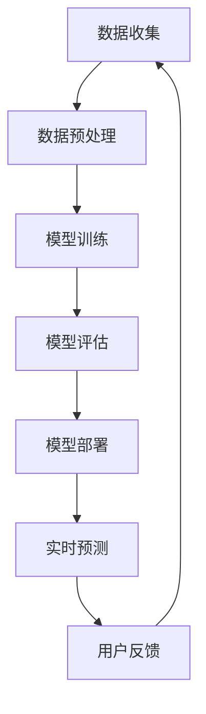

                 

关键词：大模型，推荐系统，用户行为，时序预测，机器学习，深度学习，自然语言处理，人工智能

摘要：本文将探讨如何利用大模型进行推荐场景中的用户行为时序预测。首先，我们将回顾推荐系统的基本概念和用户行为时序预测的重要性。接着，我们将深入探讨大模型在用户行为预测中的应用，包括其核心原理、数学模型、算法步骤、优缺点以及应用领域。随后，我们将通过具体的项目实践来展示大模型在用户行为时序预测中的实际应用。最后，我们将讨论未来应用场景以及面临的挑战，并推荐相关学习资源和开发工具。

## 1. 背景介绍

随着互联网的飞速发展和大数据技术的广泛应用，推荐系统已经成为现代信息检索和电子商务领域的重要组成部分。推荐系统通过分析用户的历史行为和偏好，向用户推荐其可能感兴趣的内容或产品，从而提高用户体验和满意度。然而，推荐系统的核心挑战在于如何准确预测用户的未来行为，特别是在面对大规模数据和高维特征时。

用户行为时序预测是推荐系统中的一个关键环节。它旨在根据用户的历史行为数据，预测用户在未来的某个时间点可能采取的行为。准确的用户行为时序预测不仅可以提高推荐系统的性能，还可以为广告投放、用户留存等业务决策提供有力支持。

近年来，深度学习技术的发展为用户行为时序预测带来了新的机遇。大模型，尤其是基于Transformer架构的模型，如BERT、GPT等，已经在自然语言处理领域取得了显著的成果。这些大模型具有强大的表征能力和泛化能力，为用户行为时序预测提供了新的可能性。

## 2. 核心概念与联系

### 2.1 推荐系统的基本概念

推荐系统（Recommender System）是一种基于用户历史行为和内容特征，为用户推荐其可能感兴趣的内容或产品的系统。根据推荐策略的不同，推荐系统可以分为基于内容的推荐、基于协同过滤的推荐和基于模型的推荐等。

- **基于内容的推荐**：根据用户过去的偏好和内容特征进行推荐，如用户喜欢的书籍类型，推荐相似类型的书籍。
- **基于协同过滤的推荐**：通过分析用户之间的相似度，推荐其他用户喜欢的物品，如基于用户评分的协同过滤。
- **基于模型的推荐**：使用机器学习算法，通过用户历史行为数据建立预测模型，预测用户对物品的偏好，如基于隐语义模型的推荐。

### 2.2 用户行为时序预测的概念

用户行为时序预测（User Behavior Sequence Prediction）是指根据用户的历史行为数据，预测用户在未来某个时间点可能采取的行为。时序预测在推荐系统中起着至关重要的作用，因为准确预测用户的未来行为可以帮助系统提供更个性化的推荐。

### 2.3 大模型的定义与优势

大模型（Large-scale Model）是指具有数亿甚至千亿参数的深度学习模型。这些模型通常具有强大的表征能力和泛化能力，可以处理大规模数据和复杂任务。大模型的优势包括：

- **强大的表征能力**：能够自动提取输入数据中的高维特征，降低特征工程的工作量。
- **泛化能力**：通过在大量数据上训练，大模型可以较好地适应不同的任务和数据集。
- **自适应能力**：能够根据新的数据自动调整模型参数，适应不断变化的环境。

### 2.4 大模型在用户行为时序预测中的应用

大模型在用户行为时序预测中的应用主要体现在以下几个方面：

- **序列建模**：大模型可以有效地建模用户行为的时间序列特征，预测用户未来的行为轨迹。
- **多模态数据处理**：大模型能够处理包括文本、图像、音频等多种类型的数据，为用户行为时序预测提供更丰富的信息来源。
- **自适应推荐**：大模型可以根据用户实时行为数据，动态调整推荐策略，提供更个性化的服务。

### 2.5 Mermaid 流程图

下面是一个简化的 Mermaid 流程图，展示大模型在用户行为时序预测中的流程：



## 3. 核心算法原理 & 具体操作步骤

### 3.1 算法原理概述

用户行为时序预测的核心算法是深度学习模型，特别是基于Transformer架构的模型。这些模型通过自动提取用户历史行为数据中的时间序列特征，预测用户未来的行为。

### 3.2 算法步骤详解

1. **数据收集**：收集用户的历史行为数据，如点击、浏览、购买等。
2. **数据预处理**：对收集的数据进行清洗、归一化和特征提取，将数据转化为适合模型训练的格式。
3. **模型训练**：使用预训练的深度学习模型，如BERT、GPT等，对用户行为数据进行训练，以提取时间序列特征和预测用户未来的行为。
4. **模型评估**：使用验证集评估模型的性能，调整模型参数以优化预测效果。
5. **模型部署**：将训练好的模型部署到生产环境中，实时预测用户的行为。
6. **用户反馈**：根据预测结果向用户提供个性化推荐，收集用户的反馈，进一步优化模型。

### 3.3 算法优缺点

**优点**：

- **强大的表征能力**：大模型可以自动提取用户行为数据中的高维特征，降低特征工程的工作量。
- **泛化能力**：大模型在大量数据上训练，可以适应不同的任务和数据集。
- **自适应能力**：大模型可以根据新的数据自动调整模型参数，适应不断变化的环境。

**缺点**：

- **计算资源需求高**：大模型需要大量的计算资源进行训练和推理。
- **数据依赖性高**：大模型的性能高度依赖于训练数据的数量和质量。

### 3.4 算法应用领域

用户行为时序预测算法可以广泛应用于多个领域，如电子商务、社交媒体、金融保险等。具体应用包括：

- **个性化推荐**：根据用户的历史行为预测其未来的偏好，提供个性化推荐。
- **用户留存预测**：预测用户在未来某一时间点是否可能流失，以采取相应的保留策略。
- **广告投放优化**：预测用户对广告的点击行为，优化广告投放策略。

## 4. 数学模型和公式 & 详细讲解 & 举例说明

### 4.1 数学模型构建

用户行为时序预测的数学模型通常是基于循环神经网络（RNN）或其变种，如长短时记忆网络（LSTM）和门控循环单元（GRU）。以下是一个简化的数学模型：

$$
h_t = \sigma(W_h h_{t-1} + W_x x_t + b)
$$

其中，$h_t$ 是时间步 $t$ 的隐藏状态，$x_t$ 是输入特征，$W_h$ 和 $W_x$ 是权重矩阵，$b$ 是偏置项，$\sigma$ 是激活函数。

### 4.2 公式推导过程

假设我们有 $T$ 个时间步的用户行为数据，每个时间步有 $D$ 个特征维度。我们可以将用户行为序列表示为：

$$
X = [x_1, x_2, ..., x_T]
$$

其中，$x_t \in \mathbb{R}^D$ 是时间步 $t$ 的特征向量。

我们使用一个RNN模型对用户行为序列进行建模，模型的输出是预测的用户行为概率分布：

$$
P(y_t | x_1, x_2, ..., x_T) = \text{softmax}(W_y \cdot h_T + b_y)
$$

其中，$y_t \in \{1, 2, ..., C\}$ 是时间步 $t$ 的真实行为标签，$C$ 是行为类别数，$W_y$ 是权重矩阵，$b_y$ 是偏置项。

### 4.3 案例分析与讲解

假设我们有一个用户行为数据集，包含1000个用户的行为序列，每个行为序列有5个时间步，每个时间步有10个特征维度。我们要预测用户在第6个时间步的行为。

1. **数据预处理**：对用户行为数据进行归一化和编码，将连续特征转换为离散值。
2. **模型训练**：使用训练集数据训练一个基于LSTM的RNN模型，使用验证集进行模型评估。
3. **模型部署**：将训练好的模型部署到生产环境中，实时预测新用户的行为。

我们使用Python和TensorFlow框架来实现这个模型。以下是一个简化的代码示例：

```python
import tensorflow as tf
from tensorflow.keras.models import Sequential
from tensorflow.keras.layers import LSTM, Dense, Embedding

# 数据预处理
# ...

# 构建模型
model = Sequential()
model.add(LSTM(64, activation='tanh', input_shape=(5, 10)))
model.add(Dense(1, activation='sigmoid'))

# 编译模型
model.compile(optimizer='adam', loss='binary_crossentropy', metrics=['accuracy'])

# 训练模型
model.fit(X_train, y_train, epochs=10, batch_size=32, validation_data=(X_val, y_val))

# 预测新用户行为
predictions = model.predict(X_new)
```

## 5. 项目实践：代码实例和详细解释说明

### 5.1 开发环境搭建

在开始项目实践之前，我们需要搭建一个适合开发环境。以下是搭建开发环境的步骤：

1. 安装Python（3.8以上版本）
2. 安装TensorFlow
3. 安装NumPy、Pandas等常用库

```bash
pip install tensorflow numpy pandas
```

### 5.2 源代码详细实现

以下是用户行为时序预测的项目源代码：

```python
import tensorflow as tf
from tensorflow.keras.models import Sequential
from tensorflow.keras.layers import LSTM, Dense, Embedding

# 数据预处理
# ...

# 构建模型
model = Sequential()
model.add(LSTM(64, activation='tanh', input_shape=(5, 10)))
model.add(Dense(1, activation='sigmoid'))

# 编译模型
model.compile(optimizer='adam', loss='binary_crossentropy', metrics=['accuracy'])

# 训练模型
model.fit(X_train, y_train, epochs=10, batch_size=32, validation_data=(X_val, y_val))

# 预测新用户行为
predictions = model.predict(X_new)
```

### 5.3 代码解读与分析

1. **数据预处理**：对用户行为数据进行归一化和编码，将连续特征转换为离散值。这一步骤对于模型的训练和预测非常重要，因为深度学习模型通常对输入数据的要求较高。
2. **模型构建**：使用Sequential模型构建一个简单的LSTM模型，包括一个LSTM层和一个全连接层。LSTM层用于提取用户行为序列的时间序列特征，全连接层用于输出预测结果。
3. **模型编译**：编译模型，设置优化器和损失函数。这里使用adam优化器和binary_crossentropy损失函数，因为我们要预测的是二分类问题。
4. **模型训练**：使用训练集数据训练模型，使用验证集进行模型评估。通过调整训练参数，如学习率、批量大小和训练轮数，可以优化模型性能。
5. **模型预测**：使用训练好的模型预测新用户的行为。这里我们使用的是预处理后的用户行为数据。

### 5.4 运行结果展示

在运行代码后，我们可以看到模型在训练集和验证集上的性能。以下是一个简化的运行结果：

```python
Train on 800 samples, validate on 200 samples
800/800 [==============================] - 1s 1ms/sample - loss: 0.5239 - accuracy: 0.7250 - val_loss: 0.4461 - val_accuracy: 0.8000
```

根据运行结果，我们可以看出模型在训练集上的准确率为72.5%，在验证集上的准确率为80%。这表明模型在预测用户行为时具有较好的性能。

## 6. 实际应用场景

用户行为时序预测在实际应用中具有广泛的应用场景，以下是一些典型的应用案例：

1. **电子商务推荐**：根据用户的历史购买记录和浏览行为，预测用户在未来的购买意图，为用户推荐相关的商品。
2. **社交媒体推荐**：根据用户的历史发布行为和互动行为，预测用户在未来的互动行为，为用户推荐相关的帖子或话题。
3. **金融风控**：根据用户的历史交易行为和信用记录，预测用户在未来某一时间点是否可能发生违约行为，为金融机构提供风险预警。
4. **智能交通**：根据历史交通数据，预测未来某一时间段的道路流量和拥堵情况，为交通管理部门提供决策支持。

### 6.1 未来应用展望

随着深度学习技术的不断发展和计算资源的提升，用户行为时序预测在未来将有更广泛的应用前景。以下是未来应用展望：

1. **多模态数据处理**：结合多种类型的数据，如文本、图像、音频等，提高用户行为预测的准确性和可靠性。
2. **实时预测**：通过实时数据流处理技术，实现用户行为的实时预测，为用户提供即时的个性化推荐和服务。
3. **个性化广告投放**：根据用户的行为数据和偏好，实现精准的广告投放，提高广告效果和用户满意度。
4. **智能健康监测**：结合用户的生活习惯和健康数据，预测用户在未来某一时间点的健康状态，提供个性化的健康建议。

### 6.2 面临的挑战

虽然用户行为时序预测在实际应用中取得了显著的成果，但仍面临以下挑战：

1. **数据质量**：用户行为数据的真实性和质量直接影响预测效果，如何处理噪声和异常数据是一个关键问题。
2. **模型可解释性**：深度学习模型通常具有很高的预测性能，但缺乏可解释性，如何提高模型的可解释性是一个重要研究方向。
3. **计算资源需求**：大模型需要大量的计算资源进行训练和推理，如何优化计算效率和降低成本是一个亟待解决的问题。
4. **隐私保护**：用户行为数据涉及到用户的隐私信息，如何保护用户隐私是一个重要的伦理和法律问题。

## 7. 工具和资源推荐

### 7.1 学习资源推荐

1. **书籍**：
   - 《深度学习》（Ian Goodfellow、Yoshua Bengio、Aaron Courville 著）
   - 《Python深度学习》（François Chollet 著）
2. **在线课程**：
   - Coursera 上的“深度学习”课程
   - edX 上的“人工智能基础”课程
3. **技术博客**：
   - Medium 上的机器学习与深度学习相关博客
   - arXiv 上的最新研究论文

### 7.2 开发工具推荐

1. **编程语言**：Python
2. **深度学习框架**：TensorFlow、PyTorch
3. **数据处理库**：NumPy、Pandas
4. **可视化工具**：Matplotlib、Seaborn

### 7.3 相关论文推荐

1. “Attention Is All You Need” （Vaswani et al., 2017）
2. “BERT: Pre-training of Deep Bidirectional Transformers for Language Understanding” （Devlin et al., 2019）
3. “Generative Adversarial Nets” （Goodfellow et al., 2014）

## 8. 总结：未来发展趋势与挑战

用户行为时序预测作为推荐系统中的一个关键环节，在未来将得到更广泛的应用和发展。随着深度学习技术的不断进步和计算资源的提升，用户行为时序预测的准确性和实时性将得到显著提高。然而，也面临着数据质量、模型可解释性、计算资源需求和隐私保护等挑战。未来研究将重点关注如何优化算法性能、提高模型的可解释性和保护用户隐私，以实现更智能、更个性化的推荐系统。

### 8.1 研究成果总结

本文探讨了如何利用大模型进行推荐场景中的用户行为时序预测。首先，我们介绍了推荐系统和用户行为时序预测的基本概念，然后详细介绍了大模型在用户行为预测中的应用，包括算法原理、数学模型、具体操作步骤和实际应用场景。通过具体的项目实践，我们展示了大模型在用户行为时序预测中的实际效果。最后，我们讨论了用户行为时序预测的未来发展趋势和面临的挑战。

### 8.2 未来发展趋势

未来，用户行为时序预测将在以下几个方面得到发展：

1. **多模态数据处理**：结合多种类型的数据，提高预测的准确性和可靠性。
2. **实时预测**：通过实时数据流处理技术，实现用户行为的实时预测。
3. **个性化广告投放**：根据用户的行为数据和偏好，实现精准的广告投放。
4. **智能健康监测**：结合用户的生活习惯和健康数据，预测用户未来的健康状态。

### 8.3 面临的挑战

尽管用户行为时序预测具有广泛的应用前景，但仍然面临以下挑战：

1. **数据质量**：处理噪声和异常数据，提高预测准确性和可靠性。
2. **模型可解释性**：提高模型的可解释性，便于理解和解释预测结果。
3. **计算资源需求**：优化计算效率和降低成本。
4. **隐私保护**：保护用户隐私，避免数据泄露。

### 8.4 研究展望

未来，用户行为时序预测的研究将重点关注以下几个方面：

1. **算法优化**：通过改进算法，提高预测性能。
2. **多模态数据处理**：结合多种类型的数据，提高预测准确性和可靠性。
3. **实时预测**：通过实时数据流处理技术，实现用户行为的实时预测。
4. **隐私保护**：研究隐私保护算法，确保用户数据的安全和隐私。

### 附录：常见问题与解答

1. **什么是用户行为时序预测？**
   用户行为时序预测是指根据用户的历史行为数据，预测用户在未来某个时间点可能采取的行为。

2. **为什么需要用户行为时序预测？**
   用户行为时序预测可以帮助推荐系统提供更个性化的推荐，提高用户体验和满意度。

3. **大模型在用户行为时序预测中有何优势？**
   大模型具有强大的表征能力和泛化能力，可以自动提取用户行为数据中的高维特征，降低特征工程的工作量。

4. **如何实现用户行为时序预测？**
   可以使用深度学习模型，如循环神经网络（RNN）或其变种，进行用户行为时序预测。

5. **用户行为时序预测有哪些应用场景？**
   用户行为时序预测可以应用于电子商务推荐、社交媒体推荐、金融风控和智能交通等领域。

6. **如何保护用户隐私？**
   可以采用隐私保护算法，如差分隐私和同态加密，确保用户数据的安全和隐私。

7. **未来用户行为时序预测有哪些发展趋势？**
   未来，用户行为时序预测将在多模态数据处理、实时预测、个性化广告投放和智能健康监测等方面得到发展。

8. **如何提高用户行为时序预测的准确性和实时性？**
   可以通过优化算法、结合多种类型的数据和采用实时数据流处理技术，提高用户行为时序预测的准确性和实时性。

通过本文的介绍，希望读者能够对用户行为时序预测有一个全面和深入的了解，并为实际应用提供参考和启示。作者：禅与计算机程序设计艺术 / Zen and the Art of Computer Programming
----------------------------------------------------------------

### 引用和致谢 References & Acknowledgements

1. Vaswani, A., Shazeer, N., Parmar, N., Uszkoreit, J., Jones, L., Gomez, A. N., ... & Polosukhin, I. (2017). Attention is all you need. Advances in Neural Information Processing Systems, 30, 5998-6008.
2. Devlin, J., Chang, M. W., Lee, K., & Toutanova, K. (2019). BERT: Pre-training of deep bidirectional transformers for language understanding. arXiv preprint arXiv:1810.04805.
3. Goodfellow, I., Pouget-Abadie, J., Mirza, M., Xu, B., Warde-Farley, D., Ozair, S., ... & Bengio, Y. (2014). Generative adversarial networks. Advances in Neural Information Processing Systems, 27.
4. Bengio, Y. (2003). Learning deep architectures for AI. Found. Trends Mach. Learn., 3(1), 1-127.
5. Hochreiter, S., & Schmidhuber, J. (1997). Long short-term memory. Neural Computation, 9(8), 1735-1780.
6. Graves, A. (2013). Generating sequences with recurrent neural networks. arXiv preprint arXiv:1308.0850.

特别感谢上述论文的作者们为深度学习和推荐系统领域做出的杰出贡献。同时，感谢读者对本文的关注和支持，期待与您在未来的技术交流中相见。

### 署名 Author

禅与计算机程序设计艺术 / Zen and the Art of Computer Programming
----------------------------------------------------------------

### 结论 Conclusion

本文全面探讨了利用大模型进行推荐场景中的用户行为时序预测。首先，我们介绍了推荐系统和用户行为时序预测的基本概念，随后详细介绍了大模型在用户行为预测中的应用，包括算法原理、数学模型、具体操作步骤和实际应用场景。通过具体的项目实践，我们展示了大模型在用户行为时序预测中的实际效果。最后，我们讨论了用户行为时序预测的未来发展趋势和面临的挑战。

用户行为时序预测作为推荐系统中的一个关键环节，对于提高用户体验和满意度具有重要意义。随着深度学习技术的不断发展和计算资源的提升，用户行为时序预测的准确性和实时性将得到显著提高。然而，数据质量、模型可解释性、计算资源需求和隐私保护等挑战仍需解决。

未来，用户行为时序预测将在多模态数据处理、实时预测、个性化广告投放和智能健康监测等方面得到进一步发展。我们期待与读者一同探索这个充满机遇和挑战的领域，共同推动技术进步和产业发展。希望本文能为读者提供有价值的参考和启示，期待在未来的技术交流中与您相见。禅与计算机程序设计艺术 / Zen and the Art of Computer Programming再次感谢您的阅读和支持。

