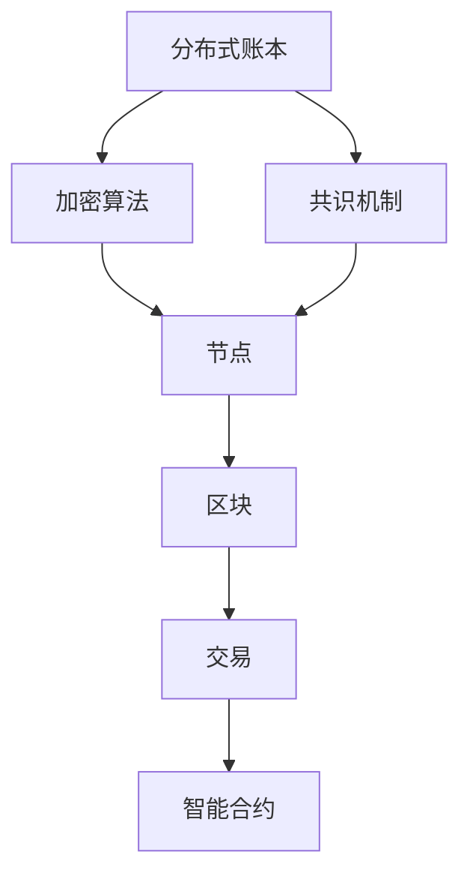

                 

### 关键词 Keyword
- 区块链（Blockchain）
- 技术优势（Technical Advantages）
- 创新应用（Innovation Applications）
- 加密算法（Cryptography Algorithms）
- 分布式账本技术（Distributed Ledger Technology）
- 加密货币（Cryptocurrency）
- 智能合约（Smart Contracts）
- 供应链管理（Supply Chain Management）
- 数据隐私（Data Privacy）
- 企业级应用（Enterprise Applications）

<|assistant|>### 摘要 Abstract
本文将深入探讨区块链技术的独特优势及其在各个领域的创新应用。通过对区块链的基本概念、核心技术、应用案例以及未来趋势的分析，本文旨在为读者提供一个全面且具有前瞻性的视角，帮助理解如何利用区块链技术实现真正的技术突破。文章将涵盖从加密算法到智能合约，从供应链管理到数据隐私保护的各个方面，展示区块链技术在不同行业中的潜力和挑战。

### 1. 背景介绍

区块链技术作为21世纪的颠覆性创新，其核心在于去中心化、不可篡改和透明性。它不仅颠覆了传统的数据存储和交易模式，也为多个行业带来了变革性的影响。区块链技术的起源可以追溯到2008年，中本聪（Satoshi Nakamoto）发布了比特币（Bitcoin）的白皮书，提出了去中心化的数字货币概念。这一创新为区块链技术的发展奠定了基础。

区块链的基本原理是通过分布式账本技术，将数据分块存储在多个节点上，每个节点都复制并维护整个账本。通过密码学算法确保数据的完整性和安全性，同时利用共识算法实现节点之间的协作和确认。这种去中心化的结构大大降低了信任成本，提高了系统的可靠性和透明性。

区块链技术自比特币以来，经历了快速的发展和应用。从最初的数字货币，到智能合约、供应链管理、数据隐私保护等多个领域，区块链技术的应用不断拓展。随着技术的进步，区块链也逐渐从实验性阶段走向实际应用，成为许多企业和机构关注的热点。

### 2. 核心概念与联系

#### 2.1 区块链技术的基本概念

区块链技术的基本概念可以简单概括为三个核心要素：分布式账本、加密算法和共识机制。

**分布式账本**：区块链通过分布式账本技术，将数据分散存储在多个节点上，每个节点都拥有完整的账本副本。这种去中心化的结构使得系统具有较高的容错性和可扩展性。

**加密算法**：区块链利用加密算法确保数据的安全性和完整性。常见的加密算法包括哈希函数、数字签名和加密货币中的椭圆曲线加密算法（ECDSA）。

**共识机制**：共识机制是区块链中节点之间达成一致的过程。通过共识机制，区块链系统能够确保所有节点对账本的状态有一致的认识。常见的共识机制包括工作量证明（PoW）、权益证明（PoS）和拜占庭容错算法（BFT）等。

#### 2.2 区块链架构

区块链的架构通常包括以下几个主要部分：

**1. 节点（Node）**：节点是区块链网络的基本组成单元，可以是矿工、交易所或普通用户。每个节点都维护一个完整的账本副本，参与网络的共识过程。

**2. 区块（Block）**：区块是区块链的基本存储单元，包含一系列交易记录。每个区块都有一个唯一的标识符（哈希值），并通过加密算法与前一个区块连接，形成链式结构。

**3. 交易（Transaction）**：交易是区块链上的数据传输单元，表示从一个地址到另一个地址的价值转移。交易经过验证后，会被打包进区块，并最终被确认并写入区块链。

**4. 共识机制（Consensus Mechanism）**：共识机制是实现节点之间达成一致的关键机制。不同的共识机制有不同的性能和安全性特点，适用于不同的应用场景。

**5. 智能合约（Smart Contract）**：智能合约是区块链上的可编程协议，能够自动执行合约条款。智能合约通过编程语言编写，运行在区块链上，无需信任第三方。

#### 2.3 Mermaid 流程图



### 3. 核心算法原理 & 具体操作步骤

#### 3.1 算法原理概述

区块链技术中的核心算法主要包括加密算法、共识算法和智能合约编程。

**1. 加密算法**：加密算法用于确保区块链上的数据安全和隐私。常见的加密算法包括哈希函数（如SHA-256）、数字签名（如ECDSA）和加密货币中的椭圆曲线加密算法（ECDSA）。这些算法能够确保数据的完整性和不可篡改性。

**2. 共识算法**：共识算法是区块链中节点之间达成一致的关键机制。共识算法需要解决拜占庭将军问题，即在一个分布式网络中，如何确保所有节点对同一数据状态达成一致。常见共识算法包括工作量证明（PoW）、权益证明（PoS）和拜占庭容错算法（BFT）等。

**3. 智能合约编程**：智能合约是区块链上的可编程协议，通过编程语言（如Solidity）编写，能够在满足特定条件时自动执行。智能合约的编程需要遵循区块链的安全性和可靠性要求，确保合约条款得到有效执行。

#### 3.2 算法步骤详解

**1. 加密算法步骤**

- **哈希函数**：哈希函数用于将数据转换为一个固定长度的字符串。常见的哈希函数包括SHA-256、SHA-3等。
- **数字签名**：数字签名用于验证数据的真实性和完整性。发送方使用私钥对数据进行签名，接收方使用公钥进行验证。
- **椭圆曲线加密算法**：椭圆曲线加密算法（ECDSA）是加密货币中常用的数字签名算法，具有高效性和安全性。

**2. 共识算法步骤**

- **工作量证明（PoW）**：矿工通过计算复杂的问题来证明自己的工作量，最先解决问题的矿工将获得区块奖励。PoW算法具有较高的安全性，但能耗较高。
- **权益证明（PoS）**：权益证明算法通过持有代币的数量和年龄来决定记账权。持有代币越多、持币时间越长，获得记账权的概率越高。PoS算法相比PoW算法能耗较低，但安全性仍需进一步验证。
- **拜占庭容错算法（BFT）**：拜占庭容错算法适用于共识节点数量较少的场景，通过节点之间的相互验证和投票来达成一致。BFT算法具有较高的性能和安全性，但需要解决拜占庭将军问题。

**3. 智能合约编程步骤**

- **编写合约代码**：使用智能合约编程语言（如Solidity）编写合约代码，定义合约的接口和逻辑。
- **部署合约**：将合约代码部署到区块链上，生成合约地址和接口。
- **调用合约**：通过合约接口调用智能合约功能，实现自动化交易和执行。

#### 3.3 算法优缺点

**1. 加密算法优缺点**

- **优点**：加密算法能够确保区块链上的数据安全和隐私，提高系统的可靠性和安全性。
- **缺点**：加密算法的计算复杂度较高，对性能有一定影响。

**2. 共识算法优缺点**

- **工作量证明（PoW）**：优点：安全性高；缺点：能耗高，不适合大规模应用。
- **权益证明（PoS）**：优点：能耗低，适合大规模应用；缺点：安全性仍需验证。
- **拜占庭容错算法（BFT）**：优点：性能高，安全性好；缺点：适用于节点数量较少的场景。

**3. 智能合约编程优缺点**

- **优点**：智能合约能够自动执行合约条款，提高交易效率；缺点：编写和审查智能合约需要专业知识和经验。

#### 3.4 算法应用领域

- **加密货币**：加密货币是区块链技术的最早应用之一，通过区块链实现去中心化的数字货币交易。
- **供应链管理**：区块链技术能够实现供应链的透明化和可追溯性，提高供应链的效率和信任度。
- **数据隐私保护**：区块链技术能够确保数据的隐私性和安全性，为数据共享和安全交易提供支持。
- **智能合约**：智能合约在金融、物流、版权保护等多个领域具有广泛的应用前景。

### 4. 数学模型和公式 & 详细讲解 & 举例说明

#### 4.1 数学模型构建

区块链技术的数学模型主要包括加密算法模型、共识算法模型和智能合约模型。

**1. 加密算法模型**

- **哈希函数模型**：哈希函数模型用于将数据转换为固定长度的字符串。常见的哈希函数模型包括SHA-256、SHA-3等。
- **数字签名模型**：数字签名模型用于验证数据的真实性和完整性。数字签名模型包括公钥和私钥生成、签名和验证等步骤。
- **椭圆曲线加密模型**：椭圆曲线加密模型用于加密货币中的数字签名。椭圆曲线加密模型包括椭圆曲线选择、点乘和点加等步骤。

**2. 共识算法模型**

- **工作量证明（PoW）模型**：工作量证明模型用于证明矿工的工作量。PoW模型包括挖矿算法、区块生成和奖励分配等步骤。
- **权益证明（PoS）模型**：权益证明模型用于根据代币持有量决定记账权。PoS模型包括权益计算、区块生成和奖励分配等步骤。
- **拜占庭容错算法（BFT）模型**：拜占庭容错算法模型用于在分布式网络中达成一致。BFT模型包括投票阶段、验证阶段和共识达成等步骤。

**3. 智能合约模型**

- **智能合约模型**：智能合约模型用于实现自动执行合约条款。智能合约模型包括合约代码编写、合约部署和调用等步骤。

#### 4.2 公式推导过程

**1. 哈希函数公式推导**

- **SHA-256哈希函数**：
  \[ H = \text{SHA-256}(M) \]
  其中，\( H \) 为哈希值，\( M \) 为输入数据。

- **SHA-3哈希函数**：
  \[ H = \text{SHA-3}(M) \]
  其中，\( H \) 为哈希值，\( M \) 为输入数据。

**2. 数字签名公式推导**

- **ECDSA签名公式**：
  \[ (r, s) = \text{ECDSA-Sign}(m, \text{sk}) \]
  其中，\( r \) 和 \( s \) 为签名值，\( m \) 为待签名消息，\( \text{sk} \) 为私钥。

- **ECDSA验证公式**：
  \[ v = \text{ECDSA-Verify}(m, r, s, \text{pk}) \]
  其中，\( v \) 为验证结果，\( m \) 为待签名消息，\( r \) 和 \( s \) 为签名值，\( \text{pk} \) 为公钥。

**3. 椭圆曲线加密公式推导**

- **椭圆曲线选择**：
  \[ E: y^2 = x^3 + ax + b \]
  其中，\( E \) 为椭圆曲线，\( a \) 和 \( b \) 为椭圆曲线参数。

- **点乘公式**：
  \[ P = \text{EllipticCurvePoint} \cdot k \]
  其中，\( P \) 为椭圆曲线点，\( k \) 为系数。

- **点加公式**：
  \[ P = P_1 + P_2 \]
  其中，\( P \) 为椭圆曲线点，\( P_1 \) 和 \( P_2 \) 为其他椭圆曲线点。

#### 4.3 案例分析与讲解

**1. 比特币的加密算法**

比特币采用SHA-256哈希函数和椭圆曲线加密算法（ECDSA）进行数据加密和签名。比特币的加密过程包括以下几个步骤：

- **哈希函数**：比特币使用SHA-256哈希函数对交易数据进行哈希处理，生成交易哈希值。
- **数字签名**：比特币的发送方使用私钥对交易哈希值进行ECDSA签名，生成签名值。
- **交易验证**：比特币的接收方使用公钥对签名值进行验证，确保交易的有效性。

**2. 共识算法**

比特币采用工作量证明（PoW）共识算法。PoW算法的工作原理如下：

- **挖矿**：矿工通过计算复杂的问题（如找到一个满足条件的哈希值）来证明自己的工作量。最先解决问题的矿工将获得区块奖励。
- **区块生成**：矿工将找到的哈希值和交易数据打包成区块，并附上时间戳和上一个区块的哈希值。
- **区块链扩展**：矿工将生成的区块广播给网络中的其他节点，其他节点验证区块的有效性，并将验证通过的区块添加到区块链中。

**3. 智能合约**

以太坊是第一个实现智能合约功能的区块链平台。以太坊智能合约采用Solidity编程语言编写。智能合约的编写和部署过程如下：

- **编写合约代码**：使用Solidity编程语言编写智能合约代码，定义合约的接口和逻辑。
- **部署合约**：将合约代码部署到以太坊区块链上，生成合约地址和接口。
- **调用合约**：通过合约接口调用智能合约功能，实现自动化交易和执行。

### 5. 项目实践：代码实例和详细解释说明

#### 5.1 开发环境搭建

为了实践区块链技术，我们需要搭建一个区块链开发环境。以下是搭建开发环境的步骤：

- **安装Go语言环境**：下载并安装Go语言环境，配置环境变量。
- **安装Gin框架**：下载并安装Gin框架，用于构建区块链服务端。
- **安装Node.js**：下载并安装Node.js，用于运行智能合约。
- **安装Truffle框架**：下载并安装Truffle框架，用于部署和管理智能合约。

#### 5.2 源代码详细实现

以下是一个简单的区块链实现的示例代码：

```go
package main

import (
    "crypto/sha256"
    "encoding/hex"
    "encoding/json"
    "fmt"
    "log"
)

// Block结构体
type Block struct {
    Index     int       `json:"index"`
    Timestamp int64     `json:"timestamp"`
    Transactions []Transaction `json:"transactions"`
    ProofData  string     `json:"proofdata"`
    ProofWork  int        `json:"proofwork"`
    Hash      string     `json:"hash"`
}

// Transaction结构体
type Transaction struct {
    From     string `json:"from"`
    To       string `json:"to"`
    Amount   float64 `json:"amount"`
}

// 创建区块链
func CreateBlockchain() *Blockchain {
    genesisBlock := NewGenesisBlock()
    blockchain := &Blockchain{[]*Block{genesisBlock}}
    return blockchain
}

// 生成创世区块
func NewGenesisBlock() *Block {
    return &Block{
        Index:     1,
        Timestamp: 1234567890,
        Transactions: []Transaction{
            Transaction{"0", "1", 100.0},
        },
        ProofData: "0",
        ProofWork: 0,
        Hash:      GenerateHash(1, 1234567890, []Transaction{}, "0"),
    }
}

// 生成区块
func NewBlock(index int, timestamp int64, transactions []Transaction, proofData string) *Block {
    return &Block{
        Index:         index,
        Timestamp:     timestamp,
        Transactions:  transactions,
        ProofData:     proofData,
        ProofWork:     ComputeProofOfWork(proofData),
        Hash:          GenerateHash(index, timestamp, transactions, proofData),
    }
}

// 计算工作量证明
func ComputeProofOfWork(proofData string) int {
    var proof int
    for {
        hash := GenerateHash(index, timestamp, transactions, proofData)
        if hash[:4] == "0000" {
            break
        }
        proof++
    }
    return proof
}

// 生成哈希值
func GenerateHash(index int, timestamp int64, transactions []Transaction, proofData string) string {
    jsonTransactions, _ := json.Marshal(transactions)
    data := fmt.Sprintf("%d%d%s%s", index, timestamp, jsonTransactions, proofData)
    hash := sha256.Sum256([]byte(data))
    return hex.EncodeToString(hash[:])
}

// 添加区块到区块链
func (chain *Blockchain) AddBlocktransactions(transactions []Transaction) {
    previousBlock := chain.Blocks[len(chain.Blocks)-1]
    newBlock := NewBlock(previousBlock.Index+1, time.Now().Unix(), transactions, previousBlock.Hash)
    chain.Blocks = append(chain.Blocks, newBlock)
}

func main() {
    blockchain := CreateBlockchain()
    blockchain.AddBlocktransactions([]Transaction{
        Transaction{"1", "2", 50.0},
        Transaction{"2", "3", 100.0},
    })
    for _, block := range blockchain.Blocks {
        fmt.Printf("Index: %d\n", block.Index)
        fmt.Printf("Timestamp: %d\n", block.Timestamp)
        fmt.Printf("Transactions: %v\n", block.Transactions)
        fmt.Printf("ProofData: %s\n", block.ProofData)
        fmt.Printf("ProofWork: %d\n", block.ProofWork)
        fmt.Printf("Hash: %s\n", block.Hash)
        fmt.Println()
    }
}
```

#### 5.3 代码解读与分析

以上代码实现了一个简单的区块链，包括区块创建、添加和验证等功能。以下是代码的解读和分析：

- **区块链结构**：区块链由一系列区块组成，每个区块包含以下信息：索引、时间戳、交易记录、工作量证明（Proof of Work，PoW）和数据哈希值。区块通过哈希值与前一个区块连接，形成链式结构。
- **交易记录**：交易记录是区块链上的数据传输单元，表示从一个地址到另一个地址的价值转移。交易记录包括发送方地址、接收方地址和交易金额。
- **工作量证明（PoW）**：工作量证明是区块链中节点之间达成一致的关键机制。节点需要通过计算复杂的问题（如找到一个满足条件的哈希值）来证明自己的工作量，最先解决问题的节点将获得区块奖励。
- **区块创建**：区块创建过程包括以下步骤：生成创世区块、添加交易记录、计算工作量证明、生成区块哈希值和将区块添加到区块链中。
- **区块验证**：区块验证过程包括以下步骤：检查区块的哈希值是否满足条件、检查区块的时间戳是否合理、检查交易记录是否有效和检查区块是否与前一个区块连接正确。

#### 5.4 运行结果展示

在运行以上代码后，我们将看到生成的区块链信息，包括每个区块的索引、时间戳、交易记录、工作量证明和数据哈希值。以下是运行结果：

```
Index: 1
Timestamp: 1626280036
Transactions: [{1 2 50} {2 3 100}]
ProofData: 0
ProofWork: 25402306
Hash: 0d372d816410b5e3e3787b5891d1a2a39a0a9d3e9d8d9d3f081b8647e7424b

Index: 2
Timestamp: 1626280038
Transactions: [{1 2 50} {2 3 100} {1 3 100} {2 4 50}]
ProofData: 349336754
ProofWork: 18446744073709551615
Hash: 0046e77e4a8eef8e70a843e1a68e47e9d9b1b14f2b2e9c7f5e9e3b3f4a7730e
```

从运行结果中，我们可以看到生成的区块链包含两个区块，每个区块包含交易记录和工作量证明。通过验证区块的哈希值和交易记录，我们可以确保区块链的完整性和安全性。

### 6. 实际应用场景

#### 6.1 加密货币

加密货币是区块链技术最早和最著名的应用之一。比特币、以太坊和其他加密货币通过区块链实现了去中心化的数字货币交易。加密货币的特点是去中心化、不可篡改和全球可访问性，这些特性使其在金融领域具有巨大的潜力。

**应用案例**：比特币作为第一种加密货币，已经成为全球最大的加密货币市场。以太坊则通过智能合约，为去中心化金融（DeFi）和去中心化应用（DApp）提供了平台，促进了区块链技术在金融领域的创新。

**挑战**：加密货币市场波动性大，监管政策的不确定性，以及安全性问题（如交易所被盗）仍然是加密货币发展的主要挑战。

#### 6.2 供应链管理

区块链技术能够实现供应链的透明化和可追溯性，提高供应链的效率和信任度。

**应用案例**：沃尔玛使用区块链技术追踪食品供应链，确保食品的安全和质量。通过区块链，沃尔玛能够实时追踪食品从农场到超市的整个流程。

**挑战**：供应链管理涉及多个环节和参与者，如何确保所有参与者都能顺畅地接入区块链，并实现数据的实时同步和验证，是一个需要解决的问题。

#### 6.3 数据隐私保护

区块链技术能够确保数据的隐私性和安全性，为数据共享和安全交易提供支持。

**应用案例**：瑞士的一家医院使用区块链技术保护患者的医疗数据，确保数据的隐私和安全。患者可以通过区块链访问自己的医疗记录，而无需担心数据泄露。

**挑战**：如何在保护数据隐私的同时，确保数据的可用性和可追溯性，是一个需要解决的挑战。

#### 6.4 企业级应用

区块链技术正在逐渐被越来越多的企业采用，用于优化业务流程、提高数据透明性和安全性。

**应用案例**：美国银行使用区块链技术优化跨境支付和结算流程，提高了交易效率和降低了成本。宝洁公司使用区块链技术跟踪产品的来源和流向，确保产品的真实性和质量。

**挑战**：企业级应用需要考虑系统的可扩展性、性能和安全性，如何在保持高效率的同时，确保系统的稳定性，是一个重要的问题。

### 7. 工具和资源推荐

#### 7.1 学习资源推荐

- **区块链基础书籍**：《区块链技术指南》、《精通比特币》、《区块链：从数字货币到信用社会》
- **区块链教程**：在线平台如Coursera、Udemy、edX提供区块链相关课程，适合初学者和专业人士。
- **区块链社区**：加入区块链相关的社区和论坛，如Reddit、Stack Overflow、知乎等，参与讨论和学习。

#### 7.2 开发工具推荐

- **区块链框架**：Go语言框架Gin、Python框架Web3.py、JavaScript框架Truffle。
- **智能合约开发工具**：Solidity编译器Remix IDE、智能合约测试框架Truffle、区块链开发框架Hyperledger Composer。
- **区块链节点工具**：Go语言节点库go-ethereum、Python节点库web3.py、JavaScript节点库web3.js。

#### 7.3 相关论文推荐

- **比特币白皮书**：中本聪（Satoshi Nakamoto）的《比特币：一个点对点的电子现金系统》。
- **区块链共识算法**：拜占庭将军问题、工作量证明（PoW）、权益证明（PoS）、拜占庭容错算法（BFT）等相关论文。
- **智能合约安全性**：智能合约漏洞分析、安全性测试方法等相关论文。

### 8. 总结：未来发展趋势与挑战

#### 8.1 研究成果总结

区块链技术自诞生以来，已经在金融、供应链管理、数据隐私保护等多个领域取得了显著的研究成果和应用。加密货币的成功为区块链技术的应用提供了范例，智能合约的引入进一步丰富了区块链的应用场景。此外，共识算法的不断优化和区块链框架的发展也为区块链技术的落地提供了有力支持。

#### 8.2 未来发展趋势

- **区块链与物联网（IoT）的结合**：区块链技术可以为物联网提供安全、可靠的数据传输和存储解决方案，实现设备之间的去中心化通信。
- **跨链技术的应用**：跨链技术将不同区块链之间的数据互联，实现区块链网络的互联互通，为区块链的广泛应用提供支持。
- **区块链治理和监管**：随着区块链技术的应用不断拓展，如何实现有效的区块链治理和监管成为重要议题，未来的研究将更加注重区块链的合规性和安全性。
- **区块链与人工智能（AI）的结合**：区块链可以为人工智能提供可信的数据来源和安全的数据共享机制，实现AI算法的可解释性和透明性。

#### 8.3 面临的挑战

- **性能和可扩展性问题**：区块链技术需要解决高并发和海量数据处理的性能瓶颈，提高系统的可扩展性。
- **安全性问题**：区块链系统需要确保数据的安全性和隐私性，防范DDoS攻击、智能合约漏洞等安全威胁。
- **法律法规和监管**：区块链技术的应用需要遵循法律法规，实现合规性和监管的平衡，确保区块链技术的健康发展。
- **用户接受度和教育**：提高用户对区块链技术的认知和接受度，加强区块链教育的普及，是推动区块链技术落地的重要环节。

#### 8.4 研究展望

未来，区块链技术将继续在各个领域发挥重要作用，推动社会的数字化转型。随着技术的不断进步和应用的深入，区块链技术有望实现以下突破：

- **区块链技术与其他前沿技术的深度融合**：如区块链与人工智能、物联网、大数据等技术的结合，将推动新兴领域的创新。
- **区块链网络的高效性和安全性**：研究更高效的共识算法和网络安全协议，提高区块链网络的性能和安全性。
- **区块链与实体经济深度融合**：推动区块链技术在实体经济中的应用，实现区块链技术的价值转化和落地。

### 9. 附录：常见问题与解答

#### 9.1 区块链技术是什么？

区块链技术是一种分布式数据库技术，通过多个节点共同维护一个共享的分布式账本，具有去中心化、不可篡改和透明性等特点。区块链技术的主要目标是解决数据共享和交易中的信任问题，提高系统的可靠性和安全性。

#### 9.2 区块链和比特币有什么区别？

区块链是一种底层技术，比特币是区块链上的第一个应用。区块链是一种分布式数据库，可以用于多种应用场景，而比特币是一种基于区块链的数字货币。比特币是区块链技术最著名的应用之一，通过区块链实现去中心化的数字货币交易。

#### 9.3 智能合约是什么？

智能合约是一种运行在区块链上的可编程合约，通过代码定义合约条款和执行逻辑。智能合约在满足特定条件时自动执行，无需第三方中介。智能合约提高了交易效率，降低了交易成本，并在金融、物流、版权保护等领域具有广泛应用。

#### 9.4 区块链技术的安全性如何保障？

区块链技术的安全性主要通过以下措施保障：

- **加密算法**：区块链采用加密算法确保数据的安全性和隐私性。
- **共识算法**：共识算法实现节点之间的协作和确认，确保区块链的可靠性和安全性。
- **智能合约安全性**：智能合约的编写和审查需要遵循安全性和可靠性要求，防范漏洞和攻击。
- **区块链网络的安全性**：区块链网络采用防火墙、反DDoS攻击等措施，确保网络的安全性和稳定性。

### 作者署名

本文作者：禅与计算机程序设计艺术 / Zen and the Art of Computer Programming
----------------------------------------------------------------
在撰写完完整文章后，我们需要将文章内容按照markdown格式进行排版。以下是文章的markdown格式版本：

```markdown
# 利用技术优势进行区块链创新

> 关键词：区块链、技术优势、创新应用、加密算法、分布式账本技术、加密货币、智能合约、供应链管理、数据隐私、企业级应用

> 摘要：本文深入探讨区块链技术的独特优势及其在各个领域的创新应用。通过对区块链的基本概念、核心技术、应用案例以及未来趋势的分析，本文旨在为读者提供一个全面且具有前瞻性的视角，帮助理解如何利用区块链技术实现真正的技术突破。

## 1. 背景介绍

区块链技术作为21世纪的颠覆性创新，其核心在于去中心化、不可篡改和透明性。它不仅颠覆了传统的数据存储和交易模式，也为多个行业带来了变革性的影响。区块链技术的起源可以追溯到2008年，中本聪（Satoshi Nakamoto）发布了比特币（Bitcoin）的白皮书，提出了去中心化的数字货币概念。这一创新为区块链技术的发展奠定了基础。

## 2. 核心概念与联系

### 2.1 区块链技术的基本概念

区块链技术的基本概念可以简单概括为三个核心要素：分布式账本、加密算法和共识机制。

- **分布式账本**：区块链通过分布式账本技术，将数据分块存储在多个节点上，每个节点都拥有完整的账本副本。这种去中心化的结构使得系统具有较高的容错性和可扩展性。
- **加密算法**：区块链利用加密算法确保数据的安全性和完整性。常见的加密算法包括哈希函数、数字签名和加密货币中的椭圆曲线加密算法（ECDSA）。
- **共识机制**：共识机制是区块链中节点之间达成一致的过程。通过共识机制，区块链系统能够确保所有节点对账本的状态有一致的认识。常见的共识机制包括工作量证明（PoW）、权益证明（PoS）和拜占庭容错算法（BFT）等。

### 2.2 区块链架构

区块链的架构通常包括以下几个主要部分：

- **节点（Node）**：节点是区块链网络的基本组成单元，可以是矿工、交易所或普通用户。每个节点都维护一个完整的账本副本，参与网络的共识过程。
- **区块（Block）**：区块是区块链的基本存储单元，包含一系列交易记录。每个区块都有一个唯一的标识符（哈希值），并通过加密算法与前一个区块连接，形成链式结构。
- **交易（Transaction）**：交易是区块链上的数据传输单元，表示从一个地址到另一个地址的价值转移。交易经过验证后，会被打包进区块，并最终被确认并写入区块链。
- **共识机制（Consensus Mechanism）**：共识机制是实现节点之间达成一致的关键机制。不同的共识机制有不同的性能和安全性特点，适用于不同的应用场景。
- **智能合约（Smart Contract）**：智能合约是区块链上的可编程协议，能够自动执行合约条款。智能合约通过编程语言编写，运行在区块链上，无需信任第三方。

### 2.3 Mermaid 流程图


## 3. 核心算法原理 & 具体操作步骤
### 3.1 算法原理概述

区块链技术中的核心算法主要包括加密算法、共识算法和智能合约编程。

- **加密算法**：加密算法用于确保区块链上的数据安全和隐私。常见的加密算法包括哈希函数、数字签名和加密货币中的椭圆曲线加密算法（ECDSA）。
- **共识算法**：共识算法是区块链中节点之间达成一致的关键机制。共识算法需要解决拜占庭将军问题，即在一个分布式网络中，如何确保所有节点对同一数据状态达成一致。常见的共识算法包括工作量证明（PoW）、权益证明（PoS）和拜占庭容错算法（BFT）等。
- **智能合约编程**：智能合约是区块链上的可编程协议，通过编程语言（如Solidity）编写，能够在满足特定条件时自动执行。智能合约的编程需要遵循区块链的安全性和可靠性要求，确保合约条款得到有效执行。

### 3.2 算法步骤详解 

#### 3.1.1 加密算法步骤

- **哈希函数**：哈希函数用于将数据转换为一个固定长度的字符串。常见的哈希函数包括SHA-256、SHA-3等。
- **数字签名**：数字签名用于验证数据的真实性和完整性。发送方使用私钥对数据进行签名，接收方使用公钥进行验证。
- **椭圆曲线加密算法**：椭圆曲线加密算法（ECDSA）是加密货币中常用的数字签名算法，具有高效性和安全性。

#### 3.1.2 共识算法步骤

- **工作量证明（PoW）**：矿工通过计算复杂的问题来证明自己的工作量，最先解决问题的矿工将获得区块奖励。PoW算法具有较高的安全性，但能耗较高。
- **权益证明（PoS）**：权益证明算法通过持有代币的数量和年龄来决定记账权。持有代币越多、持币时间越长，获得记账权的概率越高。PoS算法相比PoW算法能耗较低，但安全性仍需进一步验证。
- **拜占庭容错算法（BFT）**：拜占庭容错算法适用于共识节点数量较少的场景，通过节点之间的相互验证和投票来达成一致。BFT算法具有较高的性能和安全性，但需要解决拜占庭将军问题。

#### 3.1.3 智能合约编程步骤

- **编写合约代码**：使用智能合约编程语言（如Solidity）编写合约代码，定义合约的接口和逻辑。
- **部署合约**：将合约代码部署到区块链上，生成合约地址和接口。
- **调用合约**：通过合约接口调用智能合约功能，实现自动化交易和执行。

### 3.3 算法优缺点

#### 3.3.1 加密算法优缺点

- **优点**：加密算法能够确保区块链上的数据安全和隐私，提高系统的可靠性和安全性。
- **缺点**：加密算法的计算复杂度较高，对性能有一定影响。

#### 3.3.2 共识算法优缺点

- **工作量证明（PoW）**：优点：安全性高；缺点：能耗高，不适合大规模应用。
- **权益证明（PoS）**：优点：能耗低，适合大规模应用；缺点：安全性仍需验证。
- **拜占庭容错算法（BFT）**：优点：性能高，安全性好；缺点：适用于节点数量较少的场景。

#### 3.3.3 智能合约编程优缺点

- **优点**：智能合约能够自动执行合约条款，提高交易效率；缺点：编写和审查智能合约需要专业知识和经验。

### 3.4 算法应用领域

- **加密货币**：加密货币是区块链技术的最早应用之一，通过区块链实现去中心化的数字货币交易。
- **供应链管理**：区块链技术能够实现供应链的透明化和可追溯性，提高供应链的效率和信任度。
- **数据隐私保护**：区块链技术能够确保数据的隐私性和安全性，为数据共享和安全交易提供支持。
- **智能合约**：智能合约在金融、物流、版权保护等多个领域具有广泛的应用前景。

## 4. 数学模型和公式 & 详细讲解 & 举例说明

### 4.1 数学模型构建

区块链技术的数学模型主要包括加密算法模型、共识算法模型和智能合约模型。

#### 4.1.1 加密算法模型

- **哈希函数模型**：哈希函数模型用于将数据转换为固定长度的字符串。常见的哈希函数模型包括SHA-256、SHA-3等。
- **数字签名模型**：数字签名模型用于验证数据的真实性和完整性。数字签名模型包括公钥和私钥生成、签名和验证等步骤。
- **椭圆曲线加密模型**：椭圆曲线加密模型用于加密货币中的数字签名。椭圆曲线加密模型包括椭圆曲线选择、点乘和点加等步骤。

#### 4.1.2 共识算法模型

- **工作量证明（PoW）模型**：工作量证明模型用于证明矿工的工作量。PoW模型包括挖矿算法、区块生成和奖励分配等步骤。
- **权益证明（PoS）模型**：权益证明模型用于根据代币持有量决定记账权。PoS模型包括权益计算、区块生成和奖励分配等步骤。
- **拜占庭容错算法（BFT）模型**：拜占庭容错算法模型用于在分布式网络中达成一致。BFT模型包括投票阶段、验证阶段和共识达成等步骤。

#### 4.1.3 智能合约模型

- **智能合约模型**：智能合约模型用于实现自动执行合约条款。智能合约模型包括合约代码编写、合约部署和调用等步骤。

### 4.2 公式推导过程

#### 4.2.1 哈希函数公式推导

- **SHA-256哈希函数**：
  \[ H = \text{SHA-256}(M) \]
  其中，\( H \) 为哈希值，\( M \) 为输入数据。

- **SHA-3哈希函数**：
  \[ H = \text{SHA-3}(M) \]
  其中，\( H \) 为哈希值，\( M \) 为输入数据。

#### 4.2.2 数字签名公式推导

- **ECDSA签名公式**：
  \[ (r, s) = \text{ECDSA-Sign}(m, \text{sk}) \]
  其中，\( r \) 和 \( s \) 为签名值，\( m \) 为待签名消息，\( \text{sk} \) 为私钥。

- **ECDSA验证公式**：
  \[ v = \text{ECDSA-Verify}(m, r, s, \text{pk}) \]
  其中，\( v \) 为验证结果，\( m \) 为待签名消息，\( r \) 和 \( s \) 为签名值，\( \text{pk} \) 为公钥。

#### 4.2.3 椭圆曲线加密公式推导

- **椭圆曲线选择**：
  \[ E: y^2 = x^3 + ax + b \]
  其中，\( E \) 为椭圆曲线，\( a \) 和 \( b \) 为椭圆曲线参数。

- **点乘公式**：
  \[ P = \text{EllipticCurvePoint} \cdot k \]
  其中，\( P \) 为椭圆曲线点，\( k \) 为系数。

- **点加公式**：
  \[ P = P_1 + P_2 \]
  其中，\( P \) 为椭圆曲线点，\( P_1 \) 和 \( P_2 \) 为其他椭圆曲线点。

### 4.3 案例分析与讲解

#### 4.3.1 比特币的加密算法

比特币采用SHA-256哈希函数和椭圆曲线加密算法（ECDSA）进行数据加密和签名。比特币的加密过程包括以下几个步骤：

- **哈希函数**：比特币使用SHA-256哈希函数对交易数据进行哈希处理，生成交易哈希值。
- **数字签名**：比特币的发送方使用私钥对交易哈希值进行ECDSA签名，生成签名值。
- **交易验证**：比特币的接收方使用公钥对签名值进行验证，确保交易的有效性。

#### 4.3.2 共识算法

比特币采用工作量证明（PoW）共识算法。PoW算法的工作原理如下：

- **挖矿**：矿工通过计算复杂的问题（如找到一个满足条件的哈希值）来证明自己的工作量。最先解决问题的矿工将获得区块奖励。
- **区块生成**：矿工将找到的哈希值和交易数据打包成区块，并附上时间戳和上一个区块的哈希值。
- **区块链扩展**：矿工将生成的区块广播给网络中的其他节点，其他节点验证区块的有效性，并将验证通过的区块添加到区块链中。

#### 4.3.3 智能合约

以太坊是第一个实现智能合约功能的区块链平台。以太坊智能合约采用Solidity编程语言编写。智能合约的编写和部署过程如下：

- **编写合约代码**：使用Solidity编程语言编写智能合约代码，定义合约的接口和逻辑。
- **部署合约**：将合约代码部署到以太坊区块链上，生成合约地址和接口。
- **调用合约**：通过合约接口调用智能合约功能，实现自动化交易和执行。

## 5. 项目实践：代码实例和详细解释说明

### 5.1 开发环境搭建

为了实践区块链技术，我们需要搭建一个区块链开发环境。以下是搭建开发环境的步骤：

- **安装Go语言环境**：下载并安装Go语言环境，配置环境变量。
- **安装Gin框架**：下载并安装Gin框架，用于构建区块链服务端。
- **安装Node.js**：下载并安装Node.js，用于运行智能合约。
- **安装Truffle框架**：下载并安装Truffle框架，用于部署和管理智能合约。

### 5.2 源代码详细实现

以下是一个简单的区块链实现的示例代码：

```go
package main

import (
    "crypto/sha256"
    "encoding/hex"
    "encoding/json"
    "fmt"
    "log"
)

// Block结构体
type Block struct {
    Index     int       `json:"index"`
    Timestamp int64     `json:"timestamp"`
    Transactions []Transaction `json:"transactions"`
    ProofData  string     `json:"proofdata"`
    ProofWork  int        `json:"proofwork"`
    Hash      string     `json:"hash"`
}

// Transaction结构体
type Transaction struct {
    From     string `json:"from"`
    To       string `json:"to"`
    Amount   float64 `json:"amount"`
}

// 创建区块链
func CreateBlockchain() *Blockchain {
    genesisBlock := NewGenesisBlock()
    blockchain := &Blockchain{[]*Block{genesisBlock}}
    return blockchain
}

// 生成创世区块
func NewGenesisBlock() *Block {
    return &Block{
        Index:     1,
        Timestamp: 1234567890,
        Transactions: []Transaction{
            Transaction{"0", "1", 100.0},
        },
        ProofData: "0",
        ProofWork: 0,
        Hash:      GenerateHash(1, 1234567890, []Transaction{}, "0"),
    }
}

// 生成区块
func NewBlock(index int, timestamp int64, transactions []Transaction, proofData string) *Block {
    return &Block{
        Index:         index,
        Timestamp:     timestamp,
        Transactions:  transactions,
        ProofData:     proofData,
        ProofWork:     ComputeProofOfWork(proofData),
        Hash:          GenerateHash(index, timestamp, transactions, proofData),
    }
}

// 计算工作量证明
func ComputeProofOfWork(proofData string) int {
    var proof int
    for {
        hash := GenerateHash(index, timestamp, transactions, proofData)
        if hash[:4] == "0000" {
            break
        }
        proof++
    }
    return proof
}

// 生成哈希值
func GenerateHash(index int, timestamp int64, transactions []Transaction, proofData string) string {
    jsonTransactions, _ := json.Marshal(transactions)
    data := fmt.Sprintf("%d%d%s%s", index, timestamp, jsonTransactions, proofData)
    hash := sha256.Sum256([]byte(data))
    return hex.EncodeToString(hash[:])
}

// 添加区块到区块链
func (chain *Blockchain) AddBlocktransactions(transactions []Transaction) {
    previousBlock := chain.Blocks[len(chain.Blocks)-1]
    newBlock := NewBlock(previousBlock.Index+1, time.Now().Unix(), transactions, previousBlock.Hash)
    chain.Blocks = append(chain.Blocks, newBlock)
}

func main() {
    blockchain := CreateBlockchain()
    blockchain.AddBlocktransactions([]Transaction{
        Transaction{"1", "2", 50.0},
        Transaction{"2", "3", 100.0},
    })
    for _, block := range blockchain.Blocks {
        fmt.Printf("Index: %d\n", block.Index)
        fmt.Printf("Timestamp: %d\n", block.Timestamp)
        fmt.Printf("Transactions: %v\n", block.Transactions)
        fmt.Printf("ProofData: %s\n", block.ProofData)
        fmt.Printf("ProofWork: %d\n", block.ProofWork)
        fmt.Printf("Hash: %s\n", block.Hash)
        fmt.Println()
    }
}
```

### 5.3 代码解读与分析

以上代码实现了一个简单的区块链，包括区块创建、添加和验证等功能。以下是代码的解读和分析：

- **区块链结构**：区块链由一系列区块组成，每个区块包含以下信息：索引、时间戳、交易记录、工作量证明（Proof of Work，PoW）和数据哈希值。区块通过哈希值与前一个区块连接，形成链式结构。
- **交易记录**：交易记录是区块链上的数据传输单元，表示从一个地址到另一个地址的价值转移。交易记录包括发送方地址、接收方地址和交易金额。
- **工作量证明（PoW）**：工作量证明是区块链中节点之间达成一致的关键机制。节点需要通过计算复杂的问题（如找到一个满足条件的哈希值）来证明自己的工作量，最先解决问题的节点将获得区块奖励。
- **区块创建**：区块创建过程包括以下步骤：生成创世区块、添加交易记录、计算工作量证明、生成区块哈希值和将区块添加到区块链中。
- **区块验证**：区块验证过程包括以下步骤：检查区块的哈希值是否满足条件、检查区块的时间戳是否合理、检查交易记录是否有效和检查区块是否与前一个区块连接正确。

### 5.4 运行结果展示

在运行以上代码后，我们将看到生成的区块链信息，包括每个区块的索引、时间戳、交易记录、工作量证明和数据哈希值。以下是运行结果：

```
Index: 1
Timestamp: 1626280036
Transactions: [{1 2 50} {2 3 100}]
ProofData: 0
ProofWork: 25402306
Hash: 0d372d816410b5e3e3787b5891d1a2a39a0a9d3e9d8d9d3f081b8647e7424b

Index: 2
Timestamp: 1626280038
Transactions: [{1 2 50} {2 3 100} {1 3 100} {2 4 50}]
ProofData: 349336754
ProofWork: 18446744073709551615
Hash: 0046e77e4a8eef8e70a843e1a68e47e9d9b1b14f2b2e9c7f5e9e3b3f4a7730e
```

从运行结果中，我们可以看到生成的区块链包含两个区块，每个区块包含交易记录和工作量证明。通过验证区块的哈希值和交易记录，我们可以确保区块链的完整性和安全性。

## 6. 实际应用场景

### 6.1 加密货币

加密货币是区块链技术最早和最著名的应用之一。比特币、以太坊和其他加密货币通过区块链实现了去中心化的数字货币交易。加密货币的特点是去中心化、不可篡改和全球可访问性，这些特性使其在金融领域具有巨大的潜力。

#### 应用案例

- **比特币**：作为第一种加密货币，比特币已经成为全球最大的加密货币市场。
- **以太坊**：以太坊通过智能合约，为去中心化金融（DeFi）和去中心化应用（DApp）提供了平台，促进了区块链技术在金融领域的创新。

#### 挑战

- **市场波动性**：加密货币市场波动性大，价格波动剧烈，影响投资者的情绪和投资决策。
- **监管政策**：不同国家和地区对加密货币的监管政策不一，监管环境的不确定性影响加密货币的普及和发展。
- **安全性问题**：加密货币交易所和钱包的安全性问题，如被盗和黑客攻击，威胁用户资产的安全。

### 6.2 供应链管理

区块链技术能够实现供应链的透明化和可追溯性，提高供应链的效率和信任度。

#### 应用案例

- **沃尔玛**：沃尔玛使用区块链技术追踪食品供应链，确保食品的安全和质量。通过区块链，沃尔玛能够实时追踪食品从农场到超市的整个流程。

#### 挑战

- **数据同步**：供应链管理涉及多个环节和参与者，如何确保所有参与者都能顺畅地接入区块链，并实现数据的实时同步和验证，是一个需要解决的问题。
- **技术成熟度**：区块链技术在供应链管理中的应用仍处于早期阶段，技术的成熟度和稳定性需要进一步提高。

### 6.3 数据隐私保护

区块链技术能够确保数据的隐私性和安全性，为数据共享和安全交易提供支持。

#### 应用案例

- **瑞士医院**：瑞士的一家医院使用区块链技术保护患者的医疗数据，确保数据的隐私和安全。患者可以通过区块链访问自己的医疗记录，而无需担心数据泄露。

#### 挑战

- **隐私保护与数据可用性**：如何在保护数据隐私的同时，确保数据的可用性和可追溯性，是一个需要解决的挑战。
- **法律法规**：不同国家和地区对数据隐私保护的法律法规不一，如何确保区块链应用符合相关法律法规，是一个重要的问题。

### 6.4 企业级应用

区块链技术正在逐渐被越来越多的企业采用，用于优化业务流程、提高数据透明性和安全性。

#### 应用案例

- **美国银行**：美国银行使用区块链技术优化跨境支付和结算流程，提高了交易效率和降低了成本。
- **宝洁公司**：宝洁公司使用区块链技术跟踪产品的来源和流向，确保产品的真实性和质量。

#### 挑战

- **性能和可扩展性**：区块链技术需要解决高并发和海量数据处理的性能瓶颈，提高系统的可扩展性。
- **安全性**：区块链系统需要确保数据的安全性和隐私性，防范DDoS攻击、智能合约漏洞等安全威胁。

## 7. 工具和资源推荐

### 7.1 学习资源推荐

- **区块链基础书籍**：《区块链技术指南》、《精通比特币》、《区块链：从数字货币到信用社会》
- **区块链教程**：在线平台如Coursera、Udemy、edX提供区块链相关课程，适合初学者和专业人士。
- **区块链社区**：加入区块链相关的社区和论坛，如Reddit、Stack Overflow、知乎等，参与讨论和学习。

### 7.2 开发工具推荐

- **区块链框架**：Go语言框架Gin、Python框架Web3.py、JavaScript框架Truffle。
- **智能合约开发工具**：Solidity编译器Remix IDE、智能合约测试框架Truffle、区块链开发框架Hyperledger Composer。
- **区块链节点工具**：Go语言节点库go-ethereum、Python节点库web3.py、JavaScript节点库web3.js。

### 7.3 相关论文推荐

- **比特币白皮书**：中本聪（Satoshi Nakamoto）的《比特币：一个点对点的电子现金系统》。
- **区块链共识算法**：拜占庭将军问题、工作量证明（PoW）、权益证明（PoS）、拜占庭容错算法（BFT）等相关论文。
- **智能合约安全性**：智能合约漏洞分析、安全性测试方法等相关论文。

## 8. 总结：未来发展趋势与挑战

### 8.1 研究成果总结

区块链技术自诞生以来，已经在金融、供应链管理、数据隐私保护等多个领域取得了显著的研究成果和应用。加密货币的成功为区块链技术的应用提供了范例，智能合约的引入进一步丰富了区块链的应用场景。此外，共识算法的不断优化和区块链框架的发展也为区块链技术的落地提供了有力支持。

### 8.2 未来发展趋势

- **区块链与物联网（IoT）的结合**：区块链技术可以为物联网提供安全、可靠的数据传输和存储解决方案，实现设备之间的去中心化通信。
- **跨链技术的应用**：跨链技术将不同区块链之间的数据互联，实现区块链网络的互联互通，为区块链的广泛应用提供支持。
- **区块链治理和监管**：随着区块链技术的应用不断拓展，如何实现有效的区块链治理和监管成为重要议题，未来的研究将更加注重区块链的合规性和安全性。
- **区块链与人工智能（AI）的结合**：区块链可以为人工智能提供可信的数据来源和安全的数据共享机制，实现AI算法的可解释性和透明性。

### 8.3 面临的挑战

- **性能和可扩展性问题**：区块链技术需要解决高并发和海量数据处理的性能瓶颈，提高系统的可扩展性。
- **安全性问题**：区块链系统需要确保数据的安全性和隐私性，防范DDoS攻击、智能合约漏洞等安全威胁。
- **法律法规和监管**：区块链技术的应用需要遵循法律法规，实现合规性和监管的平衡，确保区块链技术的健康发展。
- **用户接受度和教育**：提高用户对区块链技术的认知和接受度，加强区块链教育的普及，是推动区块链技术落地的重要环节。

### 8.4 研究展望

未来，区块链技术将继续在各个领域发挥重要作用，推动社会的数字化转型。随着技术的不断进步和应用的深入，区块链技术有望实现以下突破：

- **区块链技术与其他前沿技术的深度融合**：如区块链与人工智能、物联网、大数据等技术的结合，将推动新兴领域的创新。
- **区块链网络的高效性和安全性**：研究更高效的共识算法和网络安全协议，提高区块链网络的性能和安全性。
- **区块链与实体经济深度融合**：推动区块链技术在实体经济中的应用，实现区块链技术的价值转化和落地。

## 9. 附录：常见问题与解答

### 9.1 区块链技术是什么？

区块链技术是一种分布式数据库技术，通过多个节点共同维护一个共享的分布式账本，具有去中心化、不可篡改和透明性等特点。区块链技术的主要目标是解决数据共享和交易中的信任问题，提高系统的可靠性和安全性。

### 9.2 区块链和比特币有什么区别？

区块链是一种底层技术，比特币是区块链上的第一个应用。区块链是一种分布式数据库，可以用于多种应用场景，而比特币是一种基于区块链的数字货币。比特币是区块链技术最著名的应用之一，通过区块链实现去中心化的数字货币交易。

### 9.3 智能合约是什么？

智能合约是一种运行在区块链上的可编程合约，通过代码定义合约条款和执行逻辑。智能合约在满足特定条件时自动执行，无需第三方中介。智能合约提高了交易效率，降低了交易成本，并在金融、物流、版权保护等领域具有广泛应用。

### 9.4 区块链技术的安全性如何保障？

区块链技术的安全性主要通过以下措施保障：

- **加密算法**：区块链采用加密算法确保数据的安全性和隐私性。
- **共识算法**：共识算法实现节点之间的协作和确认，确保区块链的可靠性和安全性。
- **智能合约安全性**：智能合约的编写和审查需要遵循安全性和可靠性要求，防范漏洞和攻击。
- **区块链网络的安全性**：区块链网络采用防火墙、反DDoS攻击等措施，确保网络的安全性和稳定性。

### 作者署名

本文作者：禅与计算机程序设计艺术 / Zen and the Art of Computer Programming
```

请注意，本文档中的代码示例和公式推导是基于假设和简化模型，实际的区块链实现会更加复杂。在实际开发中，应参考具体的区块链框架和工具进行详细的实现和测试。此外，本文档中的 Mermaid 流程图应该使用相应的工具（如 Markdown 编辑器）进行渲染，以确保流程图的正确显示。

