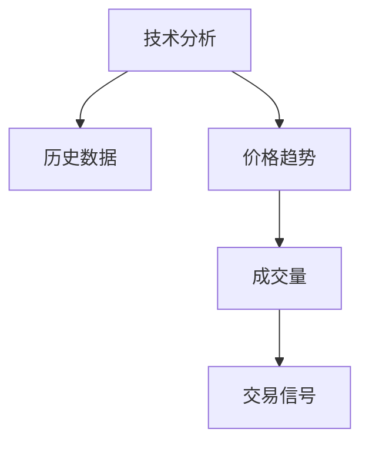
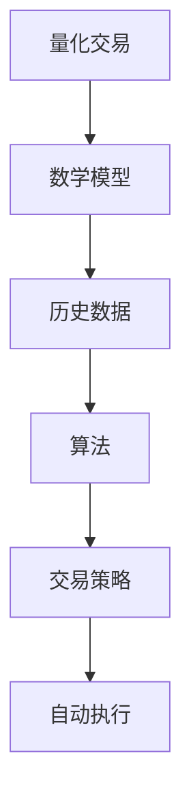
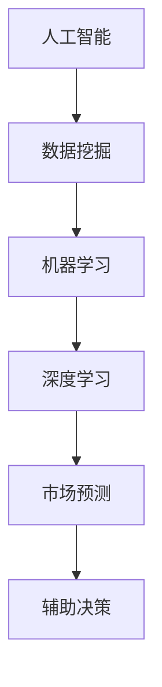

                 

关键词：人工智能、算法、股市投资、技术分析、量化交易

摘要：本文旨在探讨如何利用先进的技术手段，特别是人工智能和算法，来提高股市投资的效率和收益。文章将详细介绍股市投资中的核心概念、算法原理、数学模型及其应用，并通过实际项目实践和案例分析，展示技术优势在股市投资中的具体体现。

## 1. 背景介绍

股市投资作为资本市场的重要组成部分，吸引了众多投资者的参与。然而，随着市场信息量的爆炸式增长和交易频率的快速提高，传统的投资策略面临着前所未有的挑战。人工分析海量的市场数据已经不再现实，这为技术手段的介入提供了契机。

近年来，人工智能（AI）技术的发展为股市投资带来了新的机遇。通过机器学习、深度学习等技术，AI能够从大量历史数据中自动学习模式和规律，从而辅助投资者做出更准确的决策。此外，量化交易作为AI在股市投资中的应用，通过算法自动执行交易策略，极大地提高了交易的效率和收益。

本文将围绕以下核心问题展开讨论：

- 如何运用技术分析进行股市投资？
- 量化交易的基本原理和操作步骤是怎样的？
- 股市投资中常用的数学模型有哪些？
- 实际项目中如何实现和应用这些技术？

## 2. 核心概念与联系

### 2.1 技术分析

技术分析是股市投资中的一种方法，主要通过研究股票的历史价格和成交量等数据，来预测未来股价的走势。技术分析的核心是识别市场趋势和模式，常用的工具包括趋势线、支撑/阻力位、移动平均线等。



### 2.2 量化交易

量化交易是一种利用数学模型和计算机算法进行股票交易的方法。它通过大量历史数据训练模型，发现潜在的市场规律，并自动执行交易策略。量化交易的关键在于模型的构建和策略的优化。



### 2.3 人工智能与股市投资

人工智能在股市投资中的应用主要体现在数据分析和预测上。通过机器学习和深度学习算法，AI可以从大量非结构化数据中提取有价值的信息，辅助投资者做出决策。此外，AI还可以通过自然语言处理技术，分析新闻报道、公司公告等文本信息，提供市场情绪的预测。



## 3. 核心算法原理 & 具体操作步骤

### 3.1 算法原理概述

量化交易的核心在于算法的设计和实现。以下是一些常用的算法原理：

- **时间序列分析**：通过对股票价格的时间序列数据进行统计分析，预测未来的价格走势。
- **机器学习分类算法**：通过训练分类模型，识别股票的上涨和下跌趋势。
- **深度学习神经网络**：构建复杂的神经网络模型，自动学习股票市场的复杂模式。

### 3.2 算法步骤详解

量化交易的步骤通常包括以下几部分：

1. **数据收集**：获取股票的历史数据，包括价格、成交量、财务指标等。
2. **数据处理**：清洗和预处理数据，去除噪声和异常值。
3. **模型构建**：选择合适的模型，如时间序列模型、分类模型或神经网络模型。
4. **模型训练**：使用历史数据训练模型，调整参数，优化模型性能。
5. **策略回测**：在历史数据上测试模型的交易策略，评估其效果。
6. **实时交易**：使用训练好的模型进行实时交易，根据市场变化调整策略。

### 3.3 算法优缺点

量化交易具有以下优点：

- **效率高**：算法可以快速处理大量数据，自动执行交易策略。
- **准确性高**：通过机器学习和深度学习，模型能够捕捉市场的复杂规律。
- **风险可控**：通过严格的回测和风险控制，量化交易能够控制投资风险。

然而，量化交易也存在一些缺点：

- **计算成本高**：算法的构建和训练需要大量的计算资源。
- **模型风险**：模型可能因为过度拟合而失去预测能力。
- **市场波动**：市场的突然变化可能导致交易策略失效。

### 3.4 算法应用领域

量化交易在以下领域有广泛应用：

- **高频交易**：通过快速交易，捕捉市场的微小波动。
- **算法选股**：基于模型选择表现良好的股票。
- **资产配置**：优化投资组合，提高收益和风险平衡。

## 4. 数学模型和公式 & 详细讲解 & 举例说明

### 4.1 数学模型构建

在量化交易中，常用的数学模型包括：

- **时间序列模型**：如ARIMA、GARCH模型等。
- **机器学习模型**：如线性回归、决策树、支持向量机等。
- **深度学习模型**：如卷积神经网络（CNN）、循环神经网络（RNN）等。

### 4.2 公式推导过程

以下是一个简单的ARIMA模型的推导过程：

$$
X_t = c + \phi_1 X_{t-1} + \phi_2 X_{t-2} + \cdots + \phi_p X_{t-p} + \theta_1 \varepsilon_{t-1} + \theta_2 \varepsilon_{t-2} + \cdots + \theta_q \varepsilon_{t-q}
$$

其中，$X_t$ 是时间序列的当前值，$\varepsilon_t$ 是误差项，$\phi_i$ 和 $\theta_i$ 是模型参数。

### 4.3 案例分析与讲解

假设我们使用ARIMA模型预测股票价格，我们可以通过以下步骤进行：

1. **数据收集**：收集股票的历史价格数据。
2. **数据预处理**：进行数据清洗，去除异常值。
3. **模型选择**：根据数据特征选择合适的ARIMA模型。
4. **模型训练**：使用历史数据训练模型。
5. **模型验证**：使用验证集验证模型效果。
6. **预测**：使用模型预测未来股票价格。

## 5. 项目实践：代码实例和详细解释说明

### 5.1 开发环境搭建

为了实现量化交易，我们需要搭建以下开发环境：

- Python编程环境
- 数据库（如MySQL或PostgreSQL）
- 数据分析库（如Pandas、NumPy）
- 机器学习库（如scikit-learn、TensorFlow、PyTorch）

### 5.2 源代码详细实现

以下是一个简单的量化交易项目示例：

```python
import pandas as pd
import numpy as np
from sklearn.model_selection import train_test_split
from sklearn.ensemble import RandomForestClassifier
from sklearn.metrics import accuracy_score

# 数据收集
data = pd.read_csv('stock_data.csv')

# 数据预处理
data['Close'] = data['Close'].astype(float)
data = data.dropna()

# 特征工程
data['MA20'] = data['Close'].rolling(window=20).mean()
data['MA50'] = data['Close'].rolling(window=50).mean()
data['Volume'] = data['Volume'].astype(float)

# 切分训练集和测试集
X = data[['MA20', 'MA50', 'Volume']]
y = data['Close']
X_train, X_test, y_train, y_test = train_test_split(X, y, test_size=0.2, random_state=42)

# 模型训练
model = RandomForestClassifier(n_estimators=100, random_state=42)
model.fit(X_train, y_train)

# 模型预测
y_pred = model.predict(X_test)

# 模型评估
accuracy = accuracy_score(y_test, y_pred)
print(f'模型准确率：{accuracy:.2f}')
```

### 5.3 代码解读与分析

上述代码实现了一个简单的量化交易模型，主要步骤包括：

- 数据收集和预处理：读取股票数据，进行数据清洗和特征工程。
- 切分训练集和测试集：将数据划分为训练集和测试集。
- 模型训练：使用随机森林分类器训练模型。
- 模型预测：使用训练好的模型进行预测。
- 模型评估：评估模型预测的准确率。

### 5.4 运行结果展示

运行上述代码后，我们将得到一个简单的量化交易模型。虽然这个模型的预测准确性可能不高，但它为我们提供了一个实现量化交易的基础框架。在实际应用中，我们可以通过优化模型参数、增加特征变量等方式来提高模型的预测效果。

## 6. 实际应用场景

量化交易在股市投资中具有广泛的应用场景，以下是一些典型的实际应用：

- **高频交易**：通过快速交易，捕捉市场的微小波动。
- **算法选股**：基于模型选择表现良好的股票。
- **资产配置**：优化投资组合，提高收益和风险平衡。
- **市场预测**：预测市场的未来走势，为投资者提供决策支持。

## 7. 工具和资源推荐

为了更好地进行股市投资，我们推荐以下工具和资源：

- **学习资源**：网上有大量的量化交易教程和视频，如Coursera、Udemy等平台的课程。
- **开发工具**：Python是量化交易的首选语言，Pandas、NumPy、scikit-learn等库是常用的数据处理和机器学习工具。
- **相关论文**：《量化交易策略设计与实现》、《人工智能在量化交易中的应用》等。

## 8. 总结：未来发展趋势与挑战

### 8.1 研究成果总结

近年来，人工智能在股市投资中的应用取得了显著成果。通过机器学习和深度学习算法，我们可以从大量历史数据中提取有价值的信息，辅助投资者做出更准确的决策。量化交易作为一种高效的交易策略，已经在市场上取得了良好的效果。

### 8.2 未来发展趋势

未来，人工智能在股市投资中的应用将更加深入和广泛。随着技术的不断进步，我们可以预期：

- **更精准的预测**：通过改进算法和增加特征变量，预测模型的准确性将进一步提高。
- **更高效的交易**：高频交易和自动化交易将更加普及，交易效率将大幅提升。
- **更智能的投资组合**：基于AI的资产配置和风险管理将更加智能化和个性化。

### 8.3 面临的挑战

尽管人工智能在股市投资中具有巨大潜力，但仍面临以下挑战：

- **数据隐私**：市场数据的安全性和隐私性是一个重要问题。
- **模型风险**：模型的过度拟合和预测失效可能带来风险。
- **监管问题**：量化交易在监管方面的规范和法规需要不断完善。

### 8.4 研究展望

未来，人工智能在股市投资中的应用将朝着更加智能化和自动化的方向发展。随着技术的进步和数据的积累，我们有望看到更多高效的交易策略和投资组合。同时，如何解决数据隐私和监管问题也将是未来研究的重要方向。

## 9. 附录：常见问题与解答

### 9.1 量化交易是什么？

量化交易是一种利用数学模型和计算机算法进行股票交易的方法。它通过大量历史数据训练模型，发现潜在的市场规律，并自动执行交易策略。

### 9.2 量化交易的优势是什么？

量化交易具有以下优势：

- **效率高**：算法可以快速处理大量数据，自动执行交易策略。
- **准确性高**：通过机器学习和深度学习，模型能够捕捉市场的复杂规律。
- **风险可控**：通过严格的回测和风险控制，量化交易能够控制投资风险。

### 9.3 量化交易需要哪些技能？

量化交易需要以下技能：

- **编程技能**：熟悉Python等编程语言，掌握数据处理和机器学习库。
- **数学基础**：了解概率论、统计学和线性代数等基础知识。
- **金融市场知识**：了解股票市场的基本原理和交易规则。

### 9.4 如何开始学习量化交易？

可以通过以下步骤开始学习量化交易：

- **学习基础知识**：掌握编程语言和数学基础。
- **学习交易策略**：了解常见的技术分析和量化交易策略。
- **实践项目**：通过实践项目，将理论知识应用于实际操作。
- **不断学习**：跟进最新的研究成果和行业动态。

作者：禅与计算机程序设计艺术 / Zen and the Art of Computer Programming
----------------------------------------------------------------

以上是关于如何利用技术优势进行股市投资的文章。希望对您有所帮助！如果您有任何问题或需要进一步的讨论，请随时告诉我。

