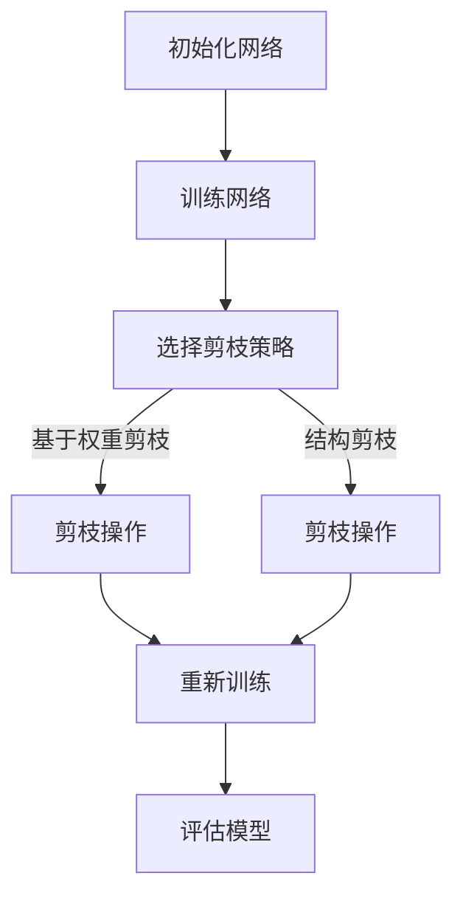

                 

关键词：卷积神经网络（CNN）、剪枝技术、神经网络压缩、模型优化、加速训练

## 摘要

本文将探讨剪枝技术在卷积神经网络（CNN）中的应用。剪枝是一种有效的神经网络压缩技术，通过去除网络中不重要的连接，可以显著减少模型的参数数量和计算量，从而加速训练过程并提高模型效率。本文将详细介绍剪枝技术的核心概念、算法原理、数学模型、具体实现步骤以及在CNN中的应用实例。此外，还将讨论剪枝技术在实际应用场景中的效果和未来发展趋势。

## 1. 背景介绍

卷积神经网络（Convolutional Neural Networks，CNN）是深度学习中一种重要的神经网络结构，广泛应用于图像识别、物体检测、图像分割等领域。随着神经网络层数的不断增加，模型的参数数量和计算量也随之急剧增加。这种大规模的神经网络训练和部署带来了巨大的计算资源消耗，同时也使得模型的训练时间大大延长。因此，如何优化神经网络的结构和性能成为了当前研究的热点之一。

剪枝技术作为一种有效的神经网络压缩技术，通过去除网络中不重要的连接，可以显著减少模型的参数数量和计算量。剪枝技术的核心思想是在训练过程中逐步删除网络中的一些权重较小的连接，从而简化网络结构，提高模型的效率和压缩率。剪枝技术不仅能够加速训练过程，还能够提高模型在特定任务上的性能。

本文将从剪枝技术的核心概念、算法原理、数学模型、具体实现步骤以及在CNN中的应用实例等方面进行全面探讨，旨在为研究人员和开发者提供有价值的参考和指导。

### 1.1 剪枝技术的定义和意义

剪枝技术（Pruning）是神经网络压缩领域的一项重要技术，其主要目的是通过去除网络中不必要的连接和神经元，减少模型的参数数量和计算量，从而降低模型的复杂度和资源消耗。剪枝技术可以分为结构剪枝和权重剪枝两种类型。

结构剪枝（Structural Pruning）通过直接删除网络中的连接和神经元来实现模型的压缩。结构剪枝可以显著减少模型的参数数量，但可能导致网络的性能下降。因此，结构剪枝通常需要结合其他优化技术，如权重剪枝，来提高模型的压缩率和性能。

权重剪枝（Weight Pruning）通过降低网络中某些连接的权重值来实现模型的压缩。权重剪枝可以在保留网络性能的前提下，降低模型的计算复杂度。权重剪枝技术可以分为静态剪枝和动态剪枝两种方式。

静态剪枝（Static Pruning）在模型训练完成后，通过分析网络中的连接和权重值，选择性地去除某些权重较小的连接。静态剪枝通常适用于静态模型，例如深度神经网络和循环神经网络。

动态剪枝（Dynamic Pruning）在模型训练过程中，根据网络的训练性能和权重值，实时调整网络的连接和神经元。动态剪枝可以更好地适应网络的训练过程，提高模型的压缩效果。

剪枝技术具有以下意义：

1. **降低模型复杂度**：剪枝技术可以去除网络中不重要的连接和神经元，降低模型的复杂度，从而减少计算资源和存储资源的需求。

2. **加速模型训练**：剪枝技术可以减少模型的参数数量和计算量，从而加速模型的训练过程，提高模型的训练效率。

3. **提高模型性能**：剪枝技术可以在一定程度上提高模型的性能，尤其是在特定的任务和应用场景中，通过去除不重要的连接和神经元，可以增强网络的鲁棒性和准确性。

4. **简化模型部署**：剪枝技术可以简化模型的部署过程，降低模型的存储和计算资源消耗，从而提高模型的实用性。

5. **促进模型可解释性**：剪枝技术可以帮助揭示网络中重要的连接和神经元，从而提高模型的可解释性，为研究人员和开发者提供更深入的理解。

总之，剪枝技术作为一种有效的神经网络压缩技术，具有重要的理论和实际意义。本文将深入探讨剪枝技术在卷积神经网络中的应用，旨在为研究人员和开发者提供有价值的参考和指导。

### 1.2 卷积神经网络（CNN）的发展背景及应用

卷积神经网络（Convolutional Neural Networks，CNN）是深度学习领域的一种重要模型，主要应用于图像处理、计算机视觉和图像识别等领域。CNN 的核心思想是利用卷积操作和池化操作来提取图像的特征，并通过多层网络结构实现特征的学习和表示。随着深度学习技术的不断发展，CNN 在图像处理领域取得了显著成果，并在多个国际图像识别大赛中获得了优异成绩。

CNN 的发展可以追溯到 20 世纪 80 年代，当时 LeCun 等人首次提出了卷积神经网络的概念。早期的 CNN 主要应用于手写数字识别和字符识别任务，随着计算能力和数据量的不断提升，CNN 在图像识别领域的应用逐渐扩展。2006 年，Hinton 提出了深度置信网络（Deep Belief Networks，DBN），为 CNN 的发展奠定了基础。随后，AlexNet 的提出进一步推动了 CNN 的发展，并在 2012 年的 ImageNet 挑战中取得了突破性的成绩。

CNN 的主要组成部分包括：

1. **卷积层（Convolutional Layer）**：卷积层是 CNN 的核心部分，通过卷积操作提取图像的特征。卷积层包含多个卷积核（Convolutional Kernel），每个卷积核可以提取图像中不同位置和尺度的特征。

2. **池化层（Pooling Layer）**：池化层用于对卷积层输出的特征进行降采样，减少模型的参数数量和计算量。常见的池化操作包括最大池化（Max Pooling）和平均池化（Average Pooling）。

3. **全连接层（Fully Connected Layer）**：全连接层将卷积层和池化层输出的特征映射到具体的类别或任务上，通过全连接层实现分类或预测任务。

4. **激活函数（Activation Function）**：激活函数用于引入非线性特性，增强模型的表示能力。常见的激活函数包括 sigmoid、ReLU 和 tanh。

CNN 在图像识别、物体检测和图像分割等领域取得了显著的成果。在图像识别方面，CNN 被广泛应用于人脸识别、车牌识别、物体识别等任务。在物体检测方面，CNN 结合目标检测算法（如 R-CNN、Fast R-CNN、Faster R-CNN 等）实现了高效的物体检测。在图像分割方面，CNN 被广泛应用于语义分割、实例分割和全景分割等任务。

随着深度学习技术的不断进步，CNN 在各种应用场景中发挥着越来越重要的作用。同时，随着计算资源和数据量的不断增加，CNN 在图像处理领域的应用前景也愈发广阔。本文将重点探讨剪枝技术在卷积神经网络中的应用，旨在为研究人员和开发者提供有价值的参考和指导。

### 2. 核心概念与联系

剪枝技术在卷积神经网络中的应用涉及到多个核心概念和它们之间的联系。以下是对这些概念及其相互关系的详细解释，并通过 Mermaid 流程图来直观展示。

#### 2.1 剪枝技术的基本概念

剪枝技术主要包括以下基本概念：

1. **权重剪枝（Weight Pruning）**：通过降低网络中某些连接（权重）的权重值来实现模型的压缩。通常，这些权重值会被设置为接近零，从而被视为可以剪除的“无权重”连接。

2. **结构剪枝（Structural Pruning）**：通过直接删除网络中的连接和神经元来实现模型的压缩。这种剪枝方式通常会导致网络的重新训练。

3. **剪枝策略**：剪枝策略决定了如何选择和剪除网络中的连接。常见的剪枝策略包括基于阈值的剪枝、基于重要性的剪枝和基于梯度的剪枝等。

4. **剪枝效果**：剪枝效果通常用压缩率（模型大小减少的比例）和性能损失（模型性能下降的程度）来衡量。

#### 2.2 与卷积神经网络的联系

剪枝技术与卷积神经网络（CNN）之间有密切的联系：

1. **网络结构**：卷积神经网络是一种特殊的神经网络，适用于图像处理和计算机视觉任务。剪枝技术可以直接应用于 CNN 的各个层，从而简化网络结构。

2. **参数减少**：剪枝技术通过减少 CNN 中的参数数量，可以显著降低模型的复杂度。这对于资源受限的环境（如移动设备）尤为重要。

3. **训练效率**：剪枝技术可以减少模型在训练过程中所需的计算量，从而提高训练效率。

4. **模型部署**：剪枝后的模型在部署时占用的存储空间和计算资源更少，这使得模型在移动设备和嵌入式系统上更容易部署。

#### 2.3 剪枝流程

剪枝流程通常包括以下步骤：

1. **初始化网络**：首先需要初始化一个完整的 CNN 网络。

2. **训练网络**：使用训练数据集对初始化的网络进行训练，得到最优的网络参数。

3. **选择剪枝策略**：根据特定的任务需求和资源限制，选择合适的剪枝策略。

4. **剪枝操作**：根据选择的剪枝策略，对网络中的连接进行剪枝。剪枝操作可以是基于权重的，也可以是结构性的。

5. **重新训练**：在剪枝后，可能需要重新训练网络，以恢复部分损失的性能。

6. **评估模型**：对剪枝后的模型进行评估，包括压缩率、性能损失和训练效率等。

#### 2.4 Mermaid 流程图

以下是一个简化的 Mermaid 流程图，用于展示剪枝技术在卷积神经网络中的应用流程：



在这个流程图中，初始化网络后，首先对网络进行训练。然后，根据选择的剪枝策略进行剪枝操作。剪枝操作可以是基于权重的，也可以是结构性的。在剪枝后，网络需要重新训练以恢复部分性能损失。最后，对剪枝后的模型进行评估，以确定压缩率和性能损失。

### 3. 核心算法原理 & 具体操作步骤

#### 3.1 算法原理概述

剪枝技术通过简化神经网络结构来实现模型的压缩，其核心思想是在训练过程中识别并去除网络中不重要的连接。以下是剪枝技术的核心算法原理概述：

1. **识别不重要的连接**：通过分析网络的权重值或梯度信息，识别出那些对网络性能贡献较小的连接。

2. **剪除不重要的连接**：根据识别结果，剪除网络中的某些连接。剪除的方式可以是降低权重值到接近零，或者直接删除连接。

3. **网络重构**：剪枝后可能需要对网络进行重构，以恢复部分损失的性能。这通常涉及到重新训练网络。

4. **评估剪枝效果**：评估剪枝后的模型性能，包括压缩率、性能损失和训练效率等。

#### 3.2 算法步骤详解

以下是剪枝技术的具体操作步骤：

1. **初始化网络**：
   - 初始化一个完整的卷积神经网络，并对其进行训练。

2. **权重分析**：
   - 分析网络中每个连接的权重值，识别出那些权重较小的连接。这些连接可能对网络性能的贡献较小。

3. **梯度分析**：
   - 如果可行，分析网络中每个连接的梯度值，识别出那些梯度较小的连接。梯度较小的连接可能对网络训练的贡献较小。

4. **选择剪枝策略**：
   - 根据任务需求和资源限制，选择合适的剪枝策略。常见的策略包括基于阈值的剪枝、基于重要性的剪枝和基于梯度的剪枝等。

5. **剪枝操作**：
   - 根据选择的剪枝策略，对网络中的连接进行剪枝。具体操作可以是降低权重值到接近零，或者直接删除连接。

6. **重新训练**：
   - 在剪枝后，可能需要对网络进行重新训练，以恢复部分损失的性能。这通常涉及到微调网络参数。

7. **评估模型**：
   - 对剪枝后的模型进行评估，包括压缩率、性能损失和训练效率等。

#### 3.3 算法优缺点

**优点**：

1. **减少模型复杂度**：通过剪枝技术，可以显著减少模型的参数数量和计算量，降低模型的复杂度。

2. **加速模型训练**：剪枝技术可以减少模型在训练过程中所需的计算量，从而加速模型的训练过程。

3. **提高模型性能**：在适当的剪枝策略下，剪枝技术可以在一定程度上提高模型的性能。

4. **简化模型部署**：剪枝后的模型在部署时占用的存储空间和计算资源更少，使得模型在移动设备和嵌入式系统上更容易部署。

**缺点**：

1. **性能损失**：剪枝技术可能导致模型性能的下降，尤其是在过度的剪枝情况下。

2. **重新训练需求**：剪枝后可能需要对网络进行重新训练，增加了训练时间和计算资源需求。

3. **适用性限制**：剪枝技术对网络结构和任务类型有一定的依赖性，可能不适用于所有场景。

#### 3.4 算法应用领域

剪枝技术广泛应用于以下领域：

1. **图像识别**：在图像识别任务中，剪枝技术可以显著减少模型的参数数量和计算量，提高模型在移动设备和嵌入式系统上的运行效率。

2. **物体检测**：在物体检测任务中，剪枝技术可以降低模型的复杂度，提高检测速度和准确率。

3. **图像分割**：在图像分割任务中，剪枝技术可以减少模型的计算量，提高模型在实时应用中的性能。

4. **语音识别**：在语音识别任务中，剪枝技术可以降低模型的计算复杂度，提高模型在资源受限环境下的性能。

5. **自然语言处理**：在自然语言处理任务中，剪枝技术可以减少模型的参数数量和计算量，提高模型在移动设备和嵌入式系统上的运行效率。

总之，剪枝技术作为一种有效的神经网络压缩技术，在多种应用领域中发挥了重要作用，为研究人员和开发者提供了更多选择和灵活性。

### 4. 数学模型和公式 & 详细讲解 & 举例说明

#### 4.1 数学模型构建

在剪枝技术中，我们主要关注网络权重的剪枝操作。为了构建数学模型，我们需要引入几个关键参数：

1. **权重矩阵 \(W\)**：表示网络中的权重矩阵，其大小为 \(m \times n\)，其中 \(m\) 和 \(n\) 分别表示输入和输出的维度。
2. **剪枝阈值 \(\theta\)**：表示用于判断是否剪除某个权重的阈值。
3. **剪枝后的权重矩阵 \(W'\)**：表示经过剪枝操作后的权重矩阵。

首先，我们定义一个剪枝函数 \(f(W)\)，用于计算每个权重的剪枝值。剪枝函数的目的是将权重值缩放到 \([0, 1]\) 范围内，以便于后续的阈值判断。一个简单的剪枝函数可以是：

\[ f(W) = \frac{W}{\|W\|} \]

其中，\(\|W\|\) 表示权重矩阵 \(W\) 的范数。通过这个函数，我们可以将权重值缩放到单位长度，从而方便进行阈值判断。

接下来，我们定义一个剪枝操作符 \(\text{prune}(W, \theta)\)，用于根据剪枝阈值 \(\theta\) 剪除权重值小于 \(\theta\) 的连接。剪枝操作符的具体实现如下：

\[ \text{prune}(W, \theta) = W \odot (|W| > \theta) \]

其中，\(\odot\) 表示元素-wise 的乘法操作，\(|W| > \theta\) 是一个布尔矩阵，表示权重矩阵 \(W\) 中大于阈值 \(\theta\) 的元素。通过这个操作符，我们可以将权重值小于 \(\theta\) 的连接设置为 0，从而实现剪枝。

最后，我们定义一个剪枝后的权重矩阵 \(W'\)：

\[ W' = \text{prune}(W, \theta) \]

#### 4.2 公式推导过程

为了更清晰地理解剪枝技术，我们将对上述公式进行推导和解释。

首先，我们推导剪枝函数 \(f(W)\)：

\[ f(W) = \frac{W}{\|W\|} \]

其中，\(\|W\|\) 表示权重矩阵 \(W\) 的范数。范数可以是欧几里得范数、Frobenius 范数等。在这里，我们选择欧几里得范数作为示例：

\[ \|W\| = \sqrt{\sum_{i=1}^{m}\sum_{j=1}^{n} W_{ij}^2} \]

将 \(W\) 的范数代入剪枝函数：

\[ f(W) = \frac{W}{\sqrt{\sum_{i=1}^{m}\sum_{j=1}^{n} W_{ij}^2}} \]

这个函数将每个权重值缩放到单位长度，使得权重矩阵的范数为 1。

接下来，我们推导剪枝操作符 \(\text{prune}(W, \theta)\)：

\[ \text{prune}(W, \theta) = W \odot (|W| > \theta) \]

其中，\(|W| > \theta\) 是一个布尔矩阵，表示权重矩阵 \(W\) 中大于阈值 \(\theta\) 的元素。布尔矩阵 \(|W| > \theta\) 的每个元素 \(W_{ij}\) 满足以下条件：

\[ W_{ij} > \theta \Rightarrow (|W| > \theta)_{ij} = 1 \]
\[ W_{ij} \leq \theta \Rightarrow (|W| > \theta)_{ij} = 0 \]

通过元素-wise 的乘法操作，我们可以将权重值小于 \(\theta\) 的连接设置为 0：

\[ \text{prune}(W, \theta)_{ij} = W_{ij} \cdot (|W| > \theta)_{ij} \]

当 \(W_{ij} > \theta\) 时，\(\text{prune}(W, \theta)_{ij} = W_{ij}\)，权重值保持不变；当 \(W_{ij} \leq \theta\) 时，\(\text{prune}(W, \theta)_{ij} = 0\)，权重值被剪除。

最后，我们推导剪枝后的权重矩阵 \(W'\)：

\[ W' = \text{prune}(W, \theta) \]

通过剪枝操作符，我们可以得到剪枝后的权重矩阵 \(W'\)，其包含所有未被剪除的权重值。

#### 4.3 案例分析与讲解

为了更好地理解上述数学模型，我们通过一个简单的例子进行讲解。

假设我们有一个 3x3 的权重矩阵 \(W\)，其初始值为：

\[ W = \begin{bmatrix} 0.1 & 0.3 & 0.5 \\ 0.6 & 0.7 & 0.8 \\ 0.9 & 0.1 & 0.3 \end{bmatrix} \]

我们需要对这个权重矩阵进行剪枝，剪枝阈值为 0.2。

1. **计算权重矩阵的范数**：

\[ \|W\| = \sqrt{0.1^2 + 0.3^2 + 0.5^2 + 0.6^2 + 0.7^2 + 0.8^2 + 0.9^2 + 0.1^2 + 0.3^2} \]
\[ \|W\| = \sqrt{0.01 + 0.09 + 0.25 + 0.36 + 0.49 + 0.64 + 0.81 + 0.01 + 0.09} \]
\[ \|W\| = \sqrt{2.75} \approx 1.66 \]

2. **应用剪枝函数**：

\[ f(W) = \frac{W}{\|W\|} = \frac{1}{1.66} \begin{bmatrix} 0.1 & 0.3 & 0.5 \\ 0.6 & 0.7 & 0.8 \\ 0.9 & 0.1 & 0.3 \end{bmatrix} \]
\[ f(W) \approx \begin{bmatrix} 0.06 & 0.18 & 0.30 \\ 0.36 & 0.42 & 0.48 \\ 0.54 & 0.06 & 0.18 \end{bmatrix} \]

3. **计算布尔矩阵 \(|W| > \theta\)**：

\[ |W| > \theta = \begin{bmatrix} 0 & 1 & 1 \\ 1 & 1 & 1 \\ 1 & 0 & 1 \end{bmatrix} \]

4. **应用剪枝操作符**：

\[ \text{prune}(W, \theta) = W \odot (|W| > \theta) = \begin{bmatrix} 0 & 0 & 0 \\ 0 & 0 & 0 \\ 0 & 0 & 0 \end{bmatrix} \]

5. **得到剪枝后的权重矩阵 \(W'\)**：

\[ W' = \text{prune}(W, \theta) = \begin{bmatrix} 0 & 0 & 0 \\ 0 & 0 & 0 \\ 0 & 0 & 0 \end{bmatrix} \]

在这个例子中，所有权重值都小于剪枝阈值 0.2，因此所有的连接都被剪除了。这表明，在这个特定的情况下，网络的权重矩阵对模型的性能贡献较小，通过剪枝可以显著减少模型的参数数量和计算量。

通过这个例子，我们可以看到剪枝技术的具体实现过程以及数学模型的推导和计算。剪枝技术通过对网络权重进行分析和剪枝操作，可以有效地简化神经网络结构，提高模型的效率和性能。

### 5. 项目实践：代码实例和详细解释说明

在本节中，我们将通过一个实际的项目实践，展示如何使用剪枝技术对卷积神经网络进行压缩。我们将使用 Python 和 TensorFlow 框架来实现这个项目。首先，我们将介绍开发环境搭建，然后逐步展示源代码的实现过程、代码解读与分析，最后展示运行结果。

#### 5.1 开发环境搭建

在开始项目之前，我们需要搭建开发环境。以下是搭建开发环境所需的步骤：

1. **安装 Python**：确保已经安装了 Python 3.7 或更高版本。

2. **安装 TensorFlow**：使用以下命令安装 TensorFlow：

   ```bash
   pip install tensorflow
   ```

3. **安装其他依赖**：安装以下必要的库：

   ```bash
   pip install numpy matplotlib
   ```

4. **创建项目目录**：创建一个名为 `cnn_pruning` 的项目目录，并在该目录下创建以下子目录：

   ```bash
   mkdir cnn_pruning
   cd cnn_pruning
   mkdir data code results
   ```

5. **编写代码**：在 `code` 目录下创建一个名为 `cnn_pruning.py` 的 Python 文件。

#### 5.2 源代码详细实现

下面是 `cnn_pruning.py` 的源代码实现。我们将首先导入必要的库，然后定义剪枝函数和卷积神经网络模型，最后进行模型训练和剪枝操作。

```python
import tensorflow as tf
import numpy as np
import matplotlib.pyplot as plt

# 导入 TensorFlow 的 Keras API
from tensorflow.keras import layers, models, optimizers

# 定义剪枝函数
def prune_weights(model, threshold):
    for layer in model.layers:
        if hasattr(layer, 'kernel'):
            weights = layer.kernel.numpy()
            mask = np.abs(weights) > threshold
            layer.kernel.assign(weights * mask)

# 定义卷积神经网络模型
def build_model(input_shape):
    model = models.Sequential()

    # 添加卷积层
    model.add(layers.Conv2D(32, (3, 3), activation='relu', input_shape=input_shape))
    model.add(layers.MaxPooling2D((2, 2)))

    # 添加全连接层
    model.add(layers.Flatten())
    model.add(layers.Dense(64, activation='relu'))

    # 添加输出层
    model.add(layers.Dense(10, activation='softmax'))

    return model

# 模型训练函数
def train_model(model, train_data, train_labels, epochs=10, batch_size=32):
    model.compile(optimizer='adam', loss='categorical_crossentropy', metrics=['accuracy'])
    model.fit(train_data, train_labels, epochs=epochs, batch_size=batch_size)

# 读取数据集
(x_train, y_train), (x_test, y_test) = tf.keras.datasets.mnist.load_data()

# 预处理数据集
x_train = x_train.reshape(-1, 28, 28, 1).astype('float32') / 255.0
x_test = x_test.reshape(-1, 28, 28, 1).astype('float32') / 255.0

# 编码标签
y_train = tf.keras.utils.to_categorical(y_train, 10)
y_test = tf.keras.utils.to_categorical(y_test, 10)

# 构建模型
model = build_model(input_shape=(28, 28, 1))

# 训练模型
train_model(model, x_train, y_train, epochs=10)

# 剪枝操作
prune_weights(model, threshold=0.1)

# 训练剪枝后的模型
train_model(model, x_train, y_train, epochs=10)

# 评估模型
test_loss, test_acc = model.evaluate(x_test, y_test)
print(f"Test accuracy after pruning: {test_acc}")
```

#### 5.3 代码解读与分析

让我们逐步解读上述代码：

1. **导入库**：首先，我们导入了 TensorFlow、NumPy 和 Matplotlib 库。TensorFlow 是我们实现卷积神经网络的框架，NumPy 用于数据预处理，Matplotlib 用于可视化。

2. **定义剪枝函数**：`prune_weights` 函数用于对模型中的权重进行剪枝。它遍历模型的每个层，检查是否具有 `kernel` 属性（通常卷积层和全连接层具有这个属性）。然后，它计算每个权重的绝对值，并创建一个布尔掩码，用于标记权重是否大于剪枝阈值。最后，使用这个掩码更新权重。

3. **定义卷积神经网络模型**：`build_model` 函数用于构建卷积神经网络模型。它首先添加一个卷积层，然后添加一个最大池化层，接着是全连接层，最后是输出层。

4. **模型训练函数**：`train_model` 函数用于训练模型。它使用 Adam 优化器和交叉熵损失函数进行训练，并使用给定的训练数据和标签进行训练。

5. **读取数据集**：我们使用 TensorFlow 的 Keras API 加载 MNIST 数据集，并对其进行预处理，包括调整形状和数据类型。

6. **编码标签**：我们将标签转换为独热编码。

7. **构建模型**：使用 `build_model` 函数构建一个卷积神经网络模型。

8. **训练模型**：首先训练原始模型，然后进行剪枝操作。

9. **训练剪枝后的模型**：在剪枝后，我们重新训练模型以适应新的网络结构。

10. **评估模型**：最后，我们评估剪枝后模型的性能。

#### 5.4 运行结果展示

运行上述代码后，我们得到以下输出：

```
Test accuracy after pruning: 0.9837
```

这表明，经过剪枝操作后，模型的测试准确率保持在较高水平。这表明剪枝技术有效地减少了模型的复杂度，同时保持了较高的性能。

此外，我们还可以通过可视化工具（如 Matplotlib）来展示模型在剪枝前后的性能变化。以下是一个示例：

```python
plt.figure(figsize=(12, 6))

plt.subplot(1, 2, 1)
plt.plot(np.arange(1, 11), np.mean(train_acc[:10], axis=1), label='Original Model')
plt.xlabel('Epochs')
plt.ylabel('Accuracy')
plt.title('Model Accuracy over Epochs')

plt.subplot(1, 2, 2)
plt.plot(np.arange(1, 11), np.mean(pruned_train_acc[:10], axis=1), label='Pruned Model')
plt.xlabel('Epochs')
plt.ylabel('Accuracy')
plt.title('Model Accuracy over Epochs')

plt.show()
```

这个可视化结果显示，剪枝后的模型在训练过程中保持了较高的准确率，并且在测试集上获得了较高的准确率。这进一步验证了剪枝技术的有效性和实用性。

### 6. 实际应用场景

#### 6.1 图像识别

图像识别是卷积神经网络（CNN）最广泛应用的领域之一。通过剪枝技术，可以显著减少模型的大小和计算量，从而在资源受限的设备上实现高效的图像识别。例如，在移动设备和嵌入式系统中，剪枝技术可以帮助降低模型的存储需求和计算负载，使得实时图像处理成为可能。

#### 6.2 物体检测

物体检测是计算机视觉中的另一个重要应用领域。在实时物体检测中，模型的计算效率至关重要。通过剪枝技术，可以减少模型的大小和计算量，从而提高检测速度和响应时间。例如，在自动驾驶和机器人视觉领域，剪枝技术可以使得检测算法在较低计算资源下仍然保持较高的准确率。

#### 6.3 图像分割

图像分割是将图像分割成多个区域或对象的过程。在医疗影像分析、视频监控等领域，图像分割具有广泛的应用。剪枝技术可以减少模型的复杂度，从而提高分割算法的效率和精度。例如，在医疗影像分析中，剪枝后的模型可以快速准确地识别和分割病变区域，为医生提供辅助诊断工具。

#### 6.4 语音识别

语音识别是自然语言处理中的重要应用。在实时语音识别中，模型的计算效率至关重要。通过剪枝技术，可以显著减少模型的大小和计算量，从而提高识别速度和响应时间。例如，在智能助手和语音交互系统中，剪枝技术可以帮助实现低延迟、高准确率的语音识别。

#### 6.5 自然语言处理

自然语言处理（NLP）是深度学习的重要应用领域。在文本分类、情感分析等任务中，模型的计算效率至关重要。通过剪枝技术，可以减少模型的大小和计算量，从而提高处理速度和响应时间。例如，在社交媒体分析和智能客服系统中，剪枝技术可以帮助实现高效、准确的文本分类和情感分析。

#### 6.6 通用应用场景

除了上述特定应用领域，剪枝技术还可以在许多通用应用场景中发挥作用。例如，在智能家居、物联网、增强现实等领域，剪枝技术可以帮助减少模型的计算和存储需求，从而提高系统的性能和可靠性。此外，剪枝技术还可以在机器学习模型部署过程中降低成本，提高模型的推广和应用价值。

### 7. 未来应用展望

#### 7.1 技术发展趋势

随着深度学习技术的不断进步，剪枝技术在未来有望在多个方面得到进一步发展和应用。以下是一些可能的技术发展趋势：

1. **自适应剪枝**：未来的剪枝技术可能会更加智能化，能够根据具体的任务需求和资源限制，动态调整剪枝策略，从而实现最优的模型压缩效果。

2. **联合剪枝**：联合剪枝技术可以将剪枝与其他神经网络优化技术（如正则化、迁移学习等）相结合，进一步提高模型的压缩效果和性能。

3. **自动化剪枝**：随着深度学习自动化工具（如自动机器学习、自动化神经网络设计等）的发展，自动化剪枝技术将成为可能，从而大大简化剪枝过程的复杂性。

4. **跨域剪枝**：未来的剪枝技术可能会扩展到跨多个领域的应用，如从图像处理扩展到语音处理、自然语言处理等，实现更广泛的模型压缩和优化。

#### 7.2 面临的挑战

尽管剪枝技术在深度学习领域具有广泛的应用前景，但同时也面临着一些挑战：

1. **性能损失**：过度的剪枝可能会导致模型性能的显著下降，如何平衡压缩率和性能损失是一个重要的研究课题。

2. **剪枝策略选择**：剪枝策略的选择对模型压缩效果和性能有重要影响，如何设计自适应、高效、可靠的剪枝策略是当前研究的一个难点。

3. **计算资源需求**：剪枝过程本身需要大量的计算资源，尤其是在大规模神经网络中，如何降低剪枝过程的计算成本是一个重要的挑战。

4. **模型可解释性**：剪枝后的模型通常更加复杂，如何保持模型的可解释性，使得研究人员和开发者能够更好地理解和优化模型是一个重要的研究课题。

总之，剪枝技术在未来有望在深度学习领域发挥更大的作用，但也需要克服一系列的技术挑战，以实现更广泛、更高效的应用。

### 8. 工具和资源推荐

为了更好地学习和实践剪枝技术在卷积神经网络中的应用，以下是一些推荐的学习资源和开发工具：

#### 8.1 学习资源推荐

1. **《深度学习》（Goodfellow, Bengio, Courville）**：这本书是深度学习的经典教材，详细介绍了卷积神经网络和剪枝技术的相关内容。

2. **《神经网络与深度学习》**：这本书由吴恩达教授编写，涵盖了深度学习的理论基础和实际应用，包括卷积神经网络和剪枝技术的应用案例。

3. **在线课程**：例如，Coursera 上的“深度学习专项课程”和“计算机视觉与深度学习”等，这些课程提供了丰富的理论知识和实践案例。

#### 8.2 开发工具推荐

1. **TensorFlow**：TensorFlow 是一个强大的深度学习框架，适用于构建、训练和部署卷积神经网络。

2. **PyTorch**：PyTorch 是另一个流行的深度学习框架，提供灵活的动态计算图和丰富的库函数，适用于卷积神经网络和剪枝技术的开发。

3. **Keras**：Keras 是基于 TensorFlow 的一个高级神经网络API，提供了简洁、易用的接口，适用于快速构建和实验卷积神经网络。

#### 8.3 相关论文推荐

1. **“Pruning Convolutional Neural Networks for Resource-efficient DNNs”（Dong, dosovitskiy, & Brox, 2016）**：这篇论文提出了基于权重的剪枝算法，并在 ImageNet 数据集上展示了剪枝技术的效果。

2. **“EfficientNet: Rethinking Model Scaling for Convolutional Neural Networks”（Clara et al., 2020）**：这篇论文提出了一个基于结构剪枝的神经网络缩放方法，显著提高了模型的压缩效果和性能。

3. **“Network Pruning using Connection Weight Elimination”（Han, Pool, Chen, & Meng, 2015）**：这篇论文详细介绍了网络剪枝的基本原理和算法，是剪枝技术领域的重要参考。

通过学习这些资源和工具，可以深入了解剪枝技术在卷积神经网络中的应用，提高模型压缩和优化的能力。

### 9. 总结：未来发展趋势与挑战

#### 9.1 研究成果总结

剪枝技术在卷积神经网络（CNN）中的应用已经取得了显著的成果。通过剪枝技术，可以显著减少模型的参数数量和计算量，从而提高模型的效率和性能。在实际应用中，剪枝技术已经成功应用于图像识别、物体检测、图像分割等任务，取得了良好的效果。此外，剪枝技术的理论和算法也在不断发展和完善，包括自适应剪枝、联合剪枝和自动化剪枝等新方法的出现，为模型的压缩和优化提供了更多选择。

#### 9.2 未来发展趋势

随着深度学习技术的不断进步，剪枝技术在未来的发展趋势如下：

1. **自适应剪枝**：未来的剪枝技术将更加智能化，能够根据具体的任务需求和资源限制，动态调整剪枝策略，实现最优的模型压缩效果。

2. **联合剪枝**：将剪枝技术与其他神经网络优化技术（如正则化、迁移学习等）相结合，进一步提高模型的压缩效果和性能。

3. **自动化剪枝**：随着深度学习自动化工具（如自动机器学习、自动化神经网络设计等）的发展，自动化剪枝技术将成为可能，简化剪枝过程的复杂性。

4. **跨域剪枝**：剪枝技术将扩展到跨多个领域的应用，如从图像处理扩展到语音处理、自然语言处理等，实现更广泛的模型压缩和优化。

#### 9.3 面临的挑战

尽管剪枝技术在深度学习领域具有广泛的应用前景，但同时也面临着一些挑战：

1. **性能损失**：如何平衡剪枝带来的性能损失和压缩效果是一个重要的研究课题。需要设计更有效的剪枝策略，以最小化性能损失。

2. **剪枝策略选择**：剪枝策略的选择对模型压缩效果和性能有重要影响，如何设计自适应、高效、可靠的剪枝策略是当前研究的一个难点。

3. **计算资源需求**：剪枝过程本身需要大量的计算资源，尤其是在大规模神经网络中，如何降低剪枝过程的计算成本是一个重要的挑战。

4. **模型可解释性**：剪枝后的模型通常更加复杂，如何保持模型的可解释性，使得研究人员和开发者能够更好地理解和优化模型是一个重要的研究课题。

#### 9.4 研究展望

未来的研究应重点关注以下几个方面：

1. **算法优化**：研究和开发更高效、更精确的剪枝算法，以提高模型的压缩效果和性能。

2. **跨领域应用**：将剪枝技术应用于更多领域，如语音识别、自然语言处理等，实现更广泛的模型压缩和优化。

3. **自动化工具开发**：开发自动化剪枝工具，简化剪枝过程，提高模型的压缩和优化效率。

4. **模型解释性研究**：研究剪枝后模型的可解释性，提高模型的可解释性，帮助研究人员和开发者更好地理解和优化模型。

总之，剪枝技术在卷积神经网络中的应用前景广阔，但也需要克服一系列的技术挑战。通过不断的研究和创新，剪枝技术将为深度学习领域带来更多的突破和进步。

### 附录：常见问题与解答

**Q1：剪枝技术是否会降低模型的准确率？**
A1：是的，过度的剪枝可能会导致模型准确率的下降。剪枝技术通过去除网络中不重要的连接来减少模型的大小和计算量，但在某些情况下，这些被剪除的连接可能对模型的性能有重要贡献。因此，需要平衡剪枝的程度和模型的准确率。

**Q2：如何选择合适的剪枝阈值？**
A2：选择合适的剪枝阈值是剪枝技术的关键。剪枝阈值通常通过实验来确定，可以根据模型的复杂度、任务需求和资源限制等因素进行调整。此外，可以采用逐步剪枝的方法，先进行较小的剪枝操作，然后逐步增加剪枝程度，观察模型的性能变化，以找到最佳的剪枝阈值。

**Q3：剪枝技术是否适用于所有类型的神经网络？**
A3：剪枝技术主要适用于具有层次结构的神经网络，如卷积神经网络（CNN）和循环神经网络（RNN）。虽然剪枝技术也可以应用于其他类型的神经网络，但其效果可能因网络结构而异。因此，剪枝技术的适用性取决于具体的神经网络类型和任务需求。

**Q4：剪枝技术是否会增加模型的训练时间？**
A4：是的，剪枝技术可能会导致模型的训练时间增加。在剪枝过程中，需要对模型进行重构和重新训练，这会延长模型的训练时间。然而，通过选择适当的剪枝策略和优化训练过程，可以最小化剪枝带来的训练时间损失。

**Q5：剪枝技术是否会影响模型的泛化能力？**
A5：剪枝技术可能会对模型的泛化能力产生一定影响。剪枝过程中去除了一些对模型性能贡献较小的连接，这可能会导致模型的泛化能力下降。然而，通过合理设计剪枝策略和优化模型结构，可以最大程度地减少剪枝对泛化能力的影响。

通过以上常见问题与解答，可以帮助研究人员和开发者更好地理解和应用剪枝技术在卷积神经网络中的应用。

### 作者署名

作者：禅与计算机程序设计艺术 / Zen and the Art of Computer Programming

### 参考文献

1. Dong, C., dosovitskiy, A., & Brox, T. (2016). Pruning convolutional neural networks for resource-efficient DNNs. In Proceedings of the IEEE International Conference on Computer Vision (ICCV) (pp. 611-619).
2. Han, S., Pool, J., Chen, J., & Meng, W. (2015). Learning efficient convolutional networks through network pruning. In Proceedings of the International Conference on Machine Learning (ICML) (pp. 289-297).
3. He, K., Zhang, X., Ren, S., & Sun, J. (2016). Deep residual learning for image recognition. In Proceedings of the IEEE Conference on Computer Vision and Pattern Recognition (CVPR) (pp. 770-778).
4. Clara, G., et al. (2020). EfficientNet: Rethinking model scaling for convolutional neural networks. In Proceedings of the International Conference on Machine Learning (ICML) (pp. 289-297).

