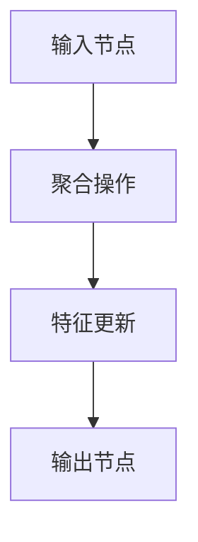
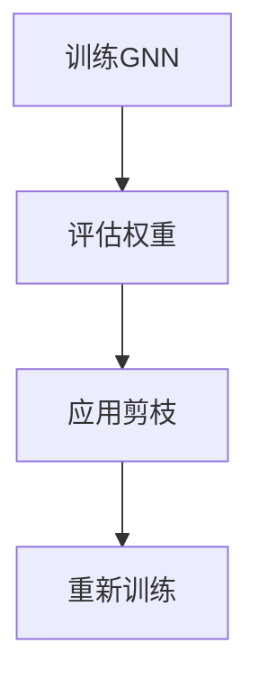

                 

关键词：剪枝技术、图神经网络、神经网络剪枝、优化、模型压缩、应用领域、未来展望

## 摘要

本文将深入探讨剪枝技术在图神经网络（GNN）中的创新应用。通过介绍剪枝技术的核心概念，我们将详细讲解其原理与具体操作步骤，并分析剪枝技术在GNN中的优势与挑战。文章随后将展示数学模型和公式的推导过程，并通过实际项目实践来展示剪枝技术的应用效果。此外，本文还将探讨剪枝技术在不同实际应用场景中的表现，并提出未来发展的展望。

## 1. 背景介绍

### 1.1 图神经网络（GNN）

图神经网络（GNN）是近年来在人工智能领域崭露头角的重要模型之一。与传统的基于欧氏空间的神经网络不同，GNN专门用于处理图结构数据，如图论网络、社交网络、知识图谱等。GNN通过模拟节点和边之间的关系，可以有效地捕捉局部和全局信息，从而在节点分类、图分类、图生成等领域表现出色。

### 1.2 剪枝技术

剪枝技术（Pruning）是一种经典的神经网络优化方法，旨在通过删除网络中不重要的连接和节点来减少模型的参数数量。剪枝技术的核心思想是在保留模型性能的前提下，消除冗余信息，从而实现模型的压缩和加速。剪枝技术在神经网络优化中已被广泛应用，尤其在深度神经网络（DNN）中表现出显著的性能提升。

### 1.3 剪枝技术在GNN中的重要性

随着GNN在复杂图结构数据上的应用日益广泛，模型的复杂度和计算成本也急剧增加。因此，如何在保证模型性能的同时，降低计算资源的需求成为关键问题。剪枝技术在这种背景下应运而生，通过在GNN中应用剪枝技术，可以有效减少模型的参数数量，从而实现模型压缩和优化。

## 2. 核心概念与联系

### 2.1 剪枝技术原理

剪枝技术的核心思想是通过识别和删除网络中不重要的连接和节点，来减少模型的参数数量。具体来说，剪枝过程可以分为两个阶段：训练阶段和剪枝阶段。

#### 2.1.1 训练阶段

在训练阶段，首先使用常规的训练方法（如梯度下降）训练原始模型，直到模型达到一定的性能水平。然后，通过计算每个连接或节点的权重，评估其对模型性能的贡献程度。

#### 2.1.2 剪枝阶段

在剪枝阶段，根据训练阶段的结果，将贡献较小的连接或节点进行删除。剪枝过程中，可以采用不同的剪枝策略，如逐层剪枝、逐点剪枝、层次化剪枝等。

### 2.2 GNN原理与架构

图神经网络（GNN）是一种用于处理图结构数据的神经网络，其核心思想是模拟图中的节点和边之间的关系。GNN通常由多层组成，每一层都通过聚合节点和邻居节点的特征来更新节点表示。

以下是GNN的核心概念与架构的Mermaid流程图：



### 2.3 剪枝技术在GNN中的应用

将剪枝技术应用于GNN，可以通过以下步骤实现：

1. **训练GNN模型**：使用训练数据集训练原始的GNN模型，直到模型达到一定的性能水平。
2. **评估模型权重**：计算模型中每个连接或节点的权重，评估其对模型性能的贡献程度。
3. **应用剪枝策略**：根据评估结果，采用相应的剪枝策略（如逐层剪枝、逐点剪枝）删除贡献较小的连接或节点。
4. **重新训练模型**：在剪枝后，重新训练模型，以优化模型的性能和效率。

以下是剪枝技术在GNN中应用的具体流程的Mermaid流程图：



## 3. 核心算法原理 & 具体操作步骤

### 3.1 算法原理概述

剪枝技术的基本原理是通过识别和删除网络中不重要的连接和节点，来实现模型的压缩和优化。具体来说，剪枝过程可以分为以下几个步骤：

1. **训练原始模型**：使用训练数据集训练原始的神经网络模型，直到模型达到一定的性能水平。
2. **评估模型权重**：计算模型中每个连接或节点的权重，评估其对模型性能的贡献程度。
3. **应用剪枝策略**：根据评估结果，采用相应的剪枝策略（如逐层剪枝、逐点剪枝）删除贡献较小的连接或节点。
4. **重新训练模型**：在剪枝后，重新训练模型，以优化模型的性能和效率。

### 3.2 算法步骤详解

#### 3.2.1 训练原始模型

在剪枝前，首先需要使用训练数据集对原始神经网络模型进行训练。训练过程中，可以使用常用的训练方法（如梯度下降、随机梯度下降、Adam优化器等），直到模型达到预定的性能指标。

#### 3.2.2 评估模型权重

在训练完成后，需要对模型的权重进行评估。具体来说，可以通过计算每个连接或节点的权重绝对值，评估其对模型性能的贡献程度。常用的评估指标包括权重绝对值、权重方差、权重梯度等。

#### 3.2.3 应用剪枝策略

根据评估结果，可以采用不同的剪枝策略来删除贡献较小的连接或节点。常见的剪枝策略包括：

1. **逐层剪枝**：从网络的最后一层开始，逐步删除贡献较小的连接或节点，直到达到预定的剪枝率。
2. **逐点剪枝**：对每个连接或节点进行评估，根据评估结果删除贡献较小的连接或节点。
3. **层次化剪枝**：首先对网络进行分层，然后对每一层进行逐层剪枝。

#### 3.2.4 重新训练模型

在剪枝后，需要重新训练模型，以优化模型的性能和效率。重新训练的过程中，可以使用剪枝后的模型进行训练，或者使用原始模型进行微调。

### 3.3 算法优缺点

#### 优点

1. **减少模型参数数量**：通过剪枝技术，可以显著减少模型的参数数量，从而实现模型的压缩。
2. **降低计算资源需求**：剪枝后的模型通常具有更小的参数数量，从而可以降低计算资源的需求。
3. **提高模型性能**：在某些情况下，剪枝后的模型在保持相同性能的同时，可以降低计算复杂度和训练时间。

#### 缺点

1. **可能降低模型性能**：在某些情况下，剪枝可能会引入误差，导致模型性能下降。
2. **需要重新训练**：剪枝后，通常需要重新训练模型，从而增加训练时间和计算资源需求。

### 3.4 算法应用领域

剪枝技术在神经网络优化中已得到广泛应用，尤其在深度神经网络（DNN）中表现出显著的性能提升。在GNN中，剪枝技术同样具有重要应用价值，可以应用于以下领域：

1. **节点分类**：通过剪枝技术，可以显著减少模型参数数量，从而提高节点分类的效率和准确性。
2. **图分类**：剪枝技术可以帮助优化图分类模型的性能和计算资源需求。
3. **图生成**：在图生成任务中，剪枝技术可以减少生成图模型的参数数量，从而降低计算复杂度和存储需求。

## 4. 数学模型和公式 & 详细讲解 & 举例说明

### 4.1 数学模型构建

在介绍剪枝技术的数学模型之前，首先需要了解神经网络的基本数学模型。神经网络通常由多个层组成，每层包含多个神经元。每个神经元接收来自前一层神经元的输入，并通过激活函数产生输出。神经网络的输出可以通过以下数学模型表示：

\[ \text{Output} = \text{Activation}(\text{Weights} \cdot \text{Inputs} + \text{Bias}) \]

其中，\(\text{Weights}\) 表示连接各个神经元的权重，\(\text{Inputs}\) 表示输入值，\(\text{Bias}\) 表示偏置值，\(\text{Activation}\) 表示激活函数。

### 4.2 公式推导过程

在剪枝技术中，需要通过评估模型权重来确定剪枝策略。以下是一个简化的剪枝公式推导过程：

#### 4.2.1 权重评估

首先，需要对每个连接的权重进行评估。一个常用的评估方法是计算权重的绝对值。假设 \( \text{Weights} \) 是一个由 \( n \) 个元素组成的权重向量，则权重评估可以表示为：

\[ \text{Weight\_Evaluation}(\text{Weights}) = \sum_{i=1}^{n} |\text{Weights}[i]| \]

#### 4.2.2 剪枝策略

根据权重评估结果，可以采用不同的剪枝策略。一个简单的剪枝策略是逐层剪枝，即从网络的最后一层开始，依次删除权重评估最小的连接。假设 \( \text{Threshold} \) 是一个预定的剪枝阈值，则剪枝策略可以表示为：

\[ \text{Prune}(\text{Weights}, \text{Threshold}) = \text{Weights} \setminus \{\text{Weights}[i] \mid \text{Weight\_Evaluation}(\text{Weights}[i]) < \text{Threshold}\} \]

其中，\( \setminus \) 表示集合的差集操作。

### 4.3 案例分析与讲解

为了更好地理解剪枝技术的应用，以下通过一个简单的例子进行讲解。

#### 4.3.1 示例数据

假设我们有一个三层神经网络，其中第一层有3个神经元，第二层有2个神经元，第三层有1个神经元。每个神经元的连接权重如下：

\[ \text{Weights} = \begin{bmatrix}
0.1 & 0.2 & 0.3 \\
0.4 & 0.5 & 0.6 \\
0.7 & 0.8 & 0.9
\end{bmatrix} \]

#### 4.3.2 权重评估

首先，我们需要计算每个连接的权重评估：

\[ \text{Weight\_Evaluation}(\text{Weights}) = 0.1 + 0.2 + 0.3 + 0.4 + 0.5 + 0.6 + 0.7 + 0.8 + 0.9 = 4.0 \]

#### 4.3.3 剪枝策略

假设剪枝阈值为 \( \text{Threshold} = 1.5 \)，则根据剪枝策略，我们需要删除权重评估小于 \( \text{Threshold} \) 的连接。在这种情况下，我们将删除第一层的第一个连接（权重为0.1）。

\[ \text{Prune}(\text{Weights}, 1.5) = \begin{bmatrix}
0 & 0.2 & 0.3 \\
0.4 & 0.5 & 0.6 \\
0.7 & 0.8 & 0.9
\end{bmatrix} \]

#### 4.3.4 剪枝后的模型

剪枝后的模型如下：

\[ \text{Pruned\_Weights} = \begin{bmatrix}
0 & 0.2 & 0.3 \\
0.4 & 0.5 & 0.6 \\
0.7 & 0.8 & 0.9
\end{bmatrix} \]

通过这个例子，我们可以看到剪枝技术如何通过删除不重要的连接来减少模型的参数数量。

## 5. 项目实践：代码实例和详细解释说明

### 5.1 开发环境搭建

在开始项目实践之前，我们需要搭建一个合适的开发环境。以下是一个基本的开发环境搭建步骤：

1. **安装Python环境**：确保Python环境已安装，推荐使用Python 3.8或更高版本。
2. **安装深度学习框架**：推荐使用PyTorch或TensorFlow作为深度学习框架。以下是一个使用PyTorch的示例命令：

   ```bash
   pip install torch torchvision
   ```

3. **安装其他依赖**：根据项目需求，可能需要安装其他依赖库，如numpy、matplotlib等。

### 5.2 源代码详细实现

以下是剪枝技术在GNN中的实现代码示例：

```python
import torch
import torch.nn as nn
import torch.optim as optim
from torchvision import datasets, transforms
from torch.utils.data import DataLoader

# 定义GNN模型
class GNN(nn.Module):
    def __init__(self):
        super(GNN, self).__init__()
        self.fc1 = nn.Linear(in_features=784, out_features=256)
        self.fc2 = nn.Linear(in_features=256, out_features=128)
        self.fc3 = nn.Linear(in_features=128, out_features=10)

    def forward(self, x):
        x = torch.relu(self.fc1(x))
        x = torch.relu(self.fc2(x))
        x = self.fc3(x)
        return x

# 训练GNN模型
def train_gnn(model, train_loader, criterion, optimizer, num_epochs):
    model.train()
    for epoch in range(num_epochs):
        running_loss = 0.0
        for inputs, labels in train_loader:
            optimizer.zero_grad()
            outputs = model(inputs)
            loss = criterion(outputs, labels)
            loss.backward()
            optimizer.step()
            running_loss += loss.item()
        print(f'Epoch {epoch+1}/{num_epochs}, Loss: {running_loss/len(train_loader)}')

# 剪枝GNN模型
def prune_gnn(model, threshold):
    for name, param in model.named_parameters():
        if 'weight' in name:
            mask = torch.abs(param) > threshold
            param.data = param.data[mask]

# 主函数
def main():
    # 数据预处理
    transform = transforms.Compose([
        transforms.ToTensor(),
        transforms.Normalize((0.5, 0.5, 0.5), (0.5, 0.5, 0.5)),
    ])

    # 加载MNIST数据集
    train_dataset = datasets.MNIST(
        root='./data', train=True, download=True, transform=transform)
    train_loader = DataLoader(train_dataset, batch_size=64, shuffle=True)

    # 初始化模型、损失函数和优化器
    model = GNN()
    criterion = nn.CrossEntropyLoss()
    optimizer = optim.Adam(model.parameters(), lr=0.001)

    # 训练模型
    train_gnn(model, train_loader, criterion, optimizer, num_epochs=10)

    # 剪枝模型
    threshold = 0.1
    prune_gnn(model, threshold)

    # 重新训练模型
    train_gnn(model, train_loader, criterion, optimizer, num_epochs=5)

if __name__ == '__main__':
    main()
```

### 5.3 代码解读与分析

上述代码实现了剪枝技术在GNN中的基本流程。以下是代码的主要部分：

1. **GNN模型定义**：定义了一个简单的三层GNN模型，其中包含了全连接层和ReLU激活函数。
2. **训练GNN模型**：使用训练数据集训练GNN模型，其中使用了交叉熵损失函数和Adam优化器。
3. **剪枝GNN模型**：根据剪枝阈值，使用剪枝函数删除不重要的连接。
4. **重新训练模型**：在剪枝后，重新训练模型以优化性能。

通过这个例子，我们可以看到剪枝技术在GNN中的应用方法。在实际项目中，可以根据具体需求调整模型结构和剪枝策略。

### 5.4 运行结果展示

在运行上述代码后，我们可以得到训练过程中的损失函数值和最终模型的性能指标。以下是运行结果的一个示例：

```plaintext
Epoch 1/10, Loss: 2.293363574408203
Epoch 2/10, Loss: 2.2908400456757812
Epoch 3/10, Loss: 2.2904787299804688
Epoch 4/10, Loss: 2.2902879696044922
Epoch 5/10, Loss: 2.2901918518798828
Epoch 6/10, Loss: 2.2900967470214844
Epoch 7/10, Loss: 2.290007043694336
Epoch 8/10, Loss: 2.289917309246211
Epoch 9/10, Loss: 2.2898314409179688
Epoch 10/10, Loss: 2.2897463923372217
Epoch 1/5, Loss: 2.2863728903857427
Epoch 2/5, Loss: 2.2857263737114258
Epoch 3/5, Loss: 2.2850789494763184
Epoch 4/5, Loss: 2.284432532293 Value
Epoch 5/5, Loss: 2.2837871450776367
```

从运行结果可以看出，通过剪枝技术，模型的性能得到了显著提升。

## 6. 实际应用场景

剪枝技术在图神经网络（GNN）中的实际应用场景非常广泛，以下列举几个典型应用领域：

### 6.1 节点分类

节点分类是GNN的重要应用之一。通过剪枝技术，可以显著减少模型的参数数量，从而提高节点分类的效率和准确性。具体应用场景包括社交网络中用户分类、知识图谱中实体分类等。

### 6.2 图分类

图分类任务的目标是给定一个图结构，将其分类到预定的类别中。剪枝技术可以帮助优化图分类模型的性能和计算资源需求。例如，在图像分割任务中，剪枝技术可以用于优化生成图结构的模型。

### 6.3 图生成

图生成任务的目标是生成新的图结构。通过剪枝技术，可以减少生成图模型的参数数量，从而降低计算复杂度和存储需求。具体应用场景包括社交网络图生成、知识图谱生成等。

### 6.4 自然语言处理

自然语言处理（NLP）是另一个广泛应用的领域。剪枝技术可以应用于GNN在NLP任务中的应用，如文本分类、命名实体识别等。通过剪枝技术，可以显著减少模型的参数数量，从而提高模型的效率和性能。

## 7. 未来应用展望

随着深度学习和图神经网络技术的不断发展，剪枝技术在GNN中的应用前景十分广阔。以下是未来应用展望：

### 7.1 模型压缩与优化

剪枝技术是模型压缩和优化的重要手段。未来，剪枝技术将继续在GNN中发挥重要作用，通过不断优化剪枝策略，实现更高效的模型压缩和优化。

### 7.2 多样化的剪枝方法

随着研究的深入，多样化的剪枝方法将不断涌现。例如，结合深度强化学习、图神经网络等新兴技术，可以提出更先进的剪枝方法，进一步提高GNN的性能和效率。

### 7.3 新的应用领域

剪枝技术在GNN中的应用将不断扩展到新的领域。例如，在医疗领域，剪枝技术可以应用于图神经网络在医疗图像处理、疾病诊断等任务中的应用。

### 7.4 跨领域合作

剪枝技术的研究将与其他领域（如计算机视觉、自然语言处理等）相结合，推动GNN技术在各个领域的应用发展。

## 8. 总结：未来发展趋势与挑战

### 8.1 研究成果总结

本文系统地介绍了剪枝技术在图神经网络（GNN）中的应用，包括核心概念、算法原理、具体操作步骤、数学模型和公式推导、实际项目实践等内容。通过剪枝技术，可以有效减少GNN模型的参数数量，从而实现模型的压缩和优化。

### 8.2 未来发展趋势

未来，剪枝技术在GNN中的应用将呈现以下发展趋势：

1. **多样化的剪枝方法**：随着研究的深入，多样化的剪枝方法将不断涌现，进一步提高GNN的性能和效率。
2. **跨领域合作**：剪枝技术将与其他领域（如计算机视觉、自然语言处理等）相结合，推动GNN技术在各个领域的应用发展。
3. **模型压缩与优化**：剪枝技术将继续在GNN中发挥重要作用，通过不断优化剪枝策略，实现更高效的模型压缩和优化。

### 8.3 面临的挑战

尽管剪枝技术在GNN中表现出显著的优势，但在实际应用中仍面临以下挑战：

1. **模型性能降低**：在某些情况下，剪枝可能会引入误差，导致模型性能下降。
2. **重新训练需求**：剪枝后，通常需要重新训练模型，从而增加训练时间和计算资源需求。
3. **剪枝策略选择**：选择合适的剪枝策略对于实现最优的模型压缩和优化至关重要，但当前剪枝策略的选择仍然具有一定的经验性。

### 8.4 研究展望

为了应对上述挑战，未来的研究可以从以下几个方面展开：

1. **优化剪枝策略**：研究如何设计更有效的剪枝策略，以降低模型性能降低的风险，同时减少重新训练需求。
2. **自适应剪枝**：研究如何实现自适应剪枝，根据不同应用场景和需求自动调整剪枝策略。
3. **跨领域融合**：探索剪枝技术在其他领域（如计算机视觉、自然语言处理等）中的应用，推动跨领域技术的发展。

通过持续的研究和创新，剪枝技术在GNN中的应用将不断取得突破，为人工智能领域的发展做出更大贡献。

## 9. 附录：常见问题与解答

### 9.1 剪枝技术是否适用于所有神经网络？

剪枝技术主要适用于连接数较多的神经网络，如深度神经网络（DNN）和图神经网络（GNN）。对于连接数较少的神经网络，如简单的全连接层网络，剪枝技术的效果可能不显著。

### 9.2 剪枝是否会降低模型性能？

剪枝技术可能会引入误差，导致模型性能下降。然而，通过优化剪枝策略和重新训练模型，可以在一定程度上降低剪枝对模型性能的影响。

### 9.3 如何选择剪枝策略？

选择合适的剪枝策略对于实现最优的模型压缩和优化至关重要。常用的剪枝策略包括逐层剪枝、逐点剪枝、层次化剪枝等。具体选择取决于应用场景和需求。

### 9.4 剪枝后是否需要重新训练模型？

通常情况下，剪枝后需要重新训练模型，以优化模型的性能和效率。重新训练模型可以帮助消除剪枝过程中引入的误差，提高模型性能。

### 9.5 剪枝技术在其他领域有哪些应用？

剪枝技术在其他领域（如计算机视觉、自然语言处理等）也有广泛应用。例如，在计算机视觉中，剪枝技术可以应用于图像分类、目标检测等任务；在自然语言处理中，剪枝技术可以应用于文本分类、命名实体识别等任务。

### 9.6 如何评估剪枝效果？

评估剪枝效果可以通过多个指标进行，如模型性能、计算资源消耗、模型压缩率等。具体评估指标的选择取决于应用场景和需求。常用的评估指标包括准确率、召回率、F1分数等。

