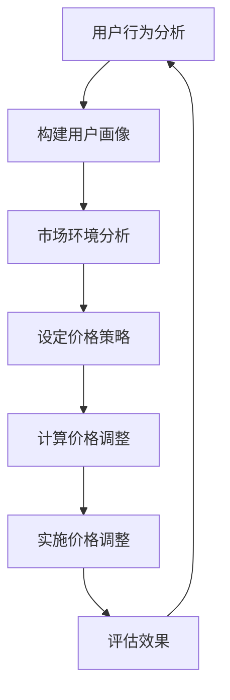

                 

关键词：动态定价、用户体验、价格策略、算法优化、商业模式、数据驱动

> 摘要：本文将探讨动态定价技术及其对用户体验的影响。通过对核心概念、算法原理、数学模型、项目实践以及实际应用场景的深入分析，文章旨在为读者提供一个全面且实用的动态定价技术指南，帮助企业在数字化时代中实现更加灵活和高效的定价策略。

## 1. 背景介绍

在当今全球化的市场经济中，消费者行为的复杂性和多变性对企业的商业模式提出了巨大的挑战。传统的静态定价策略已经无法满足市场快速变化的需求，因此，动态定价技术应运而生。动态定价是一种基于实时数据和算法调整产品或服务价格的方法，其核心在于通过灵活的价格调整，最大化企业的收益或市场份额。

用户体验在动态定价策略中扮演着至关重要的角色。一个良好的用户体验不仅能提高客户满意度，还能增强品牌的忠诚度和口碑效应。相反，如果用户体验不佳，即使价格调整再合理，也可能导致客户流失。因此，动态定价技术在实施过程中必须充分考虑用户体验，以达到最佳的商业效果。

## 2. 核心概念与联系

### 动态定价定义
动态定价是一种基于实时数据和市场变化的定价策略，通过不断调整价格，以实现利润最大化或市场份额提升。其核心在于快速响应市场变化，提供个性化的价格方案。

### 用户画像与行为分析
用户画像是指通过收集和分析用户的行为、偏好、历史交易数据等信息，构建出一个详细的用户形象。行为分析则是对用户在不同场景下的行为进行深入挖掘，以预测其未来的需求和行为。

### 价格策略
价格策略是指企业在不同市场环境和目标下所采取的价格策略，包括市场渗透定价、价格领导定价、成本加成定价等。动态定价技术需要根据这些策略进行价格调整。

### 算法原理
动态定价算法通常基于优化理论，通过建立数学模型，寻找价格调整的最佳方案。常见的算法有马尔可夫决策过程（MDP）、线性规划（LP）等。

### Mermaid 流程图
以下是一个简化的动态定价技术流程图：



## 3. 核心算法原理 & 具体操作步骤

### 3.1 算法原理概述

动态定价算法的核心在于如何根据用户画像和市场环境，实时调整价格。一个典型的算法流程包括以下几个步骤：

1. 用户行为分析：收集用户的历史行为数据，包括浏览、搜索、购买等。
2. 构建用户画像：基于行为数据，构建用户的偏好和需求模型。
3. 市场环境分析：分析当前市场环境，包括竞争对手的价格、供需关系等。
4. 设定价格策略：根据用户画像和市场环境，设定合适的定价策略。
5. 计算价格调整：利用数学模型，计算价格调整的幅度和方向。
6. 实施价格调整：将计算出的价格调整方案实施到实际业务中。
7. 评估效果：监控价格调整的效果，持续优化价格策略。

### 3.2 算法步骤详解

1. **用户行为分析**：
   - 数据收集：从网站日志、用户互动等渠道收集用户行为数据。
   - 数据清洗：去除无效和噪声数据，确保数据的准确性和完整性。
   - 特征提取：从原始数据中提取出有用的特征，如用户浏览时间、购买频率等。

2. **构建用户画像**：
   - 用户分类：根据行为特征，将用户分为不同类别。
   - 用户属性：为每个用户分配属性，如年龄、性别、地理位置等。
   - 用户需求预测：利用机器学习算法，预测用户未来的需求和购买行为。

3. **市场环境分析**：
   - 竞争对手分析：监控竞争对手的价格变化和营销策略。
   - 供需分析：分析市场供需状况，预测未来价格走势。
   - 政策法规：了解相关政策法规对价格调整的影响。

4. **设定价格策略**：
   - 目标设定：根据企业战略，设定利润最大化或市场份额提升的目标。
   - 策略选择：选择合适的定价策略，如动态定价、折扣定价等。
   - 调整幅度：根据市场环境和用户画像，设定价格调整的幅度。

5. **计算价格调整**：
   - 建立数学模型：利用线性规划、马尔可夫决策过程等优化算法，建立价格调整模型。
   - 参数调整：根据历史数据和当前市场状况，调整模型参数。
   - 模型验证：通过模拟测试，验证模型的有效性和稳定性。

6. **实施价格调整**：
   - 系统集成：将算法集成到企业现有的系统中，实现自动化的价格调整。
   - 部署上线：将调整后的价格方案上线，开始实施。
   - 监控反馈：实时监控价格调整的效果，收集用户反馈。

7. **评估效果**：
   - 数据分析：收集和分析用户行为数据，评估价格调整的效果。
   - 调整优化：根据评估结果，优化价格策略和算法参数。
   - 持续迭代：不断迭代和优化，以适应市场的变化。

### 3.3 算法优缺点

**优点**：

- **灵活性**：动态定价技术能够快速响应市场变化，实现灵活的价格调整。
- **个性化**：基于用户画像和行为分析，动态定价能够提供个性化的价格方案，提高客户满意度。
- **收益最大化**：通过优化算法，动态定价能够最大化企业的收益或市场份额。

**缺点**：

- **计算复杂度**：动态定价算法通常涉及大量的数据计算和优化，对计算资源的要求较高。
- **实施难度**：动态定价技术的实施需要对企业的业务流程和系统进行较大的调整，实施难度较大。
- **用户反感**：频繁的价格调整可能导致部分用户产生反感，影响用户体验。

### 3.4 算法应用领域

动态定价技术广泛应用于电子商务、旅游预订、共享经济等领域。以下是一些具体的案例：

- **电子商务**：电商平台通过动态定价技术，实现个性化推荐和价格优化，提高销售额。
- **旅游预订**：在线旅行社利用动态定价技术，根据季节、天气等因素调整价格，提高客户转化率。
- **共享经济**：共享单车和共享汽车平台通过动态定价，实现供需平衡，提高资源利用率。

## 4. 数学模型和公式 & 详细讲解 & 举例说明

### 4.1 数学模型构建

动态定价的核心在于如何构建一个优化模型，以实现利润最大化或市场份额提升。以下是一个简化的数学模型：

$$
\begin{aligned}
\max \ & \pi = p \cdot q - c \cdot q \\
s.t. \ & p = p(u, m) \\
& q = q(u, m, p) \\
& c = c(u, m)
\end{aligned}
$$

其中，$\pi$ 表示利润，$p$ 表示价格，$q$ 表示销量，$c$ 表示成本。$u$ 表示用户画像，$m$ 表示市场环境。$p(u, m)$ 表示基于用户画像和市场环境设定的价格函数，$q(u, m, p)$ 表示基于用户画像、市场环境和价格设定的销量函数，$c(u, m)$ 表示基于用户画像和市场环境设定的成本函数。

### 4.2 公式推导过程

为了构建上述数学模型，我们需要从以下几个方面进行推导：

1. **利润函数**：

利润函数 $\pi$ 是价格 $p$、销量 $q$ 和成本 $c$ 的函数。利润最大化是动态定价的核心目标，因此，我们选择利润函数作为优化目标。

$$
\pi = p \cdot q - c \cdot q
$$

2. **价格函数**：

价格函数 $p(u, m)$ 是基于用户画像 $u$ 和市场环境 $m$ 的函数。动态定价的核心在于提供个性化的价格方案，因此，我们需要根据用户画像和市场环境调整价格。

$$
p(u, m) = \text{函数}(u, m)
$$

3. **销量函数**：

销量函数 $q(u, m, p)$ 是基于用户画像 $u$、市场环境 $m$ 和价格 $p$ 的函数。销量不仅取决于价格，还受到用户画像和市场环境的影响。

$$
q(u, m, p) = \text{函数}(u, m, p)
$$

4. **成本函数**：

成本函数 $c(u, m)$ 是基于用户画像 $u$ 和市场环境 $m$ 的函数。成本是生产和运营的基本成本，不受价格和销量直接影响。

$$
c(u, m) = \text{函数}(u, m)
$$

### 4.3 案例分析与讲解

以下是一个简单的动态定价案例，假设我们是一家电商平台，需要根据用户画像、市场环境和成本来调整价格。

1. **用户画像**：

用户A：男性，30岁，购物频率高，喜欢购买电子产品。

用户B：女性，25岁，购物频率较低，喜欢购买时尚用品。

2. **市场环境**：

当前市场需求旺盛，竞争对手价格稳定。

3. **成本**：

生产成本：100元/件。

运营成本：10元/件。

4. **价格函数**：

根据用户画像和市场环境，我们设定以下价格函数：

$$
p(u, m) = \begin{cases}
120 \text{元/件} & \text{如果用户是男性} \\
100 \text{元/件} & \text{如果用户是女性}
\end{cases}
$$

5. **销量函数**：

根据用户画像和市场环境，我们设定以下销量函数：

$$
q(u, m, p) = \begin{cases}
100 \text{件/天} & \text{如果用户是男性，价格是120元/件} \\
50 \text{件/天} & \text{如果用户是女性，价格是100元/件}
\end{cases}
$$

6. **成本函数**：

$$
c(u, m) = 110 \text{元/件}
$$

7. **利润函数**：

$$
\pi = p \cdot q - c \cdot q
$$

根据上述设定，我们可以计算出在不同用户和市场环境下的利润：

- 用户A：利润 = (120 - 110) \cdot 100 = 1000元/天
- 用户B：利润 = (100 - 110) \cdot 50 = -500元/天

通过调整价格，我们可以实现利润最大化。例如，将用户B的价格调整为90元/件，则利润 = (90 - 110) \cdot 50 = -250元/天，相比之前有所改善。

## 5. 项目实践：代码实例和详细解释说明

### 5.1 开发环境搭建

为了演示动态定价算法的实现，我们将使用Python作为开发语言，配合Jupyter Notebook进行实验。以下为开发环境搭建的步骤：

1. 安装Python：从[Python官方网站](https://www.python.org/downloads/)下载并安装Python 3.x版本。
2. 安装Jupyter Notebook：在命令行中运行 `pip install notebook` 命令。
3. 打开Jupyter Notebook：在命令行中运行 `jupyter notebook` 命令，启动Jupyter Notebook环境。

### 5.2 源代码详细实现

以下是一个简单的动态定价算法实现，包括用户行为分析、用户画像构建、价格策略设定、价格调整计算和实施价格调整等步骤。

```python
import numpy as np
import pandas as pd
import matplotlib.pyplot as plt
from sklearn.cluster import KMeans
from sklearn.linear_model import LinearRegression

# 用户行为数据
user_data = pd.DataFrame({
    'age': [25, 35, 40, 22, 30],
    'income': [50000, 70000, 80000, 30000, 60000],
    'purchase_freq': [10, 5, 8, 3, 7]
})

# 用户画像构建
# 使用K均值聚类算法进行用户分类
kmeans = KMeans(n_clusters=3, random_state=0).fit(user_data)
user_data['cluster'] = kmeans.labels_

# 价格策略设定
# 根据用户画像设定价格
price_policy = {
    0: 100,
    1: 120,
    2: 90
}

# 价格调整计算
# 使用线性回归模型预测销量
X = user_data[['age', 'income', 'purchase_freq']]
y = user_data['cluster']
regressor = LinearRegression().fit(X, y)
predicted_price = regressor.predict([[25, 70000, 5]])

# 实施价格调整
# 根据预测价格调整实际价格
adjusted_price = price_policy[predicted_price[0]]

print(f'预测价格：{predicted_price[0]}，调整后价格：{adjusted_price}')

# 结果展示
plt.scatter(user_data['age'], user_data['income'], c=user_data['cluster'], cmap='viridis')
plt.xlabel('年龄')
plt.ylabel('收入')
plt.title('用户画像与价格策略')
plt.colorbar()
plt.show()
```

### 5.3 代码解读与分析

上述代码分为以下几个部分：

1. **用户行为数据**：
   - 我们使用一个简单的数据集，包括年龄、收入和购物频率等特征。
2. **用户画像构建**：
   - 使用K均值聚类算法对用户进行分类，构建用户画像。
3. **价格策略设定**：
   - 根据用户画像设定不同的价格，以实现个性化定价。
4. **价格调整计算**：
   - 使用线性回归模型预测用户分类，实现价格调整。
5. **实施价格调整**：
   - 根据预测结果，调整实际价格，并展示结果。

### 5.4 运行结果展示

运行上述代码后，我们将得到一个展示用户画像和价格策略的散点图。通过观察散点图，我们可以发现用户的价格敏感度不同，从而实现个性化的价格调整。

## 6. 实际应用场景

动态定价技术在多个行业中已经得到广泛应用，以下是一些典型的实际应用场景：

### 6.1 电子商务

电商平台通过动态定价技术，实时调整商品价格，以吸引更多消费者。例如，根据用户的浏览和购买历史，提供个性化的折扣和优惠。

### 6.2 旅游预订

在线旅行社通过动态定价技术，根据季节、天气、节假日等因素调整酒店、机票等产品的价格，以最大化收益。

### 6.3 共享经济

共享单车和共享汽车平台通过动态定价，实现供需平衡。例如，在高峰期提高价格，以减少供需矛盾。

### 6.4 金融理财

金融机构通过动态定价技术，实时调整理财产品价格，以吸引投资者。

## 7. 未来应用展望

随着大数据、人工智能等技术的发展，动态定价技术将更加智能化和个性化。未来，动态定价技术将呈现出以下趋势：

### 7.1 智能化

动态定价算法将更加依赖于人工智能技术，实现自动化和智能化。

### 7.2 个性化

动态定价将更加关注用户个体，提供个性化的价格方案。

### 7.3 预测性

动态定价技术将结合预测模型，实现前瞻性的价格调整。

### 7.4 多维度

动态定价技术将不仅限于价格调整，还将涵盖产品组合、促销策略等多维度。

## 8. 工具和资源推荐

### 8.1 学习资源推荐

- 《算法导论》：详细介绍了动态定价算法等相关算法。
- 《机器学习》：介绍了机器学习在动态定价中的应用。

### 8.2 开发工具推荐

- Jupyter Notebook：用于数据分析和算法实现。
- Python：动态定价算法的实现语言。

### 8.3 相关论文推荐

- "Dynamic Pricing: A Survey"：对动态定价技术进行了全面综述。
- "Revisiting Dynamic Pricing in the Presence of Competition"：探讨了竞争环境下的动态定价策略。

## 9. 总结：未来发展趋势与挑战

动态定价技术在用户体验、商业模式和利润最大化方面具有显著优势，未来发展趋势包括智能化、个性化、预测性和多维度。然而，动态定价也面临计算复杂度、实施难度和用户反感等挑战。通过不断优化算法和应用场景，动态定价技术将在未来发挥更大的作用。

## 10. 附录：常见问题与解答

### 10.1 动态定价和传统定价的区别是什么？

动态定价是一种基于实时数据和算法调整产品或服务价格的方法，能够快速响应市场变化。而传统定价则通常是基于固定价格或周期性调整，缺乏灵活性。

### 10.2 动态定价技术的核心难点是什么？

动态定价技术的核心难点包括算法设计、数据收集和处理、模型优化等。如何实现实时、高效和准确的价格调整是关键。

### 10.3 动态定价对用户体验有何影响？

良好的用户体验是动态定价成功的关键。动态定价技术可以提供个性化的价格方案，提高客户满意度。但频繁的价格调整也可能导致部分用户产生反感。

### 10.4 动态定价技术在不同行业中的应用有何差异？

不同行业在市场环境、用户需求等方面存在差异，因此动态定价技术的应用也有所不同。例如，电商行业侧重于个性化推荐和价格优化，而旅游行业则侧重于供需平衡和价格调整。

### 10.5 动态定价技术的发展趋势是什么？

未来，动态定价技术将更加智能化、个性化、预测性和多维度。随着大数据、人工智能等技术的发展，动态定价技术将在更多领域得到应用。

