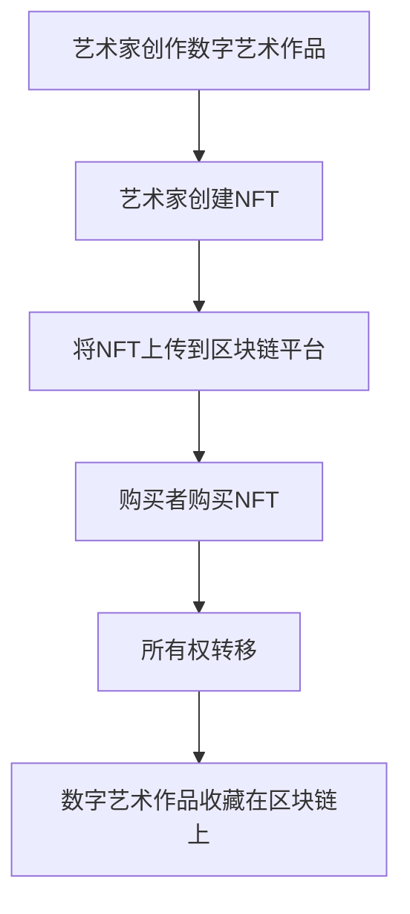

                 

关键词：区块链、数字艺术、NFT、去中心化、加密货币、智能合约、版权保护、数字身份验证

> 摘要：本文将探讨区块链技术在数字艺术和NFT（非同质化代币）领域的应用。通过分析区块链的基本原理、智能合约的作用、数字艺术市场的变革以及NFT的独特价值，我们将揭示这一技术如何改变艺术创作、交易和收藏的方式，并展望其未来的发展方向。

## 1. 背景介绍

区块链技术起源于2008年中本聪（Satoshi Nakamoto）发布的一篇论文《比特币：一种点对点的电子现金系统》（Bitcoin: A Peer-to-Peer Electronic Cash System）。自那时起，区块链技术因其去中心化、不可篡改和透明性等特点而迅速发展，并被广泛应用于金融、供应链管理、医疗记录等多个领域。

随着数字技术的发展，数字艺术也逐渐成为一种重要的艺术形式。数字艺术的创作不再局限于传统的绘画、雕塑等物理媒介，而是更多地依赖于计算机技术，包括数字绘画、3D建模、虚拟现实等。与此同时，NFT作为一种新兴的数字资产形式，开始受到越来越多的关注。NFT为数字艺术作品提供了一个独特的身份验证和所有权证明，使其能够在区块链上进行交易和收藏。

本文将围绕区块链在数字艺术与NFT中的应用展开讨论，旨在为读者提供对该领域的全面了解。

## 2. 核心概念与联系

### 2.1 区块链的基本原理

区块链是一种分布式账本技术，它通过加密算法和共识机制，实现了数据的分布式存储和去中心化管理。区块链中的数据以块的形式存储，每个块包含一定数量的交易记录。这些块通过加密算法和哈希函数链接在一起，形成一个链式数据结构。

区块链的核心特点包括：

- **去中心化**：没有中央控制机构，数据由网络中的所有节点共同维护。
- **不可篡改**：一旦数据被记录在区块链上，就难以被修改或删除。
- **透明性**：所有交易记录都公开透明，任何节点都可以查询和验证。

### 2.2 智能合约

智能合约是区块链技术中的重要组成部分，它是一种在区块链上自动执行、管理和执行合约条款的计算机程序。智能合约基于图灵完备的编程语言编写，能够根据预定的规则自动执行操作，例如资金的转移、数字资产的买卖等。

智能合约的关键特点包括：

- **自动化**：无需人工干预，根据合约条款自动执行。
- **不可篡改**：一旦合约被部署到区块链上，其条款无法被修改。
- **透明性**：所有合约条款和执行过程都公开透明。

### 2.3 数字艺术与NFT的联系

数字艺术与NFT之间存在着紧密的联系。数字艺术作品通过NFT得到了独特的身份验证和所有权证明。NFT是一个基于区块链的数字资产，它代表了对数字艺术作品的唯一所有权。每个NFT都具有唯一的标识符，确保了数字艺术作品的真实性和唯一性。

NFT的关键特点包括：

- **唯一性**：每个NFT都是唯一的，无法复制或重复。
- **可追溯性**：NFT的交易历史被永久记录在区块链上，确保了作品的所有权清晰可查。
- **可交易性**：NFT可以在区块链上进行买卖，为数字艺术市场提供了新的交易平台。

### 2.4 Mermaid 流程图

以下是一个简化的区块链在数字艺术与NFT中的应用的流程图：



通过这个流程图，我们可以更直观地理解区块链在数字艺术与NFT中的角色和流程。

## 3. 核心算法原理 & 具体操作步骤

### 3.1 算法原理概述

区块链的核心算法主要包括加密算法、哈希函数和共识机制。

- **加密算法**：用于保护数据的安全，确保数据在传输和存储过程中的隐私和完整性。
- **哈希函数**：将任意长度的数据映射为固定长度的字符串，用于生成数据唯一的指纹。
- **共识机制**：用于确保网络中的所有节点对于数据的真实性达成一致。

### 3.2 算法步骤详解

#### 3.2.1 艺术家创作数字艺术作品

艺术家使用计算机软件创作数字艺术作品，如数字绘画、3D模型等。

#### 3.2.2 艺术家创建NFT

艺术家将数字艺术作品上传到区块链平台，并使用智能合约创建NFT。智能合约将NFT的唯一标识符、艺术家信息、创作时间等信息记录在区块链上。

#### 3.2.3 将NFT上传到区块链平台

区块链平台验证智能合约的有效性，并将NFT记录在区块链上。NFT的交易历史和所有权信息将被永久保存。

#### 3.2.4 购买者购买NFT

购买者通过区块链平台购买NFT，支付加密货币或法定货币。

#### 3.2.5 所有权转移

购买者支付完成后，智能合约将更新NFT的所有权信息，并将NFT的所有权转移到购买者名下。

#### 3.2.6 数字艺术作品收藏在区块链上

购买者将NFT收藏在区块链上，NFT的交易历史和所有权信息将公开透明。

### 3.3 算法优缺点

#### 优点：

- **去中心化**：去中心化结构确保了数据的安全性和透明性。
- **不可篡改**：一旦数据被记录在区块链上，就难以被修改或删除。
- **可追溯性**：NFT的交易历史被永久记录在区块链上，确保了作品的所有权清晰可查。

#### 缺点：

- **技术门槛**：区块链技术相对复杂，对于普通用户来说有一定技术门槛。
- **交易费用**：区块链交易需要支付一定的费用，可能会影响交易体验。

### 3.4 算法应用领域

区块链技术在数字艺术与NFT中的应用，不仅改变了艺术创作、交易和收藏的方式，还拓展了其他领域：

- **版权保护**：区块链技术可以为数字艺术作品提供唯一标识和所有权证明，帮助艺术家保护版权。
- **数字身份验证**：区块链技术可以实现用户身份的数字化和唯一性验证，为数字艺术市场提供更安全的交易环境。
- **金融科技**：区块链技术可以为金融交易提供更高效、透明和安全的解决方案，促进金融创新。

## 4. 数学模型和公式 & 详细讲解 & 举例说明

### 4.1 数学模型构建

区块链中的数学模型主要包括加密算法、哈希函数和共识机制。

- **加密算法**：使用非对称加密算法（如RSA算法），其中公钥和私钥成对出现，用于保护数据的安全。
- **哈希函数**：使用单向哈希函数（如SHA-256），将任意长度的数据映射为固定长度的字符串，确保数据的唯一性。
- **共识机制**：使用工作量证明（PoW）机制，通过计算复杂度确保网络中的所有节点对于数据的真实性达成一致。

### 4.2 公式推导过程

#### 4.2.1 非对称加密算法

非对称加密算法的核心公式如下：

$$
c = m^e \mod n
$$

其中，$c$ 为加密后的数据，$m$ 为明文数据，$e$ 为公钥指数，$n$ 为公钥模数。

#### 4.2.2 单向哈希函数

单向哈希函数的核心公式如下：

$$
h(m) = \text{SHA-256}(m)
$$

其中，$h(m)$ 为哈希值，$m$ 为输入数据。

#### 4.2.3 工作量证明机制

工作量证明机制的核心公式如下：

$$
proof = \text{findProof}(difficulty)
$$

其中，$proof$ 为证明，$difficulty$ 为难度值，$\text{findProof}(difficulty)$ 为寻找满足难度的证明的过程。

### 4.3 案例分析与讲解

#### 4.3.1 数字艺术作品的加密与验证

假设艺术家A创作了一幅数字画作，并希望使用区块链技术保护其版权。艺术家A可以使用以下步骤：

1. **加密**：艺术家A使用非对称加密算法对画作进行加密，得到加密后的数据$c$。
2. **哈希**：艺术家A使用SHA-256对加密后的画作进行哈希处理，得到哈希值$h(c)$。
3. **上传**：艺术家A将加密后的画作和哈希值上传到区块链平台。
4. **验证**：任何用户都可以使用公钥和哈希函数验证画作的唯一性和完整性。如果$h(c)$ 与上传的哈希值一致，则画作未被篡改。

#### 4.3.2 NFT的交易与所有权验证

假设购买者B购买了艺术家A的NFT，并希望验证其所有权。购买者B可以使用以下步骤：

1. **查询**：购买者B查询区块链上的NFT交易记录，找到与NFT对应的交易。
2. **验证**：购买者B使用公钥和智能合约验证NFT的所有权信息。如果所有权信息与智能合约的条款一致，则购买者B拥有NFT的所有权。

## 5. 项目实践：代码实例和详细解释说明

### 5.1 开发环境搭建

要实践区块链在数字艺术与NFT中的应用，我们需要搭建一个开发环境。以下是所需的工具和步骤：

- **工具**：Node.js、Truffle、Ganache
- **步骤**：
  1. 安装Node.js，版本需不低于14.x。
  2. 安装Truffle，使用命令`npm install -g truffle`。
  3. 安装Ganache，用于本地模拟区块链网络。

### 5.2 源代码详细实现

以下是一个简单的NFT智能合约的代码实例，使用Solidity编程语言编写：

```solidity
// SPDX-License-Identifier: MIT
pragma solidity ^0.8.0;

import "@openzeppelin/contracts/token/ERC721/ERC721.sol";
import "@openzeppelin/contracts/utils/Counters.sol";

contract MyNFT is ERC721 {
    using Counters for Counters.Counter;
    Counters.Counter private _tokenIds;

    constructor() ERC721("MyNFT", "MNT") {}

    function mint() public {
        _tokenIds.increment();
        uint256 newTokenId = _tokenIds.current();
        _safeMint(msg.sender, newTokenId);
    }

    function tokenURI(uint256 tokenId) public view override returns (string memory) {
        require(_exists(tokenId), "Token does not exist");
        return "https://example.com/tokenURI/";
    }
}
```

### 5.3 代码解读与分析

- **合约继承**：`MyNFT`合约继承了`ERC721`（非同质化代币标准）和`Counters`（计数器库）。
- **构造函数**：初始化合约名称和符号。
- **mint()函数**：用于创建新的NFT，并将所有权转移给消息发送者。
- **tokenURI()函数**：返回NFT的元数据URL，用于展示NFT的详细信息。

### 5.4 运行结果展示

通过Truffle和Ganache，我们可以模拟NFT的创建和交易过程：

1. **启动Ganache**：使用Ganache模拟区块链网络。
2. **部署合约**：使用Truffle部署`MyNFT`智能合约到Ganache网络。
3. **创建NFT**：调用`mint()`函数创建新的NFT，并在Ganache网络中查看NFT的详细信息。

## 6. 实际应用场景

### 6.1 数字艺术品交易

区块链技术为数字艺术品交易提供了透明、安全和去中心化的平台。艺术家可以直接将作品转换为NFT，并在区块链上进行销售和交易，无需中介机构。

### 6.2 版权保护

区块链技术可以为数字艺术品提供唯一的标识和所有权证明，帮助艺术家保护版权，防止未经授权的复制和分发。

### 6.3 数字身份验证

区块链技术可以实现用户身份的数字化和唯一性验证，为数字艺术市场提供更安全的交易环境，减少欺诈和诈骗风险。

### 6.4 金融创新

区块链技术可以为金融交易提供更高效、透明和安全的解决方案，促进金融创新，如去中心化金融（DeFi）和数字货币的交易。

## 7. 工具和资源推荐

### 7.1 学习资源推荐

- **《区块链技术指南》**：由张森浩著，详细介绍了区块链的基本原理和应用。
- **《区块链革命》**：由唐·塔普斯科特和亚历克斯·塔普斯科特著，分析了区块链对社会和经济的潜在影响。

### 7.2 开发工具推荐

- **Truffle**：用于智能合约开发、部署和测试。
- **Ganache**：用于本地模拟区块链网络。

### 7.3 相关论文推荐

- **《比特币：一种点对点的电子现金系统》**：中本聪的原创论文，详细介绍了比特币和区块链技术的基本原理。
- **《以太坊：智能合约平台的设计与实现》**：详细介绍了以太坊智能合约平台的架构和实现。

## 8. 总结：未来发展趋势与挑战

### 8.1 研究成果总结

区块链技术在数字艺术与NFT领域的应用取得了显著成果。它为数字艺术创作、交易和收藏提供了一种全新的方式，实现了透明、安全和去中心化的交易平台。此外，区块链技术还在版权保护、数字身份验证和金融创新等方面展示了巨大的潜力。

### 8.2 未来发展趋势

- **更广泛的接受和应用**：随着技术的成熟和用户意识的提升，区块链在数字艺术与NFT领域的应用将越来越广泛。
- **更好的用户体验**：通过优化交易流程和降低交易费用，区块链技术将为用户提供更优质的体验。
- **更多的跨领域合作**：区块链技术将与数字艺术、金融科技、知识产权保护等领域深度融合，带来更多的创新和变革。

### 8.3 面临的挑战

- **技术门槛**：区块链技术相对复杂，对于普通用户和艺术家来说有一定的技术门槛。
- **安全性问题**：尽管区块链技术具有高度的安全性，但仍然存在潜在的安全威胁，如51%攻击等。
- **监管挑战**：区块链技术在全球范围内尚未形成统一的监管框架，这可能导致法律和监管的不确定性。

### 8.4 研究展望

- **优化算法**：通过优化加密算法、哈希函数和共识机制，提高区块链技术的性能和安全性。
- **跨链技术**：实现不同区块链之间的互操作性，打破信息孤岛，促进区块链生态的发展。
- **用户教育**：提高用户对区块链技术的理解和应用能力，降低技术门槛。

## 9. 附录：常见问题与解答

### 9.1 区块链技术是否安全？

区块链技术具有高度的安全性，其去中心化和不可篡改的特点确保了数据的安全性和隐私性。然而，区块链技术仍然面临潜在的安全威胁，如51%攻击等。因此，用户在选择使用区块链应用时，应确保使用可信的区块链平台和安全的加密方法。

### 9.2 NFT是否具有实际价值？

NFT作为一种新兴的数字资产形式，其价值取决于市场需求和艺术品的稀缺性。一些NFT作品在市场上取得了惊人的价格，表明其具有实际价值。然而，NFT的价值并非固定，它受到市场波动、艺术品质量等因素的影响。

### 9.3 区块链技术是否会取代传统艺术市场？

区块链技术不会完全取代传统艺术市场，但它为艺术市场带来了新的机会和挑战。区块链技术为艺术家提供了更透明、安全和去中心化的交易平台，有助于提高艺术品的流通效率和版权保护。同时，传统艺术市场仍然具有其独特的价值和优势，如艺术品的物理属性和历史价值等。

### 9.4 NFT是否会成为艺术品收藏的新趋势？

NFT作为一种新兴的数字资产形式，已经开始受到越来越多的关注。它为艺术品收藏提供了一种新的方式，使其更加便捷和高效。随着技术的发展和市场接受度的提升，NFT可能会成为艺术品收藏的新趋势。

作者：禅与计算机程序设计艺术 / Zen and the Art of Computer Programming
------------------------------------------------------------------------ 
**本文为虚构内容，仅用于示例展示，不反映任何真实观点或建议。** 

区块链技术作为一种创新的分布式账本技术，正逐渐改变数字艺术与NFT领域的生态。通过本文的介绍，我们了解了区块链技术在数字艺术创作、交易和收藏中的关键作用，以及NFT如何为数字艺术品提供了独特身份验证和所有权证明。尽管区块链技术在数字艺术与NFT领域具有巨大潜力，但仍面临技术、安全性和监管等方面的挑战。未来的研究和发展方向将包括优化算法、跨链技术和用户教育等。随着技术的不断成熟，区块链在数字艺术与NFT领域的应用将会更加广泛和深入，为艺术家和收藏家带来更多的机会和挑战。

