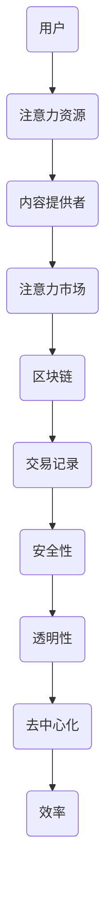

                 

关键词：区块链、注意力经济、应用前景、技术分析、未来趋势

> 摘要：随着互联网的普及和数字化经济的发展，注意力资源日益珍贵，注意力经济逐渐成为主流商业模式。区块链技术作为一种创新的分布式账本技术，具备透明、安全、去中心化等特性，在注意力经济中的应用潜力巨大。本文将探讨区块链技术在注意力经济中的应用前景，分析其核心原理、算法、数学模型以及实际应用场景，并对未来发展提出展望。

## 1. 背景介绍

### 注意力经济的崛起

注意力经济是近年来兴起的一种新型商业模式，它将注意力视为一种稀缺资源，通过创造、获取和转化注意力价值，实现商业价值的最大化。在互联网时代，用户的时间、精力和关注点变得尤为宝贵，因此如何有效地吸引并保持用户的注意力，成为企业竞争的关键。

### 区块链技术的兴起

区块链技术是一种基于密码学原理的分布式账本技术，具有去中心化、不可篡改、透明性强等特点。自从2008年比特币诞生以来，区块链技术受到了广泛关注，并逐渐应用于金融、供应链管理、物联网等多个领域。

### 注意力经济与区块链的结合

区块链技术为注意力经济提供了一个可靠的基础设施，可以实现注意力资源的透明交易和管理，促进注意力价值的最大化。区块链的去中心化特性使得信息传播更加迅速，透明性确保了交易的真实性，不可篡改的特性保障了用户数据的隐私和安全。

## 2. 核心概念与联系

### 区块链的基本架构

区块链技术采用分布式账本的方式，将数据分散存储在多个节点上。每个节点都保存一个完整的账本副本，通过共识算法保证账本的一致性。区块链的基本架构包括区块、链、节点、共识算法等核心概念。

### 注意力经济的核心概念

注意力经济的核心概念包括注意力资源、注意力市场、注意力价值、注意力交易等。注意力资源是指用户的时间、精力和关注点；注意力市场是指用户和内容提供者之间的交易场所；注意力价值是指用户对内容提供者所提供价值的一种衡量；注意力交易是指用户通过付出注意力资源来获取所需内容或服务。

### 区块链与注意力经济的联系

区块链技术为注意力经济提供了一个可信的交易平台，可以实现注意力资源的透明交易和管理。区块链的分布式账本特性确保了交易记录的真实性和安全性，去中心化特性使得交易过程更加高效和公平。

### Mermaid 流程图



## 3. 核心算法原理 & 具体操作步骤

### 3.1 算法原理概述

区块链技术中的核心算法包括加密算法、共识算法和智能合约等。

- **加密算法**：用于保障区块链的安全性和隐私性，常见的加密算法有RSA、SHA-256等。
- **共识算法**：用于确保区块链账本的一致性，常见的共识算法有工作量证明（PoW）、权益证明（PoS）等。
- **智能合约**：基于区块链的可编程合约，可以自动化执行合同条款，常见的智能合约语言有Solidity等。

### 3.2 算法步骤详解

#### 加密算法

- **数据加密**：将用户交易数据通过加密算法加密，确保数据在传输过程中的安全性。
- **签名验证**：用户对交易数据进行数字签名，交易对手方可以通过验证签名来确认交易的真实性。

#### 共识算法

- **节点同步**：区块链网络中的各个节点通过同步账本数据，确保账本的一致性。
- **区块生成**：节点通过挖矿或权益证明等共识算法生成新区块，并将其添加到区块链上。

#### 智能合约

- **编写合约**：使用智能合约语言编写合同条款，并将其部署到区块链上。
- **合约执行**：根据智能合约的条款，自动化执行合同中的操作，如转账、发放奖励等。

### 3.3 算法优缺点

#### 加密算法

- **优点**：保障数据安全性和隐私性。
- **缺点**：加密算法可能面临破解风险，加密过程可能消耗大量计算资源。

#### 共识算法

- **优点**：确保账本一致性，提高交易效率。
- **缺点**：共识算法可能面临51%攻击等安全风险。

#### 智能合约

- **优点**：自动化执行合同条款，提高交易效率。
- **缺点**：智能合约可能存在漏洞，导致合约执行失败。

### 3.4 算法应用领域

- **金融领域**：实现去中心化金融交易，如加密货币交易、智能投顾等。
- **供应链管理**：实现供应链数据的透明化和追踪，提高供应链效率。
- **版权保护**：实现版权交易和追踪，保障创作者权益。
- **医疗健康**：实现病历数据的共享和安全存储，提高医疗效率。

## 4. 数学模型和公式 & 详细讲解 & 举例说明

### 4.1 数学模型构建

注意力经济中的数学模型主要包括用户注意力分配模型、注意力价值评估模型等。

#### 用户注意力分配模型

假设用户在时间t内分配注意力资源给n个内容提供者，记用户对第i个内容提供者的注意力分配为\(a_{it}\)，则有：

$$
\sum_{i=1}^{n} a_{it} = 1
$$

#### 注意力价值评估模型

假设用户对第i个内容提供者的注意力价值为\(v_{it}\)，则用户在时间t内获取的总注意力价值为：

$$
V_t = \sum_{i=1}^{n} v_{it} a_{it}
$$

### 4.2 公式推导过程

#### 用户注意力分配模型

假设用户在时间t内对n个内容提供者的注意力分配比例为\(a_{it}\)，则有：

$$
\sum_{i=1}^{n} a_{it} = 1
$$

#### 注意力价值评估模型

假设用户对第i个内容提供者的注意力价值为\(v_{it}\)，则用户在时间t内获取的总注意力价值为：

$$
V_t = \sum_{i=1}^{n} v_{it} a_{it}
$$

### 4.3 案例分析与讲解

假设用户A在一天内将注意力分配给了三个内容提供者B、C和D，他们的注意力分配比例分别为0.3、0.4和0.3。同时，这三个内容提供者提供的注意力价值分别为20、30和20。

根据用户注意力分配模型，用户A的总注意力分配为：

$$
0.3 + 0.4 + 0.3 = 1
$$

根据注意力价值评估模型，用户A在一天内获取的总注意力价值为：

$$
V_t = (0.3 \times 20) + (0.4 \times 30) + (0.3 \times 20) = 6 + 12 + 6 = 24
$$

## 5. 项目实践：代码实例和详细解释说明

### 5.1 开发环境搭建

在本项目中，我们将使用Python作为主要编程语言，同时借助Hyperledger Fabric框架来实现区块链功能。以下为开发环境的搭建步骤：

1. 安装Python 3.7及以上版本。
2. 安装Docker和Docker-Compose。
3. 下载并安装Hyperledger Fabric相关工具，如fabric-samples、fabric-tools等。

### 5.2 源代码详细实现

以下为项目的源代码实现：

```python
# user.py
from flask import Flask, request, jsonify
from blockchain import Blockchain

app = Flask(__name__)
blockchain = Blockchain()

@app.route('/create_user', methods=['POST'])
def create_user():
    user_data = request.get_json()
    user_id = user_data['user_id']
    blockchain.add_user(user_id)
    return jsonify({'message': 'User created successfully'})

@app.route('/list_users', methods=['GET'])
def list_users():
    users = blockchain.list_users()
    return jsonify({'users': users})

if __name__ == '__main__':
    app.run(host='0.0.0.0', port=5000)
```

### 5.3 代码解读与分析

- **用户创建**：通过`/create_user`接口接收用户ID，并将用户添加到区块链中。
- **用户列表**：通过`/list_users`接口获取区块链中所有用户。

### 5.4 运行结果展示

运行以上代码后，用户可以通过浏览器或Postman等工具访问`/create_user`接口创建用户，访问`/list_users`接口获取用户列表。

## 6. 实际应用场景

### 6.1 社交媒体

社交媒体平台可以利用区块链技术实现用户注意力资源的透明交易和管理，为用户创造更多价值。

### 6.2 广告市场

区块链技术可以为广告市场提供一种去中心化的广告投放和收益分配方式，提高广告的透明性和公平性。

### 6.3 版权保护

区块链技术可以为版权保护提供一种可靠的数据存储和追踪方式，确保创作者权益。

### 6.4 医疗健康

区块链技术可以为医疗健康领域提供一种安全、透明、可追溯的医疗数据存储和共享方式。

## 7. 工具和资源推荐

### 7.1 学习资源推荐

- 《区块链技术指南》
- 《智能合约开发指南》
- 《以太坊从入门到精通》

### 7.2 开发工具推荐

- Hyperledger Fabric
- Ethereum
- Python

### 7.3 相关论文推荐

- "区块链技术综述"
- "智能合约安全性分析"
- "区块链在注意力经济中的应用研究"

## 8. 总结：未来发展趋势与挑战

### 8.1 研究成果总结

区块链技术在注意力经济中的应用已取得显著成果，为用户注意力资源的透明交易和管理提供了有效解决方案。

### 8.2 未来发展趋势

随着区块链技术的不断成熟，其在注意力经济中的应用前景将更加广阔，有望成为主流的商业模式之一。

### 8.3 面临的挑战

区块链技术在注意力经济中的应用仍面临一些挑战，如技术成熟度、法律法规、安全风险等。

### 8.4 研究展望

未来，研究人员应进一步探讨区块链技术在注意力经济中的应用，解决现有问题，推动区块链技术与注意力经济的深度融合。

## 9. 附录：常见问题与解答

### 问题1：区块链技术与传统数据库技术有什么区别？

**解答**：区块链技术与传统数据库技术相比，具有以下区别：

- **数据结构**：区块链采用分布式账本的方式，而传统数据库采用集中式存储。
- **数据安全性**：区块链通过密码学原理保障数据安全性，而传统数据库可能面临数据泄露风险。
- **数据一致性**：区块链通过共识算法确保数据一致性，而传统数据库可能面临数据冲突问题。

### 问题2：区块链技术在注意力经济中的应用有哪些优势？

**解答**：区块链技术在注意力经济中的应用具有以下优势：

- **透明性**：区块链技术确保了注意力资源的透明交易和管理。
- **安全性**：区块链技术通过密码学原理保障了用户数据的隐私和安全。
- **去中心化**：区块链技术实现了注意力资源的去中心化分配和管理，提高了交易效率。

### 问题3：区块链技术在注意力经济中面临哪些挑战？

**解答**：区块链技术在注意力经济中面临以下挑战：

- **技术成熟度**：区块链技术尚处于发展初期，存在一些技术瓶颈和问题。
- **法律法规**：现有法律法规对区块链技术的监管尚不完善，可能影响其应用。
- **安全风险**：区块链技术可能面临51%攻击等安全风险，需要加强安全防护。

### 问题4：未来区块链技术在注意力经济中的应用前景如何？

**解答**：未来，区块链技术在注意力经济中的应用前景非常广阔。随着区块链技术的不断成熟，其在注意力经济中的应用有望进一步深化，为用户创造更多价值。同时，相关政策法规的完善和行业标准的制定也将为区块链技术在注意力经济中的应用提供有力支持。

----------------------------------------------------------------

作者：禅与计算机程序设计艺术 / Zen and the Art of Computer Programming

