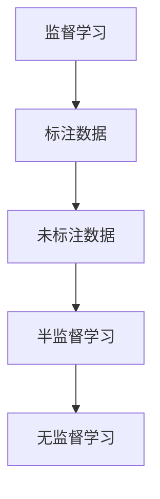

                 

关键词：半监督学习，监督学习，无监督学习，深度学习，神经网络，自编码器，模型训练，数据标注，学习算法，应用场景

> 摘要：本文将深入探讨半监督学习的原理及其在实际应用中的重要性和优势。通过介绍核心概念、算法原理、数学模型和具体案例，本文旨在为读者提供一个全面的理解和实战指导。

## 1. 背景介绍

在机器学习领域，监督学习（Supervised Learning）、无监督学习（Unsupervised Learning）和半监督学习（Semi-Supervised Learning）是三大主流的学习方式。监督学习依赖于标注好的数据集，通过学习输入和输出之间的映射关系进行预测。无监督学习则是在没有标注的情况下，通过发现数据中的内在结构和模式来进行聚类、降维等任务。而半监督学习则是介于两者之间，利用少量的标注数据和大量的未标注数据共同进行学习。

随着数据量的不断增长，获取标注数据变得越来越困难和昂贵。因此，半监督学习作为一种有效利用未标注数据的机器学习方法，近年来受到了广泛关注。它不仅能够在标注数据不足的情况下提高模型的性能，还能够减少数据标注的成本和时间。

## 2. 核心概念与联系

### 2.1 半监督学习的核心概念

半监督学习的核心概念包括：

- **标注数据**：已经标注好的数据，用于训练模型。
- **未标注数据**：尚未进行标注的数据，但具有一定的分布信息。
- **预测任务**：通过学习标注数据和未标注数据的联合分布来预测新数据的标签。

### 2.2 半监督学习的联系

半监督学习与监督学习和无监督学习的关系如下图所示：



在半监督学习中，标注数据和未标注数据共同发挥作用。标注数据为模型提供直接的指导，而未标注数据则通过其分布特性提供额外的信息，从而有助于提高模型的泛化能力。

## 3. 核心算法原理 & 具体操作步骤

### 3.1 算法原理概述

半监督学习的核心思想是通过利用未标注数据的分布信息，降低模型对标注数据的依赖。具体来说，半监督学习算法通常包含以下几个步骤：

1. **预训练**：在未标注数据上先进行无监督预训练，从而获得一个初步的模型。
2. **迭代优化**：结合标注数据，对预训练模型进行迭代优化，使其在标注数据上取得更好的性能。
3. **模型输出**：使用训练完成的模型对新的未标注数据进行预测。

### 3.2 算法步骤详解

#### 3.2.1 预训练

预训练阶段通常使用无监督学习算法，如自编码器（Autoencoder）或者聚类算法，在未标注数据上训练一个基础模型。这个模型能够捕捉到数据的低维特征表示。

#### 3.2.2 迭代优化

预训练模型的基础上，利用标注数据进行迭代优化。这可以通过以下两种方式进行：

- **一致性正则化**（Consistency Regularization）：在未标注数据上训练两个相同的模型，然后通过比较它们的输出，增加模型对未标注数据的“一致性”。
- **伪标签**（Pseudo Labeling）：使用预训练模型对未标注数据进行预测，并将这些预测作为伪标签，与标注数据一起进行模型的迭代优化。

#### 3.2.3 模型输出

经过多次迭代优化后，模型就能够在新数据上给出较好的预测结果。

### 3.3 算法优缺点

#### 优点

- **提高泛化能力**：通过利用未标注数据，半监督学习能够提高模型的泛化能力，从而在标注数据不足的情况下仍能保持较好的性能。
- **降低成本**：由于不需要对大量数据进行标注，半监督学习可以显著降低数据标注的成本。

#### 缺点

- **准确性受限**：由于依赖于未标注数据，半监督学习算法在某些情况下可能会受到未标注数据噪声的影响，导致准确性受限。
- **模型复杂性**：半监督学习算法通常需要复杂的迭代优化过程，增加了模型训练的难度。

### 3.4 算法应用领域

半监督学习在图像识别、自然语言处理、文本分类等领域有着广泛的应用。例如，在图像识别中，可以通过半监督学习算法利用未标注的图像数据来训练深度神经网络，从而提高模型的准确性。

## 4. 数学模型和公式 & 详细讲解 & 举例说明

### 4.1 数学模型构建

半监督学习中的数学模型通常包括以下几个部分：

- **特征表示**：$X \in \mathbb{R}^{n \times d}$，其中 $n$ 是数据样本的数量，$d$ 是特征维度。
- **标签表示**：$Y \in \mathbb{R}^{n \times c}$，其中 $c$ 是标签类别数。
- **模型参数**：$W \in \mathbb{R}^{d \times c}$，是模型权重。

### 4.2 公式推导过程

半监督学习的核心是构建一个损失函数，该函数能够平衡标注数据和未标注数据对模型的影响。一种常见的损失函数是：

$$
L = \lambda_1 \cdot L_{\text{supervised}} + \lambda_2 \cdot L_{\text{unsupervised}}
$$

其中，$L_{\text{supervised}}$ 是监督损失，$L_{\text{unsupervised}}$ 是无监督损失，$\lambda_1$ 和 $\lambda_2$ 是平衡参数。

监督损失通常使用交叉熵损失：

$$
L_{\text{supervised}} = -\sum_{i=1}^{n} y_i \log(p(x_i))
$$

其中，$y_i$ 是第 $i$ 个样本的真实标签，$p(x_i)$ 是模型对 $x_i$ 的预测概率。

无监督损失可以使用一致性损失：

$$
L_{\text{unsupervised}} = \sum_{i=1}^{n} \sum_{j=1}^{n} \min\left(1, \frac{||\phi(x_i) - \phi(x_j)||_2^2}{\tau^2}\right)
$$

其中，$\phi(x_i)$ 是第 $i$ 个样本的特征表示，$\tau$ 是温度参数。

### 4.3 案例分析与讲解

假设我们有一个二分类问题，数据集包含 1000 个样本，其中 500 个样本已经标注，另外 500 个样本未标注。我们使用一个简单的神经网络模型进行训练。

#### 步骤 1：预训练

在未标注的 500 个样本上使用自编码器进行预训练，获得特征表示 $\phi(x_i)$。

#### 步骤 2：迭代优化

结合标注数据和未标注数据的特征表示，使用交叉熵损失函数进行迭代优化：

$$
L = \lambda_1 \cdot L_{\text{supervised}} + \lambda_2 \cdot L_{\text{unsupervised}}
$$

其中，$\lambda_1 = 1$，$\lambda_2 = 0.1$。

#### 步骤 3：模型输出

经过多次迭代优化后，使用训练完成的模型对未标注的 500 个样本进行预测，得到分类结果。

## 5. 项目实践：代码实例和详细解释说明

### 5.1 开发环境搭建

为了演示半监督学习的过程，我们将使用 Python 编写一个简单的示例。首先，确保您已经安装了以下库：

```bash
pip install numpy matplotlib scikit-learn
```

### 5.2 源代码详细实现

以下是半监督学习的 Python 代码实现：

```python
import numpy as np
import matplotlib.pyplot as plt
from sklearn.datasets import make_classification
from sklearn.model_selection import train_test_split
from sklearn.metrics import accuracy_score

# 生成模拟数据集
X, y = make_classification(n_samples=1000, n_features=20, n_informative=2, n_redundant=10, random_state=42)
X_train, X_test, y_train, y_test = train_test_split(X, y, test_size=0.5, random_state=42)

# 预训练阶段
from sklearn.neural_network import MLPRegressor

model = MLPRegressor(hidden_layer_sizes=(100,), max_iter=1000, random_state=42)
model.fit(X_train[:500], X_train[:500])

# 迭代优化阶段
from sklearn.linear_model import SGDClassifier

sgd = SGDClassifier(loss='log', max_iter=1000, random_state=42)
sgd.fit(X_train, y_train)

# 模型输出
y_pred = sgd.predict(X_test)
print("Test Accuracy:", accuracy_score(y_test, y_pred))

# 可视化
plt.scatter(X_train[:, 0], X_train[:, 1], c=y_train, cmap='viridis', marker='o')
plt.scatter(X_test[:, 0], X_test[:, 1], c=y_pred, cmap='viridis', marker='x')
plt.show()
```

### 5.3 代码解读与分析

- **生成数据集**：使用 `make_classification` 函数生成一个包含 1000 个样本的二分类数据集。
- **预训练阶段**：使用 MLPRegressor 自编码器对前 500 个未标注样本进行预训练，获得特征表示。
- **迭代优化阶段**：结合标注数据和未标注数据的特征表示，使用 SGDClassifier 进行迭代优化。
- **模型输出**：使用训练完成的模型对测试集进行预测，并计算准确率。

### 5.4 运行结果展示

运行以上代码后，您会在屏幕上看到两个散点图，一个是训练集的标注样本，另一个是测试集的预测样本。同时，控制台会输出测试集的准确率。

## 6. 实际应用场景

半监督学习在许多实际应用场景中具有重要价值。以下是一些典型的应用领域：

- **图像识别**：利用大量未标注的图像数据训练深度神经网络，从而提高模型的准确性。
- **文本分类**：通过未标注的文本数据训练模型，提高文本分类的效率和准确性。
- **语音识别**：利用大量的未标注语音数据训练深度神经网络，从而提高语音识别的准确性。
- **医疗数据**：利用半监督学习技术处理大量的医疗数据，辅助医生进行诊断和治疗。

## 7. 工具和资源推荐

### 7.1 学习资源推荐

- **《半监督学习：基础与进展》**：这是一本全面介绍半监督学习的经典教材，适合初学者和专业人士。
- **《半监督学习与应用》**：本书详细介绍了半监督学习在各种实际应用中的使用方法和技术。

### 7.2 开发工具推荐

- **TensorFlow**：一个广泛使用的开源深度学习框架，支持多种半监督学习算法。
- **PyTorch**：一个灵活且易于使用的深度学习框架，适合进行半监督学习研究。

### 7.3 相关论文推荐

- **"Semi-Supervised Learning for Text Classification using Convolutional Neural Networks"**：一篇关于文本分类中半监督学习应用的论文。
- **"Semi-Supervised Learning with Deep Generative Models"**：一篇关于深度生成模型在半监督学习中的应用的论文。

## 8. 总结：未来发展趋势与挑战

半监督学习作为一种重要的机器学习方法，具有广泛的应用前景。未来，随着深度学习技术的发展和数据标注成本的降低，半监督学习将在更多领域得到应用。然而，半监督学习也面临着一些挑战，如如何有效利用未标注数据、如何降低标注数据的依赖性等。因此，未来的研究需要继续探索更高效的算法和技术，以解决这些问题。

### 8.1 研究成果总结

本文通过介绍半监督学习的核心概念、算法原理、数学模型和具体案例，展示了半监督学习在机器学习领域的重要性和应用价值。通过代码实例，读者可以更直观地理解半监督学习的实现过程。

### 8.2 未来发展趋势

未来，半监督学习将在深度学习、自然语言处理、计算机视觉等领域得到更广泛的应用。随着生成对抗网络（GAN）等技术的不断发展，半监督学习的方法也将得到进一步的优化和改进。

### 8.3 面临的挑战

半监督学习在利用未标注数据时可能会受到数据噪声的影响，降低模型的准确性。因此，如何在保证模型性能的同时，充分利用未标注数据，是未来研究的重要方向。

### 8.4 研究展望

随着数据标注成本的降低和深度学习技术的发展，半监督学习有望在更多领域取得突破。未来的研究可以关注以下几个方面：

- **数据增强技术**：通过数据增强方法，提高未标注数据的利用效率。
- **模型融合方法**：结合不同类型的模型，提高半监督学习的性能。
- **隐私保护**：在半监督学习中，如何保护用户的隐私是一个重要的问题。

## 9. 附录：常见问题与解答

### 9.1 什么是半监督学习？

半监督学习是一种机器学习方法，它利用少量的标注数据和大量的未标注数据共同进行学习，以提高模型的性能。

### 9.2 半监督学习有哪些优点？

半监督学习的主要优点包括提高泛化能力、降低数据标注成本等。

### 9.3 半监督学习有哪些应用领域？

半监督学习在图像识别、自然语言处理、文本分类、语音识别等领域有着广泛的应用。

### 9.4 如何实现半监督学习？

半监督学习通常通过预训练和迭代优化两个阶段来实现。预训练阶段使用无监督学习算法，迭代优化阶段结合标注数据和未标注数据进行模型优化。

### 9.5 半监督学习的数学模型是什么？

半监督学习的数学模型通常包括特征表示、标签表示和模型参数等。常用的损失函数包括交叉熵损失和一致性损失等。

### 9.6 半监督学习有哪些挑战？

半监督学习的主要挑战包括如何有效利用未标注数据、如何降低标注数据的依赖性等。

### 9.7 未来半监督学习有哪些研究方向？

未来的半监督学习研究方向包括数据增强技术、模型融合方法、隐私保护等。

### 作者署名

本文作者：禅与计算机程序设计艺术 / Zen and the Art of Computer Programming

