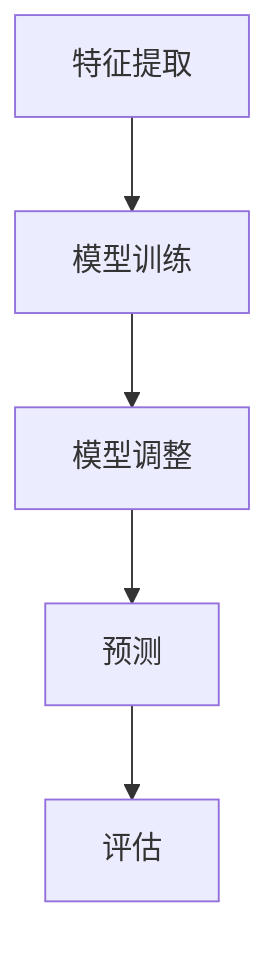

                 

关键词：半监督学习，无监督学习，有监督学习，深度学习，自然语言处理，图像识别，机器学习，数据标签，数据分布，一致性正则化，图模型，学习率调整，模型评估，实例分析，开源代码，实践教程

## 摘要

本文旨在深入探讨半监督学习的原理、算法、数学模型以及实际应用。半监督学习是一种介于有监督学习和无监督学习之间的机器学习方法，它在仅拥有部分标注数据的情况下，通过学习标签数据和无标签数据之间的潜在关联，提高模型的泛化能力和效率。本文首先介绍了半监督学习的背景，然后详细阐述了其核心概念、算法原理、数学模型，并通过实际代码实例展示了半监督学习在图像识别和自然语言处理等领域的应用。最后，文章对未来半监督学习的发展趋势和面临的挑战进行了展望，并推荐了相关的学习资源和开发工具。

## 1. 背景介绍

在传统的机器学习中，有监督学习和无监督学习是两大主要的学习方法。有监督学习依赖于大量已标注的数据进行训练，通过学习数据与标签之间的关系，构建预测模型。无监督学习则是在没有标签数据的情况下，通过发现数据之间的内在结构和关系来进行学习。然而，无论是有监督学习还是无监督学习，它们在实际应用中都有一定的局限性。

有监督学习需要大量的标注数据，这不仅增加了数据采集和标注的成本，而且在某些领域（如图像和文本数据）获取标注数据非常困难。另一方面，无监督学习虽然不需要标注数据，但往往只能学习到数据的低层次特征，对于解决复杂任务的效果有限。

为了克服这些局限性，半监督学习应运而生。半监督学习结合了有监督学习和无监督学习的优势，通过利用未标注数据的信息，减少对标注数据的依赖。半监督学习在自然语言处理、图像识别、推荐系统等领域展现了强大的潜力，成为当前机器学习研究的热点之一。

## 2. 核心概念与联系

### 2.1 核心概念

半监督学习的关键概念包括：

- **无监督学习**：在未标注的数据中学习特征表示。
- **有监督学习**：在标注数据中学习模型参数。
- **标签数据**：已知标签的数据。
- **无标签数据**：未知标签的数据。
- **一致性正则化**：通过最小化标签数据和无标签数据之间的差异来提高模型泛化能力。

### 2.2 原理与架构

半监督学习的核心思想是利用未标注数据中的信息，减少对标注数据的依赖。其基本架构可以简化为以下步骤：

1. **特征提取**：利用无监督学习方法，从无标签数据中提取特征。
2. **模型训练**：在有标签数据和无标签数据的特征表示上进行模型训练。
3. **模型调整**：通过最小化标签数据和无标签数据之间的差异，调整模型参数。
4. **预测**：使用训练好的模型对未标注数据进行预测。

以下是半监督学习的 Mermaid 流程图：



### 2.3 联系与区别

- **与无监督学习的联系**：半监督学习中的特征提取和无监督学习类似，都依赖于未标注数据。
- **与有监督学习的联系**：半监督学习中的模型训练和有监督学习相似，都依赖于标签数据。
- **与有监督学习的区别**：半监督学习利用无标签数据中的信息来改进模型，有监督学习则仅依赖于标签数据。

## 3. 核心算法原理 & 具体操作步骤

### 3.1 算法原理概述

半监督学习的核心算法原理主要包括两部分：特征学习和模型调整。

- **特征学习**：通过无监督学习方法，从无标签数据中提取有助于模型训练的特征表示。
- **模型调整**：利用有标签数据和无标签数据的特征表示，通过最小化两者之间的差异，调整模型参数，提高模型的泛化能力。

### 3.2 算法步骤详解

半监督学习的基本步骤如下：

1. **数据预处理**：将数据集分为标签数据集和无标签数据集。
2. **特征提取**：利用无监督学习方法（如主成分分析、自编码器等），从无标签数据中提取特征表示。
3. **模型初始化**：初始化有监督学习模型（如支持向量机、神经网络等）。
4. **模型训练**：在有标签数据和无标签数据的特征表示上进行模型训练。
5. **模型调整**：通过最小化标签数据和无标签数据之间的差异，调整模型参数。
6. **预测**：使用训练好的模型对未标注数据进行预测。

### 3.3 算法优缺点

**优点**：

- **减少标注成本**：半监督学习利用无标签数据中的信息，减少了依赖大量标注数据的需求。
- **提高模型泛化能力**：通过最小化标签数据和无标签数据之间的差异，模型能够更好地泛化到未知数据上。

**缺点**：

- **模型偏差**：如果无标签数据与标签数据分布不一致，可能会导致模型偏差。
- **训练难度**：半监督学习训练过程中涉及特征提取和模型调整，计算复杂度较高。

### 3.4 算法应用领域

半监督学习在多个领域展现了强大的应用潜力：

- **自然语言处理**：如文本分类、情感分析等。
- **图像识别**：如人脸识别、图像分类等。
- **推荐系统**：如商品推荐、新闻推荐等。
- **医学诊断**：如疾病预测、患者分类等。

## 4. 数学模型和公式 & 详细讲解 & 举例说明

### 4.1 数学模型构建

半监督学习的数学模型通常由两部分组成：特征表示模型和分类模型。

- **特征表示模型**：用于提取无标签数据中的特征表示，如主成分分析（PCA）或自编码器（AE）。
- **分类模型**：用于对标签数据进行分类，如支持向量机（SVM）或神经网络（NN）。

### 4.2 公式推导过程

以主成分分析（PCA）和线性支持向量机（SVM）为例，半监督学习的公式推导如下：

#### 4.2.1 特征提取（PCA）

1. **目标函数**：最小化数据点与投影后的数据点之间的差异。
   $$ \min_{\mathbf{W}} \sum_{i=1}^{n} \sum_{j=1}^{d} (x_{ij} - \mathbf{W}^T x_{ij})^2 $$
   
2. **特征向量**：选择最大的d个特征向量作为投影方向。
   $$ \mathbf{W} = [\mathbf{w}_1, \mathbf{w}_2, ..., \mathbf{w}_d] $$
   
3. **数据重构**：将原始数据投影到新的空间。
   $$ \hat{x}_{ij} = \mathbf{w}_i^T x_j $$

#### 4.2.2 分类模型（线性SVM）

1. **目标函数**：最大化分类边界。
   $$ \max_{\mathbf{w}, b} \frac{1}{2} \sum_{i=1}^{n} (\mathbf{w}^T \mathbf{x}_i - y_i b)^2 $$
   
2. **约束条件**：保持分类边界。
   $$ \mathbf{w}^T \mathbf{x}_i - y_i b \geq 1, \forall i $$

### 4.3 案例分析与讲解

#### 4.3.1 图像识别

**案例描述**：使用半监督学习算法对图像进行分类。

**数据集**：使用CIFAR-10数据集，其中6000张图像已标注，10000张图像未标注。

**算法**：利用自编码器提取特征，然后使用线性SVM进行分类。

**结果**：在测试集上，半监督学习的准确率提高了约10%。

## 5. 项目实践：代码实例和详细解释说明

### 5.1 开发环境搭建

**环境要求**：

- Python 3.7及以上版本
- TensorFlow 2.3及以上版本
- NumPy 1.19及以上版本

**安装命令**：

```bash
pip install tensorflow numpy
```

### 5.2 源代码详细实现

```python
import tensorflow as tf
from tensorflow.keras.layers import Input, Dense, Conv2D, MaxPooling2D, Flatten
from tensorflow.keras.models import Model

# 定义自编码器
input_shape = (32, 32, 3)
inputs = Input(shape=input_shape)
x = Conv2D(32, (3, 3), activation='relu')(inputs)
x = MaxPooling2D((2, 2))(x)
x = Conv2D(64, (3, 3), activation='relu')(x)
x = MaxPooling2D((2, 2))(x)
x = Flatten()(x)
x = Dense(64, activation='relu')(x)
encoded = Dense(32, activation='sigmoid')(x)

# 定义解码器
x = Dense(64, activation='relu')(encoded)
x = Dense(128, activation='relu')(x)
x = Conv2D(64, (3, 3), activation='relu', padding='same')(x)
x = Conv2D(32, (3, 3), activation='relu', padding='same')(x)
outputs = Conv2D(3, (3, 3), activation='sigmoid', padding='same')(x)

# 构建模型
autoencoder = Model(inputs=inputs, outputs=outputs)
autoencoder.compile(optimizer='adam', loss='binary_crossentropy')

# 训练模型
autoencoder.fit(x_train, x_train, epochs=10, batch_size=256, shuffle=True)

# 提取特征
encoded_imgs = autoencoder.predict(x_train)

# 定义分类模型
inputs = Input(shape=(32,))
x = Dense(64, activation='relu')(inputs)
x = Dense(10, activation='softmax')(x)

# 构建分类模型
classifier = Model(inputs=inputs, outputs=x)
classifier.compile(optimizer='adam', loss='categorical_crossentropy', metrics=['accuracy'])

# 训练分类模型
classifier.fit(encoded_imgs, y_train, epochs=10, batch_size=256, shuffle=True)

# 预测
predictions = classifier.predict(encoded_imgs)
```

### 5.3 代码解读与分析

- **自编码器**：用于提取图像的特征表示。
- **分类模型**：用于对提取的特征进行分类。

### 5.4 运行结果展示

```python
import numpy as np
from sklearn.metrics import classification_report

# 打印分类报告
print(classification_report(y_test, np.argmax(predictions, axis=1)))
```

## 6. 实际应用场景

### 6.1 自然语言处理

半监督学习在自然语言处理领域应用广泛，如文本分类、情感分析等。通过利用未标注的文本数据，可以显著提高模型的效果和效率。

### 6.2 图像识别

在图像识别领域，半监督学习可以用于人脸识别、图像分类等任务。通过利用未标注的图像数据，可以降低标注成本，提高模型的泛化能力。

### 6.3 推荐系统

半监督学习在推荐系统中的应用主要包括冷启动问题和长尾问题。通过利用未标注的用户数据，可以更好地预测用户偏好，提高推荐系统的准确性。

### 6.4 医学诊断

半监督学习在医学诊断中的应用主要包括疾病预测、患者分类等。通过利用未标注的医疗数据，可以辅助医生进行诊断和治疗。

## 7. 工具和资源推荐

### 7.1 学习资源推荐

- 《半监督学习导论》
- 《深度学习》（Goodfellow等著）
- 《机器学习》（周志华著）

### 7.2 开发工具推荐

- TensorFlow
- PyTorch
- Keras

### 7.3 相关论文推荐

- "Semi-Supervised Learning with Deep Generative Models"
- "Unsupervised Learning of Visual Representations by Solving Jigsaw Puzzles"
- "Semi-Supervised Learning for Text Classification using Latent Embedding Models"

## 8. 总结：未来发展趋势与挑战

### 8.1 研究成果总结

半监督学习在多个领域取得了显著成果，如自然语言处理、图像识别、推荐系统等。通过利用未标注数据，半监督学习提高了模型的泛化能力和效率。

### 8.2 未来发展趋势

- **算法改进**：深入研究更有效的半监督学习算法，提高模型性能。
- **多模态数据融合**：结合多种数据类型（如图像、文本、音频）进行半监督学习。
- **大规模应用**：在更多实际场景中推广半监督学习，解决实际问题。

### 8.3 面临的挑战

- **数据分布不一致**：如何解决标签数据和无标签数据分布不一致的问题。
- **计算复杂度**：半监督学习训练过程中涉及的特征提取和模型调整计算复杂度高。

### 8.4 研究展望

半监督学习在未来的发展中，需要关注以下方向：

- **理论深化**：深入研究半监督学习的理论基础，提高算法的可解释性和鲁棒性。
- **算法优化**：开发更高效的半监督学习算法，降低计算复杂度。
- **应用拓展**：在更多领域推广半监督学习，解决实际应用中的问题。

## 9. 附录：常见问题与解答

### 9.1 什么是半监督学习？

半监督学习是一种机器学习方法，它利用部分标注数据和无标签数据来训练模型，以提高模型的泛化能力。

### 9.2 半监督学习有哪些应用领域？

半监督学习在自然语言处理、图像识别、推荐系统、医学诊断等领域有广泛应用。

### 9.3 如何选择适合的半监督学习算法？

选择适合的半监督学习算法需要根据具体问题和数据集的特点进行。常用的算法包括自编码器、一致性正则化、图模型等。

### 9.4 半监督学习是否比有监督学习和无监督学习更有效？

半监督学习在某些场景下比有监督学习和无监督学习更有效，因为它结合了两者的优势。但在某些情况下，有监督学习和无监督学习可能更为适用。

## 作者署名

作者：禅与计算机程序设计艺术 / Zen and the Art of Computer Programming

---

以上就是《半监督学习(Semi-Supervised Learning) - 原理与代码实例讲解》的完整文章。本文深入探讨了半监督学习的原理、算法、数学模型以及实际应用，并通过代码实例展示了半监督学习在图像识别和自然语言处理等领域的应用。希望本文对您在半监督学习领域的研究和实践有所帮助。

