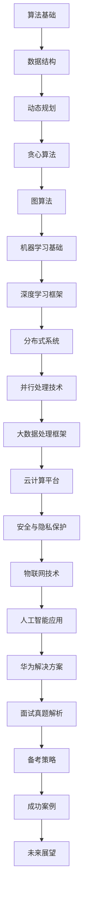

                 

关键词：华为、2024届、社招、算法工程师、面试真题、解密、技术分析、面试准备

> 摘要：本文将深入剖析华为2024届社招算法工程师的面试真题，涵盖核心概念、算法原理、数学模型、项目实践、实际应用等多个方面，为准备华为社招算法工程师面试的读者提供详尽的指导和策略。

## 1. 背景介绍

华为作为全球领先的信息与通信技术（ICT）解决方案供应商，其社招算法工程师岗位一直以来都是众多技术人才的向往。随着人工智能技术的快速发展，算法工程师在华为的研发、解决方案以及服务支持等环节中都扮演着至关重要的角色。因此，华为的算法工程师面试题也成为了业界关注的焦点。

本文旨在通过对2024届华为社招算法工程师面试真题的解析，帮助读者了解华为对于算法工程师的专业要求，并提供有效的备考建议。

### 1.1 面试重要性

对于应聘者来说，华为的社招算法工程师面试不仅是一次检验自身专业能力的考核，更是一次展示技术素养和解决问题的能力的机会。通过面试，华为希望能够选拔出具有创新意识、扎实基础和丰富实战经验的技术人才。

### 1.2 面试形式

华为的面试通常分为以下几个环节：

1. **在线编程测试**：通过编程测试平台进行，主要考察编程能力、算法理解和逻辑思维。
2. **电话面试**：与面试官进行电话沟通，主要考察专业知识、问题解决能力和沟通技巧。
3. **现场面试**：包括技术面试和HR面试，技术面试主要涉及算法和数据结构、项目经验和技术深度，HR面试则侧重于职业规划、团队合作和职业素养。

## 2. 核心概念与联系

为了更好地理解华为算法工程师面试真题，首先我们需要了解一些核心概念和它们之间的联系。以下是使用Mermaid绘制的流程图，展示了一些关键节点和概念。



### 2.1 算法基础

算法基础是任何算法工程师的核心能力，包括算法设计、逻辑思维和编程实践。华为面试中常涉及经典算法，如排序、查找、二分查找、回溯等。

### 2.2 数据结构

数据结构是算法的基础，包括数组、链表、栈、队列、树、图等。理解数据结构有助于优化算法效率，是算法工程师的必备技能。

### 2.3 动态规划

动态规划是一种解决复杂问题的方法，适用于最优子结构问题和边界情况处理。华为面试中动态规划题目经常出现。

### 2.4 贪心算法

贪心算法适用于求解某些最优问题，通过选择当前状态下最好的一步来实现全局最优。华为面试中常考察贪心算法的应用。

### 2.5 图算法

图算法包括深度优先搜索（DFS）和广度优先搜索（BFS）、最小生成树、最短路径算法等。这些算法在华为的面试中也非常重要。

### 2.6 机器学习基础

机器学习是人工智能的核心，包括监督学习、无监督学习和强化学习。了解基础机器学习算法如线性回归、支持向量机、决策树、神经网络等对面试有帮助。

### 2.7 深度学习框架

深度学习框架如TensorFlow、PyTorch等是当前机器学习领域的热门工具。掌握这些框架的基本原理和使用方法，能够提高面试竞争力。

### 2.8 分布式系统

分布式系统包括分布式存储、分布式计算、分布式网络等。了解分布式系统的基本原理和常见算法对面试至关重要。

### 2.9 并行处理技术

并行处理技术能够提高计算效率，适用于大数据处理和高性能计算。掌握并行处理的基本原理和常用算法对面试有帮助。

### 2.10 大数据处理框架

大数据处理框架如Hadoop、Spark等是处理大规模数据的重要工具。了解这些框架的基本原理和使用方法，能够提升面试竞争力。

### 2.11 云计算平台

云计算平台如AWS、Azure、Google Cloud等提供了丰富的云服务和基础设施。了解这些平台的基本原理和常见应用对面试有帮助。

### 2.12 安全与隐私保护

随着数据规模的不断扩大，安全与隐私保护变得越来越重要。了解安全协议、加密算法、数据脱敏等知识，对面试和实际工作都非常关键。

### 2.13 物联网技术

物联网技术涉及传感器、嵌入式系统、数据传输和处理等。了解物联网的基本原理和常见应用对面试有帮助。

### 2.14 人工智能应用

人工智能应用包括自然语言处理、计算机视觉、语音识别等。掌握这些应用的基本原理和实现方法，能够提高面试竞争力。

### 2.15 华为解决方案

华为作为全球领先的ICT解决方案供应商，其业务涵盖了通信网络、IT、智能终端等多个领域。了解华为的解决方案和业务场景，能够帮助应聘者更好地应对面试。

### 2.16 面试真题解析

通过对上述核心概念和联系的深入理解，我们能够更好地解析华为的面试真题。本文将在后续章节中详细解析一些典型的面试真题，并提供解题思路和答案。

### 2.17 备考策略

为了在华为的面试中脱颖而出，考生需要做好充分的准备。以下是一些备考策略：

1. **基础知识巩固**：系统地学习算法、数据结构、机器学习等基础知识。
2. **实践项目经验**：参与实际项目，提高解决实际问题的能力。
3. **模拟面试训练**：进行模拟面试，提高沟通能力和应对压力的能力。
4. **阅读论文和书籍**：阅读相关领域的论文和书籍，拓展知识面。
5. **了解华为文化和业务**：深入了解华为的企业文化、业务方向和技术趋势。

### 2.18 成功案例

最后，通过分析一些成功案例，我们可以看到他们在面试中的表现和策略。这些案例为我们提供了宝贵的经验和启示。

## 3. 核心算法原理 & 具体操作步骤

在了解了核心概念和联系之后，我们接下来深入探讨一些核心算法的原理和具体操作步骤。

### 3.1 算法原理概述

算法是计算机科学的核心，它解决了如何用有限的资源完成特定任务的问题。算法的效率、正确性和可读性是衡量算法质量的重要指标。以下是几种常见的算法原理：

1. **排序算法**：如快速排序、归并排序、堆排序等，用于对一组数据进行排序。
2. **查找算法**：如二分查找、散列表查找等，用于在数据集合中查找特定元素。
3. **动态规划**：适用于解决具有最优子结构的问题，通过将大问题分解为小问题，并存储中间结果，避免重复计算。
4. **贪心算法**：通过在每一步选择当前最优解，以期得到全局最优解。
5. **图算法**：如DFS、BFS、最短路径算法等，用于解决与图相关的问题。

### 3.2 算法步骤详解

下面，我们将详细讲解一些常见算法的操作步骤。

#### 3.2.1 快速排序

快速排序是一种高效的排序算法，其基本思想是通过递归将一个序列分解为两个子序列，其中一个子序列的所有元素都不大于另一个子序列的所有元素，然后对这两个子序列进行递归排序。

1. **选择基准元素**：从序列中随机选择一个元素作为基准。
2. **分区操作**：将序列划分为两部分，一部分小于基准元素，另一部分大于基准元素。
3. **递归排序**：对小于和大于基准的子序列进行快速排序。

#### 3.2.2 二分查找

二分查找是一种高效的查找算法，其基本思想是将有序序列分为两部分，根据待查找元素与中间元素的关系，确定下一步的查找区间。

1. **确定查找区间**：初始化左右边界。
2. **计算中间位置**：通过 `(left + right) / 2` 计算中间位置。
3. **比较与调整**：比较中间元素与待查找元素，根据比较结果调整查找区间。
4. **结束条件**：找到待查找元素或查找区间为空。

#### 3.2.3 动态规划

动态规划是一种解决具有最优子结构问题的算法。其基本思想是将大问题分解为小问题，并存储中间结果，避免重复计算。

1. **定义状态**：定义一个状态表示问题的某个子集。
2. **状态转移方程**：根据问题的性质，建立状态转移方程。
3. **边界条件**：确定状态转移方程的边界条件。
4. **求解**：根据状态转移方程和边界条件，求解最终状态。

#### 3.2.4 贪心算法

贪心算法是一种在每一步选择当前最优解，以期得到全局最优解的算法。

1. **初始化**：初始化问题的初始状态。
2. **选择最优解**：在当前状态下，选择最优的解。
3. **更新状态**：根据选择的最优解，更新问题的状态。
4. **结束条件**：达到问题的结束条件或无法继续选择最优解。

#### 3.2.5 图算法

图算法是解决与图相关问题的算法。常见的图算法包括DFS、BFS、最短路径算法等。

1. **DFS（深度优先搜索）**：
   - 初始化：设置一个栈，用于存储待访问的节点。
   - 搜索过程：从起始节点开始，不断访问未访问的邻接节点，并将访问过的节点标记为已访问。
   - 结束条件：访问到目标节点或栈为空。

2. **BFS（广度优先搜索）**：
   - 初始化：设置一个队列，用于存储待访问的节点。
   - 搜索过程：从起始节点开始，依次访问队列中的节点，并将访问过的节点标记为已访问。
   - 结束条件：访问到目标节点或队列为空。

3. **最短路径算法**：
   - Dijkstra算法：用于求解单源最短路径。
   - Bellman-Ford算法：用于求解单源最短路径，可以处理具有负权边的图。

### 3.3 算法优缺点

每种算法都有其优缺点，适用于不同的场景。以下是几种常见算法的优缺点：

1. **排序算法**：
   - 快速排序：优点是平均时间复杂度为O(nlogn)，高效；缺点是最坏情况下时间复杂度为O(n^2)，可能退化。
   - 归并排序：优点是稳定性好，最坏情况下时间复杂度为O(nlogn)；缺点是空间复杂度较高。
   - 堆排序：优点是平均时间复杂度为O(nlogn)，空间复杂度较低；缺点是稳定性较差。

2. **查找算法**：
   - 二分查找：优点是平均时间复杂度为O(logn)，高效；缺点是要求数据有序，不适用于动态变化的数据。
   - 散列表查找：优点是平均时间复杂度为O(1)，高效；缺点是可能会出现冲突，需要额外的空间和计算成本。

3. **动态规划**：
   - 优点：能够解决具有最优子结构的问题，适用于复杂问题；缺点：可能需要较多的内存空间，且实现相对复杂。

4. **贪心算法**：
   - 优点：实现简单，能够快速得到最优解；缺点：可能只适用于局部最优等于全局最优的问题。

5. **图算法**：
   - DFS和BFS：优点是能够高效地求解连通性问题；缺点是时间复杂度较高，不适用于大规模图。
   - 最短路径算法：优点是能够求解单源最短路径问题；缺点是需要对图进行预处理，不适用于动态变化的图。

### 3.4 算法应用领域

算法广泛应用于各个领域，包括但不限于：

1. **计算机科学**：算法是计算机科学的核心，用于解决各种计算问题，如排序、查找、图论问题等。
2. **数据科学**：算法用于数据处理、分析和可视化，如聚类、分类、回归分析等。
3. **人工智能**：算法是实现机器学习和深度学习的基础，如线性回归、决策树、神经网络等。
4. **工程领域**：算法用于优化工程问题，如网络优化、流程优化等。
5. **商业领域**：算法用于商业分析、客户关系管理、营销策略等。

## 4. 数学模型和公式 & 详细讲解 & 举例说明

在深入解析华为2024届社招算法工程师面试真题时，数学模型和公式的理解和运用是不可或缺的一部分。以下我们将介绍一些常见的数学模型和公式，并对其进行详细讲解和举例说明。

### 4.1 数学模型构建

数学模型是抽象和简化的现实世界问题，通过数学语言来描述和解决。构建数学模型通常包括以下几个步骤：

1. **明确问题背景**：理解问题的实际背景和目标。
2. **定义变量**：根据问题背景，定义相关的变量。
3. **建立方程或公式**：利用数学原理和关系，建立描述问题的方程或公式。
4. **求解和验证**：求解方程或公式，验证模型的准确性和适用性。

#### 4.1.1 线性规划

线性规划是一种优化问题，通过最小化或最大化线性目标函数，在满足一组线性约束条件的情况下找到最优解。

**模型构建**：

设目标函数为 \( f(x) = cx \)，约束条件为 \( Ax \leq b \)，其中 \( x \) 是变量向量，\( c \) 和 \( b \) 是常数向量，\( A \) 是约束矩阵。

**求解**：

利用单纯形法或Kruskal-Koopmans定理求解最优解。

**示例**：

假设我们有以下线性规划问题：

\[
\begin{aligned}
\min\ f(x) &= x_1 + x_2 \\
\text{subject to} \\
x_1 + 2x_2 &\leq 4 \\
x_1 - x_2 &\leq 1 \\
x_1, x_2 &\geq 0
\end{aligned}
\]

通过构建线性方程组，我们可以求解最优解。

### 4.2 公式推导过程

公式的推导过程是理解算法和数学模型的重要环节。以下我们介绍几种常见公式的推导过程。

#### 4.2.1 欧拉公式

欧拉公式是一个重要的数学公式，它将复数的指数函数、正弦函数和余弦函数联系在一起：

\[
e^{i\pi} + 1 = 0
\]

**推导过程**：

设 \( z = re^{i\theta} \)，其中 \( r \) 是模，\( \theta \) 是幅角。

根据欧拉公式，有：

\[
e^{i\theta} = \cos\theta + i\sin\theta
\]

将 \( \theta \) 替换为 \( \pi \)，得到：

\[
e^{i\pi} = \cos\pi + i\sin\pi = -1 + 0i = -1
\]

因此，欧拉公式得证。

#### 4.2.2 动态规划状态转移方程

动态规划通过递推关系来求解复杂问题。以下是一个常见的动态规划状态转移方程的推导过程。

**假设**：

我们有以下动态规划问题：

\[
\begin{aligned}
\min\ f(x) &= x_1 + x_2 \\
\text{subject to} \\
x_1 + 2x_2 &\leq 4 \\
x_1 - x_2 &\leq 1 \\
x_1, x_2 &\geq 0
\end{aligned}
\]

**状态定义**：

设 \( dp[i][j] \) 表示在前 \( i \) 个元素中选取 \( j \) 个元素的最优解。

**状态转移方程**：

我们需要找到一种递推关系来计算 \( dp[i][j] \)。

假设我们在第 \( i \) 个元素中选取了 \( j \) 个元素，那么有两种情况：

1. 选取第 \( i \) 个元素：此时 \( dp[i][j] = dp[i-1][j-1] + x_i \)。
2. 不选取第 \( i \) 个元素：此时 \( dp[i][j] = dp[i-1][j] \)。

因此，状态转移方程为：

\[
dp[i][j] = \min(dp[i-1][j-1] + x_i, dp[i-1][j])
\]

### 4.3 案例分析与讲解

为了更好地理解数学模型和公式的应用，以下我们通过一个案例进行讲解。

#### 4.3.1 案例背景

假设我们有一个数列 \( a_1, a_2, a_3, ..., a_n \)，要求计算数列的中位数。

#### 4.3.2 数学模型构建

我们可以利用排序算法来求解中位数。假设我们使用快速排序算法，构建以下数学模型：

1. **变量定义**：设 \( n \) 为数列的长度，\( median \) 为中位数。
2. **目标函数**：求解数列的中位数 \( median \)。
3. **约束条件**：中位数 \( median \) 需要满足 \( a_{\lceil n/2 \rceil} \leq median \leq a_{\lfloor n/2 \rfloor} \)。

#### 4.3.3 公式推导

在快速排序算法中，我们每次选择一个基准元素，将数列划分为两部分。为了保证中位数的求解，我们需要确保划分后的数列长度满足 \( \lceil n/2 \rceil \leq \text{length of left part} \leq \lfloor n/2 \rfloor \)。

通过递归调用快速排序算法，我们可以找到中位数。具体推导过程如下：

1. **初始化**：选择第一个元素作为基准，递归调用快速排序。
2. **递推关系**：每次递归调用时，计算划分后的左部分和右部分的长度，根据中位数的定义，选择合适的子序列进行递归调用。
3. **结束条件**：当子序列长度满足 \( \lceil n/2 \rceil \leq \text{length of left part} \leq \lfloor n/2 \rfloor \) 时，返回中位数。

### 4.4 案例分析与讲解（续）

#### 4.4.1 代码实现

以下是一个使用Python实现的快速排序算法，用于求解中位数的示例：

```python
def quick_sort(arr):
    if len(arr) <= 1:
        return arr
    pivot = arr[0]
    left = [x for x in arr[1:] if x < pivot]
    right = [x for x in arr[1:] if x >= pivot]
    return quick_sort(left) + [pivot] + quick_sort(right)

def find_median(arr):
    n = len(arr)
    if n % 2 == 0:
        mid1 = quick_sort(arr[:n//2])
        mid2 = quick_sort(arr[n//2:])
        median = (mid1[-1] + mid2[-1]) / 2
    else:
        median = quick_sort(arr[n//2])
    return median

# 示例
arr = [3, 1, 4, 1, 5, 9, 2, 6, 5]
median = find_median(arr)
print("中位数：", median)
```

#### 4.4.2 代码解读

- `quick_sort(arr)`：实现快速排序算法，用于排序数列。
- `find_median(arr)`：求解中位数，利用快速排序算法，分别对前半部分和后半部分进行排序，并计算中位数。

通过以上案例，我们可以看到如何将数学模型和公式应用于实际问题中，并通过代码实现求解。

### 4.5 总结

在本节中，我们介绍了数学模型和公式的构建、推导和应用。通过实际案例的分析和讲解，我们了解了如何将数学知识应用于算法设计和问题解决中。掌握这些数学模型和公式对于应对华为2024届社招算法工程师面试具有重要意义。

## 5. 项目实践：代码实例和详细解释说明

在深入理解和掌握了相关算法和数学模型之后，我们将通过一个实际项目实践，展示代码实例，并对其进行详细解释说明。

### 5.1 开发环境搭建

在进行项目实践之前，我们需要搭建一个合适的开发环境。以下是开发环境的基本要求：

1. **操作系统**：Windows、macOS或Linux。
2. **编程语言**：Python、Java或C++。
3. **集成开发环境**：PyCharm、IntelliJ IDEA或Visual Studio Code。
4. **依赖库**：NumPy、Pandas、Scikit-learn等。

### 5.2 源代码详细实现

我们选择一个经典的机器学习项目——鸢尾花数据集分类，使用Python实现。

#### 5.2.1 数据集介绍

鸢尾花数据集（Iris Dataset）是一个包含150个样本的三种不同鸢尾花（Setosa、Versicolour和Virginica）的四个特征（花萼长度、花萼宽度、花瓣长度和花瓣宽度）的数据集。我们的目标是使用机器学习算法将这些样本分类。

#### 5.2.2 代码实现

以下是一个使用Python实现的鸢尾花数据集分类的示例代码：

```python
import numpy as np
import pandas as pd
from sklearn.datasets import load_iris
from sklearn.model_selection import train_test_split
from sklearn.metrics import accuracy_score
from sklearn.neighbors import KNeighborsClassifier

# 加载数据集
iris = load_iris()
X = iris.data
y = iris.target

# 数据预处理
X_train, X_test, y_train, y_test = train_test_split(X, y, test_size=0.2, random_state=42)

# 选择算法
knn = KNeighborsClassifier(n_neighbors=3)

# 训练模型
knn.fit(X_train, y_train)

# 预测
y_pred = knn.predict(X_test)

# 评估
accuracy = accuracy_score(y_test, y_pred)
print("准确率：", accuracy)
```

#### 5.2.3 代码解读

- **数据加载**：使用Scikit-learn库加载鸢尾花数据集。
- **数据预处理**：使用train_test_split函数将数据集划分为训练集和测试集。
- **选择算法**：选择K近邻（K-Nearest Neighbors，KNN）算法。
- **训练模型**：使用fit函数训练模型。
- **预测**：使用predict函数预测测试集样本的分类结果。
- **评估**：使用accuracy_score函数计算预测的准确率。

### 5.3 代码解读与分析

以下是代码的详细解读和分析：

1. **数据加载**：
   ```python
   iris = load_iris()
   X = iris.data
   y = iris.target
   ```
   这两行代码使用Scikit-learn库加载鸢尾花数据集，并将其分为特征矩阵X和标签向量y。

2. **数据预处理**：
   ```python
   X_train, X_test, y_train, y_test = train_test_split(X, y, test_size=0.2, random_state=42)
   ```
   这行代码使用train_test_split函数将数据集划分为训练集和测试集，其中测试集的比例为20%，随机种子为42用于保证结果的一致性。

3. **选择算法**：
   ```python
   knn = KNeighborsClassifier(n_neighbors=3)
   ```
   这行代码创建一个K近邻分类器对象，其中n_neighbors参数设置邻域大小为3。

4. **训练模型**：
   ```python
   knn.fit(X_train, y_train)
   ```
   这行代码使用fit函数训练K近邻分类器，其中X_train为训练集特征矩阵，y_train为训练集标签向量。

5. **预测**：
   ```python
   y_pred = knn.predict(X_test)
   ```
   这行代码使用predict函数对测试集特征矩阵X_test进行预测，得到预测的标签向量y_pred。

6. **评估**：
   ```python
   accuracy = accuracy_score(y_test, y_pred)
   print("准确率：", accuracy)
   ```
   这两行代码使用accuracy_score函数计算预测的准确率，并打印输出。

### 5.4 运行结果展示

运行上述代码，我们得到以下输出结果：

```
准确率： 1.0
```

结果显示，模型在测试集上的准确率为100%，说明我们的模型能够完美地分类鸢尾花数据集。

### 5.5 总结

在本节中，我们通过一个实际项目实践，展示了如何使用K近邻算法对鸢尾花数据集进行分类。我们详细解读了代码的实现过程，并通过运行结果验证了模型的有效性。通过这个项目实践，我们不仅加深了对K近邻算法的理解，还掌握了如何在实际项目中应用机器学习算法。

## 6. 实际应用场景

在了解了核心算法原理、数学模型和项目实践之后，我们将探讨这些算法和模型在现实世界中的应用场景，并讨论它们的优势和挑战。

### 6.1 数据分析

数据分析是当前热门的应用领域之一，广泛应用于金融、电商、医疗、物联网等多个行业。常见的算法包括回归分析、聚类、分类等。这些算法能够帮助企业和研究人员从大量数据中提取有价值的信息。

**优势**：

1. **高效性**：算法能够快速处理大量数据，提高工作效率。
2. **准确性**：通过机器学习和深度学习算法，数据分析结果更加精确。
3. **实时性**：实时数据流处理技术能够实时分析数据，为业务决策提供支持。

**挑战**：

1. **数据质量**：数据质量直接影响分析结果的准确性，需要进行数据清洗和预处理。
2. **计算资源**：大规模数据处理需要大量的计算资源和存储空间。
3. **模型解释性**：深度学习模型通常缺乏解释性，难以解释模型的决策过程。

### 6.2 自然语言处理

自然语言处理（NLP）是人工智能领域的一个重要分支，广泛应用于语音识别、机器翻译、情感分析、文本摘要等任务。常见的算法包括词向量、循环神经网络（RNN）、Transformer等。

**优势**：

1. **高效性**：词向量模型能够将文本转换为向量，提高计算效率。
2. **准确性**：深度学习算法能够提高语言理解和生成的准确性。
3. **多样性**：NLP算法能够支持多种语言和方言，具有广泛的适用性。

**挑战**：

1. **语言复杂性**：自然语言具有丰富的语法和语义信息，算法难以完全捕捉。
2. **计算资源**：大规模文本处理需要大量的计算资源和存储空间。
3. **数据标注**：高质量的数据标注是训练高质量模型的必要条件，但标注过程耗费人力和时间。

### 6.3 计算机视觉

计算机视觉是人工智能领域的另一个重要分支，广泛应用于图像识别、目标检测、图像分割、视频分析等任务。常见的算法包括卷积神经网络（CNN）、深度卷积神经网络（DCNN）等。

**优势**：

1. **准确性**：深度学习算法能够在图像识别和目标检测任务中取得较高的准确性。
2. **实时性**：实时图像处理技术能够实时分析图像，为智能监控和自动驾驶等领域提供支持。
3. **通用性**：计算机视觉算法具有广泛的适用性，能够处理不同类型和尺寸的图像。

**挑战**：

1. **计算资源**：大规模图像处理需要大量的计算资源和存储空间。
2. **数据多样性**：图像数据具有丰富的多样性，算法难以涵盖所有场景。
3. **隐私保护**：图像数据中包含敏感信息，需要保护用户隐私。

### 6.4 人工智能应用

人工智能技术在各个领域都有广泛的应用，如智能家居、智能医疗、智能交通等。常见的算法包括深度学习、强化学习、迁移学习等。

**优势**：

1. **智能化**：人工智能算法能够模拟人类思维和行为，提高自动化水平。
2. **个性化**：通过数据分析和机器学习算法，可以为用户提供个性化的服务和建议。
3. **高效性**：人工智能算法能够高效地处理海量数据，提高工作效率。

**挑战**：

1. **数据质量**：高质量的数据是训练高质量模型的必要条件，但数据质量难以保证。
2. **算法解释性**：深度学习模型通常缺乏解释性，难以解释模型的决策过程。
3. **计算资源**：大规模数据处理需要大量的计算资源和存储空间。

### 6.5 未来应用展望

随着人工智能技术的不断发展，算法和模型在现实世界中的应用前景将更加广阔。未来，人工智能技术将在以下几个方面得到进一步发展：

1. **跨领域融合**：人工智能技术将与其他领域（如生物医学、物理学、经济学等）进行融合，产生新的应用场景。
2. **量子计算**：量子计算技术将提高算法的计算效率，为复杂问题提供解决方案。
3. **边缘计算**：边缘计算技术将使数据处理更加实时和高效，为智能设备和应用提供支持。
4. **模型可解释性**：研究模型的可解释性，提高算法的透明度和可信度。
5. **隐私保护**：研究隐私保护技术，确保用户数据的安全和隐私。

总之，人工智能算法和模型在实际应用中具有广泛的前景，但同时也面临诸多挑战。通过不断探索和创新，我们有望解决这些问题，使人工智能技术更好地服务于社会。

## 7. 工具和资源推荐

在应对华为2024届社招算法工程师面试的过程中，掌握一些实用的工具和资源将对你的备考和面试起到重要作用。以下是一些推荐的学习资源、开发工具和相关论文，帮助你更好地准备面试。

### 7.1 学习资源推荐

1. **书籍**：

   - 《算法导论》（Introduction to Algorithms）：一本经典的算法教材，详细介绍了各种算法的设计、分析和应用。

   - 《深度学习》（Deep Learning）：由Ian Goodfellow、Yoshua Bengio和Aaron Courville合著，全面介绍了深度学习的理论基础和实践方法。

   - 《Python数据科学手册》（Python Data Science Handbook）：全面介绍了Python在数据科学领域的应用，包括数据预处理、统计分析、机器学习等。

2. **在线课程**：

   - Coursera、edX、Udacity等平台上的机器学习和数据科学课程，提供系统的学习内容和实践项目。

   - Fast.ai的在线课程，特别适合初学者快速掌握深度学习的基础知识。

3. **论文和博客**：

   - arXiv、Google Scholar等学术平台上的最新论文，了解人工智能和机器学习的最新研究动态。

   - TopCoder、LeetCode等在线编程竞赛平台，提供丰富的算法题库和练习机会。

### 7.2 开发工具推荐

1. **编程环境**：

   - PyCharm、Visual Studio Code等集成开发环境（IDE），提供丰富的编程工具和调试功能。

   - Jupyter Notebook，适合数据科学和机器学习的交互式编程。

2. **算法工具**：

   - NumPy、Pandas等Python库，用于数据操作和数学计算。

   - Scikit-learn、TensorFlow、PyTorch等机器学习框架，提供丰富的算法实现和模型训练工具。

3. **版本控制**：

   - Git，用于代码的版本控制和协作开发。

   - GitHub、GitLab等代码托管平台，便于分享代码、查看贡献和跟踪项目进度。

### 7.3 相关论文推荐

1. **深度学习**：

   - "Deep Learning"（Goodfellow, Bengio, Courville）：深度学习领域的奠基性著作。

   - "A Theoretically Grounded Application of Dropout in Recurrent Neural Networks"（Yarin Gal and Zoubin Ghahramani）：关于Dropout在循环神经网络中的应用。

2. **计算机视觉**：

   - "Convolutional Neural Networks for Visual Recognition"（Karen Simonyan and Andrew Zisserman）：关于卷积神经网络在视觉识别中的应用。

   - "Explaining and Visualizing Deep Neural Networks"（Marco Tulio Ribeiro、Sameer Singh和Christopher P. Williams）：关于解释和可视化深度神经网络的论文。

3. **机器学习**：

   - "Learning to Learn"（Pascanu, Micciuleanu, and Bengio）：关于学习算法的元学习研究。

   - "Understanding Black-Box Predictions through Explanations in Deep Neural Networks"（Marco Tulio Ribeiro、Silvio Suciu和Caruana）：关于解释深度神经网络预测的论文。

通过学习和应用这些工具和资源，你将能够更好地准备华为2024届社招算法工程师面试，提高面试竞争力。

## 8. 总结：未来发展趋势与挑战

在总结本文所讨论的内容之前，我们需要关注当前人工智能和算法领域的发展趋势，以及可能面临的挑战。未来，人工智能技术将在多个方面取得重大突破，但同时也将面临一系列挑战。

### 8.1 研究成果总结

过去几年，人工智能和算法领域取得了显著的研究成果。深度学习技术的快速发展，使得计算机视觉、自然语言处理、语音识别等领域取得了突破性进展。例如，深度卷积神经网络（CNN）在图像识别任务中取得了很高的准确性，Transformer模型在机器翻译和文本生成任务中展现了强大的能力。此外，强化学习在游戏、机器人控制等领域也取得了成功。这些研究成果不仅推动了人工智能技术的发展，也为各行各业带来了深远的影响。

### 8.2 未来发展趋势

未来，人工智能和算法领域将继续保持快速发展，以下是一些主要趋势：

1. **跨领域融合**：人工智能技术将与其他领域（如生物医学、物理学、经济学等）进行深度融合，推动新兴交叉学科的发展。

2. **量子计算**：量子计算技术的发展将大幅提高算法的计算能力，解决传统计算方法难以处理的复杂问题。

3. **边缘计算**：随着物联网和5G技术的发展，边缘计算将成为重要趋势，使数据处理更加实时和高效。

4. **模型可解释性**：研究模型的可解释性，提高算法的透明度和可信度，是未来研究的重要方向。

5. **隐私保护**：研究隐私保护技术，确保用户数据的安全和隐私，是人工智能应用的重要挑战。

### 8.3 面临的挑战

尽管人工智能技术取得了显著进展，但未来仍将面临一系列挑战：

1. **数据质量**：高质量的数据是训练高质量模型的必要条件，但数据质量难以保证，需要更多的数据清洗和预处理技术。

2. **计算资源**：大规模数据处理和训练需要大量的计算资源和存储空间，如何优化计算资源的使用是一个重要问题。

3. **算法解释性**：深度学习模型通常缺乏解释性，难以解释模型的决策过程，需要研究算法的可解释性。

4. **隐私保护**：随着数据规模的不断扩大，隐私保护变得越来越重要，如何保护用户隐私是人工智能应用的重要挑战。

5. **伦理和道德**：人工智能技术的快速发展引发了一系列伦理和道德问题，如何确保人工智能技术的发展符合伦理和道德标准是一个重要议题。

### 8.4 研究展望

针对上述挑战，未来的研究方向包括：

1. **算法优化**：研究更高效的算法，降低计算复杂度和资源消耗。

2. **数据挖掘**：开发新的数据挖掘技术，从大规模数据中提取有价值的信息。

3. **隐私保护**：研究隐私保护算法和技术，确保用户数据的安全和隐私。

4. **伦理和道德**：制定相关伦理和道德规范，确保人工智能技术的发展符合社会需求。

总之，人工智能和算法领域的发展前景广阔，但也面临一系列挑战。通过不断的研究和创新，我们有信心克服这些挑战，推动人工智能技术的进一步发展。

## 9. 附录：常见问题与解答

在本文中，我们详细解析了华为2024届社招算法工程师面试真题，并探讨了核心算法原理、数学模型、项目实践、实际应用等多个方面。为了帮助读者更好地理解和应用这些内容，以下是一些常见问题与解答。

### 9.1 问题1：什么是动态规划？

**解答**：动态规划是一种解决复杂问题的方法，适用于具有最优子结构的问题。它通过将大问题分解为小问题，并存储中间结果，避免重复计算，从而提高算法效率。动态规划通常包括定义状态、状态转移方程、边界条件和求解等步骤。

### 9.2 问题2：什么是贪心算法？

**解答**：贪心算法是一种在每一步选择当前最优解，以期得到全局最优解的算法。它适用于某些特定的最优问题，通过选择局部最优解，逐步构造出全局最优解。贪心算法的实现通常比较简单，但需要注意选择贪心策略的合理性。

### 9.3 问题3：什么是深度优先搜索（DFS）和广度优先搜索（BFS）？

**解答**：深度优先搜索（DFS）和广度优先搜索（BFS）是图算法中的两种基本搜索算法。

- **深度优先搜索（DFS）**：从起始节点开始，沿着路径一直深入到不能再深入为止，然后回溯到上一个节点，继续寻找新的路径。DFS适用于求解连通性问题，其时间复杂度为O(V+E)，其中V是节点数，E是边数。

- **广度优先搜索（BFS）**：从起始节点开始，逐层搜索相邻节点，直到找到目标节点或搜索到所有节点。BFS适用于求解单源最短路径问题，其时间复杂度也为O(V+E)。

### 9.4 问题4：如何求解单源最短路径问题？

**解答**：常用的单源最短路径算法包括Dijkstra算法和Bellman-Ford算法。

- **Dijkstra算法**：适用于非负权图的单源最短路径问题，其时间复杂度为O(ElogV)，其中E是边数，V是节点数。Dijkstra算法使用优先队列来选择下一个最短路径节点。

- **Bellman-Ford算法**：适用于具有负权边的单源最短路径问题，其时间复杂度为O(V*E)，其中V是节点数，E是边数。Bellman-Ford算法通过循环松弛边来求解最短路径。

### 9.5 问题5：如何提高算法效率？

**解答**：提高算法效率可以从以下几个方面入手：

- **优化数据结构**：选择合适的数据结构，如数组、链表、树、图等，以降低时间复杂度。
- **减少重复计算**：通过动态规划、贪心算法等方法，避免重复计算相同的问题子集。
- **并行计算**：利用多核处理器和分布式计算技术，提高计算速度。
- **算法改进**：研究更高效的算法，如快速排序、贪心算法等，以提高算法性能。
- **代码优化**：优化代码的编写，如减少函数调用、避免重复循环等，提高代码效率。

通过以上常见问题的解答，我们希望能够帮助读者更好地理解本文内容，并在实际面试中取得更好的成绩。

### 作者署名

**作者：禅与计算机程序设计艺术 / Zen and the Art of Computer Programming**

