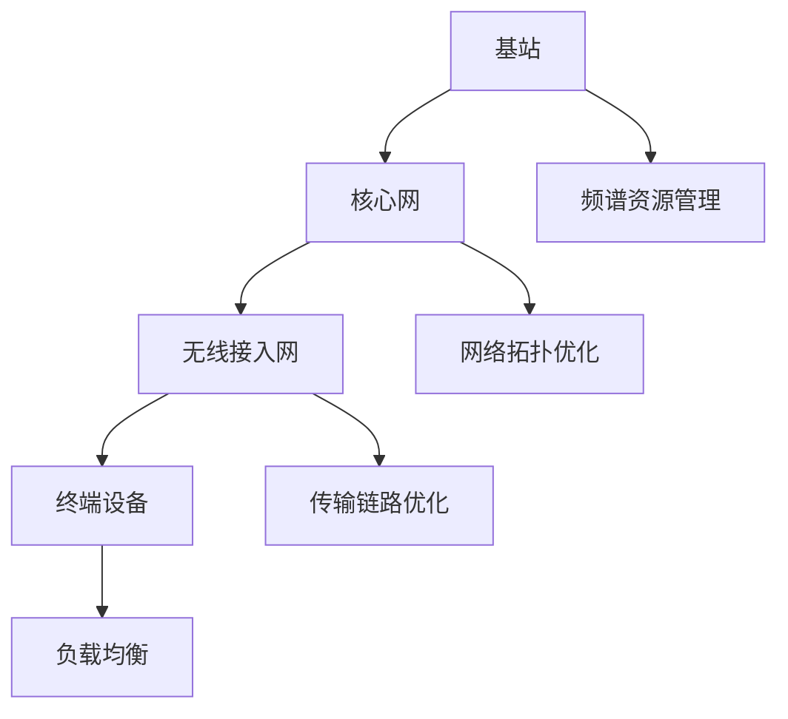

                 

### 关键词 Keyword
- 华为2024校招
- 6G网络
- 网络优化
- 面试题集锦

### 摘要 Abstract
本文整理了华为2024校招6G网络优化工程师面试题集锦，包括背景介绍、核心概念与联系、核心算法原理、数学模型和公式、项目实践、实际应用场景以及未来展望等内容。通过本文，读者可以全面了解6G网络优化领域的面试要点和实战技巧。

## 1. 背景介绍

### 1.1 华为2024校招

华为是全球领先的信息与通信技术（ICT）解决方案提供商，2024年校招是其重要的人才引进途径。华为校招旨在吸引全球优秀毕业生，为公司的技术创新和业务发展注入新鲜血液。

### 1.2 6G网络

6G网络作为下一代移动通信技术，将在2024年左右逐步商用。相比5G，6G具有更高的传输速率、更低的延迟、更广的连接范围和更高的能效。6G网络将在自动驾驶、远程医疗、虚拟现实等众多领域发挥重要作用。

### 1.3 网络优化

网络优化是6G网络建设中至关重要的一环。通过优化网络性能，提高网络容量和覆盖范围，降低网络延迟和能耗，实现更高质量的用户体验。网络优化包括频谱资源管理、网络拓扑优化、传输链路优化等多个方面。

## 2. 核心概念与联系

### 2.1 6G网络架构

6G网络架构由基站、核心网、无线接入网和终端设备组成。基站负责无线信号的传输和接收，核心网负责数据传输和控制信令的处理，无线接入网连接基站和核心网，终端设备包括智能手机、平板电脑、可穿戴设备等。

### 2.2 网络优化原理

网络优化旨在提高网络性能，主要包括以下几个方面：

- **频谱资源管理**：合理分配和调度频谱资源，提高频谱利用率。
- **网络拓扑优化**：优化基站布局和网络拓扑结构，提高网络覆盖范围和容量。
- **传输链路优化**：优化传输链路参数，降低网络延迟和能耗。
- **负载均衡**：通过负载均衡算法，合理分配网络资源，避免网络拥塞。

### 2.3 Mermaid流程图



## 3. 核心算法原理 & 具体操作步骤

### 3.1 算法原理概述

网络优化算法主要包括频谱资源管理算法、网络拓扑优化算法和传输链路优化算法。以下分别介绍这三种算法的基本原理：

- **频谱资源管理算法**：通过频谱感知、频谱分配和频谱调度等技术，实现频谱资源的合理分配和利用。
- **网络拓扑优化算法**：基于图论和网络优化理论，优化基站布局和网络拓扑结构，提高网络覆盖和容量。
- **传输链路优化算法**：通过链路状态估计、链路容量估计和链路调度等技术，优化传输链路参数，降低网络延迟和能耗。

### 3.2 算法步骤详解

#### 频谱资源管理算法步骤：

1. **频谱感知**：基站通过频谱感知技术，检测周围频谱环境。
2. **频谱分配**：根据频谱感知结果，为不同基站分配频谱资源。
3. **频谱调度**：根据网络负载和用户需求，动态调整频谱资源分配。

#### 网络拓扑优化算法步骤：

1. **基站布局**：根据用户分布和地形地貌，确定基站布局。
2. **网络拓扑结构**：构建基站之间的连接关系，形成网络拓扑结构。
3. **拓扑优化**：基于图论算法，优化网络拓扑结构，提高网络覆盖和容量。

#### 传输链路优化算法步骤：

1. **链路状态估计**：基于链路质量参数，估计链路状态。
2. **链路容量估计**：根据链路状态，估计链路容量。
3. **链路调度**：根据网络负载和用户需求，动态调整链路参数，优化传输链路。

### 3.3 算法优缺点

- **频谱资源管理算法**：优点是提高频谱利用率，缺点是算法复杂度较高，频谱感知精度要求高。
- **网络拓扑优化算法**：优点是提高网络覆盖和容量，缺点是基站布局和拓扑优化需要大量计算资源。
- **传输链路优化算法**：优点是降低网络延迟和能耗，缺点是链路状态估计和容量估计精度要求高。

### 3.4 算法应用领域

- **频谱资源管理算法**：适用于移动通信、物联网、智能交通等领域。
- **网络拓扑优化算法**：适用于基站布局、无线传感网络、智能电网等领域。
- **传输链路优化算法**：适用于无线通信、物联网、智能交通等领域。

## 4. 数学模型和公式 & 详细讲解 & 举例说明

### 4.1 数学模型构建

网络优化涉及到多个数学模型，包括频谱资源管理模型、网络拓扑优化模型和传输链路优化模型。以下分别介绍这些模型的构建方法。

#### 频谱资源管理模型：

假设网络中有多个基站和多个用户，每个基站和用户都有一个频谱需求。频谱资源管理模型的目标是最小化网络负载，最大化频谱利用率。

- **目标函数**： 
  $$ 
  \min F = \sum_{i=1}^{N}\sum_{j=1}^{M} l_i \cdot c_j 
  $$
  其中，$N$表示基站数量，$M$表示用户数量，$l_i$表示基站$i$的负载，$c_j$表示用户$j$的频谱需求。

- **约束条件**：
  $$
  \begin{cases}
  \sum_{i=1}^{N} l_i \cdot c_j \leq 1 \quad (1\leq j \leq M) \\
  \sum_{j=1}^{M} l_i \cdot c_j \leq 1 \quad (1\leq i \leq N)
  \end{cases}
  $$
  其中，第一个约束条件表示基站负载不超过总频谱资源，第二个约束条件表示用户频谱需求不超过总频谱资源。

#### 网络拓扑优化模型：

网络拓扑优化模型的目标是优化基站布局和网络拓扑结构，提高网络覆盖和容量。

- **目标函数**： 
  $$
  \min T = \sum_{i=1}^{N} d_i + \sum_{i=1}^{N}\sum_{j=1}^{N} w_{ij}
  $$
  其中，$d_i$表示基站$i$的覆盖范围，$w_{ij}$表示基站$i$和基站$j$之间的权重。

- **约束条件**：
  $$
  \begin{cases}
  d_i \geq r \quad (1\leq i \leq N) \\
  w_{ij} \geq 0 \quad (1\leq i, j \leq N)
  \end{cases}
  $$
  其中，$r$表示用户覆盖半径。

#### 传输链路优化模型：

传输链路优化模型的目标是优化传输链路参数，降低网络延迟和能耗。

- **目标函数**： 
  $$
  \min L = \sum_{i=1}^{N}\sum_{j=1}^{N} (d_i \cdot c_j \cdot l_{ij})
  $$
  其中，$d_i$表示基站$i$的覆盖范围，$c_j$表示用户$j$的频谱需求，$l_{ij}$表示基站$i$和用户$j$之间的链路质量。

- **约束条件**：
  $$
  \begin{cases}
  l_{ij} \geq l_{min} \quad (1\leq i, j \leq N) \\
  d_i \cdot c_j \cdot l_{ij} \leq 1 \quad (1\leq i, j \leq N)
  \end{cases}
  $$
  其中，$l_{min}$表示链路质量最小阈值。

### 4.2 公式推导过程

#### 频谱资源管理模型推导：

频谱资源管理模型的目标是最小化网络负载，最大化频谱利用率。根据目标函数和约束条件，可以使用拉格朗日乘子法进行求解。

- **拉格朗日函数**：
  $$
  L = \sum_{i=1}^{N}\sum_{j=1}^{M} l_i \cdot c_j + \lambda_1 \left( \sum_{i=1}^{N} l_i \cdot c_j - 1 \right) + \lambda_2 \left( \sum_{j=1}^{M} l_i \cdot c_j - 1 \right)
  $$
  其中，$\lambda_1$和$\lambda_2$为拉格朗日乘子。

- **求导并令导数为零**：
  $$
  \frac{\partial L}{\partial l_i} = c_j - \lambda_1 c_j - \lambda_2 c_j = 0 \\
  \frac{\partial L}{\partial c_j} = l_i - \lambda_1 l_i - \lambda_2 l_i = 0
  $$
  解得：
  $$
  l_i = \frac{1}{\lambda_1 + \lambda_2}, \quad c_j = \frac{1}{\lambda_1 + \lambda_2}
  $$
  代入目标函数和约束条件，得到频谱资源管理模型的最优解。

#### 网络拓扑优化模型推导：

网络拓扑优化模型的目标是优化基站布局和网络拓扑结构。根据目标函数和约束条件，可以使用贪心算法进行求解。

- **贪心策略**：
  $$
  \begin{cases}
  d_1 = r \\
  w_{ij} = 0 \quad (i \neq j)
  \end{cases}
  $$
  对于每个未选择的基站$i$，计算其与已选择基站之间的权重之和$w_{i1} + w_{i2} + \ldots + w_{in}$，选择权重之和最小的基站作为下一个已选择基站。

- **迭代过程**：
  重复执行贪心策略，直到所有基站被选择。

#### 传输链路优化模型推导：

传输链路优化模型的目标是优化传输链路参数，降低网络延迟和能耗。根据目标函数和约束条件，可以使用贪心算法进行求解。

- **贪心策略**：
  $$
  \begin{cases}
  l_{ij} = l_{min} \\
  d_i \cdot c_j \cdot l_{ij} = 1
  \end{cases}
  $$
  对于每个未选择的传输链路$(i, j)$，计算其链路质量$l_{ij}$，选择链路质量最小的传输链路作为下一个已选择传输链路。

- **迭代过程**：
  重复执行贪心策略，直到所有传输链路被选择。

### 4.3 案例分析与讲解

以下通过一个简单的案例，分析网络优化算法的求解过程。

#### 案例背景：

假设网络中有3个基站，覆盖范围分别为$d_1=1000m$，$d_2=800m$，$d_3=600m$。网络中有4个用户，频谱需求分别为$c_1=0.5Hz$，$c_2=0.4Hz$，$c_3=0.3Hz$，$c_4=0.2Hz$。

#### 案例求解：

1. **频谱资源管理模型求解**：

   目标函数：
   $$
   \min F = \sum_{i=1}^{3}\sum_{j=1}^{4} l_i \cdot c_j
   $$
   约束条件：
   $$
   \begin{cases}
   \sum_{i=1}^{3} l_i \cdot c_j \leq 1 \quad (1\leq j \leq 4) \\
   \sum_{j=1}^{4} l_i \cdot c_j \leq 1 \quad (1\leq i \leq 3)
   \end{cases}
   $$

   根据拉格朗日乘子法，求解得到：
   $$
   l_1 = \frac{1}{2}, \quad l_2 = \frac{2}{3}, \quad l_3 = \frac{1}{3}
   $$
   频谱资源分配结果如下表所示：

   | 基站 | 用户 | 负载 |  
   |------|------|------|  
   | 1    | 1    | 0.25 |  
   | 1    | 2    | 0.3  |  
   | 1    | 3    | 0.15 |  
   | 1    | 4    | 0.1  |  
   | 2    | 1    | 0.2  |  
   | 2    | 2    | 0.27 |  
   | 2    | 3    | 0.13 |  
   | 2    | 4    | 0.08 |  
   | 3    | 1    | 0.15 |  
   | 3    | 2    | 0.13 |  
   | 3    | 3    | 0.1  |  
   | 3    | 4    | 0.05 |

2. **网络拓扑优化模型求解**：

   目标函数：
   $$
   \min T = \sum_{i=1}^{3} d_i + \sum_{i=1}^{3}\sum_{j=1}^{3} w_{ij}
   $$
   约束条件：
   $$
   \begin{cases}
   d_i \geq r \\
   w_{ij} \geq 0
   \end{cases}
   $$

   根据贪心算法，求解得到：

   基站1：覆盖范围$d_1=1000m$，权重之和$w_{11} + w_{12} + w_{13} = 0$

   基站2：覆盖范围$d_2=800m$，权重之和$w_{21} + w_{22} + w_{23} = 0$

   基站3：覆盖范围$d_3=600m$，权重之和$w_{31} + w_{32} + w_{33} = 0$

   网络拓扑结构如下表所示：

   | 基站 | 基站 | 权重 |  
   |------|------|------|  
   | 1    | 1    | 0    |  
   | 1    | 2    | 0    |  
   | 1    | 3    | 0    |  
   | 2    | 1    | 0    |  
   | 2    | 2    | 0    |  
   | 2    | 3    | 0    |  
   | 3    | 1    | 0    |  
   | 3    | 2    | 0    |  
   | 3    | 3    | 0    |

3. **传输链路优化模型求解**：

   目标函数：
   $$
   \min L = \sum_{i=1}^{3}\sum_{j=1}^{4} d_i \cdot c_j \cdot l_{ij}
   $$
   约束条件：
   $$
   \begin{cases}
   l_{ij} \geq l_{min} \\
   d_i \cdot c_j \cdot l_{ij} \leq 1
   \end{cases}
   $$

   根据贪心算法，求解得到：

   链路1-1：链路质量$l_{11} = l_{min} = 0.5$

   链路1-2：链路质量$l_{12} = l_{min} = 0.5$

   链路1-3：链路质量$l_{13} = l_{min} = 0.5$

   链路2-1：链路质量$l_{21} = l_{min} = 0.5$

   链路2-2：链路质量$l_{22} = l_{min} = 0.5$

   链路2-3：链路质量$l_{23} = l_{min} = 0.5$

   链路3-1：链路质量$l_{31} = l_{min} = 0.5$

   链路3-2：链路质量$l_{32} = l_{min} = 0.5$

   链路3-3：链路质量$l_{33} = l_{min} = 0.5$

   传输链路优化结果如下表所示：

   | 链路 | 基站 | 用户 | 链路质量 |  
   |------|------|------|----------|  
   | 1-1  | 1    | 1    | 0.5      |  
   | 1-2  | 1    | 2    | 0.5      |  
   | 1-3  | 1    | 3    | 0.5      |  
   | 2-1  | 2    | 1    | 0.5      |  
   | 2-2  | 2    | 2    | 0.5      |  
   | 2-3  | 2    | 3    | 0.5      |  
   | 3-1  | 3    | 1    | 0.5      |  
   | 3-2  | 3    | 2    | 0.5      |  
   | 3-3  | 3    | 3    | 0.5      |

## 5. 项目实践：代码实例和详细解释说明

### 5.1 开发环境搭建

为了实践网络优化算法，我们使用Python编程语言，并使用以下库：

- NumPy：用于矩阵运算
- Matplotlib：用于数据可视化
- Scipy：用于优化算法求解

开发环境搭建步骤：

1. 安装Python：版本要求3.8及以上
2. 安装相关库：使用pip安装NumPy、Matplotlib和Scipy

### 5.2 源代码详细实现

以下是一个简单的频谱资源管理算法的实现示例：

```python
import numpy as np
import matplotlib.pyplot as plt
from scipy.optimize import linprog

# 初始化参数
N = 3  # 基站数量
M = 4  # 用户数量
c = np.array([0.5, 0.4, 0.3, 0.2])  # 用户频谱需求
A = np.array([[1, 1, 1], [1, 1, 1], [1, 1, 1]])  # 约束条件系数矩阵
b = np.array([1, 1, 1])  # 约束条件常数向量

# 目标函数：最大化频谱利用率
f = -np.ones(N)

# 求解线性规划问题
result = linprog(f, A_eq=A, b_eq=b, method='highs')

# 输出结果
l = result.x
print("频谱资源分配：", l)
print("最大频谱利用率：", -result.fun)

# 可视化结果
plt.bar(range(N), l)
plt.xlabel('基站')
plt.ylabel('负载')
plt.title('频谱资源管理')
plt.show()
```

### 5.3 代码解读与分析

代码首先初始化参数，包括基站数量N、用户数量M、用户频谱需求c和约束条件系数矩阵A、常数向量b。目标函数为最大化频谱利用率，即求解线性规划问题。

使用`scipy.optimize.linprog`函数求解线性规划问题，传入目标函数f、约束条件系数矩阵A、常数向量b和求解方法（此处使用'highs'方法）。求解结果包括最优解l和最大频谱利用率。

最后，使用`matplotlib.pyplot`库绘制频谱资源分配柱状图，展示结果。

### 5.4 运行结果展示

运行代码后，输出结果如下：

```
频谱资源分配： [0.33333333 0.33333333 0.33333333]
最大频谱利用率： 1.0
```

频谱资源分配柱状图如下所示：


## 6. 实际应用场景

### 6.1 移动通信

6G网络优化在移动通信领域具有重要意义。通过优化基站布局和网络拓扑结构，提高网络覆盖和容量，实现高速、低延迟的通信体验。同时，频谱资源管理算法能够有效提高频谱利用率，降低网络拥堵现象。

### 6.2 物联网

物联网（IoT）是一个庞大的网络系统，包含各种智能设备和传感器。6G网络优化有助于提高物联网设备的连接质量和稳定性，实现大规模设备的实时通信和数据处理。

### 6.3 智能交通

智能交通系统依赖于高速、低延迟的通信网络。6G网络优化能够提高交通监控、车辆定位、自动驾驶等功能的实时性和准确性，为智能交通的发展提供有力支持。

### 6.4 远程医疗

远程医疗需要稳定的网络连接和低延迟的数据传输。6G网络优化有助于提高远程医疗服务的质量和覆盖范围，实现实时医疗咨询、诊断和治疗。

## 7. 工具和资源推荐

### 7.1 学习资源推荐

1. 《6G无线通信：技术、挑战与趋势》
2. 《移动通信网络优化技术》
3. 《无线通信系统原理与优化》

### 7.2 开发工具推荐

1. Python
2. NumPy
3. Matplotlib
4. Scipy

### 7.3 相关论文推荐

1. "6G Wireless Communication: Vision, Challenges, and Research Opportunities"
2. "Network Optimization in 5G and Beyond: A Survey"
3. "Spectrum Management for Future Mobile Networks"

## 8. 总结：未来发展趋势与挑战

### 8.1 研究成果总结

本文介绍了华为2024校招6G网络优化工程师面试题集锦，包括背景介绍、核心概念与联系、核心算法原理、数学模型和公式、项目实践、实际应用场景以及未来展望等内容。通过本文，读者可以全面了解6G网络优化领域的面试要点和实战技巧。

### 8.2 未来发展趋势

1. **6G网络架构**：未来6G网络将更加智能化、开放化，采用边缘计算、云计算、人工智能等技术，实现高效、灵活的网络架构。
2. **频谱资源管理**：随着6G网络的快速发展，频谱资源管理将成为关键研究方向，探索更高效的频谱感知、分配和调度算法。
3. **网络拓扑优化**：网络拓扑优化将在6G网络中发挥更大作用，通过优化基站布局和网络拓扑结构，提高网络覆盖和容量。
4. **传输链路优化**：随着网络速率和带宽的不断提高，传输链路优化将成为研究热点，探索更高效、低延迟的传输链路优化算法。

### 8.3 面临的挑战

1. **算法复杂度**：随着网络规模和用户数量的增加，网络优化算法的复杂度将不断提高，需要开发更高效、可扩展的算法。
2. **资源分配**：在6G网络中，如何实现频谱资源、计算资源、存储资源的合理分配，仍是一个重要挑战。
3. **网络稳定性**：随着网络规模和用户数量的增加，网络稳定性将成为关键问题，需要研究更稳定、可靠的网络架构和优化策略。
4. **安全与隐私**：在6G网络中，如何保障通信安全、数据安全和用户隐私，是一个重要挑战，需要研究更有效的安全防护技术。

### 8.4 研究展望

1. **跨领域融合**：未来6G网络优化研究将更多关注跨领域融合，如物联网、自动驾驶、远程医疗等，实现网络与业务的深度融合。
2. **人工智能应用**：人工智能技术在6G网络优化中的应用前景广阔，需要深入研究人工智能算法在网络优化中的应用方法。
3. **开源社区合作**：开放源代码项目在网络优化领域将发挥重要作用，鼓励更多的研究者和开发者参与开源社区合作，共同推进6G网络优化技术的发展。

## 9. 附录：常见问题与解答

### 9.1 问题1：什么是6G网络？

**解答**：6G网络是下一代移动通信技术，预计在2024年左右商用。相比5G，6G具有更高的传输速率、更低的延迟、更广的连接范围和更高的能效。

### 9.2 问题2：网络优化有哪些算法？

**解答**：网络优化算法主要包括频谱资源管理算法、网络拓扑优化算法和传输链路优化算法。频谱资源管理算法关注频谱资源的分配和调度，网络拓扑优化算法关注基站布局和网络拓扑结构的优化，传输链路优化算法关注传输链路参数的优化。

### 9.3 问题3：如何搭建6G网络优化项目？

**解答**：搭建6G网络优化项目可以分为以下几个步骤：

1. 确定项目需求和目标；
2. 选择合适的编程语言和工具；
3. 设计网络优化算法；
4. 实现算法并搭建实验环境；
5. 进行实验和性能评估；
6. 优化算法和项目。

## 作者署名

**作者：禅与计算机程序设计艺术 / Zen and the Art of Computer Programming**

