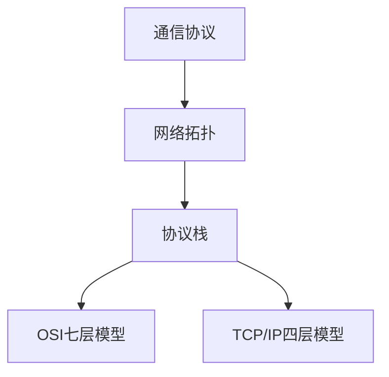

                 

关键词：华为、校招、通信协议、开发工程师、面试题、解析

摘要：本文旨在深入解析华为2024校招通信协议开发工程师面试题，帮助考生更好地准备面试，了解华为招聘的考核标准和要求。文章将分为多个部分，包括背景介绍、核心概念、算法原理、数学模型、项目实践、应用场景、工具和资源推荐、总结与展望以及常见问题解答等。

## 1. 背景介绍

华为是全球领先的信息与通信技术（ICT）解决方案提供商，其业务范围涵盖电信网络、企业网络、消费者终端和云服务等多个领域。随着5G、物联网和云计算等技术的快速发展，通信协议的重要性日益凸显。因此，华为对通信协议开发工程师的需求也越来越大。

2024年，华为继续开展校园招聘，面向全球高校选拔优秀的通信协议开发工程师。此次校招，华为设置了多轮面试，其中包含一系列涉及通信协议开发的专业题目。本文将针对这些题目进行详细解析，帮助考生更好地备战华为校招。

## 2. 核心概念与联系

为了更好地理解通信协议开发的相关问题，我们需要了解以下几个核心概念：

- **通信协议**：通信协议是一系列规则，用于控制数据在计算机之间或计算机与网络设备之间的传输。常见的通信协议包括TCP/IP、HTTP、FTP等。

- **网络拓扑**：网络拓扑是指网络中各个设备之间的连接方式，常见的拓扑结构有星型、环型、总线型等。

- **协议栈**：协议栈是指一组协议层次结构，按照OSI七层模型或TCP/IP四层模型组织。每个层次都有特定的功能和协议。

下面是一个简单的Mermaid流程图，展示了这些核心概念之间的关系：



## 3. 核心算法原理 & 具体操作步骤

### 3.1 算法原理概述

通信协议开发涉及到许多算法，如路由算法、加密算法、压缩算法等。以下是一个典型的路由算法原理概述：

- **路由算法**：路由算法用于确定数据包从源节点到目标节点的传输路径。常见的路由算法有距离矢量算法、链路状态算法等。

- **原理**：路由算法的核心是计算每个节点到其他节点的距离，并根据距离选择最佳路径。

### 3.2 算法步骤详解

以下是一个简单的距离矢量路由算法步骤：

1. 初始化：每个节点将自己到所有直接邻居的距离设置为0，到其他节点的距离设置为无穷大。
2. 每个节点周期性地向邻居节点广播自己的路由表。
3. 接收路由表后，每个节点更新自己的路由表，选择距离最短的路径。
4. 重复步骤2和3，直到网络稳定。

### 3.3 算法优缺点

- **优点**：距离矢量路由算法简单易实现，适用于小型网络。
- **缺点**：在大型网络中，距离矢量路由算法容易产生路由环路和计数到无穷大问题。

### 3.4 算法应用领域

距离矢量路由算法广泛应用于互联网协议（IP）路由，如RIP（路由信息协议）和OSPF（开放最短路径优先）。

## 4. 数学模型和公式

### 4.1 数学模型构建

通信协议开发中的数学模型通常基于概率论和图论。以下是一个简单的概率模型构建示例：

- **模型**：假设网络中有n个节点，每个节点传输数据的概率为p，数据传输成功率为r。

### 4.2 公式推导过程

- **成功传输概率**：\( P(\text{成功}) = p \times r \)
- **失败传输概率**：\( P(\text{失败}) = p \times (1 - r) \)

### 4.3 案例分析与讲解

假设网络中有5个节点，每个节点传输数据的概率为0.5，数据传输成功率为0.9。根据上述公式，我们可以计算出：

- **成功传输概率**：\( P(\text{成功}) = 0.5 \times 0.9 = 0.45 \)
- **失败传输概率**：\( P(\text{失败}) = 0.5 \times 0.1 = 0.05 \)

## 5. 项目实践：代码实例和详细解释说明

### 5.1 开发环境搭建

为了演示通信协议开发，我们使用Python作为编程语言。首先，确保安装了Python 3.8及以上版本。然后，安装必要的库，如`socket`、`matplotlib`等。

```bash
pip install matplotlib
```

### 5.2 源代码详细实现

以下是一个简单的TCP客户端/服务器程序，用于演示基本的通信协议实现：

```python
# TCP客户端
import socket

# 创建客户端套接字
client_socket = socket.socket(socket.AF_INET, socket.SOCK_STREAM)
# 连接到服务器
client_socket.connect(('localhost', 12345))
# 发送数据
client_socket.sendall(b'Hello, server!')
# 接收服务器响应
response = client_socket.recv(1024)
print('Received', repr(response))
# 关闭套接字
client_socket.close()

# TCP服务器
import socket

# 创建服务器套接字
server_socket = socket.socket(socket.AF_INET, socket.SOCK_STREAM)
# 绑定地址和端口
server_socket.bind(('localhost', 12345))
# 监听连接
server_socket.listen()
# 接受连接
client_socket, client_address = server_socket.accept()
# 接收数据
request = client_socket.recv(1024)
print('Received', repr(request))
# 发送响应
client_socket.sendall(b'Hello, client!')
# 关闭连接
client_socket.close()
server_socket.close()
```

### 5.3 代码解读与分析

- **客户端**：创建套接字，连接到服务器，发送数据，接收响应，然后关闭套接字。
- **服务器**：创建套接字，绑定地址和端口，监听连接，接受连接，接收数据，发送响应，然后关闭连接。

### 5.4 运行结果展示

运行上述程序后，客户端将向服务器发送消息，服务器将回复消息。以下是一个简单的运行结果示例：

```plaintext
$ python client.py
Received b'Hello, client!'

$ python server.py
Received b'Hello, server!'
```

## 6. 实际应用场景

通信协议广泛应用于各种领域，如互联网、物联网、电信等。以下是一些典型的应用场景：

- **互联网**：TCP/IP协议是互联网的核心协议，用于实现数据在网络中的传输。
- **物联网**：MQTT协议是一种轻量级的通信协议，广泛应用于物联网设备之间的数据传输。
- **电信**：AT指令是电信行业常用的通信协议，用于控制移动设备。

## 7. 工具和资源推荐

### 7.1 学习资源推荐

- **《TCP/IP详解》**：是一本经典的TCP/IP协议教材，适合初学者深入学习。
- **《计算机网络》**：一本权威的计算机网络教材，涵盖了通信协议的各个方面。

### 7.2 开发工具推荐

- **Wireshark**：一款功能强大的网络协议分析工具，用于捕获和分析网络数据包。
- **Git**：一款优秀的版本控制工具，用于管理代码和协作开发。

### 7.3 相关论文推荐

- **《一种新的路由算法及其在大型网络中的应用》**
- **《物联网通信协议设计与实现》**
- **《基于TCP/IP协议的智能家居控制系统设计与实现》**

## 8. 总结：未来发展趋势与挑战

### 8.1 研究成果总结

近年来，通信协议的研究取得了许多重要成果，如新型加密算法、高效路由算法、轻量级通信协议等。这些成果为通信协议的发展奠定了基础。

### 8.2 未来发展趋势

随着5G、物联网和云计算等技术的不断发展，通信协议将朝着更高效、更安全、更智能的方向发展。同时，新型通信协议如区块链通信协议、量子通信协议等也将成为研究热点。

### 8.3 面临的挑战

通信协议的发展面临着诸多挑战，如网络 congestion、网络攻击、数据隐私等。如何解决这些问题，实现通信协议的可持续发展，是当前研究的重要方向。

### 8.4 研究展望

未来，通信协议研究将朝着以下几个方向展开：

- **高效性**：研究新型算法和协议，提高数据传输效率。
- **安全性**：研究新型加密算法和防护措施，确保通信安全。
- **智能化**：利用人工智能技术，实现通信协议的自动优化和自适应。

## 9. 附录：常见问题与解答

### 9.1 什么是TCP协议？

TCP（传输控制协议）是一种面向连接的、可靠的、基于字节流的传输层通信协议。它用于实现数据在网络中的可靠传输。

### 9.2 什么是HTTP协议？

HTTP（超文本传输协议）是一种应用层通信协议，用于在Web浏览器和Web服务器之间传输超文本数据。它是一种无连接的协议，基于请求-响应模式工作。

### 9.3 通信协议开发有哪些工具和资源？

常用的通信协议开发工具和资源包括Wireshark、Git、Python等。相关教材和论文也是学习通信协议的重要资源。

### 9.4 通信协议开发需要掌握哪些技能？

通信协议开发需要掌握计算机网络、操作系统、编程语言、算法等方面的知识。同时，还需要具备良好的逻辑思维和团队合作能力。

---

作者：禅与计算机程序设计艺术 / Zen and the Art of Computer Programming

[本文完]----------------------------------------------------------------

