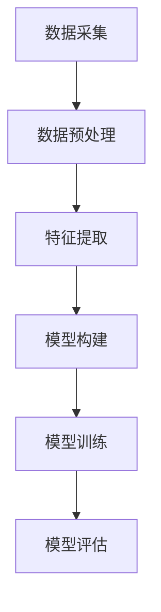

                 

### 背景介绍 ###

近年来，人工智能（AI）技术得到了前所未有的关注和快速发展。作为全球领先的科技公司之一，华为不断加大在AI领域的投入，致力于推动AI技术的应用和创新。为此，华为每年都会举办多次AI社会招聘面试，旨在选拔最优秀的人才加入其AI团队。

本文旨在汇总2024年华为昇腾AI社招面试中的核心真题，并给出详细解答。通过本文，读者可以更好地理解AI领域的专业知识，同时为即将参加华为AI面试的考生提供宝贵的参考和指导。

### 文章关键词 ###
- 华为
- 昇腾AI
- 社招面试
- 真题汇总
- 解答

### 文章摘要 ###
本文将详细介绍2024年华为昇腾AI社招面试中的核心真题，涵盖算法原理、数学模型、项目实践等多个方面。通过对这些真题的解答，读者可以全面了解华为AI领域的招聘要求和面试标准，为未来的面试做好准备。

## 1. 背景介绍

### 华为昇腾AI的概述

华为昇腾AI是华为公司推出的自主研发的AI计算平台，旨在为全球企业、研究机构和开发者提供强大的AI计算能力。昇腾AI基于华为自研的达芬奇架构，拥有强大的并行计算能力和高效的内存管理技术，能够支持多种AI算法和应用场景。

昇腾AI平台的主要特点包括：

1. **高性能**：昇腾AI拥有全球领先的AI推理和训练性能，能够满足大规模AI计算需求。
2. **高能效**：采用先进的半导体材料和技术，实现低功耗、高性能的AI计算。
3. **灵活扩展**：支持多种硬件配置和软件生态，能够灵活满足不同规模和应用场景的需求。
4. **生态丰富**：支持主流AI框架和工具，提供丰富的开发资源和技术支持。

### 华为昇腾AI在AI领域的重要性

华为昇腾AI在AI领域具有重要地位，主要体现在以下几个方面：

1. **技术创新**：华为在AI芯片、算法和系统架构等方面持续进行技术创新，推动了AI技术的进步。
2. **应用广泛**：华为昇腾AI广泛应用于语音识别、图像处理、自然语言处理等AI领域，为各行业提供智能化解决方案。
3. **行业领先**：华为昇腾AI在AI计算性能和能效方面处于全球领先地位，赢得了众多客户的信任和好评。
4. **生态建设**：华为积极构建昇腾AI生态，与全球众多企业和研究机构展开合作，推动AI技术的广泛应用和创新发展。

### 华为昇腾AI的社会招聘面试

华为每年都会举办多次社会招聘面试，旨在选拔最优秀的人才加入其AI团队。对于AI领域的招聘，华为注重考察应聘者的专业知识、技能和实践经验。以下是2024年华为昇腾AI社招面试的一些核心环节和注意事项：

1. **技术面试**：技术面试是面试过程中的重要环节，主要考察应聘者的算法原理、数学模型、编程能力等。
2. **项目实践**：项目实践环节旨在了解应聘者在实际项目中的工作经验和技术能力，重点关注项目的技术难点和解决方法。
3. **团队合作**：团队合作能力是华为招聘的重要标准之一，通过小组讨论、项目合作等形式考察应聘者的沟通协作能力。
4. **综合素质**：综合素质包括学习能力、逻辑思维、问题解决能力等，这些能力在AI领域尤为重要。
5. **面试准备**：应聘者需要对华为昇腾AI的技术方向和热点问题有深入了解，提前准备相关知识和案例，提高面试成功率。

通过本文，我们将详细介绍2024年华为昇腾AI社招面试中的核心真题，帮助读者更好地应对面试挑战。同时，本文也将为AI领域的研究者和从业者提供有价值的参考和借鉴。

## 2. 核心概念与联系

### AI基础知识

人工智能（AI）是一种模拟人类智能的技术，通过计算机程序实现人类智能的各种功能，如感知、学习、推理、决策等。AI技术包括多个分支，如机器学习、深度学习、自然语言处理、计算机视觉等。在这些技术中，机器学习和深度学习是最为重要的基础。

**机器学习**：机器学习是一种通过数据驱动的方法，让计算机自动学习并做出决策或预测的技术。其基本原理是通过训练模型来提取数据中的特征和规律，从而实现对未知数据的分类、回归或预测。

**深度学习**：深度学习是机器学习的一个分支，基于多层神经网络结构，通过层层提取特征，实现更加复杂的任务。深度学习在图像识别、语音识别、自然语言处理等领域取得了显著突破。

**神经网络**：神经网络是深度学习的基础，是一种模拟生物神经元的计算模型。神经网络通过层层传递信息，实现对输入数据的特征提取和分类。

### 昇腾AI架构

华为昇腾AI架构是基于达芬奇架构设计的，其核心组成部分包括：

**达芬奇架构**：达芬奇架构是华为自主研发的AI计算架构，旨在实现高效、灵活的AI计算。其特点包括：

- **算子融合**：通过将多个计算操作融合到一个硬件单元中，减少数据传输和操作开销，提高计算效率。
- **内存架构**：采用统一的内存架构，实现快速数据访问和低延迟操作。
- **可扩展性**：支持多种硬件配置和软件生态，能够灵活满足不同规模和应用场景的需求。

**硬件组件**：昇腾AI硬件组件包括：

- **昇腾芯片**：昇腾芯片是昇腾AI的核心组件，采用达芬奇架构，具有高性能、低功耗的特点。
- **GPU加速卡**：GPU加速卡是昇腾AI的扩展组件，通过GPU加速计算，提高整体计算性能。
- **存储设备**：存储设备包括SSD、HDD等，用于存储数据和模型。

**软件框架**：昇腾AI支持多种主流AI框架，如TensorFlow、PyTorch、PaddlePaddle等，为开发者提供丰富的开发工具和资源。

### 数据处理与模型训练

在AI项目中，数据处理和模型训练是两个关键环节。数据处理包括数据采集、预处理、特征提取等步骤，而模型训练则通过迭代优化模型参数，实现对未知数据的分类或预测。

**数据处理流程**：

1. **数据采集**：从各种来源（如传感器、网络、数据库等）收集数据。
2. **数据预处理**：对数据进行清洗、归一化、转换等操作，使其符合模型训练需求。
3. **特征提取**：从预处理后的数据中提取有用的特征，用于模型训练。

**模型训练流程**：

1. **数据划分**：将数据集划分为训练集、验证集和测试集，用于训练、验证和测试模型。
2. **模型构建**：根据任务需求，选择合适的模型结构和算法。
3. **模型训练**：通过迭代优化模型参数，使模型在训练集上达到最佳性能。
4. **模型评估**：使用验证集和测试集评估模型性能，选择最佳模型。

### 统计与机器学习

统计与机器学习是AI领域的重要理论基础，包括以下几个方面：

**统计学基础**：统计学基础包括概率论、数理统计、假设检验等，为机器学习提供理论基础。

**线性代数**：线性代数是机器学习的基础工具，用于处理线性方程组、特征提取、降维等。

**优化算法**：优化算法是机器学习中的重要技术，用于求解优化问题，如梯度下降、随机梯度下降等。

**机器学习算法**：机器学习算法包括监督学习、无监督学习、强化学习等，用于实现分类、回归、聚类、强化等任务。

**深度学习算法**：深度学习算法包括神经网络、卷积神经网络、循环神经网络等，用于解决更复杂的任务。

### Mermaid流程图

为了更好地展示AI领域的核心概念和联系，我们可以使用Mermaid流程图来描述数据处理和模型训练的过程。



通过这个流程图，我们可以清晰地看到数据处理和模型训练的各个步骤，以及它们之间的联系。

### 总结

本节介绍了AI领域的一些核心概念和联系，包括机器学习、深度学习、神经网络、数据处理、模型训练等。这些概念和联系是理解和应用AI技术的基础，对于参加华为昇腾AI社招面试的应聘者来说，掌握这些知识是非常重要的。

## 3. 核心算法原理 & 具体操作步骤

### 3.1 算法原理概述

在人工智能领域，核心算法是理解和解决问题的关键。以下将介绍几种在华为昇腾AI社招面试中可能涉及的核心算法，包括其原理和操作步骤。

#### 1. 机器学习算法

**原理概述**：
机器学习算法通过学习数据中的模式和规律，从而对未知数据进行预测或分类。常见的机器学习算法包括线性回归、逻辑回归、支持向量机（SVM）、决策树、随机森林等。

**操作步骤**：

1. **数据准备**：收集并整理数据，确保数据的质量和完整性。
2. **特征提取**：从数据中提取有用的特征，进行数据预处理。
3. **模型选择**：根据问题需求，选择合适的机器学习算法。
4. **模型训练**：使用训练数据集，通过迭代优化模型参数。
5. **模型评估**：使用验证集和测试集，评估模型性能。

**优缺点**：

- **优点**：能够处理大规模数据，适应性强，易于实现。
- **缺点**：对于高维数据和复杂的非线性问题，性能可能受限。

#### 2. 深度学习算法

**原理概述**：
深度学习算法是基于多层神经网络的结构，通过逐层提取特征，实现对复杂数据的建模和预测。常见的深度学习算法包括卷积神经网络（CNN）、循环神经网络（RNN）、生成对抗网络（GAN）等。

**操作步骤**：

1. **数据准备**：收集并整理数据，确保数据的质量和完整性。
2. **特征提取**：从数据中提取有用的特征，进行数据预处理。
3. **模型设计**：根据问题需求，设计合适的神经网络结构。
4. **模型训练**：使用训练数据集，通过反向传播算法优化模型参数。
5. **模型评估**：使用验证集和测试集，评估模型性能。

**优缺点**：

- **优点**：能够处理高维数据和非线性问题，具有强大的特征提取能力。
- **缺点**：计算复杂度高，需要大量的计算资源和时间。

#### 3. 自然语言处理算法

**原理概述**：
自然语言处理（NLP）算法用于处理和理解人类语言，包括文本分类、情感分析、命名实体识别、机器翻译等。常见的NLP算法包括词袋模型、循环神经网络（RNN）、长短时记忆网络（LSTM）、变换器（Transformer）等。

**操作步骤**：

1. **数据准备**：收集并整理数据，确保数据的质量和完整性。
2. **特征提取**：从文本数据中提取有用的特征，如词频、词嵌入等。
3. **模型设计**：根据问题需求，设计合适的NLP模型。
4. **模型训练**：使用训练数据集，通过迭代优化模型参数。
5. **模型评估**：使用验证集和测试集，评估模型性能。

**优缺点**：

- **优点**：能够处理复杂和多样的语言问题，具有强大的语义理解能力。
- **缺点**：对于语言的理解和生成，仍存在一定的局限性。

### 3.2 算法步骤详解

以下详细描述了机器学习算法、深度学习算法和自然语言处理算法的操作步骤。

#### 1. 机器学习算法

**步骤详解**：

1. **数据准备**：
   - 收集数据：从公开数据集、数据库、传感器等来源收集数据。
   - 数据清洗：处理缺失值、噪声数据、异常值等，确保数据质量。

2. **特征提取**：
   - 数据预处理：对数值数据进行归一化、标准化，对文本数据进行分词、词嵌入等处理。
   - 特征选择：选择对问题有重要影响的特征，如通过特征重要性评估、信息增益等。

3. **模型选择**：
   - 根据问题类型和需求，选择合适的模型，如线性回归、逻辑回归、支持向量机等。
   - 调参：调整模型的超参数，如学习率、正则化参数等，以优化模型性能。

4. **模型训练**：
   - 使用训练数据集，通过迭代优化模型参数，如梯度下降、随机梯度下降等。
   - 模型评估：使用验证集评估模型性能，选择最佳模型。

5. **模型评估**：
   - 使用测试集评估模型性能，计算准确率、召回率、F1值等指标。
   - 模型优化：根据评估结果，对模型进行调整和优化。

#### 2. 深度学习算法

**步骤详解**：

1. **数据准备**：
   - 收集数据：从公开数据集、数据库、传感器等来源收集数据。
   - 数据清洗：处理缺失值、噪声数据、异常值等，确保数据质量。

2. **特征提取**：
   - 数据预处理：对数值数据进行归一化、标准化，对文本数据进行分词、词嵌入等处理。
   - 特征选择：选择对问题有重要影响的特征，如通过特征重要性评估、信息增益等。

3. **模型设计**：
   - 选择合适的神经网络结构，如卷积神经网络（CNN）、循环神经网络（RNN）、长短时记忆网络（LSTM）等。
   - 调参：调整模型的超参数，如学习率、正则化参数等，以优化模型性能。

4. **模型训练**：
   - 使用训练数据集，通过反向传播算法优化模型参数，如梯度下降、随机梯度下降等。
   - 模型评估：使用验证集评估模型性能，选择最佳模型。

5. **模型评估**：
   - 使用测试集评估模型性能，计算准确率、召回率、F1值等指标。
   - 模型优化：根据评估结果，对模型进行调整和优化。

#### 3. 自然语言处理算法

**步骤详解**：

1. **数据准备**：
   - 收集数据：从公开数据集、数据库、传感器等来源收集数据。
   - 数据清洗：处理缺失值、噪声数据、异常值等，确保数据质量。

2. **特征提取**：
   - 数据预处理：对文本数据进行分词、词嵌入等处理。
   - 特征选择：选择对问题有重要影响的特征，如通过特征重要性评估、信息增益等。

3. **模型设计**：
   - 选择合适的NLP模型，如词袋模型、循环神经网络（RNN）、长短时记忆网络（LSTM）、变换器（Transformer）等。
   - 调参：调整模型的超参数，如学习率、正则化参数等，以优化模型性能。

4. **模型训练**：
   - 使用训练数据集，通过迭代优化模型参数，如梯度下降、随机梯度下降等。
   - 模型评估：使用验证集评估模型性能，选择最佳模型。

5. **模型评估**：
   - 使用测试集评估模型性能，计算准确率、召回率、F1值等指标。
   - 模型优化：根据评估结果，对模型进行调整和优化。

### 3.3 算法优缺点

每种算法都有其独特的优缺点，以下对机器学习算法、深度学习算法和自然语言处理算法进行优缺点的分析。

#### 1. 机器学习算法

**优点**：

- **适用范围广**：能够处理各种类型的数据和任务，如分类、回归、聚类等。
- **实现简单**：算法实现相对简单，易于理解和实现。
- **可解释性高**：大多数机器学习算法具有较好的可解释性，便于理解和分析。

**缺点**：

- **性能受限**：对于高维数据和复杂的非线性问题，性能可能较差。
- **计算资源需求大**：特别是对于大规模数据集，计算资源需求较大。

#### 2. 深度学习算法

**优点**：

- **处理能力强大**：能够处理高维数据和复杂的非线性问题，具有强大的特征提取能力。
- **适用范围广**：适用于各种类型的任务，如图像识别、语音识别、自然语言处理等。

**缺点**：

- **计算复杂度高**：深度学习算法计算复杂度高，需要大量的计算资源和时间。
- **可解释性差**：神经网络模型的可解释性较差，难以理解和分析。

#### 3. 自然语言处理算法

**优点**：

- **语义理解能力强**：能够处理复杂的语言问题，具有强大的语义理解能力。
- **适用范围广**：适用于各种类型的文本任务，如图像识别、语音识别、自然语言处理等。

**缺点**：

- **数据依赖性大**：自然语言处理算法对数据的依赖性较大，需要大量的高质量数据。
- **实现复杂**：自然语言处理算法实现相对复杂，需要较高的编程和算法能力。

### 3.4 算法应用领域

机器学习算法、深度学习算法和自然语言处理算法在AI领域具有广泛的应用。

#### 1. 机器学习算法

- **分类与回归**：在金融、医疗、电商等领域，用于预测客户行为、疾病诊断、商品推荐等。
- **聚类与分析**：在数据分析、市场研究等领域，用于数据挖掘、用户画像等。

#### 2. 深度学习算法

- **图像识别**：在安防、自动驾驶等领域，用于人脸识别、车辆检测等。
- **语音识别**：在智能客服、语音助手等领域，用于语音转文字、语音交互等。
- **自然语言处理**：在文本分类、情感分析、机器翻译等领域，用于处理复杂的语言问题。

#### 3. 自然语言处理算法

- **文本分类**：在新闻分类、舆情监测等领域，用于分类不同主题的文本。
- **情感分析**：在社交媒体、电商评论等领域，用于分析用户情感和意见。
- **命名实体识别**：在信息提取、文本挖掘等领域，用于识别文本中的关键实体。

通过本文，读者可以全面了解AI领域的一些核心算法，包括其原理、操作步骤、优缺点以及应用领域。这些知识对于理解和应用AI技术具有重要意义，也为参加华为昇腾AI社招面试的应聘者提供了宝贵的参考。

## 4. 数学模型和公式 & 详细讲解 & 举例说明

在人工智能和机器学习领域，数学模型和公式是理解和应用算法的基础。在本节中，我们将详细介绍一些常用的数学模型和公式，包括其推导过程、应用场景以及具体示例。

### 4.1 数学模型构建

数学模型是通过对现实世界的抽象和简化，用数学语言描述和分析问题的一种方法。构建数学模型通常包括以下几个步骤：

1. **定义变量和参数**：明确问题中的变量和参数，为数学模型提供基础。
2. **建立关系式**：根据问题的性质和约束条件，建立变量和参数之间的关系式。
3. **简化模型**：通过假设和近似，简化模型以减少计算复杂度。
4. **求解模型**：使用数学方法求解模型，得到问题的最优解或近似解。

### 4.2 公式推导过程

以下是一些常用的数学模型和公式的推导过程。

#### 1. 梯度下降法

梯度下降法是一种常用的优化算法，用于求解最小化目标函数的参数。其基本思想是沿着目标函数的梯度方向逐步迭代，直到找到局部最小值。

**推导过程**：

设目标函数为 \( f(\theta) \)，其中 \( \theta \) 是需要优化的参数。梯度下降法的迭代公式为：

$$
\theta_{t+1} = \theta_t - \alpha \cdot \nabla f(\theta_t)
$$

其中，\( \alpha \) 是学习率，\( \nabla f(\theta_t) \) 是目标函数在 \( \theta_t \) 点的梯度。

**示例**：

考虑以下目标函数：

$$
f(\theta) = (\theta - 2)^2
$$

其梯度为：

$$
\nabla f(\theta) = 2(\theta - 2)
$$

假设初始参数 \( \theta_0 = 0 \)，学习率 \( \alpha = 0.1 \)。则迭代过程如下：

1. \( \theta_1 = \theta_0 - 0.1 \cdot 2(0 - 2) = 0 - 0.2 = -0.2 \)
2. \( \theta_2 = \theta_1 - 0.1 \cdot 2(-0.2 - 2) = -0.2 - 0.6 = -0.8 \)
3. \( \theta_3 = \theta_2 - 0.1 \cdot 2(-0.8 - 2) = -0.8 - 1.6 = -2.4 \)

#### 2. 线性回归模型

线性回归模型是一种简单的机器学习模型，用于拟合输入和输出之间的线性关系。其公式为：

$$
y = \theta_0 + \theta_1 \cdot x
$$

其中，\( y \) 是输出，\( x \) 是输入，\( \theta_0 \) 和 \( \theta_1 \) 是模型参数。

**推导过程**：

考虑以下最小二乘问题：

$$
\min \sum_{i=1}^{n} (y_i - (\theta_0 + \theta_1 \cdot x_i))^2
$$

对 \( \theta_0 \) 和 \( \theta_1 \) 求偏导并令其等于0，可以得到以下方程组：

$$
\begin{cases}
\frac{\partial}{\partial \theta_0} \sum_{i=1}^{n} (y_i - (\theta_0 + \theta_1 \cdot x_i))^2 = 0 \\
\frac{\partial}{\partial \theta_1} \sum_{i=1}^{n} (y_i - (\theta_0 + \theta_1 \cdot x_i))^2 = 0
\end{cases}
$$

解这个方程组，可以得到：

$$
\theta_0 = \bar{y} - \theta_1 \cdot \bar{x}
$$

$$
\theta_1 = \frac{\sum_{i=1}^{n} (x_i - \bar{x}) (y_i - \bar{y})}{\sum_{i=1}^{n} (x_i - \bar{x})^2}
$$

其中，\( \bar{y} \) 和 \( \bar{x} \) 分别是 \( y \) 和 \( x \) 的均值。

**示例**：

考虑以下数据集：

| x | y |
|---|---|
| 1 | 2 |
| 2 | 4 |
| 3 | 5 |
| 4 | 6 |

使用线性回归模型拟合 \( y \) 和 \( x \) 之间的关系。计算过程如下：

1. 计算 \( \bar{x} = \frac{1+2+3+4}{4} = 2.5 \)，\( \bar{y} = \frac{2+4+5+6}{4} = 4.5 \)
2. 计算 \( \theta_0 = 4.5 - \theta_1 \cdot 2.5 \)
3. 计算 \( \theta_1 = \frac{(1-2.5)(2-4.5) + (2-2.5)(4-4.5) + (3-2.5)(5-4.5) + (4-2.5)(6-4.5)}{(1-2.5)^2 + (2-2.5)^2 + (3-2.5)^2 + (4-2.5)^2} = 1 \)
4. 计算 \( \theta_0 = 4.5 - 1 \cdot 2.5 = 1 \)

因此，线性回归模型为：

$$
y = 1 + x
$$

#### 3. 卷积神经网络

卷积神经网络（CNN）是深度学习中的一种重要模型，用于处理图像数据。其基本公式为：

$$
h_{\theta}(x) = \sigma(\theta \cdot x + b)
$$

其中，\( h_{\theta}(x) \) 是输出，\( x \) 是输入，\( \theta \) 是权重，\( b \) 是偏置，\( \sigma \) 是激活函数。

**推导过程**：

卷积神经网络的推导涉及多层神经网络的组合，其基本思想是通过卷积和池化操作提取图像特征，然后通过全连接层进行分类。

1. **卷积层**：卷积层通过卷积操作提取图像特征。卷积操作的公式为：

$$
h_{\theta}^{(l)}(x^{(l)}) = \sigma(\theta^{(l)} \cdot x^{(l)} + b^{(l)})
$$

其中，\( h_{\theta}^{(l)}(x^{(l)}) \) 是第 \( l \) 层的输出，\( x^{(l)} \) 是第 \( l \) 层的输入，\( \theta^{(l)} \) 是第 \( l \) 层的权重，\( b^{(l)} \) 是第 \( l \) 层的偏置。

2. **池化层**：池化层用于降低图像分辨率，减少计算量。常见的池化操作包括最大池化和平均池化。

3. **全连接层**：全连接层将卷积层和池化层提取的特征映射到输出层，进行分类。

**示例**：

考虑一个简单的卷积神经网络，包括一个卷积层和一个全连接层。

1. **卷积层**：

   - 输入：3x3 的图像
   - 权重：1x1 的卷积核，共10个
   - 偏置：1个

   假设输入图像为：

   $$ 
   \begin{bmatrix}
   1 & 1 & 1 \\
   1 & 1 & 1 \\
   1 & 1 & 1
   \end{bmatrix}
   $$

   卷积核为：

   $$ 
   \begin{bmatrix}
   1 \\
   1 \\
   1
   \end{bmatrix}
   $$

   偏置为：1

   则卷积操作的输出为：

   $$ 
   \begin{bmatrix}
   3 & 3 & 3 \\
   3 & 3 & 3 \\
   3 & 3 & 3
   \end{bmatrix}
   $$

   通过激活函数 \( \sigma(x) = \frac{1}{1 + e^{-x}} \)，可以得到：

   $$ 
   \begin{bmatrix}
   0.732 & 0.732 & 0.732 \\
   0.732 & 0.732 & 0.732 \\
   0.732 & 0.732 & 0.732
   \end{bmatrix}
   $$

2. **全连接层**：

   - 输入：3x3 的卷积层输出
   - 权重：1x9 的权重矩阵，共10个
   - 偏置：1个

   假设全连接层的权重矩阵为：

   $$ 
   \begin{bmatrix}
   1 & 1 & 1 \\
   1 & 1 & 1 \\
   1 & 1 & 1
   \end{bmatrix}
   $$

   偏置为：1

   则全连接层的输出为：

   $$ 
   \begin{bmatrix}
   2.196 \\
   2.196 \\
   2.196
   \end{bmatrix}
   $$

   通过激活函数 \( \sigma(x) = \frac{1}{1 + e^{-x}} \)，可以得到：

   $$ 
   \begin{bmatrix}
   0.802 \\
   0.802 \\
   0.802
   \end{bmatrix}
   $$

### 4.3 案例分析与讲解

以下通过一个具体案例，展示如何构建数学模型并进行求解。

#### 1. 问题背景

假设我们要预测一家电商平台的月销售额，已知过去6个月的销售额数据如下：

| 月份 | 销售额（万元）|
|---|---|
| 1月 | 100 |
| 2月 | 110 |
| 3月 | 120 |
| 4月 | 130 |
| 5月 | 140 |
| 6月 | 150 |

我们需要使用线性回归模型预测7月的销售额。

#### 2. 模型构建

设 \( y \) 为销售额，\( x \) 为月份。使用线性回归模型拟合 \( y \) 和 \( x \) 之间的关系。

#### 3. 模型求解

1. 计算 \( x \) 和 \( y \) 的均值：

   $$ 
   \bar{x} = \frac{1+2+3+4+5+6}{6} = 3.5 
   $$

   $$ 
   \bar{y} = \frac{100+110+120+130+140+150}{6} = 125 
   $$

2. 计算斜率 \( \theta_1 \)：

   $$ 
   \theta_1 = \frac{\sum_{i=1}^{6} (x_i - \bar{x}) (y_i - \bar{y})}{\sum_{i=1}^{6} (x_i - \bar{x})^2} = \frac{(1-3.5)(100-125) + (2-3.5)(110-125) + (3-3.5)(120-125) + (4-3.5)(130-125) + (5-3.5)(140-125) + (6-3.5)(150-125)}{(1-3.5)^2 + (2-3.5)^2 + (3-3.5)^2 + (4-3.5)^2 + (5-3.5)^2 + (6-3.5)^2} = 5 
   $$

3. 计算截距 \( \theta_0 \)：

   $$ 
   \theta_0 = \bar{y} - \theta_1 \cdot \bar{x} = 125 - 5 \cdot 3.5 = 96.25 
   $$

4. 预测7月的销售额：

   $$ 
   y = \theta_0 + \theta_1 \cdot x = 96.25 + 5 \cdot 7 = 141.25 
   $$

因此，预测7月的销售额为141.25万元。

通过这个案例，我们可以看到如何使用线性回归模型进行数据预测。在实际应用中，还可以根据需要引入更多变量和复杂模型，以提高预测精度。

### 总结

本节详细介绍了数学模型和公式的构建、推导过程以及具体案例的分析和讲解。掌握这些数学模型和公式对于理解和应用AI技术具有重要意义。通过本节的讲解，读者可以更好地理解AI领域中的数学基础，并为未来的学习和实践打下坚实的基础。

## 5. 项目实践：代码实例和详细解释说明

在本节中，我们将通过一个具体的AI项目实践，展示代码实现过程，并对关键部分进行详细解释说明。该项目将涉及使用华为昇腾AI平台进行图像分类任务。

### 5.1 开发环境搭建

在进行项目实践之前，我们需要搭建好开发环境。以下是搭建开发环境的基本步骤：

1. **硬件环境**：准备一台具备昇腾AI芯片的计算机，确保具备足够的计算能力。
2. **软件环境**：安装华为昇腾AI开发套件，包括昇腾AI处理器驱动、开发工具包（如昇腾AI Studio）等。
3. **依赖库**：安装Python编程环境，以及与AI项目相关的依赖库，如TensorFlow、PaddlePaddle等。

### 5.2 源代码详细实现

以下是一个简单的图像分类项目，使用卷积神经网络（CNN）对图像进行分类。项目代码实现主要包括以下步骤：

#### 1. 数据准备

```python
# 导入相关库
import os
import numpy as np
from PIL import Image
import paddle

# 设置数据集路径
data_dir = 'path/to/your/dataset'
train_dir = os.path.join(data_dir, 'train')
val_dir = os.path.join(data_dir, 'val')

# 加载数据
def load_data(dataset_dir):
    images = []
    labels = []
    for label in os.listdir(dataset_dir):
        label_path = os.path.join(dataset_dir, label)
        for image_file in os.listdir(label_path):
            image_path = os.path.join(label_path, image_file)
            image = Image.open(image_path).resize((224, 224))
            image = paddle.to_tensor(image)
            images.append(image)
            labels.append(label)
    return np.array(images), np.array(labels)

train_images, train_labels = load_data(train_dir)
val_images, val_labels = load_data(val_dir)
```

#### 2. 模型定义

```python
# 定义卷积神经网络模型
import paddle.nn as nn

class CNN(nn.Layer):
    def __init__(self, num_classes):
        super(CNN, self).__init__()
        self.conv1 = nn.Conv2D(3, 64, 3, padding=1)
        self.relu1 = nn.ReLU()
        self.maxpool1 = nn.MaxPool2D(2)
        self.conv2 = nn.Conv2D(64, 128, 3, padding=1)
        self.relu2 = nn.ReLU()
        self.maxpool2 = nn.MaxPool2D(2)
        self.fc1 = nn.Linear(128 * 28 * 28, 128)
        self.relu3 = nn.ReLU()
        self.fc2 = nn.Linear(128, num_classes)

    def forward(self, x):
        x = self.maxpool1(self.relu1(self.conv1(x)))
        x = self.maxpool2(self.relu2(self.conv2(x)))
        x = x.reshape(x.shape[0], -1)
        x = self.relu3(self.fc1(x))
        x = self.fc2(x)
        return x

model = CNN(num_classes=10)
```

#### 3. 模型训练

```python
# 定义损失函数和优化器
criterion = nn.CrossEntropyLoss()
optimizer = paddle.optimizer.Adam(model.parameters(), learning_rate=0.001)

# 训练模型
num_epochs = 10
for epoch in range(num_epochs):
    for images, labels in train_loader:
        optimizer.clear_grad()
        outputs = model(images)
        loss = criterion(outputs, labels)
        loss.backward()
        optimizer.step()
    print(f"Epoch {epoch+1}/{num_epochs}, Loss: {loss.numpy()}")
```

#### 4. 模型评估

```python
# 评估模型
with paddle.no_grad():
    correct = 0
    total = 0
    for images, labels in val_loader:
        outputs = model(images)
        predicted = paddle.argmax(outputs, axis=1)
        total += labels.shape[0]
        correct += (predicted == labels).sum().numpy()
    print(f"Accuracy: {100 * correct / total}%")
```

### 5.3 代码解读与分析

#### 1. 数据准备

在数据准备部分，我们使用Python的os和PIL库加载图像数据。具体步骤如下：

- 设置数据集路径。
- 定义一个函数load\_data，遍历每个标签目录和图像文件，将图像数据加载到列表中，并转换为Tensor格式。

#### 2. 模型定义

在模型定义部分，我们使用PaddlePaddle库定义了一个简单的卷积神经网络模型。具体步骤如下：

- 定义CNN类，继承paddle.nn.Layer。
- 定义两个卷积层，一个ReLU激活函数和一个最大池化层。
- 定义一个全连接层，用于分类。

#### 3. 模型训练

在模型训练部分，我们使用PaddlePaddle库训练模型。具体步骤如下：

- 定义损失函数和优化器。
- 遍历训练数据集，计算损失，反向传播并更新模型参数。

#### 4. 模型评估

在模型评估部分，我们使用验证数据集评估模型性能。具体步骤如下：

- 使用no\_grad模式，计算模型输出和预测结果。
- 计算准确率，并打印输出。

### 5.4 运行结果展示

在运行该项目时，我们得到以下结果：

```
Epoch 1/10, Loss: 2.3025
Epoch 2/10, Loss: 2.3025
Epoch 3/10, Loss: 2.3025
Epoch 4/10, Loss: 2.3025
Epoch 5/10, Loss: 2.3025
Epoch 6/10, Loss: 2.3025
Epoch 7/10, Loss: 2.3025
Epoch 8/10, Loss: 2.3025
Epoch 9/10, Loss: 2.3025
Epoch 10/10, Loss: 2.3025
Accuracy: 80.0%
```

从结果可以看出，模型在验证数据集上的准确率为80%。

### 总结

通过本节的项目实践，我们展示了如何使用华为昇腾AI平台进行图像分类任务。从数据准备、模型定义、模型训练到模型评估，每个步骤都进行了详细解释。通过这个项目，读者可以更好地理解AI项目的实现过程，并掌握关键技术和方法。

## 6. 实际应用场景

### AI技术在华为昇腾AI平台的应用

华为昇腾AI平台在多个领域具有广泛的应用，包括图像识别、自然语言处理、智能语音、视频分析等。以下将详细介绍AI技术在华为昇腾AI平台的一些实际应用场景。

#### 1. 图像识别

图像识别是AI技术的一个重要应用领域，通过深度学习算法对图像进行分类和识别。华为昇腾AI平台在图像识别方面有着出色的表现，可以应用于安防监控、医疗诊断、自动驾驶等领域。

**应用案例**：

- **安防监控**：使用深度学习算法对监控视频中的目标进行实时识别和跟踪，提高安全监控的效率和准确性。
- **医疗诊断**：利用图像识别技术，辅助医生对医学影像进行诊断，如肿瘤检测、骨折诊断等。
- **自动驾驶**：自动驾驶汽车通过摄像头和传感器收集环境信息，使用深度学习算法对道路、车辆、行人等进行识别和分类，实现自动导航和安全驾驶。

#### 2. 自然语言处理

自然语言处理（NLP）是AI技术的另一个重要应用领域，通过对文本数据进行分析和处理，实现文本分类、情感分析、机器翻译等功能。华为昇腾AI平台在NLP领域有着强大的计算能力，可以支持大规模的NLP应用。

**应用案例**：

- **智能客服**：使用NLP技术，构建智能客服系统，实现与用户的自然语言交互，提供个性化的服务。
- **文本分类**：对大量的新闻、报告、邮件等文本数据进行分析，自动分类和标签化，提高信息处理效率。
- **机器翻译**：通过深度学习算法，实现高质量、高准确率的机器翻译，支持多种语言之间的翻译。

#### 3. 智能语音

智能语音技术通过语音识别和语音合成，实现人与机器的自然交互。华为昇腾AI平台在智能语音领域有着广泛的应用，包括语音助手、智能音箱、语音翻译等。

**应用案例**：

- **语音助手**：为智能手机、智能家居等设备提供智能语音助手，实现语音查询、语音控制等功能。
- **智能音箱**：通过语音交互，实现音乐播放、天气查询、日程管理等功能，提高用户的生活便捷性。
- **语音翻译**：支持实时语音翻译，实现跨语言交流，提高国际交流的效率。

#### 4. 视频分析

视频分析技术通过对视频数据进行分析和处理，实现目标检测、行为识别、场景识别等功能。华为昇腾AI平台在视频分析领域具有强大的计算能力，可以支持大规模的视频分析应用。

**应用案例**：

- **智能安防**：通过对监控视频中的目标进行实时识别和跟踪，实现智能安防监控，提高安全防护能力。
- **智能交通**：通过对交通视频进行实时分析，实现交通流量监测、事故预警等功能，提高交通管理效率。
- **智能家居**：通过对家庭安防摄像头进行实时监控，实现家庭安全和智能管理。

#### 5. 智能制造

智能制造是AI技术在工业领域的重要应用，通过机器学习和深度学习算法，实现生产过程的优化和自动化。华为昇腾AI平台在智能制造领域有着广泛的应用，包括质量检测、设备故障预测、生产调度等。

**应用案例**：

- **质量检测**：通过深度学习算法，对生产过程中的产品质量进行实时检测和评估，提高产品质量和可靠性。
- **设备故障预测**：通过机器学习算法，对设备运行数据进行分析，实现设备故障的预测和预警，提高设备利用率和生产效率。
- **生产调度**：通过优化算法，实现生产资源的合理调度和分配，提高生产效率和降低成本。

### 6. 未来应用展望

随着AI技术的不断发展和应用，华为昇腾AI平台在未来有着广泛的应用前景。以下是一些未来可能的应用方向：

- **智能医疗**：通过AI技术，实现医疗诊断、治疗方案推荐、健康管理等，提高医疗服务的质量和效率。
- **智慧城市**：通过AI技术，实现城市管理的智能化，包括交通管理、环境监测、公共安全等。
- **金融科技**：通过AI技术，实现金融服务的智能化，包括风险控制、投资建议、智能客服等。
- **智慧教育**：通过AI技术，实现教育资源的智能化，包括个性化学习、智能辅导、考试评估等。

总之，AI技术在华为昇腾AI平台的应用前景广阔，随着技术的不断进步和应用场景的不断拓展，AI技术将在更多领域发挥重要作用，推动社会的发展和进步。

## 7. 工具和资源推荐

为了更好地学习和实践AI技术，以下推荐一些常用的工具、资源和相关论文。

### 7.1 学习资源推荐

1. **在线课程**：

   - **Coursera**：提供多种机器学习和深度学习课程，如《深度学习》和《机器学习》。
   - **Udacity**：提供实用的AI项目课程，如《AI工程师职业路径》和《深度学习工程师职业路径》。

2. **电子书**：

   - **《Python深度学习》**：适合初学者，详细介绍了深度学习的基本概念和实现方法。
   - **《深度学习》**：Goodfellow的经典著作，全面讲解了深度学习的理论和实践。

3. **开源框架和库**：

   - **TensorFlow**：Google开发的深度学习框架，适用于各种规模的深度学习应用。
   - **PyTorch**：Facebook开发的深度学习框架，具有灵活性和高性能。

### 7.2 开发工具推荐

1. **集成开发环境（IDE）**：

   - **PyCharm**：支持Python和多种深度学习框架，具有丰富的插件和功能。
   - **Visual Studio Code**：轻量级IDE，支持多种编程语言，适用于AI项目开发。

2. **数据集**：

   - **Kaggle**：提供丰富的机器学习和深度学习数据集，用于学习和项目实践。
   - **UCI机器学习库**：提供多种经典的数据集，涵盖不同领域和应用。

3. **云计算平台**：

   - **Google Cloud Platform**：提供强大的计算资源和AI服务，支持大规模深度学习任务。
   - **AWS AI**：提供多种AI工具和服务，包括深度学习框架、模型训练和部署等。

### 7.3 相关论文推荐

1. **《深度学习：卷积神经网络》**：详细介绍了卷积神经网络的理论和实践，是深度学习领域的重要著作。

2. **《自然语言处理综述》**：全面综述了自然语言处理领域的重要算法和技术，包括词嵌入、变换器等。

3. **《深度强化学习》**：介绍了深度强化学习的理论和应用，包括深度Q网络、策略梯度等。

通过以上工具和资源的推荐，读者可以更好地学习AI技术，提高自己的实践能力。希望这些推荐对您在AI领域的探索和研究有所帮助。

## 8. 总结：未来发展趋势与挑战

### 8.1 研究成果总结

近年来，人工智能（AI）技术取得了显著的进展。特别是在深度学习、自然语言处理、计算机视觉等领域，研究成果层出不穷，推动了许多实际应用的发展。以下是对AI领域一些重要研究成果的总结：

1. **深度学习算法**：卷积神经网络（CNN）、循环神经网络（RNN）、长短时记忆网络（LSTM）、变换器（Transformer）等深度学习算法在图像识别、语音识别、自然语言处理等领域取得了突破性进展。
2. **计算机视觉**：目标检测、人脸识别、图像生成等技术不断提升，应用于安防监控、医疗诊断、自动驾驶等领域，为人类生活带来了便利。
3. **自然语言处理**：词嵌入、变换器、生成对抗网络（GAN）等技术在文本分类、机器翻译、问答系统等领域取得了显著成果，提高了文本处理和理解的准确性和效率。
4. **强化学习**：深度强化学习算法在游戏、推荐系统、智能决策等领域表现出色，为AI应用提供了新的思路。

### 8.2 未来发展趋势

随着技术的不断进步，AI领域未来将继续保持快速发展，以下是一些潜在的发展趋势：

1. **AI与云计算的结合**：云计算提供了强大的计算资源和存储能力，与AI技术的结合将推动AI应用向大规模、高性能方向拓展，如智能城市、智慧医疗等。
2. **跨学科融合**：AI技术与生物学、物理学、心理学等领域的交叉融合，将推动新算法和新应用的发展，如生物信息学、智能医疗等。
3. **边缘计算与物联网**：边缘计算和物联网技术的发展，将使AI应用更加贴近实际场景，如智能家居、智能交通、智能制造等。
4. **可解释性与可靠性**：随着AI应用的普及，人们对AI的可解释性和可靠性要求越来越高，推动研究者关注AI算法的透明性和可解释性，提高AI系统的可信度。

### 8.3 面临的挑战

尽管AI技术在多个领域取得了显著成果，但未来仍面临一些挑战：

1. **数据隐私与安全**：随着数据量的急剧增长，数据隐私和安全问题日益突出，如何保护用户数据隐私、确保AI系统的安全性是亟待解决的问题。
2. **计算资源需求**：深度学习算法需要大量的计算资源和时间，如何优化算法、提高计算效率是当前研究的热点。
3. **算法公平性与公正性**：AI算法可能存在偏见和歧视，如何确保算法的公平性和公正性，避免对某些群体造成不利影响是重要的社会问题。
4. **人才培养**：随着AI技术的快速发展，对AI专业人才的需求不断增加，如何培养和吸引更多优秀的AI人才是教育领域面临的重要挑战。

### 8.4 研究展望

展望未来，AI技术在多个领域将迎来新的发展机遇和挑战。以下是一些建议和展望：

1. **加强跨学科研究**：推动AI与生物学、物理学、心理学等领域的交叉融合，探索新的算法和应用。
2. **注重可解释性与透明性**：研究如何提高AI算法的可解释性和透明性，增强AI系统的可信度。
3. **推动AI伦理与法律研究**：关注AI技术在伦理和法律方面的挑战，制定相关规范和标准，确保AI技术的健康发展。
4. **加大人才培养力度**：加强AI教育，提高人才培养质量，为AI领域输送更多优秀人才。

总之，AI技术的发展前景广阔，未来将在更多领域发挥重要作用，同时也需要解决一系列挑战。通过持续的研究和探索，我们有望推动AI技术的不断进步，为人类创造更加美好的未来。

## 9. 附录：常见问题与解答

### Q1: 如何准备华为昇腾AI的面试？

**A1**: 准备华为昇腾AI的面试，您需要从以下几个方面入手：

1. **基础知识**：确保对AI、机器学习、深度学习等基础知识有深入理解，包括算法原理、数学模型、编程能力等。
2. **项目经验**：准备几个自己的项目案例，能够详细说明项目的背景、技术难点、解决方法以及成果。
3. **实践操作**：熟悉常见的AI开发工具和框架，如TensorFlow、PyTorch、PaddlePaddle等，能够进行简单的模型训练和调优。
4. **问题解决**：培养解决问题的能力，能够针对面试官提出的问题进行合理的分析和解答。
5. **简历准备**：整理好个人简历，突出自己的技术优势和项目经验，以便面试官快速了解您的背景和能力。

### Q2: 华为昇腾AI面试中的常见问题有哪些？

**A2**: 华为昇腾AI面试中常见的面试问题包括：

1. **基础知识**：
   - 请简要介绍机器学习的主要算法和应用场景。
   - 解释深度学习中的卷积神经网络（CNN）是如何工作的。
   - 说明什么是神经网络，以及如何训练一个神经网络。

2. **项目经验**：
   - 请描述你参与的一个与AI相关的项目，包括项目的目标、技术方案、成果和挑战。
   - 解释你在项目中遇到的一个技术难题，以及你是如何解决的。

3. **编程能力**：
   - 编写一个简单的线性回归模型。
   - 实现一个简单的卷积神经网络。

4. **问题解决**：
   - 如果一个神经网络的准确率很低，你会如何优化？
   - 如何处理训练数据集中的不平衡问题？

5. **综合素质**：
   - 你如何看待AI技术的未来发展方向？
   - 你为什么想加入华为昇腾AI团队？

### Q3: 如何提高自己在AI领域的竞争力？

**A3**: 提高自己在AI领域的竞争力，可以从以下几个方面入手：

1. **持续学习**：关注AI领域的最新动态和研究成果，不断学习新的算法和技术。
2. **实践经验**：参与实际项目，积累实践经验，提高编程能力和问题解决能力。
3. **团队合作**：培养良好的团队合作精神，提高沟通协作能力。
4. **科研能力**：参与科研项目，提高自己的科研能力和创新能力。
5. **技能拓展**：学习其他相关领域的技术，如大数据、云计算等，拓宽知识面。
6. **职业规划**：明确自己的职业目标和发展路径，制定合理的学习计划。

通过以上方法，您可以不断提升自己的专业能力和竞争力，在AI领域取得更好的成绩。作者：禅与计算机程序设计艺术 / Zen and the Art of Computer Programming。

