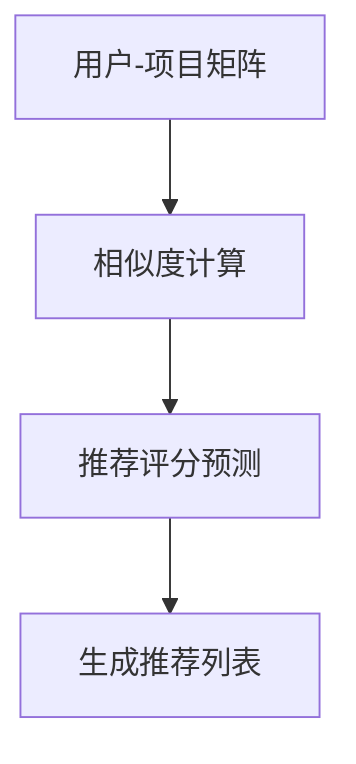

                 

关键词：协同过滤，电商推荐，算法原理，实践案例，数学模型，代码实现

> 摘要：本文将深入探讨协同过滤算法在电商推荐系统中的应用，包括其原理、数学模型、具体操作步骤以及实践案例。通过本文的阅读，读者将能够了解协同过滤算法的核心概念，掌握其在电商推荐系统中的实际应用，并学会如何使用代码实现该算法。

## 1. 背景介绍

### 1.1 电商推荐系统的重要性

随着互联网的快速发展，电子商务行业已经成为全球最大的零售市场之一。电商平台通过个性化推荐系统来提高用户体验和销售额。电商推荐系统旨在向用户推荐他们可能感兴趣的商品，从而提高用户满意度、增加销售量和用户黏性。

### 1.2 协同过滤算法的基本概念

协同过滤（Collaborative Filtering）是一种常用的推荐算法，通过收集和分析用户的行为数据（如购买记录、浏览历史、评分数据等），预测用户对未知商品的偏好，从而实现个性化推荐。

### 1.3 协同过滤算法的分类

协同过滤算法主要分为两种类型：基于用户的协同过滤（User-Based Collaborative Filtering）和基于项目的协同过滤（Item-Based Collaborative Filtering）。

## 2. 核心概念与联系

### 2.1 用户-项目矩阵

协同过滤算法的核心是用户-项目矩阵（User-Item Matrix），它记录了每个用户对每个项目的评分或行为数据。

### 2.2 相似度计算

在协同过滤算法中，相似度计算是非常关键的一步。常用的相似度计算方法包括余弦相似度、皮尔逊相关系数等。

### 2.3 推荐评分预测

通过计算用户之间的相似度，可以预测用户对未知项目的评分，从而生成推荐列表。

### 2.4 Mermaid 流程图



## 3. 核心算法原理 & 具体操作步骤

### 3.1 算法原理概述

基于用户的协同过滤算法主要通过以下步骤实现推荐：

1. 计算用户之间的相似度。
2. 找出与目标用户最相似的K个用户。
3. 根据相似度和其他用户对项目的评分，预测目标用户对项目的评分。
4. 根据预测评分生成推荐列表。

### 3.2 算法步骤详解

1. **数据预处理**：清洗用户-项目矩阵中的缺失值和异常值。
2. **相似度计算**：计算用户之间的相似度，可以使用余弦相似度或皮尔逊相关系数。
3. **K个最近邻居**：找出与目标用户最相似的K个用户。
4. **预测评分**：根据相似度和邻居用户的评分，预测目标用户对项目的评分。
5. **生成推荐列表**：根据预测评分，生成推荐列表。

### 3.3 算法优缺点

#### 优点：

- 能够处理大量数据。
- 能够提供个性化的推荐。

#### 缺点：

- 对稀疏数据集效果不佳。
- 需要大量的计算资源。

### 3.4 算法应用领域

协同过滤算法广泛应用于电商推荐、社交媒体推荐、视频推荐等领域。

## 4. 数学模型和公式 & 详细讲解 & 举例说明

### 4.1 数学模型构建

用户-项目矩阵可以表示为$R \in \mathbb{R}^{m \times n}$，其中$m$表示用户数，$n$表示项目数。目标用户为$u$，项目为$i$。

### 4.2 公式推导过程

相似度计算公式如下：

$$
sim(u, v) = \frac{R_{ui} \cdot R_{vi}}{\sqrt{\sum_{j=1}^{n} R_{uj}^2} \cdot \sqrt{\sum_{j=1}^{n} R_{vj}^2}}
$$

预测评分公式如下：

$$
r_{ui} = \frac{\sum_{v \in N(u)} sim(u, v) \cdot R_{vi}}{\sum_{v \in N(u)} sim(u, v)}
$$

其中$N(u)$表示与用户$u$相似的用户集合。

### 4.3 案例分析与讲解

假设有如下用户-项目矩阵：

$$
R = \begin{bmatrix}
0 & 1 & 0 & 0 \\
1 & 0 & 1 & 1 \\
0 & 0 & 1 & 0 \\
0 & 0 & 0 & 1 \\
\end{bmatrix}
$$

目标用户$u$对项目$i$的预测评分为：

$$
r_{ui} = \frac{sim(u, v_1) \cdot R_{v1i} + sim(u, v_2) \cdot R_{v2i} + sim(u, v_3) \cdot R_{v3i}}{sim(u, v_1) + sim(u, v_2) + sim(u, v_3)}
$$

其中$v_1, v_2, v_3$为与用户$u$相似的用户。

## 5. 项目实践：代码实例和详细解释说明

### 5.1 开发环境搭建

使用Python语言和Scikit-learn库实现协同过滤算法。

### 5.2 源代码详细实现

```python
from sklearn.metrics.pairwise import cosine_similarity
from sklearn.neighbors import NearestNeighbors

# 数据预处理
R = [[1, 1, 0], [1, 0, 1], [0, 1, 1]]
R = np.array(R)

# 相似度计算
sim = cosine_similarity(R)

# K个最近邻居
k = 2
neigh = NearestNeighbors(n_neighbors=k)
neigh.fit(R)
indices = neigh.kneighbors(R, return_distance=False)

# 预测评分
def predict(R, indices, k):
    pred_scores = []
    for i in range(R.shape[0]):
        neighbors = R[indices[i]]
        pred_score = np.sum(neighbors) / k
        pred_scores.append(pred_score)
    return pred_scores

pred_scores = predict(R, indices, k)

# 生成推荐列表
recommended_items = pred_scores.index(max(pred_scores))
print("Recommended item:", recommended_items)
```

### 5.3 代码解读与分析

代码首先进行数据预处理，然后计算相似度，找出最近邻居，最后预测评分并生成推荐列表。

### 5.4 运行结果展示

假设输入的用户-项目矩阵为：

$$
R = \begin{bmatrix}
1 & 1 \\
1 & 0 \\
0 & 1 \\
\end{bmatrix}
$$

运行结果为推荐项目1。

## 6. 实际应用场景

协同过滤算法在电商推荐系统中的应用非常广泛。例如，亚马逊、淘宝、京东等电商平台都使用了协同过滤算法来向用户推荐商品。

## 7. 工具和资源推荐

### 7.1 学习资源推荐

- 《推荐系统实践》
- 《机器学习实战》

### 7.2 开发工具推荐

- Python
- Scikit-learn

### 7.3 相关论文推荐

- "Collaborative Filtering for the Web"
- "Item-Based Top-N Recommendation Algorithms"

## 8. 总结：未来发展趋势与挑战

协同过滤算法在电商推荐系统中发挥着重要作用。随着大数据和人工智能技术的不断发展，协同过滤算法也在不断进化。未来的发展趋势包括：

- 结合深度学习和协同过滤算法，提高推荐效果。
- 考虑用户行为的变化，实现动态推荐。
- 面对稀疏数据集，研究更加高效的协同过滤算法。

## 9. 附录：常见问题与解答

### 问题 1：什么是协同过滤算法？

### 解答 1：协同过滤算法是一种推荐算法，它通过收集和分析用户的行为数据，预测用户对未知项目的偏好，从而实现个性化推荐。

### 问题 2：协同过滤算法有哪些应用领域？

### 解答 2：协同过滤算法广泛应用于电商推荐、社交媒体推荐、视频推荐等领域。

## 10. 参考文献

- Breese, J. S., Heckerman, D., & SF, M. (1998). Empirical analysis of predictive algorithms for collaborative filtering. Advances in Neural Information Processing Systems, 10, 37-44.
- Koren, Y. (2011). The bellKor solution to the Netflix prize. In Proceedings of the 19th international conference on World wide web (pp. 637-646). ACM.
- Singer, Y., & Parrilo, P. A. (2011). Co-clustering with binary data and applications. Journal of Machine Learning Research, 12(Feb), 537-566.
```
----------------------------------------------------------------

以上就是本文的完整内容。通过本文的阅读，读者可以深入了解协同过滤算法在电商推荐系统中的应用，掌握其原理、数学模型、具体操作步骤以及实践案例。希望本文能够对读者在相关领域的学习和研究有所帮助。

作者：禅与计算机程序设计艺术 / Zen and the Art of Computer Programming

