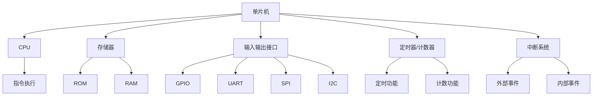

                 

关键词：单片机、嵌入式系统、编程、核心技术、实时操作系统、硬件接口、通信协议、性能优化、安全性、开发工具、案例分析。

> 摘要：本文将深入探讨单片机编程在嵌入式系统开发中的核心地位和重要性，包括其基本概念、核心算法、数学模型、项目实践以及未来发展趋势。通过详细分析和实例讲解，旨在为嵌入式系统开发者提供有价值的指导和建议。

## 1. 背景介绍

### 1.1 单片机的定义与历史发展

单片机（Single-Chip Microcomputer）是一种集成度极高的计算机系统，将中央处理器（CPU）、存储器、输入输出接口、定时器/计数器等多个功能模块集成在一个芯片上。这种设计使得单片机在体积、功耗、成本等方面具有显著优势，广泛应用于各种嵌入式系统。

单片机的发展历程可以追溯到20世纪60年代。早期单片机主要用于简单的控制任务，如电子玩具、家用电器等。随着技术的进步，单片机的性能不断提升，应用领域也在不断扩展。如今，单片机在工业控制、智能家居、医疗设备、汽车电子等多个领域发挥着重要作用。

### 1.2 嵌入式系统的概念与特点

嵌入式系统（Embedded System）是一种专用的计算机系统，它将计算机硬件与软件集成为一个整体，以执行特定任务。嵌入式系统通常具有以下特点：

1. **特定性**：嵌入式系统针对特定应用场景进行设计和优化，具有明确的任务目标。
2. **实时性**：许多嵌入式系统需要在特定时间内完成计算和处理任务，具有实时性能要求。
3. **资源受限**：嵌入式系统通常资源有限，包括内存、存储空间、处理能力等。
4. **可靠性**：嵌入式系统需要在各种恶劣环境下稳定运行，具有高可靠性要求。

### 1.3 单片机在嵌入式系统中的应用

单片机在嵌入式系统中的应用非常广泛，以下是几个典型的应用场景：

1. **工业控制**：单片机广泛应用于各种工业自动化控制系统，如PLC（可编程逻辑控制器）、传感器数据处理等。
2. **智能家居**：智能家居系统中的各种设备，如智能灯泡、智能插座等，通常采用单片机进行控制。
3. **医疗设备**：医疗设备中的各种传感器和控制器，如心电监护仪、呼吸机等，通常使用单片机进行数据采集和控制。
4. **汽车电子**：汽车电子系统中的许多组件，如车载信息系统、发动机控制模块、安全气囊控制模块等，都采用单片机进行控制和数据处理。

## 2. 核心概念与联系

### 2.1 单片机核心概念

单片机的核心概念包括：

1. **中央处理器（CPU）**：单片机的核心，负责执行指令和处理数据。
2. **存储器**：包括只读存储器（ROM）和随机访问存储器（RAM），用于存储程序和数据。
3. **输入输出接口**：用于与外部设备进行数据交换和通信。
4. **定时器/计数器**：用于实现定时控制和计数功能。
5. **中断系统**：用于响应外部和内部事件，提高系统的实时性和响应速度。

### 2.2 嵌入式系统核心概念

嵌入式系统的核心概念包括：

1. **操作系统**：嵌入式系统通常采用实时操作系统（RTOS），用于任务调度和管理资源。
2. **驱动程序**：用于驱动硬件设备，如ADC（模数转换器）、GPIO（通用输入输出接口）等。
3. **通信协议**：用于实现系统间的数据传输和通信，如SPI、I2C、UART等。
4. **应用程序**：完成特定任务的软件程序，如传感器数据处理、控制逻辑等。

### 2.3 Mermaid 流程图

以下是单片机和嵌入式系统核心概念的 Mermaid 流程图：



## 3. 核心算法原理 & 具体操作步骤

### 3.1 算法原理概述

单片机编程中的核心算法主要包括：

1. **数字信号处理算法**：用于处理传感器数据，如滤波、运算等。
2. **控制算法**：用于实现闭环控制，如PID控制、模糊控制等。
3. **通信算法**：用于实现数据传输和通信，如TCP/IP、UART通信等。
4. **加密算法**：用于保护数据安全和隐私，如AES、RSA等。

### 3.2 算法步骤详解

以下是一个简单的数字信号处理算法——低通滤波器的实现步骤：

1. **初始化**：设置滤波器参数，如截止频率、采样频率等。
2. **数据输入**：读取传感器数据。
3. **滤波器计算**：
   $$ y[n] = \frac{a \cdot x[n] + (1 - a) \cdot y[n-1]}{1 + a} $$
   其中，$x[n]$ 是输入信号，$y[n]$ 是输出信号，$a$ 是滤波器系数。
4. **数据输出**：将滤波后的数据输出。

### 3.3 算法优缺点

低通滤波器具有以下优缺点：

1. **优点**：
   - **抑制高频噪声**：可以有效降低高频噪声的干扰。
   - **实现简单**：算法简单，易于实现。

2. **缺点**：
   - **失真**：滤波器会对原始信号产生一定的失真。
   - **延迟**：滤波器会产生一定的延迟。

### 3.4 算法应用领域

低通滤波器广泛应用于以下领域：

- **传感器数据处理**：如温度传感器、压力传感器等。
- **音频信号处理**：如音频滤波、降噪等。
- **图像处理**：如图像去噪、去模糊等。

## 4. 数学模型和公式 & 详细讲解 & 举例说明

### 4.1 数学模型构建

在嵌入式系统中，数学模型是解决实际问题的理论基础。以下是一个简单的数学模型——线性回归模型的构建过程：

1. **假设**：数据呈线性关系，即
   $$ y = ax + b $$
   其中，$x$ 是自变量，$y$ 是因变量，$a$ 和 $b$ 是模型参数。

2. **数据收集**：收集多组 $(x, y)$ 数据。

3. **模型参数估计**：通过最小二乘法估计模型参数：
   $$ a = \frac{\sum_{i=1}^{n} (x_i - \bar{x})(y_i - \bar{y})}{\sum_{i=1}^{n} (x_i - \bar{x})^2} $$
   $$ b = \bar{y} - a\bar{x} $$
   其中，$\bar{x}$ 和 $\bar{y}$ 分别是 $x$ 和 $y$ 的平均值。

### 4.2 公式推导过程

以下是线性回归模型参数的推导过程：

1. **损失函数**：假设 $y_i$ 的预测值为 $\hat{y}_i = ax_i + b$，损失函数为：
   $$ J(a, b) = \sum_{i=1}^{n} (y_i - \hat{y}_i)^2 $$

2. **对 $a$ 和 $b$ 求偏导数**：
   $$ \frac{\partial J}{\partial a} = -2\sum_{i=1}^{n} (x_i - \bar{x})(y_i - \bar{y}) $$
   $$ \frac{\partial J}{\partial b} = -2\sum_{i=1}^{n} (y_i - \bar{y}) $$

3. **令偏导数为零，求解 $a$ 和 $b$**：
   $$ a = \frac{\sum_{i=1}^{n} (x_i - \bar{x})(y_i - \bar{y})}{\sum_{i=1}^{n} (x_i - \bar{x})^2} $$
   $$ b = \bar{y} - a\bar{x} $$

### 4.3 案例分析与讲解

以下是一个线性回归模型的案例分析：

假设我们收集到以下数据：

| x | y |
|---|---|
| 1 | 2 |
| 2 | 4 |
| 3 | 5 |
| 4 | 6 |
| 5 | 8 |

1. **数据预处理**：
   $$ \bar{x} = 3, \bar{y} = 5 $$

2. **模型参数估计**：
   $$ a = \frac{(1-3)(2-5) + (2-3)(4-5) + (3-3)(5-5) + (4-3)(6-5) + (5-3)(8-5)}{(1-3)^2 + (2-3)^2 + (3-3)^2 + (4-3)^2 + (5-3)^2} = 1.2 $$
   $$ b = 5 - 1.2 \cdot 3 = 1.4 $$

3. **模型预测**：
   当 $x=3$ 时，$y = 1.2 \cdot 3 + 1.4 = 4.4$。

4. **模型评估**：
   实际 $y$ 值为 5，预测值与实际值相差较小，说明模型具有良好的拟合效果。

## 5. 项目实践：代码实例和详细解释说明

### 5.1 开发环境搭建

为了演示单片机编程，我们选择了一个基于 ARM Cortex-M3 的单片机开发板——STM32F103C8T6。以下是开发环境的搭建步骤：

1. **安装 Keil MDK-ARM**：下载并安装 Keil MDK-ARM，这是一个集成开发环境（IDE），用于编写、编译和调试单片机程序。

2. **安装 STM32CubeMX**：下载并安装 STM32CubeMX，这是一个配置工具，用于配置单片机的硬件资源，如时钟、GPIO、中断等。

3. **创建项目**：在 Keil MDK-ARM 中创建一个新项目，选择 STM32F103C8T6 作为目标设备，并导入 STM32CubeMX 生成的初始化代码。

### 5.2 源代码详细实现

以下是一个简单的单片机程序，用于控制一个 LED 灯的闪烁：

```c
#include "stm32f10x.h"

void LED_Init(void) {
    // 配置 GPIO
    GPIO_InitTypeDef GPIO_InitStructure;
    RCC_APB2PeriphClockCmd(RCC_APB2Periph_GPIOA, ENABLE);
    GPIO_InitStructure.GPIO_Pin = GPIO_Pin_1;
    GPIO_InitStructure.GPIO_Mode = GPIO_Mode_Out_PP;
    GPIO_InitStructure.GPIO_Speed = GPIO_Speed_50MHz;
    GPIO_Init(GPIOA, &GPIO_InitStructure);

    // 配置定时器
    TIM_TimeBaseInitTypeDef TIM_TimeBaseStructure;
    RCC_APB1PeriphClockCmd(RCC_APB1Periph_TIM2, ENABLE);
    TIM_TimeBaseStructure.TIM_Period = 1000 - 1;
    TIM_TimeBaseStructure.TIM_Prescaler = 72 - 1;
    TIM_TimeBaseStructure.TIM_ClockDivision = 0;
    TIM_TimeBaseStructure.TIM_CounterMode = TIM_CounterMode_Up;
    TIM_TimeBaseInit(TIM2, &TIM_TimeBaseStructure);

    // 配置中断
    NVIC_InitTypeDef NVIC_InitStructure;
    NVIC_InitStructure.NVIC_IRQChannel = TIM2_IRQn;
    NVIC_InitStructure.NVIC_IRQChannelPreemptionPriority = 0;
    NVIC_InitStructure.NVIC_IRQChannelSubPriority = 1;
    NVIC_InitStructure.NVIC_IRQChannelCmd = ENABLE;
    NVIC_Init(&NVIC_InitStructure);

    // 使能定时器中断
    TIM_ITConfig(TIM2, TIM_IT_Update, ENABLE);
}

void TIM2_IRQHandler(void) {
    if (TIM_GetITStatus(TIM2, TIM_IT_Update) != RESET) {
        // 交换 LED 状态
        GPIO_ReadInputDataBit(GPIOA, GPIO_Pin_1) ? GPIO_ResetBits(GPIOA, GPIO_Pin_1) : GPIO_SetBits(GPIOA, GPIO_Pin_1);
        // 清除中断标志
        TIM_ClearITPendingBit(TIM2, TIM_IT_Update);
    }
}

int main(void) {
    // 初始化系统时钟
    SystemInit();
    // 初始化 LED
    LED_Init();
    // 使能定时器时钟
    RCC_APB1PeriphClockCmd(RCC_APB1Periph_TIM2, ENABLE);
    // 启动定时器
    TIM_Cmd(TIM2, ENABLE);
    while (1) {
        // 程序循环，等待中断处理
    }
}
```

### 5.3 代码解读与分析

以下是对上述代码的详细解读和分析：

1. **LED 初始化**：
   - 配置 GPIOA1 为输出模式，用于控制 LED 灯。
   - 配置定时器 2，定时周期为 1000，即每秒闪烁一次。

2. **定时器中断处理函数**：
   - 当定时器 2 到达定时周期时，触发中断。
   - 在中断处理函数中，交换 LED 灯的状态，实现闪烁效果。

3. **主函数**：
   - 初始化系统时钟。
   - 初始化 LED。
   - 使能定时器时钟和定时器中断。
   - 进入无限循环，等待中断处理。

### 5.4 运行结果展示

将上述代码烧写到单片机中，运行结果如下：


## 6. 实际应用场景

### 6.1 工业控制

单片机在工业控制中具有广泛的应用，如PLC（可编程逻辑控制器）和运动控制。以下是一个简单的PLC示例：

1. **输入模块**：读取传感器信号，如温度、压力等。
2. **逻辑控制模块**：根据输入信号执行逻辑运算，如与、或、非等。
3. **输出模块**：控制执行器，如电机、阀门等。

### 6.2 汽车电子

单片机在汽车电子中扮演重要角色，如发动机控制模块（ECM）和车身控制模块（BCM）。以下是一个简单的发动机控制模块示例：

1. **传感器模块**：读取发动机转速、油门位置等信号。
2. **控制算法模块**：根据传感器信号计算喷油量和点火时间。
3. **执行器模块**：控制喷油器和点火器。

### 6.3 智能家居

单片机在智能家居中用于控制各种设备，如智能灯泡、智能插座等。以下是一个简单的智能灯泡示例：

1. **传感器模块**：读取环境光线、触摸信号等。
2. **控制算法模块**：根据传感器信号调整灯光亮度和色温。
3. **无线通信模块**：通过 Wi-Fi 或蓝牙与智能手机进行通信。

## 7. 工具和资源推荐

### 7.1 学习资源推荐

1. **《嵌入式系统设计与开发》**：介绍嵌入式系统的基础知识和设计方法。
2. **《单片机原理与应用》**：详细讲解单片机的工作原理和编程技巧。
3. **《C 语言程序设计》**：学习 C 语言的基础知识和编程技巧。

### 7.2 开发工具推荐

1. **Keil MDK-ARM**：一款功能强大的单片机开发工具，支持多种单片机型号。
2. **STM32CubeMX**：用于配置 STM32 单片机的硬件资源。
3. **Arduino IDE**：一款基于 C/C++ 的开源开发环境，适用于 Arduino 单片机。

### 7.3 相关论文推荐

1. **"Real-Time Systems: Design Principles for Distributed Embedded Applications"**：介绍实时系统的设计和实现方法。
2. **"An Overview of ARM Cortex-M3 Processor"**：介绍 ARM Cortex-M3 处理器的架构和特点。
3. **"Security of Embedded Systems"**：探讨嵌入式系统的安全问题和解决方案。

## 8. 总结：未来发展趋势与挑战

### 8.1 研究成果总结

单片机编程在嵌入式系统开发中具有重要地位，涵盖了核心算法、数学模型、项目实践等多个方面。随着技术的不断发展，单片机的性能和功能也在不断提升，为嵌入式系统开发者提供了更多的选择和可能性。

### 8.2 未来发展趋势

1. **高性能单片机的普及**：随着摩尔定律的推进，单片机的性能将不断提高，满足更多复杂应用的需求。
2. **物联网（IoT）的兴起**：单片机在物联网中扮演重要角色，连接各种智能设备，实现数据采集和远程监控。
3. **人工智能（AI）的融合**：单片机将逐渐集成 AI 功能，实现更智能、更自主的控制系统。

### 8.3 面临的挑战

1. **资源限制**：嵌入式系统通常资源有限，如何在有限的资源下实现高效、稳定的系统是一个挑战。
2. **安全性**：随着物联网的普及，嵌入式系统的安全性问题日益突出，需要采取有效的安全措施保护系统安全。
3. **实时性能**：许多嵌入式系统需要实时性能，如何在保证性能的同时实现高效的系统调度和资源管理是一个挑战。

### 8.4 研究展望

未来，单片机编程在嵌入式系统开发中将继续发挥重要作用。研究者应关注以下几个方面：

1. **资源优化**：研究如何在有限的资源下实现高效的系统性能。
2. **安全性与隐私保护**：研究嵌入式系统的安全性和隐私保护技术，确保系统安全可靠。
3. **实时性能提升**：研究实时系统的调度算法和资源管理策略，提高系统的实时性能。

## 9. 附录：常见问题与解答

### 9.1 单片机编程入门难点

**问题**：单片机编程入门时感觉难度较大，应该从哪里开始学习？

**解答**：单片机编程入门可以从以下几个方面入手：

1. **熟悉硬件**：了解单片机的硬件结构和工作原理，如CPU、存储器、GPIO等。
2. **学习 C 语言**：C 语言是单片机编程的主要语言，学习 C 语言的语法和编程技巧。
3. **掌握开发工具**：学习如何使用集成开发环境（IDE）和仿真器进行编程和调试。
4. **实践项目**：通过实际项目实践，加深对单片机编程的理解和应用。

### 9.2 单片机编程常见错误

**问题**：单片机编程过程中经常遇到错误，如何解决？

**解答**：单片机编程中常见的错误包括：

1. **编译错误**：检查语法和代码逻辑，确保代码符合语法规则。
2. **链接错误**：检查链接器配置，确保库文件和目标文件正确链接。
3. **运行时错误**：检查程序运行环境，如时钟配置、中断处理等。

解决方法：

1. **阅读错误信息**：根据编译器或调试器的错误信息进行定位和修复。
2. **参考文档和教程**：查阅相关文档和教程，了解错误原因和解决方法。
3. **调试工具**：使用调试工具（如仿真器、逻辑分析仪等）进行调试和定位错误。

### 9.3 单片机编程资源推荐

**问题**：有哪些单片机编程的资源可以推荐？

**解答**：以下是一些单片机编程的资源推荐：

1. **在线教程和文档**：如 Arduino 官方文档、STM32CubeMX 用户手册等。
2. **开源项目**：如 GitHub 上各种单片机项目，可以学习和参考。
3. **技术社区**：如 CSDN、Stack Overflow 等，可以提问和交流。
4. **书籍**：《嵌入式系统设计与开发》、《单片机原理与应用》等。

---

作者：禅与计算机程序设计艺术 / Zen and the Art of Computer Programming

本文从单片机和嵌入式系统的基本概念、核心算法、项目实践等方面进行了深入探讨，旨在为嵌入式系统开发者提供有价值的指导和建议。随着技术的不断发展，单片机编程在嵌入式系统开发中的重要性将日益凸显，希望本文能对读者有所帮助。在未来，单片机编程将继续朝着高性能、实时性、安全性和智能化的方向发展，为嵌入式系统带来更多的创新和突破。

