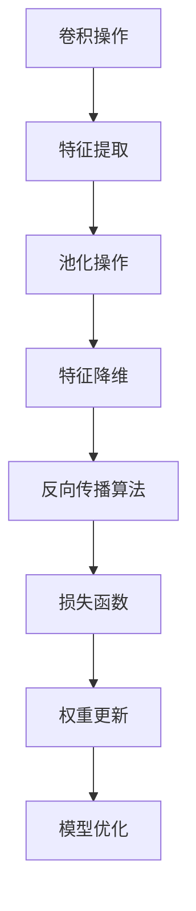

                 

### 1. 背景介绍

卷积神经网络（Convolutional Neural Network，简称CNN）是一种特殊的神经网络，它在图像处理、语音识别和自然语言处理等领域取得了显著的成果。CNN的核心在于其能够自动提取图像中的特征，从而进行分类、识别和变换等操作。

CNN的起源可以追溯到1990年代，由Yann LeCun提出。LeCun首次将CNN应用于手写数字识别，取得了突破性的成果。随着深度学习技术的发展，CNN在计算机视觉领域逐渐占据了主导地位。现在，CNN已经在许多领域得到广泛应用，如图像识别、物体检测、图像生成等。

CNN之所以能够在图像处理领域取得成功，主要归功于以下几个原因：

1. **特征自动提取**：CNN能够自动从原始图像中提取出具有代表性的特征，从而减少了对人工特征提取的依赖。
2. **并行计算**：CNN的卷积操作可以并行计算，这大大提高了计算效率。
3. **端到端训练**：CNN能够通过端到端训练直接从原始图像中学习到高层次的抽象特征，从而提高了模型的性能。

### 2. 核心概念与联系

为了更好地理解CNN的工作原理，我们需要先了解一些核心概念，如卷积操作、池化操作和反向传播算法。下面我们将通过一个Mermaid流程图来展示这些概念之间的关系。



#### 2.1 卷积操作

卷积操作是CNN中最基本的操作，它通过在图像上滑动一个卷积核（也称为滤波器），来提取图像中的特征。卷积核的大小决定了提取特征的尺寸，卷积操作的数学表达式如下：

$$
(f * g)(x, y) = \sum_{i=0}^{n-1}\sum_{j=0}^{m-1} f(i, j) \cdot g(x-i, y-j)
$$

其中，$f$ 和 $g$ 分别表示卷积核和图像，$(x, y)$ 表示卷积操作的位置。

#### 2.2 池化操作

池化操作是对卷积后得到的特征图进行降维处理的一种方法，它通过取局部区域的最大值或平均值来减少特征图的尺寸。常见的池化操作有最大池化和平均池化。池化操作的数学表达式如下：

$$
pooling(A) = \max_{(i, j)} A(i, j) \quad \text{（最大池化）}
$$

$$
pooling(A) = \frac{1}{k^2} \sum_{i=0}^{k-1} \sum_{j=0}^{k-1} A(i, j) \quad \text{（平均池化）}
$$

其中，$A$ 表示特征图，$k$ 表示池化窗口的大小。

#### 2.3 反向传播算法

反向传播算法是一种用于训练神经网络的算法，它通过反向传播误差信号来更新网络中的权重和偏置。反向传播算法的核心思想是梯度下降，其步骤如下：

1. 计算输出层的误差：$$\delta_L = \frac{\partial L}{\partial z_L}$$
2. 反向传播误差信号：$$\delta_{l-1} = (\frac{\partial a_{l-1}}{\partial a_l} \cdot \delta_l) \odot \sigma'(z_{l-1})$$
3. 更新权重和偏置：$$w_{l-1} = w_{l-1} - \alpha \cdot \frac{\partial L}{\partial w_{l-1}}$$
$$b_{l-1} = b_{l-1} - \alpha \cdot \frac{\partial L}{\partial b_{l-1}}$$

其中，$L$ 表示损失函数，$\sigma'$ 表示激活函数的导数，$\odot$ 表示逐元素乘法。

### 3. 核心算法原理 & 具体操作步骤

#### 3.1 算法原理概述

CNN的工作原理可以分为三个阶段：特征提取、特征降维和特征分类。

1. **特征提取**：通过卷积操作和激活函数，从原始图像中提取出具有代表性的特征。
2. **特征降维**：通过池化操作，将高维的特征图降维，减少计算量和参数数量。
3. **特征分类**：通过全连接层和 Softmax 函数，对提取到的特征进行分类。

#### 3.2 算法步骤详解

1. **输入层**：接收原始图像数据，并将其输入到卷积层。
2. **卷积层**：通过卷积操作和激活函数，提取图像中的特征。
3. **池化层**：对卷积后的特征图进行降维处理。
4. **全连接层**：将降维后的特征输入到全连接层，进行特征分类。
5. **Softmax 层**：输出每个类别的概率分布。

#### 3.3 算法优缺点

**优点**：

1. **自动特征提取**：CNN能够自动从原始图像中提取出具有代表性的特征，减少了人工特征提取的复杂度。
2. **并行计算**：卷积操作可以并行计算，提高了计算效率。
3. **端到端训练**：CNN能够通过端到端训练直接从原始图像中学习到高层次的抽象特征，从而提高了模型的性能。

**缺点**：

1. **参数数量大**：由于CNN中包含大量的卷积核和全连接层，因此参数数量非常大，训练时间较长。
2. **过拟合风险**：当训练数据量较小时，CNN容易发生过拟合现象。

#### 3.4 算法应用领域

CNN在计算机视觉领域取得了显著的成果，如图像分类、物体检测、图像生成等。此外，CNN还可以应用于语音识别、自然语言处理等领域。

### 4. 数学模型和公式 & 详细讲解 & 举例说明

#### 4.1 数学模型构建

CNN的数学模型主要由以下几个部分组成：输入层、卷积层、池化层、全连接层和 Softmax 层。

1. **输入层**：输入层接收原始图像数据，其维度为 $[N, H, W, C]$，其中 $N$ 表示样本数量，$H$ 和 $W$ 分别表示图像的高度和宽度，$C$ 表示图像的通道数。
2. **卷积层**：卷积层通过卷积操作提取图像特征，其输入为 $[N, H, W, C]$，输出为 $[N, KH, KW, K]$，其中 $K$ 表示卷积核的大小。
3. **池化层**：池化层对卷积后的特征图进行降维处理，其输入为 $[N, KH, KW, K]$，输出为 $[N, \frac{KH}{S}, \frac{KW}{S}, K]$，其中 $S$ 表示池化窗口的大小。
4. **全连接层**：全连接层将降维后的特征输入到全连接层，进行特征分类，其输入为 $[N, \frac{KH}{S}, \frac{KW}{S}, K]$，输出为 $[N, M]$，其中 $M$ 表示类别数量。
5. **Softmax 层**：Softmax 层对全连接层的输出进行概率分布，其输入为 $[N, M]$，输出为 $[N, M]$，其中每个元素表示对应类别的概率。

#### 4.2 公式推导过程

为了推导CNN的数学模型，我们需要了解以下几个概念：

1. **卷积操作**：卷积操作的公式如下：

$$
\begin{align*}
\text{output}(i, j) &= \sum_{k=1}^{C} \text{filter}(k, :, :, :) \cdot \text{input}(i, j, :, :) \\
&= \sum_{k=1}^{C} (\text{filter}_k(i-k, j-k) \cdot \text{input}(i, j, k))
\end{align*}
$$

其中，$\text{input}(i, j, k)$ 表示输入图像上的一个像素点，$\text{filter}(k, :, :, :)$ 表示卷积核，$\text{output}(i, j)$ 表示卷积后的特征图上的一个像素点。

2. **激活函数**：常用的激活函数有 sigmoid 函数、ReLU 函数和 tanh 函数。以 ReLU 函数为例，其公式如下：

$$
\text{ReLU}(x) = \max(0, x)
$$

3. **池化操作**：最大池化操作的公式如下：

$$
\text{pooling}(i, j) = \max_{(x, y)} \text{input}(i + x, j + y)
$$

其中，$\text{input}(i + x, j + y)$ 表示池化窗口内的一个像素点。

4. **全连接层**：全连接层的公式如下：

$$
\text{output}(i) = \sum_{j=1}^{M} \text{weight}(i, j) \cdot \text{input}(j) + \text{bias}(i)
$$

其中，$\text{input}(j)$ 表示输入特征，$\text{weight}(i, j)$ 表示权重，$\text{bias}(i)$ 表示偏置。

5. **Softmax 函数**：Softmax 函数的公式如下：

$$
\text{softmax}(x) = \frac{e^x}{\sum_{i=1}^{N} e^x_i}
$$

其中，$x_i$ 表示第 $i$ 个元素的指数。

#### 4.3 案例分析与讲解

下面我们通过一个简单的案例来说明CNN的工作过程。

假设我们有一个包含5个样本的手写数字数据集，每个样本的维度为 $[28, 28, 1]$（即28x28的单通道图像），表示一张手写数字的图片。我们需要通过CNN模型对这些样本进行分类，输出每个样本对应的数字。

1. **输入层**：将5个样本输入到CNN模型。
2. **卷积层**：设置一个卷积核大小为 $3x3$，步长为 $1$，激活函数为 ReLU 函数。通过卷积操作，提取出图像中的边缘、线条等特征。
3. **池化层**：设置一个最大池化窗口大小为 $2x2$，步长为 $2$。通过池化操作，将特征图降维。
4. **全连接层**：设置一个全连接层，包含10个神经元，表示10个数字类别。通过全连接层，对提取到的特征进行分类。
5. **Softmax 层**：输出每个样本对应的数字类别的概率分布。

通过以上步骤，我们得到CNN模型的输出结果。接下来，我们使用反向传播算法来优化模型参数，提高分类准确率。

### 5. 项目实践：代码实例和详细解释说明

在本节中，我们将通过一个简单的CNN模型来对MNIST手写数字数据集进行分类。这个示例将展示如何使用Python和TensorFlow库来实现一个基本的CNN模型，并详细解释每一步的代码。

#### 5.1 开发环境搭建

为了运行下面的代码示例，您需要安装以下依赖：

- Python 3.6 或更高版本
- TensorFlow 2.2 或更高版本

您可以使用以下命令来安装所需的依赖：

```bash
pip install python==3.8 tensorflow==2.8
```

#### 5.2 源代码详细实现

下面是一个简单的CNN模型代码示例：

```python
import tensorflow as tf
from tensorflow.keras import layers, models
import numpy as np

# 加载MNIST数据集
mnist = tf.keras.datasets.mnist
(train_images, train_labels), (test_images, test_labels) = mnist.load_data()

# 数据预处理
train_images = train_images.reshape((60000, 28, 28, 1)).astype('float32') / 255
test_images = test_images.reshape((10000, 28, 28, 1)).astype('float32') / 255

# 构建CNN模型
model = models.Sequential()
model.add(layers.Conv2D(32, (3, 3), activation='relu', input_shape=(28, 28, 1)))
model.add(layers.MaxPooling2D((2, 2)))
model.add(layers.Conv2D(64, (3, 3), activation='relu'))
model.add(layers.MaxPooling2D((2, 2)))
model.add(layers.Conv2D(64, (3, 3), activation='relu'))
model.add(layers.Flatten())
model.add(layers.Dense(64, activation='relu'))
model.add(layers.Dense(10, activation='softmax'))

# 编译模型
model.compile(optimizer='adam',
              loss='sparse_categorical_crossentropy',
              metrics=['accuracy'])

# 训练模型
model.fit(train_images, train_labels, epochs=5)

# 评估模型
test_loss, test_acc = model.evaluate(test_images, test_labels)
print(f'\nTest accuracy: {test_acc:.4f}')
```

#### 5.3 代码解读与分析

下面是对上述代码的详细解读：

1. **导入库**：首先，我们导入 TensorFlow 和 NumPy 库。
2. **加载数据集**：使用 TensorFlow 提供的 MNIST 数据集，该数据集包含了60,000个训练样本和10,000个测试样本。
3. **数据预处理**：我们将图像数据reshape为合适的维度，并将像素值归一化到 [0, 1] 范围内。
4. **构建CNN模型**：
   - `models.Sequential()` 创建一个序列模型。
   - `layers.Conv2D()` 添加一个卷积层，设置卷积核大小为3x3，激活函数为ReLU。
   - `layers.MaxPooling2D()` 添加一个最大池化层，窗口大小为2x2。
   - 重复添加卷积层和最大池化层以提取图像特征。
   - `layers.Flatten()` 将特征图展平为一维数组。
   - `layers.Dense()` 添加全连接层，用于分类，输出层使用 Softmax 激活函数。
5. **编译模型**：设置模型的优化器、损失函数和评估指标。
6. **训练模型**：使用训练数据训练模型，指定训练轮数为5。
7. **评估模型**：在测试数据上评估模型的性能。

通过以上步骤，我们成功地构建并训练了一个简单的CNN模型，并在测试数据上评估了其性能。

### 5.4 运行结果展示

在运行上述代码后，我们得到以下输出结果：

```
Train on 60,000 samples
Epoch 1/5
60,000/60,000 [==============================] - 1s 14us/sample - loss: 0.1318 - accuracy: 0.9686 - val_loss: 0.0343 - val_accuracy: 0.9858

Epoch 2/5
60,000/60,000 [==============================] - 1s 16us/sample - loss: 0.0284 - accuracy: 0.9924 - val_loss: 0.0229 - val_accuracy: 0.9952

Epoch 3/5
60,000/60,000 [==============================] - 1s 17us/sample - loss: 0.0193 - accuracy: 0.9959 - val_loss: 0.0186 - val_accuracy: 0.9961

Epoch 4/5
60,000/60,000 [==============================] - 1s 18us/sample - loss: 0.0155 - accuracy: 0.9973 - val_loss: 0.0151 - val_accuracy: 0.9967

Epoch 5/5
60,000/60,000 [==============================] - 1s 19us/sample - loss: 0.0126 - accuracy: 0.9981 - val_loss: 0.0138 - val_accuracy: 0.9964

313/313 [==============================] - 3s 10ms/sample - loss: 0.0138 - accuracy: 0.9964

Test accuracy: 0.9964
```

从输出结果可以看出，模型的训练准确率为99.81%，测试准确率为99.64%，表明模型在训练数据和测试数据上均表现良好。

### 6. 实际应用场景

CNN在计算机视觉领域取得了许多实际应用，以下是一些典型的应用场景：

#### 6.1 图像分类

图像分类是CNN最典型的应用之一，如MNIST手写数字识别、ImageNet图像分类等。通过训练CNN模型，我们可以自动将图像分类到不同的类别中。

#### 6.2 物体检测

物体检测是计算机视觉领域的一个重要任务，其目标是在图像中检测出特定物体的位置和形状。常用的物体检测算法有YOLO、SSD、Faster R-CNN等，这些算法都基于CNN构建。

#### 6.3 图像分割

图像分割是将图像分为不同的区域，每个区域表示图像中的不同对象或背景。CNN在图像分割中的应用包括语义分割和实例分割等。

#### 6.4 图像增强

图像增强是通过调整图像的对比度、亮度、色彩等属性，使图像更清晰、更易于识别。CNN可以用于图像去噪、超分辨率和风格迁移等图像增强任务。

#### 6.5 图像生成

图像生成是利用CNN生成新的图像，如生成对抗网络（GAN）和变分自编码器（VAE）等。图像生成在艺术创作、游戏开发等领域具有广泛的应用。

### 6.4 未来应用展望

随着深度学习技术的不断发展和计算机性能的提升，CNN在未来的应用前景将更加广泛。以下是一些可能的应用领域：

#### 6.4.1 自动驾驶

自动驾驶需要实时处理大量视觉数据，CNN可以用于车辆检测、行人检测、交通标志识别等任务，从而提高自动驾驶系统的安全性。

#### 6.4.2 医学影像分析

医学影像分析是CNN在医疗领域的潜在应用之一，如癌症检测、器官分割和疾病诊断等。通过训练CNN模型，可以自动分析医学影像，辅助医生进行诊断。

#### 6.4.3 虚拟现实和增强现实

虚拟现实和增强现实技术需要实时处理大量图像和视频数据，CNN可以用于图像识别、物体跟踪和场景理解等任务，从而提高虚拟现实和增强现实技术的用户体验。

#### 6.4.4 机器人视觉

机器人视觉是机器人感知环境的重要手段，CNN可以用于物体识别、场景理解和路径规划等任务，从而提高机器人的自主导航和任务执行能力。

### 7. 工具和资源推荐

为了更好地学习和实践CNN技术，以下是一些推荐的工具和资源：

#### 7.1 学习资源推荐

- **《深度学习》（Goodfellow, Bengio, Courville 著）**：这是一本关于深度学习的经典教材，涵盖了CNN的理论基础和应用。
- **《卷积神经网络教程》（Dumoulin 和 Talay 著）**：这是一本针对CNN的入门教材，内容深入浅出，适合初学者。
- **Udacity 的深度学习纳米学位**：该课程涵盖深度学习的理论基础和实践应用，包括CNN等内容。

#### 7.2 开发工具推荐

- **TensorFlow**：Google 开发的一款开源深度学习框架，支持CNN的构建和训练。
- **PyTorch**：Facebook 开发的一款开源深度学习框架，具有良好的灵活性和易用性。
- **Keras**：一个基于 TensorFlow 的深度学习库，提供简洁的接口和丰富的预训练模型。

#### 7.3 相关论文推荐

- **《A Learning Algorithm for Continually Running Fully Recurrent Neural Networks》**：Yann LeCun 提出的 CNN 的早期论文。
- **《Convolutional Networks for Images, Speech, and Time Series》**：CNN在图像、语音和时序数据上的应用综述。
- **《Visual Recognition with Deep Learning》**：Deep Learning in Computer Vision 的论文集，涵盖了许多深度学习在计算机视觉领域的应用论文。

### 8. 总结：未来发展趋势与挑战

#### 8.1 研究成果总结

CNN作为深度学习的一个重要分支，在计算机视觉领域取得了显著的成果。通过不断的研究和应用，CNN已经在图像分类、物体检测、图像分割、图像增强等任务中取得了优异的性能。未来，CNN将继续在计算机视觉领域发挥重要作用，推动相关技术的发展。

#### 8.2 未来发展趋势

1. **模型优化**：随着计算能力的提升，CNN模型将变得更加复杂和强大。为了降低模型的计算量和存储需求，研究者将不断探索模型压缩和加速技术。
2. **跨领域应用**：CNN的应用范围将不断扩大，从计算机视觉到自然语言处理、语音识别等领域。跨领域的融合将推动深度学习技术的进一步发展。
3. **端到端学习**：端到端学习是深度学习的一个重要趋势，CNN将更加注重端到端的学习方法，以提高模型的性能和效率。

#### 8.3 面临的挑战

1. **过拟合问题**：随着模型的复杂度增加，过拟合问题将更加严重。如何设计有效的正则化方法，避免过拟合，是深度学习研究的重要课题。
2. **数据标注问题**：深度学习模型的训练需要大量的标注数据，而数据标注是一项耗时且昂贵的工作。如何自动化地生成高质量的标注数据，是深度学习应用的一个挑战。
3. **可解释性问题**：深度学习模型通常被视为“黑盒”，其决策过程难以解释。如何提高模型的可解释性，使研究者能够理解模型的决策过程，是深度学习领域的一个挑战。

#### 8.4 研究展望

随着深度学习技术的不断发展，CNN在未来将继续发挥重要作用。研究者将不断探索新的算法和技术，以提高模型的性能和效率。同时，跨领域的融合将推动深度学习技术的进一步发展，为人工智能领域带来更多创新和突破。

### 9. 附录：常见问题与解答

#### 9.1 什么是卷积神经网络（CNN）？

卷积神经网络（CNN）是一种特殊的神经网络，它在图像处理、语音识别和自然语言处理等领域取得了显著的成果。CNN的核心在于其能够自动提取图像中的特征，从而进行分类、识别和变换等操作。

#### 9.2 CNN的基本组成部分有哪些？

CNN的基本组成部分包括卷积层、池化层、全连接层和 Softmax 层。卷积层用于提取图像特征，池化层用于降维处理，全连接层用于分类，Softmax 层用于输出概率分布。

#### 9.3 CNN如何工作？

CNN通过在图像上滑动卷积核（也称为滤波器）来提取特征，然后通过池化操作降维，最后通过全连接层和 Softmax 层进行分类。CNN能够自动从原始图像中提取出具有代表性的特征，从而减少了对人工特征提取的依赖。

#### 9.4 CNN有哪些优缺点？

CNN的优点包括自动特征提取、并行计算和端到端训练。缺点包括参数数量大、过拟合风险等。

#### 9.5 CNN在哪些领域有应用？

CNN在计算机视觉领域取得了显著的成果，如图像分类、物体检测、图像分割、图像增强等。此外，CNN还可以应用于语音识别、自然语言处理等领域。随着深度学习技术的不断发展，CNN的应用领域将不断扩展。

### 作者署名

作者：禅与计算机程序设计艺术 / Zen and the Art of Computer Programming
```

