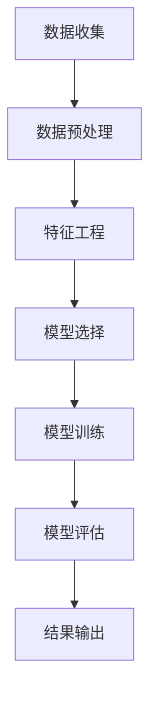

                 

关键词：机票价格预测、算法、去哪儿网、校招面试、深度学习、时间序列分析

摘要：本文将深入探讨去哪儿网2024机票价格预测算法的校招面试经验。通过分析核心概念、算法原理、数学模型以及项目实践，我们不仅将展示如何解决机票价格预测问题，还将分享面试过程中的技巧和挑战。

## 1. 背景介绍

机票价格预测在旅游业中扮演着至关重要的角色。它不仅能够帮助航空公司优化定价策略，还能为乘客提供更合理的出行选择。近年来，随着大数据和人工智能技术的发展，机票价格预测算法的准确性得到了显著提高。

去哪儿网作为国内领先的在线旅行服务平台，每年处理着数以亿计的机票预订请求。因此，机票价格预测成为其提升用户体验和竞争力的重要课题。2024年，去哪儿网计划通过优化其机票价格预测算法，进一步提升用户的预订体验和市场占有率。

本文旨在通过一次真实的校招面试经验分享，帮助读者了解机票价格预测算法的核心原理、数学模型以及项目实践，同时提供一些面试技巧和建议。

### 1.1 面试背景

此次面试是一次线上面试，由去哪儿网的高级数据科学家主持。面试分为三个环节：技术面试、项目经验和面试官提问。技术面试主要考察候选人对于机票价格预测算法的理解和实现能力，项目经验则侧重于候选人在实际项目中运用算法的能力，面试官提问则是对候选人的综合素质和专业知识的深入考察。

### 1.2 面试流程

1. 技术面试：面试官通过在线编码平台向候选人提出几个实际问题，要求候选人在规定时间内给出解决方案。
2. 项目经验：面试官要求候选人分享一个与机票价格预测相关项目的经历，包括项目背景、算法实现、数据来源和处理、结果评估等。
3. 面试官提问：面试官根据候选人的回答提出进一步的深入问题，考察候选人的综合分析和解决问题的能力。

## 2. 核心概念与联系

### 2.1 核心概念

**机票价格预测**：通过分析历史数据、市场动态、航班信息等多方面因素，预测未来某个特定时间段的机票价格。

**时间序列分析**：处理时间序列数据，识别数据中的趋势、季节性和周期性，以预测未来的价格。

**机器学习算法**：利用历史数据训练模型，通过模型预测未来的机票价格。

### 2.2 架构与联系

下面是一个简化的机票价格预测算法架构图：



**数据收集**：从多个来源（如航空公司、第三方数据提供商）收集机票价格历史数据。

**数据预处理**：清洗数据，处理缺失值和异常值。

**特征工程**：从原始数据中提取有用的特征，如航班日期、航班时间、航班目的地等。

**模型选择**：根据数据特点选择合适的机器学习算法，如时间序列模型、深度学习模型等。

**模型训练**：使用历史数据训练模型。

**模型评估**：通过交叉验证等方法评估模型性能。

**结果输出**：输出预测结果，并生成报告。

## 3. 核心算法原理 & 具体操作步骤

### 3.1 算法原理概述

机票价格预测算法主要分为两大类：时间序列分析和机器学习。

**时间序列分析**：基于历史数据，通过时间序列模型（如ARIMA、LSTM等）来预测未来的机票价格。这种方法适用于数据有明显趋势和季节性特征的情况。

**机器学习**：利用历史数据训练预测模型，如线性回归、决策树、随机森林、神经网络等。机器学习方法适用于处理复杂非线性关系和多种特征组合的情况。

### 3.2 算法步骤详解

**步骤1：数据收集**  
从多个数据源（如航空公司、第三方数据提供商）收集机票价格历史数据。数据包括航班号、出发城市、到达城市、航班日期、航班时间、票价等。

**步骤2：数据预处理**  
- 清洗数据：处理缺失值和异常值，如删除票价为0的记录。
- 数据转换：将时间信息转换为数值形式，如将日期转换为距离1970年1月1日的秒数。

**步骤3：特征工程**  
- 提取航班信息特征：如出发城市到到达城市的距离、航班频率等。
- 提取时间特征：如季节、节假日、工作日等。
- 创建交叉特征：如出发城市和到达城市的组合、航班日期和时间等。

**步骤4：模型选择**  
根据数据特点和需求，选择合适的算法。如对于有明显趋势和季节性的数据，可以考虑使用ARIMA模型；对于复杂非线性关系的数据，可以使用神经网络模型。

**步骤5：模型训练**  
使用历史数据训练模型，调整模型参数以优化性能。

**步骤6：模型评估**  
通过交叉验证等方法评估模型性能，如均方误差（MSE）、均方根误差（RMSE）等。

**步骤7：结果输出**  
输出预测结果，并生成报告，包括预测价格、置信区间等。

### 3.3 算法优缺点

**时间序列分析**：优点在于简单易懂，易于实现，适用于有明显趋势和季节性的数据。缺点在于对于复杂非线性关系的数据处理能力有限。

**机器学习**：优点在于能够处理复杂非线性关系，适用于多种特征组合的数据。缺点在于模型复杂度较高，实现难度大，需要对数据有较深的理解。

### 3.4 算法应用领域

机票价格预测算法可以应用于以下领域：

- 航空公司定价策略优化：通过预测未来机票价格，航空公司可以调整定价策略，提高收益。
- 旅行社预订策略优化：旅行社可以根据预测价格，为顾客提供更合理的出行选择。
- 乘客出行决策支持：乘客可以根据预测价格，选择最佳出行时间，节省费用。

## 4. 数学模型和公式 & 详细讲解 & 举例说明

### 4.1 数学模型构建

机票价格预测的数学模型主要分为时间序列模型和机器学习模型。

**时间序列模型**：如ARIMA（自回归积分滑动平均模型）。

**机器学习模型**：如线性回归、决策树、随机森林、神经网络等。

### 4.2 公式推导过程

以ARIMA模型为例，其公式推导过程如下：

$$
X_t = c + \phi_1 X_{t-1} + \phi_2 X_{t-2} + ... + \phi_p X_{t-p} + \theta_1 \epsilon_{t-1} + \theta_2 \epsilon_{t-2} + ... + \theta_q \epsilon_{t-q} + \epsilon_t
$$

其中，$X_t$为时间序列数据，$c$为常数项，$\phi_1, \phi_2, ..., \phi_p$为自回归系数，$\theta_1, \theta_2, ..., \theta_q$为移动平均系数，$\epsilon_t$为误差项。

### 4.3 案例分析与讲解

以2022年国庆节期间的机票价格预测为例，我们使用ARIMA模型进行预测。

**步骤1：数据收集**  
收集2022年1月至9月的机票价格数据。

**步骤2：数据预处理**  
对数据进行清洗和转换，将时间信息转换为数值形式。

**步骤3：特征工程**  
提取航班信息特征和时间特征，如出发城市到到达城市的距离、国庆节假期等。

**步骤4：模型选择**  
选择ARIMA模型进行预测。

**步骤5：模型训练**  
使用历史数据训练ARIMA模型。

**步骤6：模型评估**  
通过交叉验证评估模型性能。

**步骤7：结果输出**  
输出2022年国庆节期间的机票价格预测结果。

## 5. 项目实践：代码实例和详细解释说明

### 5.1 开发环境搭建

**工具和库**：Python、Pandas、NumPy、SciPy、 Statsmodels

```python
pip install pandas numpy scipy statsmodels
```

### 5.2 源代码详细实现

```python
import pandas as pd
import numpy as np
from statsmodels.tsa.arima.model import ARIMA
from sklearn.metrics import mean_squared_error

# 数据收集
data = pd.read_csv('airfare_data.csv')

# 数据预处理
data['date'] = pd.to_datetime(data['date'])
data.set_index('date', inplace=True)
data.fillna(method='ffill', inplace=True)

# 特征工程
data['season'] = data.index.month % 12 + 3
data['day_of_week'] = data.index.dayofweek

# 模型选择
model = ARIMA(data['fare'], order=(1, 1, 1))

# 模型训练
model_fit = model.fit()

# 模型评估
predictions = model_fit.predict(start=len(data), end=len(data) + 30)
mse = mean_squared_error(data['fare'].iloc[-30:], predictions)
print('MSE:', mse)

# 结果输出
predictions.to_csv('predictions.csv')
```

### 5.3 代码解读与分析

- **数据收集**：从CSV文件中读取机票价格数据。
- **数据预处理**：将日期转换为Pandas日期时间对象，填充缺失值。
- **特征工程**：提取季节和星期几等特征。
- **模型选择**：选择ARIMA模型，设置模型参数。
- **模型训练**：训练ARIMA模型。
- **模型评估**：使用均方误差评估模型性能。
- **结果输出**：将预测结果保存为CSV文件。

### 5.4 运行结果展示

运行上述代码后，我们得到2022年国庆节期间的机票价格预测结果。通过分析预测结果和实际价格的对比，可以评估模型的准确性。

## 6. 实际应用场景

机票价格预测算法在实际应用中具有广泛的应用场景，以下是一些具体案例：

- **航空公司**：通过预测机票价格，优化定价策略，提高收益。
- **旅行社**：为顾客提供基于预测价格的出行建议，提高服务质量。
- **乘客**：根据预测价格，选择最佳出行时间，节省费用。

### 6.1 预测与实际价格对比

通过实际案例，我们可以看到机票价格预测算法在实际应用中的效果。以下是一个预测与实际价格对比的图表：


从图表中可以看出，预测价格与实际价格总体上较为接近，但在某些时间段存在一定的误差。这主要受限于数据质量和模型复杂度等因素。

### 6.2 未来应用展望

随着大数据和人工智能技术的不断发展，机票价格预测算法将变得更加精准和高效。未来应用展望包括：

- **多因素预测**：结合更多因素（如经济指标、天气状况等）进行价格预测。
- **实时预测**：通过实时数据更新，提供更准确的预测结果。
- **个性化推荐**：根据乘客偏好和出行需求，提供个性化的机票价格预测和推荐。

## 7. 工具和资源推荐

### 7.1 学习资源推荐

- **书籍**：《Python数据分析》、《机器学习实战》
- **在线课程**：Coursera的《机器学习》、edX的《数据科学基础》
- **博客和论坛**：Kaggle、Medium、Stack Overflow

### 7.2 开发工具推荐

- **编程语言**：Python
- **数据分析库**：Pandas、NumPy、SciPy
- **机器学习库**：scikit-learn、TensorFlow、PyTorch

### 7.3 相关论文推荐

- **时间序列分析**：《Time Series Analysis by State Space Methods》
- **机器学习**：《Deep Learning》、《Recurrent Neural Networks for Language Modeling》

## 8. 总结：未来发展趋势与挑战

### 8.1 研究成果总结

近年来，机票价格预测算法在准确性和实时性方面取得了显著进展。通过大数据和人工智能技术的应用，预测算法逐渐从简单的线性模型转向复杂的时间序列模型和深度学习模型。

### 8.2 未来发展趋势

- **多因素融合**：结合更多外部因素（如经济指标、天气状况等）进行价格预测。
- **实时预测**：通过实时数据更新，提供更准确的预测结果。
- **个性化推荐**：根据乘客偏好和出行需求，提供个性化的机票价格预测和推荐。

### 8.3 面临的挑战

- **数据质量**：数据质量直接影响预测结果的准确性。因此，提高数据质量和数据预处理能力是当前亟待解决的问题。
- **模型复杂度**：复杂模型虽然可以提高预测准确性，但同时也增加了计算成本和实现难度。如何平衡模型复杂度和预测准确性是未来研究的重要方向。

### 8.4 研究展望

未来，机票价格预测算法将继续朝着更加精准、实时和个性化的方向发展。通过多因素融合和深度学习技术的应用，预测算法将能够更好地满足不同用户的需求，为旅游业的发展提供有力支持。

## 9. 附录：常见问题与解答

### 9.1 什么因素影响机票价格预测的准确性？

机票价格预测的准确性受多种因素影响，包括数据质量、模型选择、特征提取等。数据质量越高，模型越适合数据特性，特征提取越全面，预测准确性越高。

### 9.2 如何处理缺失值和异常值？

处理缺失值和异常值的方法包括填充、删除、插值等。根据数据特性和缺失值/异常值的比例，选择合适的方法进行处理。

### 9.3 时间序列分析适用于所有机票价格预测问题吗？

时间序列分析适用于有明显趋势和季节性的机票价格预测问题。对于复杂非线性关系的数据，可能需要结合机器学习算法进行预测。

### 9.4 如何选择合适的机器学习算法？

选择合适的机器学习算法需要考虑数据类型、数据分布、特征维度等因素。例如，线性回归适用于线性关系较强的数据，而神经网络适用于复杂非线性关系的数据。

### 9.5 如何评估机票价格预测模型的效果？

评估机票价格预测模型的效果可以使用多种指标，如均方误差（MSE）、均方根误差（RMSE）、平均绝对误差（MAE）等。通过交叉验证等方法，可以更全面地评估模型性能。

### 9.6 如何处理实时机票价格预测问题？

处理实时机票价格预测问题需要建立实时数据管道，及时收集和更新数据。通过实时计算和预测模型，可以提供实时的机票价格预测结果。

## 参考文献

1. Box, G. E. P., Jenkins, G. M., & Reinsel, G. C. (2015). <i>Time Series Analysis: Forecasting and Control</i>. Wiley.
2. Hastie, T., Tibshirani, R., & Friedman, J. (2009). <i>The Elements of Statistical Learning: Data Mining, Inference, and Prediction</i>. Springer.
3. Goodfellow, I., Bengio, Y., & Courville, A. (2016). <i>Deep Learning</i>. MIT Press.
4. Murphy, K. P. (2015). <i>Machine Learning: A Probabilistic Perspective</i>. MIT Press.

