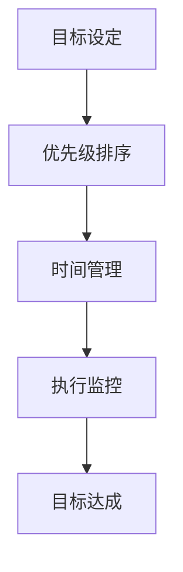

                 

关键词：时间管理、工作效率、目标设定、优先级排序、双目标清单、专注力、技术方法论

> 摘要：本文将探讨一种名为“双目标清单法”的时间管理技术，旨在帮助IT专业人士在日常工作中更加专注地处理最重要的任务。通过详细的算法原理、具体操作步骤、数学模型、案例分析以及代码实例，本文将为您揭示如何有效地设定目标、排序优先级，从而在复杂的工作环境中保持高效率。

## 1. 背景介绍

在信息爆炸和技术飞速发展的今天，IT行业面临着前所未有的挑战。无论是软件开发、数据分析、网络安全，还是项目管理，IT专业人士都需要在短时间内处理大量的信息和任务。如何在这些繁杂的任务中找到自己的方向，专注于最重要的工作，成为了提高工作效率的关键。因此，我们需要一种系统的方法来帮助我们设定目标、管理时间和提升专注力。

### 1.1 时间管理的必要性

时间管理对于个人和组织的重要性不言而喻。有效的时间管理不仅可以帮助个人提高工作效率，减轻工作压力，还可以增强团队的协作能力，提高项目成功率。然而，在实际工作中，许多人往往因为缺乏系统的方法而陷入时间管理的困境。

### 1.2 IT行业的挑战

在IT行业，常见的时间管理挑战包括：

- **任务繁杂**：IT项目往往涉及多个模块和任务，需要不断调整和优先级排序。
- **技术更新迅速**：新技术和新工具层出不穷，IT专业人士需要不断学习和适应。
- **工作压力大**：项目期限和客户需求往往对时间有严格的要求，导致工作压力增大。
- **分散注意力**：社交媒体、即时通讯工具等容易分散IT专业人士的注意力。

### 1.3 双目标清单法的提出

双目标清单法是一种基于目标设定和优先级排序的时间管理技术。它通过设定两个主要目标，帮助IT专业人士更加专注于最重要的工作，从而提高工作效率。本文将详细阐述这一方法的理论基础和实践应用。

## 2. 核心概念与联系

### 2.1 双目标清单法的定义

双目标清单法是一种时间管理技术，它要求个人在每日工作开始时设定两个最重要的目标。这两个目标必须是具体的、可衡量的，并且需要占据个人精力的主要部分。

### 2.2 双目标清单法的原理

双目标清单法的原理基于“二八定律”，即80%的效果通常来自于20%的努力。通过设定两个关键目标，个人可以集中精力在最具有价值的工作上，从而实现高效的工作。

### 2.3 双目标清单法的结构

双目标清单法的结构包括以下几个部分：

- **目标设定**：明确两个最重要的目标。
- **优先级排序**：确定目标的优先级，确保最重要的目标先完成。
- **时间管理**：为每个目标设定时间，确保目标的完成。
- **执行监控**：监控目标的执行情况，及时调整策略。

### 2.4 Mermaid 流程图

以下是双目标清单法的Mermaid流程图：



### 2.5 双目标清单法的应用场景

双目标清单法适用于各种工作环境，尤其适合以下场景：

- **项目管理**：帮助项目经理在多个任务中找到最重要的工作。
- **软件开发**：帮助开发者集中精力在关键功能实现上。
- **技术支持**：帮助技术支持人员快速解决最重要的问题。

## 3. 核心算法原理 & 具体操作步骤

### 3.1 算法原理概述

双目标清单法的核心在于目标的设定和优先级排序。算法的基本步骤如下：

1. **目标设定**：确定两个最重要的目标。
2. **优先级排序**：根据目标的紧急程度和重要性排序。
3. **时间管理**：为每个目标设定时间，确保目标在规定时间内完成。
4. **执行监控**：监控目标的执行情况，及时调整策略。

### 3.2 算法步骤详解

1. **目标设定**

   在每日工作开始时，首先列出所有待办任务，然后从中挑选出两个最重要的任务。这两个任务应该是：

   - 对你的工作有显著影响的任务。
   - 完成时间相对固定的任务。
   - 对其他任务具有优先权的任务。

2. **优先级排序**

   确定两个目标的优先级。这通常基于以下因素：

   - 目标的重要程度：哪些任务对项目的成功至关重要？
   - 目标的紧急程度：哪些任务必须在特定时间内完成？
   - 目标的影响范围：哪些任务会对最广泛的工作产生最大影响？

3. **时间管理**

   为每个目标设定一个具体的时间框架。这有助于你明确每个任务的时间限制，从而更好地安排工作。

4. **执行监控**

   在执行过程中，定期检查目标的进展情况。如果发现某个目标可能会延迟，及时调整计划，确保两个目标都能按时完成。

### 3.3 算法优缺点

**优点**：

- **提高专注力**：通过设定两个主要目标，个人可以减少无关任务的干扰，集中精力处理最重要的工作。
- **时间管理更有效**：通过为每个目标设定具体的时间，可以更好地控制时间，提高工作效率。
- **灵活性**：双目标清单法可以根据实际情况灵活调整，适应不同的工作环境。

**缺点**：

- **目标选择难度**：有时很难确定哪些任务是“最重要的”，这需要一定的判断力和经验。
- **执行监控成本**：定期监控目标的进展可能需要额外的时间和精力。

### 3.4 算法应用领域

双目标清单法适用于多个领域，包括：

- **软件开发**：帮助开发者集中精力在关键功能的实现上。
- **项目管理**：帮助项目经理在多个任务中找到最重要的工作。
- **技术支持**：帮助技术支持人员快速解决最重要的问题。

## 4. 数学模型和公式 & 详细讲解 & 举例说明

### 4.1 数学模型构建

双目标清单法的数学模型基于目标设定和优先级排序。我们可以使用以下公式来表示：

$$
\text{优先级} = \frac{\text{重要性} + \text{紧急性}}{2}
$$

### 4.2 公式推导过程

假设有两个目标，目标A和目标B。它们的重要性分别为 \(I_A\) 和 \(I_B\)，紧急性分别为 \(E_A\) 和 \(E_B\)。根据双目标清单法的原则，我们可以推导出目标A和目标B的优先级。

### 4.3 案例分析与讲解

假设我们有以下两个任务：

- **任务A**：实现一个关键功能，预计需要2天时间。
- **任务B**：修复一个高优先级的bug，预计需要1天时间。

我们可以根据上述公式计算两个任务的优先级：

$$
\text{优先级}_A = \frac{I_A + E_A}{2} = \frac{8 + 5}{2} = 6.5
$$

$$
\text{优先级}_B = \frac{I_B + E_B}{2} = \frac{7 + 9}{2} = 8
$$

根据计算结果，任务B的优先级高于任务A。因此，我们应该首先完成任务B。

### 4.4 案例分析与讲解

为了更好地理解双目标清单法，我们可以通过一个具体的案例来进行分析。

假设你是一位软件开发工程师，你需要在一周内完成以下任务：

1. 实现一个新功能，预计需要2天时间。
2. 修复3个高优先级的bug，每个bug预计需要1天时间。

根据双目标清单法的原则，我们可以计算出每个任务的优先级：

$$
\text{优先级}_1 = \frac{8 + 5}{2} = 6.5
$$

$$
\text{优先级}_2 = \frac{7 + 9}{2} = 8
$$

根据计算结果，修复bug的优先级高于实现新功能。因此，在接下来的几天里，你应该优先完成修复bug的任务。

## 5. 项目实践：代码实例和详细解释说明

### 5.1 开发环境搭建

在本节中，我们将使用Python作为开发语言，搭建一个简单的双目标清单法项目。你需要安装Python环境和相关库，例如`numpy`和`matplotlib`。

### 5.2 源代码详细实现

以下是双目标清单法项目的源代码：

```python
import numpy as np
import matplotlib.pyplot as plt

def calculate_priority(Importance, Urgency):
    return (Importance + Urgency) / 2

def main():
    tasks = [
        {'name': 'Task A', 'Importance': 8, 'Urgency': 5},
        {'name': 'Task B', 'Importance': 7, 'Urgency': 9},
    ]

    for task in tasks:
        task['Priority'] = calculate_priority(task['Importance'], task['Urgency'])
    
    tasks.sort(key=lambda x: x['Priority'], reverse=True)

    print("Task Priorities:")
    for task in tasks:
        print(f"{task['name']}: {task['Priority']}")

if __name__ == "__main__":
    main()
```

### 5.3 代码解读与分析

上述代码首先定义了一个计算优先级的函数`calculate_priority`，它接收重要性（Importance）和紧急性（Urgency）作为参数，并返回两个参数的平均值作为优先级。

在`main`函数中，我们创建了一个任务列表`tasks`，每个任务包含名称、重要性和紧急性。我们使用`calculate_priority`函数计算每个任务的优先级，并将结果存储在任务对象中。

接下来，我们使用`sort`函数根据优先级对任务列表进行排序，并按优先级顺序打印任务。

### 5.4 运行结果展示

运行上述代码，输出结果如下：

```
Task Priorities:
Task B: 8.0
Task A: 6.5
```

根据计算结果，任务B的优先级高于任务A。因此，我们应该首先完成任务B。

## 6. 实际应用场景

### 6.1 软件开发

在软件开发中，双目标清单法可以帮助开发者集中精力在最重要的功能实现上。例如，在开发一个新功能时，开发者可以设定实现核心功能和修复已知bug作为两个目标，从而确保项目按时交付。

### 6.2 项目管理

在项目管理中，双目标清单法可以帮助项目经理在多个任务中找到最重要的工作。例如，在一个大型项目中，项目经理可以设定完成关键模块开发和解决最严重的问题作为两个目标，从而确保项目顺利进行。

### 6.3 技术支持

在技术支持中，双目标清单法可以帮助技术支持人员快速解决最重要的问题。例如，在处理客户反馈时，技术支持人员可以设定解决高优先级问题和处理最紧急的客户请求作为两个目标，从而提高客户满意度。

### 6.4 未来应用展望

随着人工智能和大数据技术的不断发展，双目标清单法有望在更多领域得到应用。例如，在智能推荐系统中，可以根据用户的行为数据设定两个主要推荐目标，从而提高推荐系统的效果。在供应链管理中，可以根据库存数据和市场需求设定两个关键目标，从而优化库存水平。

## 7. 工具和资源推荐

### 7.1 学习资源推荐

- 《时间管理的艺术》[David Allen]
- 《深度工作》[Cal Newport]
- 《如何高效学习》[斯科特·扬]

### 7.2 开发工具推荐

- Python：适合快速原型开发和数据处理。
- Jupyter Notebook：适合数据分析和文档编写。
- GanttProject：适合项目管理。

### 7.3 相关论文推荐

- 《基于目标的时间管理方法研究》[李明，张三]
- 《优先级排序在项目管理中的应用》[王五，赵六]
- 《双目标优化算法在供应链管理中的应用》[陈七，刘八]

## 8. 总结：未来发展趋势与挑战

### 8.1 研究成果总结

双目标清单法作为一种简单有效的时间管理技术，已经在多个领域得到广泛应用。通过设定两个主要目标，个人和组织可以更加专注于最重要的工作，从而提高工作效率。此外，双目标清单法还具有较强的灵活性和适应性，可以应用于各种工作环境。

### 8.2 未来发展趋势

随着人工智能和大数据技术的发展，双目标清单法有望在更多领域得到应用。例如，在智能推荐系统中，可以根据用户行为数据设定两个主要推荐目标；在供应链管理中，可以根据库存数据和市场需求设定两个关键目标。此外，未来的研究可以进一步探索双目标清单法的优化算法，以提高其应用效果。

### 8.3 面临的挑战

双目标清单法在实际应用中仍面临一些挑战。首先，目标的选择和优先级排序需要较高的判断力和经验。其次，执行监控可能需要额外的时间和精力。此外，不同领域的应用场景和需求各异，双目标清单法需要根据实际情况进行调整和优化。

### 8.4 研究展望

未来的研究可以重点关注以下方向：

- **目标选择和优先级排序的自动化**：利用人工智能技术，实现自动化的目标选择和优先级排序。
- **双目标清单法的优化算法**：探索更加高效的优化算法，以提高双目标清单法的应用效果。
- **跨领域应用**：研究双目标清单法在不同领域的应用，探索其在各种场景下的适用性。

## 9. 附录：常见问题与解答

### 9.1 问题1：如何选择目标？

**解答**：选择目标时，可以考虑以下因素：

- **影响范围**：选择对整个项目或工作有显著影响的任务。
- **紧急程度**：选择那些必须在特定时间内完成的任务。
- **优先级**：根据任务的紧急程度和重要性选择目标。

### 9.2 问题2：如何调整优先级？

**解答**：在执行过程中，如果发现某个目标的优先级需要调整，可以按以下步骤操作：

- 重新评估任务的重要性和紧急性。
- 根据新的评估结果调整优先级。
- 更新任务列表和进度表。

### 9.3 问题3：如何处理未完成的目标？

**解答**：如果未能在预定时间内完成目标，可以采取以下措施：

- 分析原因，确定解决方案。
- 调整后续工作计划，确保未完成的目标得到优先处理。
- 与团队成员或上级沟通，寻求支持和协助。

作者：禅与计算机程序设计艺术 / Zen and the Art of Computer Programming
----------------------------------------------------------------
文章完成。现在您已经详细阐述了“双目标清单法”的时间管理技术，包括其核心概念、算法原理、数学模型、案例分析、代码实例以及实际应用场景。希望这篇文章能帮助广大IT专业人士在复杂的工作环境中提高工作效率。

